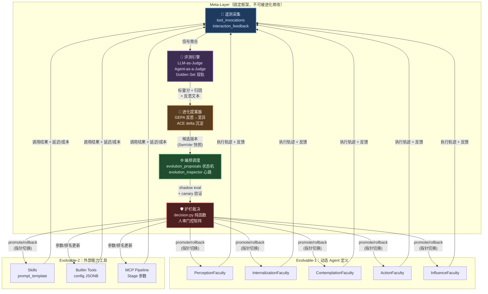

# 自进化 Agents Team 系统技术方案

> 本文遵循 [AGENTS.md](../../AGENTS.md) 的协作协议与循证要求。
>
> 设计核心锚定：
> - 调研基础：[自进化 Agents Team 调研](../../research/130-self-evolving-agents-team.md)
> - 理论先例：[Routine 迭代模式调研](../../research/110-routine-agent-iteration.md)
> - 子系统参考：[Routine 系统](../039-the-routine-system.md)、[Skills 设计](./skills.md)、[可观测性](./observability-genai.md)
> - 权威源：[engine/routine/decision.py](../../../apps/negentropy/src/negentropy/engine/routine/decision.py)（护栏范式）、[models/skill.py](../../../apps/negentropy/src/negentropy/models/skill.py)（版本快照范式）

---

## 0. 范围与定位

### 设计对象

| 层 | 名称 | 进化语义 | 改动通道 |
|----|------|---------|---------|
| Meta-Layer | **固定框架（进化基座）** | 不可被进化回路修改 | 仅 Git PR + 人工 Merge |
| Evolvable-1 | **动态 Agent 定义** | `system_prompt` / model / skills 挂载可进化 | DB `active_version` 指针切换 |
| Evolvable-2 | **外部能力工具** | Skills prompt_template / Builtin Tool config / MCP pipeline 参数可进化 | DB 版本表 + 缓存失效 |

**总纲**：进化 = 数据变更（DB 白名单字段），框架 = 代码（变更唯一通道 Git PR 人工 Merge，复用 Routine `pr_url` 产 PR 等待人工 Merge 的既有先例）。

**范围外**：模型权重训练/微调、框架代码的自动合并。

---

## 1. 理论锚点与核心论断

### 1.1 核心论断

本系统不是「从零造进化框架」，而是把平台已分散存在的四个进化原语收敛为一条统一的 **遥测 → 评测 → 提案 → 验证 → 门控发布** 流水线：

| 已有原语 | 实现位置 | 进化回路角色 |
|---------|---------|-------------|
| LLM-as-Judge 评测 | [engine/routine/evaluator.py](../../../apps/negentropy/src/negentropy/engine/routine/evaluator.py) | 评测引擎 |
| Reflexion 反思 | [engine/consolidation/reflection_generator.py](../../../apps/negentropy/src/negentropy/engine/consolidation/reflection_generator.py) | 进化算子的学习信号 |
| SemVer 版本快照 | [models/skill.py](../../../apps/negentropy/src/negentropy/models/skill.py) `skill_versions` 表 | 版本注册表 |
| 竞争择优 | perceives [pipeline_config.py](../../../apps/negentropy/src/negentropy/perceives/config/pipeline_config.py) `competition_mode` | A/B 对比验证 |

### 1.2 学术锚点

| 理论 | 来源 | 映射 |
|------|------|------|
| 统一闭环抽象 | Fang et al. (arXiv:2508.07407)<sup>[[1]](#ref1)</sup> | System Inputs→Agent System→Environment→Optimisers 对应 Dispatch→Execute→Evaluate→Decide |
| 评估器中心主义 | AlphaEvolve (arXiv:2506.13131)<sup>[[2]](#ref2)</sup> | 每个待进化对象必须先有可量化 evaluator |
| 反思驱动进化 | GEPA (arXiv:2507.19457, ICLR 2026 Oral)<sup>[[3]](#ref3)</sup> | (轨迹, 标量分, 反思文本) 三元组与 routines.reflections 同构 |
| 增量上下文进化 | ACE (arXiv:2510.04618, ICLR 2026)<sup>[[4]](#ref4)</sup> | Curator 确定性合并 + delta 更新，防 context collapse |
| 档案库进化 | DGM (arXiv:2505.22954)<sup>[[5]](#ref5)</sup> | 版本表应保留全部历史（含表现较差但多样的版本） |

---

## 2. 三层架构总览



### 2.1 「框架不自改」四道边界

参考 [engine/routine/decision.py](../../../apps/negentropy/src/negentropy/engine/routine/decision.py) 的护栏纯函数范式：

1. **晋升/回滚判据为纯函数硬编码**：新增 `engine/evolution/decision.py`，与 `routine/decision.py` 同构——无 IO、可单测、阈值不读自可被进化的表；
2. **DB 权限隔离**：进化 worker 使用独立 DB role，仅授予进化登记簿 + 资产版本表写权限，无法 UPDATE 框架配置表；
3. **进化对象白名单为代码常量**：枚举 `target_kind`（agent_prompt / skill_template / builtin_tool_config / mcp_pipeline），新增类型必须改代码走 PR；
4. **框架改进降级为 PR 提案**：由 Routine（Claude Code）起草 PR，人工 Merge，绝不自动合并。

---

## 3. 遥测子系统（数据地基）

### 3.1 现状盘点

| 表 | 覆盖范围 | 写入方 | 缺口 |
|----|---------|--------|------|
| `routine_iteration_events` | Claude Code 动作级 | `streaming_persister` | 仅 Routine 内 |
| `mcp_tool_runs` + events | trial UI / 知识抽取 | `McpToolExecutionService` | 非主运行时 |
| `tools` / `tool_executions` | ADK 工具调用 | **Dormant（无写入方）** | 核心缺口 |
| `traces` | OTel span 入库 | LiteLLM 回调 | LLM 调用级，非工具级 |
| `knowledge_feedback` | 用户反馈 | API | 仅知识域 |

### 3.2 新表 `tool_invocations`

统一工具调用事实表（append-only），关键字段：

```
tool_invocations
├── id                    UUID PK
├── caller_kind           ENUM(adk_agent, routine, skill_invoke, mcp_trial, scheduled_task)
├── agent_name            TEXT NULLABLE        -- 调用方 Agent
├── thread_id             UUID NULLABLE        -- 会话（松耦合，对齐 ToolExecution.run_id 注释）
├── routine_iteration_id  UUID NULLABLE        -- Routine 关联
├── tool_kind             ENUM(builtin, mcp, adk_function, skill)
├── tool_ref              TEXT                 -- 工具标识
├── tool_version          TEXT NULLABLE        -- 版本（skill 时为 SemVer）
├── skill_ref             TEXT NULLABLE        -- 技能展开时的技能标识
├── status                ENUM(success, error, denied, timeout)
├── latency_ms            INTEGER
├── error_class           TEXT NULLABLE
├── input_digest          TEXT NULLABLE        -- 截断摘要 + hash（16KB 上限）
├── output_digest         TEXT NULLABLE
├── tokens_in/out         INTEGER NULLABLE
├── cost_usd              FLOAT NULLABLE
├── trace_id/span_id      TEXT NULLABLE        -- 反查 Langfuse
├── canary_assignment     TEXT NULLABLE        -- 进化实验标记
├── outcome_score         FLOAT NULLABLE       -- 异步归因回填
├── outcome_source        TEXT NULLABLE        -- (routine_verdict, thread_feedback, attribution_job)
├── created_at            TIMESTAMPTZ
```

字段对齐 OTel `execute_tool` span schema（`gen_ai.tool.name` → `tool_ref`、`gen_ai.tool.type` → `tool_kind`、`gen_ai.tool.call.arguments/result` → `input/output_digest`）。

### 3.3 采集挂点（三源归一）

1. **ADK 侧**：新增 `before/after_tool_callback`（当前仓库未用，是新挂点）统一上报；
2. **Routine 侧**：由 `streaming_persister` 写 `routine_iteration_events` 时旁路双写；
3. **MCP trial 侧**：由 `McpToolExecutionService` 旁路双写。

### 3.4 聚合与反馈

- `tool_stats_daily` 聚合表：成功率 / p50·p95 延迟 / 成本 / 调用量，按 `tool_ref` + `version` 分桶；
- `interaction_feedback` 新表（对齐 `knowledge_feedback` 范式）：`thread_id` / `event_id` / `agent_name` / `feedback_type`(thumbs_up/down|rating|correction) / `score` / `comment` / `source`(human|code|llm_judge)；
- Langfuse 深接：`proposal_id` / `eval_run_id` / `canary_assignment` 写入 trace metadata。

---

## 4. 评测子系统

### 4.1 新表四件套

```
eval_suites
├── id                    UUID PK
├── target_kind           ENUM(agent, skill, builtin_tool, mcp_tool, pipeline)
├── target_ref            TEXT
├── scoring_config        JSONB (judge 模型 + rubric + 可选 gate 命令)
├── is_frozen             BOOLEAN DEFAULT false  -- 冻结 holdout 集标记
├── holdout_ratio         FLOAT DEFAULT 0.2      -- 冻结集占比
├── owner_id              UUID
├── visibility            ENUM(private, team, public)

eval_cases
├── id                    UUID PK
├── suite_id              UUID FK
├── input                 JSONB
├── expected              JSONB / rubric 文本
├── weight                FLOAT DEFAULT 1.0
├── tags                  TEXT[]
├── source                ENUM(manual, harvested, synthetic)
├── provenance_ref        TEXT NULLABLE           -- 采收来源（tool_invocation / thread）

eval_runs
├── id                    UUID PK
├── suite_id              UUID FK
├── target_kind/ref/version  TEXT
├── baseline_version      TEXT NULLABLE
├── trigger               ENUM(proposal, scheduled, manual)
├── score_mean / pass_rate / cost_total / latency_p95 / regression_count
├── status                ENUM(running, completed, failed)

eval_results
├── id                    UUID PK
├── run_id                UUID FK
├── case_id               UUID FK
├── score                 FLOAT
├── verdict               TEXT
├── output_digest         TEXT
├── judge_raw             JSONB                   -- 审计（对齐 evaluator.py 全过程审计）
```

### 4.2 评测执行器

复用 [engine/routine/evaluator.py](../../../apps/negentropy/src/negentropy/engine/routine/evaluator.py) 范式：LLM-as-Judge（`resolve_model_config_async` + `litellm.acompletion` + JSON 结构化输出 + 指数退避）+ 可选客观门控命令锚定评分。

### 4.3 Golden Set 双轨（Goodhart 防护）

- **公开集**（`is_frozen = false`）：提案优化时可见，允许迭代拟合；
- **冻结 holdout 集**（`is_frozen = true`）：仅晋升裁决时运行，**结果不回流 proposer**——防止单一指标过拟合。

### 4.4 在线信号融合

晋升判据 = **离线分 AND 在线金丝雀指标（成功率 / 成本 / 延迟 / 用户反馈）双确认**，任一退化即否决。权重与窗口硬编码在 `evolution/decision.py`。

### 4.5 用例采收回路

失败的 `tool_invocation` / 被 thumbs_down 的交互 / Routine 失败迭代 → 半自动转化为 `eval_case`（`source=harvested`），人审后入 suite——评测集随真实失败自动长大。

---

## 5. Agent 自迭代回路

### 5.1 版本化（先决条件）

新表 `agent_versions` 严格对齐 [models/skill.py](../../../apps/negentropy/src/negentropy/models/skill.py) 的 `skill_versions` 范式：

```
agent_versions
├── id                    UUID PK
├── agent_id              UUID FK → agents
├── version               VARCHAR(32)            -- SemVer（如 1.2.3）
├── snapshot              JSONB                  -- 冻结 system_prompt / model / skills / tools
├── origin                ENUM(code_sync, evolution, manual)
├── is_active             BOOLEAN DEFAULT false
├── is_stale              BOOLEAN DEFAULT false  -- 基线更新后标记
├── created_at            TIMESTAMPTZ
├── UNIQUE(agent_id, version)
```

`agents` 表新增：`active_version VARCHAR(32) NULLABLE`（指针）+ `baseline_origin TEXT`。

### 5.2 解析顺序改造

[agents/_dynamic_instruction.py](../../../apps/negentropy/src/negentropy/agents/_dynamic_instruction.py) 的加载逻辑改为：

```
active_version 指向的快照 > agents.system_prompt（代码 Sync 基线） > 代码硬编码 fallback
```

**Sync 改造**（解决 [interface/api.py](../../../apps/negentropy/src/negentropy/interface/api.py) 约 :2546 的覆写冲突）：
- `sync_negentropy_agents` 改为「只更新基线 + 落一条 `origin=code_sync` 的版本行，**绝不触碰 `active_version`**」；
- 进化版本晋升后若基线更新（代码改了 prompt），自动将该进化版本标记 `is_stale` 并要求重评——**显式拒绝自动三方合并**（交还人/重新进化）。

### 5.3 GEPA/ACE 式反思驱动 Proposer

输入 = 该 Agent 近期失败样本（`tool_invocations` + `interaction_feedback` + `routines.reflections`）+ 当前 prompt；
输出 = 结构化 `evolution_proposals`（diff + rationale + evidence 引用）。

实现范式复用 [engine/consolidation/reflection_generator.py](../../../apps/negentropy/src/negentropy/engine/consolidation/reflection_generator.py)（retry + JSON + 降级）。每次变异幅度受限（diff 行数上限 + prompt 长度硬上限约 1,500 字符，Decagon 经验：4 倍压缩仅损 0.8%）。

### 5.4 回路状态机

```
reflect → propose(draft)
  → shadow_eval（跑离线 suite，对比 baseline）
  → pending_approval（按风险等级可自动）
  → canary（thread/user 哈希分桶 N%，运行时在 InstructionProvider 处按 assignment 解析候选版本）
  → promote / rollback
```

- 晋升 = 改 `active_version` + `invalidate_cache(prefix="subagent:")`，60s 内全量生效；
- 回滚同理（秒级、无部署）；
- 金丝雀路由天然挂点：[config/model_resolver.py](../../../apps/negentropy/src/negentropy/config/model_resolver.py) 的 TTL 缓存（60s）按 assignment 分键。

### 5.5 与 Routine 闭环的关系

进化提案的*生成与验证*默认走轻量 in-engine worker（`consolidation_jobs` 队列范式）；仅当提案需要重型工作（如同时改 skill 资源、写评测用例文件）时，将其降级派发为一个 Routine（goal=改进提案、acceptance_criteria=评测达标），完整复用其预算守卫/审批/审计。

---

## 6. 技能/工具自迭代回路

### 6.1 Skills 进化（最低悬挂果实）

[models/skill.py](../../../apps/negentropy/src/negentropy/models/skill.py) 的 `skill_versions` 已就绪，补三件事：
1. per-skill `eval_suite`（评测驱动准入）；
2. proposer（变异 `prompt_template` / `default_config`）；
3. `skills` 表加 `active_version` 指针（区分「最新」与「已晋升」）。

Agent 侧 `name@semver` 锁定（`_parse_skill_ref` 已实现）使金丝雀可按 Agent 粒度灰度（部分 Agent 引用候选版）。

### 6.2 Builtin Tools 进化

进化对象 = `builtin_tools.config` JSONB（参数级，如检索 top_k / 超时 / Prompt 片段）。新增 `builtin_tool_versions` 快照表（同范式）。**credentials 永不进入快照与进化范围**（脱敏边界既有）。

### 6.3 MCP / Pipeline 进化

perceives 的 `competition_mode` 从「运行时每次竞争」升格为「进化证据源」——竞争评审结果回流为 `tool_invocations` 的相对效果数据，提案器据此调整 `StageToolConfig.rank/enabled` 与引擎参数。

注意：pipeline YAML 当前在配置文件不在 DB。Phase 3 仅 DB 化 stage 工具排序等安全子集，全量 DB 化留作远期议程。

### 6.4 工具效果三级评分

| 级别 | 信号来源 | 度量 |
|------|---------|------|
| 客观 | `tool_invocations` | status / latency_ms / cost_usd |
| 下游 | 归因 job | 调用后任务是否成功（从 routine verdict / thread feedback 反推） |
| 对比 | competition judge | 相对评分（多引擎并行时的 judge preference） |

### 6.5 Agent 自造技能（Phase 4，Voyager 式）

流程：Agent/Routine 起草 skill（沿用 [skill_templates/*.yaml](../../../apps/negentropy/src/negentropy/agents/skill_templates/) 模板 schema + SemVer 强校验）→ Jinja2 沙箱静态检查 → 沙箱试运行（[engine/sandbox/](../../../apps/negentropy/src/negentropy/engine/)）→ 影子评测 → **强制人审**（新技能一律 `pending_approval`，无自动晋升通道）→ 入库 `visibility=private` 试用期 → 效果达标后才可申请 `is_global`（`is_global` 晋升永远人审）。

### 6.6 删除/退役回路

长期低分 / 零调用的技能与工具版本自动生成「退役提案」，同样走门控——防能力库熵增（呼应 negentropy 主题）。

---

## 7. 进化编排：流水线状态机与调度

### 7.1 `evolution_proposals` 统一登记簿

```
evolution_proposals
├── id                    UUID PK
├── target_kind           ENUM(agent_prompt, skill_template, builtin_tool_config, mcp_pipeline)
├── target_ref            TEXT
├── base_version          TEXT
├── proposed_version      TEXT
├── payload               JSONB (diff / 快照)
├── origin                ENUM(reflection, telemetry_anomaly, competition, human, routine)
├── rationale             TEXT
├── evidence              JSONB
├── status                ENUM(draft, shadow_eval, pending_approval, approved, canary, promoted, rejected, rolled_back, stale)
├── shadow_eval_run_id    UUID NULLABLE
├── canary_config         JSONB (比例/范围/窗口)
├── canary_metrics        JSONB
├── risk_level            ENUM(low, medium, high)
├── decided_by            UUID NULLABLE
├── decided_at            TIMESTAMPTZ
├── created_at / updated_at TIMESTAMPTZ
```

### 7.2 调度复用统一心跳

`evolution_inspector` 作为新 Scheduler job 注册进 [engine/schedulers/registry.py](../../../apps/negentropy/src/negentropy/engine/schedulers/registry.py)（与 `routine_inspector` 并列）。tick 内推进状态机（与 [engine/routine/orchestrator.py](../../../apps/negentropy/src/negentropy/engine/routine/orchestrator.py) 的 REAP/EVAL/DISPATCH 三段式同构：领取 due 提案 → 推进一步 → `FOR UPDATE SKIP LOCKED` 幂等）。

### 7.3 并发约束

每 target 同时至多一个非终态提案（对齐 Routine「单在途」不变量）；canary 期间禁止该 target 的新提案进入 canary。

---

## 8. 护栏与治理

### 8.1 人审门控矩阵

复用 Routine `approval_mode` 三档语义：

| 变更类型 | 门控档 | 依据 |
|---------|--------|------|
| Builtin Tool 数值参数（top_k / timeout） | `auto`（shadow eval + canary 通过后自动） | 低爆炸半径 |
| Skill prompt_template（非 HIGH_RISK_TOOLS） | `auto` / `first`（同类首次自动、后续抽审） | 中爆炸半径 |
| Agent system_prompt（非 root Faculty） | `first` | 中爆炸半径 |
| Root Agent prompt / `is_global` 技能 / 新技能入库 / 模型切换 | `every`（每次人审） | 高爆炸半径 |
| 评测套件本身 | `every` | Goodhart 防线：优化目标不可被优化对象修改 |

### 8.2 自动回滚条件

硬编码于 `evolution/decision.py`（对齐 [engine/routine/decision.py](../../../apps/negentropy/src/negentropy/engine/routine/decision.py) 范式）：

- Canary 窗口内：错误率超基线 X% / 成本超基线 Y% / 延迟超基线 Z% → 立即回滚；
- 用户负反馈率超阈 → 立即回滚；
- 评测 `regression_count > 0`（holdout 集任一 case 回归） → 立即回滚；
- 回滚后：提案标记 `rolled_back` + 生成反思（失败经验入库，负样本喂回 proposer）。

### 8.3 爆炸半径控制

- 金丝雀从小到大：单 Agent → 按 thread 哈希 N% → 全量；
- `is_global` 技能与 root Agent prompt 的 canary 比例上限更低；
- 全系统同一时间窗在途 canary 数量上限。

### 8.4 防好hart 四件套

1. **冻结 holdout 集**（`is_frozen = true`）：结果不回流 proposer；
2. **多目标判据**：质量 AND 成本 AND 延迟 AND 在线确认——单指标最优不可晋升；
3. **Judge 与 Proposer 模型异源**（`task_model_settings` 治理）；
4. **评测集换血**：随失败采收持续更新，防固定 benchmark 过拟合。

### 8.5 预算控制

- 进化子系统全局 `max_cost_usd` 日/月预算 + per-proposal 预算（shadow eval + canary 额外成本计入）；
- 范式直接对齐 [routines.max_cost_usd](../../../apps/negentropy/src/negentropy/models/routine.py) 硬上限 + `pre_dispatch_check` 熔断。

### 8.6 安全不变量清单

| 不变量 | 守护机制 |
|-------|---------|
| Credentials 不进快照 | `snapshot` 字段不含敏感列，进化 worker DB role 无 credential 表读权限 |
| 进化 worker 最小权限 | 独立 DB role，仅写 evolution_proposals + *_versions 表 |
| Jinja2 沙箱 + enforcement_mode | 提案验证阶段前置执行 |
| Root Agent fallback 永存 | `_dynamic_instruction` 既有「永不阻塞请求」语义是最后防线 |

---

## 9. 演进路线

### Phase 1：遥测 + 评测地基

**范围**：`tool_invocations` 三源采集（ADK callback 新挂点 / Routine 旁路 / MCP 旁路）+ `interaction_feedback` + `tool_stats_daily` 聚合 + eval 四表 + DB 驱动 eval runner + 首批 golden suite（每个 Faculty Agent ≥20 例）。

**验收**：
- 任一 Agent/Skill/Tool 可查 7 日健康度；
- 可对任一 Agent 当前 prompt 手动发起评测并得到与基线可比的分数报告；
- 遥测写入对主链路 p95 延迟影响 <5ms（异步旁路）。

**不做**：自动化进化、agent_versions、Sync 改造。

### Phase 2：Agent prompt 进化

**范围**：`agent_versions` + `agents.active_version` + 解析顺序改造 + Sync 改造 + GEPA proposer + 提案状态机 + 影子评测 + 金丝雀路由 + 一键回滚。

**验收**：
- 一个非 root Faculty 走完 propose→shadow→canary→promote 全闭环；
- Sync 后进化版本不丢失；
- holdout 集分数同步不退化。

**不做**：Root Agent 进化、技能/工具进化、自造技能。

### Phase 3：技能/工具进化

**范围**：Skills `active_version` + per-skill suite + `builtin_tool_versions` + competition 证据回流 + 归因 job。

**验收**：
- 至少一个技能和一个 builtin tool 经数据驱动完成参数/模板改进并晋升；
- 工具退役提案流程跑通一例。

**不做**：MCP YAML 全量 DB 化、自造新技能。

### Phase 4：自造技能 + 团队结构进化

**范围**：Voyager 式新技能流水线（Routine 起草 → 沙箱 → 人审 → 试用期）+ skills 挂载 / 模型选型纳入进化范围。

**验收**：
- Agent 针对一类重复失败任务自造技能并经人审入库，试用期指标达标转正；
- 全程审计链完整可回放。

---

## 10. 复用/新增对照总表

| 设计点 | 复用模块 | 新增模块 |
|-------|---------|---------|
| 护栏纯函数 | `engine/routine/decision.py` | `engine/evolution/decision.py` |
| 评测引擎 | `engine/routine/evaluator.py` | `engine/evolution/eval_runner.py` |
| 版本快照范式 | `models/skill.py` (SkillVersion) | `models/evolution.py` (agent_versions, builtin_tool_versions) |
| 动态加载 + 缓存 | `agents/_dynamic_instruction.py`, `config/model_resolver.py` | 金丝雀路由（按 assignment 分键） |
| 遥测采集 | perceives `core/logging.py` (ContextVar) | `engine/evolution/telemetry.py` (ADK callback + 三源归一) |
| 调度心跳 | `engine/schedulers/registry.py` | `engine/evolution/orchestrator.py` (evolution_inspector) |
| 状态机 tick | `engine/routine/orchestrator.py` (SKIP LOCKED) | 复用同构模式 |
| 反思生成 | `engine/consolidation/reflection_generator.py` | `engine/evolution/proposer.py` (GEPA 式) |
| 用户反馈 | `models/perception.py` (knowledge_feedback) | `models/evolution.py` (interaction_feedback) |
| Sync 端点 | `interface/api.py` (sync_negentropy_agents) | 改造：不触 active_version |
| SSE 事件推送 | `engine/routine/bus.py` | 复用 |
| 审批协议 | `agents/approval.py` (HIGH_RISK_TOOLS) | 复用 approval_mode 三档 |
| 安全校验 | `engine/governance/` (content_validator) | 复用：提案内容前置校验 |
| 沙箱执行 | `engine/sandbox/` | 复用：自造技能验证 |
| 技能注入 | `agents/skills_injector.py` | 复用：金丝雀版本展开 |
| Jinja2 沙箱 | `skills_injector` 内 | 复用：模板安全检查 |

**新增模块收敛为**：`models/evolution.py`、`models/evaluation.py`、`engine/evolution/`（orchestrator / decision / proposer / eval_runner / canary / telemetry / attribution）、interface API + UI、3–4 个 Alembic 迁移。

---

## 11. 关键权衡决策（ADR）

### ADR-1：进化编排——复用 Routine 还是独立子系统？

**推荐：独立轻量状态机 + Routine 作可选重型执行器。**

Routine 的 `decide()` 语义是「迭代直至验收」（no_progress/oscillation 守卫），而进化是「发布流水线」（shadow→canary→promote 的门控推进），状态机不同构。Routine 执行器是 Claude Code 子进程（重，文件系统绑定），prompt 变异只需一次轻量 LLM 调用。但 Routine 的预算守卫/审批/审计/心跳调度全部值得复用。结论：进化用独立的 `evolution_proposals` 状态机，重型工作降级派发为 Routine。

### ADR-2：版本快照——统一泛型表 vs 每资产专表？

**推荐：登记簿泛型 + 快照专表混合。**

泛型表（`target_kind` + `target_id`）便于 meta-layer 统一处理，但丢失 FK 完整性且与已上线的 `skill_versions` 冲突。结论：`evolution_proposals` / `eval_runs` 用泛型 target 引用（流水线统一），版本快照沿用专表范式（`skill_versions` 已有，新增 `agent_versions` / `builtin_tool_versions` 同构复制）。

### ADR-3：system_prompt 的事实源之争

**推荐：基线/进化双轨 + active_version 指针。**

`sync_negentropy_agents` 无条件覆写 `agents.system_prompt`，与进化写入正面冲突。方案：Sync 只写基线列 + 落 `origin=code_sync` 版本行，运行时解析顺序 promoted 版本 > 基线 > 代码 fallback。代价是基线更新后进化版本需标 `stale` 强制重评（显式拒绝自动三方合并），用少量人工换确定性。

---

<a id="ref1"></a>[1] J. Fang et al., "A comprehensive survey of self-evolving AI agents," arXiv:2508.07407, 2025.
<a id="ref2"></a>[2] A. Novikov et al., "AlphaEvolve: A coding agent for scientific and algorithmic discovery," arXiv:2506.13131, 2025.
<a id="ref3"></a>[3] L. A. Agrawal et al., "GEPA: Reflective prompt evolution can outperform reinforcement learning," in *Proc. ICLR (Oral)*, 2026. arXiv:2507.19457.
<a id="ref4"></a>[4] Q. Zhang et al., "Agentic context engineering: Evolving contexts for self-improving language models," in *Proc. ICLR*, 2026. arXiv:2510.04618.
<a id="ref5"></a>[5] J. Zhang et al., "Darwin Gödel machine: Open-ended evolution of self-improving agents," arXiv:2505.22954, 2025.
