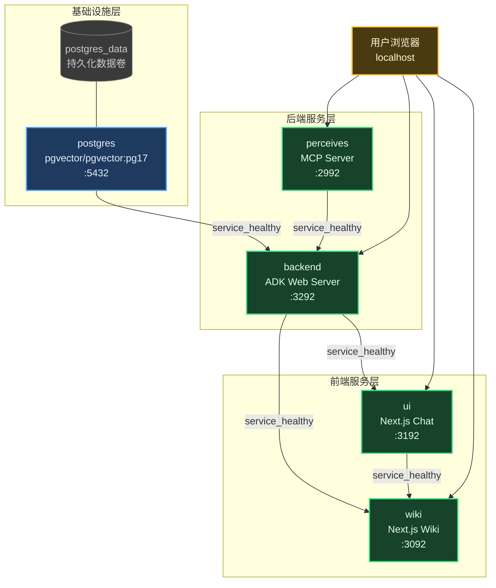
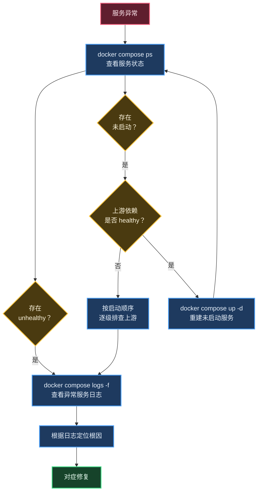

# Docker Compose 运维指引

> 本文档是 Negentropy Docker Compose 栈的**运维操作单一参考**，覆盖服务拓扑、首次部署、日常操作、开发工作流与故障排查。
>
> - 镜像构建与 CI/CD 流水线设计：[Docker Release Pipeline](./design/docker-release-pipeline.md)
> - 原生开发环境搭建：[Development Guide](./development.md)
> - 相关配置文件：[docker-compose.yml](../../docker-compose.yml)、[.env.docker](../../.env.docker)

---

## 目录

1. [服务拓扑](#1-服务拓扑)
2. [环境准备](#2-环境准备)
3. [部署操作](#3-部署操作)
4. [日常操作](#4-日常操作)
5. [开发工作流](#5-开发工作流)
6. [故障排查](#6-故障排查)
7. [发布运维](#7-发布运维)
8. [参考文献](#8-参考文献)

---

## 1. 服务拓扑

### 1.1 架构总览



### 1.2 服务参考表

| 服务        | 容器名                 | 镜像来源                           | 主机端口 | 健康检查探针                               | 依赖条件                        |
| :---------- | :--------------------- | :--------------------------------- | :------- | :----------------------------------------- | :------------------------------ |
| `postgres`  | `negentropy-postgres`  | `pgvector/pgvector:pg17`           | 5432     | `pg_isready -U aigc -d negentropy`         | —                               |
| `perceives` | `negentropy-perceives` | `threefishai/negentropy-perceives` | 2992     | `/mcp` 端点状态码白名单（200/307/405/406） | —                               |
| `backend`   | `negentropy-backend`   | `threefishai/negentropy-backend`   | 3292     | `curl -sf http://localhost:3292/`          | `postgres + perceives: healthy` |
| `ui`        | `negentropy-ui`        | `threefishai/negentropy-ui`        | 3192     | `curl -sf http://localhost:3192/`          | `backend: healthy`              |
| `wiki`      | `negentropy-wiki`      | `threefishai/negentropy-wiki`      | 3092     | `curl -sf http://localhost:3092/`          | `backend + ui: healthy`         |

> 镜像命名的单一事实源是 [docker-compose.yml](../../docker-compose.yml) 中各服务的 `image:` 字段。

### 1.3 启动顺序

Compose 通过 `depends_on: condition: service_healthy` 建立级联启动链：

1. **postgres** 与 **perceives** 并行启动（二者无依赖关系）：
   - postgres 等待 `pg_isready` 通过 → 标记 healthy
   - perceives 启动 MCP Server → `/mcp` 探针通过 → 标记 healthy
2. **backend** 依赖 postgres + perceives healthy → 执行 Alembic 迁移 → 启动 ADK Server → 根路由探针通过 → 标记 healthy
3. **ui** 依赖 backend healthy → 启动 Next.js → 根路由探针通过 → 标记 healthy
4. **wiki** 依赖 backend + ui healthy → 启动 Next.js → 根路由探针通过 → 标记 healthy

除 postgres 与 perceives（无依赖、并行首启）外，任一服务的上游未达 healthy 状态即不会启动：这确保了数据库与 MCP 就绪后才执行迁移、后端就绪后才启动前端。

---

## 2. 环境准备

### 2.1 本地零配置快速启动（推荐入门）

本地开发**无需任何云凭证**即可启动全栈。一键入口 [`./dev`](../../dev) 会自动叠加本地安全配置层
[`docker-compose.local.yml`](../../docker-compose.local.yml)（inmemory 制品 / 关闭 Langfuse 外发 / 标记 development）：

```bash
./dev            # = setup（创建 .env.docker.local）+ 构建并启动全栈 + 健康自检 + doctor
```

对话能力默认由一个 LLM Key 激活（在 `.env.docker.local` 填入 `OPENAI`/`ANTHROPIC`/`GEMINI` 任一）；
零 Key 本地方案见 [本地 Ollama 集成](./local-llm-ollama.md)。

> **本地 vs 生产的关键隔离**：`docker-compose.local.yml` **不会**被 `docker compose up` 自动合并
> （其文件名非 `docker-compose.override.yml`）。本地经 `./dev`（或显式
> `-f docker-compose.yml -f docker-compose.local.yml`）叠加；**生产部署走 `docker-compose.yml` 单文件**，
> 叠加逻辑、默认行为均不变。参见 Docker「Merge Compose files」规范 [5]。

### 2.2 前置依赖

| 依赖           | 最低版本   | 说明                                      |
| :------------- | :--------- | :---------------------------------------- |
| Docker Engine  | ≥ 24.0     | 运行容器引擎                              |
| Docker Compose | ≥ 2.24     | `env_file` 的 `required` 语法要求         |
| 磁盘空间       | ~5 GB      | 4 个自建镜像 + postgres 基础镜像 + 数据卷 |
| 网络访问       | Docker Hub | 拉取发布镜像；本地构建则无需外网          |

> **Apple Silicon 用户**：所有发布镜像均支持 `linux/arm64`（多架构构建），Docker Desktop 会自动选择匹配架构。

### 2.3 环境变量设置

[docker-compose.yml](../../docker-compose.yml) 采用双层 `env_file` 叠加机制：

| 层级   | 文件                | 必须存在                | 用途                             |
| :----- | :------------------ | :---------------------- | :------------------------------- |
| 基础层 | `.env.docker`       | 否（`required: false`） | 提供变量名模板与注释说明         |
| 覆盖层 | `.env.docker.local` | 否（`required: false`） | 填写实际密钥值，覆盖基础层同名项 |

**首次设置步骤**：

```bash
# 1. 复制模板
cp .env.docker .env.docker.local

# 2. 编辑 .env.docker.local，填写所需密钥（文件已被 .gitignore 忽略）
```

### 2.4 环境变量清单

| 变量                                     | 必填     | 影响服务           | 说明                                       |
| :--------------------------------------- | :------- | :----------------- | :----------------------------------------- |
| `OPENAI_API_KEY`                         | 至少一个 | backend, perceives | OpenAI API 密钥（LiteLLM 统一调度）        |
| `ANTHROPIC_API_KEY`                      | 至少一个 | backend, perceives | Anthropic API 密钥                         |
| `GEMINI_API_KEY`                         | 至少一个 | backend, perceives | Google Gemini API 密钥                     |
| `NE_AUTH_TOKEN_SECRET`                   | 是       | backend            | JWT Token 签名密钥                         |
| `NE_AUTH_GOOGLE_CLIENT_SECRET`           | 否       | backend            | Google OAuth 客户端密钥（启用 SSO 时必填） |
| `NE_OBSERVABILITY_LANGFUSE_PUBLIC_KEY`   | 否       | backend            | Langfuse LLM 可观测性公钥                  |
| `NE_OBSERVABILITY_LANGFUSE_SECRET_KEY`   | 否       | backend            | Langfuse LLM 可观测性私钥                  |
| `NE_SEARCH_GOOGLE_API_KEY`               | 否       | backend            | Google Programmable Search API 密钥        |
| `NEGENTROPY_PERCEIVES_LLM__API_KEY`      | 否       | perceives          | Perceives Smart 模式 LLM 密钥              |
| `NEGENTROPY_PERCEIVES_LLM__API_BASE_URL` | 否       | perceives          | Perceives Smart 模式 LLM 基地址            |

> 完整变量列表与注释参见 [.env.docker](../../.env.docker)。密钥**严禁**写入 `.env.docker`（已提交到版本库），应统一填写在 `.env.docker.local` 中。

---

## 3. 部署操作

### 3.1 使用发布镜像（推荐）

从 Docker Hub `threefishai` 命名空间拉取已发布的多架构镜像，无需本地构建：

```bash
# 指定版本拉取并启动（跳过本地构建）
NEGENTROPY_IMAGE_TAG=1.2.0 docker compose pull
NEGENTROPY_IMAGE_TAG=1.2.0 docker compose up -d --no-build
```

**版本固定策略**：

| 指定方式       | 示例                                   | 行为                     |
| :------------- | :------------------------------------- | :----------------------- |
| 精确 semver    | `NEGENTROPY_IMAGE_TAG=1.2.0`           | 锁定特定版本，可复现部署 |
| major.minor    | `NEGENTROPY_IMAGE_TAG=1.2`             | 跟踪 1.2.x 最新补丁版    |
| latest（默认） | 不设置或 `NEGENTROPY_IMAGE_TAG=latest` | 始终使用最新稳定版       |

**升级到新版本**：

```bash
# 1. 拉取新版本镜像
NEGENTROPY_IMAGE_TAG=1.3.0 docker compose pull

# 2. 重建并启动（仅重建镜像变更的容器）
NEGENTROPY_IMAGE_TAG=1.3.0 docker compose up -d --no-build
```

> 升级时 backend 容器的 [entrypoint.sh](../../docker/backend/entrypoint.sh) 会自动执行 `alembic upgrade head`，无需手动迁移。

### 3.2 使用本地构建（开发/测试）

当镜像本地不存在时，Compose 自动从源码构建：

```bash
# 构建所有镜像并启动
docker compose up -d

# 仅构建不启动
docker compose build

# 无缓存全量重建
docker compose build --no-cache
```

**重建单个服务**：

```bash
# 修改源码后重建 backend
docker compose build backend && docker compose up -d backend
```

### 3.3 Compose 覆盖的环境变量

以下环境变量由 [docker-compose.yml](../../docker-compose.yml) 在 `environment:` 中显式设置，覆盖 `.env.docker.local` 中的同名项。它们使用 Docker 内部网络服务名替代 `localhost`：

| 变量                                | 值                                                    | 说明                                                                                  |
| :---------------------------------- | :---------------------------------------------------- | :------------------------------------------------------------------------------------ |
| `NE_DB_URL`                         | `postgresql+asyncpg://aigc:@postgres:5432/negentropy` | 使用 Compose 内部 `postgres` 服务名                                                   |
| `NE_KNOWLEDGE_WIKI_REVALIDATE__URL` | `http://wiki:3092/api/revalidate`                     | Wiki ISR revalidate webhook                                                           |
| `NE_AUTH_GOOGLE_REDIRECT_URI`       | `http://localhost:3292/auth/google/callback`          | 保持 localhost（浏览器端访问）                                                        |
| `AGUI_BASE_URL`                     | `http://backend:3292`                                 | UI BFF 代理目标                                                                       |
| `WIKI_API_BASE`                     | `http://backend:3292`                                 | Wiki 内容 API 代理目标                                                                |
| `WIKI_UI_BFF_BASE`                  | `http://ui:3192`                                      | Wiki BFF 代理目标                                                                     |
| `PORT` / `HOSTNAME`                 | ui / wiki 各自端口 / `0.0.0.0`                        | ui / wiki 容器内绑定覆盖（perceives 改用 `NEGENTROPY_PERCEIVES_HTTP_HOST` / `_PORT`） |

### 3.4 健康检查参考

| 服务      | 探针命令                           | 间隔 | 超时 | 重试 | 启动等待 |
| :-------- | :--------------------------------- | :--- | :--- | :--- | :------- |
| postgres  | `pg_isready -U aigc -d negentropy` | 5s   | 5s   | 10   | 10s      |
| perceives | `/mcp` 端点状态码白名单¹           | 10s  | 5s   | 30   | 30s      |
| backend   | `curl -sf http://localhost:3292/`  | 10s  | 5s   | 30   | 60s      |
| ui        | `curl -sf http://localhost:3192/`  | 15s  | 5s   | 10   | 30s      |
| wiki      | `curl -sf http://localhost:3092/`  | 15s  | 5s   | 10   | 30s      |

> ¹ perceives 基于 FastMCP，无根路由返回 200。健康检查使用 `/mcp` 端点：GET 请求缺少 MCP Accept 头时返回 406，即可证明 ASGI 服务已就绪。

---

## 4. 日常操作

### 4.1 启停命令

```bash
docker compose up -d                    # 后台启动所有服务
docker compose down                     # 停止并移除容器（保留数据卷）
docker compose down -v                  # 停止并移除容器和数据卷（⚠ 数据不可恢复）
docker compose restart <service>        # 重启单个服务
docker compose stop                     # 暂停所有服务（不移除容器）
docker compose start                    # 恢复已暂停的服务
```

> `docker compose down` 不会删除 `postgres_data` 卷，数据持久保留。`down -v` 会**不可逆地删除所有数据**，仅在确认无需保留数据时使用。

### 4.2 健康状态检查

```bash
# 查看所有服务状态（含健康检查结果）
docker compose ps

# 预期输出示例：
# NAME                    STATUS
# negentropy-backend      Up 2 minutes (healthy)
# negentropy-perceives    Up 3 minutes (healthy)
# negentropy-postgres     Up 3 minutes (healthy)
# negentropy-ui           Up 90 seconds (healthy)
# negentropy-wiki         Up 60 seconds (healthy)

# 查询单个容器健康状态
docker inspect --format='{{.State.Health.Status}}' negentropy-backend
# 预期输出: healthy

# 查看健康检查历史（排查启动失败原因）
docker inspect --format='{{range .State.Health.Log}}{{.Output}}{{end}}' negentropy-backend
```

**状态语义**：

| 状态               | 含义                               |
| :----------------- | :--------------------------------- |
| `health: starting` | 在 `start_period` 内，尚无失败计数 |
| `healthy`          | 最近一次探针成功，服务可用         |
| `unhealthy`        | 连续 `retries` 次探针失败，需排查  |

### 4.3 日志查看

```bash
docker compose logs -f                  # 跟踪所有服务日志
docker compose logs -f backend          # 跟踪 backend 日志
docker compose logs --since 30m perceives  # 最近 30 分钟 perceives 日志
docker compose logs --tail 100 ui       # ui 最近 100 行日志
```

**各服务启动日志特征**：

| 服务      | 关键日志标识                                                                    |
| :-------- | :------------------------------------------------------------------------------ |
| postgres  | `database system is ready to accept connections`                                |
| perceives | `Uvicorn running on http://0.0.0.0:2992`                                        |
| backend   | `Running Alembic migrations...` → `negentropy serve --host 0.0.0.0 --port 3292` |
| ui / wiki | `Ready in ...s` 或 `✓ Ready`                                                    |

### 4.4 数据持久化与备份

所有应用数据存储在 `postgres_data` 命名卷中：

```bash
# 查看卷信息
docker volume ls | grep postgres_data
docker volume inspect damascus-v3_postgres_data

# 备份数据库
docker compose exec postgres pg_dump -U aigc negentropy > backup_$(date +%Y%m%d).sql

# 恢复数据库
cat backup_20260612.sql | docker compose exec -T postgres psql -U aigc negentropy

# 直连 PostgreSQL
docker compose exec postgres psql -U aigc -d negentropy
```

> `pg_dump` 备份可在服务运行时安全执行（PostgreSQL 一致性快照）。

---

## 5. 开发工作流

### 5.1 Docker vs 原生开发

| 维度           | 原生开发                                   | Docker Compose                                            |
| :------------- | :----------------------------------------- | :-------------------------------------------------------- |
| **适用场景**   | 日常迭代、热重载开发                       | 生产类部署验证、Dockerfile 变更测试、CI/CD 验证、快速演示 |
| **启动速度**   | 快（秒级）                                 | 慢（首次构建需分钟级）                                    |
| **热重载**     | ✅ 后端 `--reload_agents`，前端 Next.js HMR | ❌ 需重建镜像才能生效                                      |
| **依赖管理**   | `uv sync` / `pnpm install`                 | 构建时自动安装                                            |
| **调试便利性** | 原生 IDE 断点                              | 需 `docker compose exec` 进入容器                         |

> 日常开发推荐使用原生工具链（参见 [Development Guide](./development.md)）。Docker 用于验证生产构建或测试 CI/CD 变更。

### 5.2 本地构建操作

```bash
# 构建全部 4 个自建镜像
docker compose build

# 仅构建单个服务
docker compose build backend

# 无缓存全量重建（Dockerfile 或依赖变更后）
docker compose build --no-cache perceives

# 构建并启动（镜像变更时自动重建）
docker compose up -d --build
```

**多阶段构建说明**：所有 Dockerfile 均采用多阶段构建（builder → runtime）。builder 阶段安装依赖并编译，runtime 阶段仅包含运行时产物，最终镜像体积更小、攻击面更窄。

### 5.3 清理 Docker 资源

```bash
# 删除未使用的镜像、容器、网络
docker system prune

# 全面清理（含所有未使用镜像和卷，谨慎使用）
docker system prune -a --volumes

# 仅清理构建缓存
docker builder prune

# 查看磁盘占用
docker system df
```

---

## 6. 故障排查

### 6.1 诊断决策树



### 6.2 常见问题

| 问题                      | 症状                                                                                               | 根因                                                                                                                                                                         | 解决方案                                                                                                                                                                                                     |
| :------------------------ | :------------------------------------------------------------------------------------------------- | :--------------------------------------------------------------------------------------------------------------------------------------------------------------------------- | :----------------------------------------------------------------------------------------------------------------------------------------------------------------------------------------------------------- |
| **端口冲突**              | `port is already allocated`（被其他容器占用）或 `bind: address already in use`（被宿主机进程占用） | 本机 PostgreSQL 或其他容器/进程占用了 :5432 / :3292 等主机端口                                                                                                               | `docker ps`（查容器）/ `lsof -i :<port>`（查进程）定位占用者；postgres 主机端口可经 `NE_POSTGRES_HOST_PORT`（设于根目录 `.env` 或 shell）改映射，无需停用既有服务；其余服务端口同理编辑 `docker-compose.yml` |
| **数据卷损坏**            | postgres 启动失败，日志显示数据目录错误                                                            | 主机异常重启后 `postgres_data` 卷状态不一致                                                                                                                                  | `docker compose down && docker volume rm <project>_postgres_data && docker compose up -d`（⚠ 数据不可恢复）                                                                                                  |
| **镜像拉取失败**          | `manifest not found`                                                                               | `NEGENTROPY_IMAGE_TAG` 指定了不存在的标签                                                                                                                                    | 确认标签存在：`docker manifest inspect threefishai/negentropy-backend:<tag>`                                                                                                                                 |
| **健康检查超时**          | 容器持续 `(unhealthy)`                                                                             | 服务启动慢或探针目标不可达                                                                                                                                                   | 查看日志 `docker compose logs <service>`；首次构建镜像时 backend 的 `start_period` 可能不够，等待后重试                                                                                                      |
| **依赖链阻塞**            | 服务一直等待，未启动                                                                               | 上游服务未达到 healthy 状态                                                                                                                                                  | postgres 与 perceives 无级联关系、应分别独立排查；级联链为 postgres/perceives → backend → ui → wiki，按此顺序逐级确认上游 healthy                                                                         |
| **环境变量未加载**        | 认证失败或 API Key 缺失                                                                            | `.env.docker.local` 未创建或密钥为空                                                                                                                                         | 确认文件存在且值已填写：`cat .env.docker.local \| grep -v '^#' \| grep -v '^$'`                                                                                                                              |
| **架构不匹配**            | `exec format error`                                                                                | 在 amd64 主机运行 arm64 单架构镜像（或反之）                                                                                                                                 | 使用多架构清单（默认行为），不要指定特定架构 digest                                                                                                                                                          |
| **Python 服务 exec 失败** | `exec /app/.venv/bin/<script>: no such file or directory`，容器退出码 255                          | 多阶段 Dockerfile 中 builder 与 runtime `WORKDIR` 不一致，`uv sync` 生成的 console_script shebang 被固化为 builder 绝对路径（如 `/build/.venv/bin/python3`），runtime 不存在 | builder 与 runtime 须保持相同 `WORKDIR`（本项目统一 `/app`），参见 [`docker/perceives/Dockerfile`](../../docker/perceives/Dockerfile)、[`docker/backend/Dockerfile`](../../docker/backend/Dockerfile)        |

### 6.3 调试命令参考

```bash
# 查看合并后的 Compose 配置（验证环境变量是否正确注入）
docker compose config

# 进入运行中的容器
docker compose exec backend bash

# 直连 PostgreSQL（执行 SQL 查询）
docker compose exec postgres psql -U aigc -d negentropy

# 查看容器内进程
docker compose top

# 查看容器资源占用
docker stats --no-stream

# 检查镜像多架构信息
docker buildx imagetools inspect threefishai/negentropy-backend:latest
```

---

## 7. 发布运维

> 镜像构建与流水线设计详见 [Docker Release Pipeline](./design/docker-release-pipeline.md)。本节聚焦发布操作的**执行步骤**。

### 7.0 首次发布（First Release）

> 当 `negentropy-v*` tag 数为 0、且 `threefishai` 命名空间下 4 个镜像仓库均不存在时即为**首次发布**——在常规 [7.1 检查清单](#71-发布前检查清单) / [7.2 发布流程](#72-发布流程) 之外，需额外关注以下首发专属事项。

**① 首发判定**（确认确为第一次）：

```bash
# 仓内无历史发布 tag（预期为空）
git tag --list 'negentropy-v*'

# Docker Hub 上镜像仓库不存在（HTTP 404 即从未发布）
curl -s -o /dev/null -w '%{http_code}\n' https://hub.docker.com/v2/repositories/threefishai/negentropy-backend/tags/
```

**② 版本号决策**（⚠️ 非显而易见的耦合）：

Docker 镜像 tag 由 git tag 派生（`negentropy-v<x.y.z>` → `<x.y.z>`），但 `package-release` 用 `uv build` 打的 wheel 取自 [`apps/negentropy/pyproject.toml`](../../apps/negentropy/pyproject.toml) 的 `version`。**首发 tag 务必与 pyproject `version` 对齐**，否则 GitHub Release 标题、wheel 命名、Docker 镜像 tag 三者错位。

| 当前 pyproject `version` | 推荐首发 tag        |
| :----------------------- | :------------------ |
| `0.0.1`                  | `negentropy-v0.0.1` |

> 若需发布更高版本（如 `1.0.0`），须先 bump pyproject / package.json —— 属代码改动，不属于纯发布操作。

**③ 首发陷阱速查**：

| 陷阱                           | 说明                                                                                                                                                                                              |
| :----------------------------- | :------------------------------------------------------------------------------------------------------------------------------------------------------------------------------------------------ |
| Secrets 必须 **Repository 级** | `uses:` 型 `docker-release` job 无法声明 environment，environment-scoped secrets 对其不可见 → `Login to Docker Hub` 失败。详见 [Release Pipeline 前置配置](./design/docker-release-pipeline.md)。 |
| fork 防御                      | `docker-release` 含 `if: github.repository_owner == 'ThreeFish-AI'`；非 ThreeFish-AI 仓库推 tag 不会发布。                                                                                        |
| PG 来自上游命名空间            | 消费者 `pull` 会从 `pgvector` 官方拉 `pgvector/pgvector:pg17` + 从 `threefishai` 拉 4 个应用镜像——属「复用上游 PG」方案的预期外观，非异常。                                                       |
| 消费者必填 LLM key             | PG 无密钥（trust 认证），但应用不填至少一个 LLM key 与 `NE_AUTH_TOKEN_SECRET` 无法正常服务。密钥准备见 [§2.3 环境变量设置](#23-环境变量设置)。                                                    |
| 勿混入 `.local.yml`            | 消费者使用裸 `docker-compose.yml`，勿叠加 `docker-compose.local.yml`（开发期 inmemory / 关 langfuse 覆盖）或 `./dev` 脚本。                                                                       |

**④ 首发端到端验证**（在 [7.3 发布后验证](#73-发布后验证) 基础上补应用层自检）：

```bash
export NEGENTROPY_IMAGE_TAG=0.0.1
docker compose -f docker-compose.yml up -d --no-build
curl -fsS http://localhost:3292/health                               # backend 健康（HTTP 200）
docker compose -f docker-compose.yml exec backend negentropy doctor  # 应用自检（含 DB / pgvector 扩展）
```

> **判定**：5 服务（postgres / perceives / backend / ui / wiki）均 `healthy` + `/health` 返回 200 + `negentropy doctor` 通过 = 首次发布成功。

### 7.1 发布前检查清单

- [ ] 所有 CI 门禁通过（backend QA + UI QA）
- [ ] [CHANGELOG.md](../../CHANGELOG.md) 已更新版本说明
- [ ] Docker Hub 凭据（`DOCKERHUB_USERNAME` / `DOCKERHUB_TOKEN`）已配置为 GitHub Repository Secrets
- [ ] 已确认 `threefishai` 命名空间下 4 个 repository 均已创建（backend / perceives / ui / wiki）

### 7.2 发布流程

#### Step 1：干跑验证（不推送）

GitHub → Actions → Release Pipeline → Run workflow：
- `publish_release`: false
- 确认 4 个镜像 × 2 种架构（amd64 + arm64）全部构建成功

#### Step 2：Prerelease 小步验证

```bash
# 推送 prerelease tag
git tag negentropy-v0.0.1-rc.1
git push origin negentropy-v0.0.1-rc.1
```

验证镜像已发布且包含双平台：

```bash
docker buildx imagetools inspect threefishai/negentropy-backend:0.0.1-rc.1
# 预期输出含 linux/amd64 和 linux/arm64 两个 platform
```

> Prerelease 仅打 `1.2.0-rc.1` 标签，**不触碰 `latest`**。

#### Step 3：正式发布

```bash
# 推送 stable tag
git tag negentropy-v1.2.0
git push origin negentropy-v1.2.0
```

正式发布同时产出 `1.2.0`、`1.2`、`latest` 三个标签。

### 7.3 发布后验证

```bash
# 1. 确认镜像多架构完整性
docker buildx imagetools inspect threefishai/negentropy-backend:1.2.0

# 2. 在全新主机上验证部署
NEGENTROPY_IMAGE_TAG=0.0.1-rc.1 docker compose pull
NEGENTROPY_IMAGE_TAG=0.0.1-rc.1 docker compose up -d --no-build

# 3. 等待所有服务 healthy
docker compose ps

# 4. 功能验证：访问 http://localhost:3192 (UI) 和 http://localhost:3092 (Wiki)
```

### 7.4 回滚流程

```bash
# 1. 指定历史版本拉取并启动
NEGENTROPY_IMAGE_TAG=<previous-version> docker compose pull
NEGENTROPY_IMAGE_TAG=<previous-version> docker compose up -d --no-build

# 2. 确认回滚成功
docker compose ps
```

> 回滚仅替换镜像版本，不回退数据库。Alembic 迁移为向前兼容设计。如需回退数据库 Schema，需手动执行 `alembic downgrade`。

### 7.5 发布状态监控

| 监控点                  | 方式                                                           |
| :---------------------- | :------------------------------------------------------------- |
| GitHub Actions 构建状态 | Repository → Actions → Release Pipeline 工作流运行详情         |
| Docker Hub 镜像标签     | `https://hub.docker.com/r/threefishai/negentropy-backend/tags` |
| 镜像 Digest 验证        | 对比 CI 输出摘要与 Docker Hub 显示的 digest                    |

---

## 8. 参考文献

[1] Docker Inc., "Docker Compose overview," _Docker Documentation_, 2025. [Online]. Available: https://docs.docker.com/compose/

[2] Docker Inc., "Multi-platform builds," _Docker Documentation_, 2025. [Online]. Available: https://docs.docker.com/build/ci/github-actions/multi-platform/

[3] Docker Inc., "docker compose CLI reference," _Docker Documentation_, 2025. [Online]. Available: https://docs.docker.com/compose/reference/

[4] Docker Inc., "Dockerfile multi-stage builds," _Docker Documentation_, 2025. [Online]. Available: https://docs.docker.com/build/building/multi-stage/

[5] Docker Inc., "Merge Compose files," _Docker Documentation_, 2025. [Online]. Available: https://docs.docker.com/compose/how-tos/multiple-compose-files/merge/
