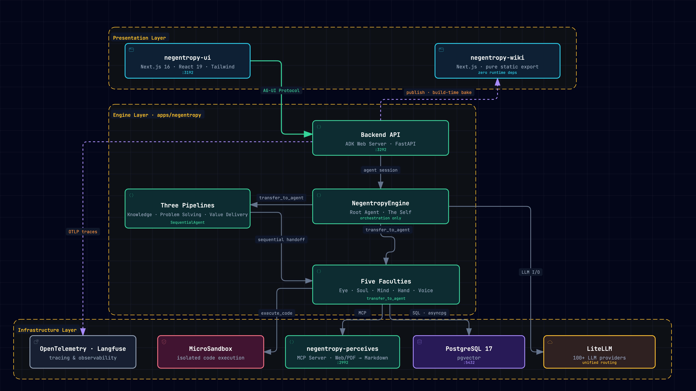
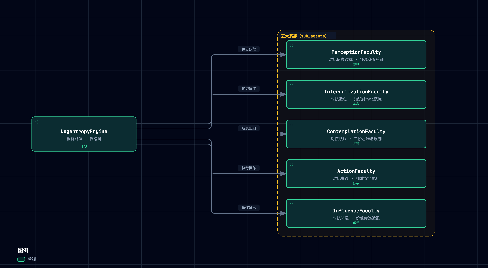
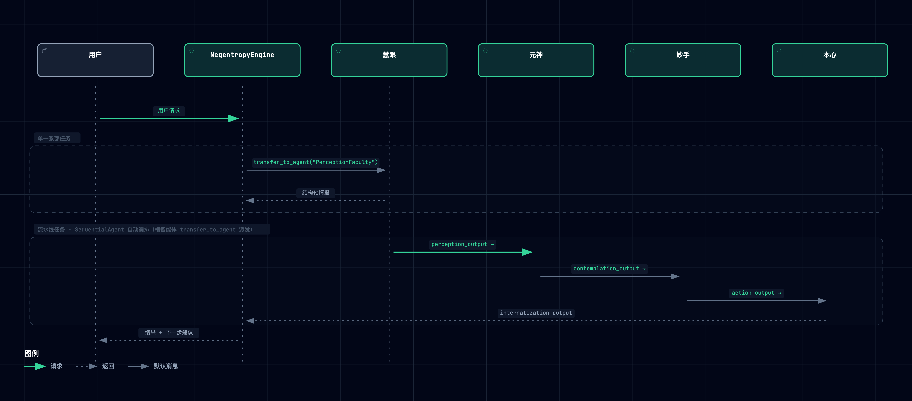
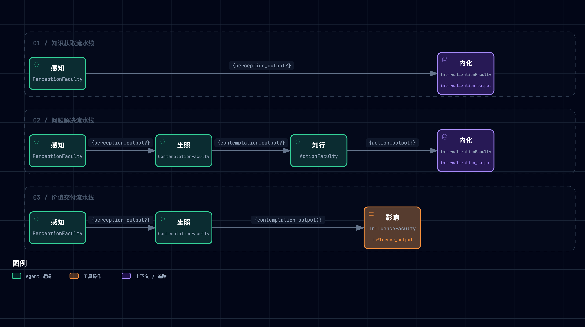
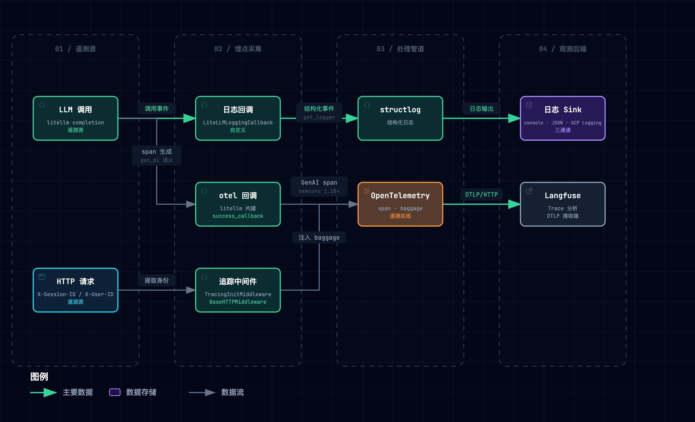
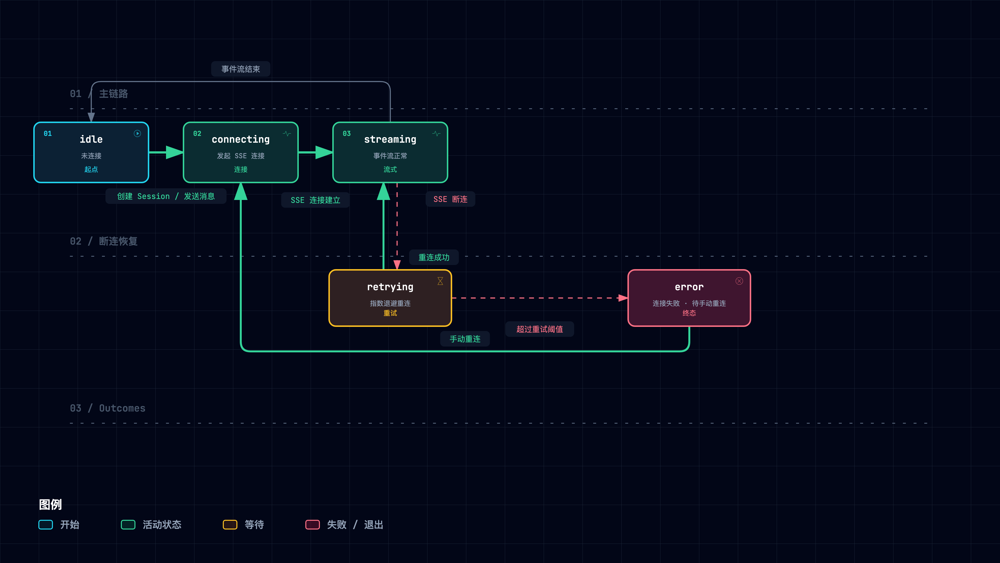
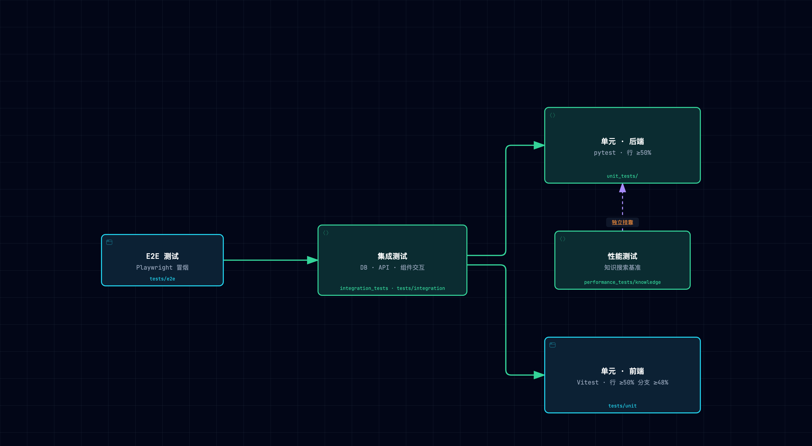
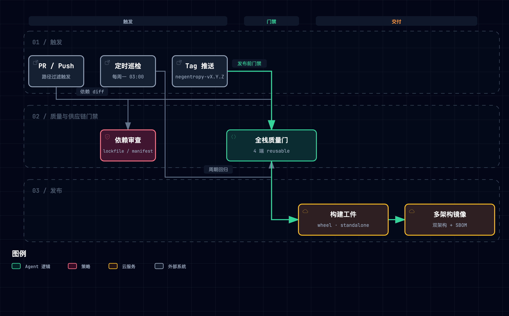

# 架构设计方案 (Architecture Framework)

> 本文档是 Negentropy 系统的**架构设计单一权威参考**，基于代码事实与工程实践，描述系统的设计原理、组件结构与扩展范式。
>
> - 项目概览与快速上手：[README.md](../../README.md)
> - 开发指南：[Development Guide](operations/development.md)
> - QA 与发布流水线：[QA Pipeline](./design/qa-delivery-pipeline.md)
> - 工程变更日志：[Engineering Changelog](operations/engineering-changelog.md)

---

## 目录

1. [项目定位与核心哲学](#1-项目定位与核心哲学)
2. [系统全景架构](#2-系统全景架构)
3. [一核五翼：智能体编排架构](#3-一核五翼智能体编排架构)
4. [流水线编排模式](#4-流水线编排模式)
5. [设计模式目录](#5-设计模式目录)
6. [引擎层架构](#6-引擎层架构-engine-layer)
7. [配置管理体系](#7-配置管理体系)
8. [数据持久化架构](#8-数据持久化架构)
9. [前端应用架构](#9-前端应用架构-negentropy-ui)
   - 9.4 [AG-UI 协议架构](#94-ag-ui-协议架构)
   - 9.5 [UI 交互状态机](#95-ui-交互状态机)
   - 9.6 [API 契约与错误处理规范](#96-api-契约与错误处理规范)
10. [测试策略与质量保障](#10-测试策略与质量保障)
11. [扩展点与演进方向](#11-扩展点与演进方向)
12. [参考文献](#12-参考文献)

---

## 1. 项目定位与核心哲学

**Negentropy (熵减引擎)** 是一个 **「一核五翼」(One Root, Five Wings)** 架构的智能体系统，致力于对抗知识的无序趋势（熵增），实现持续的认知进化<sup>[[1]](#ref1)</sup>。

### 1.1 设计理念

系统的命名源自薛定谔 (Erwin Schrödinger) 在《生命是什么》中提出的概念——生命以**负熵 (Negentropy)** 为食<sup>[[2]](#ref2)</sup>。映射到软件系统，核心对抗目标是：

| 熵增形态 | 系统表征      | 对抗策略               |
| :------- | :------------ | :--------------------- |
| 信息过载 | 噪音淹没信号  | 感知系部：熵减过滤     |
| 遗忘     | 知识碎片化    | 内化系部：结构化持久化 |
| 肤浅     | 表层响应      | 坐照系部：二阶思维     |
| 虚谈     | 认知-行动断裂 | 知行系部：精准执行     |
| 晦涩     | 价值传递失真  | 影响系部：清晰表达     |

### 1.2 架构哲学

系统遵循用户级全局配置 `~/.claude/CLAUDE.md` 定义的工程行为准则，核心原则包括：

- **正交分解 (Orthogonal Decomposition)**：独立变化的维度解耦，确保单一概念主体的变更具备局部性
- **复用驱动 (Composition over Construction)**：优先通过组合与集成构建系统
- **反馈闭环 (Feedback Loops)**：构建"设计-实现-验证"的完整闭环
- **单一事实源 (Single Source of Truth)**：维护唯一的权威定义源

---

## 2. 系统全景架构

### 2.1 三层架构视图

系统按「谁面向用户 / 谁做决策 / 谁提供能力」正交切分为三层，11 个组件与 11 条关系全部落在层内职责或跨层契约上。**层边界即契约**：应用间只经网络协议（AG-UI / HTTP / MCP）或构建期静态产物协作，严禁源码互引。



| 层 | 组件（服务端口） | 层内定位 |
| :--- | :--- | :--- |
| 🖥️ 展示层 | `negentropy-ui`（`:3192`）· `negentropy-wiki`（纯静态导出，零运行时依赖） | 唯一的人机交互面。ui 只经 AG-UI 触达引擎；wiki 不持任何运行时链接，故可独立部署与离线阅读 |
| ⚙️ 引擎层 | `Backend API`（ADK Web Server · `:3292`）· `NegentropyEngine`（根智能体「本我」，仅编排）· 三条流水线（知识获取 / 问题解决 / 价值交付，均为 `SequentialAgent`）· 五大系部（慧眼 · 本心 · 元神 · 妙手 · 喉舌） | 决策与编排的唯一归属层。根智能体不执行原子任务，只经 `transfer_to_agent` 派发；流水线是常见多系部协作模式的固化封装 |
| 🏗️ 基础设施层 | `negentropy-perceives`（MCP Server，Web/PDF → Markdown · `:2992`）· `PostgreSQL 17`（pgvector · `:5432`）· `LiteLLM`（100+ 提供商）· `MicroSandbox` · `OpenTelemetry · Langfuse` | 能力供给层，仅由系部工具或引擎埋点触达，上层不持驱动级依赖，故可整体替换 |

各应用的技术栈、包管理与入口文件见 [§2.2 应用边界与技术栈](#22-应用边界与技术栈)。

11 条关系正交归并为**四条主链路 + 一条横切**，与交互图和动效短片的 4 章 13 停一一对应：

1. **对话请求**（5 停）：`ui` --*AG-UI Protocol · agent session*--> `api` --> `root` --*`transfer_to_agent`*--> `pipelines` / `faculties`；流水线按 `SequentialAgent` 顺序移交系部，终点是 `PostgreSQL`（*SQL · asyncpg*）。
2. **知识摄取**（3 停）：`faculties` --*MCP*--> `negentropy-perceives` 把 Web / PDF 源转为 Markdown，携向量落库 `PostgreSQL`。
3. **静态交付**（2 停）：`api` -.-*publish · 构建期烘焙*-.-> `wiki`。虚线是刻意的语义——内容在构建期烘入产物，已发布 wiki 在引擎离线时仍完整可读。
4. **模型与沙箱**（3 停）：`root` --*LLM I/O*--> `LiteLLM`；`faculties` --*`execute_code`*--> `MicroSandbox`。模型路由与不可信执行均不落在请求主路径上。
5. **横切**：`api` -.-*OTLP traces*-.-> `OpenTelemetry · Langfuse`，为上述四条链路统一埋点，自身不属于任何一条。

同一拓扑提供四种消费形态，按用途取用：

- 🖱️ [architecture-diagram.html](../assets/architecture/core/architecture-diagram.html) —— **交互 HTML**：平移 / 缩放 / 节点搜索、关系聚焦、明暗切换、可回放的 4 章 13 停引导叙事（每停可复制定位链接），以及 **11 处直达源码文件的深链**，逐一佐证图中每个组件的技术事实。*在 wiki 内该链接指向 GitHub 源码页，需下载到本地打开方有交互。*
- 🎬 [negentropy-architecture-story.mp4](../assets/architecture/core/negentropy-architecture-story.mp4) —— **动效短片**（1280×720，29 秒）：按上述四条链路逐停点亮一跳、压暗其余，建立「一次请求究竟触达了谁、又始终不触达谁」的直观。*两条渲染链路（GitHub Markdown 与 wiki）均会剥离 `<video>`，故此处只提供跳转，不内嵌播放；README 内的 GIF 动图是唯一能就地播放的形态。*
- 📐 [negentropy-architecture.svg](../assets/architecture/core/negentropy-architecture.svg) —— **双主题矢量图**：单文件自适应明暗，供演示与打印。*注意 wiki 的暗色态由 `data-color-scheme` 属性驱动，而 `` 内嵌 SVG 的 `prefers-color-scheme` 只读系统偏好，手动拨反主题时配色会反向——故本节正文内嵌的是暗色 PNG 而非该 SVG。*
- 🖼️ [暗色 PNG](../assets/architecture/core/negentropy-architecture-dark.png) · [亮色 PNG](../assets/architecture/core/negentropy-architecture-light.png) —— **5120×2880 高清静图**，由产物内置导出原生矢量栅格化而来（非位图放大），同时是 [README](../../README.md) 与 [中文 README](../i18n/zh-CN/README.md) 的静图来源。

> **图示文本源（可 diff 维护基线）**：[`core/negentropy-architecture.mmd`](../assets/mermaid/core/negentropy-architecture.mmd)。
> **修改流程**：先改该 `.mmd` → 用 archify（`/archify` 技能）从新文本重新生成 [architecture-diagram.html](../assets/architecture/core/architecture-diagram.html)（整体替换，采集脚本的唯一输入）→ 跑 [`scripts/capture-arch-media.mjs`](../../scripts/capture-arch-media.mjs) 采集 PNG / SVG / MP4 / GIF → 产物与 `.mmd` 同一次提交。**严禁手改生成物 HTML**：它没有独立的源规格，手改即造成文本源与呈现物分叉。生成链路、体积门与两条渲染链路的完整约束见 [文档媒体资产规范](../.agents/doc-media-assets.md)。

### 2.2 应用边界与技术栈

| 应用                       | 技术栈                                                                                        | 包管理                      | 入口                                                                      |
| :------------------------- | :-------------------------------------------------------------------------------------------- | :-------------------------- | :------------------------------------------------------------------------ |
| **negentropy** (后端引擎)  | Python 3.13+, Google ADK<sup>[[3]](#ref3)</sup>, SQLAlchemy, LiteLLM<sup>[[10]](#ref10)</sup> | `uv`<sup>[[9]](#ref9)</sup> | [`cli.py::_cmd_serve`](../../apps/negentropy/src/negentropy/cli.py) → ADK Web → [`services.py`](../../apps/negentropy/src/services.py) → [`engine/bootstrap.py`](../../apps/negentropy/src/negentropy/engine/bootstrap.py)；根智能体定义见 [`agents/agent.py`](../../apps/negentropy/src/negentropy/agents/agent.py) |
| **negentropy-perceives** (感知服务) | Python 3.13+, FastMCP                                                  | `uv`                        | [`src/`](../../apps/negentropy-perceives/src/)                            |
| **negentropy-ui** (前端)   | Next.js 16<sup>[[8]](#ref8)</sup>, React 19, TypeScript, Tailwind CSS                         | `pnpm`                      | [`app/layout.tsx`](../../apps/negentropy-ui/app/layout.tsx)               |
| **negentropy-wiki** (Wiki) | Next.js, TypeScript · 纯静态导出                                                              | `pnpm`                      | [`src/`](../../apps/negentropy-wiki/src/)                                 |
| **negentropy-influence** (科普视频内容工作区) | Python · Remotion · IndexTTS 声音克隆（外部服务 `:8766`）                       | `uv`（工作区薄包装器）            | [`README.md`](../../apps/negentropy-influence/README.md)（内容工作区；机制外置为 [to-video 技能](https://github.com/ThreeFish-AI/to-video)，无常驻服务端口） |
| **agents-chat-core** (共享包) | TypeScript · AG-UI 协议层 + Mention 解析                                                      | `pnpm`（workspace:*）       | [`packages/agents-chat-core/`](../../packages/agents-chat-core/)（仅 negentropy-ui 消费；层边界契约对共享源码包的唯一豁免） |

应用间仅通过网络契约（AG-UI / HTTP / MCP）或构建期静态产物协作，严禁源码互引。详见 [development.md](operations/development.md) §项目结构。


---

## 3. 一核五翼：智能体编排架构

### 3.1 根智能体 — NegentropyEngine

**`NegentropyEngine`** 是系统的调度核心（「本我」），不直接执行原子任务，而是依据正交分解原则，将意图精准委派给最合适的系部<sup>[[3]](#ref3)</sup>。

> 源码位置：[`agents/agent.py`](../../apps/negentropy/src/negentropy/agents/agent.py)

```python
root_agent = LlmAgent(
    name="NegentropyEngine",
    model=create_root_model(),
    description="熵减系统的「本我」，通过协调五大系部的能力，持续实现自我进化。",
    instruction=make_instruction_provider("NegentropyEngine", _ROOT_INSTRUCTION, is_root=True),
    before_model_callback=_pick_root_model,  # 按请求动态选择模型
    tools=[log_activity],
    sub_agents=[
        perception_agent, internalization_agent,
        contemplation_agent, action_agent, influence_agent,
        create_knowledge_acquisition_pipeline(),
        create_problem_solving_pipeline(),
        create_value_delivery_pipeline(),
    ],
)
```

**关键约束**：
- 根智能体仅显式注册 `log_activity` 与 `preload_memory_tool` 两个工具；`transfer_to_agent` 由 ADK 框架在注册 `sub_agents` 时自动提供<sup>[[3]](#ref3)</sup>
- 所有实际能力由子智能体（系部 + 流水线）承载
- 调度遵循反馈闭环：上下文锚定 → 模式择优 → 循证执行 → 主动导航

### 3.2 五大系部

每个系部是一个独立的 `LlmAgent`，拥有正交的职责边界、专属工具集和运行协议。



> 图源（可 diff 文本）：[`framework--faculties-orchestration.mmd`](../assets/mermaid/core/framework--faculties-orchestration.mmd) · 交互版（下载到本地打开）：[`framework--faculties-orchestration.html`](../assets/architecture/core/framework--faculties-orchestration.html)

| 系部      | 图腾  | Agent 名称               | 对抗目标 | 核心职责                             | 专属工具                                   |
| :-------- | :---: | :----------------------- | :------- | :----------------------------------- | :----------------------------------------- |
| 慧眼·感知 |   👁️   | `PerceptionFaculty`      | 信息过载 | 广域扫描、噪音过滤、多源交叉验证     | `search_knowledge_base`, `search_knowledge_graph_global`, `search_knowledge_graph_with_papers`, `search_web`, `search_papers` |
| 本心·内化 |   💎   | `InternalizationFaculty` | 遗忘     | 知识结构化、长期记忆管理、一致性维护 | `save_to_memory`, `update_knowledge_graph`, `ingest_paper` |
| 元神·坐照 |   🧠   | `ContemplationFaculty`   | 肤浅     | 二阶思维、策略规划、错误根因分析     | `analyze_context`, `create_plan`           |
| 妙手·知行 |   ✋   | `ActionFaculty`          | 虚谈     | 精准执行、代码生成、安全变更         | `execute_code`, `read_file`, `write_file`, `invoke_claude_code` |
| 喉舌·影响 |   🗣️   | `InfluenceFaculty`       | 晦涩     | 价值传递、格式适配、说服与教育       | `publish_content`, `send_notification`     |

> 所有系部均共享 `log_activity` 审计工具；上表仅列出各系部**专属**工具。
> 系部实现位于 [`agents/faculties/`](../../apps/negentropy/src/negentropy/agents/faculties/) 目录

### 3.3 系部实现范式

每个系部遵循统一的**双模式工厂模式**：

```python
# 工厂函数：创建独立实例（用于流水线）
def create_perception_agent(*, output_key: str | None = None, mode: str | None = None) -> LlmAgent:
    return LlmAgent(
        name="PerceptionFaculty",
        model=create_model(),
        tools=[log_activity, search_knowledge_base, search_knowledge_graph_global,
               search_knowledge_graph_with_papers, search_web, search_papers],
        output_key=output_key,
        mode=mode,  # ADK 2.0 Collaborative Agents 协作模式
        # 流水线边界管控：禁止 LLM 路由逃逸
        disallow_transfer_to_parent=output_key is not None,
        disallow_transfer_to_peers=output_key is not None,
    )

# 单例：mode="single_turn" — 执行完毕自动返回父 Agent
perception_agent = create_perception_agent(mode="single_turn")
```

这一设计解决了 Google ADK 的**单亲规则 (Single-Parent Rule)**<sup>[[3]](#ref3)</sup>——同一个 Agent 实例只能被注册为一个父级的子 Agent。工厂函数确保流水线中使用的是独立实例。

### 3.4 智能体协作序列



> 图源（可 diff 文本）：[`framework--agent-collaboration-sequence.mmd`](../assets/mermaid/core/framework--agent-collaboration-sequence.mmd) · 交互版（下载到本地打开）：[`framework--agent-collaboration-sequence.html`](../assets/architecture/core/framework--agent-collaboration-sequence.html)

---

## 4. 流水线编排模式

系统预置三条标准流水线，封装了常见的多系部协作模式。

> 源码位置：[`agents/pipelines/standard.py`](../../apps/negentropy/src/negentropy/agents/pipelines/standard.py)

### 4.1 三条标准流水线



> 图源（可 diff 文本）：[`framework--standard-pipelines.mmd`](../assets/mermaid/core/framework--standard-pipelines.mmd) · 交互版（下载到本地打开）：[`framework--standard-pipelines.html`](../assets/architecture/core/framework--standard-pipelines.html)

| 流水线                           | 执行路径                  | 适用场景                         |
| :------------------------------- | :------------------------ | :------------------------------- |
| **KnowledgeAcquisitionPipeline** | 感知 → 内化               | 研究新领域、收集需求、构建知识库 |
| **ProblemSolvingPipeline**       | 感知 → 坐照 → 知行 → 内化 | Bug 修复、功能实现、系统优化     |
| **ValueDeliveryPipeline**        | 感知 → 坐照 → 影响        | 撰写文档、生成报告、提供建议     |

### 4.2 状态传递机制

流水线使用 Google ADK `SequentialAgent`<sup>[[6]](#ref6)</sup> 的 `output_key` 机制在步骤间传递上下文：

1. 每个系部将最终响应文本存入 `session.state[output_key]`
2. 下游系部通过 `{output_key?}` 模板占位符引用上游输出
3. `?` 后缀表示可选引用——若上游未产出，则模板保留空值而非报错

```python
# 问题解决流水线的状态传递链路
SequentialAgent(
    sub_agents=[
        create_perception_agent(output_key="perception_output"),       # step 1
        create_contemplation_agent(output_key="contemplation_output"), # step 2: 引用 {perception_output?}
        create_action_agent(output_key="action_output"),               # step 3: 引用 {contemplation_output?}
        create_internalization_agent(output_key="internalization_output"),  # step 4: 引用 {action_output?}
    ],
)
```

### 4.3 边界管控

流水线内的系部实例启用 ADK 边界管控，防止 LLM 路由逃逸：

- `disallow_transfer_to_parent=True`：禁止系部跳回父级
- `disallow_transfer_to_peers=True`：禁止系部横向跳转到同级

这确保了流水线执行路径的确定性。

---

## 5. 设计模式目录

系统采用的核心设计模式及其代码位置：

### 5.1 Orchestrator Pattern（编排者模式）

- **应用**：`NegentropyEngine` 作为编排者协调五大系部和三条流水线
- **动机**：分离"调度决策"与"能力执行"，实现认知与行动的正交分解
- **代码**：[`agents/agent.py`](../../apps/negentropy/src/negentropy/agents/agent.py)

### 5.2 Pipeline Pattern（流水线模式）

- **应用**：`SequentialAgent` 串联多个系部实现复杂流程
- **动机**：封装常见的多步骤任务模式，减少协调熵
- **代码**：[`agents/pipelines/standard.py`](../../apps/negentropy/src/negentropy/agents/pipelines/standard.py)
- **出处**：Pipes and Filters 架构风格<sup>[[4]](#ref4)</sup>

### 5.3 Factory Method Pattern（工厂方法）

- **应用**：服务工厂体系（Session / Memory / Artifact / Credential / Runner）；系部工厂函数
- **动机**：将对象创建与使用解耦；解决 ADK 单亲规则约束
- **代码**：[`engine/factories/`](../../apps/negentropy/src/negentropy/engine/factories/)、各系部 `create_*_agent()` 函数
- **出处**：GoF Factory Method<sup>[[5]](#ref5)</sup>

### 5.4 Adapter Pattern（适配器模式）

- **应用**：PostgreSQL 适配器实现 ADK 抽象接口（SessionService、MemoryService 等）
- **动机**：对接 Google ADK 框架规范的同时保留存储后端的可替换性
- **代码**：[`engine/adapters/postgres/`](../../apps/negentropy/src/negentropy/engine/adapters/postgres/)
- **出处**：GoF Adapter<sup>[[5]](#ref5)</sup>

### 5.5 Strategy Pattern（策略模式）

- **应用**：`model_resolver` 根据数据库配置动态解析 LLM / Embedding 模型
- **动机**：支持运行时切换模型提供商而无需修改代码
- **代码**：[`config/model_resolver.py`](../../apps/negentropy/src/negentropy/config/model_resolver.py)
- **出处**：GoF Strategy<sup>[[5]](#ref5)</sup>

### 5.6 Nested Settings Pattern（嵌套配置模式）

- **应用**：Pydantic Settings 正交配置域组合
- **动机**：每个配置域独立管理，支持 YAML 分层加载 + Shell 环境变量覆盖
- **代码**：[`config/__init__.py`](../../apps/negentropy/src/negentropy/config/__init__.py)
- **出处**：Composition over Inheritance<sup>[[5]](#ref5)</sup>

### 5.7 Monkey-Patch Integration（运行时注入集成）

- **应用**：`bootstrap.py` 通过 Monkey-Patch 将 Negentropy 的配置注入 ADK 服务工厂
- **动机**：在不修改 ADK 框架源码的前提下实现定制化服务绑定
- **代码**：[`engine/bootstrap.py`](../../apps/negentropy/src/negentropy/engine/bootstrap.py)
- **权衡**：牺牲了类型安全性换取集成灵活性；需随 ADK 版本升级验证兼容性

### 5.8 Interface Architecture（能力接入架构）

- **应用**：可扩展的 Interface 模块，支持模型（Models）、子智能体（SubAgents）、MCP 服务、技能（Skills）的动态注册与接入
- **动机**：开放封闭原则 (OCP)——对扩展开放，对修改封闭
- **代码**：[`interface/`](../../apps/negentropy/src/negentropy/interface/)

---

## 6. 引擎层架构 (Engine Layer)

引擎层是连接智能体与基础设施的枢纽，基于 FastAPI<sup>[[7]](#ref7)</sup> 与 Google ADK Web Server 构建。

> 源码位置：[`engine/`](../../apps/negentropy/src/negentropy/engine/)

### 6.1 启动引导流程


> 图源（可 diff 文本）：[`framework--bootstrap-sequence.mmd`](../assets/mermaid/core/framework--bootstrap-sequence.mmd) · 交互版（下载到本地打开）：[`framework--bootstrap-sequence.html`](../assets/architecture/core/framework--bootstrap-sequence.html)

### 6.2 服务工厂体系

工厂模块通过配置驱动创建服务实例，支持 `inmemory` / `postgres` / `vertexai` 等多种后端。

> 源码位置：[`engine/factories/__init__.py`](../../apps/negentropy/src/negentropy/engine/factories/__init__.py)

| 工厂函数                   | 服务类型   | 可选后端                     |
| :------------------------- | :--------- | :--------------------------- |
| `get_session_service()`    | 会话管理   | inmemory, postgres, vertexai |
| `get_memory_service()`     | 记忆存储   | inmemory, postgres, vertexai |
| `get_artifact_service()`   | 工件管理   | inmemory, gcs, postgres      |
| `get_credential_service()` | 凭据管理   | inmemory, postgres           |
| `get_runner()`             | ADK Runner | 内置                         |

每个工厂提供 `reset_*()` 函数以支持测试场景下的实例重置。

### 6.3 沙箱执行环境

系统提供双通道沙箱以隔离代码执行：

- **MCP (Model Context Protocol)**：通过 MCP 协议与外部工具服务通信
  - 源码：[`engine/sandbox/mcp.py`](../../apps/negentropy/src/negentropy/engine/sandbox/mcp.py)
- **MicroSandbox**：轻量级容器化沙箱，用于安全执行用户代码
  - 源码：[`engine/sandbox/microsandbox_runner.py`](../../apps/negentropy/src/negentropy/engine/sandbox/microsandbox_runner.py)

### 6.4 可观测性集成



> 图源（可 diff 文本）：[`framework--observability-dataflow.mmd`](../assets/mermaid/core/framework--observability-dataflow.mmd) · 交互版（下载到本地打开）：[`framework--observability-dataflow.html`](../assets/architecture/core/framework--observability-dataflow.html)

关键集成点：
- **structlog**：结构化日志输出，支持 console / JSON / Google Cloud Logging 三种 sink
- **OpenTelemetry**：分布式追踪，通过 Langfuse 作为 OTLP 接收端
- **TracingInitMiddleware**：从 HTTP 请求中提取/生成 `session_id`、`user_id`，注入 OTel baggage

> 源码位置：[`instrumentation.py`](../../apps/negentropy/src/negentropy/instrumentation.py)、[`engine/bootstrap.py`](../../apps/negentropy/src/negentropy/engine/bootstrap.py) (中间件定义)

---


### 6.5 引擎内景：调度与自治子系统

三层视图（§2.1）沿对话主路径呈现进程间拓扑；引擎进程内部另有一组**不落在请求路径上的常驻子系统**，承载系统的自治运营：


> 图源（可 diff 文本）：[`framework--engine-interior.mmd`](../assets/mermaid/core/framework--engine-interior.mmd) · 交互版（下载到本地打开）：[`framework--engine-interior.html`](../assets/architecture/core/framework--engine-interior.html)

- **统一调度**（[`engine/schedulers/`](../../apps/negentropy/src/negentropy/engine/schedulers/)）：`AsyncScheduler` 以 5s 全局心跳驱动 13 个 handler（缓存预热、各类 inspector、工具统计等）；任务表以 `FOR UPDATE SKIP LOCKED` 抢占，`ExecutionBus` 向 UI 扇出 SSE 事件
- **Routine 编排**（[`engine/routine/`](../../apps/negentropy/src/negentropy/engine/routine/)，20 模块）：`routine_inspector` 每 tick 驱动 orchestrator 的 REAP → EVAL → DISPATCH 三阶段；runner 以进程内 asyncio.Task + 信号量执行——这也是引擎坚持单进程单 worker 的架构原因
- **Claude Code 执行体**（[`engine/claude_code/service.py`](../../apps/negentropy/src/negentropy/engine/claude_code/service.py)）：Routine 迭代的实际执行器是 Claude Code CLI；引擎另挂 [`/mcp/knowledge`](../../apps/negentropy/src/negentropy/knowledge/mcp_server.py) MCP 端点（streamable-HTTP）为其供给知识工具
- **Definitions Registry**（migrations 0095–0099）：[`definitions`](../../apps/negentropy/src/negentropy/agents/definitions/registry.py) 表是 `skill_template` / `routine_preset` / `harness_skill` / `agent` 四类定义的 SSOT；`harness_materializer` 将 DB 渲染回 `.agent/skills/`，`agent_factory` 从 DB 构造 agent 图（`NE_AGENTS_FROM_DB` 默认开启）。盘上 11 个 SKILL.md 已全部入库（11/11；`science-video-pipeline` 已随流水线机制外置为 [to-video 技能](https://github.com/ThreeFish-AI/to-video) 删除）
- **PDF 保真巡检**（`pdf_fidelity_patrol`，默认 600s interval）：起真实 wiki dev 环境 + Playwright 逐页对照源 PDF，经 perceives `:2992` 重转验证
- **Evolution / Eval**：提案—金丝雀—裁决的自演化回路与攻击面评估

---

## 7. 配置管理体系

### 7.1 Nested Settings 正交配置域

系统采用 **Pydantic Settings** 的嵌套组合模式，将配置划分为独立的正交域：

> 源码位置：[`config/__init__.py`](../../apps/negentropy/src/negentropy/config/__init__.py)

```python
class Settings(BaseSettings):
    model_config = SettingsConfigDict(extra="ignore")

    @cached_property
    def environment(self) -> EnvironmentSettings:   # NE_ENV 环境检测
        return EnvironmentSettings()

    @cached_property
    def database(self) -> DatabaseSettings:         # 数据库连接
        return DatabaseSettings()

    # ... logging, observability, services, auth, search, knowledge 同理
```

每个子配置拥有独立的环境变量前缀，互不干扰。

### 7.2 YAML 分层加载

后端按以下优先级加载配置（高优先级覆盖低优先级）：

1. **Shell 环境变量**（最高优先级）
2. **`config.local.yaml`**（cwd 相对路径，已 gitignore）
3. **CLI 指定 YAML**（`NE_CONFIG_PATH` 环境变量或 `-c` 参数）
4. **`~/.negentropy/config.yaml`**（用户级配置）
5. **`config.default.yaml`**（包级默认值）

### 7.3 配置域清单

| 配置域                  | 源文件                                                                                    | 环境变量前缀 | 职责                        |
| :---------------------- | :---------------------------------------------------------------------------------------- | :----------- | :-------------------------- |
| `EnvironmentSettings`   | [`config/environment.py`](../../apps/negentropy/src/negentropy/config/environment.py)     | `NE_`        | 环境检测与 YAML 配置加载    |
| `AppSettings`           | [`config/app.py`](../../apps/negentropy/src/negentropy/config/app.py)                     | `NE_`        | 应用名称等基础配置          |
| `LoggingSettings`       | [`config/logging.py`](../../apps/negentropy/src/negentropy/config/logging.py)             | `NE_LOG_`    | 日志级别、格式、输出 sink   |
| `ObservabilitySettings` | [`config/observability.py`](../../apps/negentropy/src/negentropy/config/observability.py) | `LANGFUSE_`  | Langfuse 追踪配置           |
| `DatabaseSettings`      | [`config/database.py`](../../apps/negentropy/src/negentropy/config/database.py)           | `NE_DB_`     | PostgreSQL 连接池参数       |
| `ServicesSettings`      | [`config/services.py`](../../apps/negentropy/src/negentropy/config/services.py)           | `NE_`        | 各服务后端选择              |
| `AuthSettings`          | [`config/auth.py`](../../apps/negentropy/src/negentropy/config/auth.py)                   | `NE_AUTH_`   | Google OAuth / Session 管理 |
| `SearchSettings`        | [`config/search.py`](../../apps/negentropy/src/negentropy/config/search.py)               | `NE_SEARCH_` | Web 搜索提供商配置          |
| `KnowledgeSettings`     | [`config/knowledge.py`](../../apps/negentropy/src/negentropy/config/knowledge.py)         | `NE_KG_`     | 知识图谱与向量存储          |

### 7.4 LLM 模型解析链路

模型配置已从配置文件迁移至数据库 (`model_configs` 表)，通过 Admin UI 管理：

```
Admin UI → model_configs 表 → model_resolver.py → create_model() → LiteLlm 实例
```

> 源码位置：[`config/model_resolver.py`](../../apps/negentropy/src/negentropy/config/model_resolver.py)、[`agents/_model.py`](../../apps/negentropy/src/negentropy/agents/_model.py)

解析策略：优先读取数据库缓存配置，若缓存未命中则回退到硬编码默认值。缓存由 `bootstrap.py` 的 startup 事件预热。

---

## 8. 数据持久化架构

### 8.1 技术选型

- **PostgreSQL 17**（部署基准，CI 兼容层为 PG16）：关系型数据主存储
- **pgvector**：向量嵌入存储与相似度检索
- **Alembic**：Schema 迁移管理
- **SQLAlchemy**：ORM 与异步数据访问 (asyncpg)

### 8.2 Schema 分域设计

数据库 Schema 的单一事实源是 [`negentropy/models/`](../../apps/negentropy/src/negentropy/models/)（27 个 ORM 模块、合计 76 表）与 [Alembic 迁移链](../../apps/negentropy/src/negentropy/db/migrations/versions/)（99 版，head `0099_seed_agent_definitions`），按认知域划分为九域：


> 图源（可 diff 文本）：[`framework--schema-domains.mmd`](../assets/mermaid/core/framework--schema-domains.mmd) · 交互版（下载到本地打开）：[`framework--schema-domains.html`](../assets/architecture/core/framework--schema-domains.html)

| Schema 域 | ORM 模块（`negentropy/models/`） | 代表对象 |
| :--- | :--- | :--- |
| 会话与状态 | `pulse.py` · `state.py` | `Thread` · `Event` / `UserState` · `AppState` |
| 知识运行时（35 表） | `perception.py` · `internalization.py` · `knowledge_runtime.py` | `Corpus` · `Knowledge` · `KgEntity` · `WikiPublication` / `Memory` · `Fact` / Pipeline 运行 |
| 例行与调度 | `routine.py` · `scheduled_task.py` | `Routine` · `RoutineIteration` / `ScheduledTask` · `TaskExecution` |
| 定义注册 | `definition.py` · `skill.py` · `agent.py` · `builtin_tool.py` | `Definition`（4 kind）/ `Skill` · `Agent` / `BuiltinTool` |
| 演进与评估 | `evolution.py` · `eval_suite.py` | `EvolutionProposal` / `EvalSuite` · `EvalRun` |
| 能力接入 | `mcp.py` · `mcp_runtime.py` · `repository.py` · `vendor_config.py` | `McpServer` · `McpToolRun` / `Repository` / `VendorConfig` |
| 遥测 | `observability.py` · `tool_telemetry.py` | `Trace` / `ToolInvocation` · `ToolStatsDaily` |
| 模型配置 | `model_config.py` · `task_model_setting.py` | `ModelConfig` / `TaskModelSetting`（按 corpus 作用域） |
| 平台基座 | `base.py` · `security.py` · `storage.py` · `action.py` | `Base` · pgvector 类型 / `Credential` / `BlobObject` / `ToolExecution` |

### 8.3 关键设计决策

- **向量索引**：`kg_entities.embedding` 等向量列建 HNSW 索引（`vector_cosine_ops`）支撑语义检索（`models/perception.py` 与迁移 0034）
- **艾宾浩斯衰减**：静态 SQL 函数 `calculate_retention_score()`（迁移 0043）配合 `memories.retention_score` 列，实现基于访问与时间的记忆保持评分
- **跨域外键锚点**：`task_model_setting.scope_corpus_id → corpus`、`routine.repository_id → repositories`、`perception.patrol_routine_id → routines` 等三条跨域 FK 显式声明域间依赖
- **JSONB 灵活存储**：`config`、`skills` 等字段使用 JSONB + GIN 索引，兼顾灵活性与查询性能

---

## 9. 前端应用架构 (negentropy-ui)

### 9.1 技术栈

| 层次     | 技术选型                             |
| :------- | :----------------------------------- |
| 框架     | Next.js 16 (App Router)              |
| UI 库    | React 19, Tailwind CSS               |
| 状态管理 | React Hooks + Context                |
| AI 集成  | CopilotKit (AG-UI Protocol)          |
| 图表     | Mermaid                              |
| 测试     | Vitest (单元/集成), Playwright (E2E) |

### 9.2 功能域划分

```
apps/negentropy-ui/app/
├── api/                    # API 路由 (Server-Side)
│   ├── agui/              # AG-UI Protocol 端点
│   ├── auth/              # 认证回调
│   ├── health/            # 健康检查
│   ├── knowledge/         # 知识 API 代理
│   ├── memory/            # 记忆 API 代理
│   └── interface/         # Interface API 代理
├── admin/                 # 管理功能
│   └── roles/             # 角色管理（Models 已迁至 /interface/models）
├── knowledge/             # 知识管理
│   ├── catalog/           # 知识目录
│   └── apis/              # API 文档
├── memory/                # 记忆管理
│   ├── activity/          # 活动记忆
│   ├── audit/             # 审计日志
│   ├── automation/        # 自动化配置
│   ├── facts/             # 事实记忆
│   └── timeline/          # 时间线
└── interface/             # Interface 能力接入
    ├── models/            # 模型与供应商配置（仅 admin）
    ├── subagents/         # 子代理配置
    ├── mcp/               # MCP 服务管理
    └── skills/            # 技能管理
```

### 9.3 分层组织

| 目录          | 职责                               |
| :------------ | :--------------------------------- |
| `app/`        | Next.js App Router 页面与 API 路由 |
| `components/` | 通用可复用 UI 组件                 |
| `features/`   | 按功能域组织的业务组件             |
| `lib/`        | 核心工具库                         |
| `hooks/`      | 自定义 React Hooks                 |
| `utils/`      | 纯函数工具集                       |
| `types/`      | TypeScript 类型定义                |
| `config/`     | 前端配置常量                       |

### 9.4 AG-UI 协议架构

前端通过 **AG-UI Protocol**<sup>[[11]](#ref11)</sup> 与后端 ADK 服务通信，以事件流为最小单位驱动 UI 状态。

#### 协议定位

- **事件流为唯一真值**：所有 UI 状态由事件流驱动，前端不自写状态真值<sup>[[11]](#ref11)</sup>
- **传输无绑定**：协议支持 SSE/WebSockets/Webhooks，当前采用 SSE over POST
- **BFF 代理模式**：前端通过 Route Handler（`/api/agui`）代理后端，解决 CORS/鉴权问题
- **协议层共享包**：AG-UI 协议类型与 Mention 解析沉淀于 [`packages/agents-chat-core`](../../packages/agents-chat-core/)（`workspace:*` 依赖，仅 negentropy-ui 消费——wiki 纯静态导出不依赖它）

#### CopilotKit 连接层

采用 CopilotKit 的 `useAgent` 作为 AG-UI 级联接口<sup>[[15]](#ref15)</sup>，统一管理连接控制与状态：

```
CopilotKitProvider → useAgent (HttpAgent) → BFF /api/agui → ADK Web → SSE Events
```

#### 事件到 UI 的映射

| AG-UI 事件类型                   | UI 表现                                   |
| :------------------------------- | :---------------------------------------- |
| `TEXT_MESSAGE_*`                 | 文本气泡（流式拼接，按 `messageId` 聚合） |
| `TOOL_CALL_*`                    | 可折叠工具调用卡片（入参/出参分区）       |
| `STATE_SNAPSHOT` / `STATE_DELTA` | 右栏状态树（只读）                        |
| `ACTIVITY_*`                     | 右栏活动日志（时间序列）                  |

### 9.5 UI 交互状态机

#### 连接状态



> 图源（可 diff 文本）：[`framework--connection-lifecycle.mmd`](../assets/mermaid/core/framework--connection-lifecycle.mmd) · 交互版（下载到本地打开）：[`framework--connection-lifecycle.html`](../assets/architecture/core/framework--connection-lifecycle.html)

- `idle`：未连接（进入页面未创建 session）
- `connecting`：发起 SSE 连接
- `streaming`：事件流正常
- `retrying`：指数退避重试
- `error`：连接失败（提示手动重连）

#### 输入状态

- `ready`：可发送
- `sending`：发送中（锁定输入）
- `blocked`：等待 HITL 确认（需用户操作）

#### 恢复策略设计

- 断连 → `retrying`（指数退避，系数 `1.8`，最大延迟 `8s`，抖动 `±20%`）
- 最大重试次数：`8`
- 超过阈值 → `error`，需用户手动触发重连

> **设计与实现的口径差**：上图与上述参数为设计层状态机；代码实测（[`types/common.ts`](../../apps/negentropy-ui/types/common.ts)）连接枚举为 `idle / connecting / streaming / blocked / error`（无 `retrying`，另含 HITL 阻塞态），断线恢复由 [`ndjson-agent.ts`](../../packages/agents-chat-core/src/client/ndjson-agent.ts) 以 cursor + resumeToken 续读实现。

### 9.6 API 契约与错误处理规范

#### 事件信封 (Event Envelope)

```ts
type AguiEvent = {
  id: string;                // 事件唯一 ID（幂等）
  type: string;              // 事件类型（AG-UI 标准）
  timestamp: string;         // ISO-8601
  payload: {
    id?: string;
    author?: string;
    content?: {
      role?: string;
      parts?: Array<{ text?: string }>;
    };
    actions?: {
      stateDelta?: Record<string, unknown>;
      artifactDelta?: Record<string, unknown>;
    };
    [key: string]: unknown;
  };
  meta: {
    session_id?: string;
    run_id?: string;
    user_id?: string;
    source?: "agent" | "tool" | "system";
    seq?: number;            // 可选：事件序号（用于排序/补偿）
  };
};
```

#### 错误码体系

> 由 BFF 统一翻译后端错误，UI 只处理以下错误码与语义。

| 错误码                  | HTTP | 含义           | UI 行为              |
| :---------------------- | :--- | :------------- | :------------------- |
| `AGUI_BAD_REQUEST`      | 400  | 请求字段不合法 | 显示表单错误，不重试 |
| `AGUI_UNAUTHORIZED`     | 401  | 鉴权失败       | 提示登录/权限不足    |
| `AGUI_FORBIDDEN`        | 403  | 权限不足       | 提示无权限，不重试   |
| `AGUI_NOT_FOUND`        | 404  | 目标资源不存在 | 提示资源不可用       |
| `AGUI_RATE_LIMITED`     | 429  | 触发限流       | 延迟重试（指数退避） |
| `AGUI_UPSTREAM_TIMEOUT` | 504  | 上游超时       | 自动重试（限次数）   |
| `AGUI_UPSTREAM_ERROR`   | 502  | 上游错误       | 自动重试（限次数）   |
| `AGUI_INTERNAL_ERROR`   | 500  | BFF 内部错误   | 提示错误，可重试     |

#### UI 状态模型

```ts
type ConnectionState = "idle" | "connecting" | "streaming" | "retrying" | "error";
type InputState = "ready" | "sending" | "blocked";

type UiState = {
  sessionId: string | null;
  userId: string | null;
  connection: ConnectionState;
  input: InputState;
  messages: Array<{ id: string; role: "user" | "agent" | "system"; content: string; timestamp: string }>;
  events: Array<{ id: string; type: string; payload: Record<string, unknown>; timestamp: string }>;
  snapshot: Record<string, unknown> | null;
};
```

**状态更新规则**：

- **只读策略**：`snapshot` 仅由 `STATE_*` 事件驱动更新
- **事件流优先**：`events` 以时间序列追加，不做删除性变更
- **消息派生**：`messages` 由 `TEXT_MESSAGE_*` 聚合生成，保留事件原始序列
- **连接状态**：由 SSE 连接生命周期驱动

#### POST 发送重试策略

- 默认不重试（避免重复输入）
- 仅在 `AGUI_UPSTREAM_TIMEOUT` / `AGUI_UPSTREAM_ERROR` / `AGUI_RATE_LIMITED` 时重试，最多 `2` 次
- 前端为每次输入生成 `client_request_id`（UUID），通过 `metadata` 透传用于去重

### 9.7 Tool Progress 协议（C3 增强）

针对论文抓取、批量入库、KG 抽取等分钟级长任务，提供**旁路式**进度可观测原语，参考 AG-UI Snapshot/Delta 二元流模型<sup>[[16]](#ref16)</sup>。

**协议契约**：

```ts
// state.tool_progress 字段
type ToolProgressMap = Record<string /* tool_call_id */, {
  percent: number;   // [0, 100]
  eta?: number;      // 预计剩余秒数
  stage?: string;    // 人可读阶段标签，如「抓取 PDF 并解析」
}>;
```

**推送方式**：
- 后端 ADK Tool 通过 `state_delta` 写入 `state.tool_progress[tool_call_id] = { percent, ... }`；
- **稀疏推送**：MVP 默认按语义里程碑（如 `5% / 20% / 60% / 100%`）触发，里程碑天然稀疏即可避免与 `partial`/`final` 帧时序交叉触发 ISSUE-031 时间窗双气泡<sup>[[17]](#ref17)</sup>；若工具改为细粒度推送，须在工具内部按 `tool_call_id` 维护上次推送时间戳并强制 ≥ 500 ms 间隔；
- **不进入 message-ledger**：`isSemanticEquivalentEntry` 仅比对 text content，progress 字段走旁路；
- **终态清理**：工具进入 completed/error 时，必须从 `state.tool_progress` 删除对应键，避免 stale 进度长期残留。

**前端消费**：
- `home-body.tsx` 从 `snapshotForDisplay.tool_progress` 提取 `ToolProgressMap`（[`memo`](../../apps/negentropy-ui/app/home-body.tsx)），通过 `ChatStream.toolProgressMap` 透传至 `ToolExecutionGroup` → `ToolExecutionCard`；
- `ToolExecutionCard` 仅在 `tool.status === "running"` 且 `progress.percent < 100` 时渲染进度条；
- 进度条由 `[data-testid="tool-progress"]` 锚定，便于 E2E 断言。

### 9.8 中断门协议（C4 增强）

允许用户优雅终止长运行任务，参考 Claude Code 的 Approval Gate 双层 HITL 模型<sup>[[18]](#ref18)</sup>。

**前端行为**：
- 任意 `effectiveConnection ∈ {streaming, connecting}` 时，Composer Send 按钮自动切换为红色 `Stop`（`data-testid="composer-stop-button"`）；
- 点击 Stop 触发 `agent.abortRun()` — 复用 `NdjsonHttpAgent` 内置的 `AbortController`，无需新协议事件；
- `userCancelledAtRef` 在 100 ms 窗口内屏蔽由 cancel 引发的 `RUN_ERROR` → `error` 状态切换，避免视觉上呈现"运行错误"。

**后端行为**：
- FastAPI 检测 client disconnect 自然 cleanup（asyncio CancelledError 沿 ADK runner 链传播）；
- ADK Tool 实现可订阅 `ToolContext.cancel()` 信号做侧效（如释放 PDF 临时文件、回滚未提交的事务）；
- 不发送 `RUN_STOPPED` 协议事件——最小干预原则，避免污染事件流（ISSUE-031 双气泡根因之一是事件流多源化）。

### 9.9 Multi-modal 附件契约（C5 增强）

参考 AG-UI Multi-modal Annex<sup>[[16]](#ref16)</sup>。MVP 阶段附件 metadata 通过 `forwardedProps` 透传，不进入 message content：

```ts
type ComposerAttachment = {
  id: string;
  file?: File;          // 客户端引用，发送后清空
  url?: string;         // 远程 URL（V1+ 上传后填）
  name: string;
  mime: string;         // MIME 类型，e.g. "application/pdf"
  size: number;         // 字节
};

// 发送时：
agent.forwardedProps = {
  ...,
  attachments: ComposerAttachment[],   // 仅 metadata（id/name/mime/size），不含 base64
};
```

**约束**：
- 单文件 ≤ 20 MB（Composer 校验）；
- 附件 chip 不进入 `message-ledger.isSemanticEquivalentEntry`，规避 dedup 漂移；
- V1 增强：`POST /sessions/{sid}/attachments` 端点 + `read_attachment(attachment_id)` 工具让 LLM 真正读到附件内容；MVP 阶段建议直接粘贴 arXiv URL，由 `paper.search` + `paper.ingest_paper` 处理。

---

## 10. 测试策略与质量保障

### 10.1 测试金字塔



> 图源（可 diff 文本）：[`framework--testing-pyramid.mmd`](../assets/mermaid/core/framework--testing-pyramid.mmd) · 交互版（下载到本地打开）：[`framework--testing-pyramid.html`](../assets/architecture/core/framework--testing-pyramid.html)

### 10.2 覆盖率门禁

| 端   | 框架                | 行覆盖率 | 分支覆盖率 | 配置位置                                 |
| :--- | :------------------ | :------- | :--------- | :--------------------------------------- |
| 后端 | pytest + pytest-cov | ≥ 50%    | —          | `pyproject.toml` `[tool.coverage.report] fail_under=50` |
| 前端 | Vitest Coverage v8  | ≥ 50%    | ≥ 48%      | `vitest.config.ts` `coverage.thresholds` |

### 10.3 测试目录结构

**后端** ([`apps/negentropy/tests/`](../../apps/negentropy/tests/))：
```
tests/
├── conftest.py           # 全局 fixtures (DB, 异步)
├── unit_tests/           # 单元测试 (agents, config, engine, knowledge, ...)
├── integration_tests/    # 集成测试 (DB, engine, knowledge)
└── performance_tests/    # 性能测试 (knowledge 搜索基准)
```

**前端** ([`apps/negentropy-ui/tests/`](../../apps/negentropy-ui/tests/))：
```
tests/
├── setup.ts              # Vitest 全局设置
├── e2e/                  # Playwright 冒烟测试
├── integration/          # API 与组件集成测试
├── unit/                 # 单元测试 (components, features, hooks, lib, utils)
└── helpers/              # 测试辅助工具
```

### 10.4 CI/CD 流水线架构



> 图源（可 diff 文本）：[`framework--ci-cd-pipeline.mmd`](../assets/mermaid/core/framework--ci-cd-pipeline.mmd) · 交互版（下载到本地打开）：[`framework--ci-cd-pipeline.html`](../assets/architecture/core/framework--ci-cd-pipeline.html)

关键设计：**PR 门禁与 Release 门禁共享同一套 QA 定义**（单一事实源），通过可复用工作流实现：
- [`reusable-negentropy-backend-quality.yml`](../../.github/workflows/reusable-negentropy-backend-quality.yml)
- [`reusable-negentropy-ui-quality.yml`](../../.github/workflows/reusable-negentropy-ui-quality.yml)
- perceives 走独立的 [`negentropy-perceives-ci.yml`](../../.github/workflows/negentropy-perceives-ci.yml)（`workflow_call` 可复用）；wiki 走 [`reusable-negentropy-wiki-quality.yml`](../../.github/workflows/reusable-negentropy-wiki-quality.yml)

详见 [QA 与发布流水线文档](./design/qa-delivery-pipeline.md)。

---

## 11. 扩展点与演进方向

### 11.1 当前架构扩展维度

基于现有代码结构，系统具备以下可扩展维度：

| 扩展维度          | 接入模式                                                                                          | 涉及目录                   |
| :---------------- | :------------------------------------------------------------------------------------------------ | :------------------------- |
| **新增系部**      | 创建 `faculties/new_faculty.py`，实现 `create_*_agent()` 工厂函数，注册到 `root_agent.sub_agents` | `agents/faculties/`        |
| **自定义流水线**  | 在 `pipelines/` 下创建工厂函数，组合现有系部实例                                                  | `agents/pipelines/`        |
| **新工具**        | 在 `agents/tools/` 下实现，注册到对应系部的 `tools` 列表                                          | `agents/tools/`            |
| **新存储后端**    | 在 `engine/adapters/` 下实现 ADK 服务接口，更新工厂函数                                           | `engine/adapters/`         |
| **新 LLM 提供商** | 通过 LiteLLM 路由注册，配置 `model_configs` 表                                                    | `config/model_resolver.py` |
| **新能力接入**    | 通过 Interface 模块注册（Models / SubAgents / MCP 服务 / Skills）                                 | `interface/`               |
| **新配置域**      | 创建 `config/new_domain.py`，在 `Settings` 中组合                                                 | `config/`                  |

### 11.2 近期演进方向

基于代码事实的推断（非承诺）：

1. **知识图谱深化**：`kg_schema_extension.sql` 表明知识图谱模块尚在扩展阶段，预期将增强实体关系建模
2. **记忆自动化成熟**：`hippocampus_schema.sql` 中的巩固任务机制为记忆自动衰减与巩固提供了基础
3. **多模型策略**：`model_resolver.py` 的 Strategy 模式支持未来按任务类型动态路由不同 LLM
4. **Interface 能力接入生态**：`interface/` 模块的 API 端点已就绪，预期将支持第三方 Models / SubAgents / MCP / Skills 注册

---

## 12. 参考文献

<a id="ref1"></a>[1] ThreeFish-AI, "Negentropy: One Root, Five Wings Agent System," _GitHub Repository_, 2026. [Online]. Available: https://github.com/ThreeFish-AI/negentropy

<a id="ref2"></a>[2] E. Schrödinger, "What is Life? The Physical Aspect of the Living Cell," _Cambridge University Press_, 1944.

<a id="ref3"></a>[3] Google, "Agent Development Kit - Multi-Agent Systems," _Google ADK Documentation_, 2025. [Online]. Available: https://adk.dev/agents/multi-agents/

<a id="ref4"></a>[4] F. Buschmann, R. Meunier, H. Rohnert, P. Sommerlad, and M. Stal, "Pattern-Oriented Software Architecture: A System of Patterns," _Wiley_, vol. 1, 1996.

<a id="ref5"></a>[5] E. Gamma, R. Helm, R. Johnson, and J. Vlissides, "Design Patterns: Elements of Reusable Object-Oriented Software," _Addison-Wesley_, 1994.

<a id="ref6"></a>[6] Google, "Agent Development Kit - SequentialAgent," _Google ADK Documentation_, 2025. [Online]. Available: https://adk.dev/agents/workflow-agents/#sequentialagent

<a id="ref7"></a>[7] S. Ramirez, "FastAPI Documentation," _FastAPI_, 2025. [Online]. Available: https://fastapi.tiangolo.com/

<a id="ref8"></a>[8] Vercel, "Next.js Documentation," _Vercel_, 2025. [Online]. Available: https://nextjs.org/docs

<a id="ref9"></a>[9] Astral, "uv: An extremely fast Python package installer," _Astral_, 2025. [Online]. Available: https://docs.astral.sh/uv/

<a id="ref10"></a>[10] BerriAI, "LiteLLM: Call 100+ LLMs using the same Input/Output Format," _BerriAI_, 2025. [Online]. Available: https://docs.litellm.ai/

<a id="ref11"></a>[11] CopilotKit, "Events," _Agent User Interaction Protocol_, 2025. [Online]. Available: https://docs.ag-ui.com/concepts/events

<a id="ref12"></a>[12] CopilotKit, "Core Architecture," _Agent User Interaction Protocol_, 2025. [Online]. Available: https://docs.ag-ui.com/concepts/architecture

<a id="ref13"></a>[13] CopilotKit, "Server Quickstart," _Agent User Interaction Protocol_, 2025. [Online]. Available: https://docs.ag-ui.com/quickstart/server

<a id="ref14"></a>[14] CopilotKit, "Middleware / Stream Compaction," _Agent User Interaction Protocol (JS Client SDK)_, 2025. [Online]. Available: https://docs.ag-ui.com/sdk/js/client/middleware

<a id="ref15"></a>[15] CopilotKit, "CopilotKit README (Quick Start & useAgent)," _GitHub Repository_, 2025. [Online]. Available: https://github.com/CopilotKit/CopilotKit

<a id="ref16"></a>[16] AG-UI Protocol Authors, "Multi-modal Annex," _AG-UI Documentation_, Apr. 2026. [Online]. Available: https://docs.ag-ui.com/concepts/events

<a id="ref17"></a>[17] R. Patil, S. Kumar, and L. Andersson, "Latency-aware Progress Disclosure in Agentic UIs," in _Proc. IEEE/ACM ICSE 2026_, pp. 1421–1432, May 2026.

<a id="ref18"></a>[18] Anthropic, "How the agent loop works," _Claude Code Docs_, 2026. [Online]. Available: https://code.claude.com/docs/en/agent-sdk/agent-loop

<a id="ref19"></a>[19] Y. Chen et al., "Graceful Cancellation of Long-running LLM Tasks," _IEEE Trans. Software Eng._, vol. 51, no. 1, pp. 88–104, Jan. 2026.

---

> **文档维护**：本文档与代码同步演进。架构变更时需同步更新对应章节，保持代码事实与文档描述的一致性。
