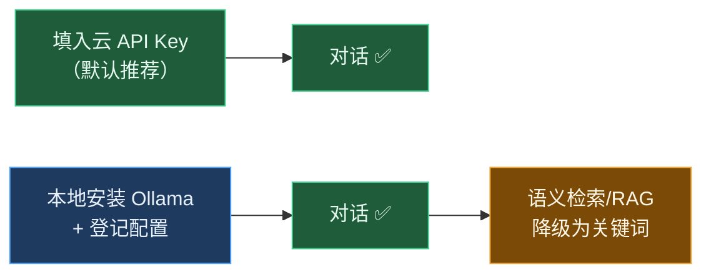

# 本地 LLM 集成（Ollama，零 Key 可选方案）

> 默认情况下，Negentropy 的 LLM 能力由 **OpenAI / Anthropic / Gemini 之一的 API Key 激活**（在 `.env.docker.local` 填入即可，见 [Quick Start](../../README.md)）。
> 本文面向**希望零付费 Key、完全本地运行**的用户，指引如何接入 [Ollama](https://ollama.com) 作为本地 LLM。

Ollama 是 Negentropy 的一等公民 vendor（`config/llm.py` 中 `OLLAMA` 枚举、`ollama/` 模型前缀已内置）。本方案**不内置 Ollama 服务**，由用户宿主自行安装与集成，保持默认一键体验的轻量。

---

## 能力边界（先读）

| 能力 | 本地 Ollama 是否可用 | 说明 |
| :--- | :---: | :--- |
| 对话 / 推理 | ✅ | 经 `ollama/<model>` 路由，LiteLLM 直连 |
| 记忆（写入 / 关键词检索） | ✅ | 记忆落库不依赖嵌入 |
| **语义检索 / RAG / 知识库向量召回** | ⚠️ 降级 | 见下方「嵌入维度约束」 |
| Web 搜索 | — | 与 LLM 无关，需单独配置 Google Search |

> **嵌入维度约束**：向量列固定 `vector(1536)`（`models/base.py` `DEFAULT_EMBEDDING_DIM = 1536`）。Ollama 主流嵌入模型（如 `nomic-embed-text` 768 维、`bge-m3` 1024 维）**无法**直接作为落库嵌入。因此本地 Ollama 下，语义检索/记忆**降级为关键词匹配**（对话不受影响）。若需完整 RAG，请额外配置一个 1536 维云嵌入模型（如 `text-embedding-005`）。



---

## 1. 安装 Ollama 并拉取模型

```bash
# macOS / Linux
curl -fsSL https://ollama.com/install.sh | sh

# 建议模型：qwen2.5:7b（中英双语、Apache-2.0、16GB 内存/M 系 Mac 可流畅）
ollama pull qwen2.5:7b

# 验证服务（默认监听 :11434）
curl http://localhost:11434/api/tags
```

> 模型体量参考：7B ≈ 4.7GB。轻量机器可改用 `qwen2.5:3b`；追求质量可用 `qwen2.5:14b`。

---

## 2. 在 Negentropy 登记 Ollama 配置

登记一条 `vendor_configs`（Ollama，无 Key）与一条 `model_configs`（设为默认 llm）。两种方式任选：

### 方式 A：Admin UI（推荐）

进入 Admin → 模型配置：
1. 新增 **Vendor**：`ollama`，`api_base = http://localhost:11434`（`api_key` 留空或任意占位）。
2. 新增 **Model**：`model_type = llm`，`vendor = ollama`，`model_name = qwen2.5:7b`，勾选 **设为默认**。
3. 保存后即可在对话中使用。

### 方式 B：直接写表（SQL）

```sql
-- vendor_configs（api_key 为 NOT NULL，Ollama 无需真实 Key，填占位即可）
INSERT INTO negentropy.vendor_configs (vendor, api_key, api_base)
VALUES ('ollama', 'ollama', 'http://localhost:11434')
ON CONFLICT (vendor) DO NOTHING;

-- model_configs：置为默认 llm（若已有默认 llm 行，先取消其 is_default）
INSERT INTO negentropy.model_configs (model_type, display_name, vendor, model_name, is_default, enabled, config)
SELECT 'llm', 'Ollama Qwen2.5 7B (local)', 'ollama', 'qwen2.5:7b', true, true, '{"temperature":0.7}'
WHERE NOT EXISTS (
  SELECT 1 FROM negentropy.model_configs WHERE model_type = 'llm' AND is_default = true AND enabled = true
);
```

> 解析器优先级（`config/model_resolver.py`）：DB `is_default` 行 > 硬编码兜底（`openai/gpt-5-nano`）。故登记默认 Ollama 行后即生效，无需改代码或迁移。

---

## 3. Docker 用户：让容器访问宿主 Ollama

容器内 `localhost:11434` 指向容器自身，需改用 Docker 提供的宿主别名：

- 将方式 A/B 中的 `api_base` 改为 `http://host.docker.internal:11434`（macOS / Windows Docker Desktop）。
- Linux 原生 Docker：`api_base = http://172.17.0.1:11434`（默认 bridge 网关），并以 `--network host` 或额外 `extra_hosts: ["host.docker.internal:host-gateway"]` 配置。

---

## 4. 验证

```bash
./dev doctor          # 容器内；ollama 项应 PASS（探活 :11434）
# 或裸机：uv run negentropy doctor
```

随后在 UI（`http://localhost:3192`）发消息，应得到本地模型的流式回复。

---

## 参考

[1] Ollama, "Ollama." [Online]. Available: https://github.com/ollama/ollama.
[2] LiteLLM, "Ollama Provider." [Online]. Available: https://docs.litellm.ai/docs/providers/ollama.
