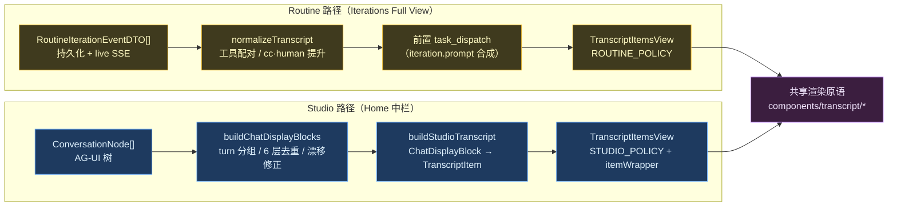

# 人机交互转录 UI：Routine 与 Studio 的统一架构

> Routine 迭代「Iterations Full View」与 Home/Studio 中栏的「人机交互」对话已统一为同一套**回合制转录渲染器**（`TranscriptItemsView` + `TranscriptPolicy`）。本文记录语义重映射、业界对照、机制 vs 策略正交分解与关键设计决策。
>
> - 前置：[The Routine System](./039-the-routine-system.md) · [Routine 多 Agent 归因（一核五翼 Faculty）](./040-routine-multi-agent-faculty.md) · [A2UI 协议](../a2ui.md)
> - 理论：[Conversation Foundation](../conversation-foundation.md) · [AG-UI 协议调研](../../research/agent-infra/070-ag-ui.md)

---

## 1. 背景与动机

两处「人机交互」UI 长期**双轨割裂**：

- **Routine Iterations Full View** 已有一套成熟的回合制转录 UI（`TranscriptView`）：按发言方左右分栏、per-agent 角色徽章、可展开的**按类型渲染工具卡**（shell / read / edit-diff / write / search / sub_agent）、≥3 连续工具折叠、thinking 折叠、在途 `WorkingIndicator`。
- **Home/Studio 中栏** 则是另一套流式聊天渲染（`ChatStream` → `MessageBubble` / `AssistantReplyBubble`），观感与 Routine 不一致，且无 per-agent 显化。

割裂带来三类成本：① 用户在两处切换时**认知摩擦**；② 设计语言**双份维护**；③ 工具调用渲染深度不一（Studio 浅、Routine 深）。目标：**让 Studio 中栏复用 Routine 的同一套转录渲染器**，仅做语义重映射，使「设计语言单一事实源」。

## 2. 业界对照研究

回合制（turn-based）人机交互 UI 是当前主流编码/会话 Agent 产品的公约数。三家范本的对齐要点：

| 产品 | 回合组织 | 工具调用 | 思考片段 | 在途态 |
|---|---|---|---|---|
| **Conductor**<sup>[[1]](#ref1)</sup> | `data-turn-index` 分组、左右分栏 | 可展开卡 + diff/terminal 分节、≥3 折叠 | 可折叠 `thinking` 块 | Lottie `running` / `typing` / `waiting` |
| **ChatGPT**<sup>[[2]](#ref2)</sup> | 单列时间线、Reasoning 折叠 | 工具卡折叠 + 参数/结果分节 | Reasoning 默认折叠 | 进度条 + 气泡内三点 |
| **Claude.ai** | 单列、思考可展开 | 工具时间线 + 紧凑摘要 | Thinking 展开式 | 流式光标 + 状态文案 |

**提炼共性**（本系统采纳）：① 按发言方**左右分栏**区分人/机；② 工具调用**可展开折叠**，按类型给差异化明细（diff / 命令 / 内容）；③ 思考片段**默认折叠**降噪；④ 在途态**脉冲指示**（Working… / Planning…）。详见 [Conversation Foundation](../conversation-foundation.md) 的「行业基线」节与 [AG-UI 协议调研](../../research/agent-infra/070-ag-ui.md) 的事件模型分析。

## 3. 语义重映射（核心差异）

同一渲染器，两处「人/机」语义不同——这是唯一需要策略化的差异：

| 维度 | Routine（Iterations Full View） | Studio（Home 中栏） |
|---|---|---|
| **人（居右）** | 一核五翼 6 Agent（审 Plan / 答问 / 门控 / 评估） | 真实用户输入 |
| **机（居左）** | Claude Code（assistant / tool / cc_request） | 一核五翼 Agents + Claude Code（均带 per-agent 徽章） |
| 编排者 | Negentropy Engine（gate / evaluation / result，居右） | 无独立编排者 |
| 触发模型 | ADK 事件流 + Routine 编排 | AG-UI 事件流 + 用户直连 |

> 直觉记忆：**Routine 里「人」是 Agent 团队、「机」是 Claude Code；Studio 里「人」是用户、「机」是 Agent 团队 + Claude Code。**

## 4. 架构方案（机制 vs 策略正交分解）

**单一渲染器 `TranscriptItemsView`**（纯展示，policy 化）+ **`TranscriptPolicy` 契约**（承载左右对齐 / 徽章 / 在途文案差异）+ **两个适配器**（各自把域数据归一化为 `TranscriptItem[]` IR）。



`TranscriptPolicy` 契约（`components/transcript/policy.ts`）：

```ts
interface TranscriptPolicy {
  align(item: TranscriptItem): "left" | "right";        // 物理对齐
  turnGroup?(item: TranscriptItem): string;             // 换方间距的发言人分组（缺省回落 align）
  roleHeaderFor(item, prev): AgentRole | null;          // 机侧 per-agent 徽章（null=不渲染）
  workingLabel?(last): string;                          // 在途 WorkingIndicator 文案
}
```

- **`ROUTINE_POLICY`**：`human_reply`/`task_dispatch`/`engine` 居右、其余居左；`turnGroup` 三分（cc / human / engine）；`roleHeaderFor` 在机侧（cc）回合切换处显 `claude_code` 徽章（连续机侧不重复刷；人侧 engine/human_reply/task_dispatch 自带内嵌徽章不重复），让 Routine 人↔CC 对话结构显化（对齐 Conductor 机侧身份标注）。
- **`STUDIO_POLICY`**：仅 `user` 居右、其余全居左；`roleHeaderFor` 在机侧 `role` 相邻变化时渲染徽章（分组降噪）；不设 `turnGroup`（回落 align）。

薄壳 `TranscriptView`（Routine）与 `StudioTranscript`（Studio）各自归一化后委派给同一渲染器，**外部签名稳定、行为各表**。

## 5. TranscriptItem 视图模型

12 个 kind 的判别联合（`components/transcript/types.ts`）：

| Kind | 用途 | Routine | Studio | 对齐 |
|---|---|:-:|:-:|:-:|
| `task_dispatch` | 开场任务下发（`iteration.prompt` 合成） | ✓ | — | 右 |
| `user` | 真实用户文本 | — | ✓ | 右 |
| `assistant` | 文本（可带 thinking / citations / streaming / role） | ✓ | ✓ | 左 |
| `tool` | 单次工具调用（可展开 / running / progress / role） | ✓ | ✓ | 左 |
| `tool_summary` | ≥3 连续工具折叠（透传 role） | ✓ | ✓ | 左 |
| `cc_request` | 机→人请求（ExitPlanMode / AskUserQuestion） | ✓ | — | 左 |
| `human_reply` | 人→机应答（approve / refine / answer / deny） | ✓ | — | 右 |
| `engine` | Engine 编排产出（gate / evaluation / result） | ✓ | — | 右 |
| `system` | Routine 系统事件（携带 DTO，可展开 payload） | ✓ | — | 左 |
| `system_note` | Studio 纯文本系统/状态/摘要行 | — | ✓ | 左 |
| `truncated` | 动作数超限截断哨兵 | ✓ | — | 左 |

可选字段（全 additive）：`role: AgentRole`（机侧 + human_reply）、`nodeId: string`（Studio 选中/搜索）、`citations: Citation[]`（assistant，Studio 引用尾注）、`progress: ToolProgressSnapshot`（tool，Studio 流式进度）、`streaming` / `thinking`（assistant）。Routine 归一化不填这些可选字段——机侧 identity 不依赖 `role`，而由 `ROUTINE_POLICY.roleHeaderFor` 按 `kind` 在回合切换处统一投射为 `claude_code`（故 Routine 不再逐像素等价于历史裸文观感，属主动语义升级）。

## 6. Agent 身份映射

跨域单一事实源 `features/agent-identity/`。`AGENT_ROLE_META`（标签 / 图标 / 徽章配色）：

| Role | 中文 | Lucide 图标 | 徽章配色（dark-safe） |
|---|---|---|---|
| `engine` | Negentropy | `Cpu` | slate |
| `claude_code` | Claude Code | `Bot` | violet |
| `perception` | 慧眼 | `Eye` | cyan |
| `action` | 妙手 | `Hand` | orange |
| `internalization` | 本心 | `BrainCircuit` | emerald |
| `contemplation` | 元神 | `Sparkles` | indigo |
| `influence` | 喉舌 | `Megaphone` | rose |

`agentRoleFromAuthor(author)` 用大小写不敏感子串匹配（兼容 EN + 中文学名 + 别名前后缀）把 ADK `message.author` 派生为 `AgentRole`；未知回退 `engine`。后端 agent 名源自 `apps/negentropy/src/negentropy/agents/agent.py`：根 `NegentropyEngine` + 五翼 `PerceptionFaculty` / `InternalizationFaculty` / `ContemplationFaculty` / `ActionFaculty` / `InfluenceFaculty`。

## 7. 关键决策与权衡

1. **`turnGroup` 三分（Routine）**：`engine` 与 `human_reply`/`task_dispatch` 都居右，但语义不同（编排者 vs 人侧 Agent）。若仅按 `align` 二态判换方间距，连续的 human→engine 会被当同方（8px），丢失编排转折的视觉呼吸；按 speaker 三分（cc / human / engine）才正确触发 16px 换方间距。Studio 无此三分语义，回落 `align`。
2. **`collapseToolRuns` 在 `tool_summary` 透传 `role`**：≥3 工具折叠后，Studio 的徽章分组逻辑（`roleHeaderFor`）需以折叠行首工具的 role 参与「上一条机侧 role」比较，避免折叠行后又重复刷同 role 徽章。Routine 的 tool 无 role，透传 `undefined` 无副作用。
3. **`citations` 仅挂首个 text 段**：避免同回合格式化的引用尾注块重复出现。聚合走 `extractCitationsFromToolCalls`（`utils/citation-parser.ts`），匹配 `search_knowledge_base` / `search_knowledge_graph_with_papers` 的 `formatted_citation`。
4. **Studio `itemWrapper` 挂 `data-testid="message-bubble"` + `data-message-role`**：旧 E2E「双气泡守卫」（防流式 dedup 双气泡）依赖该选择器；新 UI 把 text 段拆为独立气泡，但单文本回复仍恰好 1 气泡——选择器兼容让守卫零改动保留。
5. **类型化工具明细**：`derive-tool-detail.ts` 按工具名分派到 `shell / read / edit / write / search / fetch / sub_agent / plan / generic` 九类，`tool-detail-sections.tsx` 各自渲染（shell 显 `$ cmd + output`，edit 显 diff，read/write 显等宽内容等）。这是 Routine 范式的深度复用，Studio 直接受益。
6. **机制 vs 策略边界**：渲染原语（block 组件、`collapseToolRuns`、`status-shared`、`message-shared`）与域无关，落 `components/transcript/`；事件耦合的归一化（`normalize-transcript` 消费 `RoutineIterationEventDTO`）留 `app/interface/routine/`；跨包对 Routine 的 DTO 仅 `import type`（运行时零反向依赖）。

## 8. 边缘 Case 与回归守卫

| Case | 机制 | 位置 |
|---|---|---|
| 流式 dedup | 复用 `buildChatDisplayBlocks`（6 层去重 + 时钟漂移排序 + reasoning/agent-transfer）；`nodesFingerprint` 含子内容长度保证流式更新 | `StudioTranscript` / `chat-display.ts` |
| ≥3 连续工具折叠 | `collapseToolRuns` 折叠非 running 工具；任何非 tool 项打断 flush；running 工具排除 | `collapse-tool-runs.ts` |
| 引用聚合 | `replyCitations` 从 assistant-reply 的 tool-group 段提取（按 `rawName` 匹配原始工具名），仅挂首段 text | `build-studio-transcript.ts` |
| 工具进度旁路 | `progressMap[tool.id]`（state_delta SSE）透传到 `tool.progress`，渲染细进度/阶段行 | `build-studio-transcript.ts` / `ExpandableToolCallRow` |
| 节点选中 / 搜索 | `itemWrapper` 挂 `data-node-id` + 点击 ring + 搜索高亮 ring + `scrollIntoView` | `StudioTranscript` |
| 在途指示器 | `pending && !lastIsStreamingAssistant` 时尾随 `WorkingIndicator`；label 由 `policy.workingLabel` 解析（cc_request+pending → Planning…，否则 Working…） | `TranscriptItemsView` |
| CC 交互错误红显 | `AssistantText` 用 `CC_ERROR_RE` 检测「returned an error」等模式，红框 + ⚠ | `AssistantText.tsx` |
| 机侧回合徽章 | `ROUTINE_POLICY.roleHeaderFor` 按 `kind` 在机侧回合切换处显 `claude_code`；连续机侧不重复刷；人侧块不挂外层徽章（自带内嵌） | `policy.ts`（`isMachineItem` 类型守卫）+ `IterationEventTimeline.test.tsx` 3 条回归守卫 |
| Studio 用户头像 | `StudioTranscript` 经 `useAuth` + `UserAvatar` 注入 `userAvatar` 到 `UserBubble` 右侧（OAuth 图/首字母） | `StudioTranscript.tsx` / `UserBubble.tsx` |
| 在途态耗时计时 | `WorkingIndicator` 接 `workingElapsedStartMs`（Routine=`iteration.started_at`，Studio=`runStartedAtMs` state），复用 `ClockProvider` 同范式 tick；格式 `1m 23s` | `WorkingIndicator.tsx`（`formatElapsed`）/ `home-body.tsx` / `IterationAuditDrawer.tsx` |
| 长消息折叠 | `AssistantText` 正文超 `LONG_MESSAGE_THRESHOLD_CHARS`(1500) 折叠为限高 + 渐隐 + 「展开全文」（对齐 Conductor Show full message） | `AssistantText.tsx`（`AssistantBody`）/ `style.ts` |
| thinking 折叠 | 默认收起为「思考…」单行 + Brain 图标，点击展开 | `AssistantText` |
| 空 assistant 丢弃 | 仅 `{raw}` 无 text 的 assistant 事件归一化时丢弃，防空气泡 | `normalize-transcript.ts` |
| 持久化 + live 合并 | `mergeEvents` 按 `seq` 去重（持久化优先）+ 升序重排 | `IterationAuditDrawer.tsx` |

## 9. 关键文件索引

| 路径 | 角色 |
|---|---|
| `components/transcript/TranscriptItemsView.tsx` | SSOT 策略化渲染器 |
| `components/transcript/policy.ts` | `TranscriptPolicy` + `ROUTINE_POLICY` + `STUDIO_POLICY` |
| `components/transcript/types.ts` | `TranscriptItem` 视图模型（12 kind） |
| `components/transcript/collapse-tool-runs.ts` | ≥3 工具折叠 |
| `components/transcript/{AssistantText,ExpandableToolCallRow,ToolSummaryRow,CcRequestBlock,HumanReplyBlock,EngineMessageBlock,TaskDispatchBubble,UserBubble,SystemNoteRow,WorkingIndicator}.tsx` | block 原语 |
| `components/transcript/{message-shared,status-shared,derive-tool-detail,tool-detail-sections}.ts(x)` | 共享明细/徽章/状态 |
| `features/agent-identity/` | `AgentRole` / `AGENT_ROLE_META` / `agentRoleFromAuthor`（跨域 SSOT） |
| `app/interface/routine/_components/transcript/{TranscriptView,normalize-transcript}.ts(x)` | Routine 适配器（薄壳 + 事件归一化） |
| `app/interface/routine/_components/{IterationAuditDrawer,IterationEventTimeline}.tsx` | Routine Full View 容器 |
| `components/ui/StudioTranscript.tsx` | Studio 外壳（滚动 / FAB / 空态 / 选中 / 搜索） |
| `components/ui/studio-transcript/build-studio-transcript.ts` | Studio 适配器（block → TranscriptItem） |
| `app/home-body.tsx` | 接入点（`<StudioTranscript>` 替换 `<ChatStream>`） |

## 10. 演进路径

沿用 [040 ADR](./040-routine-multi-agent-faculty.md) 的 Phase 路线：Phase 2 后端落地 `agent_role` 字段后，归一化层切 `ev.agent_role ?? deriveHumanRole(action)`，前端零扩散；Studio 侧 `agentRoleFromAuthor` 同样可平滑切到后端归因字段（当 ADK 事件流显式携带 agent 元数据时）。短期可演进项：① Routine/Studio 的 thinking 与 Reasoning Panel 统一（[0002 RFC](../design/0002-ui-interaction-enhancements.md)）；② 工具明细的 Mermaid / 大输出虚拟化。

## 11. 风险评估

| 编号 | 风险 | 影响 | 概率 | 对策 |
|---|---|---|---|---|
| R1 | Routine 渲染回归（迁移共享模块 / 机侧徽章化 / 气泡化） | 高 | 低 | 转录契约测试全绿（机侧徽章新增 3 条回归守卫）；`ROUTINE_POLICY.roleHeaderFor` 改为机侧回合显 `claude_code`、`AssistantText` 正文套机侧气泡，「逐像素等价」承诺已主动解除（任务明确的语义升级，注释/文档同步） |
| R2 | 流式 key 抖动致重挂载 | 中 | 中 | item key `${kind}-${seq}-${id}`，`id` 源自稳定 nodeId；fingerprint memo 含子内容长度 |
| R3 | per-agent 归因失真（author 字段不规范） | 中 | 低 | 子串匹配 + 中文学名兜底 + 未知回退 engine；Phase 2 切后端字段后消除 |
| R4 | Studio 选择器破坏旧 E2E | 中 | 中 | `itemWrapper` 挂 `data-testid="message-bubble"` + `data-message-role`，双气泡守卫零改动保留 |
| R5 | 跨包对 Routine DTO 的运行时耦合 | 低 | 低 | `import type` 擦除；共享包无运行时反向依赖 |

---

### 参考

<a id="ref1"></a>[1] Conductor Team, "Conductor — Run multiple coding agents in parallel," *conductor.com*, 2025. [Online]. Available: https://conductor.com
<a id="ref2"></a>[2] OpenAI, "Introducing ChatGPT & Canvas: agentic tool use," *openai.com*, 2025. [Online]. Available: https://openai.com
