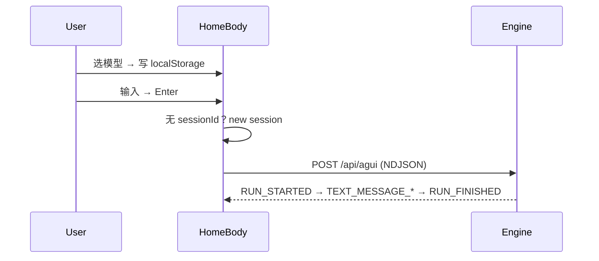
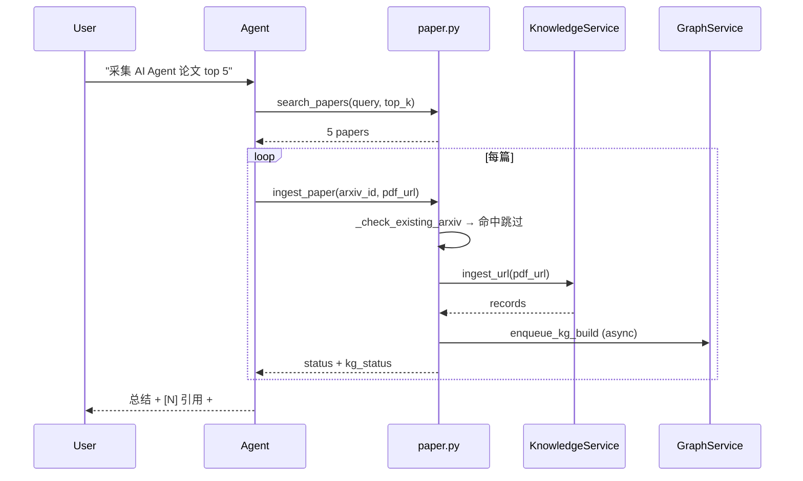

# Home / 人与 Agent 对话 · 主模块特性手册

> 本手册覆盖「Home 对话」**所有主模块特性**的最小操作指引。理论与对标参考 [conversation-foundation.md](../conversation-foundation.md)，协议事实参考 [framework.md](../framework.md) §9 与 [a2ui.md](../a2ui.md)，主用户手册参见 [user-guide.md](../../user-guide.md) §3。

## 0. 入口

- 浏览器打开 `https://<your-domain>/`（首页即 Home 对话）。
- 自签 dev cookie 注入流程参见 [agents/browser-validation.md](../agents/browser-validation.md)。

## 1. 发起对话与模型选择

**能做什么**：选择具体 LLM 模型、新建会话、输入指令开始对话。

**怎么做**：
1. 顶部模型下拉选择目标模型（例：`claude-opus-4-7` / `gpt-5.4` / `gemini-2.5-pro`）。
2. 输入框打字 → Enter 发送。无 sessionId 时系统自动新建会话并保留首条消息（pending buffer）。
3. 模型选择写入 `localStorage`（key 前缀 `home.llm_model`），刷新后保持。

**注意事项**：
- 不同模型的工具/推理表现差异较大；论文采集场景推荐 `claude-opus-4-7`。
- 模型按线程持久化，新会话沿用最近选择。



## 2. 输入框（Markdown / 附件 / 提示词模板）

**能做什么**：撰写多行输入、Markdown 预览、拖拽附件、引用提示词模板。

**怎么做**：
- Markdown：直接写 `# 标题` / `- 列表` / 代码块 ``` ` ` `；输入框支持 Shift+Enter 换行。
- 附件（C5 多模态）：拖拽文件到输入框 / 点 paperclip 图标；上限 20MB（`DEFAULT_ATTACHMENT_MAX_BYTES`，参见 `apps/negentropy-ui/components/ui/Composer.tsx`）。
- 提示词模板：通过 [Skills](./skills-basics.md) 体系发起；论文场景见 [skills-paper-hunter.md](./skills-paper-hunter.md)。

**注意事项**：附件以轻量 metadata（id/name/mime/size）透传，不在 message ledger 中存原文，避免双气泡风险（[issue.md ISSUE-031](../agents/issue.md)）。

## 3. 流式渲染与双气泡守卫

**能做什么**：看到 assistant 回复以 token 流形式即时呈现；用户消息与 assistant 消息严格各占 1 个气泡。

**怎么做**：自动行为，无需操作。

**注意事项**：
- 即使刷新页面，每条消息仍只显示 **一个** 气泡（`expect(messageBubbles).toHaveCount(1)` 是 E2E 守卫硬约束）。
- 若发现重复气泡，立刻按 [issue.md](../agents/issue.md) 模板提交 RCA。

## 4. 工具调用进度卡片（C3 Tool Progress）

**能做什么**：长耗时工具（论文采集、图遍历）显示流式进度条 + 阶段标签 + ETA。

**怎么做**：自动行为。后端工具通过 `state.tool_progress[tool_call_id]` 上报，前端 `ToolExecutionGroup` 渲染。

**注意事项**：进度走 state-delta 旁路，不参与 message ledger（[framework.md §9.7](../framework.md)）。

## 5. 中断 / Run 取消（C4 中断门）

**能做什么**：流式生成中点击 **Stop** 立即中断当前 run，agent 不再产生后续 token。

**怎么做**：流式生成时输入框右侧出现 Stop 按钮（红圈），点击即中断；100ms 内的 `runError` 信号被屏蔽（避免误显示错误）。

**注意事项**：取消后 session.state 已积累的中间结果会被保留；可再次发送指令继续。

## 6. Reasoning Panel（P2-4 G3 · 推理可见性）

**能做什么**：折叠/展开查看 LLM 的 step-by-step 思考链；论文场景下能看到 agent 选论文的依据。

**怎么做**：
1. 在 assistant bubble 上方有"思考完成 · N 步"折叠条；
2. 点击展开查看完整 ReasoningStep 列表；
3. 展开状态写 `localStorage` (`home.reasoning_panel.expanded`)，刷新后保持。

**注意事项**：
- 同 stepId 的 started/finished 会去重；超过 50 步显示"+N 更多步骤已折叠"。
- 不影响双气泡守卫：panel 在 bubble 内部，不计为额外 message。

## 6b. Sub-Agent 委派卡片（G1 · RFC 0002 §4.2）

**能做什么**：当 Root Agent 委派任务给子 Agent（如 PerceptionFaculty / KnowledgeAcquisitionPipeline）时，以嵌套卡片形式展示委派层级和状态。

**怎么做**：自动行为。委派卡片显示父 Agent → 子 Agent 的名称和状态指示灯：
- 🟢 绿色 = 完成
- 🔵 蓝色脉冲 = 执行中
- 🔴 红色 = 失败

点击卡片可展开查看子 Agent 响应摘要。

**注意事项**：
- 最大嵌套 3 层（防布局溢出）
- 委派卡片与普通工具卡片视觉区分（左侧 indigo 竖线 + 缩进）

## 6c. 对话内搜索 (Cmd/Ctrl+F)

**能做什么**：在当前会话中搜索关键词，快速定位历史消息。

**怎么做**：
1. 按 **Cmd/Ctrl+F** 打开搜索栏（位于顶部工具栏区域）。
2. 输入关键词 → 实时匹配高亮（黄色 ring）。
3. 按 **Enter** 跳转下一个匹配，**Shift+Enter** 跳转上一个。
4. 按 **Escape** 或点击关闭按钮退出搜索。

**注意事项**：
- 搜索范围包括消息文本、工具名称、推理内容
- 匹配计数显示为 `当前/总数` 格式
- 搜索仅限当前会话已加载内容，不跨会话

## 7. 引用与跳转（P2-3 G2 · Citation）

**能做什么**：当 agent 用知识库 / KG 工具检索时，回复中以 `[N]` 形式标号，气泡尾部展示「参考文献」清单，点击 `[N]` 或参考条跳 arXiv abs 页。

**怎么做**：
- 触发：自然语言提问（例："Reflexion 路线最相关的三篇论文是哪几篇？"）。
- 阅读：正文中 `[1]` `[2]` 角标；尾部 `## 参考文献` 节按序号列出 IEEE 风格 citation。
- 跳转：点击 `[N]` 或末尾条目 → 新标签页打开 `https://arxiv.org/abs/{id}`（无 arxiv_id 时回退 source_uri）。

**注意事项**：旧消息无 citations 字段时走零回归分支，与既有渲染等价。

## 8. 论文采集闭环（P2-1 + P2-2 + Paper Hunter）

**能做什么**：用一句话触发"采集 N 篇 AI Agent 论文 → 入知识库 → 自动入 KG"完整链路。

**怎么做**：
1. 在 Home 输入："**帮我采集近 7 天 AI Agent 相关论文 top 5**"。
2. 观察 Tool Progress 卡片显示 `search_papers` → `ingest_paper` 阶段；
3. 入库完成后 result 含 `kg_status: "kg_enqueued"`（KG 已异步排队构建）；
4. 重复同一查询 → 同 arxiv_id 返回 `status: "already_ingested"`，不重复下载（P2-1 幂等）。

**注意事项**：
- KG 构建是异步 fail-open；`kg_status: "kg_skipped"` 表示构建失败但**主路径成功**，已入库的知识仍可检索。
- 详细模板与 cron 调度参见 [skills-paper-hunter.md](./skills-paper-hunter.md) 与 [papers-curation.md](./papers-curation.md)。



## 9. KG 反向推荐（P2-3 · search_knowledge_graph_with_papers）

**能做什么**：基于知识图谱实体反查相关论文，对概念性问题（"哪些论文讨论 Transformer 架构"）召回率高于纯向量检索。

**怎么做**：自然语言提问触发；agent 按 [perception.py instruction](../../apps/negentropy/src/negentropy/agents/faculties/perception.py) 自动决定优先调 `search_knowledge_graph_with_papers` 还是 `search_knowledge_base`。

**注意事项**：KG 未构建时返回 `kg_status: "graph_empty"`，agent 自动 fallback 到向量检索。

## 10. 历史会话与归档

**能做什么**：左侧会话列表查看历史；改名 / 归档 / 切换会话。

**怎么做**：
- 改名：右键会话 → 重命名（API: `PATCH /apps/{app}/users/{user}/sessions/{session}/title`）。
- 归档：右键 → 归档（API: `POST /apps/{app}/users/{user}/sessions/{session}/archive`）。

**时间标签**：每个会话下方显示最后活动时间（如"3 分钟前"、"昨天"、"5/8"）。

## 11. 可观测性 / 日志面板

**能做什么**：右侧 Log 面板展示客户端结构化日志（user_cancelled_run / tool_call_id 失败等）；可一键导出 JSON。

**怎么做**：
- 缓冲：最多 500 条 FIFO；
- 导出：面板顶部 "Export JSON" 按钮 → 下载文件用于 RCA。

## 12. 审批策略（P3-2 MVP）

**能做什么**：在 Home 顶部下拉框选择会话级审批策略，控制工具调用的"自动门"。

**怎么做**：
1. Home 顶部 `ApprovalPolicySelector` dropdown 选 `always` / `per_tool`（默认）/ `never`：
   - **always**：任何工具调用前都弹审批 modal；
   - **per_tool**：仅高风险工具（`update_knowledge_graph` / `write_file` / `send_email` / `execute_code` / `publish_content` / `save_to_memory` / `ingest_paper` / `shell_command`）；
   - **never**：关闭审批门（仅 CI / 受信任沙箱启用）。
2. 工具命中策略后，前端弹 `ApprovalDialog` modal → 用户 **批准** / **拒绝**（可填备注）→ 工具继续 / 终止。

**注意事项**：
- 策略写 `localStorage` (`home.approval_policy`)，跨刷新保留。
- 已接入 `ingest_paper` 工具（PDF 下载 + 知识库写入前需用户确认）。其他高风险工具待后续迭代接入。
- 完整闭环：后端 `request_approval()` 写 `state.pending_approvals` → 前端 `ApprovalDialog` 读取并弹窗 → 用户决策 → BFF `POST /api/agui/sessions/{id}/approval_response` → 后端 `consume_approval_response()` 读取 `state.approval_responses`。
- 协议事实：后端 `apps/negentropy/src/negentropy/agents/approval.py`（`HIGH_RISK_TOOLS` / `should_request_approval`）。

## 13. KG Build Progress 实时订阅（P3-1）

**能做什么**：论文采集 → KG 自动闭环 触发后，前端通过 SSE 实时显示 KG 构建进度（百分比 / 实体 / 关系数）。

**怎么做**：自动行为。后端 `paper_kg_pipeline.enqueue_kg_build` 启动后台 build 后，前端 `KgBuildProgressPill` 组件通过 EventSource 订阅
`GET /api/knowledge/base/{corpusId}/graph/build-runs/latest/progress`，收到 `completed`/`failed` 终态自动 close。

**注意事项**：
- SSE 端点最长 15 分钟（`max_seconds=900`），超时返回 `status: timeout`；客户端可主动重订；
- 失败软退化：连接异常 → 显示「无法订阅」，不 retry（避免雪崩）；
- 协议字段：`{run_id, status, progress_percent, entity_count, relation_count, error_message}`。

## 14. GenAI 可观测性（P3-3）

**能做什么**：所有 LLM 调用自动写入 OpenTelemetry GenAI Semantic Conventions 1.28+ 标准属性，跨厂商可移植。

**怎么做**：自动行为。`bootstrap.py` 已注册 LiteLLM `otel` callback；`instrumentation.py` `_inject_genai_semconv_attrs` 在 span 上写入 `gen_ai.system` / `gen_ai.request.model` / `gen_ai.usage.input_tokens` 等。Langfuse trace 可直接查看。

**详细说明**：参见 [observability-genai.md](../design/observability-genai.md)。

## 浏览器实机回归 6 步检查表

针对 Home 对话每次发版前必做：

1. 注入自签 dev cookie，打开 Home → message-bubble count = 1。
2. 发起"采集 AI Agent 论文 top 5" → Tool Progress 流式 + result.kg_status=kg_enqueued。
3. 再次同 query → result.status=already_ingested。
4. 提问"Reflexion 路线最相关的三篇" → 响应含 [N] + 尾注 + arXiv 跳转。
5. 展开 Reasoning Panel → 折叠展开不破坏双气泡守卫。
6. 流式中点 Stop → 100ms 内中断，error 不误报。

每个场景重复 5 次刷新（参考 [feedback_repeated_bug_quality_bar.md](../../.claude/projects/-Users-cm-huang-Documents-projects-aurelius-negentropy/memory/feedback_repeated_bug_quality_bar.md)）。
