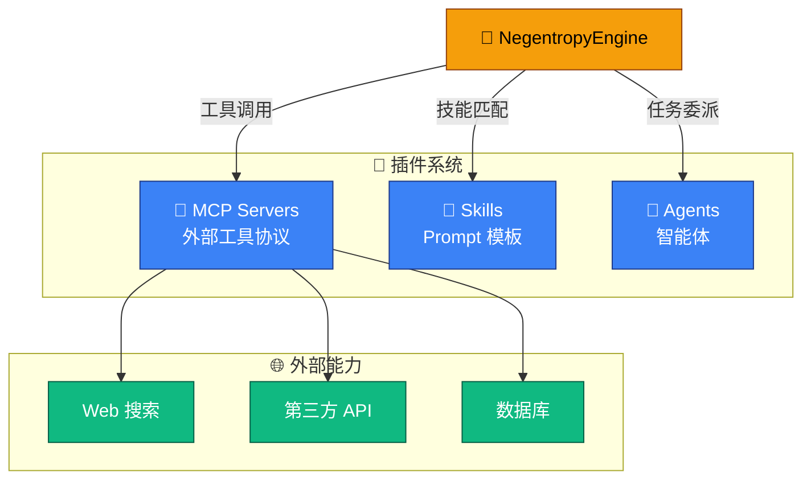
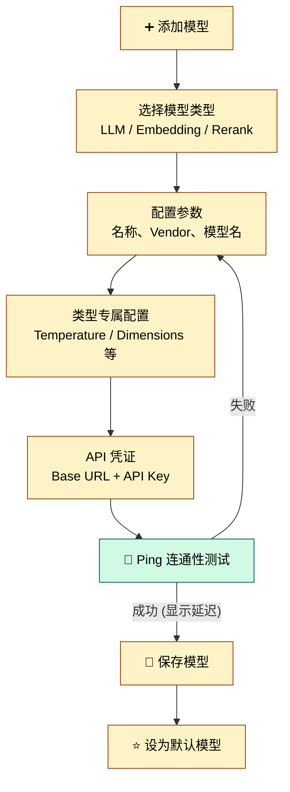

# Interface 能力接入

## 6. Interface 能力接入

Interface 模块将 Negentropy 的能力接入面板统一在同一顶层导航之下，覆盖模型（Models）、智能体（Agents）、MCP 服务器（MCP Servers）与技能（Skills）四个正交维度。

### 6.1 模块导航

进入 **Interface** 模块后，左侧导航栏提供以下子页面：

| 导航项          | 路径                   | 功能                           | 权限     |
| :-------------- | :--------------------- | :----------------------------- | :------- |
| **Dashboard**   | `/interface`           | Interface 仪表盘（含统计卡片） | 所有用户 |
| **Models**      | `/interface/models`    | 供应商凭证 + 模型注册 + Ping   | 仅 admin |
| **Agents**   | `/interface/agents` | 智能体管理                   | 所有用户 |
| **MCP Servers** | `/interface/mcp`       | MCP 服务器管理                 | 所有用户 |
| **Skills**      | `/interface/skills`    | 技能管理                       | 所有用户 |

> 说明：Models 页在顶部导航、Dashboard StatCard 与 Quick Links 中对 admin 以外用户隐藏；直接拼接 URL 访问 `/interface/models` 会被页内守卫重定向至 `/interface`。

### 6.2 Interface 仪表盘

仪表盘展示 Interface 模块的全局统计和快捷操作：

- **统计卡片**：Models（仅 admin）/ Agents / MCP Servers / Skills（均含各自启用数）
- **快捷链接**：Manage Models（仅 admin）/ Configure Agent / Register MCP Server / Create Skill

### 6.3 MCP Server 管理

MCP (Model Context Protocol) 是 Negentropy 接入外部工具的标准协议。

**Server 卡片**展示每个 MCP Server 的信息：

| 信息        | 说明                                    |
| :---------- | :-------------------------------------- |
| 名称 / 描述 | Server 的标识                           |
| 传输类型    | `stdio`（本地进程）或 `sse`（远程服务） |
| 启用状态    | 已启用 / 已禁用                         |
| 工具数量    | 该 Server 注册的工具数                  |

**核心操作**：

| 操作              | 说明                                                |
| :---------------- | :-------------------------------------------------- |
| **Add Server**    | 注册新的 MCP Server（配置名称、传输类型、命令/URL） |
| **Load Tools**    | 加载已启用 Server 的工具列表                        |
| **Try**           | 打开测试对话框，试用 Server 提供的工具              |
| **Edit / Delete** | 编辑或删除 Server                                   |

### 6.4 Skill 管理

Skill 是预定义的 Prompt 模板，可以为 Agent 赋能特定领域的技能。

**Skill 卡片**展示：

| 信息        | 说明             |
| :---------- | :--------------- |
| 名称 / 描述 | 技能的标识和说明 |
| Category    | 技能分类         |
| Version     | 版本号           |
| Priority    | 优先级           |
| 启用状态    | 已启用 / 已禁用  |

支持按 **Category** 下拉筛选，创建/编辑/删除 Skill。

### 6.5 Agent 管理

Agent 是可独立调度的智能体；NegentropyEngine 主 Agent 可在需要时将任务委派给具体 Agent。

**核心功能**：

| 操作                  | 说明                                                                        |
| :-------------------- | :-------------------------------------------------------------------------- |
| **Sync Negentropy 5** | 从 Negentropy 五大系部同步预设模板（显示同步结果：created/updated/skipped） |
| **Add Agent**      | 创建自定义智能体                                                          |
| **Edit / Delete**     | 编辑或删除 Agent                                                         |

**Agent 卡片**展示：

| 信息           | 说明                 |
| :------------- | :------------------- |
| 名称 / 描述    | 智能体的标识       |
| Agent Type     | 智能体类型           |
| Model          | 使用的模型           |
| Skills / Tools | 配置的技能和工具     |
| 是否内置       | 系统预设或用户自定义 |

### 6.6 Models 管理（仅 admin）

Models 页允许管理员在 Interface 模块下配置系统使用的 LLM、Embedding 和 Rerank 模型。

> 🔐 Models 页仅对具有 **admin** 角色的用户可见：顶部导航、Dashboard StatCard 与 Quick Links 对非 admin 隐藏；即便直接拼接 `/interface/models` URL 访问，也会被页内守卫重定向至 `/interface`。

#### 模型类型

系统支持三种模型类型：

| 类型          | 用途           | 专属配置                                                     |
| :------------ | :------------- | :----------------------------------------------------------- |
| **LLM**       | 对话与推理     | Temperature 滑块、Max Tokens、Thinking Mode（开关 + Budget） |
| **Embedding** | 文本向量化     | Dimensions、Input Type                                       |
| **Rerank**    | 搜索结果重排序 | —                                                            |

#### 支持的模型供应商

| 供应商    | 说明            |
| :-------- | :-------------- |
| OpenAI    | GPT 系列        |
| Anthropic | Claude 系列     |
| Vertex AI | Google Cloud AI |
| DeepSeek  | DeepSeek 系列   |
| Ollama    | 本地模型        |

#### 模型操作

| 操作          | 说明                                |
| :------------ | :---------------------------------- |
| **创建模型**  | 填写配置表单，支持 Ping 测试连通性  |
| **编辑模型**  | 修改已有模型的配置参数              |
| **设为默认**  | 将该模型设为对应类型的默认选择      |
| **启用/禁用** | 切换模型的可用状态                  |
| **删除**      | 移除模型配置                        |
| **Ping 测试** | 验证模型 API 的连通性，显示响应延迟 |

---
