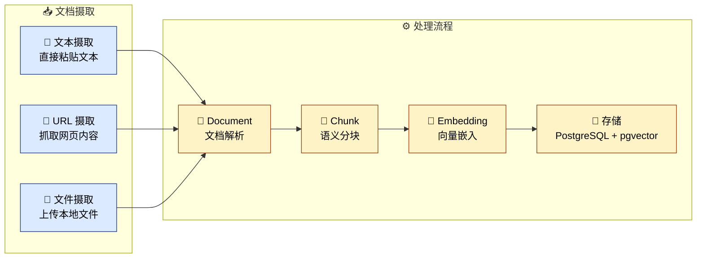

# 知识库管理

## 4. 知识库管理

知识库是 Negentropy 的「外部记忆」，支持文档摄取、语义分块、向量检索与知识图谱，实现知识的全生命周期管理。

### 4.1 模块导航

进入 **Knowledge** 模块后，左侧导航栏提供以下子页面：

| 导航项        | 路径                   | 功能                   |
| :------------ | :--------------------- | :--------------------- |
| **Base**      | `/knowledge/base`      | 语料库管理（核心入口） |
| **Pipelines** | `/knowledge/pipelines` | 管线运行概览与监控     |
| **Catalog**   | `/knowledge/catalog`   | 知识目录（树形结构）   |
| **Documents** | `/knowledge/documents` | 全局文档列表           |
| **Graph**     | `/knowledge/graph`     | 知识图谱可视化         |
| **APIs**      | `/knowledge/apis`      | API 文档与测试         |

### 4.2 Pipelines 管线概览

Pipelines 页面提供知识库的全局概览，采用两栏布局：

- **左侧主区域**：指标卡片网格（Corpus 数量、Knowledge 数量、最后构建时间）+ Pipeline Runs 列表（含分页控制）
- **右侧边栏**：Alerts 告警面板 + Pipeline Run 详情面板

运行中的 Pipeline 会自动轮询刷新状态。

### 4.3 语料库管理 (Base)

Base 是知识库管理的**核心页面**，支持两种视图模式：

#### Overview 模式

以卡片网格展示所有语料库，每张卡片显示：

- 语料库名称和描述
- 文档数量和知识数量
- 状态徽章
- 配置摘要

操作包括：选择进入详情、编辑配置、删除语料库、同步、查看设置。

#### Corpus 详情模式

进入某个语料库后，顶部显示语料库信息和操作按钮（返回、同步、重建、设置），下方通过 **Tab** 切换三个子面板：

| Tab                 | 功能                                                        |
| :------------------ | :---------------------------------------------------------- |
| **Documents**       | 文档列表（搜索、分页）、添加源、上传文档                    |
| **Settings**        | 切分策略配置（Fixed / Recursive / Semantic / Hierarchical） |
| **Document Chunks** | 文档分块列表、查看块详情、编辑块内容                        |

#### 文档摄取

Negentropy 支持三种文档摄取方式：



#### 知识检索

在语料库详情页的搜索栏中输入查询关键词，系统会执行**混合检索**（语义检索 + 关键词检索），返回相关的 `RetrievedChunkCard` 结果卡片。点击卡片可查看完整的块详情（`RetrievedChunkDetailDialog`），包括分块内容、来源文档和相关性分数。

### 4.4 知识目录 (Catalog)

Catalog 提供树形结构的知识组织方式，采用两栏布局：

- **左侧边栏**：语料库选择器 + 目录树（支持展开/折叠节点）
- **右侧主区域**：节点详情面板

支持创建子节点、更新节点信息、删除节点等操作。

### 4.5 知识图谱 (Graph)

知识图谱将语料库中的文档内容转化为**实体-关系网络**，支持可视化浏览、实体管理、混合检索和路径探索。

#### 4.5.1 构建知识图谱

1. 进入 **Knowledge > Graph** 页面
2. 在顶部下拉菜单中选择目标**语料库**
3. 点击右侧「构建图谱」按钮，系统将从语料库的知识块中提取实体和关系
4. 等待构建完成，侧栏「构建历史」面板显示状态、实体/关系统计和耗时

> 构建过程使用 LLM 提取实体和关系，耗时取决于语料库大小。

#### 4.5.2 图谱可视化

页面顶部切换到「可视化」Tab，可在 **Cytoscape**（Phase 4 默认，fCoSE 布局）和 **d3-force**（Phase 1 兼容回退）两种渲染引擎间切换：

| 操作         | 说明                                                             |
| :----------- | :--------------------------------------------------------------- |
| 选择语料库   | 顶部下拉菜单切换不同语料库的图谱                                 |
| 切换渲染引擎 | 顶部 `Cytoscape \| d3-force` 切换，500 节点以上推荐 Cytoscape    |
| 拖拽节点     | 按住节点拖动调整布局                                             |
| 缩放/平移    | 鼠标滚轮缩放（Cytoscape 阻尼较高更易控制），拖动画布平移         |
| **单击节点** | 右侧面板显示实体详情，1-hop 邻域高亮、其余节点淡化               |
| **双击节点** | 触发 `/graph/subgraph` 增量加载该节点 1 跳邻居（Cytoscape 模式） |
| 点击空白     | 取消选中，恢复全图视图                                           |

**节点编码**：
- 颜色：若实体已被分配 community（Louvain 检测后），按社区配色；否则按实体类型（蓝色 person、绿色 organization、黄色 location、红色 event、紫色 concept、粉色 product 等）
- 尺寸：与实体的 PageRank 重要性分数成正比（重要节点更大）

**节点上限**：超过 500 节点时画布右上角显式提示"已按 importance 截断"，建议双击重要节点展开邻居进行探索式发现。

#### 4.5.3 实体浏览与管理

切换到「实体列表」Tab，以表格形式浏览所有实体：

| 功能     | 说明                                  |
| :------- | :------------------------------------ |
| 类型筛选 | 右侧下拉菜单按实体类型过滤            |
| 名称搜索 | 输入框按名称模糊搜索                  |
| 点击实体 | 右侧详情面板显示关系列表（出边/入边） |
| 分页     | 底部分页控件浏览大量实体              |

实体详情面板展示：名称、类型、置信度、提及次数、描述，以及所有出边和入边关系。

#### 4.5.4 路径探索与邻居遍历

右侧面板提供图探索工具：

**路径探索**：选择两个实体后点击「查找路径」，系统使用 BFS 算法搜索最短路径（最多 5 跳）。找到路径后显示跳数，未找到则提示实体不连通。

**邻居遍历**：选择实体后，可按 1/2/3 跳展开其邻居节点。

#### 4.5.5 图谱统计

右侧「图谱统计」面板展示：

| 指标            | 说明                         |
| :-------------- | :--------------------------- |
| 实体数 / 关系数 | 图谱中的节点和边总数         |
| 平均置信度      | 所有实体置信度的平均值       |
| 图密度          | 实际边数 / 最大可能边数      |
| 平均度数        | 每个实体平均连接的边数       |
| 类型分布        | 各实体类型的数量和占比条形图 |

#### 4.5.6 构建历史

「构建历史」面板显示每次构建的结构化卡片：状态徽章（completed/failed）、实体数、关系数、耗时、使用的模型名称。

#### 4.5.7 多跳推理与证据链（Personalized PageRank）

涉及多步关联（如"X 公司谁负责 AI 项目并向 CEO 汇报？"）的问题，向量检索常常给不出连贯的答案。本特性基于 HippoRAG 范式：

1. 在右侧「多跳推理（PPR）」面板输入多跳问题
2. 系统自动从查询中提取候选种子实体（英文大写词、引号短语等）；亦可手动填充种子（用逗号分隔）
3. Personalized PageRank 以种子为偏置 teleport 向量传播 → 取 top-K 实体作为答案
4. 每条答案展开为完整证据链：从种子到目标的最短路径 + 沿途三元组 + evidence_text 原文
5. 若无可达路径或种子未匹配到图中实体，UI 会显式提示，避免误导

> 提示：评估证据链时应关注"路径长度"和"evidence_text 是否对应清晰事实"，单边 evidence 不足时建议扩大语料库或重跑构建。

#### 4.5.8 全局问答（GraphRAG Global Search）

针对"汇总性问题"（如"该语料库的核心主题是什么？""哪些社区贡献了最多关于 X 的事实？"），普通向量检索往往只能命中片段而难以聚合。本特性基于 Microsoft GraphRAG 的 Map-Reduce 范式：

1. 在右侧「全局问答（GraphRAG）」面板输入概览性问题
2. 系统并发对 Top-K（默认 10）社区摘要做"部分答案"生成（Map 阶段）
3. Reduce 阶段聚合多个社区的视角为最终答案，附带可展开的证据链
4. 若提示"实体已更新但社区摘要未刷新"，请回到 Build 面板重跑 PageRank + Louvain + 摘要流程

> 前置条件：语料库已构建图谱并跑过社区检测（Louvain）+ 摘要生成。响应延迟约 2-8 秒（取决于 max_communities 与 LLM 速度）。

#### 4.5.9 时间穿梭检索（双时态 as-of）

当语料库中的事实存在时态有效期（如"X 公司 2024-Q1 的 CEO 是谁？"），可以通过「时间穿梭检索」面板回到历史时刻查看图谱：

1. 在右侧「时间穿梭检索」卡片勾选「时间穿梭」复选框
2. 系统加载该语料库关系生效/失效的密度直方图（按天聚合）
3. 拖动 slider 选择历史时刻 → 顶部出现 `as_of: YYYY-MM-DD` 徽标
4. 此时图谱、邻居遍历、路径探索、图谱搜索均会按选定时刻过滤，仅返回当时仍有效的关系

> 提示：取消勾选即恢复"当前时刻"视图。该面板依赖 `valid_from / valid_to` 字段，由 LLM 提取与时态消解流水线写入；若直方图为空，先构建图谱并等待时态信息抽取完成。

#### 4.5.10 图谱质量评估

通过 API 端点 `GET /knowledge/base/{corpus_id}/graph/quality` 获取图谱质量报告：

| 指标                    | 说明                                   |
| :---------------------- | :------------------------------------- |
| dangling_edges          | 指向不存在实体的悬空边数量（理想值 0） |
| orphan_entities         | 无任何关系的孤立实体数量               |
| community_coverage      | 已分配社区的实体占比（0.0–1.0）        |
| entity_confidence_avg   | 所有实体的平均置信度                   |
| relation_evidence_ratio | 有原文证据的关系占比                   |
| quality_score           | 综合质量评分（0.0–1.0，加权算术平均）  |

> 综合评分权重：完整性（悬空边+孤立节点）40%、社区覆盖率 20%、置信度 20%、证据支持率 20%。

#### 4.5.11 Schema 引导构建（AI Paper 场景）

构建图谱时可指定 `extraction_schema` 参数约束 LLM 提取类型，适合领域特定的知识提取：

```json
{
  "enable_llm_extraction": true,
  "extraction_schema": "ai_paper"
}
```

**AI Paper Schema** 预置以下类型：

- **实体**：Author（作者）、Method（方法/模型）、Dataset（数据集）、Metric（评估指标）、Result（定量结果）、Institution（机构）、Conference（会议）、Concept（概念）
- **关系**：PROPOSED_BY（提出者）、AFFILIATED_WITH（从属）、PUBLISHED_AT（发表 venue）、EVALUATED_ON（评估数据集）、ACHIEVES（达成结果）、OUTPERFORMS（超越）、EXTENDS（扩展）、USES_CONCEPT（使用概念）、MEASURED_BY（度量方式）

### 4.6 Pipeline 监控

Pipeline 页面展示所有知识处理流水线的运行记录，包括：

- 运行状态（Pending / Running / Completed / Failed）
- 各 Stage 的执行详情和耗时
- 错误信息（如有）
- 运行中的作业自动轮询刷新

### 4.7 API 文档与测试 (APIs)

APIs 页面提供交互式的 API 文档和测试环境：

- **左侧**：API 统计卡片（总调用次数、成功/失败计数、平均延迟）+ API 文档面板
- **右侧**：端点列表 + Try It 测试面板（参数输入 → 执行 → 查看结果）

> 更深入的知识系统设计，请参阅 [知识系统](../../concepts/035-the-knowledge-base.md) 和 [知识图谱](../../concepts/036-the-knowledge-graph.md)。

---
