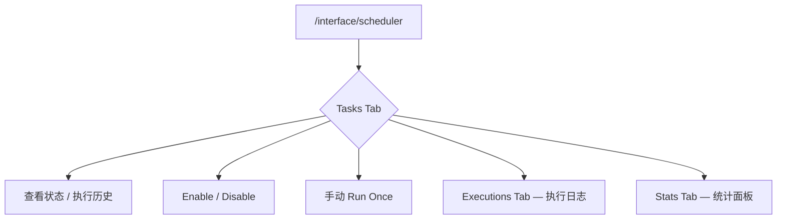

# Memory Automation Guide：自动化调度与运维

> 运维侧手册。前置阅读 [`memory-basics.md`](./memory-basics.md)。

---

## 1. 调度架构

Memory Automation 的 3 个定时作业已从 pg_cron 迁移至 **Unified Scheduler**（基于 `ScheduledTaskRegistry` 的应用层心跳模式），通过 `/interface/scheduler` 页面统一管理。

| 任务 Key | Scheduler Key | 频率（默认） | 作用 | 实现入口 |
|---|---|---|---|---|
| `cleanup_memories` | `memory_cleanup` | 每天 02:00 | 基于 Ebbinghaus 遗忘曲线清理低价值记忆 | [`handlers/memory_automation.py`](../../negentropy/src/negentropy/engine/schedulers/handlers/memory_automation.py) |
| `trigger_consolidation` | `memory_consolidation` | 每小时 | 按时间窗口批量触发会话巩固任务 | [`handlers/memory_automation.py`](../../negentropy/src/negentropy/engine/schedulers/handlers/memory_automation.py) |
| `reweight_relevance` | `memory_reweight` | 每 6 小时 | Rocchio 相关性重加权 | [`handlers/memory_automation.py`](../../negentropy/src/negentropy/engine/schedulers/handlers/memory_automation.py) |

> 三个任务共享 `handler_kind = 'memory_automation'`，由 `task.payload.job_type` 路由到具体子处理函数。参数全部从 `task.payload` 读取（带默认值），不依赖外部配置表。

---

## 2. 任务管理入口



所有操作均需 Admin 权限，支持 SSE 实时推送执行事件。

---

## 3. 通过 Scheduler REST API 配置

```bash
# 查看所有任务
curl -H "Authorization: Bearer $TOKEN" \
  "http://localhost:3292/api/scheduler/tasks"

# 启用/禁用任务
curl -X POST -H "Authorization: Bearer $TOKEN" \
  "http://localhost:3292/api/scheduler/tasks/{task_id}/toggle"

# 手动触发一次
curl -X POST -H "Authorization: Bearer $TOKEN" \
  "http://localhost:3292/api/scheduler/tasks/{task_id}/run"

# 查看执行历史
curl -H "Authorization: Bearer $TOKEN" \
  "http://localhost:3292/api/scheduler/executions?handler_kind=memory_automation"
```

---

## 4. 监控指标（可观测性）

### 4.1 检索效果 Metrics

```bash
curl -H "Authorization: Bearer $TOKEN" \
  "http://localhost:3292/api/memory/retrieval/metrics?user_id=alice&days=30"
# → {total_retrievals, precision_at_k, utilization_rate, noise_rate}
```

- `utilization_rate` < 30% 提示有大量召回未被引用，可能需要调整 `memory_ratio`
- `noise_rate` > 50% 提示触发了显式 `irrelevant` 反馈，需检查 query embedding 质量

### 4.2 Scheduler 执行日志

```bash
curl -H "Authorization: Bearer $TOKEN" \
  "http://localhost:3292/api/scheduler/executions?handler_kind=memory_automation&limit=20"
```

### 4.3 评测基线（CI 周报）

每周一凌晨 04:37 自动跑 [`memory-eval` workflow](../../../.github/workflows/memory-eval.yml)，产出 markdown 报告作为 artifact 保存 30 天。

---

## 5. Phase 4 — Core Block 维护策略

Core Block 不参与衰减，但仍可被治理：
- **量化控制**：单条 Core Block ≤ 2048 tokens（超限自动截断 + `metadata.truncated=true`）
- **版本审计**：每次 upsert `version+1`，`updated_by` 记录主体（user / agent）
- **GDPR 合规**：用户请求遗忘时 `DELETE /core-blocks` 物理删除（与 `Memory.delete` 决策一致）

---

## 6. 反馈闭环

显式反馈可用于改进检索：
```bash
# 标记某次检索结果有用 / 无关 / 有害
curl -X POST -H "Content-Type: application/json" \
  -H "Authorization: Bearer $TOKEN" \
  -d '{"log_id": "<uuid>", "outcome": "helpful"}' \
  http://localhost:3292/api/memory/retrieval/feedback
```

`outcome` ∈ {`helpful` / `irrelevant` / `harmful`} 写入 `memory_retrieval_logs.outcome_feedback`，由 Rocchio 风格重排<sup>[[27]](#ref27)</sup>下游消费。

### Rocchio Relevance Reweight

定期聚合用户反馈，调整记忆检索权重。默认禁用，需在 `/interface/scheduler` 中手动启用 `memory_reweight` 任务。

**前提条件：** 需先通过 `POST /api/retrieval/feedback` 提交检索反馈，且 `NE_MEMORY_RELEVANCE__ENABLED=true` 已开启。

---

## 7. 备份与还原

```bash
# 备份 Memory schema 全部数据
pg_dump -h localhost -U postgres negentropy_db \
  -n negentropy --data-only > memory_backup_$(date +%Y%m%d).sql

# 仅备份 Core Blocks（建议每天单独备份）
pg_dump -h localhost -U postgres negentropy_db \
  -t negentropy.memory_core_blocks --data-only > core_blocks_$(date +%Y%m%d).sql
```

> 数据迁移操作严禁直接删除现有数据，参考 [`AGENTS.md`](../../../AGENTS.md) "Database Management" 章节。
