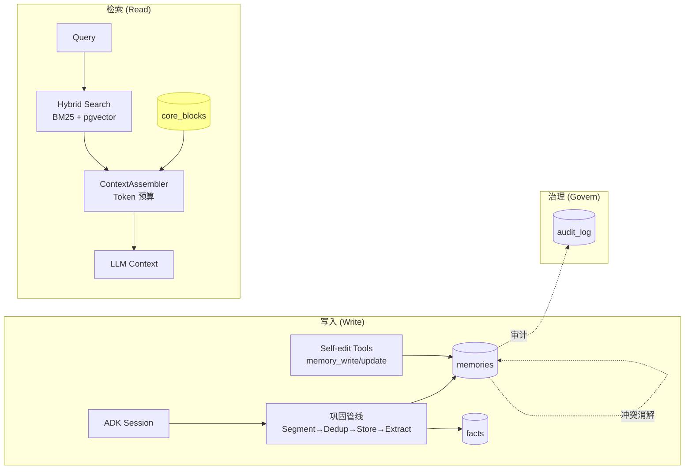

# Memory User-Guide：5 分钟上手

> 本文聚焦"概念入门 + UI 导航"。深入设计原理见 [`025-the-memory-system.md`](../../concepts/025-the-memory-system.md)；理论支撑见 [`026-memory-whitepaper.md`](../../concepts/026-memory-whitepaper.md)；API 集成见 [`memory-integration.md`](./memory-integration.md)。

---

## 1. 一图认识 Memory 模块



---

## 2. 6 类记忆类型

| 类型         | 衰减率 (λ/天) | 重要性权重 | 何时使用                                      |
| ------------ | ------------- | ---------- | --------------------------------------------- |
| `core`       | 0.0           | 1.0        | 用户/Agent 主动维护的常驻摘要（Phase 4 新增） |
| `semantic`   | 0.005         | 0.95       | 概念性事实（"用户是 Rust 工程师"）            |
| `preference` | 0.05          | 0.9        | 偏好（"用户喜欢深色主题"）                    |
| `procedural` | 0.06          | 0.75       | 流程/技能（"如何部署服务"）                   |
| `fact`       | 0.08          | 0.6        | 通用事实（事件、数据点）                      |
| `episodic`   | 0.10          | 0.4        | 情景对话（默认；快衰减）                      |

> 衰减率/权重定义见 `apps/negentropy/src/negentropy/engine/governance/memory.py` `_MEMORY_TYPE_DECAY_RATES`。

---

## 2.5 高级特性（默认开箱即用）

5 个高级特性现已**默认全部启用**（开箱即用），并各自带运行时安全闸，必要时可一键关闭。详细工程契约见 [`025-the-memory-system.md`](../../concepts/025-the-memory-system.md) §10 与 [`026-memory-whitepaper.md`](../../concepts/026-memory-whitepaper.md) §4。

| 特性                      | 配置项（YAML / 环境变量）                       | 默认       | 运行时安全闸                                              | 性能成本                                         |
| ------------------------- | ----------------------------------------------- | ---------- | -------------------------------------------------------- | ------------------------------------------------ |
| **F1 HippoRAG PPR 检索**  | `memory.hipporag.enabled`                       | `true`     | `min_kg_associations≥100` 数据闸：KG 稀疏时自休眠回退 Hybrid；120ms 超时降级；`gray_users` 白名单 | +50ms P95（含 120ms 超时）                       |
| **F2 Reflexion 反思召回** | `memory.reflection.enabled`                     | `true`     | `max_inflight_tasks=8` 并发硬上限防风暴；日限 ≤10/用户；仅 `irrelevant`/`harmful` 触发 | LLM 调用按 dedup + 上限计费                       |
| **F3 Memify 巩固管线**    | `memory.consolidation.steps`（6 步）            | 6 步全开   | `policy=fail_tolerant`：单步失败不中断全链；每步 30s 超时 | 2 步为 LLM（fact_extract / entity_normalization / summarize），写路径增量                       |
| **F4 Presidio PII**       | `memory.pii.engine=presidio` + `gatekeeper_enabled` | `presidio` + 守门员开 | `allow_engine_fallback=true`：缺 spaCy 模型时降级 regex 并写 ERROR（`/memory/health` 可观测），不阻断启动 | 冷启 +200MB（spaCy 模型）；运行时 P99 < 5ms      |
| **Rocchio 反馈闭环**      | `memory.relevance.enabled`                      | `true`     | 权重夹 `[0.5,2.0]`；<3 反馈返中性 1.0；写侧由 cron 周期重加权 | 读侧 dict 查表，近乎零成本                        |

> **可观测性**（默认开）：`memory.observability.health_enabled` / `metrics_enabled` → `/memory/health`（暴露当前生效的 hipporag/reflection/consolidation_steps/**pii_engine**）与 `/memory/metrics`（需 admin）。

### 首次部署：安装 PII NER 模型

F4 Presidio 默认引擎依赖 spaCy NER 模型（独立下载产物，非 pip 依赖）。一键安装：

```bash
cd apps/negentropy && uv run negentropy bootstrap-pii-models   # 下载 en_core_web_lg + zh_core_web_sm
```

未安装时不阻断启动：PII 引擎按 `allow_engine_fallback=true` 自动降级回 regex（4 类正则），实际生效引擎可在 `/memory/health` 的 `features.pii_engine` 查看。

### 逐特性验证清单（开箱即用走查）

| 特性 | 如何确认已生效 |
| ---- | -------------- |
| F1 HippoRAG | `curl /memory/health` → `features.hipporag=true`；KG 实体关联累积 ≥100 后，`search_memory` 结果 `custom_metadata.search_level` 出现 `ppr` / `ppr+hybrid` |
| F2 Reflexion | 对一次检索提交 `irrelevant` 反馈（`POST /memory/retrieval/feedback`）→ Timeline 出现一条 `episodic` 且 `metadata.subtype=reflection` 的记忆 |
| F3 Memify | 触发一次会话巩固 → 后端日志 `consolidation_pipeline_completed steps=[6 步] statuses=[success×6]`；Facts/Timeline/关联同时产出 |
| F4 Presidio | 写入含人名/邮箱的记忆 → `metadata.pii_spans` 含 `person`/`email`（regex 无法识别 person）；低权限角色检索该记忆 content 被 `<EMAIL>` 等占位符遮蔽 |
| Rocchio | 对记忆累积 helpful 反馈 → cron `reweight_relevance`（每 6h）写入 `metadata.relevance_weight`；后续检索该记忆排序上移 |

### 一键关闭 / 回退

在 `config.default.yaml`（或用户配置 / 环境变量）将对应 `enabled` 置 `false`：

```yaml
memory:
  hipporag: { enabled: false }       # 即时回退纯 Hybrid
  reflection: { enabled: false }     # 已有反思记忆保留，不再生成新的
  relevance: { enabled: false }      # 读侧不再应用 relevance_weight
  consolidation: { legacy: true }    # 回到 Phase 4 硬编码两步（fact_extract + auto_link）
  pii: { engine: regex }             # 已有 pii_spans 保留；gatekeeper 仍按角色遮蔽
```

环境变量等价（优先级最高）：`NE_MEMORY_HIPPORAG__ENABLED=false`、`NE_MEMORY_REFLECTION__ENABLED=false` 等。

> 5 个特性的故障排除见 [`memory-troubleshooting.md`](./memory-troubleshooting.md) §11~§14。

---

## 3. UI 导航（5 个页面 + Scheduler）

| 页面       | 路径                 | 核心功能                                                                               |
| ---------- | -------------------- | -------------------------------------------------------------------------------------- |
| Dashboard  | `/memory`            | 8 项指标概览（含 Avg Importance / High Importance）+ Retrieval Metrics 折叠面板        |
| Timeline   | `/memory/timeline`   | 按时间分组的卡片，含双评分条（retention + importance）+ 记忆类型标识 + 用户筛选 + 搜索 |
| Facts      | `/memory/facts`      | 结构化事实表，支持 History 版本链查看 + 搜索                                           |
| Audit      | `/memory/audit`      | 审计历史 + retain/delete/anonymize 决策                                                |
| Conflicts  | `/memory/conflicts`  | 事实冲突检视与手动解决（pending → supersede/keep_old/keep_new/merge）                  |
| Scheduler  | `/interface/scheduler` | 自动化任务调度管理（需 admin 角色）                                                  |

> 所有页面源自 `apps/negentropy-ui/app/memory/`。
> Activity（平台 Toast 通知历史）已迁移至 Home / Dashboard 底部，作为 localStorage 日志面板与后端 Execution Timeline 正交并列；详见 [`/dashboard`](../../../apps/negentropy-ui/app/(home)/dashboard/page.tsx)。

### Retention 红绿灯
- 🟢 ≥ 50%：健康
- 🟠 ≥ 10%：将衰减
- 🔴 < 10%：候选清理（自动化任务会处理）

### Timeline 卡片视觉指南

每张记忆卡片展示以下信息层次：

1. **记忆类型标识**（顶部左侧）：彩色 pill badge 区分 6 种记忆类型，颜色与 §2 衰减率表格对应——Core (violet)、Semantic (blue)、Episodic (amber)、Procedural (green)、Preference (pink)、Fact (cyan)
2. **双评分条**（顶部右侧）：
   - **Retention**（Ret）：时间衰减指标，颜色逻辑同红绿灯（绿/琥珀/红）
   - **Importance**（Imp）：权重指标，blue ≥70% / cyan 40-70% / slate <40%
3. **内容区**（中部）：默认展示前 150 字符，超长内容可点击"展开全文"查看完整内容
4. **元数据底栏**（底部）：访问次数、上次访问相对时间、创建日期

时间线按日期分组（Today / Yesterday / 具体日期），便于定位特定时段的记忆。

> 参考文献：Park et al. (2023) importance/recency/relevance 三维评分；Zep (2025) 时间分组与双时间戳；Hu et al. (2026) factual/experiential/working 记忆分类法。

### PII 锁标
- 🔒 表示 metadata.pii_flags / pii_spans 命中（默认 Presidio 引擎）
- 命中类型：`email` / `phone` / `id_card` / `credit_card` / `person` / `location` 等（Presidio NER 识别人名、地名等 regex 无法覆盖的类别；中文手机号 / 身份证由 CN 自定义识别器补强）
- 检索侧：`gatekeeper_enabled=true` 时，低于 `acl_role_threshold`（默认 editor）的角色看到 content 经 `retrieval_policy`（默认 anonymize）遮蔽的副本

---

## 4. 常见操作清单

| 任务                  | 入口                                        | 文档                                                               |
| --------------------- | ------------------------------------------- | ------------------------------------------------------------------ |
| 查看系统指标          | UI Dashboard 页                             | 本文档 §3                                                          |
| 查看检索质量          | UI Dashboard → Retrieval Metrics 面板       | 本文档 §3                                                          |
| 浏览用户记忆          | UI Timeline 页                              | 本文档 §3                                                          |
| 搜索记忆              | UI Timeline / Facts 搜索框                  | 本文档 §3                                                          |
| 查看事实版本链        | UI Facts → History 按钮                     | 本文档 §3                                                          |
| 解决事实冲突          | UI Conflicts 页                             | 本文档 §3                                                          |
| 程序化写入记忆        | API `/api/memory/self-edit/write`           | [`memory-integration.md`](./memory-integration.md#self-edit-tools) |
| Agent 工具调用        | `memory_search` / `memory_write` 等 5 工具  | [`memory-integration.md`](./memory-integration.md#agent-tools)     |
| 配置定时清理          | UI Automation tab                           | [`memory-automation.md`](./memory-automation.md)                   |
| 维护 Core Block       | API `/api/memory/core-blocks` 或 Agent 工具 | [`memory-integration.md`](./memory-integration.md#core-block)      |
| 查询低 retention 原因 | UI Timeline → 卡片详情                      | [`memory-troubleshooting.md`](./memory-troubleshooting.md)         |
| 跑评测基线            | `pytest -m eval`                            | [`memory-integration.md`](./memory-integration.md#eval)            |

---

## 5. 下一步

- 工程师 → [`memory-integration.md`](./memory-integration.md)
- 运维 → [`memory-automation.md`](./memory-automation.md)
- 故障排除 → [`memory-troubleshooting.md`](./memory-troubleshooting.md)
- 架构师 → [`025-the-memory-system.md`](../../concepts/025-the-memory-system.md) + [`026-memory-whitepaper.md`](../../concepts/026-memory-whitepaper.md)
