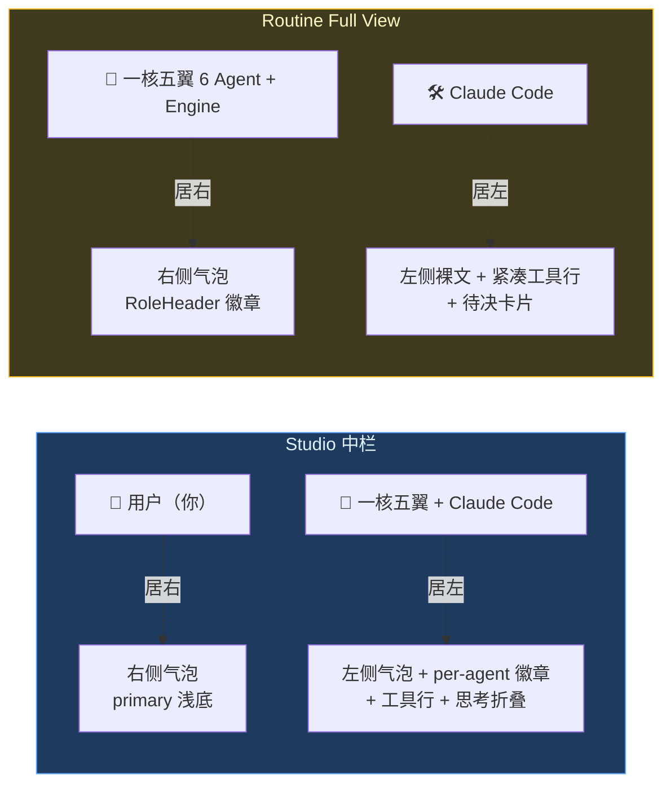

# 人机交互转录对话 · 实操手册

> 本手册覆盖 **两处「人机交互」回合制转录对话界面** 的实操：① Home / Studio **中栏**（你与一核五翼 + Claude Code 对话）；② Routine 任务 **Iterations Full View**（一核五翼 6 Agent 与 Claude Code 的协作审计）。设计架构见 [人机交互转录 UI ADR](../subsystems/041-human-machine-interaction-transcript.md)，主对话特性（模型选择 / 附件 / 搜索 / 引用）见 [chat-essentials](./chat-essentials.md)。

---

## 0. 两处界面在哪

| 界面 | 入口 | 谁在对话 |
|---|---|---|
| **Studio 中栏** | 打开 `/` 首页即 Home 对话 | **人 = 你**；**机 = 一核五翼 Agents + Claude Code** |
| **Routine Full View** | Routine 详情 → 任一 Iteration 卡片 → 「Full View」抽屉 | **人 = 一核五翼 6 Agent**；**机 = Claude Code** |

> 直觉：Studio 里你扮演「人」；Routine 审计里一核五翼 Agent 团队扮演「人」，Claude Code 是「机」。两者共用同一套转录渲染器，仅左右语义不同。

## 1. 视觉布局：左 / 右分栏

回合制转录用**对齐方向**区分人 / 机，比单纯头像更显「回合」节奏：

> 📷 *截图待补（后续专项实拍）：Studio 中栏对话（用户居右 / 机侧居左带徽章 / 工具行 / 思考折叠）*

> 📷 *截图待补（后续专项实拍）：Routine Iterations Full View（task_dispatch / cc_request / human_reply / engine）*

## 2. Studio 中栏实操

### 2.1 发送指令与识别发言方

**能做什么**：发送一条指令，看清谁的产出在哪。

**怎么做**：
1. 底部输入框打字 → Enter（或点 Send 上箭头）。你的消息**居右**显示（primary 浅底气泡）。
2. 机的回复**居左**，每段产出上方挂一个**角色徽章**（图标 + 中文标签）。

**徽章速查**：

| 徽章 | Agent | 触发场景 |
|---|---|---|
| 🟦 Negentropy | 一核 NegentropyEngine | 总编排、综合回答（默认） |
| 🟣 Claude Code | Claude Code | 代码 / 命令 / 工具调用类 |
| 🟦 慧眼 | PerceptionFaculty | 信息检索（KB / Web / 记忆） |
| 🟧 妙手 | ActionFaculty | 执行（代码 / 读写） |
| 🟩 本心 | InternalizationFaculty | 知识结构化（记忆 / KG / 语料） |
| 🟪 元神 | ContemplationFaculty | 思辨 / 规划 / 反思 |
| 🟥 喉舌 | InfluenceFaculty | 价值输出 / 通知（预留） |

> **同一 Agent 连续回合不重复显徽章**——只有切换到另一个 Agent 时才出现新徽章，降噪不丢信息。

### 2.2 展开工具调用看明细

**能做什么**：每个工具调用是一行紧凑徽章，点击就地展开**按类型差异化**的明细。

**怎么做**：点击任一工具行（如 `Shell` / `Read` / `Edit` / `Write` / `Search`）→ 下方展开明细卡。

| 工具类型 | 展开后看到 |
|---|---|
| `Shell` | `$ 命令` + 终端输出 |
| `Read` / `Write` | 文件路径 + 等宽内容 |
| `Edit` | 文件路径 + diff（`+` 绿 / `-` 红） |
| `Search` | 查询串 + 命中结果 |
| `Task` | 子代理类型 + 描述 + 产出 |
| 兜底 | JSON 参数 + 原始输出 |

**注意事项**：
- **≥3 个连续工具自动折叠**为一行 summary（「N 个工具 · 工具名」），点击可还原展开。
- 工具在运行中时，行尾显**蓝色脉冲点 + 进度百分比 / 阶段**（由后端 state_delta 推送）。
- 工具出错时，行尾显红色 `error` 徽章，展开后明细框变红。

### 2.3 思考片段、引用、在途指示

- **思考片段**：机侧推理内容默认收起为「思考…」单行（Brain 图标），点击展开查看完整推理。
- **引用尾注**：当机侧调用知识库检索时，回复正文末尾附 **IEEE 风格尾注**（`[1] Author, "Title," arXiv:ID, Year.`），正文内 `[N]` 可点击跳转尾注，尾注链接可跳源。
- **在途指示**：机侧仍在工作时，转录流末尾显 `Working…`（或 `Planning…` 当等待你裁决时）脉冲三点。

### 2.4 节点选中 / 搜索 / 回到底部

- **节点选中**：点击任一回合 → 该节点高亮（ring），右栏 State 观测抽屉（`Cmd/Ctrl+J` 打开）同步聚焦该节点的状态切片。
- **对话内搜索**（`Cmd/Ctrl+F`）：命中项黄色高亮 ring，自动滚动到第一个并支持上/下一个导航。
- **回到底部 FAB**：上滑浏览历史时，底部浮现「回到底部」浮钮；新消息到达时若你已在底部则自动跟随。

> 会话管理 / 模型选择 / 附件 / 提示词模板等**通用特性**参见 [chat-essentials](./chat-essentials.md)。

## 3. Routine Full View 实操

### 3.1 打开 Full View

Routine 详情页 → Iteration 时间线卡片 → 点「Full View」→ 右侧抽屉展开该迭代的完整人机交互转录。

### 3.2 阅读一条 Iteration 的对话流

抽屉顶部 metadata bar（phase / status / verdict / score / turns / cost / agent 角色 count）→ 下方是按 seq 时序交织的人机回合：

- **开场任务下发**（右）：`Negentropy → Claude Code` 的 `task_dispatch` 气泡，含目标 / 验收 / 反思 / 记忆注入（由 `iteration.prompt` 合成）。
- **Claude Code 推理 / 工具**（左）：裸文 + 紧凑工具行（同 Studio 的工具卡范式）。
- **待决卡片** `cc_request`（左，高亮）：CC 通过 `ExitPlanMode` / `AskUserQuestion` 向「人」提交 Plan / 问题，等待裁决；标题显 `Review plan` / `Answer question` / `Exit plan mode`，在途态显脉冲「等待裁决」。
- **「人」侧应答** `human_reply`（右）：一核五翼 6 Agent 的裁决气泡，徽章按动作语义显化：
  - **元神 Contemplation**：审 Plan（approve ✔ / refine 🔄）/ 批准退出 / 迭代评估。
  - **本心 Internalization**：回答结构化问题。
  - **妙手 Action**：命令门控（gate passed / Exit N）、拒绝工具。
- **Engine 编排产出** `engine`（右）：gate / evaluation / result 三类消息，附 verdict / score / 成本徽章。

### 3.3 LIVE 在途与持久化合并

- 抽屉打开时**惰性加载**持久化事件 + **合并 live SSE**（按 `seq` 去重，持久化优先）。
- 迭代进行中时，顶部显 `LIVE` 脉冲，新事件实时插入；末项 `Working…` 表示机侧仍在工作。
- 最终态重渲染时补齐 gate / evaluation。

> Routine 的概念与编排详见 [The Routine System](../subsystems/039-the-routine-system.md) 与 [多 Agent 归因](../subsystems/040-routine-multi-agent-faculty.md)；开箱预设见 [routine-presets](./routine-presets.md)。

## 4. 常见疑问 FAQ

**Q1：为什么 Studio 看不到 `cc_request` 待决卡片？**
Studio 是用户直连 Agent，无 Routine 的 Plan 审批门；`ExitPlanMode` / `AskUserQuestion` 等交互在 Studio 走 Composer 层的审批 / @mention，不进转录流。

**Q2：为什么同一 Agent 连续回合不重复显徽章？**
分组降噪：徽章只在 `role` 切换时出现。一条 Agent 的多回合产出会用首条徽章统领，避免重复刷屏。

**Q3：工具调用太多看不过来？**
≥3 个连续工具自动折叠为 summary 行；需要时点击展开还原。运行中的工具不参与折叠（避免折叠实时态）。

**Q4：Studio 里的一条 assistant 回复为何有时是多个气泡？**
若一条回复含「文本 → 工具调用 → 文本」多段，会按段拆为多个气泡 + 工具行（保内联顺序），不是 dedup bug。单段文本回复恒为 1 气泡（双气泡守卫）。

**Q5：Routine Full View 与 Studio 中栏的徽章含义一致吗？**
一致——共享同一 `features/agent-identity` 注册表（慧眼 / 本心 / 元神 / 妙手 / 喉舌 / Negentropy / Claude Code）。差异仅在「谁扮演人」。

## 5. 无障碍与深色模式

- **图标 + 色彩双编码**：所有角色徽章与状态点同时用 Lucide 图标 + 配色，不仅依赖颜色（色弱友好）。
- **深色模式高对比**：徽章配色均为 `dark:` 安全变体，深浅主题下皆有清晰对比度。
- **`prefers-reduced-motion`**：在途指示器、流式脉冲、过渡动画在该偏好下降级，尊重用户设置。
- **键盘可达**：工具行、待决卡片、可折叠片段均为 `<button>` 语义，支持 Tab 聚焦与 Enter 触发。
