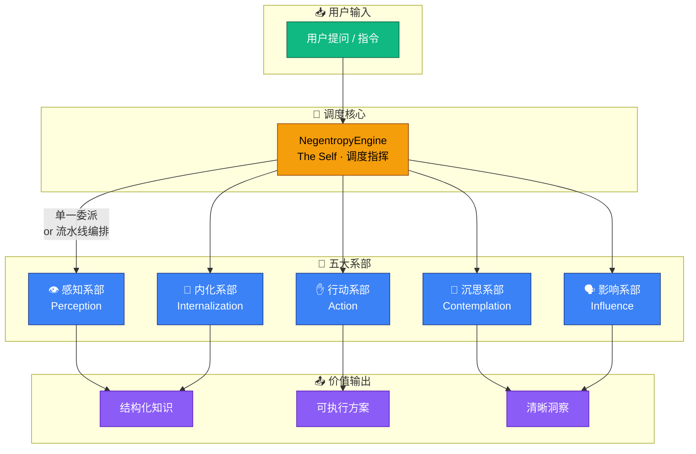
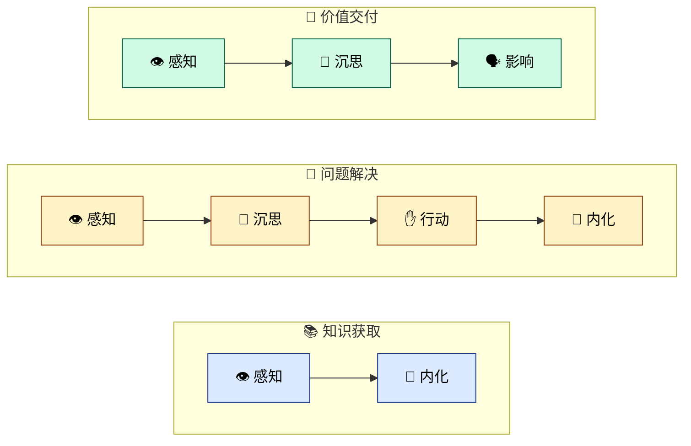

# 认识 Negentropy

> 本文从用户手册拆分而来，原路径 [docs/user-guide.md](../../user-guide.md)。

## 1. 认识 Negentropy

### 1.1 什么是 Negentropy？

Negentropy 的命名源自薛定谔《生命是什么》中的"负熵"概念<a href=#ref1>1</a>——生命以负熵为食。这个系统以同样的哲学对抗知识管理中的**五大熵增形态**：

| 熵增形态 | 表现                                     | 系统对策                            |
| :------- | :--------------------------------------- | :---------------------------------- |
| 信息过载 | Agent 吞噬海量数据，信号与噪音齐飞       | 👁️ **感知系部** — 高信噪比过滤       |
| 记忆断裂 | 对话间的积累被下一个 Session 抛诸脑后    | 💎 **内化系部** — 结构化持久化       |
| 肤浅回应 | Agent 给出教科书式答案，从不追问"为什么" | 🧠 **沉思系部** — 二阶思维与根因分析 |
| 纸上谈兵 | 分析头头是道，需要动手时却力不从心       | ✋ **行动系部** — 精准执行与代码变更 |
| 价值衰减 | 专业洞察经层层传递后可读性暴跌           | 🗣️ **影响系部** — 清晰表达与价值交付 |

### 1.2 一核五翼架构

Negentropy 的核心是一个**调度者**（The Self），它不直接执行任何原子任务，而是将意图委派给最胜任的**系部**（Faculty），如同乐队指挥与演奏家的关系。

### 1.3 三大标准流水线

对于常见的多步骤任务，系统预置了三条**标准流水线**，免去手动编排的繁琐：

| 流水线       | 执行路径                  | 适用场景                         |
| :----------- | :------------------------ | :------------------------------- |
| **知识获取** | 感知 → 内化               | 研究新技术、收集需求、构建知识库 |
| **问题解决** | 感知 → 沉思 → 行动 → 内化 | Bug 修复、功能实现、系统优化     |
| **价值交付** | 感知 → 沉思 → 影响        | 撰写文档、生成报告、决策建议     |

> 更深入的架构设计细节，请参阅 [架构设计](./architecture/framework.md)。

---

[1] E. Schrödinger, "What is Life? The Physical Aspect of the Living Cell," _Cambridge University Press_, 1944.
