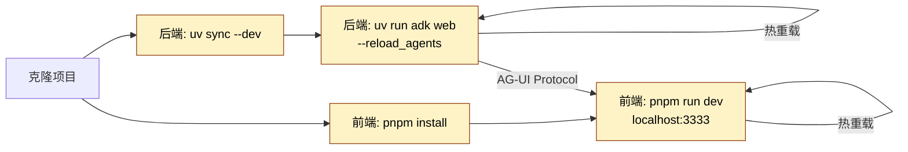

# 开发指南 (Development Guide)

> 本文档是 Negentropy 系统的**开发操作单一参考**，覆盖环境搭建、日常开发工作流、数据库迁移、前后端对接及故障排查。
>
> - 架构设计与系统原理：[docs/framework.md](./framework.md)
> - QA 与发布流水线：[docs/qa-delivery-pipeline.md](./qa-delivery-pipeline.md)
> - 工程变更日志：[docs/engineering-changelog.md](./engineering-changelog.md)

---

## 目录

1. [环境搭建](#1-环境搭建)
2. [项目结构](#2-项目结构)
3. [开发工作流](#3-开发工作流)
4. [后端开发](#4-后端开发)
5. [前端开发](#5-前端开发)
6. [数据库迁移](#6-数据库迁移)
7. [前后端对接](#7-前后端对接)
8. [环境变量管理](#8-环境变量管理)
9. [验证与质量门禁](#9-验证与质量门禁)
10. [常见陷阱与故障排查](#10-常见陷阱与故障排查)
11. [参考文献](#11-参考文献)

---

## 1. 环境搭建

### 1.1 前置依赖

| 依赖 | 最低版本 | 用途 |
| :--- | :------- | :--- |
| Python | 3.13+ | 后端运行时 |
| [uv](https://docs.astral.sh/uv/)<sup>[[1]](#ref1)</sup> | 最新 | Python 包管理与脚本执行 |
| Node.js | 18+ | 前端运行时 |
| [pnpm](https://pnpm.io/) | 最新 | Node.js 包管理 |
| PostgreSQL | 16+ (含 pgvector) | 数据持久化 |

### 1.2 后端安装与首次启动

```bash
cd apps/negentropy
uv sync --dev                          # 安装全部依赖（含开发依赖）
uv run alembic upgrade head            # 应用数据库迁移至最新版本
uv run adk web --port 8000 --reload_agents src/negentropy  # ADK Web 启动
```

### 1.3 前端安装与首次启动

```bash
cd apps/negentropy-ui
pnpm install                           # 安装依赖
pnpm run dev                           # 启动开发服务器 (localhost:3333)
```

---

## 2. 项目结构

```sh
negentropy/
├── .gitignore                         # Git 忽略规则
├── .mcp.json                          # MCP 服务配置
├── AGENTS.md                          # AI 协作协议
├── LICENSE                            # 许可协议
├── README.md                          # 项目自述
├── docs/                              # 项目文档
│   ├── development.md                 # 本文档
│   ├── framework.md                   # 架构设计方案
│   └── ...
├── apps/                              # 应用根目录
│   ├── negentropy/                    # Python 后端 (uv 管理)
│   │   ├── pyproject.toml             # uv 项目配置
│   │   ├── uv.lock                    # uv 锁文件（提交至版本库）
│   │   ├── .python-version            # Python 版本锚定
│   │   ├── .env.example               # 环境变量模板（后端）
│   │   ├── alembic.ini                # Alembic 全局配置
│   │   ├── src/negentropy/            # 主包
│   │   │   ├── agents/                # 智能体编排（一核五翼）
│   │   │   ├── engine/                # 引擎层（API/工厂/适配器/沙箱）
│   │   │   ├── config/                # 配置管理（正交配置域）
│   │   │   ├── models/                # 数据模型（ORM）
│   │   │   ├── knowledge/             # 知识管理
│   │   │   ├── auth/                  # 认证与授权
│   │   │   ├── plugins/               # 插件系统
│   │   │   ├── storage/               # 存储抽象层
│   │   │   └── db/migrations/         # 数据库迁移
│   │   ├── tests/                     # 测试目录
│   │   │   ├── unit_tests/
│   │   │   ├── integration_tests/
│   │   │   └── performance_tests/
│   │   └── scripts/                   # 后端专用脚本
│   ├── negentropy-ui/                 # 前端 (pnpm 管理)
│   │   ├── package.json               # pnpm 项目配置
│   │   ├── pnpm-lock.yaml             # pnpm 锁文件（提交至版本库）
│   │   ├── .env.example               # 环境变量模板（前端）
│   │   ├── app/                       # Next.js App Router 页面与 API 路由
│   │   ├── components/                # 通用可复用 UI 组件
│   │   ├── features/                  # 按功能域组织的业务组件
│   │   ├── hooks/                     # 自定义 React Hooks
│   │   ├── lib/                       # 核心工具库
│   │   ├── utils/                     # 纯函数工具集
│   │   ├── types/                     # TypeScript 类型定义
│   │   ├── config/                    # 前端配置常量
│   │   ├── public/                    # 静态资源
│   │   ├── tests/                     # 测试目录
│   │   │   ├── e2e/
│   │   │   ├── integration/
│   │   │   └── unit/
│   │   └── scripts/                   # 前端专用脚本
│   └── negentropy-wiki/               # Wiki 应用 (pnpm 管理)
└── .temp/                             # 临时文件（自动清理）
```

### 职责边界

| 维度 | Backend (uv) | Frontend (pnpm) |
| :--- | :----------- | :-------------- |
| **包管理器** | `uv`<sup>[[1]](#ref1)</sup> | `pnpm` |
| **锁文件** | `uv.lock` | `pnpm-lock.yaml` |
| **依赖安装** | `uv sync` | `pnpm install` |
| **开发命令** | `uv run adk web`<sup>[[5]](#ref5)</sup> | `pnpm run dev`<sup>[[6]](#ref6)</sup> |
| **测试命令** | `uv run pytest` | `pnpm run test` |
| **代码格式化** | `ruff` | `eslint` / `prettier` |

> 前后端仅通过 HTTP/JSON 契约交互，严禁源码互引。详见 [framework.md §2.2](./framework.md#22-应用边界与技术栈)。

---

## 3. 开发工作流



**日常开发循环**：

1. 后端代码修改后，ADK Web 自动通过 `--reload_agents` 热重载
2. 前端代码修改后，Next.js 自动热重载
3. 前后端通过 AG-UI Protocol（SSE/HTTP）进行通信

---

## 4. 后端开发

### 4.1 核心配置：`apps/negentropy/pyproject.toml`

- 锚定 Python 版本（`requires-python >= "3.13,<3.14"`）
- 运行依赖与开发依赖分离（`[dependency-groups] dev = [...]`）
- 锁文件 `uv.lock` **必须**提交到版本库

### 4.2 启动命令

```bash
cd apps/negentropy

# ADK Web 模式（推荐，支持 AG-UI Protocol）
uv run adk web --port 8000 --reload_agents src/negentropy

# FastAPI 独立模式
uv run fastapi dev
```

### 4.3 测试

```bash
uv run pytest                          # 运行全部测试
uv run pytest tests/unit_tests/        # 仅单元测试
uv run pytest tests/integration_tests/ # 仅集成测试
```

### 4.4 代码质量

```bash
uv run ruff check .                    # Lint 检查
uv run ruff format .                   # 代码格式化
```

---

## 5. 前端开发

### 5.1 核心配置：`apps/negentropy-ui/package.json`

- 明确 `dev` / `build` / `test` / `lint` / `typecheck` 脚本
- 锁文件 `pnpm-lock.yaml` **必须**提交到版本库

### 5.2 启动命令

```bash
cd apps/negentropy-ui

pnpm run dev                           # 开发启动 (localhost:3333)
pnpm run build                         # 生产构建
pnpm run start                         # 生产启动
```

### 5.3 测试矩阵

```bash
pnpm run test                          # 单元/集成测试 (Vitest)
pnpm run test:coverage                 # 覆盖率报告
pnpm run test:e2e                      # E2E 测试 (Playwright)
```

### 5.4 代码质量

```bash
pnpm run lint                          # ESLint 检查
pnpm run typecheck                     # TypeScript 类型检查
```

### 5.5 关键事实源

前端开发中需关注的核心文件参考点：

- **应用入口**：[`app/page.tsx`](../apps/negentropy-ui/app/page.tsx)
- **BFF 代理层**：[`app/api/agui/route.ts`](../apps/negentropy-ui/app/api/agui/route.ts)
- **ADK 事件转换**：[`lib/adk.ts`](../apps/negentropy-ui/lib/adk.ts)
- **AG-UI 类型定义**：[`types/agui.ts`](../apps/negentropy-ui/types/agui.ts)
- **全局布局**：[`app/layout.tsx`](../apps/negentropy-ui/app/layout.tsx)
- **服务后端配置**：[`config/services.py`](../apps/negentropy/src/negentropy/config/services.py)（后端侧，通过环境变量切换 Session/Memory/Artifact 后端）

### 5.6 验证路径（流式交互）

> 确保 UI → BFF → ADK → AG-UI 全链路可用。

**前置条件**：

- 后端 ADK 已启动，`AGUI_BASE_URL` 可访问
- 前端已启动：`http://localhost:3333`
- `.env.local` 中 `NEXT_PUBLIC_AGUI_APP_NAME` 与 `NEXT_PUBLIC_AGUI_USER_ID` 已设置

**验证步骤**：

1. 打开 `/`：三栏布局显示（Session 列表 / 对话区 / 状态+事件）
2. 点击 **New Session**：左栏新增会话
3. 发送指令，期望结果：
   - 中栏出现用户消息与 Agent 回应（逐步更新）
   - 右栏 Event Timeline 出现文本/工具/状态/Artifact 卡片
   - 连接状态 `connecting → streaming → idle` 变化可见
4. 若后端触发工具调用：右栏展示工具卡片（名称/入参/结果/状态）
5. 切换左侧已有 Session：中栏加载历史消息，右栏加载历史事件

---

## 6. 数据库迁移

**数据库迁移**是系统数据架构演进的版本控制机制。本项目采用 [Alembic](https://alembic.sqlalchemy.org/en/latest/) 确保数据库 Schema 能够随同领域模型有序迭代。

- **唯一信源 (Source of Truth)**：[`src/negentropy/models/`](../apps/negentropy/src/negentropy/models/) 中的领域模型定义
- **脚本位置**：[`apps/negentropy/src/negentropy/db/migrations/`](../apps/negentropy/src/negentropy/db/migrations/)
- **Schema 分域设计**：详见 [framework.md §8](./framework.md#8-数据持久化架构)

### 6.1 环境准备

所有迁移操作必须在**应用根目录**（`apps/negentropy`）下执行：

```bash
cd apps/negentropy
uv sync --dev                          # 确保本地环境与 pyproject.toml 一致
```

确保 PostgreSQL 服务运行中，连接配置（`database_url`）已在 `.env` 或 `config/database.py` 中正确加载。

### 6.2 基础设施元定义

| 组件 | 文件 | 作用 |
| :--- | :--- | :--- |
| 演进模板 | [`script.py.mako`](../apps/negentropy/src/negentropy/db/migrations/script.py.mako) | 生成新迁移脚本的蓝图，定义标准代码结构 |
| 全局配置 | [`alembic.ini`](../apps/negentropy/alembic.ini) | Alembic CLI 入口配置（脚本路径、连接字符串、时区、日志） |
| 运行时上下文 | [`env.py`](../apps/negentropy/src/negentropy/db/migrations/env.py) | 加载模型元数据、读取数据库连接配置、驱动异步迁移 |

### 6.3 pgvector 类型识别

当数据库启用 `pgvector` 且模型使用 `Vector` 类型时，[`env.py`](../apps/negentropy/src/negentropy/db/migrations/env.py) 中已注册 `vector` 的反射映射，并在 `compare_type` 中做等价比较，从源头消除不必要的类型告警。

关键约束：

- **不屏蔽告警**：保留 Alembic 正常提示机制，仅让 `vector` 类型能够被正确识别
- **不改变运行时逻辑**：只影响 Alembic 反射与比对行为

### 6.4 演进工作流

#### 捕捉变更 (Capture)

当 `src/negentropy/models/` 中的领域模型发生变更时，需生成对应的迁移脚本：

```bash
uv run alembic revision --autogenerate -m "描述变更内容"
```

> **关键步骤**：自动生成的脚本位于 `src/negentropy/db/migrations/versions/`。**务必人工审查**生成的 Python 脚本，确保其精准反映变更意图，且不包含意外的破坏性操作。

#### 应用变更 (Apply)

```bash
uv run alembic upgrade head
```

#### 版本回溯 (Rollback)

```bash
uv run alembic downgrade -1             # 回退至上一版本
uv run alembic downgrade base           # 重置至初始状态
```

### 6.5 状态观测与审计

```bash
uv run alembic current                  # 确认当前数据库版本
uv run alembic history                  # 追溯架构演进路线
```

### 6.6 模型开发规范

#### 字段定义

使用 SQLAlchemy 2.0 的 `Mapped[]` 类型注解风格：

```python
from sqlalchemy import String, UniqueConstraint
from sqlalchemy.orm import Mapped, mapped_column
from negentropy.models.base import Base, UUIDMixin, TimestampMixin, fk

class MyModel(Base, UUIDMixin, TimestampMixin):
    __tablename__ = "my_model"

    name: Mapped[str] = mapped_column(String(255), nullable=False)
    thread_id: Mapped[UUID] = mapped_column(fk("threads", ondelete="CASCADE"))

    __table_args__ = (
        UniqueConstraint("name", name="uq_my_model_name"),
        {"schema": NEGENTROPY_SCHEMA},
    )
```

#### 外键引用

使用 `fk()` 辅助函数简化外键定义：

```python
# 推荐
thread_id: Mapped[UUID] = mapped_column(fk("threads", ondelete="CASCADE"))

# 避免
thread_id: Mapped[UUID] = mapped_column(
    ForeignKey(f"{NEGENTROPY_SCHEMA}.threads.id", ondelete="CASCADE")
)
```

#### 可用 Mixin

| Mixin | 提供字段 |
| :---- | :------- |
| `UUIDMixin` | `id: UUID` (主键) |
| `TimestampMixin` | `created_at`, `updated_at` |

#### 自定义类型

| 类型 | 用途 |
| :--- | :--- |
| `Vector(dim)` | pgvector 向量类型，如 `Vector(1536)` |

---

## 7. 前后端对接

### 7.1 对接原则

- **不侵入后端核心逻辑**：前端通过 AG-UI Protocol 与 ADK 服务通信
- **复用现有运行入口**：使用 `uv run adk web --port 8000 src/negentropy`
- **BFF 代理层**：前端在 `app/api/agui/` 下设置 Route Handler 作为代理，解决 CORS/鉴权/统一路由问题

### 7.2 BFF 路由表

| 路径 | 方法 | 目的 | 实现位置 |
| :--- | :--- | :--- | :------- |
| `/api/agui` | POST | 发送用户输入并返回 SSE 流 | [`app/api/agui/route.ts`](../apps/negentropy-ui/app/api/agui/route.ts) |
| `/api/agui/sessions` | POST | 创建 Session | [`app/api/agui/sessions/route.ts`](../apps/negentropy-ui/app/api/agui/sessions/route.ts) |
| `/api/agui/sessions/list` | GET | 拉取 Session 列表 | [`app/api/agui/sessions/list/route.ts`](../apps/negentropy-ui/app/api/agui/sessions/list/route.ts) |
| `/api/agui/sessions/:id` | GET | 获取 Session 详情（含 events，用于回放） | [`app/api/agui/sessions/[sessionId]/route.ts`](../apps/negentropy-ui/app/api/agui/sessions/%5BsessionId%5D/route.ts) |
| `/api/health` | GET | UI 运行自检 | [`app/api/health/route.ts`](../apps/negentropy-ui/app/api/health/route.ts) |

> BFF 代理层仅做连接与头部注入，不做协议语义改写，避免"二次真值源"。

### 7.3 关键环境变量

| 变量 | 作用域 | 说明 |
| :--- | :----- | :--- |
| `AGUI_BASE_URL` | 服务端 | ADK 后端地址（如 `http://localhost:8000`） |
| `NEXT_PUBLIC_AGUI_APP_NAME` | 客户端 | 应用名称标识 |
| `NEXT_PUBLIC_AGUI_USER_ID` | 客户端 | 用户标识 |

### 7.4 跨域处理

若前后端不通过 BFF 代理通信（直连模式），需在后端配置 CORS 中间件：

```python
from fastapi.middleware.cors import CORSMiddleware

app.add_middleware(
    CORSMiddleware,
    allow_origins=["http://localhost:3333"],
    allow_methods=["*"],
    allow_headers=["*"],
)
```

---

## 8. 环境变量管理

### 8.1 分层加载策略

设置 `NE_ENV` 环境变量（默认 `development`）后，后端按以下优先级加载 `.env` 文件（后者覆盖前者）：

1. `.env`
2. `.env.local`
3. `.env.{environment}`
4. `.env.{environment}.local`

### 8.2 后端环境变量

使用 `apps/negentropy/.env.example` 作为模板。后端通过 Pydantic Settings 的 [Nested Settings 正交配置域](./framework.md#7-配置管理体系) 加载环境变量。

```bash
# 核心配置
NE_DB_URL=postgresql+asyncpg://localhost:5432/negentropy
NE_ENV=development
```

### 8.3 前端环境变量

使用 `apps/negentropy-ui/.env.example` 作为模板。仅 `NEXT_PUBLIC_` 前缀变量暴露给客户端<sup>[[7]](#ref7)</sup>。

```bash
# 服务端（仅 Route Handler 可用）
AGUI_BASE_URL=http://localhost:8000

# 客户端（浏览器可见）
NEXT_PUBLIC_AGUI_APP_NAME=negentropy
NEXT_PUBLIC_AGUI_USER_ID=dev-user
```

### 8.4 安全约束

- `.env.example` 仅作模板，`.env.local` / `.env.production` 用于环境覆盖
- **禁止**提交包含密钥的实际 `.env` 文件
- `.gitignore` 必须排除 `.env`、`.env.local`、`.env.*.local`

---

## 9. 验证与质量门禁

### 9.1 提交前检查清单

- [ ] 锁文件已更新并提交（`uv.lock`、`pnpm-lock.yaml`）
- [ ] 所有测试通过（`uv run pytest` + `pnpm run test`）
- [ ] Linter 无报错（`ruff check` + `pnpm run lint`）
- [ ] 类型检查通过（`pnpm run typecheck`）
- [ ] 环境变量模板已同步（`.env.example`）
- [ ] `.gitignore` 正确排除敏感文件
- [ ] 文档已同步更新

### 9.2 CI 最低门禁

- `lint` / `test` / `build` / `typecheck` 必须在 CI 通过
- 详细 CI/CD 配置请参见 [QA 与发布流水线文档](./qa-delivery-pipeline.md)

---

## 10. 常见陷阱与故障排查

### 10.1 常见陷阱 (二阶思维)

| 陷阱 | 表象 | 根因 | 防范措施 |
| :--- | :--- | :--- | :------- |
| **依赖版本漂移** | 本地可运行，CI 失败 | 锁文件未提交或不同步 | 强制提交 `uv.lock` 与 `pnpm-lock.yaml` |
| **端口冲突** | `Address already in use` | 多实例并发或未正确清理 | 脚本中增加端口检测与自动清理逻辑 |
| **环境变量泄漏** | 密钥出现在日志中 | `.env` 文件误提交 | `.gitignore` 严格排除，Pre-commit Hook 检查 |
| **跨域问题** | 浏览器报错 `CORS` | 开发环境未配置代理 | 后端启用 CORS 中间件，前端配置 BFF 代理 |
| **虚拟环境丢失** | `uv run` 找不到模块 | `.venv` 被 `.gitignore` 忽略 | 执行 `uv sync` 恢复 |

### 10.2 后端启动失败

```bash
# 检查 Python 版本
cd apps/negentropy
python --version  # 应与 .python-version 一致

# 重新同步依赖
uv sync --reinstall

# 检查端口占用
lsof -i :8000
```

### 10.3 前端启动失败

```bash
# 清理缓存
cd apps/negentropy-ui
rm -rf node_modules pnpm-lock.yaml
pnpm install

# 检查 Node 版本
node --version
pnpm --version
```

### 10.4 跨域请求问题

确认后端 FastAPI 已配置 CORS 中间件（参见 [§7.4](#74-跨域处理)），或确认前端 BFF 代理层（`/api/agui`）正常工作。

---

## 11. 参考文献

<a id="ref1"></a>[1] Astral, "uv: A very fast Python package installer," _Python Packaging Authority_, 2024. [Online]. Available: https://github.com/astral-sh/uv

<a id="ref2"></a>[2] Astral, "uv CLI Reference," _uv Documentation_, 2025. [Online]. Available: https://docs.astral.sh/uv/reference/cli/#uv-run

<a id="ref3"></a>[3] M. Community, "npm best practices," _npm Documentation_, 2024. [Online]. Available: https://docs.npmjs.com/cli/v9/using-npm/best-practices

<a id="ref4"></a>[4] S. Ramirez, "First Steps," _FastAPI Documentation_, 2025. [Online]. Available: https://fastapi.tiangolo.com/tutorial/first-steps/

<a id="ref5"></a>[5] S. Ramirez, "FastAPI Documentation," _FastAPI_, 2025. [Online]. Available: https://fastapi.tiangolo.com/

<a id="ref6"></a>[6] Vercel, "Installation," _Next.js Documentation_, 2025. [Online]. Available: https://nextjs.org/docs/app/getting-started/installation

<a id="ref7"></a>[7] Vercel, "Environment Variables," _Next.js Documentation_, 2025. [Online]. Available: https://nextjs.org/docs/app/guides/environment-variables

<a id="ref8"></a>[8] Vercel, "next CLI," _Next.js Documentation_, 2025. [Online]. Available: https://nextjs.org/docs/app/api-reference/cli/next

---
