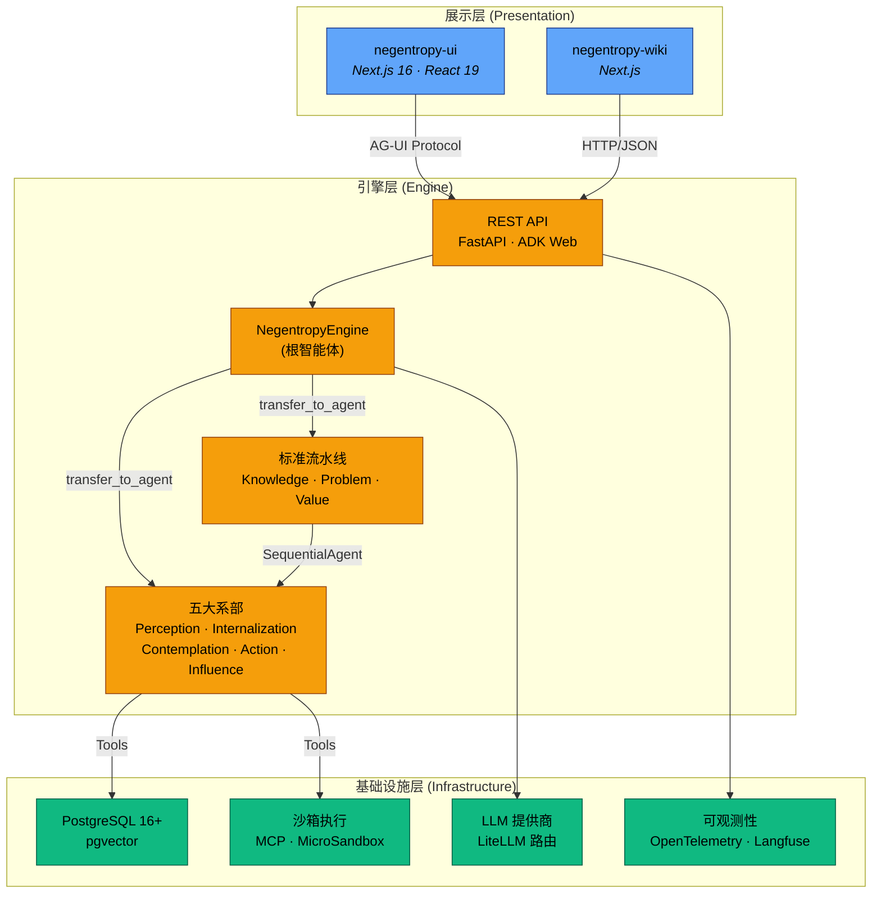
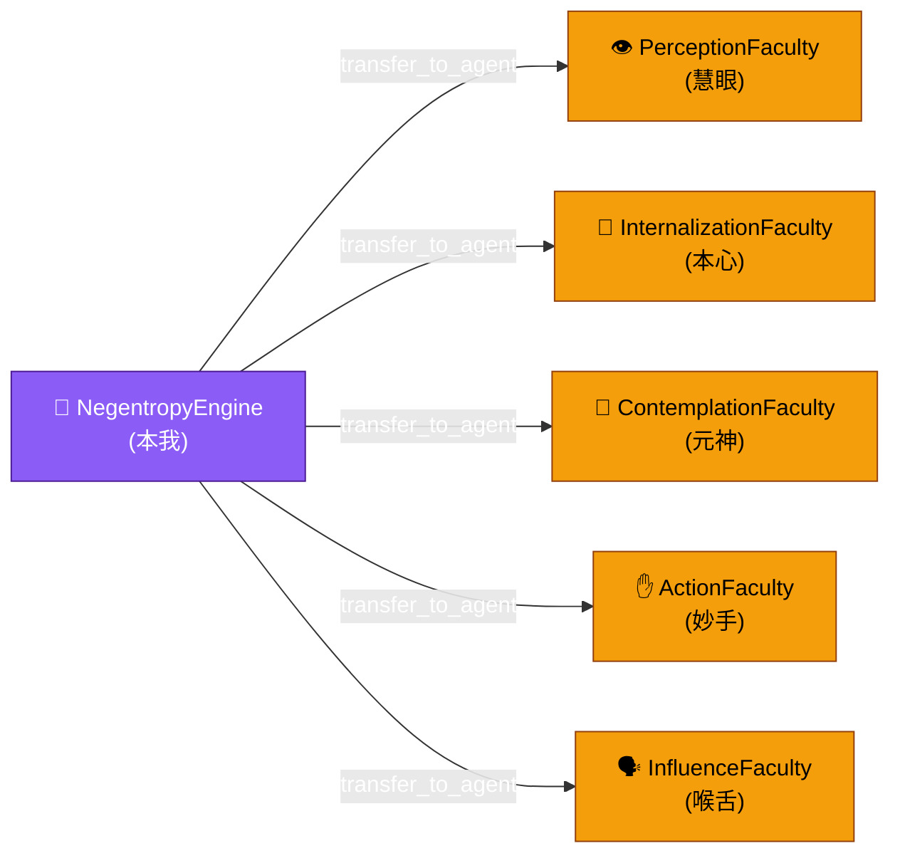
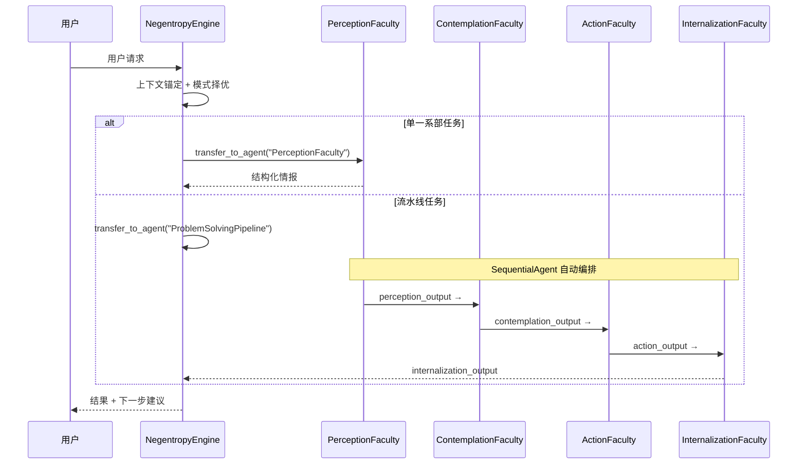
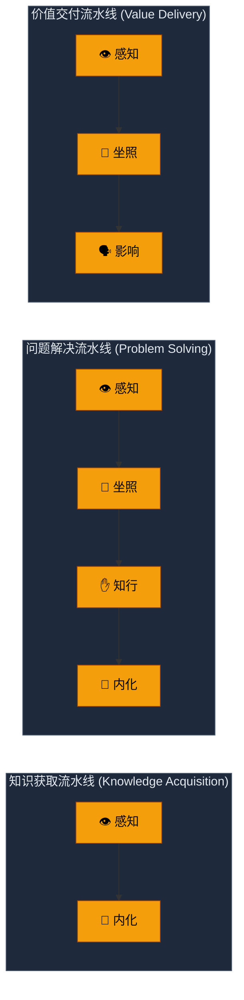
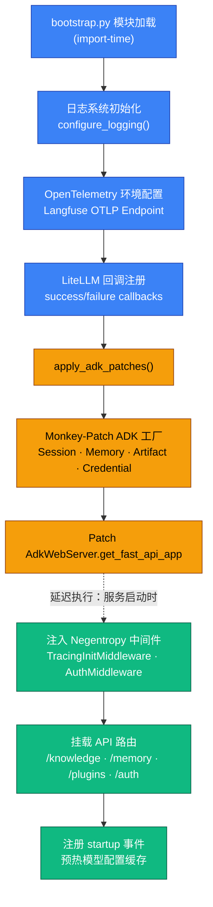
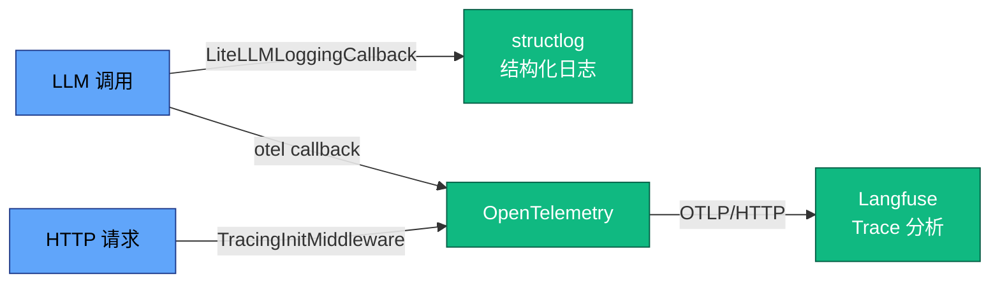
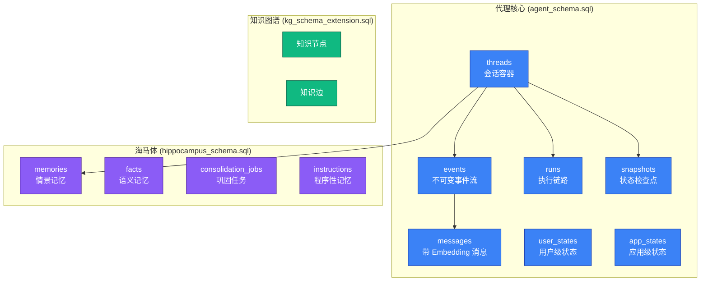
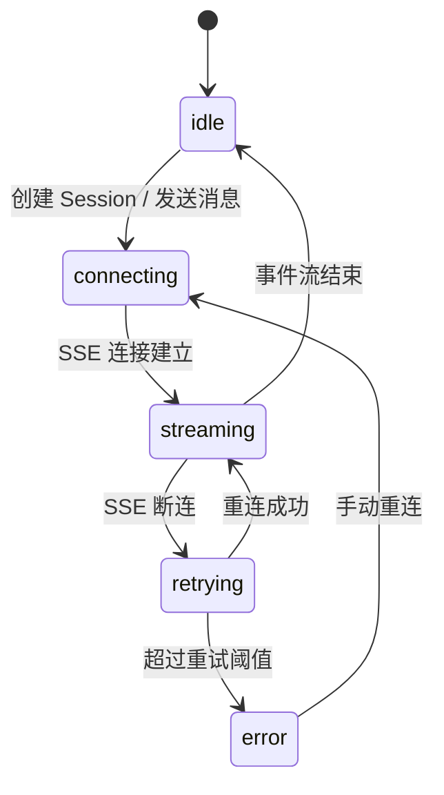
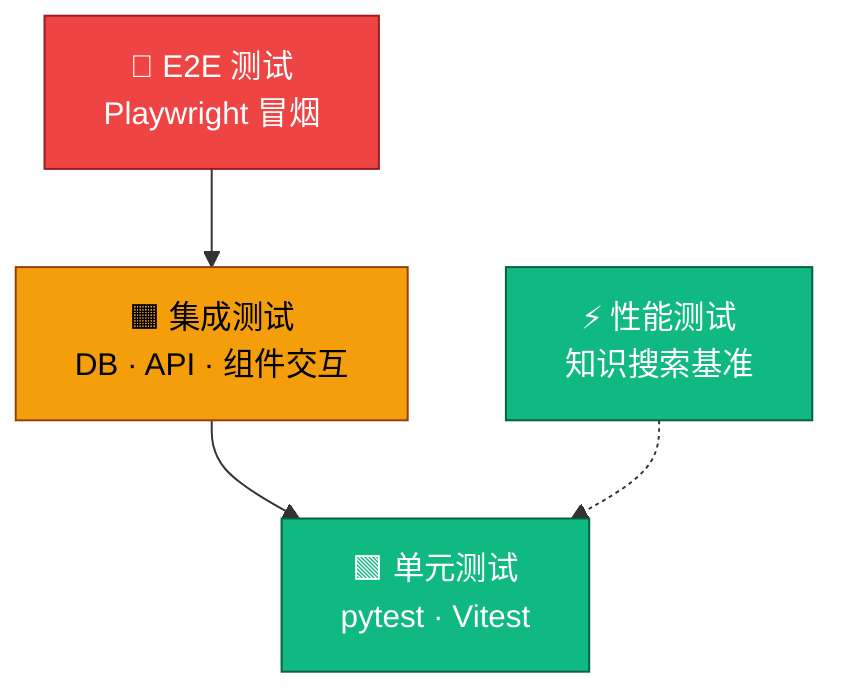
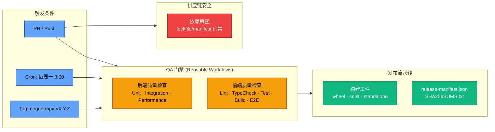

# 架构设计方案 (Architecture Framework)

> 本文档是 Negentropy 系统的**架构设计单一权威参考**，基于代码事实与工程实践，描述系统的设计原理、组件结构与扩展范式。
>
> - 项目概览与快速上手：[README.md](../README.md)
> - 开发指南：[docs/development.md](./development.md)
> - QA 与发布流水线：[docs/qa-delivery-pipeline.md](./qa-delivery-pipeline.md)
> - 工程变更日志：[docs/engineering-changelog.md](./engineering-changelog.md)

---

## 目录

1. [项目定位与核心哲学](#1-项目定位与核心哲学)
2. [系统全景架构](#2-系统全景架构)
3. [一核五翼：智能体编排架构](#3-一核五翼智能体编排架构)
4. [流水线编排模式](#4-流水线编排模式)
5. [设计模式目录](#5-设计模式目录)
6. [引擎层架构](#6-引擎层架构-engine-layer)
7. [配置管理体系](#7-配置管理体系)
8. [数据持久化架构](#8-数据持久化架构)
9. [前端应用架构](#9-前端应用架构-negentropy-ui)
   - 9.4 [AG-UI 协议架构](#94-ag-ui-协议架构)
   - 9.5 [UI 交互状态机](#95-ui-交互状态机)
   - 9.6 [API 契约与错误处理规范](#96-api-契约与错误处理规范)
10. [测试策略与质量保障](#10-测试策略与质量保障)
11. [扩展点与演进方向](#11-扩展点与演进方向)
12. [参考文献](#12-参考文献)

---

## 1. 项目定位与核心哲学

**Negentropy (熵减引擎)** 是一个 **「一核五翼」(One Root, Five Wings)** 架构的智能体系统，致力于对抗知识的无序趋势（熵增），实现持续的认知进化<sup>[[1]](#ref1)</sup>。

### 1.1 设计理念

系统的命名源自薛定谔 (Erwin Schrödinger) 在《生命是什么》中提出的概念——生命以**负熵 (Negentropy)** 为食<sup>[[2]](#ref2)</sup>。映射到软件系统，核心对抗目标是：

| 熵增形态 | 系统表征 | 对抗策略 |
| :------- | :------- | :------- |
| 信息过载 | 噪音淹没信号 | 感知系部：熵减过滤 |
| 遗忘 | 知识碎片化 | 内化系部：结构化持久化 |
| 肤浅 | 表层响应 | 坐照系部：二阶思维 |
| 虚谈 | 认知-行动断裂 | 知行系部：精准执行 |
| 晦涩 | 价值传递失真 | 影响系部：清晰表达 |

### 1.2 架构哲学

系统遵循 [AGENTS.md](../AGENTS.md) 定义的工程行为准则，核心原则包括：

- **正交分解 (Orthogonal Decomposition)**：独立变化的维度解耦，确保单一概念主体的变更具备局部性
- **复用驱动 (Composition over Construction)**：优先通过组合与集成构建系统
- **反馈闭环 (Feedback Loops)**：构建"设计-实现-验证"的完整闭环
- **单一事实源 (Single Source of Truth)**：维护唯一的权威定义源

---

## 2. 系统全景架构

### 2.1 三层架构视图



### 2.2 应用边界与技术栈

| 应用 | 技术栈 | 包管理 | 入口 |
| :--- | :----- | :----- | :--- |
| **negentropy** (后端引擎) | Python 3.13+, Google ADK<sup>[[3]](#ref3)</sup>, SQLAlchemy, LiteLLM<sup>[[10]](#ref10)</sup> | `uv`<sup>[[9]](#ref9)</sup> | [`agents/agent.py`](../apps/negentropy/src/negentropy/agents/agent.py) |
| **negentropy-ui** (前端) | Next.js 16<sup>[[8]](#ref8)</sup>, React 19, TypeScript, Tailwind CSS | `pnpm` | [`app/layout.tsx`](../apps/negentropy-ui/app/layout.tsx) |
| **negentropy-wiki** (Wiki) | Next.js, TypeScript | `pnpm` | [`src/`](../apps/negentropy-wiki/src/) |

应用间仅通过 **HTTP/JSON 契约**通信，严禁源码互引。详见 [development.md](./development.md) §项目结构。

---

## 3. 一核五翼：智能体编排架构

### 3.1 根智能体 — NegentropyEngine

**`NegentropyEngine`** 是系统的调度核心（「本我」），不直接执行原子任务，而是依据正交分解原则，将意图精准委派给最合适的系部<sup>[[3]](#ref3)</sup>。

> 源码位置：[`agents/agent.py`](../apps/negentropy/src/negentropy/agents/agent.py)

```python
root_agent = LlmAgent(
    name="NegentropyEngine",
    model=create_model(),
    description="熵减系统的「本我」，通过协调五大系部的能力，持续实现自我进化。",
    instruction="...",  # ~90 行调度指令，详见源码
    tools=[log_activity],
    sub_agents=[
        perception_agent, internalization_agent,
        contemplation_agent, action_agent, influence_agent,
        create_knowledge_acquisition_pipeline(),
        create_problem_solving_pipeline(),
        create_value_delivery_pipeline(),
    ],
)
```

**关键约束**：
- 根智能体仅显式注册 `log_activity` 一个工具；`transfer_to_agent` 由 ADK 框架在注册 `sub_agents` 时自动提供<sup>[[3]](#ref3)</sup>
- 所有实际能力由子智能体（系部 + 流水线）承载
- 调度遵循反馈闭环：上下文锚定 → 模式择优 → 循证执行 → 主动导航

### 3.2 五大系部

每个系部是一个独立的 `LlmAgent`，拥有正交的职责边界、专属工具集和运行协议。



| 系部 | 图腾 | Agent 名称 | 对抗目标 | 核心职责 | 专属工具 |
| :--- | :--: | :--------- | :------- | :------- | :------- |
| 慧眼·感知 | 👁️ | `PerceptionFaculty` | 信息过载 | 广域扫描、噪音过滤、多源交叉验证 | `search_knowledge_base`, `search_web` |
| 本心·内化 | 💎 | `InternalizationFaculty` | 遗忘 | 知识结构化、长期记忆管理、一致性维护 | `save_to_memory`, `update_knowledge_graph` |
| 元神·坐照 | 🧠 | `ContemplationFaculty` | 肤浅 | 二阶思维、策略规划、错误根因分析 | `analyze_context`, `create_plan` |
| 妙手·知行 | ✋ | `ActionFaculty` | 虚谈 | 精准执行、代码生成、安全变更 | `execute_code`, `read_file`, `write_file` |
| 喉舌·影响 | 🗣️ | `InfluenceFaculty` | 晦涩 | 价值传递、格式适配、说服与教育 | `publish_content`, `send_notification` |

> 所有系部均共享 `log_activity` 审计工具；上表仅列出各系部**专属**工具。
> 系部实现位于 [`agents/faculties/`](../apps/negentropy/src/negentropy/agents/faculties/) 目录

### 3.3 系部实现范式

每个系部遵循统一的**双模式工厂模式**：

```python
# 工厂函数：创建独立实例（用于流水线）
def create_perception_agent(*, output_key: str | None = None) -> LlmAgent:
    return LlmAgent(
        name="PerceptionFaculty",
        model=create_model(),
        tools=[log_activity, search_knowledge_base, search_web],
        output_key=output_key,
        # 流水线边界管控：禁止 LLM 路由逃逸
        disallow_transfer_to_parent=output_key is not None,
        disallow_transfer_to_peers=output_key is not None,
    )

# 向后兼容单例：供 root_agent 直接委派
perception_agent = create_perception_agent()
```

这一设计解决了 Google ADK 的**单亲规则 (Single-Parent Rule)**<sup>[[3]](#ref3)</sup>——同一个 Agent 实例只能被注册为一个父级的子 Agent。工厂函数确保流水线中使用的是独立实例。

### 3.4 智能体协作序列



---

## 4. 流水线编排模式

系统预置三条标准流水线，封装了常见的多系部协作模式。

> 源码位置：[`agents/pipelines/standard.py`](../apps/negentropy/src/negentropy/agents/pipelines/standard.py)

### 4.1 三条标准流水线



| 流水线 | 执行路径 | 适用场景 |
| :----- | :------- | :------- |
| **KnowledgeAcquisitionPipeline** | 感知 → 内化 | 研究新领域、收集需求、构建知识库 |
| **ProblemSolvingPipeline** | 感知 → 坐照 → 知行 → 内化 | Bug 修复、功能实现、系统优化 |
| **ValueDeliveryPipeline** | 感知 → 坐照 → 影响 | 撰写文档、生成报告、提供建议 |

### 4.2 状态传递机制

流水线使用 Google ADK `SequentialAgent`<sup>[[6]](#ref6)</sup> 的 `output_key` 机制在步骤间传递上下文：

1. 每个系部将最终响应文本存入 `session.state[output_key]`
2. 下游系部通过 `{output_key?}` 模板占位符引用上游输出
3. `?` 后缀表示可选引用——若上游未产出，则模板保留空值而非报错

```python
# 问题解决流水线的状态传递链路
SequentialAgent(
    sub_agents=[
        create_perception_agent(output_key="perception_output"),       # step 1
        create_contemplation_agent(output_key="contemplation_output"), # step 2: 引用 {perception_output?}
        create_action_agent(output_key="action_output"),               # step 3: 引用 {contemplation_output?}
        create_internalization_agent(output_key="internalization_output"),  # step 4: 引用 {action_output?}
    ],
)
```

### 4.3 边界管控

流水线内的系部实例启用 ADK 边界管控，防止 LLM 路由逃逸：

- `disallow_transfer_to_parent=True`：禁止系部跳回父级
- `disallow_transfer_to_peers=True`：禁止系部横向跳转到同级

这确保了流水线执行路径的确定性。

---

## 5. 设计模式目录

系统采用的核心设计模式及其代码位置：

### 5.1 Orchestrator Pattern（编排者模式）

- **应用**：`NegentropyEngine` 作为编排者协调五大系部和三条流水线
- **动机**：分离"调度决策"与"能力执行"，实现认知与行动的正交分解
- **代码**：[`agents/agent.py`](../apps/negentropy/src/negentropy/agents/agent.py)

### 5.2 Pipeline Pattern（流水线模式）

- **应用**：`SequentialAgent` 串联多个系部实现复杂流程
- **动机**：封装常见的多步骤任务模式，减少协调熵
- **代码**：[`agents/pipelines/standard.py`](../apps/negentropy/src/negentropy/agents/pipelines/standard.py)
- **出处**：Pipes and Filters 架构风格<sup>[[4]](#ref4)</sup>

### 5.3 Factory Method Pattern（工厂方法）

- **应用**：服务工厂体系（Session / Memory / Artifact / Credential / Runner）；系部工厂函数
- **动机**：将对象创建与使用解耦；解决 ADK 单亲规则约束
- **代码**：[`engine/factories/`](../apps/negentropy/src/negentropy/engine/factories/)、各系部 `create_*_agent()` 函数
- **出处**：GoF Factory Method<sup>[[5]](#ref5)</sup>

### 5.4 Adapter Pattern（适配器模式）

- **应用**：PostgreSQL 适配器实现 ADK 抽象接口（SessionService、MemoryService 等）
- **动机**：对接 Google ADK 框架规范的同时保留存储后端的可替换性
- **代码**：[`engine/adapters/postgres/`](../apps/negentropy/src/negentropy/engine/adapters/postgres/)
- **出处**：GoF Adapter<sup>[[5]](#ref5)</sup>

### 5.5 Strategy Pattern（策略模式）

- **应用**：`model_resolver` 根据数据库配置动态解析 LLM / Embedding 模型
- **动机**：支持运行时切换模型提供商而无需修改代码
- **代码**：[`config/model_resolver.py`](../apps/negentropy/src/negentropy/config/model_resolver.py)
- **出处**：GoF Strategy<sup>[[5]](#ref5)</sup>

### 5.6 Nested Settings Pattern（嵌套配置模式）

- **应用**：Pydantic Settings 正交配置域组合
- **动机**：每个配置域独立管理，支持环境感知的 `.env` 文件分层加载
- **代码**：[`config/__init__.py`](../apps/negentropy/src/negentropy/config/__init__.py)
- **出处**：Composition over Inheritance<sup>[[5]](#ref5)</sup>

### 5.7 Monkey-Patch Integration（运行时注入集成）

- **应用**：`bootstrap.py` 通过 Monkey-Patch 将 Negentropy 的配置注入 ADK 服务工厂
- **动机**：在不修改 ADK 框架源码的前提下实现定制化服务绑定
- **代码**：[`engine/bootstrap.py`](../apps/negentropy/src/negentropy/engine/bootstrap.py)
- **权衡**：牺牲了类型安全性换取集成灵活性；需随 ADK 版本升级验证兼容性

### 5.8 Plugin Architecture（插件架构）

- **应用**：可扩展的插件系统，支持子智能体、MCP 服务和技能的动态注册
- **动机**：开放封闭原则 (OCP)——对扩展开放，对修改封闭
- **代码**：[`plugins/`](../apps/negentropy/src/negentropy/plugins/)

---

## 6. 引擎层架构 (Engine Layer)

引擎层是连接智能体与基础设施的枢纽，基于 FastAPI<sup>[[7]](#ref7)</sup> 与 Google ADK Web Server 构建。

> 源码位置：[`engine/`](../apps/negentropy/src/negentropy/engine/)

### 6.1 启动引导流程



### 6.2 服务工厂体系

工厂模块通过配置驱动创建服务实例，支持 `inmemory` / `postgres` / `vertexai` 等多种后端。

> 源码位置：[`engine/factories/__init__.py`](../apps/negentropy/src/negentropy/engine/factories/__init__.py)

| 工厂函数 | 服务类型 | 可选后端 |
| :------- | :------- | :------- |
| `get_session_service()` | 会话管理 | inmemory, postgres, vertexai |
| `get_memory_service()` | 记忆存储 | inmemory, postgres, vertexai |
| `get_artifact_service()` | 工件管理 | inmemory, gcs, postgres |
| `get_credential_service()` | 凭据管理 | inmemory, postgres |
| `get_runner()` | ADK Runner | 内置 |

每个工厂提供 `reset_*()` 函数以支持测试场景下的实例重置。

### 6.3 沙箱执行环境

系统提供双通道沙箱以隔离代码执行：

- **MCP (Model Context Protocol)**：通过 MCP 协议与外部工具服务通信
  - 源码：[`engine/sandbox/mcp.py`](../apps/negentropy/src/negentropy/engine/sandbox/mcp.py)
- **MicroSandbox**：轻量级容器化沙箱，用于安全执行用户代码
  - 源码：[`engine/sandbox/microsandbox_runner.py`](../apps/negentropy/src/negentropy/engine/sandbox/microsandbox_runner.py)

### 6.4 可观测性集成



关键集成点：
- **structlog**：结构化日志输出，支持 console / JSON / Google Cloud Logging 三种 sink
- **OpenTelemetry**：分布式追踪，通过 Langfuse 作为 OTLP 接收端
- **TracingInitMiddleware**：从 HTTP 请求中提取/生成 `session_id`、`user_id`，注入 OTel baggage

> 源码位置：[`instrumentation.py`](../apps/negentropy/src/negentropy/instrumentation.py)、[`engine/bootstrap.py`](../apps/negentropy/src/negentropy/engine/bootstrap.py) (中间件定义)

---

## 7. 配置管理体系

### 7.1 Nested Settings 正交配置域

系统采用 **Pydantic Settings** 的嵌套组合模式，将配置划分为独立的正交域：

> 源码位置：[`config/__init__.py`](../apps/negentropy/src/negentropy/config/__init__.py)

```python
class Settings(BaseSettings):
    model_config = SettingsConfigDict(env_file=_get_env_files(), extra="ignore")

    @cached_property
    def environment(self) -> EnvironmentSettings:   # NE_ENV 环境检测
        return EnvironmentSettings(_env_file=_get_env_files())

    @cached_property
    def database(self) -> DatabaseSettings:         # 数据库连接
        return DatabaseSettings(_env_file=_get_env_files())

    # ... logging, observability, services, auth, search, knowledge 同理
```

每个子配置拥有独立的环境变量前缀，互不干扰。

### 7.2 环境分层加载

设置 `NE_ENV` 环境变量（默认 `development`）后，系统按以下优先级加载 `.env` 文件（后者覆盖前者）：

1. `.env`
2. `.env.local`
3. `.env.{environment}`
4. `.env.{environment}.local`

### 7.3 配置域清单

| 配置域 | 源文件 | 环境变量前缀 | 职责 |
| :----- | :----- | :----------- | :--- |
| `EnvironmentSettings` | [`config/environment.py`](../apps/negentropy/src/negentropy/config/environment.py) | `NE_` | 环境检测与 `.env` 文件解析 |
| `AppSettings` | [`config/app.py`](../apps/negentropy/src/negentropy/config/app.py) | `NE_` | 应用名称等基础配置 |
| `LoggingSettings` | [`config/logging.py`](../apps/negentropy/src/negentropy/config/logging.py) | `NE_LOG_` | 日志级别、格式、输出 sink |
| `ObservabilitySettings` | [`config/observability.py`](../apps/negentropy/src/negentropy/config/observability.py) | `LANGFUSE_` | Langfuse 追踪配置 |
| `DatabaseSettings` | [`config/database.py`](../apps/negentropy/src/negentropy/config/database.py) | `NE_DB_` | PostgreSQL 连接池参数 |
| `ServicesSettings` | [`config/services.py`](../apps/negentropy/src/negentropy/config/services.py) | `NE_` | 各服务后端选择 |
| `AuthSettings` | [`config/auth.py`](../apps/negentropy/src/negentropy/config/auth.py) | `NE_AUTH_` | Google OAuth / Session 管理 |
| `SearchSettings` | [`config/search.py`](../apps/negentropy/src/negentropy/config/search.py) | `NE_SEARCH_` | Web 搜索提供商配置 |
| `KnowledgeSettings` | [`config/knowledge.py`](../apps/negentropy/src/negentropy/config/knowledge.py) | `NE_KG_` | 知识图谱与向量存储 |

### 7.4 LLM 模型解析链路

模型配置已从 `.env` 迁移至数据库 (`model_configs` 表)，通过 Admin UI 管理：

```
Admin UI → model_configs 表 → model_resolver.py → create_model() → LiteLlm 实例
```

> 源码位置：[`config/model_resolver.py`](../apps/negentropy/src/negentropy/config/model_resolver.py)、[`agents/_model.py`](../apps/negentropy/src/negentropy/agents/_model.py)

解析策略：优先读取数据库缓存配置，若缓存未命中则回退到硬编码默认值。缓存由 `bootstrap.py` 的 startup 事件预热。

---

## 8. 数据持久化架构

### 8.1 技术选型

- **PostgreSQL 16+**：关系型数据主存储
- **pgvector**：向量嵌入存储与相似度检索
- **Alembic**：Schema 迁移管理
- **SQLAlchemy**：ORM 与异步数据访问 (asyncpg)

### 8.2 Schema 分域设计

数据库 Schema 按认知域划分，每个域对应独立的 DDL 文件：



| Schema 文件 | 认知域 | 核心表 | 说明 |
| :---------- | :----- | :----- | :--- |
| [`agent_schema.sql`](./schema/agent_schema.sql) | 代理核心 | threads, events, runs, messages, snapshots | 会话管理、事件溯源、乐观锁 (OCC) |
| [`hippocampus_schema.sql`](./schema/hippocampus_schema.sql) | 记忆系统 | memories, facts, consolidation_jobs | 情景/语义记忆、艾宾浩斯衰减 |
| [`kg_schema_extension.sql`](./schema/kg_schema_extension.sql) | 知识图谱 | 知识节点/边 | 结构化知识表示 |
| [`mind_schema.sql`](./schema/mind_schema.sql) | 思维模式 | — | 思维模式与策略 |
| [`perception_schema.sql`](./schema/perception_schema.sql) | 感知系统 | — | 感知数据与来源管理 |

### 8.3 关键设计决策

- **事件溯源 (Event Sourcing)**：`events` 表为不可变事件流，通过 `pg_notify` 触发器支持实时事件推送
- **向量索引**：`memories` 表使用 HNSW 索引 (`vector_cosine_ops`) 支持语义检索
- **艾宾浩斯衰减**：`calculate_retention_score()` SQL 函数实现基于访问频率和时间衰减的记忆保持评分
- **乐观并发控制**：`threads.version` 字段支持 OCC，防止并发写入冲突
- **JSONB 灵活存储**：`state`、`metadata` 等字段使用 JSONB + GIN 索引，兼顾灵活性与查询性能

---

## 9. 前端应用架构 (negentropy-ui)

### 9.1 技术栈

| 层次 | 技术选型 |
| :--- | :------- |
| 框架 | Next.js 16 (App Router) |
| UI 库 | React 19, Tailwind CSS |
| 状态管理 | React Hooks + Context |
| AI 集成 | CopilotKit (AG-UI Protocol) |
| 图表 | Mermaid |
| 测试 | Vitest (单元/集成), Playwright (E2E) |

### 9.2 功能域划分

```
apps/negentropy-ui/app/
├── api/                    # API 路由 (Server-Side)
│   ├── agui/              # AG-UI Protocol 端点
│   ├── auth/              # 认证回调
│   ├── health/            # 健康检查
│   ├── knowledge/         # 知识 API 代理
│   ├── memory/            # 记忆 API 代理
│   └── plugins/           # 插件 API 代理
├── admin/                 # 管理功能
│   ├── roles/             # 角色管理
│   └── models/            # 模型管理
├── knowledge/             # 知识管理
│   ├── catalog/           # 知识目录
│   └── apis/              # API 文档
├── memory/                # 记忆管理
│   ├── activity/          # 活动记忆
│   ├── audit/             # 审计日志
│   ├── automation/        # 自动化配置
│   ├── facts/             # 事实记忆
│   └── timeline/          # 时间线
└── plugins/               # 插件管理
    ├── subagents/         # 子代理配置
    ├── mcp/               # MCP 服务管理
    └── skills/            # 技能管理
```

### 9.3 分层组织

| 目录 | 职责 |
| :--- | :--- |
| `app/` | Next.js App Router 页面与 API 路由 |
| `components/` | 通用可复用 UI 组件 |
| `features/` | 按功能域组织的业务组件 |
| `lib/` | 核心工具库 |
| `hooks/` | 自定义 React Hooks |
| `utils/` | 纯函数工具集 |
| `types/` | TypeScript 类型定义 |
| `config/` | 前端配置常量 |

### 9.4 AG-UI 协议架构

前端通过 **AG-UI Protocol**<sup>[[11]](#ref11)</sup> 与后端 ADK 服务通信，以事件流为最小单位驱动 UI 状态。

#### 协议定位

- **事件流为唯一真值**：所有 UI 状态由事件流驱动，前端不自写状态真值<sup>[[11]](#ref11)</sup>
- **传输无绑定**：协议支持 SSE/WebSockets/Webhooks，当前采用 SSE over POST
- **BFF 代理模式**：前端通过 Route Handler（`/api/agui`）代理后端，解决 CORS/鉴权问题

#### CopilotKit 连接层

采用 CopilotKit 的 `useAgent` 作为 AG-UI 级联接口<sup>[[15]](#ref15)</sup>，统一管理连接控制与状态：

```
CopilotKitProvider → useAgent (HttpAgent) → BFF /api/agui → ADK Web → SSE Events
```

#### 事件到 UI 的映射

| AG-UI 事件类型 | UI 表现 |
| :------------- | :------ |
| `TEXT_MESSAGE_*` | 文本气泡（流式拼接，按 `messageId` 聚合） |
| `TOOL_CALL_*` | 可折叠工具调用卡片（入参/出参分区） |
| `STATE_SNAPSHOT` / `STATE_DELTA` | 右栏状态树（只读） |
| `ACTIVITY_*` | 右栏活动日志（时间序列） |

### 9.5 UI 交互状态机

#### 连接状态



- `idle`：未连接（进入页面未创建 session）
- `connecting`：发起 SSE 连接
- `streaming`：事件流正常
- `retrying`：指数退避重试
- `error`：连接失败（提示手动重连）

#### 输入状态

- `ready`：可发送
- `sending`：发送中（锁定输入）
- `blocked`：等待 HITL 确认（需用户操作）

#### 恢复策略设计

- 断连 → `retrying`（指数退避，系数 `1.8`，最大延迟 `8s`，抖动 `±20%`）
- 最大重试次数：`8`
- 超过阈值 → `error`，需用户手动触发重连

### 9.6 API 契约与错误处理规范

#### 事件信封 (Event Envelope)

```ts
type AguiEvent = {
  id: string;                // 事件唯一 ID（幂等）
  type: string;              // 事件类型（AG-UI 标准）
  timestamp: string;         // ISO-8601
  payload: {
    id?: string;
    author?: string;
    content?: {
      role?: string;
      parts?: Array<{ text?: string }>;
    };
    actions?: {
      stateDelta?: Record<string, unknown>;
      artifactDelta?: Record<string, unknown>;
    };
    [key: string]: unknown;
  };
  meta: {
    session_id?: string;
    run_id?: string;
    user_id?: string;
    source?: "agent" | "tool" | "system";
    seq?: number;            // 可选：事件序号（用于排序/补偿）
  };
};
```

#### 错误码体系

> 由 BFF 统一翻译后端错误，UI 只处理以下错误码与语义。

| 错误码 | HTTP | 含义 | UI 行为 |
| :----- | :--- | :--- | :------ |
| `AGUI_BAD_REQUEST` | 400 | 请求字段不合法 | 显示表单错误，不重试 |
| `AGUI_UNAUTHORIZED` | 401 | 鉴权失败 | 提示登录/权限不足 |
| `AGUI_FORBIDDEN` | 403 | 权限不足 | 提示无权限，不重试 |
| `AGUI_NOT_FOUND` | 404 | 目标资源不存在 | 提示资源不可用 |
| `AGUI_RATE_LIMITED` | 429 | 触发限流 | 延迟重试（指数退避） |
| `AGUI_UPSTREAM_TIMEOUT` | 504 | 上游超时 | 自动重试（限次数） |
| `AGUI_UPSTREAM_ERROR` | 502 | 上游错误 | 自动重试（限次数） |
| `AGUI_INTERNAL_ERROR` | 500 | BFF 内部错误 | 提示错误，可重试 |

#### UI 状态模型

```ts
type ConnectionState = "idle" | "connecting" | "streaming" | "retrying" | "error";
type InputState = "ready" | "sending" | "blocked";

type UiState = {
  sessionId: string | null;
  userId: string | null;
  connection: ConnectionState;
  input: InputState;
  messages: Array<{ id: string; role: "user" | "agent" | "system"; content: string; timestamp: string }>;
  events: Array<{ id: string; type: string; payload: Record<string, unknown>; timestamp: string }>;
  snapshot: Record<string, unknown> | null;
};
```

**状态更新规则**：

- **只读策略**：`snapshot` 仅由 `STATE_*` 事件驱动更新
- **事件流优先**：`events` 以时间序列追加，不做删除性变更
- **消息派生**：`messages` 由 `TEXT_MESSAGE_*` 聚合生成，保留事件原始序列
- **连接状态**：由 SSE 连接生命周期驱动

#### POST 发送重试策略

- 默认不重试（避免重复输入）
- 仅在 `AGUI_UPSTREAM_TIMEOUT` / `AGUI_UPSTREAM_ERROR` / `AGUI_RATE_LIMITED` 时重试，最多 `2` 次
- 前端为每次输入生成 `client_request_id`（UUID），通过 `metadata` 透传用于去重

---

## 10. 测试策略与质量保障

### 10.1 测试金字塔



### 10.2 覆盖率门禁

| 端 | 框架 | 行覆盖率 | 分支覆盖率 | 配置位置 |
| :- | :--- | :------- | :--------- | :------- |
| 后端 | pytest + pytest-cov | ≥ 50% | — | `pyproject.toml` `[tool.coverage.run]` |
| 前端 | Vitest Coverage v8 | ≥ 50% | ≥ 48% | `vitest.config.ts` `coverage.thresholds` |

### 10.3 测试目录结构

**后端** ([`apps/negentropy/tests/`](../apps/negentropy/tests/))：
```
tests/
├── conftest.py           # 全局 fixtures (DB, 异步)
├── unit_tests/           # 单元测试 (agents, config, engine, knowledge, ...)
├── integration_tests/    # 集成测试 (DB, engine, knowledge)
└── performance_tests/    # 性能测试 (knowledge 搜索基准)
```

**前端** ([`apps/negentropy-ui/tests/`](../apps/negentropy-ui/tests/))：
```
tests/
├── setup.ts              # Vitest 全局设置
├── e2e/                  # Playwright 冒烟测试
├── integration/          # API 与组件集成测试
├── unit/                 # 单元测试 (components, features, hooks, lib, utils)
└── helpers/              # 测试辅助工具
```

### 10.4 CI/CD 流水线架构



关键设计：**PR 门禁与 Release 门禁共享同一套 QA 定义**（单一事实源），通过可复用工作流实现：
- [`reusable-negentropy-backend-quality.yml`](../.github/workflows/reusable-negentropy-backend-quality.yml)
- [`reusable-negentropy-ui-quality.yml`](../.github/workflows/reusable-negentropy-ui-quality.yml)

详见 [QA 与发布流水线文档](./qa-delivery-pipeline.md)。

---

## 11. 扩展点与演进方向

### 11.1 当前架构扩展维度

基于现有代码结构，系统具备以下可扩展维度：

| 扩展维度 | 接入模式 | 涉及目录 |
| :------- | :------- | :------- |
| **新增系部** | 创建 `faculties/new_faculty.py`，实现 `create_*_agent()` 工厂函数，注册到 `root_agent.sub_agents` | `agents/faculties/` |
| **自定义流水线** | 在 `pipelines/` 下创建工厂函数，组合现有系部实例 | `agents/pipelines/` |
| **新工具** | 在 `agents/tools/` 下实现，注册到对应系部的 `tools` 列表 | `agents/tools/` |
| **新存储后端** | 在 `engine/adapters/` 下实现 ADK 服务接口，更新工厂函数 | `engine/adapters/` |
| **新 LLM 提供商** | 通过 LiteLLM 路由注册，配置 `model_configs` 表 | `config/model_resolver.py` |
| **新插件** | 通过插件系统注册（子智能体 / MCP 服务 / 技能） | `plugins/` |
| **新配置域** | 创建 `config/new_domain.py`，在 `Settings` 中组合 | `config/` |

### 11.2 近期演进方向

基于代码事实的推断（非承诺）：

1. **知识图谱深化**：`kg_schema_extension.sql` 表明知识图谱模块尚在扩展阶段，预期将增强实体关系建模
2. **记忆自动化成熟**：`hippocampus_schema.sql` 中的巩固任务机制为记忆自动衰减与巩固提供了基础
3. **多模型策略**：`model_resolver.py` 的 Strategy 模式支持未来按任务类型动态路由不同 LLM
4. **插件生态**：`plugins/` 模块的 API 端点已就绪，预期将支持第三方插件注册

---

## 12. 参考文献

<a id="ref1"></a>[1] ThreeFish-AI, "Negentropy: One Root, Five Wings Agent System," _GitHub Repository_, 2026. [Online]. Available: https://github.com/ThreeFish-AI/negentropy

<a id="ref2"></a>[2] E. Schrödinger, "What is Life? The Physical Aspect of the Living Cell," _Cambridge University Press_, 1944.

<a id="ref3"></a>[3] Google, "Agent Development Kit - Multi-Agent Systems," _Google ADK Documentation_, 2025. [Online]. Available: https://google.github.io/adk-docs/agents/multi-agents/

<a id="ref4"></a>[4] F. Buschmann, R. Meunier, H. Rohnert, P. Sommerlad, and M. Stal, "Pattern-Oriented Software Architecture: A System of Patterns," _Wiley_, vol. 1, 1996.

<a id="ref5"></a>[5] E. Gamma, R. Helm, R. Johnson, and J. Vlissides, "Design Patterns: Elements of Reusable Object-Oriented Software," _Addison-Wesley_, 1994.

<a id="ref6"></a>[6] Google, "Agent Development Kit - SequentialAgent," _Google ADK Documentation_, 2025. [Online]. Available: https://google.github.io/adk-docs/agents/workflow-agents/#sequentialagent

<a id="ref7"></a>[7] S. Ramirez, "FastAPI Documentation," _FastAPI_, 2025. [Online]. Available: https://fastapi.tiangolo.com/

<a id="ref8"></a>[8] Vercel, "Next.js Documentation," _Vercel_, 2025. [Online]. Available: https://nextjs.org/docs

<a id="ref9"></a>[9] Astral, "uv: An extremely fast Python package installer," _Astral_, 2025. [Online]. Available: https://docs.astral.sh/uv/

<a id="ref10"></a>[10] BerriAI, "LiteLLM: Call 100+ LLMs using the same Input/Output Format," _BerriAI_, 2025. [Online]. Available: https://docs.litellm.ai/

<a id="ref11"></a>[11] CopilotKit, "Events," _Agent User Interaction Protocol_, 2025. [Online]. Available: https://docs.ag-ui.com/concepts/events

<a id="ref12"></a>[12] CopilotKit, "Core Architecture," _Agent User Interaction Protocol_, 2025. [Online]. Available: https://docs.ag-ui.com/concepts/architecture

<a id="ref13"></a>[13] CopilotKit, "Server Quickstart," _Agent User Interaction Protocol_, 2025. [Online]. Available: https://docs.ag-ui.com/quickstart/server

<a id="ref14"></a>[14] CopilotKit, "Middleware / Stream Compaction," _Agent User Interaction Protocol (JS Client SDK)_, 2025. [Online]. Available: https://docs.ag-ui.com/sdk/js/client/middleware

<a id="ref15"></a>[15] CopilotKit, "CopilotKit README (Quick Start & useAgent)," _GitHub Repository_, 2025. [Online]. Available: https://github.com/CopilotKit/CopilotKit

---

> **文档维护**：本文档与代码同步演进。架构变更时需同步更新对应章节，保持代码事实与文档描述的一致性。
