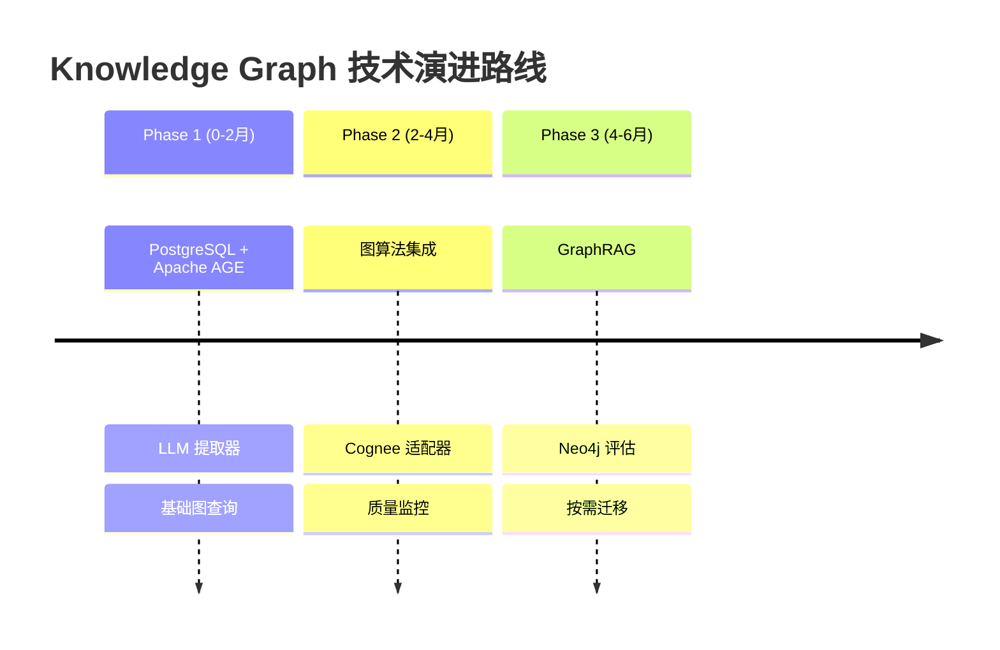
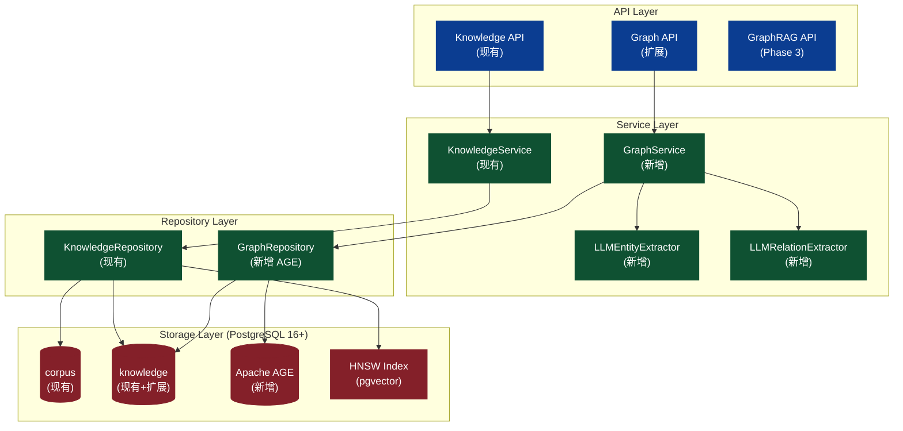
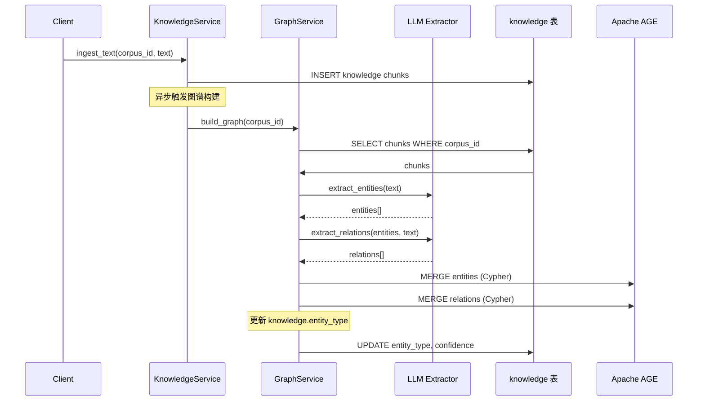

# Knowledge Graph 技术落地方案

> 本文档是 Knowledge Graph 能力实施的权威规划文档，用于管理和跟进整体 Planning。

## 0. 范围与事实源（Single Source of Truth）

- **底层存储模型**：[apps/negentropy/src/negentropy/models/perception.py](../apps/negentropy/src/negentropy/models/perception.py)（`Corpus` / `Knowledge`）
- **图谱处理逻辑**：[apps/negentropy/src/negentropy/knowledge/graph.py](../apps/negentropy/src/negentropy/knowledge/graph.py)
- **数据库权威定义**：[docs/schema/perception_schema.sql](./schema/perception_schema.sql)
- **Schema 扩展**：[docs/schema/kg_schema_extension.sql](./schema/kg_schema_extension.sql)（新增）
- **调研资料**：
  - [Neo4j 调研](https://github.com/ThreeFish-AI/agentic-ai-cognizes/blob/master/docs/research/050-neo4j.md)
  - [PostgreSQL vs Neo4j](https://github.com/ThreeFish-AI/agentic-ai-cognizes/blob/master/docs/research/051-postgres-neo4j.md)
  - [Cognee 调研](https://github.com/ThreeFish-AI/agentic-ai-cognizes/blob/master/docs/research/040-cognee.md)

---

## 1. 目标与边界

### 1.1 核心目标

将现有基础的 Knowledge Graph 能力升级为**生产级**知识图谱系统，支持：

1. **智能实体提取**：基于 LLM 的多语言实体识别（人名、组织、地点、概念等）
2. **语义关系提取**：基于 LLM 的精确关系识别（WORKS_FOR、LOCATED_IN、RELATED_TO 等）
3. **专业图存储**：引入 Apache AGE 支持 Cypher 图查询
4. **图算法支持**：PageRank 重要性计算、社区检测、最短路径
5. **GraphRAG 能力**：向量 + 图遍历的混合检索增强生成

### 1.2 边界约束

| 在范围内 | 不在范围内 |
|---------|-----------|
| 实体/关系提取增强 | 实时图流处理 |
| PostgreSQL + Apache AGE 集成 | Neo4j 集群部署（Phase 3 按需） |
| 图算法（PageRank、社区检测） | 复杂图神经网络（GNN） |
| GraphRAG 检索 | 知识推理引擎 |
| 前端可视化增强 | 3D 图可视化 |

---

## 2. 技术选型决策

### 2.1 决策矩阵

| 维度 | PostgreSQL + Apache AGE | Neo4j | 推荐方案 |
|------|------------------------|-------|---------|
| **现有基础设施** | ✅ 完全复用 | ❌ 需新增 | PostgreSQL |
| **图遍历 1-3 跳** | ✅ 良好 | ✅ 优秀 | PostgreSQL 足够 |
| **图遍历 4+ 跳** | ⚠️ 较慢 | ✅ 优秀 | 按需引入 Neo4j |
| **向量搜索** | ✅ pgvector 已有 | ✅ HNSW | pgvector |
| **混合查询 (SQL+图)** | ✅ 原生支持 | ❌ 需 ETL | PostgreSQL |
| **运维复杂度** | ✅ 低 | ⚠️ 高 | PostgreSQL |
| **成本** | ✅ 零增量 | ⚠️ 商业授权 | PostgreSQL |
| **GDS 算法库** | ❌ 无 | ✅ 50+ | Phase 2 按需 |

### 2.2 推荐方案：渐进式混合架构



**决策依据**：
1. **熵减原则**：复用现有 PostgreSQL 基础设施，避免引入新的运维复杂度
2. **演进式设计**：从简单方案起步，按需增强
3. **单一事实源**：PostgreSQL 作为权威数据源，避免 Split-Brain

---

## 3. 系统架构

### 3.1 整体架构图



### 3.2 数据模型

#### 3.2.1 现有模型扩展

```sql
-- 扩展 knowledge 表，增加图谱关联字段
ALTER TABLE knowledge ADD COLUMN IF NOT EXISTS
    entity_type VARCHAR(50),           -- 实体类型: person/org/concept/event
    entity_confidence FLOAT DEFAULT 1.0; -- 提取置信度
```

#### 3.2.2 Apache AGE 图谱

```sql
-- 创建图谱
SELECT create_graph('negentropy_kg');

-- 实体节点属性
-- - id: UUID (关联到 knowledge.id)
-- - label: 实体名称
-- - type: 实体类型 (person/organization/location/event/concept/product)
-- - confidence: 提取置信度
-- - source_corpus_id: 来源语料库

-- 关系边属性
-- - type: 关系类型 (WORKS_FOR, LOCATED_IN, RELATED_TO, etc.)
-- - weight: 关系强度
-- - confidence: 提取置信度
-- - evidence: 支撑文本片段
-- - source_knowledge_ids: 来源知识块
```

### 3.3 数据流



---

## 4. 分阶段实施计划

### 4.1 Phase 1: 基础能力增强 (0-2个月)

**目标**：增强实体/关系提取能力，引入专业图存储

| # | 任务 | 优先级 | 依赖 | 交付物 | 状态 |
|---|------|-------|------|--------|------|
| P1-1 | LLM 实体提取器 | P0 | - | `LLMEntityExtractor` | ✅ Completed |
| P1-2 | LLM 关系提取器 | P0 | P1-1 | `LLMRelationExtractor` | ✅ Completed |
| P1-3 | Apache AGE Schema | P0 | - | `kg_schema_extension.sql` | ✅ Completed |
| P1-4 | GraphRepository 实现 | P0 | P1-3 | `AgeGraphRepository` | ✅ Completed |
| P1-5 | GraphService 实现 | P0 | P1-4 | `GraphService` | ✅ Completed |
| P1-6 | 图谱构建 Pipeline | P1 | P1-5 | 异步构建任务 | ✅ Completed |
| P1-7 | 前端可视化增强 | P1 | - | D3.js 交互优化 | ✅ Completed |
| P1-8 | 类型定义扩展 | P0 | - | `types.py` 更新 | ✅ Completed |
| P1-9 | API 端点扩展 | P1 | P1-5 | Graph API | ✅ Completed |

**里程碑**：
- ✅ M1.1: LLM 提取器上线，支持中英文实体提取
- ✅ M1.2: Apache AGE 集成完成，支持 Cypher 查询
- ✅ M1.3: 图谱可视化增强，支持拖拽、缩放、筛选

### 4.2 Phase 2: 图算法与分析 (2-4个月)

**目标**：引入图算法，支持知识推理

| # | 任务 | 优先级 | 依赖 | 交付物 | 状态 |
|---|------|-------|------|--------|------|
| P2-1 | PageRank 重要性计算 | P1 | P1-6 | 实体重要性评分 | 🔲 Pending |
| P2-2 | 社区检测 (Louvain) | P1 | P1-6 | 实体聚类 | 🔲 Pending |
| P2-3 | 最短路径查询 | P1 | P1-4 | `kg_shortest_path()` | 🔲 Pending |
| P2-4 | 图遍历索引优化 | P2 | P1-4 | 索引优化 | 🔲 Pending |
| P2-5 | Cognee 适配器 | P2 | P2-1 | `CogneeAdapter` | 🔲 Pending |
| P2-6 | 图谱质量评估 | P2 | P2-1 | 质量报告 API | 🔲 Pending |

**里程碑**：
- ✅ M2.1: 支持 PageRank 和社区检测
- ✅ M2.2: Cognee 集成，支持 INSIGHTS 检索模式
- ✅ M2.3: 图谱质量监控仪表盘

### 4.3 Phase 3: GraphRAG 集成 (4-6个月)

**目标**：实现 GraphRAG 能力

| # | 任务 | 优先级 | 依赖 | 交付物 | 状态 |
|---|------|-------|------|--------|------|
| P3-1 | 图遍历检索增强 | P1 | P2-3 | `kg_hybrid_search()` | 🔲 Pending |
| P3-2 | 上下文聚合 | P1 | P3-1 | 邻居实体聚合 | 🔲 Pending |
| P3-3 | 图摘要生成 | P2 | P3-2 | 子图摘要 | 🔲 Pending |
| P3-4 | GraphRAG API | P1 | P3-3 | `/knowledge/graph/rag` | 🔲 Pending |
| P3-5 | Neo4j 评估 | P2 | P2-1 | 性能对比报告 | 🔲 Pending |
| P3-6 | Neo4j 迁移方案 | P2 | P3-5 | 按需实施 | 🔲 Pending |

**里程碑**：
- ✅ M3.1: GraphRAG API 上线
- ✅ M3.2: 性能优化完成 (P95 < 500ms)
- ✅ M3.3: Neo4j 可选部署完成

---

## 5. 关键文件清单

| 文件路径 | 操作 | 说明 | 状态 |
|---------|-----|------|------|
| `apps/negentropy/src/negentropy/knowledge/graph.py` | 修改 | 新增 LLM 提取器引用 | - |
| `apps/negentropy/src/negentropy/knowledge/llm_extractors.py` | **新建** | LLM 实体/关系提取器 | ✅ |
| `apps/negentropy/src/negentropy/knowledge/graph_repository.py` | **新建** | Apache AGE 存储实现 | ✅ |
| `apps/negentropy/src/negentropy/knowledge/graph_service.py` | **新建** | 图谱服务层 | ✅ |
| `apps/negentropy/src/negentropy/knowledge/types.py` | 修改 | 扩展图谱类型 | ✅ |
| `apps/negentropy/src/negentropy/knowledge/api.py` | 修改 | 新增图谱查询端点 | ✅ |
| `docs/schema/kg_schema_extension.sql` | **新建** | Apache AGE Schema | ✅ |
| `apps/negentropy-ui/features/knowledge/utils/knowledge-api.ts` | 修改 | 前端 API 客户端 | ✅ |
| `apps/negentropy-ui/features/knowledge/index.ts` | 修改 | 前端类型导出 | ✅ |
| `apps/negentropy-ui/app/knowledge/graph/page.tsx` | 修改 | 前端可视化增强 | ✅ |
| `docs/knowledge-graph.md` | **新建** | 本文档 | ✅ |

---

## 6. 实体与关系类型定义

### 6.1 实体类型 (Entity Types)

```python
class EntityType(str, Enum):
    """知识图谱实体类型"""
    PERSON = "person"           # 人物
    ORGANIZATION = "organization"  # 组织/公司
    LOCATION = "location"       # 地点
    EVENT = "event"             # 事件
    CONCEPT = "concept"         # 概念/术语
    PRODUCT = "product"         # 产品
    DOCUMENT = "document"       # 文档
    OTHER = "other"             # 其他
```

### 6.2 关系类型 (Relation Types)

```python
class RelationType(str, Enum):
    """知识图谱关系类型"""
    # 组织关系
    WORKS_FOR = "WORKS_FOR"       # 就职于
    PART_OF = "PART_OF"           # 隶属于
    LOCATED_IN = "LOCATED_IN"     # 位于

    # 语义关系
    RELATED_TO = "RELATED_TO"     # 相关
    SIMILAR_TO = "SIMILAR_TO"     # 相似
    DERIVED_FROM = "DERIVED_FROM" # 衍生自

    # 因果关系
    CAUSES = "CAUSES"             # 导致
    PRECEDES = "PRECEDES"         # 先于
    FOLLOWS = "FOLLOWS"           # 后于

    # 引用关系
    MENTIONS = "MENTIONS"         # 提及
    CREATED_BY = "CREATED_BY"     # 创建者

    # 共现关系（回退）
    CO_OCCURS = "CO_OCCURS"       # 共现
```

---

## 7. API 端点设计

### 7.1 图谱管理 API

| 端点 | 方法 | 说明 |
|------|------|------|
| `/knowledge/graph` | GET | 获取最新图谱 |
| `/knowledge/graph` | POST | 写回图谱（版本快照） |
| `/knowledge/graph/build` | POST | 触发图谱构建 |
| `/knowledge/graph/runs` | GET | 获取构建历史 |

### 7.2 图查询 API (新增)

| 端点 | 方法 | 说明 |
|------|------|------|
| `/knowledge/graph/entities/{id}/neighbors` | GET | 查询实体邻居 |
| `/knowledge/graph/path` | GET | 查询最短路径 |
| `/knowledge/graph/search` | POST | 图谱混合检索 |
| `/knowledge/graph/entities/{id}/importance` | GET | 获取实体重要性 |

### 7.3 请求/响应示例

**查询实体邻居**：
```json
// GET /knowledge/graph/entities/{id}/neighbors?depth=2&limit=50
{
  "entity": {
    "id": "entity-001",
    "label": "OpenAI",
    "type": "organization"
  },
  "neighbors": [
    {
      "id": "entity-002",
      "label": "Sam Altman",
      "type": "person",
      "distance": 1,
      "relation": "WORKS_FOR"
    }
  ],
  "stats": {
    "total_count": 15,
    "by_type": {"person": 10, "organization": 5}
  }
}
```

**图谱混合检索**：
```json
// POST /knowledge/graph/search
{
  "query": "OpenAI 的创始人是谁",
  "corpus_id": "uuid",
  "mode": "hybrid",
  "graph_depth": 2,
  "limit": 10
}

// Response
{
  "results": [
    {
      "entity": {"id": "...", "label": "Sam Altman", "type": "person"},
      "semantic_score": 0.85,
      "graph_score": 0.72,
      "combined_score": 0.79,
      "context": [
        {"label": "OpenAI", "relation": "CEO_OF"},
        {"label": "Y Combinator", "relation": "PRESIDENT_OF"}
      ]
    }
  ]
}
```

---

## 8. 性能基准

### 8.1 目标指标

| 场景 | 目标 | 说明 |
|------|------|------|
| 图遍历 1-3 跳 | P95 < 100ms | Apache AGE |
| 混合检索 (向量+图) | P95 < 300ms | 融合检索 |
| 图谱构建 (1000 chunks) | < 5min | 异步任务 |
| LLM 实体提取 | < 2s/chunk | 批量优化 |

### 8.2 性能优化策略

1. **索引优化**：为 Apache AGE 的实体/边表创建合适索引
2. **查询优化**：限制图遍历深度，使用参数化 Cypher
3. **缓存策略**：缓存热门实体和路径
4. **批量处理**：LLM 提取采用批处理，减少 API 调用

---

## 9. 风险与边界控制

### 9.1 风险矩阵

| 风险 | 影响 | 概率 | 缓解措施 |
|------|------|------|---------|
| 现有 JSONB 图谱数据丢失 | 高 | 低 | 保留 `knowledge_graph_runs.payload` 作为备份 |
| 实体 ID 映射错误 | 中 | 中 | 使用 UUID 映射表，支持回滚 |
| 批量构建失败 | 中 | 中 | 断点续传，支持增量构建 |
| LLM API 限流 | 中 | 高 | 指数退避，队列缓冲 |
| 图遍历性能下降 | 高 | 中 | 限制最大深度，缓存热门路径 |

### 9.2 回滚方案

```sql
-- 保留原有 JSONB 图谱数据
-- 新增 Apache AGE 图谱作为增量
-- 支持 API 切换 (config flag)

-- 回滚命令
DROP EXTENSION IF EXISTS age;
-- 恢复原有 API 行为
```

---

## 10. 验证清单

### 10.1 Phase 1 验证

- [x] LLM 提取器代码实现完成
- [x] LLM 关系提取器代码实现完成
- [x] Apache AGE Schema 定义完成
- [x] GraphRepository 代码实现完成
- [x] GraphService 代码实现完成
- [x] 类型定义扩展完成
- [x] API 端点扩展完成
- [x] 前端 API 客户端完成
- [ ] LLM 提取器正确提取中英文实体（待集成测试）
- [ ] LLM 提取器正确识别语义关系（待集成测试）
- [ ] Apache AGE 扩展安装成功（待部署）
- [ ] 图谱创建和 Cypher 查询正常（待部署）
- [ ] 图遍历 1-3 跳延迟 < 100ms（待性能测试）
- [ ] 前端可视化正确渲染新图谱（待集成测试）
- [ ] 混合检索返回正确结果（待集成测试）

### 10.2 测试命令

```bash
# 单元测试
cd apps/negentropy
uv run pytest tests/unit_tests/knowledge/ -v -k "graph"

# 集成测试
uv run pytest tests/integration_tests/knowledge/ -v -k "graph"

# E2E 测试
uv run pytest tests/e2e_tests/knowledge_graph_test.py -v
```

---

## 11. 参考资料

### 11.1 调研文档

- [050-neo4j.md](https://github.com/ThreeFish-AI/agentic-ai-cognizes/blob/master/docs/research/050-neo4j.md) - Neo4j 图数据库深度调研
- [051-postgres-neo4j.md](https://github.com/ThreeFish-AI/agentic-ai-cognizes/blob/master/docs/research/051-postgres-neo4j.md) - PostgreSQL vs Neo4j 对比分析
- [040-cognee.md](https://github.com/ThreeFish-AI/agentic-ai-cognizes/blob/master/docs/research/040-cognee.md) - Cognee AI 记忆层框架调研

### 11.2 技术文档

- [Apache AGE Documentation](https://age.apache.org/age-manual/master/intro/introduction.html)
- [Neo4j Graph Data Science](https://neo4j.com/docs/graph-data-science/current/)
- [pgvector Extension](https://github.com/pgvector/pgvector)
- [Cognee Documentation](https://docs.cognee.ai/)

### 11.3 学术参考

<a id="ref1"></a>[1] E. Gamma et al., "Design Patterns: Elements of Reusable Object-Oriented Software," _Addison-Wesley_, 1994.

<a id="ref2"></a>[2] J. Tang et al., "LINE: Large-scale Information Network Embedding," _WWW'15_, 2015.

<a id="ref3"></a>[3] D. Edge et al., "From local to global: A Graph RAG approach to query-focused summarization," _arXiv:2404.16130_, 2024.

---

## 12. 变更日志

| 日期 | 版本 | 变更内容 | 作者 |
|------|------|---------|------|
| 2026-02-15 | 1.0 | 初始版本，Phase 1 规划 | Claude |
| 2026-02-15 | 1.1 | Phase 1 实现完成 | Claude |

### 1.1 版本实现摘要

Phase 1 基础能力增强已完成，主要交付物包括：

1. **LLM 实体提取器** (`llm_extractors.py`)
   - `LLMEntityExtractor`: 基于 LLM 的多语言实体提取
   - `LLMRelationExtractor`: 基于 LLM 的语义关系提取
   - `CompositeEntityExtractor`/`CompositeRelationExtractor`: 组合提取器，支持回退

2. **Apache AGE Schema** (`kg_schema_extension.sql`)
   - `kg_entity_type` / `kg_relation_type` 枚举类型
   - `kg_build_runs` 图谱构建历史表
   - `kg_entities` 实体检索视图
   - `kg_hybrid_search()` 混合检索函数
   - `kg_neighbors()` 图遍历函数
   - Cypher 辅助函数

3. **GraphRepository** (`graph_repository.py`)
   - `AgeGraphRepository`: Apache AGE 存储实现
   - 实体/关系 CRUD 操作
   - 图遍历和混合检索

4. **GraphService** (`graph_service.py`)
   - 图谱构建协调
   - 混合检索封装
   - 构建历史管理

5. **类型定义扩展** (`types.py`)
   - `KgEntityType` / `KgRelationType` 枚举
   - `GraphSearchMode` 检索模式
   - `GraphSearchConfig` / `GraphBuildConfigModel` 配置类

6. **API 端点扩展** (`api.py`)
   - `POST /knowledge/base/{corpus_id}/graph/build`: 触发图谱构建
   - `GET /knowledge/base/{corpus_id}/graph`: 获取语料库图谱
   - `POST /knowledge/base/{corpus_id}/graph/search`: 图谱混合检索
   - `POST /knowledge/graph/neighbors`: 查询实体邻居
   - `POST /knowledge/graph/path`: 查询最短路径
   - `DELETE /knowledge/base/{corpus_id}/graph`: 清除图谱
   - `GET /knowledge/base/{corpus_id}/graph/history`: 构建历史

7. **前端 API 客户端** (`knowledge-api.ts`)
   - 新增所有图谱相关 API 函数和类型导出
