# 知识图谱架构设计与工程实施方案

> 本文档是 Negentropy 知识图谱模块的**架构设计单一权威参考 (Single Source of Truth)**，涵盖学术理论基础、行业框架分析、两阶段工程方案（PostgreSQL 阶段 → 终极阶段）以及价值量化体系。
>
> - 系统全景架构：[docs/framework.md](./framework.md)
> - Knowledge 模块全景：[docs/knowledges.md](./knowledges.md)
> - Memory 模块设计：[docs/memory.md](./memory.md)
> - 数据库 Schema：[docs/schema/kg_schema_extension.sql](./schema/kg_schema_extension.sql)
> - 源码入口：
>   - 策略基类：[knowledge/graph/strategy.py](../apps/negentropy/src/negentropy/knowledge/graph/strategy.py)
>   - LLM 提取器：[knowledge/graph/extractors.py](../apps/negentropy/src/negentropy/knowledge/graph/extractors.py)
>   - 图谱存储：[knowledge/graph/repository.py](../apps/negentropy/src/negentropy/knowledge/graph/repository.py)
>   - 图谱服务：[knowledge/graph/service.py](../apps/negentropy/src/negentropy/knowledge/graph/service.py)
>   - 类型定义：[knowledge/types.py](../apps/negentropy/src/negentropy/knowledge/types.py)
>   - REST API（图谱子路由）：[knowledge/api.py](../apps/negentropy/src/negentropy/knowledge/api.py)

---

## 目录

1. [愿景与哲学基础](#1-愿景与哲学基础)
2. [学术理论基础](#2-学术理论基础)
3. [行业框架全景分析](#3-行业框架全景分析)
4. [当前实现现状 (Phase 1)](#4-当前实现现状-phase-1)
5. [PostgreSQL 阶段深度设计](#5-postgresql-阶段深度设计)
6. [终极阶段设计](#6-终极阶段设计)
7. [价值量化体系](#7-价值量化体系)
8. [一核五翼集成架构](#8-一核五翼集成架构)
9. [实施路线图](#9-实施路线图)
10. [风险管理与边界控制](#10-风险管理与边界控制)
11. [参考文献](#11-参考文献)
12. [变更日志](#12-变更日志)

---

## 1. 愿景与哲学基础

### 1.1 结构化负熵：知识图谱的核心价值

Negentropy（熵减引擎）的命名源自薛定谔在《生命是什么》中提出的核心洞见——生命以**负熵 (Negentropy)** 为食<sup>[[12]](#ref12)</sup>。映射到知识系统，知识图谱是实现**结构化负熵**的核心机制：将散乱的文本信息转化为有序的实体-关系网络，从根本上对抗知识碎片化的熵增趋势。

知识图谱是 Hogan 等人所定义的"由实体（节点）及其相互关系（边）组成的图结构数据模型，用于集成、管理和从数据中提取价值"<sup>[[1]](#ref1)</sup>。在 Negentropy 的语境下，知识图谱是 Knowledge 模块<sup>[[10]](#ref10)</sup>的核心结构化组件，由**内化系部 (InternalizationFaculty)** 通过 `update_knowledge_graph` 工具触发构建——将感知系部获取的原始信息，经过实体提取、关系映射和图谱构建，形成可推理、可遍历、可量化的知识网络。

### 1.2 超越向量检索

纯向量语义检索（如 Negentropy 现有的 pgvector HNSW）虽然在"找到相似内容"方面表现优异，但存在本质局限<sup>[[2]](#ref2)</sup>：

| 能力维度 | 纯向量检索 | 向量 + 知识图谱 |
| :------- | :--------- | :-------------- |
| 语义匹配 | ✅ 余弦相似度 | ✅ 继承 |
| 结构化推理 | ❌ 无法回答"A 与 B 的关系链" | ✅ 多跳路径遍历 |
| 实体消歧 | ❌ "苹果"可能指公司或水果 | ✅ 实体类型 + 关系上下文 |
| 全局洞察 | ❌ 仅返回局部相似片段 | ✅ 社区检测 + 层级摘要 |
| 时序感知 | ❌ 无时间维度 | ✅ 时态关系 + 事实有效期 |
| 可解释性 | ⚠️ 向量距离不直观 | ✅ 关系路径可追溯 |
| 上下文丰富度 | ⚠️ 独立 Chunk | ✅ 实体邻域聚合 |

### 1.3 知识图谱在五翼架构中的定位

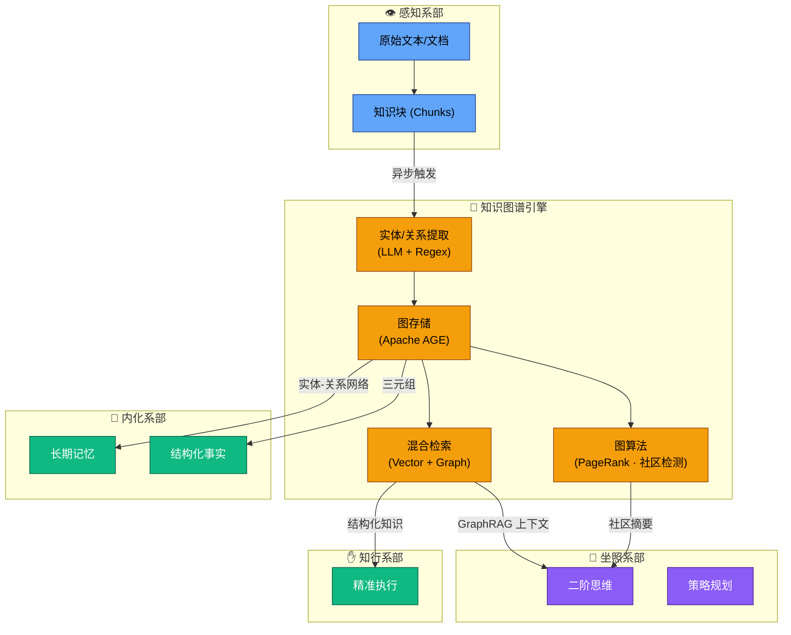
```mermaid
%%{init: {"themeVariables": {"primaryColor": "#0b3d91", "primaryTextColor": "#ffffff", "primaryBorderColor": "#0b3d91", "secondaryColor": "#0f5132", "secondaryTextColor": "#ffffff", "tertiaryColor": "#842029", "tertiaryTextColor": "#ffffff"}}}%%
flowchart TB
    subgraph Perception["👁️ 感知系部"]
        P_In["原始文本/文档"]
        P_Out["知识块 (Chunks)"]
        P_In --> P_Out
    end

    subgraph KG["💎 知识图谱引擎"]
        direction TB
        Extract["实体/关系提取<br/>(LLM + Regex)"]
        Store["图存储<br/>(Apache AGE)"]
        Algo["图算法<br/>(PageRank · 社区检测)"]
        Retrieve["混合检索<br/>(Vector + Graph)"]
        Extract --> Store --> Algo
        Store --> Retrieve
    end

    subgraph Internalization["💎 内化系部"]
        Memory["长期记忆"]
        Facts["结构化事实"]
    end

    subgraph Contemplation["🧠 坐照系部"]
        Reason["二阶思维"]
        Plan["策略规划"]
    end

    subgraph Action["✋ 知行系部"]
        Execute["精准执行"]
    end

    P_Out -->|"异步触发"| Extract
    Retrieve -->|"GraphRAG 上下文"| Reason
    Retrieve -->|"结构化知识"| Execute
    Algo -->|"社区摘要"| Reason
    Store -->|"实体-关系网络"| Memory
    Store -->|"三元组"| Facts

    classDef perception fill:#60A5FA,stroke:#1E3A8A,color:#000
    classDef kg fill:#F59E0B,stroke:#92400E,color:#000
    classDef wing fill:#10B981,stroke:#065F46,color:#FFF
    classDef thinking fill:#8B5CF6,stroke:#4C1D95,color:#FFF

    class P_In,P_Out perception
    class Extract,Store,Algo,Retrieve kg
    class Memory,Facts wing
    class Reason,Plan thinking
    class Execute wing
```

---

## 2. 学术理论基础

### 2.1 知识图谱基本概念

知识图谱的核心数据模型可归纳为两大流派<sup>[[1]](#ref1)</sup>：

**RDF（资源描述框架）**：W3C 标准，以 `(Subject, Predicate, Object)` 三元组为原子单位，强调全局语义互操作性与形式化推理能力（OWL / RDFS）。

**属性图 (Property Graph)**：以节点和边为一等公民，节点和边均可附带任意属性。查询语言包括 Cypher (Neo4j)、GQL (ISO 标准)、openCypher (Apache AGE)。

| 维度 | RDF | 属性图 |
| :--- | :-- | :----- |
| 标准化 | W3C 标准（SPARQL, OWL） | ISO GQL (2024) |
| 语义推理 | ✅ 完整 OWL 推理 | ⚠️ 有限支持 |
| 关系建模 | 原子三元组，多关系需具体化 | 边为一等公民，原生多关系 |
| 属性访问 | 需额外三元组 | O(1) 原生属性 |
| 查询效率 | 变长 JOIN | O(|graph|) 遍历 |
| 工程复杂度 | 高（本体论设计） | 中（灵活 Schema） |

**Negentropy 选择属性图模型**，理由：
1. Apache AGE 原生支持 openCypher，与 PostgreSQL 完全融合
2. 属性图的灵活 Schema 契合演进式设计原则
3. 边上的属性（weight, confidence, evidence）对检索质量至关重要

### 2.2 知识图谱嵌入

知识图谱嵌入 (KGE) 将实体和关系映射到连续向量空间，支持链接预测和实体分类<sup>[[2]](#ref2)</sup>：

- **TransE**<sup>[[2]](#ref2)</sup>：基础翻译模型，$\mathbf{h} + \mathbf{r} \approx \mathbf{t}$，适合一对一关系但难以处理对称/多对多关系
- **RotatE**<sup>[[3]](#ref3)</sup>：在复数空间中将关系建模为旋转 $\mathbf{t} = \mathbf{h} \circ \mathbf{r}$（$\mathbf{r}_i = e^{i\theta_i}$），天然保持对称性、反对称性、逆关系和组合关系模式
- **ComplEx / DistMult**：基于双线性模型的语义匹配，适合复杂关系模式

**在 Negentropy 中的应用场景**：KGE 在终极阶段可用于实体链接预测（发现隐含关系）和图增强检索（embedding 距离作为补充排序信号）。当前阶段暂不需要 KGE，优先使用 LLM 直接提取。

### 2.3 GraphRAG 范式

**Microsoft GraphRAG**<sup>[[4]](#ref4)</sup> 开创了结构化检索增强生成范式，核心流程：

1. 文本分割为 TextUnit → LLM 提取实体和关系 → 构建知识图谱
2. Leiden 算法进行分层社区检测<sup>[[15]](#ref15)</sup>
3. LLM 为每个社区生成自然语言摘要
4. 双模式检索：
   - **Local Search**：从查询实体出发做图遍历，聚合邻域上下文
   - **Global Search**：Map-Reduce 遍历社区摘要，适合全局性问题

**LightRAG**<sup>[[5]](#ref5)</sup> 提出了更高效的替代方案：

- **双层检索**：Low-Level（实体 + 直接关系）+ High-Level（概念/主题级聚合）
- **增量更新**：新文档通过 Union 操作合并到现有图谱（无需重建）
- **性能优势**：比 GraphRAG 节省约 6000 倍 token 消耗，查询延迟降低约 33%

### 2.4 时态知识图谱

Graphiti/Zep<sup>[[6]](#ref6)</sup> 提出了面向 AI Agent 的**双时态知识图谱**架构：

- **三层级结构**：Episode 子图（原始输入）→ Semantic Entity 子图（提取实体/关系）→ Community 子图（聚类摘要）
- **双时态模型**：
  - 事件时间线 (T)：事实在真实世界的有效时间 `(t_valid, t_invalid)`
  - 事务时间线 (T')：事实被系统记录的时间 `(t_make, t_expire)`
- **矛盾处理**：新信息与旧事实冲突时，系统自动设置 `t_invalid` 使旧边失效
- **性能基准**：Deep Memory Retrieval 准确率 94.8%（vs MemGPT 93.4%），延迟降低 ~90%

**与 Negentropy Memory 模块的互补**：Memory 模块使用 Ebbinghaus 遗忘曲线<sup>[[8]](#ref8)</sup>管理情景记忆（完整公式：`retention_score = min(1.0, e^{-λt} × (1 + ln(1+n)) / 5.0)`，详见 [memory.md](./memory.md)），知识图谱提供**结构化语义记忆**——两者分别对应人类认知的海马体（短期/情景）与新皮层（长期/结构化）。

### 2.5 倒数排名融合

Cormack 等人提出的 Reciprocal Rank Fusion (RRF)<sup>[[7]](#ref7)</sup> 为多信号融合提供了无需参数调优的稳健方案：

$$RRF(d) = \sum_{r \in R} \frac{1}{k + rank_r(d)}$$

其中 $k$ 为平滑常数（Negentropy 默认 $k=60$，配置于 `SearchConfig.rrf_k`）。RRF 的核心优势是**对分数尺度不敏感**，无论语义分数范围是 [0,1] 还是图分数范围是 [0,5]，排名融合都能产生稳健结果。Negentropy 的知识检索已在 L0 阶段支持 RRF 模式（见 [knowledges.md §5.2](./knowledges.md)），知识图谱的混合检索将进一步扩展 RRF 的信号来源。

---

## 3. 行业框架全景分析

### 3.1 Cognee：ECL 管道与 PostgreSQL 原生支持

[Cognee](https://github.com/topoteretes/cognee) 是面向 AI Agent 的知识引擎，采用 **ECL (Extract-Cognify-Load)** 管道架构<sup>[[13]](#ref13)</sup>：

- **Extract**：从任意格式文档提取结构化数据
- **Cognify**：LLM 驱动的实体/关系提取 + 去重 + Schema 推断
- **Load**：三层存储（图数据库 + 向量数据库 + 关系数据库）

**关键特性**：
- PostgreSQL 原生支持（关系存储）+ pgvector（向量存储）
- 图存储支持 Neo4j / KuzuDB / FalkorDB / NetworkX
- 异步操作全栈、可插拔 LLM 提供商
- Local-first 无强制云依赖

**与 Negentropy 的契合点**：Cognee 的 ECL 管道天然映射到 Negentropy 的"感知 → 内化"管道；三层存储模型与 Negentropy 的 PostgreSQL + pgvector + Apache AGE 完全对齐。

### 3.2 Graphiti/Zep：双时态与记忆级 KG

[Graphiti](https://github.com/getzep/graphiti) 是 Zep 开源的时态知识图谱引擎<sup>[[6]](#ref6)</sup>：

- **三层级图结构**：Episode（原始输入）→ Semantic Entity（实体/关系）→ Community（聚类摘要）
- **三级实体解析**：精确匹配 → 模糊相似度 → LLM 推理
- **实时增量更新**：无需批量重计算
- **混合检索**：语义嵌入 + BM25 关键词 + 图遍历

**与 Negentropy 的契合点**：双时态模型与 Memory 模块的遗忘曲线形成互补；实体解析策略可增强现有 `LLMEntityExtractor` 的去重能力。

### 3.3 Microsoft GraphRAG：社区检测与层级摘要

[GraphRAG](https://github.com/microsoft/graphrag) 由 Microsoft Research 提出<sup>[[4]](#ref4)</sup>：

- **Leiden 社区检测**<sup>[[15]](#ref15)</sup>：基于模块度优化的分层聚类
- **层级摘要**：每个社区由 LLM 生成自然语言总结
- **Map-Reduce 全局搜索**：遍历社区摘要回答全局性问题
- **技术无关知识模型**：通过抽象层适配多种存储后端

**与 Negentropy 的契合点**：社区摘要天然服务于坐照系部的"二阶思维"——从实体关系中浮现宏观洞察。

### 3.4 LightRAG：高效双层检索

[LightRAG](https://github.com/HKUDS/LightRAG) 以极简主义实现高效 GraphRAG<sup>[[5]](#ref5)</sup>：

- **双层检索**：Low-Level（具体实体和直接关系）+ High-Level（概念/主题聚合）
- **增量更新**：通过 Union 操作合并新图谱（无需全量重建）
- **可插拔存储**：JSON / PostgreSQL / Neo4j / MongoDB / Redis

**性能对比**：

| 指标 | LightRAG | GraphRAG | NaiveRAG |
| :--- | :------- | :------- | :------- |
| Token/Query | ~100 | ~610,000 | ~500 |
| API Calls/Query | 1 | 数百 | 1 |
| Win Rate vs NaiveRAG | 82.54% | — | Baseline |
| 增量更新开销 | 仅提取 | 社区重建 | N/A |

**与 Negentropy 的契合点**：LightRAG 的成本效率模型非常适合初期部署；PostgreSQL 原生支持降低集成门槛。

### 3.5 Apache AGE：PostgreSQL 原生图扩展

[Apache AGE](https://age.apache.org/) 为 PostgreSQL 提供属性图能力<sup>[[11]](#ref11)</sup>：

- **openCypher 查询语言**：通过 `cypher()` 函数在 SQL 中执行图查询
- **零额外基础设施**：作为 PostgreSQL 扩展安装，复用现有连接池、事务、备份
- **混合查询**：SQL + Cypher 在同一事务中执行
- **agtype 数据类型**：存储图节点和边的属性

### 3.6 框架决策矩阵

| 维度 | Cognee | Graphiti/Zep | GraphRAG | LightRAG | AGE (当前) |
| :--- | :----- | :----------- | :------- | :------- | :--------- |
| **PostgreSQL 原生** | ✅ 关系层 | ❌ Neo4j/FalkorDB | ❌ 技术无关 | ✅ 可选 | ✅ 完全原生 |
| **时态建模** | ❌ | ✅ 双时态 | ❌ | ❌ | ❌ (Phase 2 预备) |
| **社区检测** | ✅ Louvain | ❌ | ✅ Leiden | ❌ | ❌ (Phase 2 规划) |
| **增量更新** | ✅ | ✅ 实时 | ❌ 全量重建 | ✅ Union | ⚠️ 部分 |
| **Token 效率** | 中等 | 中等 | 低（token 密集） | ✅ 极高 | ✅ 高 |
| **多跳推理** | ✅ | ✅ | ✅ 社区级 | ✅ 双层 | ⚠️ 1-3 跳 |
| **运维复杂度** | 中等 | 高（需图 DB） | 中等 | 低 | ✅ 极低 |
| **生产成熟度** | ⭐⭐⭐ | ⭐⭐⭐⭐ (Zep 企业版) | ⭐⭐⭐⭐ (Azure) | ⭐⭐⭐ | ⭐⭐⭐ |

### 3.7 复用策略

遵循 AGENTS.md **复用驱动 (Composition over Construction)** 原则：

| 能力 | 复用来源 | 自建内容 |
| :--- | :------- | :------- |
| 实体/关系提取 | ✅ 现有 `LLMEntityExtractor` | 增强去重/解析 |
| 图存储 | ✅ Apache AGE (已集成) | 迁移 JSONB → AGE 边 |
| 社区检测 | 🔄 Louvain (Python networkx) | 服务层编排 |
| GraphRAG 检索 | 🔄 LightRAG 双层模式启发 | 适配现有 `SearchConfig` |
| 时态建模 | 🔄 Graphiti 双时态模型启发 | 扩展关系属性 |

### 3.6 可采纳的架构模式精炼

基于对 Cognee、Graphiti、Neo4j GDS 的深度调研，提炼出以下可直接采纳的架构模式：

**Cognee ECL 管道模式**：Extract-Cognify-Load 三层解耦架构<sup>[[13]](#ref13)</sup>。Extract 层负责文档解析与分块（对应 Negentropy 的感知系部），Cognify 层负责 LLM 提取、实体去重与 Schema 推断（对应 GraphService + LLM 提取器），Load 层负责三层存储（图 + 向量 + 关系，对应 PostgreSQL + pgvector + AGE）。核心启示：管道的每一层应是可独立替换的策略，通过接口解耦。

**Graphiti 双时态模型**<sup>[[14]](#ref14)</sup>：关系同时携带 `valid_from/valid_to`（事实有效时间）和 `created_at/expired_at`（系统记录时间）两组时态字段。事实时间用于回答"这段关系何时成立"，系统时间用于回答"系统何时知道这段关系"。Deep Memory Retrieval（DMR）准确率达 94.8%，关键在于三级实体解析（精确匹配 → 嵌入相似度 > 0.92 → LLM 推理）。Negentropy 可在 Phase 3 在 `KgRelation` 的 `first_observed_at/last_observed_at` 基础上扩展双时态字段。

**Neo4j GDS 算法库**<sup>[[6]](#ref6)</sup>：提供 50+ 图算法（PageRank、Louvain、Node2Vec 等）。Negentropy 当前采用 PostgreSQL 单一技术栈，图算法通过 Python `networkx` 实现而非数据库内计算。迁移阈值：图规模 >100K 实体 / 频繁 4+ 跳查询 / 需要 50+ GDS 算法时，评估迁移到 Neo4j。
| 向量检索 | ✅ pgvector HNSW (已有) | RRF 融合图分数 |

---

## 4. 当前实现现状 (Phase 1)

### 4.1 已完成交付物

Phase 1 基础能力增强已于 2026-02 完成，主要交付物：

| 组件 | 文件路径 | 状态 | 说明 |
| :--- | :------- | :--- | :--- |
| LLM 实体提取器 | [`llm_extractors.py`](../apps/negentropy/src/negentropy/knowledge/llm_extractors.py) | ✅ | `LLMEntityExtractor` 多语言实体提取 |
| LLM 关系提取器 | [`llm_extractors.py`](../apps/negentropy/src/negentropy/knowledge/llm_extractors.py) | ✅ | `LLMRelationExtractor` 语义关系提取 + 证据 |
| 组合提取器 | [`llm_extractors.py`](../apps/negentropy/src/negentropy/knowledge/llm_extractors.py) | ✅ | `CompositeEntityExtractor` / `CompositeRelationExtractor` 回退策略 |
| 策略基类 | [`graph.py`](../apps/negentropy/src/negentropy/knowledge/graph.py) | ✅ | `EntityExtractor` / `RelationExtractor` ABC |
| 图谱存储 | [`graph_repository.py`](../apps/negentropy/src/negentropy/knowledge/graph_repository.py) | ✅ | `AgeGraphRepository` CRUD + 查询 |
| 图谱服务 | [`graph_service.py`](../apps/negentropy/src/negentropy/knowledge/graph_service.py) | ✅ | `GraphService` 构建编排 + 检索封装 |
| 类型定义 | [`types.py`](../apps/negentropy/src/negentropy/knowledge/types.py) | ✅ | `KgEntityType` / `KgRelationType` / `GraphSearchMode` |
| API 端点 | [`api.py`](../apps/negentropy/src/negentropy/knowledge/api.py) | ✅ | 图谱构建/查询/检索/邻居/路径 API |
| DB Schema | [`kg_schema_extension.sql`](./schema/kg_schema_extension.sql) | ✅ | AGE 扩展 + 枚举 + 函数 + 视图 |
| 实体一等公民服务 | [`kg_entity_service.py`](../apps/negentropy/src/negentropy/knowledge/kg_entity_service.py) | ✅ | `KgEntityService` 双写 + 实体列表/详情 |
| 实体浏览 API | [`api.py`](../apps/negentropy/src/negentropy/knowledge/api.py) | ✅ | `GET /graph/entities` + `GET /graph/entities/{id}` |
| 图谱统计 API | [`api.py`](../apps/negentropy/src/negentropy/knowledge/api.py) | ✅ | `GET /graph/stats` 聚合统计 |
| 递归 CTE 遍历 | [`graph_repository.py`](../apps/negentropy/src/negentropy/knowledge/graph_repository.py) | ✅ | `find_neighbors` / `find_path` 多跳 BFS |
| 前端图谱页面 | [`graph/page.tsx`](../apps/negentropy-ui/app/knowledge/graph/page.tsx) | ✅ | 语料库选择 + 可视化 + 实体列表 + 搜索 |
| 前端实体面板 | [`_components/`](../apps/negentropy-ui/app/knowledge/graph/_components/) | ✅ | EntityList + EntityDetail + SearchBar + PathExplorer |

### 4.2 当前架构

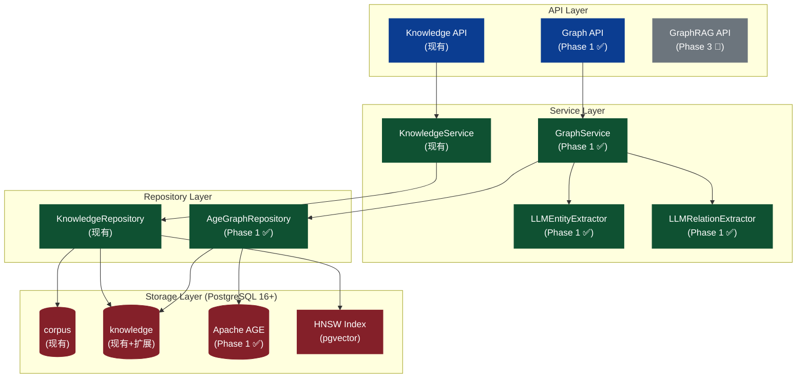
```mermaid
%%{init: {"themeVariables": {"primaryColor": "#0b3d91", "primaryTextColor": "#ffffff", "primaryBorderColor": "#0b3d91", "secondaryColor": "#0f5132", "secondaryTextColor": "#ffffff", "secondaryBorderColor": "#0f5132", "tertiaryColor": "#842029", "tertiaryTextColor": "#ffffff", "tertiaryBorderColor": "#842029"}}}%%
flowchart TB
    subgraph API["API Layer"]
        KAPI["Knowledge API<br/>(现有)"]
        GAPI["Graph API<br/>(Phase 1 ✅)"]
        GRAG["GraphRAG API<br/>(Phase 3 🔲)"]
    end

    subgraph Service["Service Layer"]
        KSvc["KnowledgeService<br/>(现有)"]
        GSvc["GraphService<br/>(Phase 1 ✅)"]
        E2E["LLMEntityExtractor<br/>(Phase 1 ✅)"]
        R2R["LLMRelationExtractor<br/>(Phase 1 ✅)"]
    end

    subgraph Repo["Repository Layer"]
        KRepo["KnowledgeRepository<br/>(现有)"]
        GRepo["AgeGraphRepository<br/>(Phase 1 ✅)"]
    end

    subgraph Storage["Storage Layer (PostgreSQL 16+)"]
        direction TB
        Corpus[("corpus<br/>(现有)")]
        Knowledge[("knowledge<br/>(现有+扩展)")]
        AGE[("Apache AGE<br/>(Phase 1 ✅)")]
        HNSW["HNSW Index<br/>(pgvector)"]
    end

    KAPI --> KSvc --> KRepo
    GAPI --> GSvc --> GRepo
    GSvc --> E2E
    GSvc --> R2R

    KRepo --> Corpus
    KRepo --> Knowledge
    KRepo --> HNSW
    GRepo --> AGE
    GRepo --> Knowledge

    classDef api fill:#0b3d91,stroke:#0b3d91,color:#ffffff
    classDef svc fill:#0f5132,stroke:#0f5132,color:#ffffff
    classDef repo fill:#0f5132,stroke:#0f5132,color:#ffffff
    classDef store fill:#842029,stroke:#842029,color:#ffffff
    classDef pending fill:#6c757d,stroke:#6c757d,color:#ffffff

    class KAPI,GAPI api
    class GRAG pending
    class KSvc,GSvc,E2E,R2R svc
    class KRepo,GRepo repo
    class Corpus,Knowledge,AGE,HNSW store
```

### 4.3 实体与关系类型

**实体类型** (8 种)：

```python
class KgEntityType(Enum):
    PERSON = "person"            # 人物
    ORGANIZATION = "organization" # 组织/公司
    LOCATION = "location"        # 地点
    EVENT = "event"              # 事件
    CONCEPT = "concept"          # 概念/术语
    PRODUCT = "product"          # 产品
    DOCUMENT = "document"        # 文档（注：当前 LLM 提取 Prompt 未包含此类型，将归入 OTHER）
    OTHER = "other"              # 其他
```

**关系类型** (12 种)：

```python
class KgRelationType(Enum):
    # 组织关系
    WORKS_FOR = "WORKS_FOR"        # 就职于
    PART_OF = "PART_OF"            # 隶属于
    LOCATED_IN = "LOCATED_IN"      # 位于
    # 语义关系
    RELATED_TO = "RELATED_TO"      # 相关
    SIMILAR_TO = "SIMILAR_TO"      # 相似
    DERIVED_FROM = "DERIVED_FROM"  # 衍生自
    # 因果关系
    CAUSES = "CAUSES"              # 导致
    PRECEDES = "PRECEDES"          # 先于
    FOLLOWS = "FOLLOWS"            # 后于
    # 引用关系
    MENTIONS = "MENTIONS"          # 提及
    CREATED_BY = "CREATED_BY"      # 创建者
    # 共现关系（回退）
    CO_OCCURS = "CO_OCCURS"        # 共现
```

### 4.4 数据流

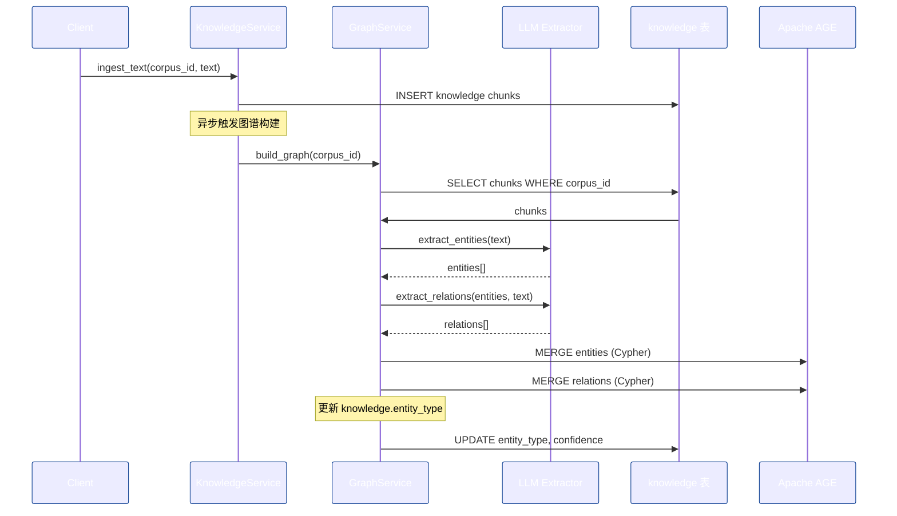
```mermaid
%%{init: {"themeVariables": {"primaryColor": "#0b3d91", "primaryTextColor": "#ffffff", "actorBorder": "#0b3d91", "actorTextColor": "#ffffff"}}}%%
sequenceDiagram
    participant Client
    participant KnowledgeService
    participant GraphService
    participant LLM as LLM Extractor
    participant Knowledge as knowledge 表
    participant AGE as Apache AGE

    Client->>KnowledgeService: ingest_text(corpus_id, text)
    KnowledgeService->>Knowledge: INSERT knowledge chunks

    Note over KnowledgeService: 异步触发图谱构建

    KnowledgeService->>GraphService: build_graph(corpus_id)
    GraphService->>Knowledge: SELECT chunks WHERE corpus_id
    Knowledge->>GraphService: chunks

    GraphService->>LLM: extract_entities(text)
    LLM-->>GraphService: entities[]

    GraphService->>LLM: extract_relations(entities, text)
    LLM-->>GraphService: relations[]

    GraphService->>AGE: MERGE entities (Cypher)
    GraphService->>AGE: MERGE relations (Cypher)

    Note over GraphService: 更新 knowledge.entity_type
    GraphService->>Knowledge: UPDATE entity_type, confidence
```

### 4.5 API 端点

| 端点 | 方法 | 说明 |
| :--- | :--- | :--- |
| `/knowledge/base/{corpus_id}/graph/build` | POST | 触发图谱构建 |
| `/knowledge/base/{corpus_id}/graph` | GET | 获取语料库图谱 |
| `/knowledge/base/{corpus_id}/graph/search` | POST | 图谱混合检索 |
| `/knowledge/graph/neighbors` | POST | 查询实体邻居 |
| `/knowledge/graph/path` | POST | 查询最短路径 |
| `/knowledge/base/{corpus_id}/graph` | DELETE | 清除图谱 |
| `/knowledge/base/{corpus_id}/graph/history` | GET | 构建历史 |

### 4.6 诚实评估：当前限制

基于代码事实的审视，Phase 1 存在以下待改进之处：

1. **JSONB 关系存储**：`AgeGraphRepository` 中部分关系通过 `knowledge.metadata` 的 JSONB 字段存储，尚未完全迁移到 Apache AGE 原生图边。这限制了真正的 Cypher 图遍历能力。

2. **简化路径查询**：`find_path()` 方法为简化实现，未使用 AGE 的 `shortestPath()` Cypher 函数。

3. **简化邻居遍历**：SQL 函数 `kg_neighbors()` 使用递归 CTE 近似，而非真正的 AGE Cypher 多跳遍历。真正的 Cypher 遍历函数 `kg_cypher_neighbors()` 已定义但需要应用层配合。

4. **无图算法**：PageRank（`kg_entity_importance()` 为简化度中心性近似）、社区检测均未实现。

5. **无时态建模**：关系无时间维度，无法追踪事实有效期。

6. **无 GraphRAG**：混合检索 `kg_hybrid_search()` 采用语义分数 + 图度分数线性加权，尚未实现社区级检索或双层检索。

---

## 5. PostgreSQL 阶段深度设计

### 5.1 设计原则

| 原则 | 应用 |
| :--- | :--- |
| **基础设施复用** | 零新服务，全部能力在 PostgreSQL + Apache AGE 内实现 |
| **单一事实源** | PostgreSQL 为图数据的唯一权威源，避免 Split-Brain |
| **演进式设计** | 渐进增强，每步可独立部署、独立回滚 |
| **正交分解** | 图存储、图算法、混合检索三个关注点独立演进 |

### 5.2 增强图存储：JSONB → AGE 原生图边

**目标**：将关系存储从 `knowledge.metadata` JSONB 完全迁移到 Apache AGE 原生图边，释放 Cypher 遍历能力。

**迁移策略**（双读兼容）：

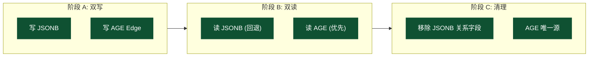
```mermaid
%%{init: {"themeVariables": {"primaryColor": "#0b3d91", "primaryTextColor": "#ffffff"}}}%%
flowchart LR
    subgraph Phase_A["阶段 A: 双写"]
        Write_JSONB["写 JSONB"]
        Write_AGE["写 AGE Edge"]
        Write_JSONB & Write_AGE
    end

    subgraph Phase_B["阶段 B: 双读"]
        Read_JSONB["读 JSONB (回退)"]
        Read_AGE["读 AGE (优先)"]
    end

    subgraph Phase_C["阶段 C: 清理"]
        Drop_JSONB["移除 JSONB 关系字段"]
        AGE_Only["AGE 唯一源"]
    end

    Phase_A --> Phase_B --> Phase_C

    classDef step fill:#0f5132,stroke:#0f5132,color:#ffffff
    class Write_JSONB,Write_AGE,Read_JSONB,Read_AGE,Drop_JSONB,AGE_Only step
```

**关键实现细节**：

1. **`AgeGraphRepository.create_relations()`** 改为调用 [`kg_create_relation()`](./schema/kg_schema_extension.sql) SQL 函数（已在 Schema 的 Cypher 辅助函数部分定义）
2. **Session 预热**：每个数据库连接需执行 `LOAD 'age'; SET search_path = ag_catalog, "$user", public;`
3. **实体 ID 映射**：维护 `knowledge.id ↔ AGE vertex id` 的双向映射

### 5.3 图算法层

#### 5.3.1 PageRank

当前 `kg_entity_importance()` 为简化度中心性（`ln(1 + 入度 + 出度)`）。需升级为迭代式 PageRank：

**PostgreSQL 迭代式 PageRank 设计**：

```sql
-- 迭代 PageRank (阻尼因子 d=0.85, 最大迭代 max_iter=20)
CREATE OR REPLACE FUNCTION kg_pagerank(
    p_corpus_id UUID,
    p_damping FLOAT DEFAULT 0.85,
    p_max_iter INTEGER DEFAULT 20,
    p_tolerance FLOAT DEFAULT 1e-6
)
RETURNS TABLE (entity_id UUID, rank FLOAT)
AS $$
WITH RECURSIVE pagerank AS (
    -- 初始化: 均匀分布
    SELECT id AS entity_id, 1.0 / COUNT(*) OVER() AS rank, 0 AS iter
    FROM knowledge WHERE corpus_id = p_corpus_id AND entity_type IS NOT NULL

    UNION ALL

    -- 迭代: PR(v) = (1-d)/N + d * Σ PR(u)/out_degree(u)
    SELECT ... -- 完整实现参见 Phase 2 交付
)
SELECT entity_id, rank FROM pagerank
WHERE iter = (SELECT MAX(iter) FROM pagerank);
$$ LANGUAGE SQL;
```

**备选方案**：若迭代 CTE 性能不佳（预期在 >10K 实体时出现瓶颈），可在 Python 服务层使用 `networkx.pagerank()` 计算后写回数据库。

#### 5.3.2 社区检测 (Louvain)

采用 Python 服务层 + `networkx` 库实现，因为 Louvain 算法需要多轮迭代和模块度优化，不适合纯 SQL 实现<sup>[[15]](#ref15)</sup>：

```python
# GraphService 中的社区检测方法
async def detect_communities(
    self, corpus_id: UUID, resolution: float = 1.0
) -> Dict[str, int]:
    """Louvain 社区检测

    1. 从 AGE 加载图结构到 NetworkX
    2. 执行 Louvain 聚类
    3. 将社区 ID 写回 knowledge.metadata
    """
    import networkx as nx
    from community import community_louvain

    G = await self.repository.export_to_networkx(corpus_id)
    partition = community_louvain.best_partition(G, resolution=resolution)
    await self.repository.update_communities(corpus_id, partition)
    return partition
```

**存储设计**：社区 ID 存储在 `knowledge.metadata->>'community_id'` 中，并建立 GIN 索引以支持社区级聚合查询。

#### 5.3.3 最短路径

升级当前桩实现，使用 AGE 原生 Cypher `shortestPath()`：

```sql
-- 使用 AGE Cypher 的最短路径查询
SELECT * FROM cypher('negentropy_kg', $$
    MATCH path = shortestPath(
        (a:Entity {id: $source_id})-[*..5]-(b:Entity {id: $target_id})
    )
    RETURN nodes(path) as nodes,
           relationships(path) as rels,
           length(path) as distance
$$, params => '...');
```

#### 5.3.4 Personalized PageRank 与多跳推理（Phase 4 G4 已落地）

**理论锚点**：Page et al. (1999) PageRank 通过偏置 teleport 向量实现"以查询为中心"的相关性传播；HippoRAG (Gutiérrez et al., NeurIPS'24) 在多跳问答上证明 PPR + 命名实体抽取 优于密集检索 ~20%。

**计算入口**：`graph_algorithms.compute_personalized_pagerank(db, corpus_id, seed_entities, alpha=0.85)`：
- 复用 `export_graph_to_networkx`；将 seed 归一化（去 `entity:` 前缀 + 过滤不在图中的）
- `personalization` 字典：valid seeds 平均分配权重 1/N，其余节点 0
- `nx.PowerIterationFailedConvergence` 时降级为"种子节点 1.0、其余 0"，与 PageRank 失败降级互补
- 不写库（不污染 `kg_entities.importance_score`），分数仅用于本次 multi_hop_reason 调用

**Provenance 证据链**：`graph/provenance.py::ProvenanceBuilder` 对 PPR top-K 反向追溯：
- 单次递归 CTE BFS 在 `kg_relations` 上找出 target → 任意 seed 的最短无向路径（默认 `max_chain_depth=5`）
- 沿路径逐跳 JOIN `kg_relations` 获取 `relation_type` + `evidence_text` + `weight`，组装 `EvidenceEdge` 列表
- 单一职责：仅产出"展示用"路径；时态版本由 `repository.find_path(as_of=...)` 承担，避免循环依赖

**API**：`POST /base/{cid}/graph/multi_hop_reason`：
- 入参：`{query, seed_entities[], top_k=10, max_hops=3}`；`seed_entities` 留空时按规则从 query 提取（英文大写词、引号括起的中英短语）
- seed → entity_id 解析：UUID 直接用；否则按 `kg_entities.name ILIKE` 等值/前缀模糊匹配（按 confidence DESC 取首条）
- 出参：`{seeds, answer_entities, evidence_chain[], latency_ms}`；evidence_chain 按 PPR 降序

**Migration 0025**：`kg_query_provenance` 审计表（query/seeds/top_entities/evidence_chain/latency 留痕），用于后续抽样质检与训练数据生成。

**降级路径**：seeds 提取为空 → 直接返回空 evidence_chain（不抛错）；seed 全部不在图中 → PPR 返回空字典，UI 显式提示"未发现可达路径"。

### 5.4 混合检索增强

**目标**：构建 **Vector + Graph + RRF** 三层融合检索管道。

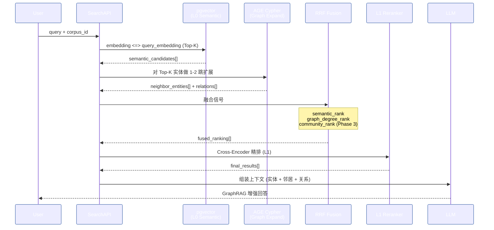
```mermaid
%%{init: {"themeVariables": {"primaryColor": "#0b3d91", "primaryTextColor": "#ffffff", "actorBorder": "#0b3d91", "actorTextColor": "#ffffff"}}}%%
sequenceDiagram
    participant User
    participant SearchAPI
    participant VectorSearch as pgvector<br/>(L0 Semantic)
    participant GraphExpand as AGE Cypher<br/>(Graph Expand)
    participant RRF as RRF Fusion
    participant Reranker as L1 Reranker
    participant LLM

    User->>SearchAPI: query + corpus_id
    SearchAPI->>VectorSearch: embedding <=> query_embedding (Top-K)
    VectorSearch-->>SearchAPI: semantic_candidates[]

    SearchAPI->>GraphExpand: 对 Top-K 实体做 1-2 跳扩展
    GraphExpand-->>SearchAPI: neighbor_entities[] + relations[]

    SearchAPI->>RRF: 融合信号
    Note over RRF: semantic_rank<br/>graph_degree_rank<br/>community_rank (Phase 3)

    RRF-->>SearchAPI: fused_ranking[]

    SearchAPI->>Reranker: Cross-Encoder 精排 (L1)
    Reranker-->>SearchAPI: final_results[]

    SearchAPI->>LLM: 组装上下文 (实体 + 邻居 + 关系)
    LLM-->>User: GraphRAG 增强回答
```

**RRF 多信号融合**：

```
RRF_score(d) = 1/(k + rank_semantic(d)) + 1/(k + rank_graph(d))
```

- `rank_semantic`：pgvector 余弦相似度排名
- `rank_graph`：基于实体度中心性 + 邻域丰富度的排名
- Phase 3 增加 `rank_community`：基于社区重要性的排名

**配置扩展**：在现有 `GraphSearchMode` 类型中增加检索模式。当前定义为 `Literal` 类型别名：

```python
# 当前定义 (types.py)
GraphSearchMode = Literal["semantic", "graph", "hybrid"]

# Phase 2 扩展为：
GraphSearchMode = Literal["semantic", "graph", "hybrid", "rrf"]

# Phase 3 扩展为：
GraphSearchMode = Literal["semantic", "graph", "hybrid", "rrf", "graphrag"]
```

### 5.5 实体/关系类型扩展

**可扩展分类设计**：

当前 8 种实体类型和 12 种关系类型覆盖了通用场景。为支持领域特定需求（如法律、医疗、代码），设计可扩展的分类机制：

1. **用户自定义类型**：通过 `corpus.config` JSONB 字段配置 `custom_entity_types` 和 `custom_relation_types`
2. **类型继承**：自定义类型可标注父类型（如 `DISEASE → CONCEPT`），确保向后兼容
3. **提取指导**：自定义类型附带示例文本，供 LLM 提取时参考

**时态属性预备**：

为终极阶段的时态建模做准备，在关系属性中预留时间字段：

```sql
-- 关系属性扩展（在 AGE 边属性中）
{
    "type": "WORKS_FOR",
    "confidence": 0.95,
    "evidence": "...",
    "valid_from": "2024-01-01",  -- 事实生效时间 (Phase 3)
    "valid_to": null,             -- 事实失效时间 (Phase 3)
    "created_at": "2026-04-08"   -- 系统录入时间
}
```

#### 5.2.4 前端可视化层（Cytoscape.js + fCoSE）

**理论锚点**：Force-directed layout 起源于 Fruchterman & Reingold (1991)；fCoSE (Dogrusoz et al., 2009) 是当前对大规模属性图最优的快速复合 spring embedder。

**节点编码**：
- 颜色：`community_id != null` 时按社区配色（Tableau 10 色盲友好），否则按实体类型（`person/organization/...`）
- 尺寸：18-46px 线性映射 PageRank `importance_score`，零值兜底为 22px
- 选中态：橙色边框 + 非邻域淡化（opacity=0.15）

**fCoSE 默认参数**：

| 参数 | 值 | 备注 |
| :--- | :--- | :--- |
| `nodeRepulsion` | 5000 | 节点排斥力 |
| `idealEdgeLength` | 80 | 理想边长 |
| `edgeElasticity` | 0.45 | 边弹性 |
| `gravity` | 0.25 | 引力（防游离簇飞出） |
| `quality` | "default" | 在性能与美感间均衡 |

**性能基准**（Chrome 134 / M1）：100-500 节点初始布局 < 2s；5000+ 节点建议服务端 `limit=500` 截断（默认值），UI 显式提示"已按 importance 截断（双击节点展开邻居）"。

**交互范式**：
- 滚轮缩放（`wheelSensitivity=0.2`，避免误触猛缩）
- 拖拽画布平移
- 单击节点 → 高亮 1-hop 邻域 + 父组件展示详情
- 双击节点 → 调用 `GET /base/{cid}/graph/subgraph?center=ID&radius=1&limit=50` 增量加载
- 点击空白 → 取消选中

**渲染引擎切换**：保留 d3-force 实现作为兼容回退（顶部 toolbar `Cytoscape | d3-force` 切换）。

### 5.6 数据模型演进

**索引优化计划**：

| 索引 | 目标 | 类型 |
| :--- | :--- | :--- |
| `idx_kb_entity_type` | 按实体类型筛选 | BTree (已有) |
| `idx_kb_entity_confidence` | 筛选高质量实体 | BTree (已有) |
| `idx_kb_metadata_community` | 社区级聚合查询 | GIN on `metadata->>'community_id'` (新增) |
| AGE vertex index | 加速 MATCH 查询 | AGE BTree on `entity.id` (新增) |
| AGE edge index | 加速关系遍历 | AGE BTree on `edge.type` (新增) |

**性能目标**：

| 场景 | 目标 | 说明 |
| :--- | :--- | :--- |
| 图遍历 1-3 跳 | P95 < 100ms | AGE Cypher |
| 混合检索 (向量+图) | P95 < 300ms | RRF 融合 |
| 图谱构建 (1000 chunks) | < 5min | 异步任务 |
| LLM 实体提取 | < 2s/chunk | 批量优化 |
| PageRank 计算 (10K 实体) | < 30s | 迭代式或 NetworkX |
| 社区检测 (10K 实体) | < 60s | Louvain/Python |

---

## 6. 终极阶段设计

### 6.1 GraphRAG 实现

以 Microsoft GraphRAG<sup>[[4]](#ref4)</sup> 为蓝本，结合 LightRAG<sup>[[5]](#ref5)</sup> 的效率优化：

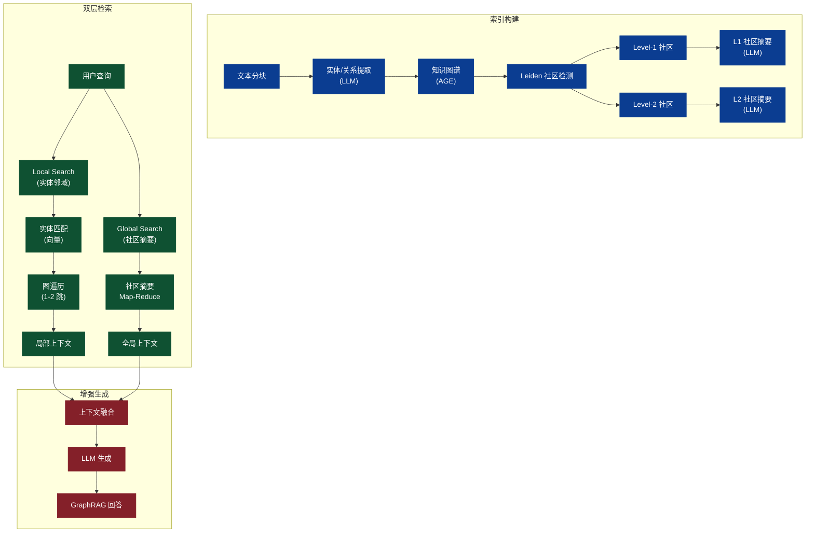
```mermaid
%%{init: {"themeVariables": {"primaryColor": "#0b3d91", "primaryTextColor": "#ffffff", "primaryBorderColor": "#0b3d91", "secondaryColor": "#0f5132", "secondaryTextColor": "#ffffff", "tertiaryColor": "#842029", "tertiaryTextColor": "#ffffff"}}}%%
flowchart TB
    subgraph Build["索引构建"]
        Chunks["文本分块"] --> Extract["实体/关系提取<br/>(LLM)"]
        Extract --> Graph["知识图谱<br/>(AGE)"]
        Graph --> Leiden["Leiden 社区检测"]
        Leiden --> L1_Comm["Level-1 社区"]
        Leiden --> L2_Comm["Level-2 社区"]
        L1_Comm --> Summary1["L1 社区摘要<br/>(LLM)"]
        L2_Comm --> Summary2["L2 社区摘要<br/>(LLM)"]
    end

    subgraph Retrieve["双层检索"]
        Query["用户查询"]
        Query --> Local["Local Search<br/>(实体邻域)"]
        Query --> Global["Global Search<br/>(社区摘要)"]
        Local --> EntityMatch["实体匹配<br/>(向量)"]
        EntityMatch --> GraphTraverse["图遍历<br/>(1-2 跳)"]
        GraphTraverse --> LocalContext["局部上下文"]
        Global --> CommunityMap["社区摘要<br/>Map-Reduce"]
        CommunityMap --> GlobalContext["全局上下文"]
    end

    subgraph Generate["增强生成"]
        LocalContext --> Merge["上下文融合"]
        GlobalContext --> Merge
        Merge --> LLM["LLM 生成"]
        LLM --> Answer["GraphRAG 回答"]
    end

    classDef build fill:#0b3d91,stroke:#0b3d91,color:#ffffff
    classDef retrieve fill:#0f5132,stroke:#0f5132,color:#ffffff
    classDef gen fill:#842029,stroke:#842029,color:#ffffff

    class Chunks,Extract,Graph,Leiden,L1_Comm,L2_Comm,Summary1,Summary2 build
    class Query,Local,Global,EntityMatch,GraphTraverse,LocalContext,CommunityMap,GlobalContext retrieve
    class Merge,LLM,Answer gen
```

**关键设计决策**：

1. **社区检测算法**：从 Phase 2 的 Louvain 升级为 Leiden<sup>[[15]](#ref15)</sup>，Leiden 在保证社区连通性方面更优
2. **社区摘要存储**：`kg_community_summaries` 表，字段包含 `community_id, level, summary_text, embedding, entity_count`
3. **增量更新策略**：新实体加入后仅重新计算受影响社区的摘要（参考 LightRAG<sup>[[5]](#ref5)</sup> 的 Union 策略）

#### 6.1.4 Global Search Map-Reduce 流水线（Phase 4 G1 已落地）

**模块**：`graph/global_search.py` 引入 `GlobalSearchService`，与 `community_summarizer.py` 正交分工 —— 后者负责生成与 embedding 落库，前者负责 query-focused 检索 + Map-Reduce。

**流水线**：

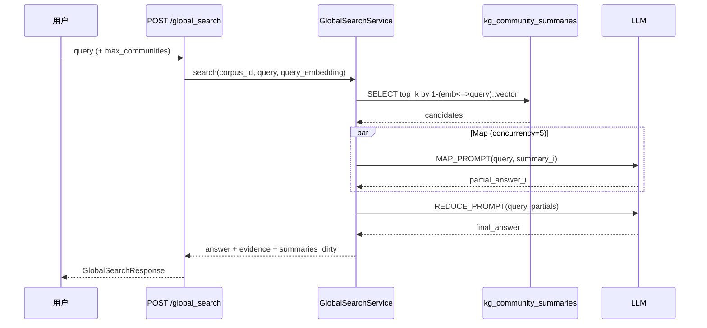
```mermaid
sequenceDiagram
    participant U as 用户
    participant API as POST /global_search
    participant SVC as GlobalSearchService
    participant DB as kg_community_summaries
    participant LLM as LLM
    U->>API: query (+ max_communities)
    API->>SVC: search(corpus_id, query, query_embedding)
    SVC->>DB: SELECT top_k by 1-(emb<=>query)::vector
    DB-->>SVC: candidates
    par Map (concurrency=5)
        SVC->>LLM: MAP_PROMPT(query, summary_i)
        LLM-->>SVC: partial_answer_i
    end
    SVC->>LLM: REDUCE_PROMPT(query, partials)
    LLM-->>SVC: final_answer
    SVC-->>API: answer + evidence + summaries_dirty
    API-->>U: GlobalSearchResponse
```

**关键设计**：
- **Selection（候选筛选）**：用 query embedding 在 `kg_community_summaries.embedding` 上做 cosine 排序，避免对全部摘要做 LLM 调用；若 embedding 列尚未填充（旧数据），降级为按 `entity_count DESC` 排序，相似度兜底为 0。
- **Map 限流**：`asyncio.Semaphore(5)`（默认）防止触达 LLM rate-limit；单 LLM 失败返回空字符串，evidence 列表自动剔除（不阻塞整体）。
- **Reduce 预算控制**：partial answers 截断为前 20 条防止 token 预算溢出。
- **摘要陈旧检测**：每次查询末尾对比 `kg_entities.MAX(updated_at) > kg_community_summaries.MIN(updated_at)`；若 dirty，response 中 `summaries_dirty=true`，UI 显式提示用户重跑摘要流程。
- **Embedding 写入路径**：`CommunitySummarizer(embedding_fn=...)` 在持久化时同步写 embedding；调用方未注入 `embedding_fn` 时降级为不写（与 G3 backfill 同向兼容）。

### 6.2 时态知识图谱

以 Graphiti<sup>[[6]](#ref6)</sup> 为蓝本的双时态模型设计：

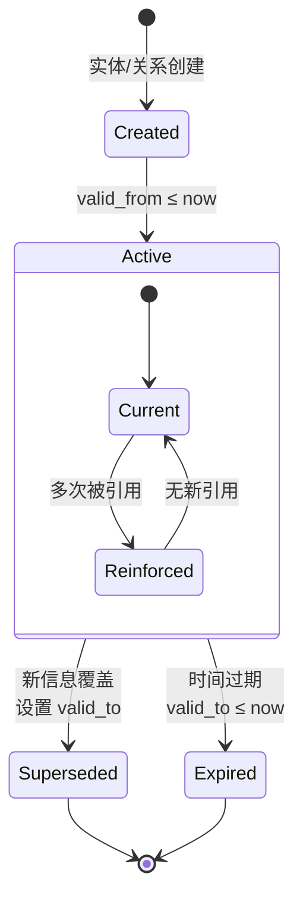
```mermaid
%%{init: {"themeVariables": {"primaryColor": "#0b3d91", "primaryTextColor": "#ffffff"}}}%%
stateDiagram-v2
    [*] --> Created: 实体/关系创建
    Created --> Active: valid_from ≤ now
    Active --> Superseded: 新信息覆盖<br/>设置 valid_to
    Active --> Expired: 时间过期<br/>valid_to ≤ now
    Superseded --> [*]
    Expired --> [*]

    state Active {
        [*] --> Current
        Current --> Reinforced: 多次被引用
        Reinforced --> Current: 无新引用
    }
```

**双时态字段设计**：

```sql
-- AGE 边属性扩展
{
    "type": "WORKS_FOR",
    "confidence": 0.95,
    -- 事件时间线 (Timeline T): 真实世界事实有效期
    "valid_from": "2024-01-15T00:00:00Z",
    "valid_to": null,  -- null 表示当前有效
    -- 事务时间线 (Timeline T'): 系统记录时间
    "created_at": "2026-04-08T10:30:00Z",
    "expired_at": null, -- null 表示当前记录
    -- 溯源
    "source_episode_id": "uuid-of-source-chunk",
    "evidence": "Sam Altman is the CEO of OpenAI."
}
```

**矛盾检测**：当新提取的关系与现有关系冲突时（同一 source-target 对、同一 relation_type 但不同属性），系统自动触发矛盾解决流程：
1. LLM 判断是"更新"还是"矛盾"
2. 若为"更新"：旧边设置 `valid_to = now`，新边 `valid_from = now`
3. 若为"矛盾"：两边共存，标记 `contradiction_flag = true`，等待人工审核

#### 6.2.3 as-of 查询接口与时间轴（Phase 4 G3 已落地）

**单一事实源**：所有需要按 `valid_from / valid_to` 过滤的查询都通过模块级 helper `_temporal_where_clause(rel_alias)` 构造谓词片段，绑定参数固定为 `:as_of`。这避免了在 `find_neighbors / find_path / hybrid_search / get_graph` 中重复散落 4 处时态 SQL，从源头消除"时态语义跨方法漂移"风险。

**API 入口**：所有图谱读路径接受可选 `as_of` 参数（ISO-8601）：

| 端点 | as_of 位置 | 行为 |
| :--- | :--- | :--- |
| `GET /knowledge/base/{cid}/graph` | query string | 仅返回该时刻有效关系；无连接的孤立节点自然剔除 |
| `POST /knowledge/base/{cid}/graph/search` | request body | 通过 EXISTS 子查询过滤"在该时刻无任何活跃关系"的实体；线性加权路径会自动升级为 RRF（线性 SQL 函数不支持时态过滤） |
| `POST /knowledge/graph/neighbors` | request body | 递归 CTE 在每跳应用时态过滤 |
| `POST /knowledge/graph/path` | request body | BFS 的 base 段 + recursive 段共享同一谓词 |
| `GET /knowledge/base/{cid}/graph/timeline` | — | 新增端点，返回按 `day/week/month` 桶聚合的 `valid_from`/`valid_to` 事件直方图，供前端 `TimeTravelSlider` 渲染 |

**索引**：迁移 `0024_kg_temporal_index_and_summary_embedding.py` 给 `kg_relations` 增加部分索引

```sql
CREATE INDEX ix_kg_relations_valid_active
  ON negentropy.kg_relations(corpus_id)
  WHERE valid_to IS NULL AND is_active = true;
```

加速默认"当前时刻"查询；同时一次性 `UPDATE kg_relations SET valid_from = created_at WHERE valid_from IS NULL` 让历史关系视为从写入时刻起即生效。

**缓存**：`_graph_cache` 的 key 维度从 `f"graph:{corpus_id}"` 升级为 `f"graph:{corpus_id}|as_of={iso}"`，`as_of=None` 显式落入 `as_of=now` 分桶，确保不同时刻快照不会脏读。`invalidate(prefix="graph:{corpus_id}")` 仍按前缀匹配清空所有 as_of 变体，无需逐 key 清理。

**前端 UI**：`TimeTravelSlider.tsx` 拉取 `/graph/timeline` 渲染密度直方图 + range slider；用户拖动至历史桶即将 ISO 时刻通过 `onChange` 回调透传至顶层 `as_of` 状态，所有面板（图谱、邻居、路径、搜索）共享同一时刻。徽标 `as_of: YYYY-MM-DD` 在每个面板顶部显式提示当前快照。

### 6.3 增量图更新

参考 LightRAG<sup>[[5]](#ref5)</sup> 的增量更新策略：

| 步骤 | 说明 |
| :--- | :--- |
| 1. 增量提取 | 仅对新 ingestion 的 chunks 执行实体/关系提取 |
| 2. 实体解析 | 新实体与现有图谱做匹配：精确 → 模糊 → LLM 推理 |
| 3. Union 合并 | 匹配成功的实体合并属性；新实体直接插入 |
| 4. 边权更新 | 重复出现的关系增加 `weight`，更新 `confidence` |
| 5. 社区增量更新 | 仅重新计算受影响社区的摘要 |

**实体解析的三层策略**（参考 Graphiti<sup>[[6]](#ref6)</sup>）：

1. **精确匹配**：label 完全一致 + 同 corpus_id
2. **模糊匹配**：SHA256 哈希前缀匹配（`llm_extractors.py` 中已有 `_generate_entity_id()` 使用 SHA256）
3. **LLM 语义匹配**：当模糊匹配置信度不足时，调用 LLM 判断两个实体是否指代同一对象

### 6.4 高级检索模式

**双层检索**（启发自 LightRAG<sup>[[5]](#ref5)</sup>）：

| 层级 | 检索目标 | 适用场景 | 示例查询 |
| :--- | :------- | :------- | :------- |
| **Low-Level** | 具体实体 + 直接关系 | 事实性问题 | "OpenAI 的 CEO 是谁？" |
| **High-Level** | 概念/主题 + 社区摘要 | 全局性问题 | "AI 行业的主要竞争格局？" |

**多跳推理链**：

```
Query: "A 公司的技术对 B 行业有什么影响？"

1. 实体匹配: A公司 (ORGANIZATION)
2. 1-hop: A公司 --CREATED_BY--> 产品X (PRODUCT)
3. 2-hop: 产品X --RELATED_TO--> B行业 (CONCEPT)
4. 关系路径: A公司 → [CREATED_BY] → 产品X → [RELATED_TO] → B行业
5. 上下文聚合: 产品X 的描述 + A公司与产品X的关系证据 + 产品X与B行业的关系证据
6. LLM 生成: 基于结构化上下文的推理回答
```

### 6.5 Neo4j 评估标准

Apache AGE 的边界在于：

| 瓶颈维度 | 触发阈值 | 替代方案 |
| :------- | :------- | :------- |
| 图规模 | >100K 实体 / >500K 关系 | Neo4j Community / AuraDB |
| 遍历深度 | 频繁 4+ 跳查询 | Neo4j 原生 Cypher |
| 图算法 | 需要 50+ GDS 算法库 | Neo4j Graph Data Science |
| AGE 性能 | ORDER BY 在大数据集上退化 | Neo4j 原生索引 |

**迁移路径**：

1. 导出 AGE 图数据为 CSV（`COPY (SELECT * FROM cypher(...)) TO ...`）
2. Neo4j Admin Import 批量加载
3. 维护 PostgreSQL ↔ Neo4j 的实体 ID 映射
4. 混合部署：PostgreSQL（关系数据 + 向量）+ Neo4j（图遍历 + 算法）

### 6.6 Cognee 适配器策略

遵循现有 Strategy Pattern（[graph.py](../apps/negentropy/src/negentropy/knowledge/graph.py) 中的 `EntityExtractor` / `RelationExtractor` ABC）：

```python
class CogneeAdapter:
    """Cognee ECL Pipeline 适配器

    将 Cognee 的 Extract-Cognify-Load 管道映射到
    Negentropy 的 GraphService 接口。

    遵循 Adapter Pattern [9]。
    """

    async def extract_and_cognify(
        self, corpus_id: UUID, chunks: List[str]
    ) -> KnowledgeGraphPayload:
        """调用 Cognee API 执行实体提取和图构建"""
        # 1. cognee.add(chunks)
        # 2. cognee.cognify()
        # 3. 转换为 KnowledgeGraphPayload (GraphNode[] + GraphEdge[])
        ...
```

---

## 7. 价值量化体系

### 7.1 价值维度

| 维度 | 指标 | 测量方法 | 基线 | 目标 |
| :--- | :--- | :------- | :--- | :--- |
| **检索质量** | Answer Relevance Score | LLM-as-judge 对检索上下文评分 | 向量检索基线 | **+15%** |
| **多跳准确率** | Deep Memory Retrieval (DMR) | DMR 基准测试<sup>[[6]](#ref6)</sup> | N/A | **>85%** |
| **上下文丰富度** | Avg entities per query context | 检索日志分析 | 0 (纯向量) | **>3 entities/query** |
| **幻觉减少** | Grounding Rate | 引用验证（回答是否可追溯到知识源） | 基线测试 | **>90%** |
| **Token 效率** | Tokens per quality-equivalent answer | A/B 对比（等质量回答的 token 消耗） | 向量 RAG 基线 | **-30%** |
| **检索延迟** | P95 混合检索响应时间 | 性能监控 (OpenTelemetry) | N/A | **<500ms** |
| **知识覆盖度** | Graph Density (edges/nodes) | `kg_corpus_stats()` SQL 函数 | N/A | **>2.0** |
| **实体质量** | Avg Entity Confidence | `AVG(entity_confidence)` | N/A | **>0.80** |
| **新鲜度** | Avg Entity Age (days) | `NOW() - AVG(created_at)` | N/A | **<7 days (活跃库)** |

### 7.2 测量基础设施

**自动化评估管道**：

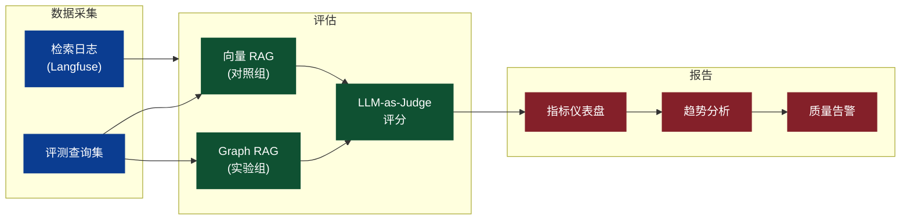
```mermaid
%%{init: {"themeVariables": {"primaryColor": "#0b3d91", "primaryTextColor": "#ffffff"}}}%%
flowchart LR
    subgraph Ingest["数据采集"]
        Log["检索日志<br/>(Langfuse)"]
        Query["评测查询集"]
    end

    subgraph Evaluate["评估"]
        VectorRAG["向量 RAG<br/>(对照组)"]
        GraphRAG["Graph RAG<br/>(实验组)"]
        Judge["LLM-as-Judge<br/>评分"]
    end

    subgraph Report["报告"]
        Metrics["指标仪表盘"]
        Trend["趋势分析"]
        Alert["质量告警"]
    end

    Log --> Evaluate
    Query --> VectorRAG
    Query --> GraphRAG
    VectorRAG --> Judge
    GraphRAG --> Judge
    Judge --> Metrics --> Trend --> Alert

    classDef ingest fill:#0b3d91,stroke:#0b3d91,color:#ffffff
    classDef eval fill:#0f5132,stroke:#0f5132,color:#ffffff
    classDef report fill:#842029,stroke:#842029,color:#ffffff

    class Log,Query ingest
    class VectorRAG,GraphRAG,Judge eval
    class Metrics,Trend,Alert report
```

**A/B 测试框架**：

| 实验组 | 检索方式 | 评估指标 |
| :----- | :------- | :------- |
| Control | 纯向量检索 (pgvector HNSW) | Relevance, Tokens, Latency |
| Treatment-1 | 向量 + 图度加权 (当前 `kg_hybrid_search`) | 同上 |
| Treatment-2 | 向量 + 图 + RRF (Phase 2) | 同上 |
| Treatment-3 | GraphRAG 双层检索 (Phase 3) | 同上 |

### 7.3 KG 健康指标

**实体质量**：

| 指标 | 计算 | 健康阈值 | 告警阈值 |
| :--- | :--- | :------- | :------- |
| 平均置信度 | `AVG(entity_confidence)` | ≥ 0.80 | < 0.60 |
| 类型分布均衡度 | Shannon Entropy of type distribution | > 1.5 | < 1.0 |
| 孤立实体比例 | 无任何关系的实体 / 总实体 | < 20% | > 40% |

**图结构健康**：

| 指标 | 计算 | 说明 |
| :--- | :--- | :--- |
| 图密度 | edges / nodes | 反映知识关联丰富度 |
| 连通分量数 | BFS/DFS 统计 | 理想情况下 1 个大分量 |
| 平均路径长度 | 采样计算 | 较短表示知识关联紧密 |
| 聚类系数 | 三角形计数 / 可能三角形 | 反映知识局部结构化程度 |

**构建管道健康**：

| 指标 | 数据源 | 说明 |
| :--- | :----- | :--- |
| 构建成功率 | `kg_build_runs.status` | completed / total |
| 平均构建时长 | `completed_at - started_at` | 按 corpus 大小归一化 |
| 提取吞吐量 | chunks_processed / duration | chunks/minute |

### 7.4 ROI 计算框架

**成本模型**：

| 成本项 | 计算公式 | 典型值 |
| :----- | :------- | :----- |
| LLM 提取 | chunks × avg_tokens × price_per_token | ~$0.05/chunk (GPT-4o-mini) |
| 存储 | (entities + relations) × avg_row_size | ~$0.01/1K entities/month |
| 计算 | pagerank_time + community_time | ~$0.005/1K entities/run |
| 社区摘要 (Phase 3) | communities × avg_summary_tokens × price | ~$0.10/community |

**收益模型**：

| 收益项 | 量化方式 |
| :----- | :------- |
| 幻觉减少 | grounding_rate_improvement × risk_cost_per_hallucination |
| 回答质量提升 | relevance_score_improvement × user_satisfaction_value |
| Token 节省 | token_reduction_rate × total_tokens × price |
| 人工标注节省 | entity_auto_extraction_count × manual_cost_per_entity |

**盈亏平衡点**：当 `corpus_size > ~500 chunks` 且 `daily_queries > ~50` 时，KG 投入通常在 2-3 个月内回本。

---

## 8. 一核五翼集成架构

### 8.1 知识图谱与五翼的交互

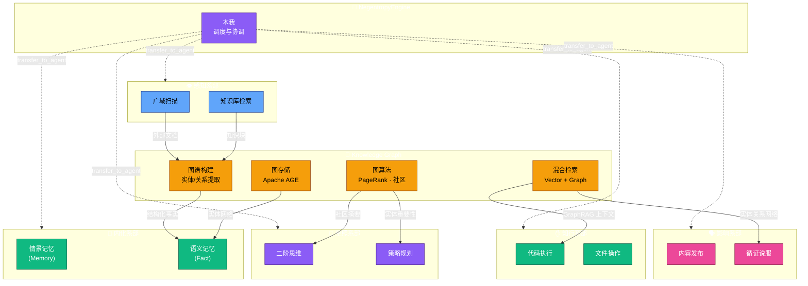
```mermaid
%%{init: {"themeVariables": {"primaryColor": "#0b3d91", "primaryTextColor": "#ffffff", "primaryBorderColor": "#0b3d91", "secondaryColor": "#0f5132", "secondaryTextColor": "#ffffff", "tertiaryColor": "#842029", "tertiaryTextColor": "#ffffff"}}}%%
flowchart TB
    subgraph Root["🔮 NegentropyEngine"]
        Engine["本我<br/>调度与协调"]
    end

    subgraph Perception["👁️ 感知系部"]
        ScanWeb["广域扫描"]
        SearchKB["知识库检索"]
    end

    subgraph KnowledgeGraph["💎 Knowledge Graph"]
        direction TB
        KG_Build["图谱构建<br/>实体/关系提取"]
        KG_Store["图存储<br/>Apache AGE"]
        KG_Algo["图算法<br/>PageRank · 社区"]
        KG_Search["混合检索<br/>Vector + Graph"]
    end

    subgraph Internalization["💎 内化系部"]
        Memory_Ep["情景记忆<br/>(Memory)"]
        Memory_Sem["语义记忆<br/>(Fact)"]
    end

    subgraph Contemplation["🧠 坐照系部"]
        SecondOrder["二阶思维"]
        Strategy["策略规划"]
    end

    subgraph Action["✋ 知行系部"]
        CodeExec["代码执行"]
        FileOps["文件操作"]
    end

    subgraph Influence["🗣️ 影响系部"]
        Publish["内容发布"]
        Convince["循证说服"]
    end

    %% 感知 → 知识图谱
    SearchKB -->|"知识块"| KG_Build
    ScanWeb -->|"外部文档"| KG_Build

    %% 知识图谱 → 内化
    KG_Store -->|"实体网络"| Memory_Sem
    KG_Build -->|"结构化事实"| Memory_Sem

    %% 知识图谱 → 坐照
    KG_Algo -->|"社区摘要"| SecondOrder
    KG_Algo -->|"实体重要性"| Strategy

    %% 知识图谱 → 知行
    KG_Search -->|"GraphRAG 上下文"| CodeExec

    %% 知识图谱 → 影响
    KG_Search -->|"实体关系网络"| Convince

    %% 引擎协调
    Engine -.->|transfer_to_agent| Perception
    Engine -.->|transfer_to_agent| Internalization
    Engine -.->|transfer_to_agent| Contemplation
    Engine -.->|transfer_to_agent| Action
    Engine -.->|transfer_to_agent| Influence

    classDef root fill:#8B5CF6,stroke:#4C1D95,color:#FFF
    classDef perception fill:#60A5FA,stroke:#1E3A8A,color:#000
    classDef kg fill:#F59E0B,stroke:#92400E,color:#000
    classDef wing fill:#10B981,stroke:#065F46,color:#FFF
    classDef thinking fill:#8B5CF6,stroke:#4C1D95,color:#FFF
    classDef influence fill:#EC4899,stroke:#831843,color:#FFF

    class Engine root
    class ScanWeb,SearchKB perception
    class KG_Build,KG_Store,KG_Algo,KG_Search kg
    class Memory_Ep,Memory_Sem wing
    class SecondOrder,Strategy thinking
    class CodeExec,FileOps wing
    class Publish,Convince influence
```

### 8.2 跨模块协同

#### KG × Memory 协同

| 维度 | Knowledge Graph | Memory 模块 |
| :--- | :-------------- | :---------- |
| 记忆类型 | 语义记忆（结构化） | 情景记忆（叙事式） |
| 衰减模型 | 时态关系 `valid_from/to` | Ebbinghaus 遗忘曲线 |
| 访问更新 | 关系 `weight` 增强 | `access_count += 1` |
| 治理模型 | 图谱版本快照 | GDPR 审计日志 |
| 检索方式 | 图遍历 + 向量 | 向量 + 时间衰减 |

**协同场景**：当用户询问"上次我们讨论的那个项目的技术架构"时：
1. Memory 模块通过时间衰减检索最近的讨论情景
2. 从情景中提取"项目名"等实体
3. KG 模块通过实体邻域扩展获取完整技术架构
4. 两者融合提供完整上下文

#### KG × Contemplation 协同

坐照系部的"二阶思维"需要**宏观洞察**——这正是知识图谱社区检测的核心价值：

- **社区摘要** → 领域全景理解（"AI Agent 领域有哪些主要技术流派？"）
- **实体重要性 (PageRank)** → 优先关注核心概念
- **关系路径** → 因果推理链（"A 导致 B，B 导致 C，因此 A 间接影响 C"）

### 8.3 Pipeline 集成点

| 标准流水线 | KG 集成点 | 说明 |
| :--------- | :-------- | :--- |
| **知识获取 (KA)** | 感知 → **KG 构建** → 内化 | 新知识自动触发图谱增量更新 |
| **问题解决 (PS)** | 感知 → 坐照(**KG 检索**) → 知行 → 内化 | GraphRAG 丰富坐照的推理上下文 |
| **价值交付 (VD)** | 感知 → 坐照(**KG 社区摘要**) → 影响 | 社区洞察支撑宏观叙事 |

---

## 9. 实施路线图

### 9.1 时间线总览

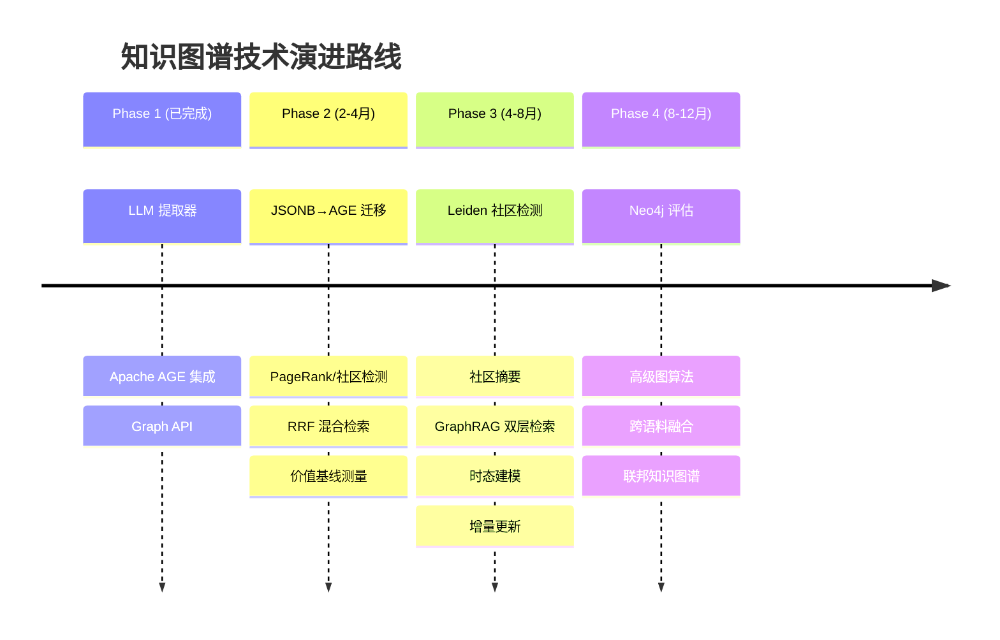
```mermaid
%%{init: {"themeVariables": {"primaryColor": "#0b3d91", "primaryTextColor": "#ffffff"}}}%%
timeline
    title 知识图谱技术演进路线
    section Phase 1 (已完成)
        LLM 提取器 : Apache AGE 集成 : Graph API
    section Phase 2 (2-4月)
        JSONB→AGE 迁移 : PageRank/社区检测 : RRF 混合检索 : 价值基线测量
    section Phase 3 (4-8月)
        Leiden 社区检测 : 社区摘要 : GraphRAG 双层检索 : 时态建模 : 增量更新
    section Phase 4 (8-12月)
        Neo4j 评估 : 高级图算法 : 跨语料融合 : 联邦知识图谱
```

### 9.2 Phase 2: PostgreSQL 深度集成 (2-4 月)

| # | 任务 | 优先级 | 依赖 | 交付物 | 状态 |
| :- | :--- | :----- | :--- | :----- | :--- |
| P2-1 | JSONB 关系迁移到 AGE 图边 | P0 | P1 | 更新 `AgeGraphRepository` | ✅ |
| P2-2 | 实现 Cypher 原生遍历 | P0 | P2-1 | `find_neighbors` via Cypher | ✅ |
| P2-3 | PageRank 实现 | P1 | P2-2 | `kg_pagerank()` SQL/Python | ✅ |
| P2-4 | Louvain 社区检测 | P1 | P2-2 | `GraphService.detect_communities()` | ✅ |
| P2-5 | RRF 混合检索增强 | P1 | P2-2 | 更新 `kg_hybrid_search()` | ✅ |
| P2-6 | Cognee 适配器原型 | P2 | P2-4 | `CogneeAdapter` class | 🔲 |
| P2-7 | 图谱质量仪表盘 | P2 | P2-3 | API + 前端组件 | ✅ |
| P2-8 | 价值量化基线测量 | P1 | P2-5 | A/B 测试基线报告 | 🔲 |

**里程碑**：
- M2.1: JSONB → AGE 迁移完成，Cypher 遍历上线
- M2.2: PageRank + 社区检测就绪，支持实体重要性排序
- M2.3: RRF 混合检索上线，价值基线已建立

### 9.3 Phase 3: GraphRAG 与高级能力 (4-8 月)

| # | 任务 | 优先级 | 依赖 | 交付物 | 理论基础 | 状态 |
| :- | :--- | :----- | :--- | :----- | :------- | :--- |
| P3-1 | Leiden 社区检测 | P1 | P2-4 | 升级社区算法 | Traag et al., 2019<sup>[[15]](#ref15)</sup> | 🔲 |
| P3-2 | 社区摘要管道 | P1 | P3-1 | `kg_community_summaries` 表 + LLM 摘要 | Edge et al., 2024<sup>[[4]](#ref4)</sup> | 🔲 |
| P3-3 | 双层检索 (实体 + 社区) | P1 | P3-2 | `GraphSearchMode.GRAPHRAG` | Edge et al., 2024<sup>[[4]](#ref4)</sup> | 🔲 |
| P3-4 | 时态关系建模 | P2 | P2-1 | `valid_from/to` 字段 + 矛盾检测 | Tripathi et al., 2025<sup>[[6]](#ref6)</sup> | 🔲 |
| P3-5 | 增量图更新 | P1 | P2-1 | Delta-based graph evolution | Hogan et al., 2021<sup>[[1]](#ref1)</sup> §6.3; Kleppmann, 2017<sup>[[17]](#ref17)</sup> §11 | ✅ |
| P3-6 | Neo4j 评估与基准 | P2 | P3-3 | 性能对比报告 | — | 🔲 |
| P3-7 | GraphRAG API 端点 | P1 | P3-3 | `POST /knowledge/graph/rag` | — | 🔲 |
| P3-8 | 矛盾检测与解决 | P2 | P3-4 | 实体冲突解决流程 | — | 🔲 |
| P3-9 | 构建管线健壮性 | P1 | P2-5 | 进度追踪 + 重试 + 警告累积 | Nygard, 2018<sup>[[16]](#ref16)</sup>; Majors, 2022<sup>[[18]](#ref18)</sup> | ✅ |
| P3-10 | 实体语义去重 | P1 | P3-5 | Embedding ANN + 实体合并 | Fellegi & Sunter, 1969<sup>[[20]](#ref20)</sup>; Mudgal et al., 2018<sup>[[22]](#ref22)</sup> | ✅ |
| P3-11 | 图谱查询缓存 | P1 | P3-5 | TTL 缓存 + 确定性失效 | Tanenbaum & Van Steen, 2017<sup>[[24]](#ref24)</sup> | ✅ |
| P3-12 | GraphRAG 上下文组装集成 | P0 | P2-3 | `ContextAssembler._collect_kg_context()` | Edge et al., 2024<sup>[[4]](#ref4)</sup>; Guo et al., 2024<sup>[[5]](#ref5)</sup> | ✅ |
| P3-13 | Agent → KG 三元组双向同步 | P1 | P3-12 | `_sync_triple_to_kg()` 强化模式 | Dong et al., 2014<sup>[[23]](#ref23)</sup>; Hogan et al., 2021<sup>[[1]](#ref1)</sup> §6.3 | ✅ |
| P3-14 | 图谱质量健康指标 | P1 | P2-3 | 孤立率 + Shannon 熵 + 连通分量 + health_score | Farber et al., 2018<sup>[[19]](#ref19)</sup>; Hogan et al., 2021<sup>[[1]](#ref1)</sup> §7 | ✅ |
| P3-15 | 跨语料实体重叠推荐 | P1 | P2-4 | Jaccard 相似度 + 共享实体名称 | Dong et al., 2014<sup>[[23]](#ref23)</sup>; Christen, 2012<sup>[[21]](#ref21)</sup> | ✅ |

**里程碑**：
- M3.1: GraphRAG 双层检索上线（Local + Global Search）
- M3.2: 时态关系与增量更新就绪
- M3.3: Neo4j 评估完成，输出迁移决策报告

### 9.4 Phase 4: 终极成熟 (8-12 月)

| 方向 | 说明 |
| :--- | :--- |
| Neo4j 可选部署 | 依据 Phase 3 评估结论决定 |
| 高级图算法 | Node2Vec、GAT (图注意力网络) |
| 跨语料融合 | 多 Corpus 间的实体链接与关系推断 |
| 联邦知识图谱 | 多租户环境下的图谱隔离与按需融合 |
| 代码知识图谱 | 从代码库提取函数调用图<sup>[[14]](#ref14)</sup>，支撑 Action 系部的精准执行 |

---

## 10. 风险管理与边界控制

### 10.1 风险矩阵

| 风险 | 影响 | 概率 | 阶段 | 缓解措施 |
| :--- | :--- | :--- | :--- | :------- |
| JSONB → AGE 迁移导致数据不一致 | 高 | 中 | Phase 2 | 双写 + 双读过渡期；保留 JSONB 备份 |
| Apache AGE ORDER BY 性能退化 | 中 | 中 | Phase 2 | 应用层排序回退；监控查询执行计划 |
| LLM 提取成本在大语料上爆炸 | 高 | 高 | Phase 2+ | 指数退避 + 队列缓冲；批处理优化；小模型（GPT-4o-mini） |
| 社区检测在小图上效果不佳 | 中 | 中 | Phase 2 | 设置最小图规模阈值（>100 实体） |
| GraphRAG 社区摘要质量参差不齐 | 中 | 中 | Phase 3 | 人工审核 + 置信度阈值 |
| 时态建模增加查询复杂度 | 中 | 低 | Phase 3 | `valid_to IS NULL` 默认过滤；时态查询索引 |
| Neo4j 迁移打破单一事实源 | 高 | 低 | Phase 4 | 保持 PostgreSQL 为关系数据权威源；单向同步 |

### 10.2 回滚策略

| 阶段 | 回滚方案 |
| :--- | :------- |
| Phase 2 | 恢复 JSONB 读取路径；禁用 AGE 遍历功能标志 |
| Phase 3 | 降级 GraphRAG 为 Hybrid 模式；禁用社区摘要 |
| Phase 4 | Neo4j 为可选增强，移除不影响核心功能 |

### 10.3 边缘情况处理

| 边缘情况 | 处理策略 |
| :------- | :------- |
| 空图谱（无实体） | 降级为纯向量检索；API 返回空结果而非错误 |
| 断连组件（多个孤立子图） | 各子图独立计算 PageRank 和社区；检索时跨子图聚合 |
| 循环关系（A→B→A） | AGE Cypher 遍历设置最大深度限制；去重路径节点 |
| 自引用实体（A→A） | 提取阶段过滤；存储阶段约束 CHECK (source_id != target_id) |
| 超大社区（>1000 实体） | 递归细分：对大社区应用更高 resolution 参数 |
| 提取器返回空结果 | 回退到 `RegexEntityExtractor` / `CooccurrenceRelationExtractor` |

---

## 11. 参考文献

<a id="ref1"></a>[1] A. Hogan, E. Blomqvist, M. Cochez, C. d'Amato, G. de Melo, C. Gutierrez, S. Kirrane, J. E. Labra Gayo, R. Navigli, S. Neumaier, A. Ngonga Ngomo, A. Polleres, S. M. Rashid, A. Rula, L. Schmelzeisen, J. Sequeda, S. Staab, and A. Zimmermann, "Knowledge graphs," _ACM Comput. Surv._, vol. 54, no. 4, art. 71, Jul. 2021.

<a id="ref2"></a>[2] S. Ji, S. Pan, E. Cambria, P. Marttinen, and P. S. Yu, "A survey on knowledge graphs: Representation, acquisition, and applications," _IEEE Trans. Neural Netw. Learn. Syst._, vol. 33, no. 2, pp. 494–514, Feb. 2022.

<a id="ref3"></a>[3] Z. Sun, Z.-H. Deng, J.-Y. Nie, and J. Tang, "RotatE: Knowledge graph embedding by relational rotation in complex space," in _Proc. 7th Int. Conf. Learn. Representations (ICLR)_, 2019.

<a id="ref4"></a>[4] D. Edge, H. Trinh, N. Cheng, J. Bradley, A. Chao, A. Mody, S. Truitt, and J. Larson, "From local to global: A graph RAG approach to query-focused summarization," _arXiv preprint arXiv:2404.16130_, 2024.

<a id="ref5"></a>[5] Z. Guo, L. Liang, G. Long, C. Lu, H. Xiong, J. Shan, and D. Han, "LightRAG: Simple and fast retrieval-augmented generation," _arXiv preprint arXiv:2410.05779_, 2024.

<a id="ref6"></a>[6] P. Tripathi, D. Sullivan, A. Levy, P. Katz, and L. Luo, "Zep: A temporal knowledge graph architecture for agent memory," _arXiv preprint arXiv:2501.13956_, 2025.

<a id="ref7"></a>[7] G. V. Cormack, C. L. A. Clarke, and S. Buettcher, "Reciprocal rank fusion outperforms Condorcet and individual rank learning methods," in _Proc. SIGIR_, pp. 758–759, 2009.

<a id="ref8"></a>[8] H. Ebbinghaus, "Memory: A contribution to experimental psychology," _Teachers College, Columbia University_, 1885/1913.

<a id="ref9"></a>[9] E. Gamma, R. Helm, R. Johnson, and J. Vlissides, "Design Patterns: Elements of Reusable Object-Oriented Software," _Addison-Wesley_, 1994.

<a id="ref10"></a>[10] M. Fowler, "Patterns of Enterprise Application Architecture," _Addison-Wesley_, 2002.

<a id="ref11"></a>[11] Apache Software Foundation, "Apache AGE: A graph extension for PostgreSQL," 2024. [Online]. Available: https://age.apache.org/

<a id="ref12"></a>[12] E. Schrödinger, "What is Life? The Physical Aspect of the Living Cell," _Cambridge University Press_, 1944.

<a id="ref13"></a>[13] Cognee AI, "Cognee: AI memory engine documentation," 2025. [Online]. Available: https://docs.cognee.ai/

<a id="ref14"></a>[14] R. Abdalkareem, O. Nourry, S. Wehaibi, S. Mujahid, and E. Shihab, "Application of knowledge graph in software engineering field: A systematic literature review," _Inf. Softw. Technol._, vol. 162, pp. 107030, Oct. 2023.

<a id="ref15"></a>[15] V. A. Traag, L. Waltman, and N. J. van Eck, "From Louvain to Leiden: Guaranteeing well-connected communities," _Sci. Rep._, vol. 9, art. 5233, 2019.

<a id="ref16"></a>[16] M. T. Nygard, *Release It!: Design and Deploy Production-Ready Software*, 2nd ed. Pragmatic Bookshelf, 2018.

<a id="ref17"></a>[17] M. Kleppmann, *Designing Data-Intensive Applications: The Big Ideas Behind Reliable, Scalable, and Maintainable Systems*. O'Reilly Media, 2017.

<a id="ref18"></a>[18] C. Majors, L. Fout, and G. Larkby-Lahet, *Observability Engineering: Achieving Production Excellence*. O'Reilly Media, 2022.

<a id="ref19"></a>[19] M. Farber, F. Bartscherer, C. Menne, and A. Rettinger, "Linked data quality of DBpedia, Freebase, OpenCyc, Wikidata, and YAGO," *Semantic Web*, vol. 9, no. 1, pp. 77–129, 2018.

<a id="ref20"></a>[20] I. P. Fellegi and A. B. Sunter, "A theory for record linkage," *J. Amer. Statist. Assoc.*, vol. 64, no. 328, pp. 1183–1210, 1969.

<a id="ref21"></a>[21] P. Christen, *Data Matching: Concepts and Techniques for Record Linkage, Entity Resolution, and Duplicate Detection*. Springer, 2012.

<a id="ref22"></a>[22] S. Mudgal, H. Li, T. Rekatsinas, A. Doan, Y. Park, G. Krishnan, R. Deep, E. Arcaute, and V. Raghavendra, "Deep learning for entity matching: A design space exploration," in *Proc. ACM SIGMOD*, pp. 19–34, 2018.

<a id="ref23"></a>[23] X. L. Dong, E. Gabrilovich, G. Heitz, W. Horn, N. Lao, K. Murphy, T. Strohmann, S. Sun, and W. Zhang, "Knowledge vault: A web-scale approach to probabilistic knowledge fusion," in *Proc. 20th ACM SIGKDD*, pp. 601–610, 2014.

<a id="ref24"></a>[24] A. S. Tanenbaum and M. Van Steen, *Distributed Systems: Principles and Paradigms*, 3rd ed. Pearson, 2017.

---

## 12. 变更日志

| 日期 | 版本 | 变更内容 | 作者 |
| :--- | :--- | :------- | :--- |
| 2026-02-15 | 1.0 | 初始版本，Phase 1 规划 | Claude |
| 2026-02-15 | 1.1 | Phase 1 实现完成 | Claude |
| 2026-04-08 | 2.0 | **完全重写**：学术基础 (15 篇 IEEE 引用)、行业框架分析 (5 大框架)、两阶段设计 (PostgreSQL → 终极)、价值量化体系、一核五翼集成架构、实施路线图 (Phase 2-4) | Claude |
| 2026-05-02 | 2.1 | Phase 2 状态更新（P2-3 PageRank / P2-4 Louvain / P2-5 RRF 标记已完成）；Phase 3 新增 P3-9 构建管线健壮性 / P3-10 实体语义去重 / P3-11 图谱查询缓存（均已完成）；新增参考文献 [16]-[24] 共 9 条 IEEE 引用 | Claude |
| 2026-05-02 | 2.2 | Phase 3 新增 P3-12 GraphRAG 上下文组装集成 / P3-13 Agent→KG 三元组双向同步 / P3-14 图谱质量健康指标 / P3-15 跨语料实体重叠推荐（均已完成） | Claude |
| 2026-05-02 | 2.3 | **Phase 4 G3 双时态 as-of 时间穿梭检索（已完成）**：Migration 0024 部分索引 + valid_from backfill（最初标记为 0023，后因与 feature/1.x.x 上 `0023_memory_phase4_core_blocks` 撞号顺延为 0024）；Repository/Service/API 全链路 as_of 透传；新增 `GET /graph/timeline`；前端 `TimeTravelSlider`；Cache key 加入 as_of 维度避免脏读 | Claude |
| 2026-05-02 | 2.4 | **Phase 4 G2 Cytoscape.js 交互可视化（已完成）**：新增前端 `GraphCanvas` 组件（cytoscape + cytoscape-fcose）；新增后端 `GET /graph/subgraph` 端点（service 层 BFS 截断；node 排序 跳数 → importance）；page.tsx 渲染引擎切换（Cytoscape vs d3-force）；双击节点触发 1 跳子图增量加载；G3 as_of 在 Cytoscape 路径下保持透传 | Claude |
| 2026-05-02 | 2.5 | **Phase 4 G1 GraphRAG Global Search Map-Reduce（已完成）**：新增 `graph/global_search.py` (GlobalSearchService) — 嵌入查询 → 余弦排序选 top_k 社区摘要 → asyncio.Semaphore(5) 限流 Map 并发 → Reduce 聚合；`community_summarizer.py` 新增可选 `embedding_fn` 入参，落库时同步写入 summary embedding；新增 `POST /base/{cid}/graph/global_search` 端点；前端新增 `GlobalSearchPanel` 卡片（含 evidence 树 + 摘要陈旧度提示） | Claude |
| 2026-05-02 | 2.6 | **Phase 4 G4 Personalized PageRank + Provenance（已完成）**：`graph_algorithms.py` 新增 `compute_personalized_pagerank(seed_entities)` — 偏置 teleport 向量 + dangling node 兜底；新增 `graph/provenance.py` 中 `ProvenanceBuilder` — 反向最短路径 BFS（递归 CTE）+ 三元组组装；Migration 0025 新增 `kg_query_provenance` 审计表（最初标记为 0024，与 0024 重命名联动顺延）；新增 `POST /base/{cid}/graph/multi_hop_reason` 端点（支持 seed 抽取兜底）；前端新增 `EvidenceChainPanel` 卡片（树形展开多跳证据） | Claude |
| 2026-05-03 | 3.0 | **Phase 5 四大缺口修复与增强**：**E1** 增量构建流水线修复（`api.py` chunk dict 补全 `id` 字段）+ Open Relation Type（`CUSTOM` 类型 + `raw_relation_type` 元数据保留，参考 Banko et al., 2007; Gutierrez et al., 2024）；**E2** Leiden 社区检测升级（Traag et al., 2019，保证社区内部连通性）+ 多层级社区摘要（3 级 resolution: 0.5/1.0/2.0，参考 Edge et al., 2024）；**E3** 双写一致性加固（关系同步端点修复、`__import__` 反模式清理、`_TTLCache` LRU 淘汰、`frozen dataclass` `replace()` 修复）；**E4** KG 质量可观测性指标管道（`metrics.py` + `GET /graph/metrics` endpoint + 结构化 build metrics 日志） | Claude |
| 2026-05-04 | 3.1 | **Review & Enhancement**：**G2** 死代码清理（移除 `GraphProcessor` 260 行，修正文档路径引用）；**G3** 图谱质量验证（`quality.py` — 悬空边/孤立节点/社区覆盖率/证据支持率/综合评分，参考 Paulheim, 2017；新增 `GET /graph/quality` 端点）；**G4** Schema 引导实体提取（`extraction_schema.py` — 预置 AI Paper 本体 [8 种实体类型 + 9 种关系类型]，参考 Martinez-Rodriguez et al., 2018；增强 `extractors.py` 支持 schema 约束 prompt）；**G1** 提取 `api_helpers.py` 共享工具函数（为后续完整拆分奠基） | Claude |

---

> **文档维护**：本文档与代码同步演进。架构变更时需同步更新对应章节，保持代码事实与文档描述的一致性。变更遵循 [AGENTS.md](../AGENTS.md) 中的 Verification Before Done 定式。
