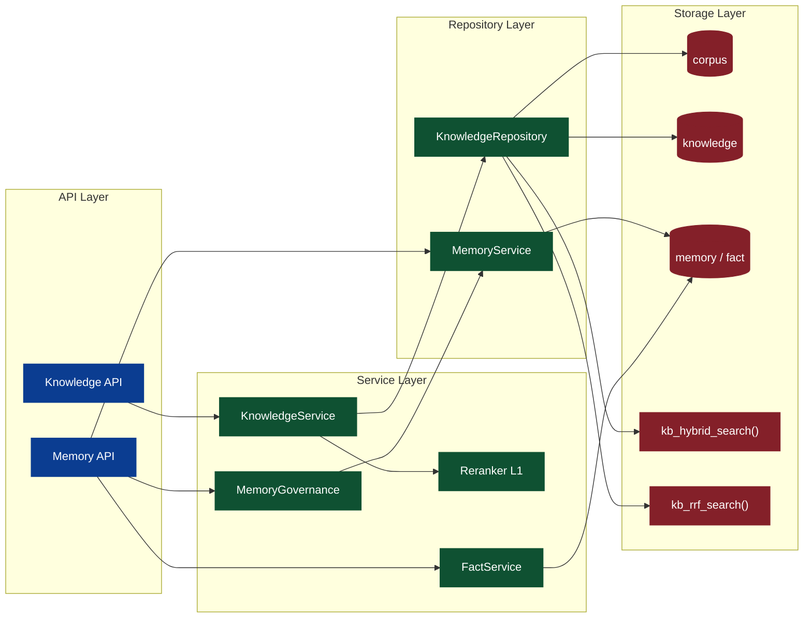
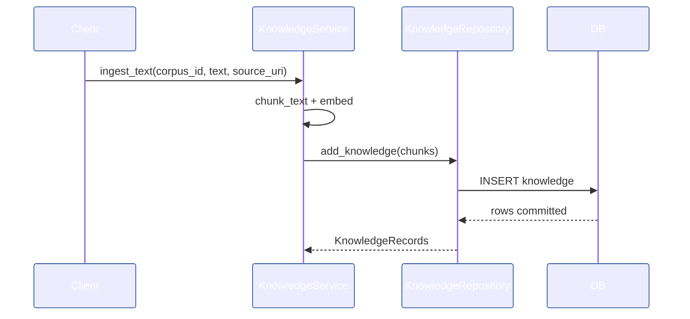
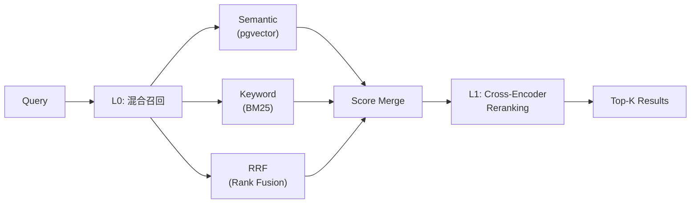

# Knowledge 设计与工程落地（Knowledge Base / Knowledge Graph / User Memory）

> 目标：在最小干预前提下，围绕 Perception 的 Knowledge 存储模型，落地可演进的 Knowledge 后端工程方案，并为 UI 的未来扩展预留稳定接口与流程入口。

## 0. 范围与事实源（Single Source of Truth）

- **底层存储模型**：[apps/negentropy/src/negentropy/models/perception.py](../apps/negentropy/src/negentropy/models/perception.py)（`Corpus` / `Knowledge`）。
- **Memory 模型**：[apps/negentropy/src/negentropy/models/internalization.py](../apps/negentropy/src/negentropy/models/internalization.py)（`Memory` / `Fact` / `MemoryAuditLog`）。
- **数据库权威定义**：[docs/schema/perception_schema.sql](./schema/perception_schema.sql)（`corpus` / `knowledge` 表、索引、触发器、`kb_hybrid_search` / `kb_rrf_search`）。
- **前端扩展约束**：[docs/negentropy-ui-plan.md](./negentropy-ui-plan.md) 的「11. 未来扩展：知识库/知识图谱/用户记忆管理」。
- **调研文档**：[034-knowledge-base.md](https://github.com/ThreeFish-AI/agentic-ai-cognizes/blob/master/docs/research/034-knowledge-base.md)、[035-knowledge-base-platform.md](https://github.com/ThreeFish-AI/agentic-ai-cognizes/blob/master/docs/research/035-knowledge-base-platform.md)。
- **设计文档**：[020-the-hippocampus.md](https://github.com/ThreeFish-AI/agentic-ai-cognizes/blob/master/docs/design/020-the-hippocampus.md)（Memory 遗忘曲线设计）。

## 1. 目标与边界

- **Knowledge Base**：可索引、可检索的静态知识块（文档/FAQ/配置/操作手册）。共享、持久、不受遗忘曲线影响。
- **Knowledge Graph**：基于 Knowledge Base 的抽取结果，提供实体与关系视角。使用 Strategy Pattern 支持可替换的抽取策略。
- **User Memory**：面向用户的长期记忆治理。动态、个人化、受遗忘曲线影响、支持 GDPR 审计。
- **原则**：严格复用现有模型与 DB Schema，新增逻辑仅围绕"索引 → 检索 → 回滚/更新"闭环。

> **Knowledge 与 Memory 的本质区别**：
>
> | 维度     | Knowledge Base                    | User Memory                     |
> | -------- | --------------------------------- | ------------------------------- |
> | 性质     | 静态文档                          | 动态记忆                        |
> | 归属     | 共享（按 Corpus）                 | 个人（按 User）                 |
> | 生命周期 | 持久存在                          | 遗忘曲线衰减                    |
> | 治理     | 版本控制                          | 审计（Retain/Delete/Anonymize） |
> | 检索     | 混合检索（Semantic + BM25 + RRF） | 语义 + 时间衰减                 |

## 2. 领域模型与职责拆分

- **Corpus**：知识库容器（按 app_name + name 唯一），承载检索与索引策略配置。
- **Knowledge**：可检索知识块，包含内容、向量、来源与 metadata。
- **Knowledge Graph**：实体/关系/证据三元组，通过 Strategy Pattern 支持多种抽取策略（正则/LLM）。
- **Memory**：面向用户的情景记忆（Episodic Memory），受遗忘曲线影响，支持 `TimestampMixin` 追踪更新。
- **Fact**：面向用户的语义记忆（Semantic Memory），结构化键值对，同样支持审计治理。
- **MemoryAuditLog**：审计日志，支持幂等性和版本控制。

> 采用 Service + Repository 分层隔离持久化细节，降低后续 Graph/Memory 接入成本。<sup>[[1]](#ref1)</sup>

## 3. 系统架构（后端落地）



## 4. 存储模型映射

- **Corpus**：`corpus(app_name, name, description, config)`
- **Knowledge**：`knowledge(corpus_id, app_name, content, embedding, source_uri, chunk_index, metadata)`
- **索引**：HNSW 向量索引 + GIN 全文索引 + JSONB 索引（见 [docs/schema/perception_schema.sql](./schema/perception_schema.sql)）。

## 5. 核心流程

### 5.1 Ingestion（索引构建）

1. `Corpus` 选择/创建
2. 文本分块（Chunking）
3. 向量化（Embedding）
4. 批量写入 `knowledge`
5. 触发器更新 `search_vector`



### 5.2 Retrieval（两阶段检索）

采用 **L0 Recall + L1 Reranking** 两阶段检索架构<sup>[[3]](#ref3)</sup>：

**L0 召回阶段**（四种模式）:

- **Semantic**：向量距离排序（`embedding <=> query_embedding`）
- **Keyword**：`search_vector` + BM25 (`ts_rank_cd`)
- **Hybrid**：语义 + 关键词加权融合（`semantic_weight * semantic_score + keyword_weight * keyword_score`）
- **RRF** (Reciprocal Rank Fusion)：对分数尺度不敏感的排名融合算法，公式 `RRF(d) = Σ 1/(k + rank)`<sup>[[4]](#ref4)</sup>

**L1 精排阶段**:

- 使用 Cross-Encoder 对 L0 结果进行精排
- 支持 `LocalReranker`（BGE-Reranker）、`APIReranker`（Cohere）、`CompositeReranker`（多级回退）
- 默认使用 `NoopReranker` 确保向后兼容



## 6. 工程落地（本次实现）

### 6.1 模块结构

**Knowledge 模块** (`negentropy.knowledge`):

- [types.py](../apps/negentropy/src/negentropy/knowledge/types.py) - 领域类型（SearchMode, ChunkingConfig, SearchConfig, GraphNode/Edge 等）
- [chunking.py](../apps/negentropy/src/negentropy/knowledge/chunking.py) - 文本分块（Fixed/Recursive/Semantic 三种策略）
- [repository.py](../apps/negentropy/src/negentropy/knowledge/repository.py) - 数据访问（CRUD + 四种检索模式），使用 `NEGENTROPY_SCHEMA` 常量
- [service.py](../apps/negentropy/src/negentropy/knowledge/service.py) - 业务逻辑（Ingestion + Search + L1 Reranking 集成）
- [api.py](../apps/negentropy/src/negentropy/knowledge/api.py) - REST API（Dashboard/Base CRUD/Graph/Pipelines）
- [embedding.py](../apps/negentropy/src/negentropy/knowledge/embedding.py) - 向量化（支持指数退避重试 + 超时控制）
- [reranking.py](../apps/negentropy/src/negentropy/knowledge/reranking.py) - L1 精排（Noop/Local/API/Composite 四种策略）
- [graph.py](../apps/negentropy/src/negentropy/knowledge/graph.py) - 知识图谱（Strategy Pattern: EntityExtractor/RelationExtractor）
- [dao.py](../apps/negentropy/src/negentropy/knowledge/dao.py) - 运行记录 DAO（Graph/Pipeline Run，DRY 重构）
- [exceptions.py](../apps/negentropy/src/negentropy/knowledge/exceptions.py) - 统一异常体系
- [constants.py](../apps/negentropy/src/negentropy/knowledge/constants.py) - 常量定义

**Memory 模块** (`negentropy.engine`):

- [engine/api.py](../apps/negentropy/src/negentropy/engine/api.py) - Memory REST API（独立于 Knowledge API，提供 Dashboard/Timeline/Facts/Search/Audit 端点）
- [engine/governance/memory.py](../apps/negentropy/src/negentropy/engine/governance/memory.py) - 记忆治理（审计决策 + 遗忘曲线 + GDPR）
- [engine/adapters/postgres/memory_service.py](../apps/negentropy/src/negentropy/engine/adapters/postgres/memory_service.py) - 记忆存储（混合检索 + 访问计数追踪）
- [engine/adapters/postgres/fact_service.py](../apps/negentropy/src/negentropy/engine/adapters/postgres/fact_service.py) - 事实存储
- [engine/factories/memory.py](../apps/negentropy/src/negentropy/engine/factories/memory.py) - 工厂
- [engine/summarization.py](../apps/negentropy/src/negentropy/engine/summarization.py) - 会话摘要（从 knowledge/ 迁移至此）

**Models**:

- [models/perception.py](../apps/negentropy/src/negentropy/models/perception.py) - Corpus / Knowledge ORM
- [models/internalization.py](../apps/negentropy/src/negentropy/models/internalization.py) - Memory / Fact / MemoryAuditLog ORM（含 TimestampMixin）
- [models/base.py](../apps/negentropy/src/negentropy/models/base.py) - `NEGENTROPY_SCHEMA`, `TimestampMixin`, `UUIDMixin`

### 6.2 关键职责

- **KnowledgeRepository**：对 `Corpus/Knowledge` 的 CRUD + 四种检索模式（Semantic/Keyword/Hybrid/RRF）。SQL 调用统一使用 `NEGENTROPY_SCHEMA` 常量。
- **KnowledgeService**：编排 ingestion 与检索策略，集成 L1 Reranking（默认 `NoopReranker`），提供扩展点（chunking/embedding/reranker）。
- **MemoryGovernanceService**：记忆审计（Retain/Delete/Anonymize）+ 遗忘曲线计算（指数衰减模型）。审计操作同时覆盖 Memory 和关联 Fact（GDPR 合规）。
- **PostgresMemoryService**：记忆混合检索 + 访问计数自动更新（`access_count += 1`, `last_accessed_at = now()`），使遗忘曲线动态生效。
- **GraphProcessor**：知识图谱构建，委托 `EntityExtractor` / `RelationExtractor`（Strategy Pattern），便于从正则方案迁移到 LLM 方案。
- **ChunkingConfig/SearchConfig**：将策略参数显式化，避免散落在调用侧。<sup>[[1]](#ref1)</sup>
- **Knowledge API**：提供 Dashboard/Base CRUD（含 DELETE 级联删除）/Graph/Pipelines 入口，对齐 UI 结构。
- **Embedding 模块**：内置指数退避重试（max_retries=3, backoff=exponential）和超时控制（30s），通过 `EmbeddingFailed` 异常上报。

### 6.3 异常处理体系

**异常层次结构**（正交分解）：

```
KnowledgeError
├── DomainError
│   ├── CorpusNotFound - 语料库不存在 (404)
│   ├── KnowledgeNotFound - 知识块不存在 (404)
│   └── VersionConflict - 版本冲突 (409)
├── InfrastructureError
│   ├── EmbeddingFailed - 向量化失败 (500)
│   ├── SearchError - 检索失败 (500)
│   └── DatabaseError - 数据库错误 (500)
└── ValidationError
    ├── InvalidChunkSize - 无效分块大小 (400)
    ├── InvalidSearchConfig - 无效搜索配置 (400)
    └── InvalidMetadata - 无效元数据 (400)
```

**HTTP 状态码映射**：

- `400 Bad Request`: 参数验证失败
- `404 Not Found`: 资源不存在
- `409 Conflict`: 版本冲突
- `500 Internal Server Error`: 基础设施错误

### 6.4 性能优化

**批量插入优化**：

- 使用 PostgreSQL 原生 `INSERT` 批量插入
- 替代逐条 ORM 操作，预期提升 3-5 倍写入性能

**混合检索优化**：

- 优先使用数据库原生 `kb_hybrid_search()` 函数
- 自动降级到 Python 端混合检索（回退方案）
- 预期减少 20% 检索延迟

### 6.5 配置验证

**ChunkingConfig 验证规则**：

- `chunk_size`: 1 ~ 100000
- `overlap`: 0 ~ chunk_size \* 0.5
- `preserve_newlines`: true/false

**SearchConfig 验证规则**：

- `mode`: 'semantic' | 'keyword' | 'hybrid' | 'rrf'
- `limit`: 1 ~ 1000
- `semantic_weight`, `keyword_weight`: 0.0 ~ 1.0
- `rrf_k`: 平滑常数（默认 60），仅用于 RRF 模式

## 7. Memory 治理与遗忘曲线

### 7.1 遗忘曲线模型

基于 Ebbinghaus 遗忘曲线<sup>[[5]](#ref5)</sup>的指数衰减模型：

```
retention_score = min(1.0, time_decay × frequency_boost / 5.0)
time_decay = e^(-λ × days_elapsed)
frequency_boost = 1 + ln(1 + access_count)
```

- `λ`（衰减常数）：默认 0.1，可自定义。值越大衰减越快。
- `days_elapsed`：距最后访问的天数。
- `access_count`：累计访问次数。频率因子使用对数增长，避免高频访问过度膨胀分数。
- 分数范围：[0.0, 1.0]。

**典型衰减曲线**（λ=0.1, access_count=0）:

| days | time_decay | retention_score |
| ---- | ---------- | --------------- |
| 0    | 1.00       | 0.20            |
| 7    | 0.50       | 0.10            |
| 14   | 0.25       | 0.05            |
| 30   | 0.05       | 0.01            |

### 7.2 访问计数追踪

检索记忆时自动记录访问行为，使遗忘曲线动态生效：

```python
# search_memory() 返回结果后，异步更新被召回记忆
UPDATE memories SET
    access_count = access_count + 1,
    last_accessed_at = now()
WHERE id IN (recalled_memory_ids);
```

### 7.3 审计决策

Memory 和关联 Fact 同步处理，确保 GDPR 合规：

- **Retain**：保留记忆，不做操作。
- **Delete**：物理删除 Memory + 关联 Fact（通过 thread_id 关联）。
- **Anonymize**：Memory 内容替换为 `[ANONYMIZED]`，清除 embedding 和 metadata；Fact 值替换为 `{"anonymized": True}`，清除 embedding。

### 7.4 版本控制与幂等性

- 乐观锁：`expected_versions` 参数用于检测版本冲突。
- 幂等性键：`idempotency_key` 防止重复提交。
- 审计历史：每次决策创建 `MemoryAuditLog` 记录。

## 8. 扩展点与策略接口

- **EntityExtractor**（ABC）：实体提取策略。当前实现 `RegexEntityExtractor`（正则），预留 `LLMEntityExtractor` 接口。
- **RelationExtractor**（ABC）：关系提取策略。当前实现 `CooccurrenceRelationExtractor`（共现），预留 `LLMRelationExtractor` 接口。
- **Reranker**（ABC）：L1 精排策略。已实现 `NoopReranker` / `LocalReranker` (BGE) / `APIReranker` (Cohere) / `CompositeReranker`（多级回退）。
- **Pipeline Jobs**：支持"全量重建 / 增量更新 / 回滚"，与 UI 的 Pipelines 视图对齐。DAO 层已消除重复代码（通用 `_upsert_run()` 方法）。

## 9. 可观测与反馈闭环

- **日志**：ingestion 起止、chunk 数量、写入耗时。
- **指标**：检索命中率、向量检索耗时、索引失败数。
- **验证**：最小回归（写入 + 检索 + 回滚）。

### 9.1 结构化日志

**索引流程日志**：

```python
logger.info("ingestion_started",
            corpus_id=str(corpus_id),
            app_name=app_name,
            text_length=len(text),
            source_uri=source_uri,
            chunk_size=config.chunk_size,
            overlap=config.overlap)

logger.info("chunks_created",
            corpus_id=str(corpus_id),
            chunk_count=len(chunks))

logger.info("embeddings_attached",
            corpus_id=str(corpus_id),
            chunk_count=len(chunks))

logger.info("ingestion_completed",
            corpus_id=str(corpus_id),
            record_count=len(records))
```

**检索流程日志**：

```python
logger.info("search_started",
            corpus_id=str(corpus_id),
            app_name=app_name,
            mode=config.mode,
            limit=config.limit,
            query_preview=query[:100])

logger.info("search_completed",
            corpus_id=str(corpus_id),
            mode=config.mode,
            semantic_count=len(semantic_matches),
            keyword_count=len(keyword_matches),
            merged_count=len(results))
```

### 9.2 错误追踪

**API 层错误日志**：

```python
logger.warning("corpus_not_found", details=exc.details)
logger.warning("version_conflict", details=exc.details)
logger.warning("validation_error", details=exc.details)
logger.error("infrastructure_error", details=exc.details)
logger.error("database_error", details=exc.details)
```

### 9.3 性能监控

**关键指标**：

- 索引速度: chunks/秒
- 搜索延迟: P95 < 100ms
- 向量化延迟: P95 < 500ms
- 数据库查询延迟: P95 < 50ms

**监控集成**：

- Langfuse 追踪（利用现有 `ObservabilitySettings`）
- Prometheus 指标（可选）
- 结构化日志解析（Elasticsearch/Loki）

## 10. 风险与边界控制

- **向量模型变更**：不同 embedding 维度需隔离或重建 corpus。
- **检索漂移**：混合检索权重需可配置化并可回滚。
- **元数据污染**：`metadata` 需严格约束 schema 与来源。
- **Embedding API 不稳定**：已内置指数退避重试（3 次）和超时控制（30s），通过 `EmbeddingFailed` 异常上报。
- **SQL 注入**：Memory 混合检索的 embedding 参数已改为参数化绑定（非字符串拼接），并统一使用 schema 前缀。

## 参考文献

<a id="ref1"></a>[1] E. Gamma, R. Helm, R. Johnson, and J. Vlissides, "Design Patterns: Elements of Reusable Object-Oriented Software," _Addison-Wesley Professional_, 1994.

<a id="ref2"></a>[2] P. Lewis et al., "Retrieval-Augmented Generation for Knowledge-Intensive NLP Tasks," arXiv:2005.11401, 2020.

<a id="ref3"></a>[3] N. Reimers and I. Gurevych, "Sentence-BERT: Sentence Embeddings using Siamese BERT-Networks," _arXiv preprint arXiv:1908.10084_, 2019.

<a id="ref4"></a>[4] G. V. Cormack, C. L. A. Clarke, and S. Buettcher, "Reciprocal Rank Fusion outperforms Condorcet and individual Rank Learning Methods," _SIGIR'09_, 2009.

<a id="ref5"></a>[5] H. Ebbinghaus, "Memory: A Contribution to Experimental Psychology," _Teachers College, Columbia University_, 1885/1913.

## 11. Knowledge System User Guide (知识系统指南)

本节详细介绍 Knowledge Base 与 Knowledge Graph 的核心功能特性与用户操作流程。

### 11.1 Knowledge Base (知识库管理)

> [!IMPORTANT]
> **Authentication Required**: Knowledge 系统受 RBAC 保护。
>
> - **View**: 所有已认证用户可查看公共知识库。
> - **Edit**: 仅 `admin` 或 `knowledge_manager` 角色可创建/更像语料库。

作为静态知识的容器，支持对非结构化文档的**索引 (Indexing)**、**更新 (Upsert)** 与**混合检索 (Hybrid Search)**。

#### 11.1.1 功能特性 (Features)

- **Corpus (语料库)**：知识的逻辑边界（Namespace）。每个 Corpus 拥有独立的配置策略，物理上隔离检索范围。
- **Chunking Strategies (切片策略)**：
  - **Fixed Size**: 按固定字符数切分（如 `1000 chars`），简单高效。
  - **Recursive**: 递归字符切分（按段落 `\n\n` -> 句子 `.` -> 词 ），保持语义连贯性。
  - **Semantic**: 基于 Embedding 相似度突变点进行切分，聚合语义相似的段落。
- **Embedding Models**:
  - 默认模型：`vertex_ai/text-embedding-005` (768维/1536维)，平衡性能与成本。
  - 备选模型：`openai/text-embedding-3-small`。
- **Retrieval Modes (检索模式)**：
  - **Semantic**: 向量余弦相似度（Cosine Similarity），召回语义相关。
  - **Keyword**: BM25 关键词匹配，召回精确匹配（如错误码、专有名词）。
  - **Hybrid**: 加权融合（Weighted Sum），$Score = W_s \cdot S_{semantic} + W_k \cdot S_{keyword}$。
  - **RRF**: 倒数排名融合（Reciprocal Rank Fusion），无需调参即可获得稳健结果。

#### 11.1.2 操作步骤 (Operation Steps)

**1. 创建语料库 (Create Corpus)**

1. 进入 **Knowledge Base** 页面。
2. 在左侧 "Sources" 栏点击 **Create** 按钮。
3. 填写表单：
   - `Name`: 唯一标识符（如 `product-manuals-v1`）。
   - `Description`: 描述用途。
   - `Config`: 可选 JSON 配置（如 `{"chunk_size": 1000, "overlap": 200}`）。
4. 点击确认，系统将初始化 Corpus 容器。

**2. 索引文档 (Ingest Content)**

1. 在左侧列表选中目标 Corpus。
2. 右侧 **Ingest Panel** 面板：
   - `Source URI`: 输入文档的唯一标识（如 `manuals/en/deploy.md`）。
   - `Text`: 粘贴文档全文内容。
3. 点击 **Ingest**（追加模式）或 **Replace**（覆盖模式）。
   - _Replace_: 原子性执行 `DELETE WHERE source_uri = ?` + `INSERT`，防止数据残留。

**3. 检索测试 (Search & Debug)**

1. 在 **Search Workspace** 区域输入 Query。
2. 选择检索模式（Semantic / Keyword / Hybrid / RRF）。
3. 点击 **Search**，观察：
   - 召回的 Chunks 内容。
   - `Score` 分布（Semantic Score vs Keyword Score）。
   - `Metadata` 字段信息。

**4. 编辑语料库 (Edit Corpus)**

1. 在 Corpus 列表项右侧点击 **更多操作** (三点图标)。
2. 选择 **编辑配置**。
3. 修改 `Name`, `Description` 或 `Config` (Chunk Size, Overlap 等)。
4. 点击 **Save** 保存更改。
   - **注意**: 修改 Chunking Config 不会自动重新索引现有文档，仅对新 ingestion 生效。如需应用新配置，请重新 ingest 文档。

**5. 删除语料库 (Delete Corpus)**

1. 在 Corpus 列表项右侧点击 **更多操作** (三点图标)。
2. 选择 **删除数据源**。
3. 在确认对话框中点击 **Delete**。
4. **警告**: 此操作为**级联删除**，将物理删除该 Corpus 下所有 Knowledge Chunks 及索引数据，不可恢复。

### 11.2 Knowledge Graph (知识图谱)

提供实体（Entity）与关系（Relation）的动态可视化视图，支持人工审查与版本快照。

#### 11.2.1 功能特性 (Features)

- **Force-Directed Layout**: 使用 D3.js 力导向图算法，自动布局实体节点，展现聚类结构。
- **Interactive Editing**: 支持拖拽节点固定位置（Pinning），调整布局以获得最佳可视效果。
- **Versioned Snapshots**: 图谱状态并非实时覆盖，而是以 `GraphRun` (Version) 形式保存快照，支持回滚。

#### 11.2.2 操作步骤 (Operation Steps)

**1. 查看图谱 (Visualization)**

1. 进入 **Knowledge Graph** 页面。
2. 系统自动加载最新的图谱快照 (Latest Version)。
3. **交互操作**:
   - **Zoom/Pan**: 滚轮缩放，按住左键拖拽画布。
   - **Drag Node**: 拖拽节点可将其位置固定（fx/fy），再次点击释放固定。
   - **Click Node**: 点击节点，右侧面板显示实体详细属性（Label, Type, Description）。

**2. 保存快照 (Snapshot & Write-back)**

1. 完成布局调整或实体确认后。
2. 点击右上角 **"写回图谱" (Upsert Graph)** 按钮。
3. 系统将当前图谱状态（Nodes + Edges + Layout）保存为新的 version。
4. 在右侧 **"Build Runs"** 列表中可见新增的记录。

### 11.3 Pipelines (系统监控)

监控 Knowledge 系统内部的异步任务流转状态。

- **Pipeline Runs**: 查看 Ingestion, Graph Extraction, Memory Sync 等后台任务。
- **Status**:
  - `Running`: 任务执行中（黄色）。
  - `Completed`: 执行成功（绿色）。
  - `Failed`: 执行失败（红色），点击可查看 Error Stack Trace。
- **Alerts**: 系统自动捕获的异常（如 Embedding API Rate Limit, DB Connection Timeout）。

## 12. Memory System User Guide (记忆系统指南)

面向 User ID 的长期记忆审计与动态干预面板，包含 Episodic Memory (Timeline) 与 Semantic Memory (Facts) 双重视图。

### 12.1 Dashboard (记忆概览)

> [!NOTE]
> **Admin Access**: 管理员 (`admin` 角色) 可查看任意用户的 Memory Dashboard 以进行审计与合规检查。普通用户仅能查看自己的数据。

#### 12.1.1 功能特性 (Features)

- **Metrics**: 全局统计，包括 User Count, Memory Count, Fact Count 及平均 Retention Score。
- **Retention Alert**: "Low Retention" 指标，识别即将遗忘的关键记忆，便于人工干预。
- **User Filtering**: 支持按 `User ID` 筛选，查看特定用户的完整记忆轨迹。

#### 12.1.2 操作步骤 (Operation Steps)

1. 进入 **Memory System** -> **Dashboard**。
2. 观察顶部 **Metrics Cards** 了解系统整体记忆健康度。
3. 在搜索栏输入目标 `User ID` 并回车，面板数据将刷新为该用户的专属视图。

### 12.2 Memory Audit (行为审计)

#### 12.2.1 功能特性 (Features)

- **Audit Queue**: 待审列表，优先展示低置信度或低 Retention Score 的记忆片段。
- **Governance Actions**: 符合 GDPR 的治理操作：
  - **Retain**: 确认保留（提升 Retention Score 至 1.0）。
  - **Delete**: 物理删除 Memory + 关联 Fact。
  - **Anonymize**: 匿名化处理（保留统计价值但移除 PII）。

#### 12.2.2 操作步骤 (Operation Steps)

1. 切换至 **Audit** 标签页。
2. 选中一条待审记忆（Memory Item）。
3. 阅读 Content 与 Context。
4. 点击底部操作按钮 (**Retain** / **Delete** / **Anonymize**)。
5. 系统自动生成 `MemoryAuditLog` 记录操作。

### 12.3 Facts Management (事实管理)

#### 12.3.1 功能特性 (Features)

- **Semantic View**: 查看从对话中提取的结构化事实（如 User Preferences, Biographical Info）。
- **Validity Period**: 每个 Fact 包含 `valid_from` 与 `valid_until`，支持时效性管理。

#### 12.3.2 操作步骤 (Operation Steps)

1. 切换至 **Facts** 标签页。
2. 浏览 Key-Value 列表。
3. 如发现错误事实，点击 **Edit** 修正 Value 或 **Delete** 移除。
4. 修改立即生效，并同步影响下游 Agent 的 Context。

### 12.4 Timeline (时间轴视图)

#### 12.4.1 功能特性 (Features)

- **Chronological View**: 按时间倒序展示用户的交互 Memory 片段。
- **Access Tracking**: 显示每次记忆的 `Access Count` 与 `Last Accessed` 时间，直观展示遗忘曲线效果。

#### 12.4.2 操作步骤 (Operation Steps)

1. 切换至 **Timeline** 标签页。
2. 滚动浏览用户的历史记忆流。
3. 悬停在某条 Memory 上，查看其 Embedding 维度信息或原始来源。

## 13. 测试覆盖

### 13.1 单元测试

```bash
cd apps/negentropy
uv run pytest tests/unit_tests/knowledge/ -v        # Knowledge 模块
uv run pytest tests/unit_tests/engine/ -v            # Memory 治理
```

- **Knowledge**: chunking / types / reranking 测试
- **Memory Governance**: 遗忘曲线（新鲜记忆/高频访问/长期未访问/指数衰减公式/边界值/自定义 λ）

### 13.2 集成测试（需要 PostgreSQL）

```bash
uv run pytest tests/integration_tests/knowledge/ -v
uv run pytest tests/integration_tests/engine/adapters/postgres/ -v
```
