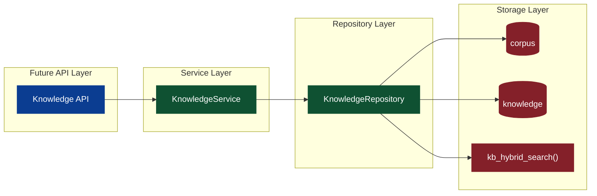
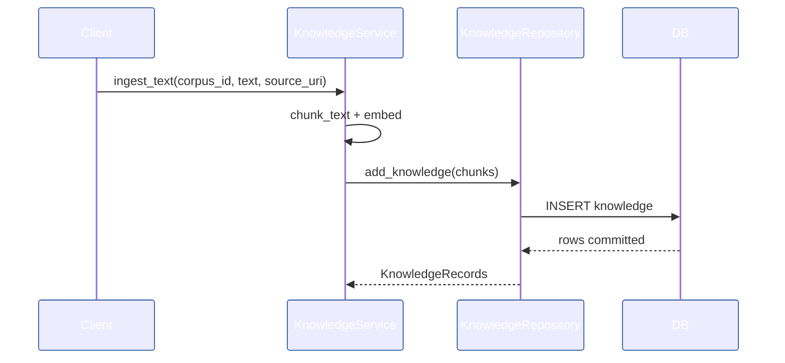

# Knowledge 设计与工程落地（Knowledge Base / Knowledge Graph / User Memory）

> 目标：在最小干预前提下，围绕 Perception 的 Knowledge 存储模型，落地可演进的 Knowledge 后端工程方案，并为 UI 的未来扩展预留稳定接口与流程入口。

## 0. 范围与事实源（Single Source of Truth）

- **底层存储模型**：[apps/negentropy/src/negentropy/models/perception.py](../apps/negentropy/src/negentropy/models/perception.py)（`Corpus` / `Knowledge`）。
- **数据库权威定义**：[docs/schema/perception_schema.sql](./schema/perception_schema.sql)（`corpus` / `knowledge` 表、索引、触发器、`kb_hybrid_search`）。
- **前端扩展约束**：[docs/negentropy-ui-plan.md](./negentropy-ui-plan.md) 的「11. 未来扩展：知识库/知识图谱/用户记忆管理」。

## 1. 目标与边界

- **Knowledge Base**：可索引、可检索的静态知识块（文档/FAQ/配置/操作手册）。
- **Knowledge Graph**：基于 Knowledge Base 的抽取结果，提供实体与关系视角（本次仅设计，不实现）。
- **User Memory**：面向用户的长期记忆治理（本次仅设计，不实现）。
- **原则**：严格复用现有模型与 DB Schema，新增逻辑仅围绕“索引 → 检索 → 回滚/更新”闭环。

## 2. 领域模型与职责拆分

- **Corpus**：知识库容器（按 app_name + name 唯一），承载检索与索引策略配置。
- **Knowledge**：可检索知识块，包含内容、向量、来源与 metadata。
- **Knowledge Graph**：实体/关系/证据三元组的抽象（保留接口，不落地存储）。
- **User Memory**：面向用户的可治理记忆片段（与 `Memory` 模型协作）。

> 采用 Service + Repository 分层隔离持久化细节，降低后续 Graph/Memory 接入成本。[[1]](#ref1)

## 3. 系统架构（后端落地）

## 4. 存储模型映射

- **Corpus**：`corpus(app_name, name, description, config)`
- **Knowledge**：`knowledge(corpus_id, app_name, content, embedding, source_uri, chunk_index, metadata)`
- **索引**：HNSW 向量索引 + GIN 全文索引 + JSONB 索引（见 [docs/schema/perception_schema.sql](./schema/perception_schema.sql)）。

## 5. 核心流程

### 5.1 Ingestion（索引构建）

1. `Corpus` 选择/创建
2. 文本分块（Chunking）
3. 向量化（Embedding）
4. 批量写入 `knowledge`
5. 触发器更新 `search_vector`

### 5.2 Retrieval（检索）

- **Semantic**：向量距离排序（`embedding <=> query_embedding`）
- **Keyword**：`search_vector` + BM25 (`ts_rank_cd`) 
- **Hybrid**：语义 + 关键词加权融合（后端合并，未来可切换到 `kb_hybrid_search`）[[2]](#ref2)

## 6. 工程落地（本次实现）

### 6.1 模块结构

- [apps/negentropy/src/negentropy/knowledge/__init__.py](../apps/negentropy/src/negentropy/knowledge/__init__.py)
- [apps/negentropy/src/negentropy/knowledge/types.py](../apps/negentropy/src/negentropy/knowledge/types.py)
- [apps/negentropy/src/negentropy/knowledge/chunking.py](../apps/negentropy/src/negentropy/knowledge/chunking.py)
- [apps/negentropy/src/negentropy/knowledge/repository.py](../apps/negentropy/src/negentropy/knowledge/repository.py)
- [apps/negentropy/src/negentropy/knowledge/service.py](../apps/negentropy/src/negentropy/knowledge/service.py)
- [apps/negentropy/src/negentropy/knowledge/api.py](../apps/negentropy/src/negentropy/knowledge/api.py)
- [apps/negentropy-ui/app/api/knowledge](../apps/negentropy-ui/app/api/knowledge)（BFF 代理层）

### 6.2 关键职责

- **KnowledgeRepository**：对 `Corpus/Knowledge` 的 CRUD + 检索（语义/关键词）。
- **KnowledgeService**：编排 ingestion 与检索策略，提供扩展点（chunking/embedding）。
- **ChunkingConfig/SearchConfig**：将策略参数显式化，避免散落在调用侧。[[1]](#ref1)
- **Knowledge API**：提供 Dashboard/Base/Graph/Memory/Pipelines 入口，对齐 UI 结构（见 [apps/negentropy/src/negentropy/knowledge/api.py](../apps/negentropy/src/negentropy/knowledge/api.py)）。 
- **Embedding 配置**：沿用 LLM 配置域扩展（见 [apps/negentropy/src/negentropy/config/llm.py](../apps/negentropy/src/negentropy/config/llm.py)），支持独立 embedding model。 

## 7. 扩展点（为 Graph/Memory 预留）

- **Graph Builder**：将 `Knowledge` → 实体/关系/证据（抽取模型可替换）。
- **Memory Sync**：从 Knowledge Base 选取片段转为 `Memory`，形成“静态知识 → 用户记忆”的闭环。
- **Pipeline Jobs**：支持“全量重建 / 增量更新 / 回滚”，与 UI 的 Pipelines 视图对齐。

## 8. 可观测与反馈闭环

- **日志**：ingestion 起止、chunk 数量、写入耗时。
- **指标**：检索命中率、向量检索耗时、索引失败数。
- **验证**：最小回归（写入 + 检索 + 回滚）。

## 9. 风险与边界控制

- **向量模型变更**：不同 embedding 维度需隔离或重建 corpus。
- **检索漂移**：混合检索权重需可配置化并可回滚。
- **元数据污染**：`metadata` 需严格约束 schema 与来源。

## 参考文献

[1] E. Gamma, R. Helm, R. Johnson, and J. Vlissides, "Design Patterns: Elements of Reusable Object-Oriented Software," *Addison-Wesley Professional*, 1994.

[2] P. Lewis et al., "Retrieval-Augmented Generation for Knowledge-Intensive NLP Tasks," arXiv:2005.11401, 2020.
