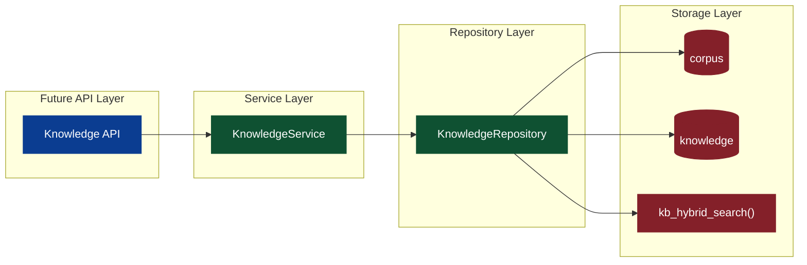
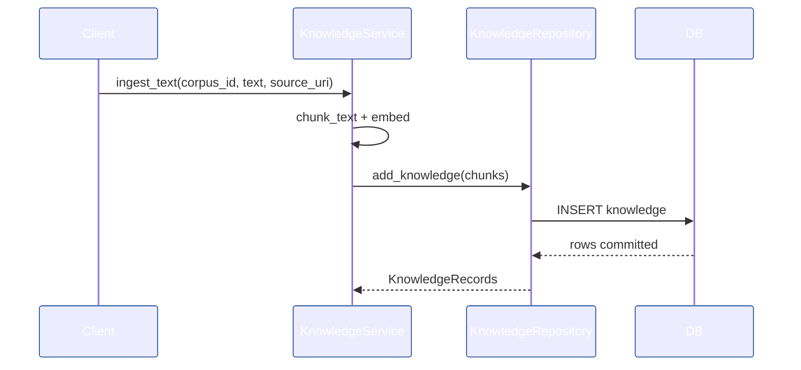

# Knowledge 设计与工程落地（Knowledge Base / Knowledge Graph / User Memory）

> 目标：在最小干预前提下，围绕 Perception 的 Knowledge 存储模型，落地可演进的 Knowledge 后端工程方案，并为 UI 的未来扩展预留稳定接口与流程入口。

## 0. 范围与事实源（Single Source of Truth）

- **底层存储模型**：[apps/negentropy/src/negentropy/models/perception.py](../apps/negentropy/src/negentropy/models/perception.py)（`Corpus` / `Knowledge`）。
- **数据库权威定义**：[docs/schema/perception_schema.sql](./schema/perception_schema.sql)（`corpus` / `knowledge` 表、索引、触发器、`kb_hybrid_search`）。
- **前端扩展约束**：[docs/negentropy-ui-plan.md](./negentropy-ui-plan.md) 的「11. 未来扩展：知识库/知识图谱/用户记忆管理」。

## 1. 目标与边界

- **Knowledge Base**：可索引、可检索的静态知识块（文档/FAQ/配置/操作手册）。
- **Knowledge Graph**：基于 Knowledge Base 的抽取结果，提供实体与关系视角（本次仅设计，不实现）。
- **User Memory**：面向用户的长期记忆治理（本次仅设计，不实现）。
- **原则**：严格复用现有模型与 DB Schema，新增逻辑仅围绕“索引 → 检索 → 回滚/更新”闭环。

## 2. 领域模型与职责拆分

- **Corpus**：知识库容器（按 app_name + name 唯一），承载检索与索引策略配置。
- **Knowledge**：可检索知识块，包含内容、向量、来源与 metadata。
- **Knowledge Graph**：实体/关系/证据三元组的抽象（保留接口，不落地存储）。
- **User Memory**：面向用户的可治理记忆片段（与 `Memory` 模型协作）。

> 采用 Service + Repository 分层隔离持久化细节，降低后续 Graph/Memory 接入成本。<sup>[[1]](#ref1)</sup>

## 3. 系统架构（后端落地）



## 4. 存储模型映射

- **Corpus**：`corpus(app_name, name, description, config)`
- **Knowledge**：`knowledge(corpus_id, app_name, content, embedding, source_uri, chunk_index, metadata)`
- **索引**：HNSW 向量索引 + GIN 全文索引 + JSONB 索引（见 [docs/schema/perception_schema.sql](./schema/perception_schema.sql)）。

## 5. 核心流程

### 5.1 Ingestion（索引构建）

1. `Corpus` 选择/创建
2. 文本分块（Chunking）
3. 向量化（Embedding）
4. 批量写入 `knowledge`
5. 触发器更新 `search_vector`



### 5.2 Retrieval（检索）

- **Semantic**：向量距离排序（`embedding <=> query_embedding`）
- **Keyword**：`search_vector` + BM25 (`ts_rank_cd`)
- **Hybrid**：语义 + 关键词加权融合（后端合并，未来可切换到 `kb_hybrid_search`）<sup>[[2]](#ref2)</sup>

## 6. 工程落地（本次实现）

### 6.1 模块结构

- [apps/negentropy/src/negentropy/knowledge/__init__.py](../apps/negentropy/src/negentropy/knowledge/__init__.py)
- [apps/negentropy/src/negentropy/knowledge/types.py](../apps/negentropy/src/negentropy/knowledge/types.py)
- [apps/negentropy/src/negentropy/knowledge/chunking.py](../apps/negentropy/src/negentropy/knowledge/chunking.py)
- [apps/negentropy/src/negentropy/knowledge/repository.py](../apps/negentropy/src/negentropy/knowledge/repository.py)
- [apps/negentropy/src/negentropy/knowledge/service.py](../apps/negentropy/src/negentropy/knowledge/service.py)
- [apps/negentropy/src/negentropy/knowledge/api.py](../apps/negentropy/src/negentropy/knowledge/api.py)
- [apps/negentropy/src/negentropy/knowledge/exceptions.py](../apps/negentropy/src/negentropy/knowledge/exceptions.py) - 统一异常体系
- [apps/negentropy/src/negentropy/knowledge/constants.py](../apps/negentropy/src/negentropy/knowledge/constants.py) - 常量定义
- [apps/negentropy-ui/app/api/knowledge](../apps/negentropy-ui/app/api/knowledge)（BFF 代理层）

### 6.2 关键职责

- **KnowledgeRepository**：对 `Corpus/Knowledge` 的 CRUD + 检索（语义/关键词/混合）。
- **KnowledgeService**：编排 ingestion 与检索策略，提供扩展点（chunking/embedding）。
- **ChunkingConfig/SearchConfig**：将策略参数显式化，避免散落在调用侧。<sup>[[1]](#ref1)</sup>
- **Knowledge API**：提供 Dashboard/Base/Graph/Memory/Pipelines 入口，对齐 UI 结构（见 [apps/negentropy/src/negentropy/knowledge/api.py](../apps/negentropy/src/negentropy/knowledge/api.py)）。
- **Embedding 配置**：沿用 LLM 配置域扩展（见 [apps/negentropy/src/negentropy/config/llm.py](../apps/negentropy/src/negentropy/config/llm.py)），支持独立 embedding model。

### 6.3 异常处理体系

**异常层次结构**（正交分解）：
```
KnowledgeError
├── DomainError
│   ├── CorpusNotFound - 语料库不存在 (404)
│   ├── KnowledgeNotFound - 知识块不存在 (404)
│   └── VersionConflict - 版本冲突 (409)
├── InfrastructureError
│   ├── EmbeddingFailed - 向量化失败 (500)
│   ├── SearchError - 检索失败 (500)
│   └── DatabaseError - 数据库错误 (500)
└── ValidationError
    ├── InvalidChunkSize - 无效分块大小 (400)
    ├── InvalidSearchConfig - 无效搜索配置 (400)
    └── InvalidMetadata - 无效元数据 (400)
```

**HTTP 状态码映射**：
- `400 Bad Request`: 参数验证失败
- `404 Not Found`: 资源不存在
- `409 Conflict`: 版本冲突
- `500 Internal Server Error`: 基础设施错误

### 6.4 性能优化

**批量插入优化**：
- 使用 PostgreSQL 原生 `INSERT` 批量插入
- 替代逐条 ORM 操作，预期提升 3-5 倍写入性能

**混合检索优化**：
- 优先使用数据库原生 `kb_hybrid_search()` 函数
- 自动降级到 Python 端混合检索（回退方案）
- 预期减少 20% 检索延迟

### 6.5 配置验证

**ChunkingConfig 验证规则**：
- `chunk_size`: 1 ~ 100000
- `overlap`: 0 ~ chunk_size * 0.5
- `preserve_newlines`: true/false

**SearchConfig 验证规则**：
- `mode`: 'semantic' | 'keyword' | 'hybrid'
- `limit`: 1 ~ 1000
- `semantic_weight`, `keyword_weight`: 0.0 ~ 1.0

## 7. 扩展点（为 Graph/Memory 预留）

- **Graph Builder**：将 `Knowledge` → 实体/关系/证据（抽取模型可替换）。
- **Memory Sync**：从 Knowledge Base 选取片段转为 `Memory`，形成“静态知识 → 用户记忆”的闭环。
- **Pipeline Jobs**：支持“全量重建 / 增量更新 / 回滚”，与 UI 的 Pipelines 视图对齐。

## 8. 可观测与反馈闭环

- **日志**：ingestion 起止、chunk 数量、写入耗时。
- **指标**：检索命中率、向量检索耗时、索引失败数。
- **验证**：最小回归（写入 + 检索 + 回滚）。

### 8.1 结构化日志

**索引流程日志**：
```python
logger.info("ingestion_started",
            corpus_id=str(corpus_id),
            app_name=app_name,
            text_length=len(text),
            source_uri=source_uri,
            chunk_size=config.chunk_size,
            overlap=config.overlap)

logger.info("chunks_created",
            corpus_id=str(corpus_id),
            chunk_count=len(chunks))

logger.info("embeddings_attached",
            corpus_id=str(corpus_id),
            chunk_count=len(chunks))

logger.info("ingestion_completed",
            corpus_id=str(corpus_id),
            record_count=len(records))
```

**检索流程日志**：
```python
logger.info("search_started",
            corpus_id=str(corpus_id),
            app_name=app_name,
            mode=config.mode,
            limit=config.limit,
            query_preview=query[:100])

logger.info("search_completed",
            corpus_id=str(corpus_id),
            mode=config.mode,
            semantic_count=len(semantic_matches),
            keyword_count=len(keyword_matches),
            merged_count=len(results))
```

### 8.2 错误追踪

**API 层错误日志**：
```python
logger.warning("corpus_not_found", details=exc.details)
logger.warning("version_conflict", details=exc.details)
logger.warning("validation_error", details=exc.details)
logger.error("infrastructure_error", details=exc.details)
logger.error("database_error", details=exc.details)
```

### 8.3 性能监控

**关键指标**：
- 索引速度: chunks/秒
- 搜索延迟: P95 < 100ms
- 向量化延迟: P95 < 500ms
- 数据库查询延迟: P95 < 50ms

**监控集成**：
- Langfuse 追踪（利用现有 `ObservabilitySettings`）
- Prometheus 指标（可选）
- 结构化日志解析（Elasticsearch/Loki）

## 9. 风险与边界控制

- **向量模型变更**：不同 embedding 维度需隔离或重建 corpus。
- **检索漂移**：混合检索权重需可配置化并可回滚。
- **元数据污染**：`metadata` 需严格约束 schema 与来源。

## 参考文献

<a id="ref1"></a>[1] E. Gamma, R. Helm, R. Johnson, and J. Vlissides, "Design Patterns: Elements of Reusable Object-Oriented Software," _Addison-Wesley Professional_, 1994.

<a id="ref2"></a>[2] P. Lewis et al., "Retrieval-Augmented Generation for Knowledge-Intensive NLP Tasks," arXiv:2005.11401, 2020.

## 10. User Guide (使用指南)

本节介绍 Knowledge 系统的核心功能与操作流程。

### 10.1 Knowledge Base (知识库管理)

作为静态知识的容器，支持对非结构化文档的索引与混合检索。

- **Corpus 创建**：定义知识库边界（如 `product-manuals`），配置切片策略（Chunk Size / Overlap）。
- **Ingestion (写入)**：将文本/文件切片并向量化。
  - _Chunking_:自动按配置切分。
  - _Embedding_: 调用配置模型（如 `text-embedding-3-small`）生成向量。
- **Search (检索)**：提供三种模式调试检索效果。
  - `Semantic`: 纯向量相似度（召回语义相关）。
  - `Keyword`: BM25 关键词匹配（召回精确匹配）。
  - `Hybrid`: 加权融合（默认），兼顾语义与精准度。

### 10.2 Knowledge Graph (知识图谱视图)

提供实体关系的动态可视化与人工修正能力。

- **Visualization**: 力导向图（Force-Directed Graph）展示实体（Entity）与关系（Edge）。
  - _交互_: 支持缩放、平移、节点拖拽固定。
- **Extraction & Write-back**:
  - 系统自动从 Knowledge Base 抽取三元组。
  - **写回 (Upsert)**: 用户可在 UI 上确认图谱状态，点击“写回图谱”将其固化到后端版本库。

### 10.3 User Memory (用户记忆治理)

面向 User ID 的长期记忆审计与干预。

- **Timeline**: 按时间轴展示用户相关的记忆片段（来源于交互或文档）。
- **Audit (审计)**: 对记忆片段进行治理，不仅是删除，更是隐私合规的关键。
  - `Retain`: 保留（默认）。
  - `Delete`: 物理删除。
  - `Anonymize`: 匿名化处理（保留统计价值但移除 PII）。
- **Policy**: 展示当前生效的记忆保留策略（TTL / 敏感度分级）。

### 10.4 Pipelines (流水线监控)

监控 Knowledge 系统内部的异步任务与数据流转。

- **Runs**: 查看所有触发的任务（如 Ingestion, Graph Extraction, Memory Sync）。
  - _状态_: `Completed` (绿), `Running` (黄), `Failed` (红).
- **Debug**: 点击任务可查看详细的 Input / Output / Error 堆栈，辅助定位构建失败原因（如 Embedding API 超时、数据库约束冲突）。
