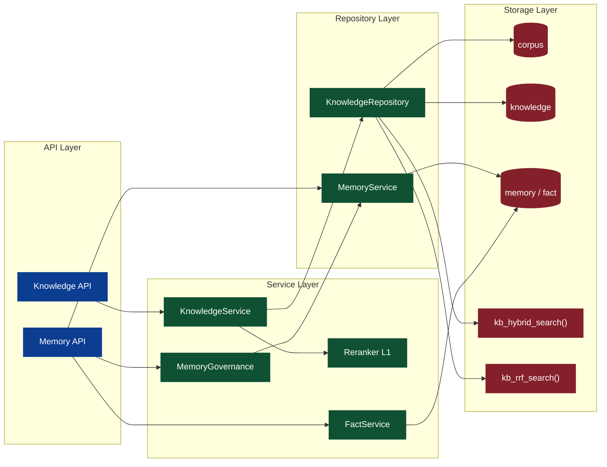
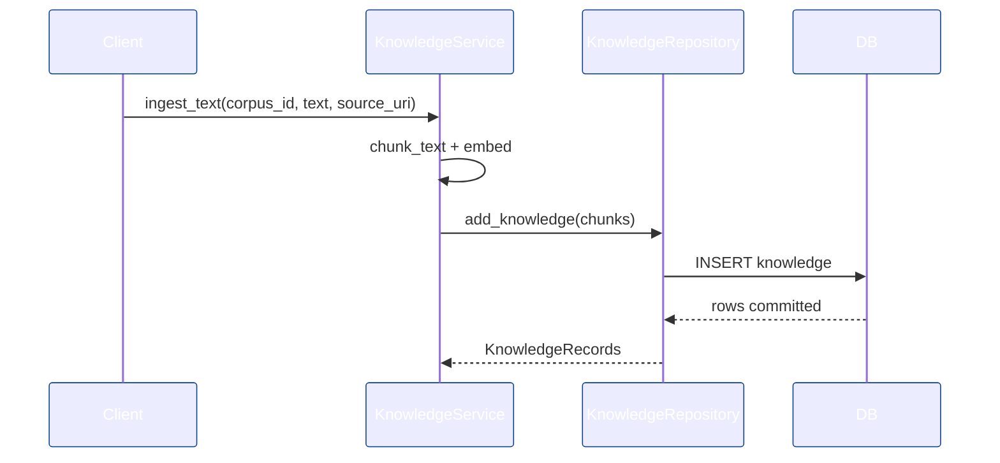
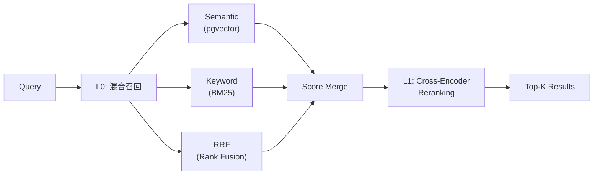
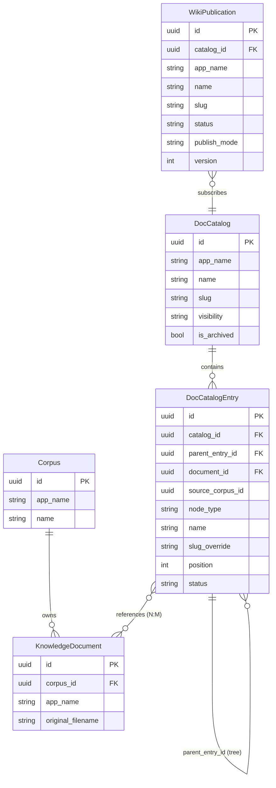
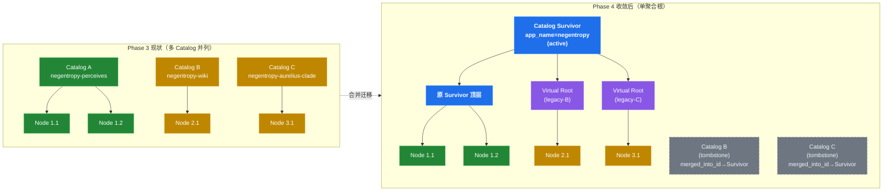

# Knowledge 设计与工程落地（Knowledge Base / Knowledge Graph / User Memory）

> 目标：在最小干预前提下，围绕 Perception 的 Knowledge 存储模型，落地可演进的 Knowledge 后端工程方案，并为 UI 的未来扩展预留稳定接口与流程入口。

## 0. 范围与事实源（Single Source of Truth）

- **底层存储模型**：[apps/negentropy/src/negentropy/models/perception.py](../apps/negentropy/src/negentropy/models/perception.py)（`Corpus` / `Knowledge`）。
- **Memory 模型**：[apps/negentropy/src/negentropy/models/internalization.py](../apps/negentropy/src/negentropy/models/internalization.py)（`Memory` / `Fact` / `MemoryAuditLog`）。
- **Memory 专项文档**：[memory.md](./memory.md)（Memory Automation 控制面、实施过程与验收记录）。
- **数据库权威定义**：[docs/schema/perception_schema.sql](./schema/perception_schema.sql)（`corpus` / `knowledge` 表、索引、触发器、`kb_hybrid_search` / `kb_rrf_search`）。
- **前端扩展约束**：[docs/framework.md §11](./framework.md#11-扩展点与演进方向) 的扩展点与演进方向。
- **调研文档**：[034-knowledge-base.md](https://github.com/ThreeFish-AI/agentic-ai-cognizes/blob/master/docs/research/034-knowledge-base.md)、[035-knowledge-base-platform.md](https://github.com/ThreeFish-AI/agentic-ai-cognizes/blob/master/docs/research/035-knowledge-base-platform.md)。
- **设计文档**：[020-the-hippocampus.md](https://github.com/ThreeFish-AI/agentic-ai-cognizes/blob/master/docs/design/020-the-hippocampus.md)（Memory 遗忘曲线设计）。

## 1. 目标与边界

- **Knowledge Base**：可索引、可检索的静态知识块（文档/FAQ/配置/操作手册）。共享、持久、不受遗忘曲线影响。
- **Knowledge Graph**：基于 Knowledge Base 的抽取结果，提供实体与关系视角。使用 Strategy Pattern 支持可替换的抽取策略。
- **User Memory**：面向用户的长期记忆治理。动态、个人化、受遗忘曲线影响、支持 GDPR 审计。
- **原则**：严格复用现有模型与 DB Schema，新增逻辑仅围绕"索引 → 检索 → 回滚/更新"闭环。

> **Knowledge 与 Memory 的本质区别**：
>
> | 维度     | Knowledge Base                    | User Memory                     |
> | -------- | --------------------------------- | ------------------------------- |
> | 性质     | 静态文档                          | 动态记忆                        |
> | 归属     | 共享（按 Corpus）                 | 个人（按 User）                 |
> | 生命周期 | 持久存在                          | 遗忘曲线衰减                    |
> | 治理     | 版本控制                          | 审计（Retain/Delete/Anonymize） |
> | 检索     | 混合检索（Semantic + BM25 + RRF） | 语义 + 时间衰减                 |

## 2. 领域模型与职责拆分

- **Corpus**：知识库容器（按 app_name + name 唯一），承载检索与索引策略配置。
- **Knowledge**：可检索知识块，包含内容、向量、来源与 metadata。
- **Knowledge Graph**：实体/关系/证据三元组，通过 Strategy Pattern 支持多种抽取策略（正则/LLM）。
- **Memory**：面向用户的情景记忆（Episodic Memory），受遗忘曲线影响，支持 `TimestampMixin` 追踪更新。
- **Fact**：面向用户的语义记忆（Semantic Memory），结构化键值对，同样支持审计治理。
- **MemoryAuditLog**：审计日志，支持幂等性和版本控制。

> 采用 Service + Repository 分层隔离持久化细节，降低后续 Graph/Memory 接入成本。<sup>[[1]](#ref1)</sup>

## 3. 系统架构（后端落地）


```mermaid
%%{init: {"themeVariables": {"primaryColor": "#0b3d91", "primaryTextColor": "#ffffff", "primaryBorderColor": "#0b3d91", "secondaryColor": "#0f5132", "secondaryTextColor": "#ffffff", "secondaryBorderColor": "#0f5132", "tertiaryColor": "#842029", "tertiaryTextColor": "#ffffff", "tertiaryBorderColor": "#842029"}}}%%
flowchart LR
  subgraph API[API Layer]
    KAPI[Knowledge API]
    MAPI[Memory API]
  end

  subgraph Service[Service Layer]
    KSvc[KnowledgeService]
    Rerank[Reranker L1]
    MGov[MemoryGovernance]
    FSvc[FactService]
  end

  subgraph Repo[Repository Layer]
    KRepo[KnowledgeRepository]
    MemSvc[MemoryService]
  end

  subgraph Storage[Storage Layer]
    Corpus[(corpus)]
    Knowledge[(knowledge)]
    Memory[(memory / fact)]
    HybridFn["kb_hybrid_search()"]
    RRFFn["kb_rrf_search()"]
  end

  KAPI --> KSvc --> KRepo --> Corpus
  KSvc --> Rerank
  KRepo --> Knowledge
  KRepo --> HybridFn
  KRepo --> RRFFn
  MAPI --> MGov --> MemSvc --> Memory
  MAPI --> FSvc --> Memory
  MAPI --> MemSvc

  classDef api fill:#0b3d91,stroke:#0b3d91,color:#ffffff;
  classDef svc fill:#0f5132,stroke:#0f5132,color:#ffffff;
  classDef repo fill:#0f5132,stroke:#0f5132,color:#ffffff;
  classDef store fill:#842029,stroke:#842029,color:#ffffff;

  class KAPI,MAPI api
  class KSvc,Rerank,MGov,FSvc svc
  class KRepo,MemSvc repo
  class Corpus,Knowledge,Memory,HybridFn,RRFFn store
```

## 4. 存储模型映射

- **Corpus**：`corpus(app_name, name, description, config)`
- **Knowledge**：`knowledge(corpus_id, app_name, content, embedding, source_uri, chunk_index, metadata)`
- **索引**：HNSW 向量索引 + GIN 全文索引 + JSONB 索引（见 [docs/schema/perception_schema.sql](./schema/perception_schema.sql)）。

## 5. 核心流程

### 5.1 Ingestion（索引构建）

1. `Corpus` 选择/创建
2. 文本分块（Chunking）
3. 向量化（Embedding）
4. 批量写入 `knowledge`
5. 触发器更新 `search_vector`


```mermaid
%%{init: {"themeVariables": {"primaryColor": "#0b3d91", "primaryTextColor": "#ffffff", "primaryBorderColor": "#0b3d91", "actorBorder": "#0b3d91", "actorTextColor": "#ffffff"}}}%%
sequenceDiagram
  participant Client
  participant KnowledgeService
  participant KnowledgeRepository
  participant DB

  Client->>KnowledgeService: ingest_text(corpus_id, text, source_uri)
  KnowledgeService->>KnowledgeService: chunk_text + embed
  KnowledgeService->>KnowledgeRepository: add_knowledge(chunks)
  KnowledgeRepository->>DB: INSERT knowledge
  DB-->>KnowledgeRepository: rows committed
  KnowledgeRepository-->>KnowledgeService: KnowledgeRecords
```

### 5.2 Retrieval（两阶段检索）

采用 **L0 Recall + L1 Reranking** 两阶段检索架构<sup>[[3]](#ref3)</sup>：

**L0 召回阶段**（四种模式）:

- **Semantic**：向量距离排序（`embedding <=> query_embedding`）
- **Keyword**：`search_vector` + BM25 (`ts_rank_cd`)
- **Hybrid**：语义 + 关键词加权融合（`semantic_weight * semantic_score + keyword_weight * keyword_score`）
- **RRF** (Reciprocal Rank Fusion)：对分数尺度不敏感的排名融合算法，公式 `RRF(d) = Σ 1/(k + rank)`<sup>[[4]](#ref4)</sup>

**L1 精排阶段**:

- 使用 Cross-Encoder 对 L0 结果进行精排
- 支持 `LocalReranker`（BGE-Reranker）、`APIReranker`（Cohere）、`CompositeReranker`（多级回退）
- 默认使用 `NoopReranker` 确保向后兼容


```mermaid
%%{init: {"themeVariables": {"primaryColor": "#0b3d91"}}}%%
flowchart LR
  Query["Query"] --> L0["L0: 混合召回"]
  L0 --> Semantic["Semantic<br/>(pgvector)"]
  L0 --> Keyword["Keyword<br/>(BM25)"]
  L0 --> RRF["RRF<br/>(Rank Fusion)"]
  Semantic --> Merge["Score Merge"]
  Keyword --> Merge
  RRF --> Merge
  Merge --> L1["L1: Cross-Encoder<br/>Reranking"]
  L1 --> Results["Top-K Results"]
```

## 6. 工程落地（本次实现）

### 6.1 模块结构

**Knowledge 模块** (`negentropy.knowledge`):

- [types.py](../apps/negentropy/src/negentropy/knowledge/types.py) - 领域类型（SearchMode, ChunkingConfig, SearchConfig, GraphNode/Edge 等）
- [chunking.py](../apps/negentropy/src/negentropy/knowledge/chunking.py) - 文本分块（Fixed/Recursive/Semantic/Hierarchical 四种策略）
- [repository.py](../apps/negentropy/src/negentropy/knowledge/repository.py) - 数据访问（CRUD + 四种检索模式），使用 `NEGENTROPY_SCHEMA` 常量
- [service.py](../apps/negentropy/src/negentropy/knowledge/service.py) - 业务逻辑（Ingestion + Search + L1 Reranking 集成）
- [api.py](../apps/negentropy/src/negentropy/knowledge/api.py) - REST API（Dashboard/Base CRUD/Graph/Pipelines）
- [embedding.py](../apps/negentropy/src/negentropy/knowledge/embedding.py) - 向量化（支持指数退避重试 + 超时控制）
- [reranking.py](../apps/negentropy/src/negentropy/knowledge/reranking.py) - L1 精排（Noop/Local/API/Composite 四种策略）
- [graph.py](../apps/negentropy/src/negentropy/knowledge/graph.py) - 知识图谱（Strategy Pattern: EntityExtractor/RelationExtractor）
- [dao.py](../apps/negentropy/src/negentropy/knowledge/dao.py) - 运行记录 DAO（Graph/Pipeline Run，DRY 重构）
- [exceptions.py](../apps/negentropy/src/negentropy/knowledge/exceptions.py) - 统一异常体系
- [constants.py](../apps/negentropy/src/negentropy/knowledge/constants.py) - 常量定义

**Memory 模块** (`negentropy.engine`):

- [engine/api.py](../apps/negentropy/src/negentropy/engine/api.py) - Memory REST API（独立于 Knowledge API，提供 Dashboard/Timeline/Facts/Search/Audit 端点）
- [engine/governance/memory.py](../apps/negentropy/src/negentropy/engine/governance/memory.py) - 记忆治理（审计决策 + 遗忘曲线 + GDPR）
- [engine/adapters/postgres/memory_service.py](../apps/negentropy/src/negentropy/engine/adapters/postgres/memory_service.py) - 记忆存储（混合检索 + 访问计数追踪）
- [engine/adapters/postgres/fact_service.py](../apps/negentropy/src/negentropy/engine/adapters/postgres/fact_service.py) - 事实存储
- [engine/factories/memory.py](../apps/negentropy/src/negentropy/engine/factories/memory.py) - 工厂
- [engine/summarization.py](../apps/negentropy/src/negentropy/engine/summarization.py) - 会话摘要（从 knowledge/ 迁移至此）

**Models**:

- [models/perception.py](../apps/negentropy/src/negentropy/models/perception.py) - Corpus / Knowledge ORM
- [models/internalization.py](../apps/negentropy/src/negentropy/models/internalization.py) - Memory / Fact / MemoryAuditLog ORM（含 TimestampMixin）
- [models/base.py](../apps/negentropy/src/negentropy/models/base.py) - `NEGENTROPY_SCHEMA`, `TimestampMixin`, `UUIDMixin`

### 6.2 关键职责

- **KnowledgeRepository**：对 `Corpus/Knowledge` 的 CRUD + 四种检索模式（Semantic/Keyword/Hybrid/RRF）。SQL 调用统一使用 `NEGENTROPY_SCHEMA` 常量。
- **KnowledgeService**：编排 ingestion 与检索策略，集成 L1 Reranking（默认 `NoopReranker`），提供扩展点（chunking/embedding/reranker）。
- **MemoryGovernanceService**：记忆审计（Retain/Delete/Anonymize）+ 遗忘曲线计算（指数衰减模型）。审计操作同时覆盖 Memory 和关联 Fact（GDPR 合规）。
- **PostgresMemoryService**：记忆混合检索 + 访问计数自动更新（`access_count += 1`, `last_accessed_at = now()`），使遗忘曲线动态生效。
- **GraphProcessor**：知识图谱构建，委托 `EntityExtractor` / `RelationExtractor`（Strategy Pattern），便于从正则方案迁移到 LLM 方案。
- **ChunkingConfig/SearchConfig**：将策略参数显式化，避免散落在调用侧。<sup>[[1]](#ref1)</sup>
- **Knowledge API**：提供 Dashboard/Base CRUD（含 DELETE 级联删除）/Graph/Pipelines 入口，对齐 UI 结构。
- **Embedding 模块**：内置指数退避重试（max_retries=3, backoff=exponential）和超时控制（30s），通过 `EmbeddingFailed` 异常上报。

### 6.3 异常处理体系

**异常层次结构**（正交分解）：

```
KnowledgeError
├── DomainError
│   ├── CorpusNotFound - 语料库不存在 (404)
│   ├── KnowledgeNotFound - 知识块不存在 (404)
│   └── VersionConflict - 版本冲突 (409)
├── InfrastructureError
│   ├── EmbeddingFailed - 向量化失败 (500)
│   ├── SearchError - 检索失败 (500)
│   └── DatabaseError - 数据库错误 (500)
└── ValidationError
    ├── InvalidChunkSize - 无效分块大小 (400)
    ├── InvalidSearchConfig - 无效搜索配置 (400)
    └── InvalidMetadata - 无效元数据 (400)
```

**HTTP 状态码映射**：

- `400 Bad Request`: 参数验证失败
- `404 Not Found`: 资源不存在
- `409 Conflict`: 版本冲突
- `500 Internal Server Error`: 基础设施错误

### 6.4 性能优化

**批量插入优化**：

- 使用 PostgreSQL 原生 `INSERT` 批量插入
- 替代逐条 ORM 操作，预期提升 3-5 倍写入性能

**混合检索优化**：

- 优先使用数据库原生 `kb_hybrid_search()` 函数
- 自动降级到 Python 端混合检索（回退方案）
- 预期减少 20% 检索延迟

### 6.5 配置验证

**ChunkingConfig 验证规则**（按 `strategy` 判别）：

- `fixed`: `chunk_size`, `overlap`, `preserve_newlines`
- `recursive`: `chunk_size`, `overlap`, `separators`, `preserve_newlines`
- `semantic`: `semantic_threshold`, `semantic_buffer_size`, `min_chunk_size`, `max_chunk_size`
- `hierarchical`: `hierarchical_parent_chunk_size`, `hierarchical_child_chunk_size`, `hierarchical_child_overlap`, `separators`, `preserve_newlines`
- `fixed/recursive`: `chunk_size` 范围 `1 ~ 100000`，`overlap` 范围 `0 ~ chunk_size * 0.5`
- `semantic`: `semantic_buffer_size` 范围 `1 ~ 5`，`max_chunk_size >= min_chunk_size`
- `hierarchical`: `hierarchical_parent_chunk_size >= hierarchical_child_chunk_size`，`hierarchical_child_overlap < hierarchical_child_chunk_size`
- 新请求统一优先发送 `chunking_config`；服务端兼容旧的扁平字段，但写回 `corpus.config` 时只保留 canonical 结构

**SearchConfig 验证规则**：

- `mode`: 'semantic' | 'keyword' | 'hybrid' | 'rrf'
- `limit`: 1 ~ 1000
- `semantic_weight`, `keyword_weight`: 0.0 ~ 1.0
- `rrf_k`: 平滑常数（默认 60），仅用于 RRF 模式

## 7. Memory 治理与遗忘曲线

### 7.1 遗忘曲线模型

基于 Ebbinghaus 遗忘曲线<sup>[[5]](#ref5)</sup>的指数衰减模型：

```
retention_score = min(1.0, time_decay × frequency_boost / 5.0)
time_decay = e^(-λ × days_elapsed)
frequency_boost = 1 + ln(1 + access_count)
```

- `λ`（衰减常数）：默认 0.1，可自定义。值越大衰减越快。
- `days_elapsed`：距最后访问的天数。
- `access_count`：累计访问次数。频率因子使用对数增长，避免高频访问过度膨胀分数。
- 分数范围：[0.0, 1.0]。

**典型衰减曲线**（λ=0.1, access_count=0）:

| days | time_decay | retention_score |
| ---- | ---------- | --------------- |
| 0    | 1.00       | 0.20            |
| 7    | 0.50       | 0.10            |
| 14   | 0.25       | 0.05            |
| 30   | 0.05       | 0.01            |

### 7.2 访问计数追踪

检索记忆时自动记录访问行为，使遗忘曲线动态生效：

```python
# search_memory() 返回结果后，异步更新被召回记忆
UPDATE memories SET
    access_count = access_count + 1,
    last_accessed_at = now()
WHERE id IN (recalled_memory_ids);
```

### 7.3 审计决策

Memory 和关联 Fact 同步处理，确保 GDPR 合规：

- **Retain**：保留记忆，不做操作。
- **Delete**：物理删除 Memory + 关联 Fact（通过 thread_id 关联）。
- **Anonymize**：Memory 内容替换为 `[ANONYMIZED]`，清除 embedding 和 metadata；Fact 值替换为 `{"anonymized": True}`，清除 embedding。

### 7.4 版本控制与幂等性

- 乐观锁：`expected_versions` 参数用于检测版本冲突。
- 幂等性键：`idempotency_key` 防止重复提交。
- 审计历史：每次决策创建 `MemoryAuditLog` 记录。

## 8. 扩展点与策略接口

- **EntityExtractor**（ABC）：实体提取策略。当前实现 `RegexEntityExtractor`（正则），预留 `LLMEntityExtractor` 接口。
- **RelationExtractor**（ABC）：关系提取策略。当前实现 `CooccurrenceRelationExtractor`（共现），预留 `LLMRelationExtractor` 接口。
- **Reranker**（ABC）：L1 精排策略。已实现 `NoopReranker` / `LocalReranker` (BGE) / `APIReranker` (Cohere) / `CompositeReranker`（多级回退）。
- **Pipeline Jobs**：支持"全量重建 / 增量更新 / 回滚"，与 UI 的 Pipelines 视图对齐。DAO 层已消除重复代码（通用 `_upsert_run()` 方法）。

## 9. 可观测与反馈闭环

- **日志**：ingestion 起止、chunk 数量、写入耗时。
- **指标**：检索命中率、向量检索耗时、索引失败数。
- **验证**：最小回归（写入 + 检索 + 回滚）。

### 9.1 结构化日志

**索引流程日志**：

```python
logger.info("ingestion_started",
            corpus_id=str(corpus_id),
            app_name=app_name,
            text_length=len(text),
            source_uri=source_uri,
            chunk_size=config.chunk_size,
            overlap=config.overlap)

logger.info("chunks_created",
            corpus_id=str(corpus_id),
            chunk_count=len(chunks))

logger.info("embeddings_attached",
            corpus_id=str(corpus_id),
            chunk_count=len(chunks))

logger.info("ingestion_completed",
            corpus_id=str(corpus_id),
            record_count=len(records))
```

**检索流程日志**：

```python
logger.info("search_started",
            corpus_id=str(corpus_id),
            app_name=app_name,
            mode=config.mode,
            limit=config.limit,
            query_preview=query[:100])

logger.info("search_completed",
            corpus_id=str(corpus_id),
            mode=config.mode,
            semantic_count=len(semantic_matches),
            keyword_count=len(keyword_matches),
            merged_count=len(results))
```

### 9.2 错误追踪

**API 层错误日志**：

```python
logger.warning("corpus_not_found", details=exc.details)
logger.warning("version_conflict", details=exc.details)
logger.warning("validation_error", details=exc.details)
logger.error("infrastructure_error", details=exc.details)
logger.error("database_error", details=exc.details)
```

### 9.3 性能监控

**关键指标**：

- 索引速度: chunks/秒
- 搜索延迟: P95 < 100ms
- 向量化延迟: P95 < 500ms
- 数据库查询延迟: P95 < 50ms

**监控集成**：

- Langfuse 追踪（利用现有 `ObservabilitySettings`）
- Prometheus 指标（可选）
- 结构化日志解析（Elasticsearch/Loki）

## 10. 风险与边界控制

- **向量模型变更**：不同 embedding 维度需隔离或重建 corpus。
- **检索漂移**：混合检索权重需可配置化并可回滚。
- **元数据污染**：`metadata` 需严格约束 schema 与来源。
- **Embedding API 不稳定**：已内置指数退避重试（3 次）和超时控制（30s），通过 `EmbeddingFailed` 异常上报。
- **SQL 注入**：Memory 混合检索的 embedding 参数已改为参数化绑定（非字符串拼接），并统一使用 schema 前缀。

## 参考文献

<a id="ref1"></a>[1] E. Gamma, R. Helm, R. Johnson, and J. Vlissides, "Design Patterns: Elements of Reusable Object-Oriented Software," _Addison-Wesley Professional_, 1994.

<a id="ref2"></a>[2] P. Lewis et al., "Retrieval-Augmented Generation for Knowledge-Intensive NLP Tasks," arXiv:2005.11401, 2020.

<a id="ref3"></a>[3] N. Reimers and I. Gurevych, "Sentence-BERT: Sentence Embeddings using Siamese BERT-Networks," _arXiv preprint arXiv:1908.10084_, 2019.

<a id="ref4"></a>[4] G. V. Cormack, C. L. A. Clarke, and S. Buettcher, "Reciprocal Rank Fusion outperforms Condorcet and individual Rank Learning Methods," _SIGIR'09_, 2009.

<a id="ref5"></a>[5] H. Ebbinghaus, "Memory: A Contribution to Experimental Psychology," _Teachers College, Columbia University_, 1885/1913.

## 11. Knowledge System User Guide (知识系统指南)

本节详细介绍 Knowledge Base 与 Knowledge Graph 的核心功能特性与用户操作流程。

### 11.1 Knowledge Base (知识库管理)

> [!IMPORTANT]
> **Authentication Required**: Knowledge 系统受 RBAC 保护。
>
> - **View**: 所有已认证用户可查看公共知识库。
> - **Edit**: 仅 `admin` 或 `knowledge_manager` 角色可创建/更像语料库。

作为静态知识的容器，支持对非结构化文档的**索引 (Indexing)**、**更新 (Upsert)** 与**混合检索 (Hybrid Search)**。

#### 11.1.1 功能特性 (Features)

- **Corpus (语料库)**：知识的逻辑边界（Namespace）。每个 Corpus 拥有独立的配置策略，物理上隔离检索范围。
- **Chunking Strategies (切片策略)**：
  - **Fixed Size**: 按固定字符数切分（如 `1000 chars`），简单高效。
  - **Recursive**: 递归字符切分（按段落 `\n\n` -> 句子 `.` -> 词 ），保持语义连贯性。
  - **Semantic**: 基于 Embedding 相似度突变点进行切分，聚合语义相似的段落。
- **Embedding Models**:
  - 默认模型：`vertex_ai/text-embedding-005` (768维/1536维)，平衡性能与成本。
  - 备选模型：`openai/text-embedding-3-small`。
- **Retrieval Modes (检索模式)**：
  - **Semantic**: 向量余弦相似度（Cosine Similarity），召回语义相关。
  - **Keyword**: BM25 关键词匹配，召回精确匹配（如错误码、专有名词）。
  - **Hybrid**: 加权融合（Weighted Sum），$Score = W_s \cdot S_{semantic} + W_k \cdot S_{keyword}$。
  - **RRF**: 倒数排名融合（Reciprocal Rank Fusion），无需调参即可获得稳健结果。

#### 11.1.2 操作步骤 (Operation Steps)

**1. 创建语料库 (Create Corpus)**

1. 进入 **Knowledge Base** 页面。
2. 在左侧 "Sources" 栏点击 **Create** 按钮。
3. 填写表单：
   - `Name`: 唯一标识符（如 `product-manuals-v1`）。
   - `Description`: 描述用途。
   - `Config`: 可选 JSON 配置（如 `{"chunk_size": 1000, "overlap": 200}`）。
4. 点击确认，系统将初始化 Corpus 容器。

**2. 索引文档 (Ingest Content)**

1. 在左侧列表选中目标 Corpus。
2. 右侧 **Ingest Panel** 面板：
   - `Source URI`: 输入文档的唯一标识（如 `manuals/en/deploy.md`）。
   - `Text`: 粘贴文档全文内容。
3. 点击 **Ingest**（追加模式）或 **Replace**（覆盖模式）。
   - _Replace_: 原子性执行 `DELETE WHERE source_uri = ?` + `INSERT`，防止数据残留。

**3. 检索测试 (Search & Debug)**

1. 在 **Search Workspace** 区域输入 Query。
2. 选择检索模式（Semantic / Keyword / Hybrid / RRF）。
3. 点击 **Search**，观察：
   - 召回的 Chunks 内容。
   - `Score` 分布（Semantic Score vs Keyword Score）。
   - `Metadata` 字段信息。

**4. 编辑语料库 (Edit Corpus)**

1. 在 Corpus 列表项右侧点击 **更多操作** (三点图标)。
2. 选择 **编辑配置**。
3. 修改 `Name`, `Description` 或 `Config`。
   - `Fixed`: `Chunk Size / Overlap / 保留换行`
   - `Recursive`: `Chunk Size / Overlap / Separators / 保留换行`
   - `Semantic`: `Similarity Threshold / Buffer Size / Min Chunk Size / Max Chunk Size`
   - `Hierarchical`: `Parent Size / Child Size / Child Overlap / Separators / 保留换行`
4. 点击 **Save** 保存更改。
   - **注意**: 修改 Chunking Config 不会自动重新索引现有文档，仅对新 ingestion 生效。如需应用新配置，请重新 ingest 文档。

**5. 删除语料库 (Delete Corpus)**

1. 在 Corpus 列表项右侧点击 **更多操作** (三点图标)。
2. 选择 **删除数据源**。
3. 在确认对话框中点击 **Delete**。
4. **警告**: 此操作为**级联删除**，将物理删除该 Corpus 下所有 Knowledge Chunks 及索引数据，不可恢复。

### 11.2 Knowledge Graph (知识图谱)

提供实体（Entity）与关系（Relation）的动态可视化视图，支持人工审查与版本快照。

#### 11.2.1 功能特性 (Features)

- **Force-Directed Layout**: 使用 D3.js 力导向图算法，自动布局实体节点，展现聚类结构。
- **Interactive Editing**: 支持拖拽节点固定位置（Pinning），调整布局以获得最佳可视效果。
- **Versioned Snapshots**: 图谱状态并非实时覆盖，而是以 `GraphRun` (Version) 形式保存快照，支持回滚。

#### 11.2.2 操作步骤 (Operation Steps)

**1. 查看图谱 (Visualization)**

1. 进入 **Knowledge Graph** 页面。
2. 系统自动加载最新的图谱快照 (Latest Version)。
3. **交互操作**:
   - **Zoom/Pan**: 滚轮缩放，按住左键拖拽画布。
   - **Drag Node**: 拖拽节点可将其位置固定（fx/fy），再次点击释放固定。
   - **Click Node**: 点击节点，右侧面板显示实体详细属性（Label, Type, Description）。

**2. 保存快照 (Snapshot & Write-back)**

1. 完成布局调整或实体确认后。
2. 点击右上角 **"写回图谱" (Upsert Graph)** 按钮。
3. 系统将当前图谱状态（Nodes + Edges + Layout）保存为新的 version。
4. 在右侧 **"Build Runs"** 列表中可见新增的记录。

### 11.3 Pipelines (系统监控)

监控 Knowledge 系统内部的异步任务流转状态。

- **Pipeline Runs**: 查看 Ingestion, Graph Extraction, Memory Sync 等后台任务。
- **Status**:
  - `Running`: 任务执行中（黄色）。
  - `Completed`: 执行成功（绿色）。
  - `Failed`: 执行失败（红色），点击可查看 Error Stack Trace。
- **Alerts**: 系统自动捕获的异常（如 Embedding API Rate Limit, DB Connection Timeout）。

## 12. Memory System Guide (摘要)

Memory 运行时能力分为两层：

- **User Memory 面板**：Dashboard / Timeline / Facts / Audit，用于用户长期记忆的查看、审计与治理。
- **Memory Automation 控制面**：用于仿生记忆自动化过程的配置、受管函数、调度任务与降级状态管理。

为避免文档双源，Memory Automation 的设计、接口、降级矩阵与实施记录统一以 [memory.md](./memory.md) 为准；本文件仅保留 Knowledge 与 Memory 的边界说明。

> [!NOTE]
> 管理员 (`admin` 角色) 可访问 Memory Dashboard 与 Memory Automation 控制面；调度能力是否可写取决于 `pg_cron` 是否可安装且可访问，详见 [memory.md](./memory.md)。

## 13. Catalog / Wiki Publication 三层正交架构

> 本节记录 Phase 3 Catalog 全局化重构（commits `ebe5a91`–`59be678`）落地后的架构状态。
> **下游收敛**：Phase 4 在本节 N:M schema 之上叠加「每 app 1 个 active Catalog + 每 Catalog 1 个 LIVE WikiPublication」聚合根不变量，详见 [§15 单实例 Catalog 收敛（Phase 4）](#15-单实例-catalog-收敛phase-4在-nm-之上叠加聚合根不变量)。

### 13.1 设计背景与动机

原始设计中，`doc_catalog_nodes.corpus_id NOT NULL` 将 **Catalog（目录组织视图）** 强绑定到 **Corpus（存储/检索单元）**，违反 **Orthogonal Decomposition（正交分解）** 原则：

- Corpus 本应是「存储 / 检索 / embedding」单元；
- Catalog 本应是「人类可读的组织视图」（N:M，可跨 Corpus 聚合文档）；
- Publication 本应是「发布 / 展示」单元（软链接订阅 Catalog）。

三层被压缩到一根 `corpus_id` 外键，导致用户无法跨 Corpus 聚合文档，Wiki 发布也被迫 corpus-scoped。

**业界范式参照**（IEEE）：

- **MediaWiki Category N:M**<sup>[[6]](#ref6-catalog)</sup>：Catalog 与 Corpus 完全正交，Page 可属多 Category；
- **GitBook Site→Space 订阅**<sup>[[7]](#ref7-catalog)</sup>：Publication 以软链接订阅内容源，支持 live / snapshot 两种模式；
- **Confluence Include Page 权限规则**<sup>[[8]](#ref8-catalog)</sup>：权限以源为准，聚合侧只能做交集，不能放大访问域。

### 13.2 数据模型（三层正交 ER）


```mermaid
%%{init: {"themeVariables": {"primaryColor": "#0b3d91", "primaryTextColor": "#ffffff"}}}%%
erDiagram
    Corpus {
        uuid id PK
        string app_name
        string name
    }
    KnowledgeDocument {
        uuid id PK
        uuid corpus_id FK
        string app_name
        string original_filename
    }
    DocCatalog {
        uuid id PK
        string app_name
        string name
        string slug
        string visibility
        bool is_archived
    }
    DocCatalogEntry {
        uuid id PK
        uuid catalog_id FK
        uuid parent_entry_id FK
        uuid document_id FK
        uuid source_corpus_id
        string node_type
        string name
        string slug_override
        int position
        string status
    }
    WikiPublication {
        uuid id PK
        uuid catalog_id FK
        string app_name
        string name
        string slug
        string status
        string publish_mode
        int version
    }

    Corpus ||--o{ KnowledgeDocument : "owns"
    DocCatalog ||--o{ DocCatalogEntry : "contains"
    DocCatalogEntry }o--o{ KnowledgeDocument : "references (N:M)"
    DocCatalogEntry ||--o{ DocCatalogEntry : "parent_entry_id (tree)"
    WikiPublication }o--|| DocCatalog : "subscribes"
```

**核心不变量**：

| 层次 | 实体 | 职责 | 关键约束 |
|------|------|------|---------|
| 存储层 | `Corpus` + `KnowledgeDocument` | 物理存储、embedding、检索 | `app_name` 租户隔离，SSOT |
| 组织层 | `DocCatalog` + `DocCatalogEntry` | 人类可读目录树，N:M 软引用 | `catalog.app_name` 创建后不可变 |
| 发布层 | `WikiPublication` | 订阅 Catalog，生成公开站点 | `publication.app_name == catalog.app_name` |

### 13.3 权限模型（三级取交集）

```
viewer 读取 Publication Entry 的权限 =
    viewer 对 document.corpus 有读权限
    ∩ catalog 可见性 allow
    ∩ publication 可见性 allow
```

**关键拦截点**（`catalog_service.py:315-319`）：向 Catalog 添加文档时，强制断言 `document.corpus.app_name == catalog.app_name`，违反则抛 `PermissionError("cross-app assignment forbidden")`。

### 13.4 失效语义（Orphaned Entry）

| 触发源 | 响应 | 用户可见行为 |
|--------|------|------------|
| Document 物理删除 | `catalog_entries.document_id` SET NULL, `status = orphaned` | Wiki 渲染为占位「该文档已失效」 |
| Corpus 被删除 | 级联所有 entries `status = orphaned` | 同上 |
| Catalog 归档 | `is_archived = true`，新增 entry 被拒绝 | 标记「归档」 |

### 13.5 Wiki 发布模式

| 模式 | 行为 | 适用场景 |
|------|------|---------|
| `live`（默认） | 实时跟随 Catalog/Document 变更；SSG ISR 事件驱动增量刷新 | 日常在线文档 |
| `snapshot` | 发布时冻结 `(catalog_entries, document_versions)` 到 `wiki_publication_snapshots`；后续变更不影响 | 合规留档、版本里程碑 |

**版本语义**：每次 `publish()` 递增 `version`；`unpublish()` → `draft`；`archive()` → `archived`（不可逆）。

### 13.6 数据库迁移（三阶段）

| Revision | 内容 | 策略 |
|---------|------|------|
| `0003` | 新建 `doc_catalogs` / `doc_catalog_entries` / `wiki_publication_snapshots` 骨架 | 纯加法，无锁 |
| `0004` | Backfill：从 `doc_catalog_nodes` 平移到 `doc_catalog_entries`；回填 `wiki_publications.catalog_id` | chunked batch，500 行/批 |
| `0005` | Enforce：施加 NOT NULL 约束、UNIQUE(catalog_id, slug)；DROP `doc_catalog_nodes` / `doc_catalog_memberships` / `corpus_id` | 含 downgrade 守卫（跨 corpus catalog 拒绝降级） |

## 14. 测试覆盖

### 14.1 单元测试

```bash
cd apps/negentropy
uv run pytest tests/unit_tests/knowledge/ -v        # Knowledge 模块
uv run pytest tests/unit_tests/engine/ -v            # Memory 治理
```

- **Knowledge**: chunking / types / reranking 测试
- **Memory Governance**: 遗忘曲线（新鲜记忆/高频访问/长期未访问/指数衰减公式/边界值/自定义 λ）

### 14.2 集成测试（需要 PostgreSQL）

```bash
uv run pytest tests/integration_tests/knowledge/ -v
uv run pytest tests/integration_tests/engine/adapters/postgres/ -v
```

**Catalog 专项集成测试**（Phase 3 新增）：

| 文件 | 覆盖范围 |
|------|---------|
| [`test_catalog_dao_integration.py`](../apps/negentropy/tests/integration_tests/knowledge/test_catalog_dao_integration.py) | `CatalogDao` CRUD、树遍历、文档归入/移除 |
| [`test_catalog_cross_corpus.py`](../apps/negentropy/tests/integration_tests/knowledge/test_catalog_cross_corpus.py) | 跨 app_name 权限拒绝、catalog 隔离、orphaned entry |
| [`test_wiki_publish_modes.py`](../apps/negentropy/tests/integration_tests/knowledge/test_wiki_publish_modes.py) | WikiPublishingService 完整生命周期、版本递增、slug/theme 校验 |

### 14.3 性能基准（`tests/performance_tests/knowledge/`）

```bash
uv run pytest tests/performance_tests/knowledge/test_catalog_tree_perf.py -v
```

| 指标 | 阈值 | 备注 |
|------|------|------|
| `get_tree()` 平均（84 节点） | < 50ms | 含 warmup，5 次平均 |
| `get_tree()` P99 | < 100ms | |
| `get_subtree()` 平均 | < 20ms | |
| `list_catalogs()` 平均 | < 10ms | |

---

## 参考文献（Catalog 架构）

<a id="ref6-catalog"></a>[6] Wikimedia Foundation, "Help:Category," *Wikipedia*, 2025. [Online]. Available: https://en.wikipedia.org/wiki/Help:Category

<a id="ref7-catalog"></a>[7] GitBook, "Collections," *GitBook Documentation*, 2025. [Online]. Available: https://docs.gitbook.com/creating-content/content-structure/collection

<a id="ref8-catalog"></a>[8] Atlassian, "Include Page Macro," *Confluence Data Center Documentation*, 2024. [Online]. Available: https://confluence.atlassian.com/doc/include-page-macro-139514.html

---

## 15. 单实例 Catalog 收敛（Phase 4，在 N:M 之上叠加聚合根不变量）

> **状态**：Accepted（ADR 等价）
> **上游**：见 [§13 Catalog / Wiki Publication 三层正交架构](#13-catalog--wiki-publication-三层正交架构)
> **关联运维**：见 [`negentropy-wiki-ops.md` §12 单实例 Catalog 与 Wiki 发布版本管理运维](./negentropy-wiki-ops.md#12-单实例-catalog-与-wiki-发布版本管理运维)
> **关联 Issue**：见 [`issue.md` ISSUE-015](./issue.md#issue-015)

### 15.1 设计动机

Phase 3 将 Catalog 从 Corpus 解耦后，schema 层支持 `(app_name, slug)` 维度下任意多 Catalog（DOCUMENT_REF 表为软引用 N:M），但**实际产品形态只需要一个聚合根**：

- **UX 摩擦**：`/knowledge/catalog`、`/knowledge/wiki` 入口的 `<CatalogSelector>` 是冷启动路径上的隐式断点——首次进入时未选 Catalog 则全页空载；同时 KnowledgeNav（7 个固定 tab）与 Sidebar（5 个一级条目）都未按 Catalog 拆分，使「选 Catalog」沦为不可观测的全局态。
- **聚合根缺位**：Wiki 的「多主题/多菜单/多子菜单」语义本可由 `CatalogNode.parent_entry_id` 自引用 + `MAX_TREE_DEPTH=6` 完整承载，无需借助多个并列 Catalog 行表达层级。
- **业界范式收敛**：Confluence Space<sup>[[9-catalog]](#ref9-catalog)</sup>、GitBook Book<sup>[[7-catalog]](#ref7-catalog)</sup>、Notion Workspace<sup>[[10-catalog]](#ref10-catalog)</sup> 均采用「单容器 + 多层页面树」范式——容器是聚合根（DDD<sup>[[11-catalog]](#ref11-catalog)</sup>），层级由 Composite Pattern<sup>[[12-catalog]](#ref12-catalog)</sup> 承载。

### 15.2 决策

> **每个 `app_name` 至多存在 1 个 active Catalog（聚合根），其内部 `CatalogNode` 多层树承担多主题/多菜单语义；每个 Catalog 至多存在 1 个 LIVE WikiPublication，但保留 ARCHIVED/SNAPSHOT 多版本以支持回退。**

约束以 PostgreSQL **partial unique index** 表达——保留底层 N:M schema 不动，仅在「active」子集上叠加单例不变量：

```sql
-- 每个 app 至多 1 个未归档 Catalog
CREATE UNIQUE INDEX uq_doc_catalogs_app_singleton
  ON doc_catalogs(app_name)
  WHERE is_archived = false;

-- 每个 Catalog 至多 1 个 LIVE Publication（ARCHIVED/SNAPSHOT 不受限）
CREATE UNIQUE INDEX uq_wiki_pub_catalog_active
  ON wiki_publications(catalog_id)
  WHERE status = 'LIVE';
```

并新增 `doc_catalogs.merged_into_id UUID NULL`（自引用 ON DELETE SET NULL），承载 tombstone 溯源指针<sup>[[13-catalog]](#ref13-catalog)</sup>。

### 15.3 与 Phase 3 的关系（叠加，不是回退）

| 维度 | Phase 3（已落地） | Phase 4（本节，叠加） |
|------|-----------------|------------------|
| Catalog 与 Corpus 关系 | 完全解耦，正交 | **不变** |
| `doc_catalog_documents` N:M | 一个 document_id 可挂多 entry | **不变** |
| `(app_name, slug)` 唯一约束 | 允许同 app 多 Catalog | **保留**（向后兼容） |
| Active Catalog 数量 | 不约束 | **新增** partial unique → ≤1 |
| WikiPublication 多版本 | 同 catalog 内允许多 publication | **保留** |
| LIVE Publication 数量 | 不约束 | **新增** partial unique → ≤1 |

**核心要义**：Phase 4 是 Phase 3 设计的**收敛态**，而非否定。底层 N:M schema、跨 catalog 文档引用能力、多版本 Wiki 发布机制全部保留——只在「active 子集」上加一条不变量，使 Catalog 成为合规的聚合根（Aggregate Root, DDD<sup>[[11-catalog]](#ref11-catalog)</sup>）。

### 15.4 数据合并语义（多 Catalog → 单聚合根）

Migration 0004 在 Phase 2 backfill 时按「1 corpus → 1 catalog」1:1 映射，运行环境通常存在 ≥3 个 Catalog（对应 negentropy-perceives / negentropy-wiki / negentropy-aurelius-clade）。Phase 4 采用**根节点合并为子树（Root-as-Subtree Merge）**策略实现无损迁移：


```mermaid
flowchart LR
    subgraph BEFORE["Phase 3 现状（多 Catalog 并列）"]
        direction TB
        C1["Catalog A<br/>negentropy-perceives"]
        C2["Catalog B<br/>negentropy-wiki"]
        C3["Catalog C<br/>negentropy-aurelius-clade"]
        C1 --> N1["Node 1.1"]
        C1 --> N2["Node 1.2"]
        C2 --> N3["Node 2.1"]
        C3 --> N4["Node 3.1"]
    end

    subgraph AFTER["Phase 4 收敛后（单聚合根）"]
        direction TB
        S["Catalog Survivor<br/>app_name=negentropy<br/>(active)"]
        S --> V0["原 Survivor 顶层"]
        S --> V1["Virtual Root<br/>(legacy-B)"]
        S --> V2["Virtual Root<br/>(legacy-C)"]
        V0 --> M1["Node 1.1"]
        V0 --> M2["Node 1.2"]
        V1 --> M3["Node 2.1"]
        V2 --> M4["Node 3.1"]

        T1["Catalog B<br/>(tombstone)<br/>merged_into_id→Survivor"]
        T2["Catalog C<br/>(tombstone)<br/>merged_into_id→Survivor"]
    end

    BEFORE -.合并迁移.-> AFTER

    classDef survivor fill:#1f6feb,stroke:#388bfd,color:#ffffff,font-weight:bold;
    classDef virtual fill:#8957e5,stroke:#a371f7,color:#ffffff;
    classDef tombstone fill:#6e7681,stroke:#8b949e,color:#f0f6fc,stroke-dasharray: 5 5;
    classDef original fill:#238636,stroke:#3fb950,color:#ffffff;
    classDef foreign fill:#bf8700,stroke:#d29922,color:#ffffff;

    class S,V0 survivor;
    class V1,V2 virtual;
    class T1,T2 tombstone;
    class C1,N1,N2,M1,M2 original;
    class C2,C3,N3,N4,M3,M4 foreign;
```

合并算法关键步骤（详见 [`negentropy-wiki-ops.md` §12.2 Phase B runbook](./negentropy-wiki-ops.md#122-phase-b-merge-runbook)）：

1. **Survivor 选择**：按 `(app_name, is_archived=false) ORDER BY created_at ASC LIMIT 1`。
2. **Virtual Root 注入**：为每个被合并 Catalog 在 survivor 顶层创建一个 `node_type='CATEGORY'` 的虚拟节点，slug 加 `legacy-<short_hash>` 后缀避免冲突。
3. **子树嫁接**：将被合并 Catalog 的所有顶层 entry 的 `parent_entry_id` 重指向 virtual root，整树 `catalog_id` 一次性 UPDATE 到 survivor。
4. **WikiPublication 重指向**：`catalog_id` 改写到 survivor，状态为 `LIVE` 的降级为 `ARCHIVED`（保留多版本回退），`navigation_config` JSONB 内的 catalog_id 引用同步 rewrite。
5. **Tombstone**：源 Catalog 设 `is_archived=true, merged_into_id=survivor.id`，**严禁物理删除**（与 [AGENTS.md 数据库管理规范](../CLAUDE.md) 一致）。
6. **守恒断言**：迁移末尾 SELECT 校验 `count(doc_catalog_entries)` 与 `count(DISTINCT document_id)` 守恒。

**回退性**：Phase A（仅加索引/列）的 downgrade 完全可逆；**Phase B（合并）声明 `DESTRUCTIVE_DOWNGRADE = true`，downgrade 不会反向拆分子树**——回退依赖 Phase B 执行前的强制 `pg_dump` 快照。

### 15.5 业界范式映射

| 项目 | 聚合根 | 层级承载机制 | Phase 4 对应 |
|------|--------|------------|------------|
| Confluence<sup>[[9-catalog]](#ref9-catalog)</sup> | Space | Page tree (parent-child) | DocCatalog + CatalogNode |
| GitBook<sup>[[7-catalog]](#ref7-catalog)</sup> | Book / Collection | SUMMARY.md 多级标题 | DocCatalog + 三级 CatalogNode |
| Notion<sup>[[10-catalog]](#ref10-catalog)</sup> | Workspace | Subpage 嵌套 | DocCatalog + 自引用树 |
| MediaWiki<sup>[[6-catalog]](#ref6-catalog)</sup> | Wiki instance | Category graph | （多对多形态，本项目不采用） |

我们的 Wiki 多主题/菜单/子菜单语义与 Confluence Space 的「Space → Page → Subpage」最为接近，三级 `CatalogNode` 即可完整承载，无需借助多 Catalog 平行扩展。

### 15.6 风险与缓解

| 风险 | 缓解 |
|------|-----|
| 并发 `POST /catalogs` race | partial unique index 兜底 + service 层捕获 `IntegrityError` 降级为 ensure 语义 |
| 嫁接后超过 `MAX_TREE_DEPTH=6` | Phase B 前预检 SQL 扫描所有 catalog 树深度，超限**中止迁移**人工介入 |
| Slug 命名冲突 | 自动追加 `-legacy-<hash>` 后缀 + 写入迁移日志，不静默覆盖 |
| `navigation_config` JSONB 残留旧 catalog_id | Phase B 步骤 4 显式 jsonb rewrite |
| 旧客户端继续 `POST /catalogs` | 返回 409 + `existing_catalog_id` + 6 周宽限期；OpenAPI 标 deprecated |
| 跨 corpus 文档归属冲突 | DOCUMENT_REF 是软引用 N:M，同 document_id 在 survivor 下出现多 entry 合法；UI 提示去重不强制 |

### 15.7 验证清单

- **Schema**：`\d+ doc_catalogs` 含 partial unique index `uq_doc_catalogs_app_singleton`；直接 `INSERT` 第二条 active 行抛 `UniqueViolation`。
- **守恒**：迁移前后 `SELECT COUNT(*) FROM doc_catalog_entries` 与 `SELECT COUNT(DISTINCT document_id) FROM doc_catalog_documents` 不变。
- **API**：`GET /catalogs/resolve?app_name=negentropy` 返回单一 Catalog；`POST /catalogs` 在 active 已存在时返回 409。
- **UI**：`/knowledge/catalog` 与 `/knowledge/wiki` 不再出现 `<select>`，改为只读 `<CatalogBadge>`。
- **覆盖**：参见新增测试 `apps/negentropy/tests/integration_tests/knowledge/test_catalog_singleton.py`（Phase 4 落地时同步引入）。

---

## 参考文献（Catalog 架构 - Phase 4 增补）

<a id="ref9-catalog"></a>[9] Atlassian, "Spaces overview," *Confluence Cloud Documentation*, 2025. [Online]. Available: https://support.atlassian.com/confluence-cloud/docs/use-spaces-to-organize-your-work/

<a id="ref10-catalog"></a>[10] Notion Labs, "Workspaces, teamspaces, and pages," *Notion Help Center*, 2025. [Online]. Available: https://www.notion.so/help/workspaces-teamspaces-and-pages

<a id="ref11-catalog"></a>[11] E. Evans, *Domain-Driven Design: Tackling Complexity in the Heart of Software*. Boston, MA: Addison-Wesley, 2003, ch. 6 ("Aggregates"), pp. 125–135.

<a id="ref12-catalog"></a>[12] E. Gamma, R. Helm, R. Johnson, and J. Vlissides, *Design Patterns: Elements of Reusable Object-Oriented Software*. Reading, MA: Addison-Wesley, 1994, ch. 4 ("Composite"), pp. 163–173.

<a id="ref13-catalog"></a>[13] M. Kleppmann, *Designing Data-Intensive Applications*. Sebastopol, CA: O'Reilly Media, 2017, ch. 5 ("Replication"), pp. 151–197.

<a id="ref14-catalog"></a>[14] P. J. Sadalage and M. Fowler, "Evolutionary Database Design," *martinfowler.com*, 2016. [Online]. Available: https://martinfowler.com/articles/evodb.html
