# Agent Memory 架构设计与工程落地方案

> 本文档是 Negentropy 平台 **Agent Memory 子系统**的架构设计单一权威参考，融合学术前沿分类法、工业框架对标、当前 PostgreSQL 实现详述和双阶段演进路线图，并引入可量化的价值度量体系。
>
> - 系统架构总览：[`framework.md`](./framework.md)
> - Memory 与 Knowledge 职责边界：[`knowledges.md`](./knowledges.md)
> - 知识图谱技术方案：[`knowledge-graph.md`](./knowledge-graph.md)
> - **理论基础白皮书（Phase 4）**：[`memory-whitepaper.md`](./memory-whitepaper.md)
> - **轻量上手手册（Phase 4）**：[`user-guide/memory-basics.md`](./user-guide/memory-basics.md) · [`memory-integration.md`](./user-guide/memory-integration.md) · [`memory-automation.md`](./user-guide/memory-automation.md) · [`memory-troubleshooting.md`](./user-guide/memory-troubleshooting.md)
> - DDL 原型（历史参考）：[`schema/hippocampus_schema.sql`](./schema/hippocampus_schema.sql)
>
> **Phase 4 已完成增强**（2026-05）：①Memory 类型分层差异化 + Core Memory Block；②Self-editing Memory Tools（5 个 Agent 主动管理工具）；③LoCoMo / LongMemEval 评测基线；④User-Guide 拆分 + 理论白皮书；⑤KG 双向同步接通；⑥PII regex 占位。详见 [`memory-whitepaper.md`](./memory-whitepaper.md) §2 与 §3。

---

## 目录

0. [范围与事实源](#0-范围与事实源single-source-of-truth)
1. [引言与项目定位](#1-引言与项目定位)
2. [学术认知框架：Agent Memory 分类体系](#2-学术认知框架agent-memory-分类体系)
   - [2.4 工业实践深度对标：Claude Code 记忆架构](#24-工业实践深度对标claude-code-记忆架构)
   - [2.5 工业实践深度对标：Agent Harness 设计模式](#25-工业实践深度对标agent-harness-设计模式)
   - [2.6 Negentropy 差异化定位总结](#26-negentropy-差异化定位总结)
3. [系统架构](#3-系统架构)
4. [记忆形成 (Memory Formation)](#4-记忆形成-memory-formation)
5. [记忆演化 (Memory Evolution)](#5-记忆演化-memory-evolution)
6. [记忆检索 (Memory Retrieval)](#6-记忆检索-memory-retrieval)
7. [记忆治理 (Memory Governance)](#7-记忆治理-memory-governance)
8. [Memory Automation 控制面](#8-memory-automation-控制面)
9. [PostgreSQL 阶段：当前实现深度解析](#9-postgresql-阶段当前实现深度解析)
10. [终态愿景：多维记忆演进路线图](#10-终态愿景多维记忆演进路线图)
11. [价值量化体系 (Value Quantification System)](#11-价值量化体系-value-quantification-system)
12. [安全与合规](#12-安全与合规)
13. [测试策略](#13-测试策略)
14. [相关文档](#14-相关文档)
15. [参考文献](#15-参考文献)

---

## 0. 范围与事实源（Single Source of Truth）

本文档的覆盖范围为 **Memory 子系统**（对应内化系部 InternalizationFaculty），不覆盖 Knowledge Base（对应感知系部 PerceptionFaculty）。两者的边界说明以 [`knowledges.md`](./knowledges.md) 为准。

**权威源文件索引**：

| 职责域 | 文件路径 | 说明 |
| :-- | :-- | :-- |
| ORM 模型 | [`models/internalization.py`](../apps/negentropy/src/negentropy/models/internalization.py) | Memory, Fact, MemoryAutomationConfig, MemoryAuditLog |
| 记忆存储 | [`engine/adapters/postgres/memory_service.py`](../apps/negentropy/src/negentropy/engine/adapters/postgres/memory_service.py) | PostgresMemoryService — 混合检索 + 访问记录 |
| 事实存储 | [`engine/adapters/postgres/fact_service.py`](../apps/negentropy/src/negentropy/engine/adapters/postgres/fact_service.py) | FactService — Fact CRUD + upsert |
| 记忆治理 | [`engine/governance/memory.py`](../apps/negentropy/src/negentropy/engine/governance/memory.py) | MemoryGovernanceService — 遗忘曲线 + 审计决策 |
| 自动化服务 | [`engine/adapters/postgres/memory_automation_service.py`](../apps/negentropy/src/negentropy/engine/adapters/postgres/memory_automation_service.py) | MemoryAutomationService — 配置持久化 + 函数 reconcile + pg_cron |
| 服务工厂 | [`engine/factories/memory.py`](../apps/negentropy/src/negentropy/engine/factories/memory.py) | Strategy + Factory — inmemory / postgres / vertexai |
| API 路由 | [`engine/api.py`](../apps/negentropy/src/negentropy/engine/api.py) | Memory REST API + Retrieval Feedback API |
| 摘要服务 | [`engine/adapters/postgres/summary_service.py`](../apps/negentropy/src/negentropy/engine/adapters/postgres/summary_service.py) | SummaryService — 摘要 CRUD + upsert |
| 检索追踪 | [`engine/adapters/postgres/retrieval_tracker.py`](../apps/negentropy/src/negentropy/engine/adapters/postgres/retrieval_tracker.py) | RetrievalTracker — 检索效果反馈闭环 |
| 上下文组装 | [`engine/adapters/postgres/context_assembler.py`](../apps/negentropy/src/negentropy/engine/adapters/postgres/context_assembler.py) | ContextAssembler — Query-Aware 上下文注入 + Token 预算 |
| LLM 事实提取 | [`engine/consolidation/llm_fact_extractor.py`](../apps/negentropy/src/negentropy/engine/consolidation/llm_fact_extractor.py) | LLMFactExtractor — LLM 结构化提取 + Pattern 降级 |
| 记忆摘要 | [`engine/consolidation/memory_summarizer.py`](../apps/negentropy/src/negentropy/engine/consolidation/memory_summarizer.py) | MemorySummarizer — 用户画像摘要生成 + TTL 缓存 |
| 共享工具 | [`engine/utils/model_config.py`](../apps/negentropy/src/negentropy/engine/utils/model_config.py) | resolve_model_config — 统一模型配置解析 |
| Token 计数 | [`engine/utils/token_counter.py`](../apps/negentropy/src/negentropy/engine/utils/token_counter.py) | TokenCounter — tiktoken BPE 精确计数 |
| 冲突解决 | [`engine/governance/conflict_resolver.py`](../apps/negentropy/src/negentropy/engine/governance/conflict_resolver.py) | ConflictResolver — AGM 信念修正 + 三阶段检测 |
| 主动召回 | [`engine/adapters/postgres/proactive_recall_service.py`](../apps/negentropy/src/negentropy/engine/adapters/postgres/proactive_recall_service.py) | ProactiveRecallService — 复合评分预加载 + TTL 缓存 |
| 记忆关联 | [`engine/adapters/postgres/association_service.py`](../apps/negentropy/src/negentropy/engine/adapters/postgres/association_service.py) | AssociationService — 自动链接 + 多跳扩展 |
| DDL 原型 | [`docs/schema/hippocampus_schema.sql`](./schema/hippocampus_schema.sql) | 仿生记忆 DDL 草案（历史参考） |

---

## 1. 引言与项目定位

### 1.1 为什么 Agent Memory 是核心

Negentropy（熵减引擎）以**「一核五翼」架构**<sup>[[1]](#ref1)</sup>对抗知识的无序趋势。Agent Memory 是**内化系部 (InternalizationFaculty)** 的核心实现，对抗的熵增目标是 **遗忘** —— 将碎片化信息体系化为稳固的长期知识。

在 Google ADK 生态中<sup>[[12]](#ref12)</sup>，Memory 承担以下职责：

- **会话持久化**：继承 `BaseMemoryService`，将 Session 对话转化为可检索的长期记忆
- **个性化上下文**：为 Agent 提供 user-scoped 的记忆上下文，实现跨会话个性化响应
- **知识巩固**：通过巩固任务将碎片记忆提炼为结构化 Fact，对抗遗忘

### 1.2 Memory 与 Knowledge 的本质区别

Memory 和 Knowledge 是 Negentropy 中两个正交的认知子系统，各有独立的生命周期和治理模型。详细的职责拆分以 [`knowledges.md`](./knowledges.md) 为权威定义，此处仅做摘要：

| 维度 | Knowledge Base（感知系部） | User Memory（内化系部） |
| :-- | :-- | :-- |
| 性质 | 静态文档 | 动态记忆 |
| 归属 | 共享（按 Corpus） | 个人（按 User） |
| 生命周期 | 持久存在 | 遗忘曲线衰减 |
| 治理 | 版本控制 | 审计（Retain / Delete / Anonymize） |
| 检索 | 混合检索（Semantic + BM25 + RRF） | 语义 + 时间衰减 |

### 1.3 设计原则

- **仿生认知 (Biologically-Inspired)**：基于艾宾浩斯遗忘曲线<sup>[[2]](#ref2)</sup>的指数衰减模型，以「海马体 (Hippocampus)」隐喻命名 Schema
- **控制面/数据面分离**：前端不直接编辑 SQL，不直接暴露 `cron.job` 等数据库内部结构
- **单一事实源 (SSOT)**：自动化配置以服务端 `memory_automation_configs` 为唯一权威，UI 仅读写该契约
- **受控运维**：只允许对预定义过程执行 `enable / disable / reconcile / run`
- **渐进降级**：未安装 `pg_cron` 时仍可查看配置和函数定义，调度能力优雅退化为只读

---

## 2. 学术认知框架：Agent Memory 分类体系

本章建立读者对 Agent Memory 全貌的认知锚点，聚焦于对 Negentropy 有直接指导意义的维度。

### 2.1 Agent Memory 三维分类法

基于 Maharana 等人的综合综述<sup>[[3]](#ref3)</sup>，Agent Memory 可从**形态 (Forms)**、**功能 (Functions)**、**拓扑 (Topologies)** 三个正交维度进行分类。下图高亮了 Negentropy 当前实现所覆盖的区域（实线）与未来计划区域（虚线）：

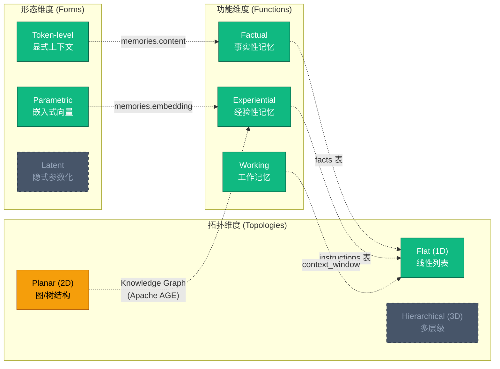

**图例**：🟩 已实现 · 🟨 部分实现 · ⬜ 未来规划

### 2.2 Negentropy 的记忆类型映射

将心理学分类法具体映射到 Negentropy 的 4 种记忆存储：

| 心理学类型 | 学术分类 (功能)<sup>[[3]](#ref3)</sup> | Negentropy 实现 | 存储表 | 关键字段 |
| :-- | :-- | :-- | :-- | :-- |
| 情景记忆 (Episodic) | Experiential (Case-based) | `Memory` ORM | `memories` | content + embedding(1536d) + retention_score |
| 语义记忆 (Semantic) | Factual | `Fact` ORM | `facts` | key-value(JSONB) + confidence + validity |
| 程序性记忆 (Procedural) | Experiential (Skill-based) | `Skill` ORM | `skills` | versioned prompt_template + config_schema |
| 工作记忆 (Working) | Working | `get_context_window()` | SQL 函数 | token budget 动态组装 |

### 2.3 记忆动态学：形成-演化-检索

Agent Memory 的生命周期遵循**形成 (Formation) → 演化 (Evolution) → 检索 (Retrieval)** 三阶段模型<sup>[[3]](#ref3)</sup><sup>[[4]](#ref4)</sup>：

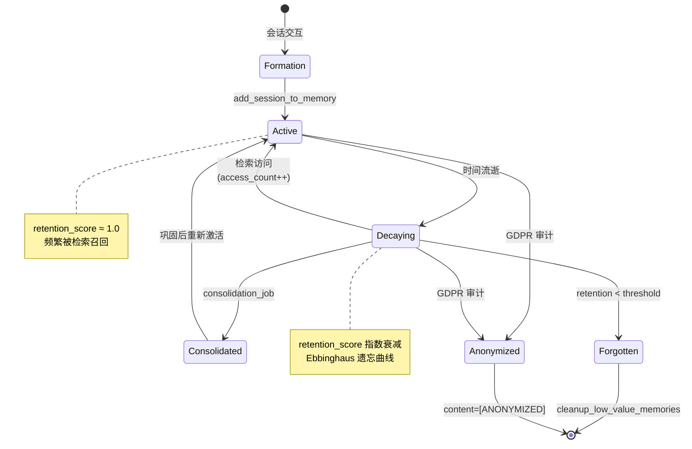

对应的代码路径：

- **Formation**：`PostgresMemoryService.add_session_to_memory()` → `_simple_consolidate()` 或 `consolidation_worker.consolidate()`
- **Evolution**：`MemoryGovernanceService.calculate_retention_score()` + `cleanup_low_value_memories()` SQL 函数
- **Retrieval**：`PostgresMemoryService.search_memory()` 的 4 级回退策略

### 2.4 工业框架对标

Negentropy 的 Memory 实现并非基于独立中间件，而是采用 **PostgreSQL 单栈深度集成**策略。以下为与主流 Agent Memory 框架的能力对标<sup>[[16]](#ref16)</sup><sup>[[17]](#ref17)</sup><sup>[[18]](#ref18)</sup><sup>[[19]](#ref19)</sup>：

| 能力维度 | Negentropy (当前) | Mem0<sup>[[16]](#ref16)</sup> | Cognee<sup>[[17]](#ref17)</sup> | Zep/Graphiti<sup>[[18]](#ref18)</sup> | Letta<sup>[[19]](#ref19)</sup> |
| :-- | :-- | :-- | :-- | :-- | :-- |
| **向量检索** | pgvector HNSW | Qdrant | pgvector | Neo4j HNSW | ANN |
| **知识图谱** | Apache AGE | Neo4j | NetworkX | Neo4j TKG | — |
| **时序建模** | created_at / valid_until | — | — | Bi-temporal edges | — |
| **遗忘机制** | Ebbinghaus decay | Relevance score | Memify prune | — | Self-edit |
| **多智能体** | — | Org scope | — | — | Multi-agent blocks |
| **工作记忆** | get_context_window | — | — | — | Virtual context |
| **GDPR 合规** | Retain/Delete/Anonymize | — | Permissions | — | — |
| **混合检索** | Semantic + BM25 + ilike | Vector + Graph | Vector + Graph | Semantic + BM25 + Graph | Vector |

**Negentropy 的差异化定位**：不引入外部图数据库或独立记忆服务，而是在 PostgreSQL 16+ 上实现向量检索(pgvector)、图存储(Apache AGE)、全文检索(tsvector)、定时调度(pg_cron) 的统一方案，降低运维复杂度和数据一致性风险。

### 2.4 工业实践深度对标：Claude Code 记忆架构

本节基于 [ThreeFish-AI/claude-code](https://github.com/ThreeFish-AI/claude-code)（Claude Code 可运行版逆向工程）和 [shareAI-lab/learn-claude-code](https://github.com/shareAI-lab/learn-claude-code)（从零构建 Agent Harness）的源码分析，提炼可指导 Negentropy 记忆模块的关键设计模式。

#### 2.4.1 AutoDream 记忆整理机制

Claude Code 的 AutoDream 是一个后台记忆整合机制，在会话间自动审查、组织和修剪持久化记忆文件。

**四阶段整理流程**（`src/services/autoDream/consolidationPrompt.ts`）：

1. **Orient（定位）**：`ls` 记忆目录，读取 `MEMORY.md` 索引，浏览现有文件避免重复
2. **Gather（采集）**：按优先级收集新信号（日志 > 过时记忆 > 会话记录），使用窄关键词 grep 而非全文读取
3. **Consolidate（整合）**：合并新信号到现有文件（而非创建近似重复），转相对日期为绝对日期，删除被推翻的事实
4. **Prune（修剪）**：`MEMORY.md` ≤200 行 / 25KB，每条 ≤150 字符

**三重门控调度**（`src/services/autoDream/autoDream.ts`）：

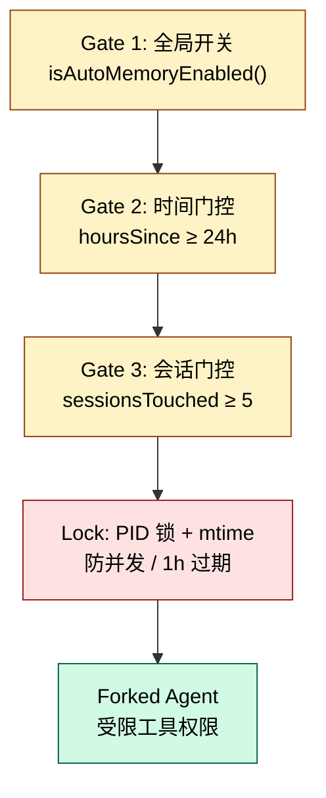

**Negentropy 适配**：PostgreSQL 方案中，Orient 阶段映射为 `_is_duplicate()` 的 cosine similarity 检测；Consolidate 映射为 `_simple_consolidate` 的分段提取+去重；Prune 映射为 `retention_score` 驱动的 `cleanup_low_value_memories()`。门控策略映射到 `AsyncScheduler` 的应用层调度器回退。

#### 2.4.2 三层上下文压缩策略

Claude Code 采用三层递进压缩策略管理有限上下文窗口：

| 层级 | 触发条件 | API 调用 | 来源 |
|:--|:--|:--|:--|
| **MicroCompact** | 每轮静默 | 否 | `src/services/compact/microCompact.ts` |
| **Session Memory Compact** | 自动触发 | 否（用已提取的 SM） | `src/services/compact/sessionMemoryCompact.ts` |
| **传统 API 摘要** | 手动 / 回退 | 是 | `src/services/compact/compact.ts` |

MicroCompact 维护一个白名单（`COMPACTABLE_TOOLS`），将超过时间窗口的工具输出替换为 `[Old tool result content cleared]`。Session Memory Compact 使用已提取的 Session Memory 作为压缩摘要，**无需额外 API 调用**。

**Negentropy 适配**：映射到 `ContextAssembler` 的 token 预算管理——先注入高优先级 Facts（Layer 1），再用最近 Memories 填充（Layer 2），最后用对话历史补充（Layer 3）。

#### 2.4.3 记忆四类型分类法

Claude Code 记忆系统使用封闭的四类型系统（`src/memdir/memoryTypes.ts`）：

| 类型 | 存储内容 | 关键约束 |
|:--|:--|:--|
| `user` | 用户角色、偏好、技术背景 | 只存无法从项目状态推导的信息 |
| `feedback` | 工作方式纠正和确认 | 双通道：纠正 + 确认 |
| `project` | 非代码可推导的项目上下文 | 含 Why + How to apply |
| `reference` | 外部系统指针 | 轻量级指针，非数据副本 |

**漂移防御**（`TRUSTING_RECALL_SECTION`）：系统 Prompt 中设有"Before recommending from memory"——记忆命名了特定函数/文件/标记时，必须先验证其是否仍存在。

**Negentropy 适配**：直接映射到 `facts` 表的 `fact_type` 字段（`preference/profile/rule/custom`），与四类型高度对齐。

### 2.5 工业实践深度对标：Agent Harness 设计模式

基于 [shareAI-lab/learn-claude-code](https://github.com/shareAI-lab/learn-claude-code) 的渐进式 Agent 构建教程，提炼以下设计模式：

**三层压缩管线**（`agents/s06_context_compact.py`）：MicroCompact（替换旧工具输出）→ AutoCompact（token 超阈值时 LLM 摘要）→ ManualCompact（用户手动触发）。Transcripts 保存完整历史到磁盘，"Nothing is truly lost — just moved out of active context."

**Skill 按需加载**（`agents/s05_skill_loading.py`）：两层注入——系统提示放 skill 名称（~100 tokens/skill），tool_result 按需加载完整 body（~2000 tokens）。

**Task Graph 持久化**（`agents/s07_task_system.py`）：JSON 文件 DAG，`blockedBy` 依赖边，`pending → in_progress → completed` 状态机，完成时自动解除依赖。

**Negentropy 吸收**：MicroCompact 思路应用于巩固管线的分段策略（保留最近 K 条完整，旧消息缩略）；Task Graph 模式已在项目 `TaskCreate`/`TaskUpdate` 中实现。

### 2.6 Negentropy 差异化定位总结

| 维度 | Claude Code | mem0 / LangChain | Negentropy |
|:--|:--|:--|:--|
| **存储** | 纯文件系统 | 多后端（向量/图/内存） | PostgreSQL 单栈 |
| **遗忘** | Prune 手动管理 | 无衰减 / 手动管理 | Ebbinghaus 仿生遗忘曲线 |
| **治理** | — | — | GDPR 审计（Retain/Delete/Anonymize） |
| **调度** | GrowthBook 远程配置 + PID 锁 | 应用层调度 | pg_cron + 应用层 AsyncScheduler 回退 |
| **检索** | Sonnet 侧查询筛选 | 向量 / 图 / 混合 | 四级回退（Hybrid→Vector→BM25→ILIKE） |
| **事实提取** | LLM extractMemories | LLM / 模式匹配 | 模式匹配（Phase 1）→ LLM 增强（P1） |

---

## 3. 系统架构

### 3.1 Memory 子系统全景图

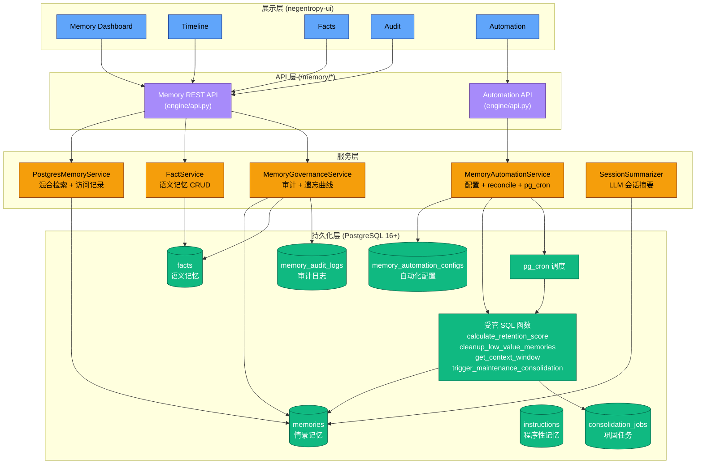

### 3.2 数据模型

Memory 子系统包含 6 张核心表，其 ER 关系如下：

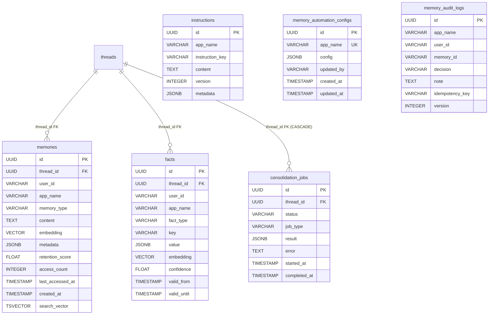

**索引策略**：

| 表 | 索引类型 | 字段 | 用途 |
| :-- | :-- | :-- | :-- |
| memories | HNSW (m=16, ef=64) | embedding | 向量语义检索 |
| memories | GIN | search_vector | BM25 全文检索 |
| memories | B-tree 复合 | (user_id, app_name, created_at DESC) | 情景分块检索 |
| memories | B-tree | retention_score DESC | 衰减排序 |
| facts | GIN | value | JSONB 查询 |
| facts | B-tree 部分 | (user_id, app_name) WHERE valid_until IS NULL | 有效期过滤 |

### 3.3 服务分层架构

| 层级 | 组件 | 职责 | 设计模式 |
| :-- | :-- | :-- | :-- |
| **Factory** | `engine/factories/memory.py` | 按配置创建服务实例 | Strategy + Factory<sup>[[5]](#ref5)</sup> |
| **Service** | `PostgresMemoryService` | 继承 ADK `BaseMemoryService`，实现 `add_session_to_memory` + `search_memory` | Adapter<sup>[[5]](#ref5)</sup> |
| **Service** | `FactService` | Fact CRUD + ON CONFLICT upsert | Repository |
| **Service** | `MemoryGovernanceService` | 审计决策 + 版本控制 + 幂等性 + 遗忘曲线计算 | — |
| **Service** | `MemoryAutomationService` | 配置 SSOT + 函数 reconcile + pg_cron 调度管理 | — |
| **Service** | `SessionSummarizer` | LLM 对话摘要生成 | — |
| **API** | `/memory/*` | RESTful 路由（Dashboard / Timeline / Facts / Search / Audit / Automation） | — |

---

## 4. 记忆形成 (Memory Formation)

Agent Memory 的形成是将实时对话的短期上下文转化为可持久检索的长期记忆的过程<sup>[[3]](#ref3)</sup>。

### 4.1 Session-to-Memory 转化流程

`PostgresMemoryService.add_session_to_memory()` 提供两条路径：

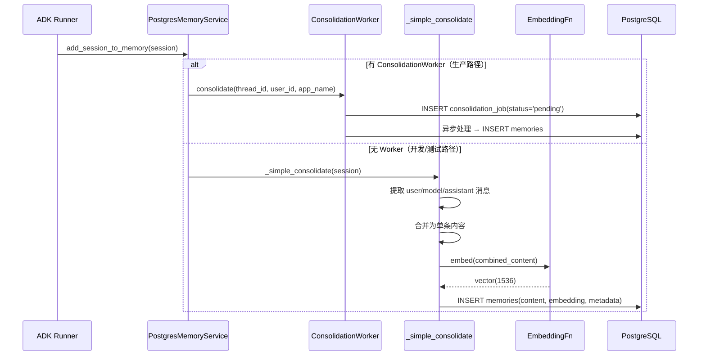

**ADK Event 解析逻辑**：`_simple_consolidate` 支持三种 Content 格式的适配：

1. `Content` 对象（`.parts[].text`）
2. `dict` 类型（`["parts"][]["text"]`）
3. 原始 `str` 类型

### 4.2 事实提取 (Fact Extraction)

Phase 1 采用 `PatternFactExtractor`（基于正则的模式匹配），Phase 2 引入 `LLMFactExtractor`（LLM 驱动的语义提取）作为默认提取器，`PatternFactExtractor` 保留为降级后备。

#### 4.2.1 两级提取策略

| 级别 | 实现类 | 触发条件 | 延迟 | 置信度 |
| :-- | :-- | :-- | :-- | :-- |
| L1 (默认) | `LLMFactExtractor` | LLM 可用 | ~200-500ms | 0.5-1.0 (动态) |
| L2 (降级) | `PatternFactExtractor` | LLM 不可用/失败 | <1ms | 0.7 (固定) |

`LLMFactExtractor` 遵循 [`knowledge/llm_extractors.py`](../apps/negentropy/src/negentropy/knowledge/llm_extractors.py) 的成熟模式：

- 批处理（≤10 turns/批）减少 API 开销
- JSON structured output 保证解析可靠性
- 指数退避重试（max 3 attempts）
- 提取失败自动降级到 L2

`FactService.upsert_fact()` 基于 PostgreSQL 的 `ON CONFLICT DO UPDATE` 实现 upsert 语义：

- **唯一约束**：`(user_id, app_name, fact_type, key)` — 每个用户的每个 key 只有一个有效值
- **向量化**：Fact 可选 embedding，支持语义检索
- **有效期管理**：`valid_from` / `valid_until` 支持时态查询（当前值 vs 历史值）

参考文献 <sup>[[6]](#ref6)</sup><sup>[[29]](#ref29)</sup>。

### 4.3 巩固任务 (Consolidation Jobs)

`consolidation_jobs` 表支持三种任务类型，映射到认知科学中的记忆巩固层级<sup>[[2]](#ref2)</sup>：

| 任务类型 | 认知映射 | 处理策略 |
| :-- | :-- | :-- |
| `fast_replay` | 即时复现 | 会话结束后立即提取关键信息 |
| `deep_reflection` | 深度反思 | 跨会话关联分析，提取模式与规律 |
| `full_consolidation` | 完全巩固 | 全量重建记忆索引，更新 retention_score |

`trigger_maintenance_consolidation()` SQL 函数按 `lookback_interval` 时间窗口自动创建巩固任务：

```sql
-- 为最近活跃的 threads 创建巩固任务（排除已存在的）
INSERT INTO consolidation_jobs (thread_id, job_type, status)
SELECT id, 'full_consolidation', 'pending'
FROM threads
WHERE updated_at > NOW() - p_interval
  AND id NOT IN (
      SELECT thread_id FROM consolidation_jobs
      WHERE created_at > NOW() - p_interval
  )
```

---

## 5. 记忆演化 (Memory Evolution)

记忆不是静态存储，而是一个持续演化的动态系统<sup>[[3]](#ref3)</sup>。MAGMA 架构<sup>[[8]](#ref8)</sup>提出了双流记忆演化（延迟敏感的事件摄入 + 异步结构巩固）的理念。Negentropy 当前以艾宾浩斯遗忘曲线为核心驱动记忆演化。

### 5.1 多因子自适应遗忘曲线模型

基于 Ebbinghaus 遗忘曲线<sup>[[2]](#ref2)</sup>的指数衰减，扩展为 **五因子自适应模型**（ACT-R 认知架构<sup>[[45]](#ref45)</sup> + FadeMem<sup>[[46]](#ref46)</sup>）：

```
retention = min(1.0, time_decay × frequency_boost × type_multiplier × semantic_importance / 5.0 + recency_bonus)

其中:
  time_decay         = e^(-λ_type × days_elapsed)
  frequency_boost    = 1 + ln(1 + access_count)
  type_multiplier    = 记忆类型乘子（偏好 1.3 / 流程 1.2 / 事实 1.15 / 情景 1.0）
  semantic_importance = 1 + min(0.5, related_count × 0.1)
  recency_bonus      = max(0, 1 - days_since_creation / 365) × 0.1
```

**记忆类型衰减率映射**：

| 类型 | λ | 类型乘子 | 理由 |
| :-- | :-- | :-- | :-- |
| preference | 0.05 | 1.3 | 用户偏好应长期保持 |
| procedural | 0.06 | 1.2 | 技能/流程较稳定 |
| fact | 0.08 | 1.15 | 事实中等衰减 |
| episodic | 0.10 | 1.0 | 对话片段衰减最快（基准） |

- **λ_type**：记忆类型特定的衰减常数，覆盖默认 `0.1`
- **days_elapsed**：距最后访问的天数（`last_accessed_at`）
- **access_count**：累计访问次数。频率因子使用**对数增长**，避免高频访问过度膨胀分数
- **related_count**：同 thread 关联的事实和记忆数量（语义重要性）
- **recency_bonus**：1 年内创建的记忆获得额外 [0, 0.1] 加分
- **分数范围**：[0.0, 1.0]

**典型衰减曲线**（λ=0.1, access_count=0）：

| 天数 | time_decay | retention_score |
| :-- | :-- | :-- |
| 0 | 1.00 | 0.20 |
| 7 | 0.50 | 0.10 |
| 14 | 0.25 | 0.05 |
| 30 | 0.05 | 0.01 |

**代码实现**：

- Python：`MemoryGovernanceService.calculate_retention_score()` — [`engine/governance/memory.py`](../apps/negentropy/src/negentropy/engine/governance/memory.py)
- Python：`PostgresMemoryService._calculate_initial_retention()` — [`engine/adapters/postgres/memory_service.py`](../apps/negentropy/src/negentropy/engine/adapters/postgres/memory_service.py)
- SQL：`calculate_retention_score()` plpgsql 函数 — [`schema/hippocampus_schema.sql`](./schema/hippocampus_schema.sql) §5

### 5.2 访问计数强化 (Retrieval-Enhanced Retention)

每次检索召回后，`_record_access()` 异步更新被召回记忆的访问行为，使遗忘曲线动态生效：

```sql
UPDATE memories SET
    access_count = access_count + 1,
    last_accessed_at = NOW()
WHERE id IN (recalled_memory_ids);
```

为何选择对数增长（`1 + ln(1 + n)`）而非线性增长：

- 线性增长（`1 + n`）会导致高频访问的记忆保留分数失控膨胀
- 对数增长在低频区间灵敏，高频区间饱和，符合认知科学中「频率效应递减」的规律

### 5.3 Retention Cleanup 自动化

`cleanup_low_value_memories()` SQL 函数执行两步逻辑：

1. **全量更新 retention_score**：调用 `calculate_retention_score()` 重算所有记忆的保留分数
2. **清理低价值记忆**：删除 `retention_score < threshold` 且 `created_at < NOW() - min_age_days` 的记忆

配置映射关系（详见[第 8 章](#8-memory-automation-控制面)）：

- `retention.decay_lambda` → `calculate_retention_score()` 的 `p_decay_rate` 参数
- `retention.low_retention_threshold` → `cleanup_low_value_memories()` 的 `p_threshold` 参数
- `retention.min_age_days` → `cleanup_low_value_memories()` 的 `p_min_age_days` 参数
- `retention.auto_cleanup_enabled` + `cleanup_schedule` → pg_cron `cleanup_memories` 任务

### 5.4 Memory Consolidation 策略

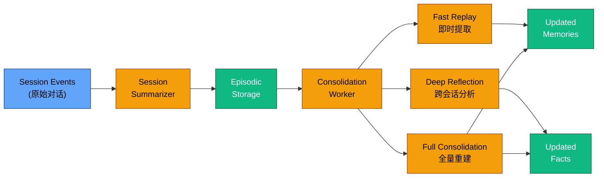

**与学术前沿的对标**：

| 学术方案 | 核心理念 | Negentropy 对应 | 差距 |
| :-- | :-- | :-- | :-- |
| SleepGate<sup>[[22]](#ref22)</sup> | 冲突感知标记 + 遗忘门控 + 巩固压缩 | Ebbinghaus 衰减 + cleanup | 无冲突检测 |
| LightMem<sup>[[23]](#ref23)</sup> | 离线蒸馏/摘要 + 巩固/删除 | SessionSummarizer + consolidation_jobs | 无蒸馏 |
| EverMemOS<sup>[[24]](#ref24)</sup> | 自组织记忆 + 自动聚类 | — | 未实现 |

#### 5.4.1 摘要巩固策略 (Summary Consolidation)

受认知科学记忆再巩固 (Reconsolidation) 理论<sup>[[26]](#ref26)</sup>启发，`MemorySummarizer` 定期将用户的碎片记忆和事实重蒸馏为结构化画像摘要。该策略借鉴：

| 学术/工程来源 | 策略 | Negentropy 适配 |
| :-- | :-- | :-- |
| LightMem<sup>[[23]](#ref23)</sup> | 离线蒸馏压缩 | MemorySummarizer 定期重生成 |
| GraphRAG<sup>[[10]](#ref10)</sup> | 层次化 Map-Reduce 摘要 | LLM 单次生成结构化画像 |
| Claude Code CLAUDE.md | 文件持久化用户摘要 | `memory_summaries` 表缓存 |
| Mem0 user profile<sup>[[29]](#ref29)</sup> | 聚合 preference/profile/rule | 同结构，facts + memories 双源输入 |
| Letta self-edit<sup>[[30]](#ref30)</sup> | Agent 自主编辑 memory block | 摘要由系统自动维护，Agent 只读注入 |

摘要生成流程：

1. 加载用户活跃 facts + 近期高 retention 记忆
2. LLM 生成 ~200-400 tokens 的结构化画像（角色/偏好/风格/规则）
3. upsert 至 `memory_summaries` 表（TTL 24h 可配置）
4. `ContextAssembler` 优先注入摘要，无摘要时降级到原始拼接

参考文献 <sup>[[10]](#ref10)</sup><sup>[[23]](#ref23)</sup><sup>[[26]](#ref26)</sup><sup>[[29]](#ref29)</sup><sup>[[30]](#ref30)</sup>。

### 5.5 记忆重要性评分 (Importance Scoring)

重要性评分（`importance_score`）量化每条记忆的固有价值，与保留分数（动态衰减）互补。基于 ACT-R 认知架构<sup>[[45]](#ref45)</sup>的基础水平激活公式和 FadeMem<sup>[[46]](#ref46)</sup>多因子模型，五因子加权公式：

```
importance = min(1.0,
    base_activation * 0.30 +    # ACT-R log-sum 访问间隔
    access_frequency * 0.25 +   # log(access_count) 归一化
    fact_support * 0.20 +       # 关联事实数 / 10
    type_weight * 0.15 +        # preference(0.9) > procedural(0.75) > fact(0.6) > episodic(0.4)
    recency_bonus * 0.10        # max(0, 1 - days_since_creation / 90)
)
```

**记忆类型重要性权重**：

| 类型 | type_weight | 理由 |
| :-- | :-- | :-- |
| preference | 0.9 | 用户偏好是长期高价值信号 |
| procedural | 0.75 | 技能/流程记忆较稳定 |
| fact | 0.6 | 事实性知识中等价值 |
| episodic | 0.4 | 对话片段价值相对较低（基准） |

**计算时机**：
- 巩固存储时：`PostgresMemoryService._simple_consolidate()` 计算初始评分
- Fact upsert 时：`FactService.upsert_fact()` 计算初始评分
- 访问后：`_record_access()` 增量提升 +0.02

**代码实现**：`MemoryGovernanceService.calculate_importance_score()` — [`engine/governance/memory.py`](../apps/negentropy/src/negentropy/engine/governance/memory.py)

### 5.6 记忆冲突与信念修正 (Conflict Resolution)

当新事实与现有事实矛盾时，基于 AGM 信念修正理论<sup>[[49]](#ref49)</sup>和 Doyle 真值维护系统<sup>[[50]](#ref50)</sup>，通过三阶段检测自动解决冲突。

**检测阶段**：

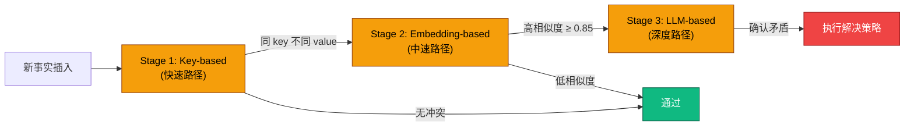

**冲突分类**：

| 类型 | 触发条件 | 说明 |
| :-- | :-- | :-- |
| contradiction | preference/rule 类型同 key 不同 value | 直接矛盾 |
| temporal_update | profile 类型更新 | 个人信息变更 |
| refinement | 其他类型，新置信度 > 旧置信度 | 信息细化 |

**解决策略**：

| 策略 | 行为 | 适用场景 |
| :-- | :-- | :-- |
| supersede | 旧事实标记 `superseded`，新事实取代 | contradiction / temporal_update |
| keep_both | 保留两者，记录冲突 | refinement 且旧置信度更高 |
| merge | 合并两者值 | 管理员手动选择 |

**数据模型**：Fact 新增 `superseded_by`、`status`（active/superseded）、`superseded_at` 字段；新建 `memory_conflicts` 表记录冲突历史。

**代码实现**：`ConflictResolver` — [`engine/governance/conflict_resolver.py`](../apps/negentropy/src/negentropy/engine/governance/conflict_resolver.py)

### 5.7 主动召回 (Proactive Recall)

基于 Spreading Activation Theory<sup>[[51]](#ref51)</sup>和 Context-Dependent Memory<sup>[[52]](#ref52)</sup>，在新会话创建时主动注入高相关性记忆，减少 Agent 的「冷启动」信息缺失。

**复合评分公式**：

```
proactive_rank = importance_score * 0.40
               + recency_score * 0.30
               + frequency_score * 0.20
               + fact_density * 0.10
```

| 因子 | 计算 | 权重 | 含义 |
| :-- | :-- | :-- | :-- |
| importance_score | 五因子重要性评分 | 0.40 | 最重要的排序信号 |
| recency_score | `max(0, 1 - days_since_access / 30)` | 0.30 | 近期访问的记忆更相关 |
| frequency_score | `min(1, log2(1 + access_count) / log2(101))` | 0.20 | 高频访问的记忆更稳定 |
| fact_density | 固定 0.10 | 0.10 | 基础密度因子 |

**缓存策略**：
- TTL 1 小时：`memory_preload_cache` 表按 `(user_id, app_name)` 缓存
- 失效触发：巩固完成、事实插入、冲突解决时自动 `invalidate_cache()`
- 缓存命中直接返回，未命中则计算并写入

**代码实现**：`ProactiveRecallService` — [`engine/adapters/postgres/proactive_recall_service.py`](../apps/negentropy/src/negentropy/engine/adapters/postgres/proactive_recall_service.py)

### 5.8 记忆关联 (Memory Associations)

基于 Associative Memory Theory<sup>[[53]](#ref53)</sup>和 Spreading Activation<sup>[[51]](#ref51)</sup>，自动发现并维护记忆间的关联关系，支持多跳扩展检索。

**四种自动链接策略**：

| 类型 | 触发条件 | 权重 | 说明 |
| :-- | :-- | :-- | :-- |
| semantic | embedding 余弦相似度 > 0.75 | 相似度值 | 语义关联（每新记忆最多 5 条） |
| temporal | 同 thread、30 分钟窗口内 | `1 - Δt / 1800` | 时间邻近关联 |
| thread_shared | 共享 thread_id | 0.6 | 同会话关联 |
| entity | 共享命名实体（依赖 KG） | 0.5 | 实体共现关联 |

**多跳扩展**：

```
起始记忆 → 关联查找 (weight > 0.6) → 追加关联记忆 → 最多 3 跳 → Token 预算控制
```

BFS 遍历关联图，每跳只追加权重大于 0.6 的强关联，最终在 Token 预算内返回扩展上下文。

**数据模型**：`memory_associations` 表，UNIQUE(source_id, target_id, association_type)。

**代码实现**：`AssociationService` — [`engine/adapters/postgres/association_service.py`](../apps/negentropy/src/negentropy/engine/adapters/postgres/association_service.py)

---

## 6. 记忆检索 (Memory Retrieval)

### 6.1 混合检索架构

`PostgresMemoryService.search_memory()` 实现 4 级回退检索策略，确保在不同基础设施条件下都能返回结果：

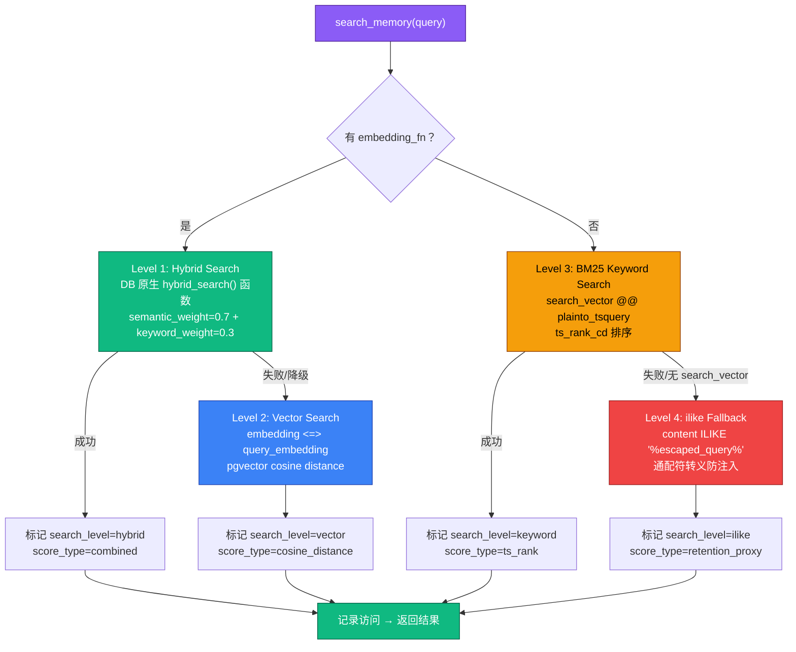

### 6.2 Hybrid Search 实现细节

`_hybrid_search_native()` 调用 PostgreSQL 中预定义的 `hybrid_search()` SQL 函数<sup>[[11]](#ref11)</sup>：

```sql
SELECT id, content, semantic_score, keyword_score, combined_score, metadata
FROM {NEGENTROPY_SCHEMA}.hybrid_search(
    :user_id, :app_name, :query, :embedding::vector(1536),
    :limit, :semantic_weight, :keyword_weight
)
```

关键设计决策：

- **参数化绑定**：embedding 参数通过 `:embedding` 绑定变量传递，而非字符串拼接，防止 SQL 注入
- **Schema 前缀**：统一使用 `NEGENTROPY_SCHEMA` 常量确保与 ORM 一致
- **默认权重**：`semantic_weight=0.7`, `keyword_weight=0.3` — 语义优先，关键词补充

### 6.3 Context Window 组装

`get_context_window()` SQL 函数按 Token Budget 三段式分配组装上下文：

| 分段 | 比例 | 数据源 | 排序策略 |
| :-- | :-- | :-- | :-- |
| Memory | 30% (`memory_ratio`) | memories 表 | `(1 - cosine_distance) × retention_score` |
| History | 50% (`history_ratio`) | events 表 | `created_at DESC`（时间倒序） |
| System | 20% (保留) | — | 系统指令保留空间 |

**Token 估算**：采用 tiktoken BPE 编码器精确计数（Phase 1 曾使用 `LENGTH(content) / 4` 粗略估算）。Python 侧通过 [`TokenCounter`](../apps/negentropy/src/negentropy/engine/utils/token_counter.py) 工具类调用，SQL 函数 `get_context_window()` 保留 `LENGTH/4` 作为 DB 侧快速估算，Python 端后校正。参考文献 <sup>[[25]](#ref25)</sup>。

**Token Budget 硬性校验**（Phase 2++ 增强）：组装完成后校验 `token_count <= budget_total`（memory_ratio + history_ratio）。超标时按行截断（优先保留先召回的高相关性内容），并输出 `context_budget_overflow` 结构化日志。参考 MemGPT<sup>[[7]](#ref7)</sup> Virtual Context Management 的分页截断策略。

**搜索结果标准化**（Phase 2++ 增强）：每条搜索结果携带 `search_level` (hybrid|vector|keyword|ilike)、`score_type` (combined|cosine_distance|ts_rank|retention_proxy) 和 `raw_score` 元数据，通过 `custom_metadata` 传播至 ADK `MemoryEntry`。参考 Observability Engineering<sup>[[48]](#ref48)</sup> 的结构化可观测性理念。

### 6.4 与学术检索范式的对标

| 检索范式 | 论文/框架 | Negentropy 实现 | 演进方向 |
| :-- | :-- | :-- | :-- |
| 自适应遍历 | MAGMA<sup>[[8]](#ref8)</sup> | — | Phase 2: 基于查询意图路由 |
| 时序知识图谱 | Graphiti<sup>[[18]](#ref18)</sup> | created_at 排序 | Phase 2: Bi-temporal edges |
| 向量+图遍历 | GraphRAG<sup>[[10]](#ref10)</sup> | 独立 (pgvector + AGE) | Phase 3: 融合检索 |
| 虚拟上下文管理 | MemGPT/Letta<sup>[[19]](#ref19)</sup> | get_context_window | — (理念相近) |

### 6.5 检索效果反馈闭环 (Retrieval Feedback Loop)

基于 Rocchio 相关性反馈<sup>[[27]](#ref27)</sup>和 Learning-to-Rank<sup>[[28]](#ref28)</sup>范式，建立"检索→记录→反馈→调权"的闭环，量化记忆系统的有效性。

`RetrievalTracker` 在 `search_memory()` 返回结果后自动记录检索事件，并支持显式反馈 API：

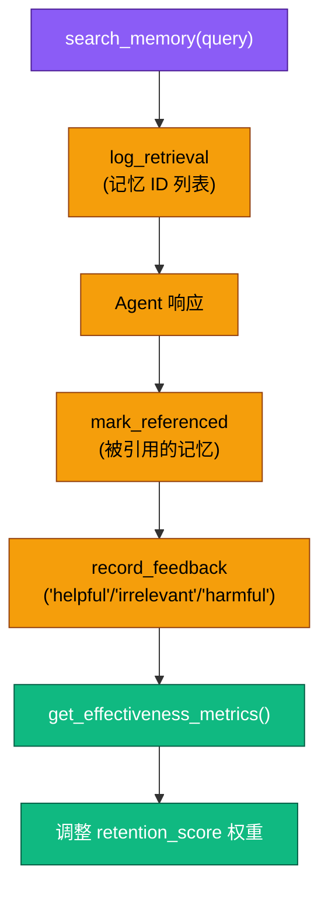

评估维度对齐 LongMemEval<sup>[[9]](#ref9)</sup>：

| 指标 | 计算公式 | 意义 |
| :-- | :-- | :-- |
| Precision@K | 被引用的记忆 / 检索的记忆 | 检索结果的实际利用率 |
| Utilization Rate | 有帮助反馈 / 总反馈 | 用户认可的记忆占比 |
| Noise Rate | 无关反馈 / 总反馈 | 无效检索的噪声占比 |

参考文献 <sup>[[9]](#ref9)</sup><sup>[[27]](#ref27)</sup><sup>[[28]](#ref28)</sup>。

---

## 7. 记忆治理 (Memory Governance)

### 7.1 GDPR 合规审计

`MemoryGovernanceService` 提供三种审计决策，同时处理 Memory 和关联 Fact 确保 GDPR 合规：

| 决策 | Memory 操作 | 关联 Fact 操作 | 说明 |
| :-- | :-- | :-- | :-- |
| `retain` | 保留，不做操作 | 不做操作 | 显式确认保留 |
| `delete` | 物理删除 | 物理删除（同 thread_id） | 完全遗忘权 |
| `anonymize` | content → `[ANONYMIZED]`，清除 embedding + metadata | value → `{"anonymized": True}`，清除 embedding | 保留统计价值，移除 PII |

### 7.2 版本控制与幂等性

- **乐观锁**：`expected_versions` 参数，调用前获取当前版本号，执行时检测冲突
- **幂等性键**：`idempotency_key` 参数，基于 `UniqueConstraint("app_name", "user_id", "memory_id", "idempotency_key")` 防止重复提交
- **审计链**：每次决策创建 `MemoryAuditLog` 记录，version 单调递增

### 7.3 审计工作流

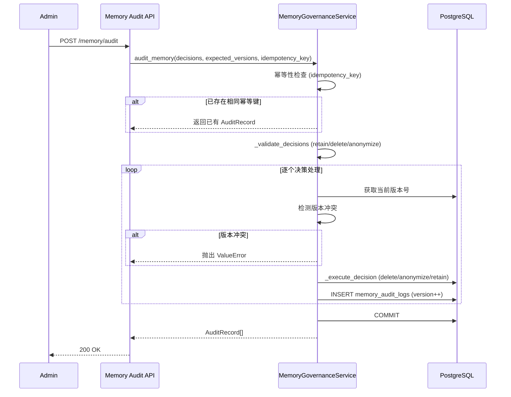

---

## 8. Memory Automation 控制面

本章完整保留原有 Memory Automation 设计与实施文档，是该控制面的权威参考。

### 8.1 定位

Memory Automation 模块负责用户长期记忆的形成、保留、检索与治理的**自动化管控**，区别于静态共享的 Knowledge。为避免控制面与数据面耦合，设有 **Memory / Automation** 二级导航页，统一展示与管理仿生记忆自动化过程，包括：

- 艾宾浩斯遗忘曲线参数
- Memory Retention 清理任务
- Context Assembler 组装预算
- Maintenance Consolidation 周期触发
- PostgreSQL 受管函数与 `pg_cron` 调度状态
- 最近执行日志与受控运维动作

### 8.2 设计原则

- **控制面/数据面分离**：前端不直接编辑任意 SQL，不直接面向 `cron.job` 暴露数据库内部结构。
- **Single Source of Truth**：自动化配置以服务端 `memory_automation_configs` 为唯一事实源，UI 仅读写该契约。
- **受控运维**：只允许对预定义过程执行 `enable / disable / reconcile / run`。
- **渐进降级**：未安装 `pg_cron` 时仍可查看配置和函数定义，但调度能力退化为只读。

当前设计延续了 ADK MemoryService 的"写入/检索解耦"模式与 LangGraph 的"短期状态/长期记忆分层"思路<sup>[[12]](#ref12)</sup><sup>[[13]](#ref13)</sup>：实时响应走检索热路径，深度巩固与周期维护走后台过程。在 PostgreSQL 落地时，调度层以 `pg_cron` 作为可选增强能力，而不是将数据库内部对象直接暴露为前端控制面<sup>[[14]](#ref14)</sup><sup>[[15]](#ref15)</sup>。

### 8.3 核心对象

```mermaid
flowchart TD
    subgraph ControlPlane[Memory Automation Control Plane]
        UI[Memory / Automation]
        API[/memory/automation/*]
        CFG[(memory_automation_configs)]
    end

    subgraph ManagedProcess[Managed Processes]
        RET[Retention Cleanup]
        ASM[Context Assembler]
        CON[Maintenance Consolidation]
    end

    subgraph Postgres[PostgreSQL Runtime]
        FN[Managed SQL Functions]
        CRON[cron.job]
        LOG[cron.job_run_details]
    end

    UI --> API --> CFG
    API --> RET
    API --> ASM
    API --> CON
    RET --> FN
    ASM --> FN
    CON --> FN
    RET --> CRON
    CON --> CRON
    CRON --> LOG
```

### 8.4 受管过程

| 过程 | 受管函数 | 受管任务 | 说明 |
| :-- | :-- | :-- | :-- |
| Retention Cleanup | `calculate_retention_score`, `cleanup_low_value_memories` | `cleanup_memories` | 定时更新 retention 并清理低价值记忆 |
| Context Assembler | `get_context_window` | 无 | 按 token budget 组装记忆与历史 |
| Maintenance Consolidation | `trigger_maintenance_consolidation` | `trigger_consolidation` | 批量创建巩固任务 |

### 8.5 PostgreSQL 初始化前置条件

要让 `Memory / Automation` 进入可用状态，PostgreSQL 至少需要满足以下条件。

#### 8.5.1 最小可用

- 已执行当前 Alembic migration，包含 `negentropy.memory_automation_configs`。
- 仿生记忆依赖表已存在：`memories`、`events`、`threads`、`consolidation_jobs`。
- 已安装 `vector` 扩展，支持 `memories.embedding` 的向量检索。
- 应用连接用户可读取 `pg_extension`，以便后端探测系统能力。
- 应用连接用户需可在 `negentropy` schema 中执行受管函数的 `CREATE OR REPLACE FUNCTION`。

#### 8.5.2 完全可用

在"最小可用"基础上，再补齐以下能力即可让调度控制面可写：

- 已安装 `pg_cron` 扩展。
- 应用连接用户可访问 `cron.job`，用于查看、启停、重建受管任务。
- 应用连接用户可访问 `cron.job_run_details`，用于展示 `Recent Logs`。
- 应用连接用户可执行 `cron.schedule` 与 `cron.unschedule`，用于创建、更新与移除受管任务。

说明：

- `pg_cron` 是增强能力，不是 Memory Automation 的硬依赖；未安装时页面仍可查看配置和函数状态。
- `Recent Logs` 依赖 `cron.job_run_details`；日志为空不必然表示任务未运行，也可能是日志表不可访问。

### 8.6 PostgreSQL 初始化步骤

推荐按"迁移 -> 能力检查 -> 打开控制面 -> 保存并同步 -> 验证"的顺序完成初始化。

#### 8.6.1 执行 migration

```bash
uv run --project apps/negentropy alembic upgrade head
```

执行后，至少应确认 `memory_automation_configs` 已创建：

```sql
SELECT table_schema, table_name
FROM information_schema.tables
WHERE table_schema = 'negentropy'
  AND table_name = 'memory_automation_configs';
```

#### 8.6.2 检查底层扩展

```sql
SELECT extname, extversion
FROM pg_extension
WHERE extname IN ('vector', 'pg_cron')
ORDER BY extname;
```

判定原则：

- `vector` 缺失：Memory 检索链路本身不完整，应先补齐。
- `pg_cron` 缺失：Automation 页面进入"调度只读"降级态，但函数与配置仍可用。

#### 8.6.3 检查受管函数依赖表

```sql
SELECT table_name
FROM information_schema.tables
WHERE table_schema = 'negentropy'
  AND table_name IN ('memories', 'events', 'threads', 'consolidation_jobs')
ORDER BY table_name;
```

这些表分别支撑：

- `memories`：长期记忆本体与 retention 清理。
- `events`、`threads`：`get_context_window()` 的历史拼装。
- `consolidation_jobs`：周期性巩固任务投递。

#### 8.6.4 打开 Automation 页面并执行一次"保存并同步"

推荐使用管理员账号进入 `Memory / Automation` 页面执行一次"保存并同步"。当前实现会：

- 始终把配置写入 `negentropy.memory_automation_configs`
- 始终 reconcile 受管函数
- 仅在 `pg_cron` 可用时 reconcile 受管任务

这意味着初始化主路径应以控制面为准，而不是人工先手写完整 SQL。

这一顺序对应"配置为事实源、数据库对象为受管派生物"的控制面模式，可降低函数定义和调度命令被人工漂移改坏的概率<sup>[[12]](#ref12)</sup><sup>[[15]](#ref15)</sup>。

如果"保存并同步"失败，应优先检查两类权限：

- `negentropy` schema 中受管函数的创建或替换权限。
- `cron.schedule` / `cron.unschedule` 的执行权限，而不只是 `pg_cron` 是否已安装。

### 8.7 系统能力与状态判断

Automation 页面中的系统能力对应后端运行时探测结果：

| 能力位 | 含义 | 对页面的影响 |
| :-- | :-- | :-- |
| `pg_cron_installed` | 是否安装了 `pg_cron` 扩展 | 决定是否具备调度能力基础 |
| `pg_cron_available` | 是否可访问 `cron.job` | 决定 `Managed Jobs` 是否可写 |
| `pg_cron_logs_accessible` | 是否可访问 `cron.job_run_details` | 决定 `Recent Logs` 是否可见 |

常见状态解释：

- `healthy`：配置、函数、任务、日志能力都满足当前期望。
- `degraded`：至少一个能力位、函数状态或 job 状态不满足当前期望，但控制面仍可部分使用。

### 8.8 一期接口

- `GET /memory/automation`
- `GET /memory/automation/logs`
- `POST /memory/automation/config`
- `POST /memory/automation/jobs/{job_key}/enable`
- `POST /memory/automation/jobs/{job_key}/disable`
- `POST /memory/automation/jobs/{job_key}/reconcile`
- `POST /memory/automation/jobs/{job_key}/run`

### 8.9 配置到运行时的映射

- `retention.decay_lambda`：映射到 `calculate_retention_score()` 与 `cleanup_low_value_memories()` 的默认衰减参数。
- `retention.low_retention_threshold` / `retention.min_age_days`：映射到 `cleanup_low_value_memories()` 的默认清理阈值与最小保留天数。
- `context_assembler.max_tokens` / `memory_ratio` / `history_ratio`：映射到 `get_context_window()` 的默认参数，控制记忆与历史的预算切分。
- `consolidation.lookback_interval`：映射到 `trigger_maintenance_consolidation()` 的默认时间窗口。
- `retention.auto_cleanup_enabled` / `consolidation.enabled` 与各自 `schedule`：映射到受管 `pg_cron` 任务是否启用及其 cron 表达式。

### 8.10 过程摘要与启动路径

#### 8.10.1 Retention Cleanup

- 目标：基于艾宾浩斯遗忘曲线更新 retention 并清理低价值记忆。
- 受管函数：`calculate_retention_score()`、`cleanup_low_value_memories()`
- 受管任务：`cleanup_memories`
- 启动方式：
  - 在 `Automation Config` 中设置 `retention.decay_lambda`
  - 设置 `low_retention_threshold`、`min_age_days`
  - 打开 `auto_cleanup_enabled`
  - 设置 `cleanup_schedule`
- 验证方式：
  - `Managed Jobs` 中出现 `cleanup_memories`
  - `command` 包含当前阈值、天数与衰减系数

#### 8.10.2 Context Assembler

- 目标：在检索路径中按 token budget 组装长期记忆与近期历史。
- 受管函数：`get_context_window()`
- 受管任务：无
- 启动方式：
  - 在 `Automation Config` 中设置 `max_tokens`
  - 设置 `memory_ratio` 与 `history_ratio`
  - 点击"保存并同步"以更新函数默认参数
- 验证方式：
  - `Functions` 中的 `get_context_window` 定义与当前配置一致

说明：Context Assembler 没有独立 cron 任务，它通过函数默认参数参与实时检索，而不是后台调度。

#### 8.10.3 Maintenance Consolidation

- 目标：按时间窗口批量创建巩固任务。
- 受管函数：`trigger_maintenance_consolidation()`
- 受管任务：`trigger_consolidation`
- 启动方式：
  - 在 `Automation Config` 中设置 `consolidation.schedule`
  - 设置 `lookback_interval`
  - 打开 `consolidation.enabled`
- 验证方式：
  - `Managed Jobs` 中出现 `trigger_consolidation`
  - `command` 中包含当前 `lookback_interval`

### 8.11 页面使用说明

#### Automation Config

`Automation Config` 是唯一可写的业务配置入口，其底层权威存储为 `negentropy.memory_automation_configs`。

"保存并同步"的效果如下：

- 始终保存当前配置快照。
- 始终按当前 effective config 重新生成受管函数定义。
- 仅在 `pg_cron` 可用时重建 `cleanup_memories` 与 `trigger_consolidation`。

建议：

- 修改 `Context Assembler` 参数后，优先在 `Functions` 面板核对 `get_context_window()` 是否已更新。
- 修改调度参数后，优先在 `Managed Jobs.command` 中核对命令是否与当前配置一致。

#### Managed Jobs

`Managed Jobs` 只管理两个预定义 job key：

- `cleanup_memories`
- `trigger_consolidation`

按钮行为如下：

- `启用/停用`：切换 enabled 配置，并尝试同步数据库中的 cron 任务。
- `重建`：按当前 effective config 重新生成 schedule 与 command。
- `手动触发`：立即执行当前 job 对应 SQL，不等待 cron。

状态语义：

- `scheduled`：数据库中的 job 与当前期望一致。
- `disabled`：当前配置未启用该 job。
- `missing`：当前配置要求启用，但数据库中未找到对应 job。
- `drifted`：数据库中的 schedule 或 command 与当前配置不一致。
- `degraded`：`pg_cron` 不可访问，页面只能展示期望态。

#### Functions

`Functions` 面板只展示受管函数，而不是数据库中的全部函数。

状态语义：

- `present`：数据库函数定义与当前 effective config 生成的期望 SQL 一致。
- `missing`：数据库中未找到该函数。
- `drifted`：数据库中的函数定义与当前配置期望不一致。

建议把这里作为"配置是否真正下沉到 PostgreSQL"的最终核验面。

#### Recent Logs

`Recent Logs` 的数据源是 `cron.job_run_details`。

需要注意：

- 日志为空不必然表示没有任务运行。
- 首次配置后为空属于正常现象。
- 如果 `pg_cron` 未安装，或日志表不可访问，页面会返回空列表并给出降级原因。
- 日志更适合用于核对最近一次执行结果，不应视为长期审计存储。

### 8.12 PostgreSQL 操作示例

以下 SQL 主要用于验证与排障；日常初始化优先通过 Automation 控制面执行。

#### 检查扩展

```sql
SELECT extname, extversion
FROM pg_extension
WHERE extname IN ('vector', 'pg_cron');
```

#### 检查受管函数

```sql
SELECT p.proname AS function_name
FROM pg_proc p
JOIN pg_namespace n ON p.pronamespace = n.oid
WHERE n.nspname = 'negentropy'
  AND p.proname IN (
    'calculate_retention_score',
    'cleanup_low_value_memories',
    'get_context_window',
    'trigger_maintenance_consolidation'
  )
ORDER BY p.proname;
```

#### 检查受管任务

```sql
SELECT jobid, jobname, schedule, command, active
FROM cron.job
WHERE jobname IN ('cleanup_memories', 'trigger_consolidation')
ORDER BY jobname;
```

#### 查看最近日志

```sql
SELECT jobid, runid, status, return_message, start_time, end_time
FROM cron.job_run_details
ORDER BY start_time DESC
LIMIT 10;
```

#### 手动验证受管过程

```sql
SELECT negentropy.cleanup_low_value_memories(0.1, 7, 0.1);
SELECT negentropy.trigger_maintenance_consolidation('1 hour'::interval);
```

说明：

- 手动执行适合验证函数本身是否可用，不替代 `Managed Jobs` 的长期调度。
- `get_context_window()` 依赖向量参数与业务上下文，通常应通过服务侧检索路径验证，而不是手工拼接 SQL。

### 8.13 降级矩阵与排障

| 场景 | 配置查看 | 函数状态 | 调度任务查看 | 调度动作 | 执行日志 |
| :-- | :-- | :-- | :-- | :-- | :-- |
| `pg_cron` 已安装且可访问 | 可用 | 可用 | 可用 | 可用 | 可用 |
| `pg_cron` 未安装 | 可用 | 可用 | 降级 | 只读禁用 | 空列表 |
| `pg_cron` 已安装但 `cron.job` 不可访问 | 可用 | 可用 | 降级 | 只读禁用 | 降级 |
| `pg_cron` 已安装但 `cron.job_run_details` 不可访问 | 可用 | 可用 | 可用 | 可用 | 空列表 + 降级告警 |

说明：

- "降级"表示 snapshot 仍然返回，但 `health.status` 为 `degraded`，并在 `degraded_reasons` 中给出原因。
- 调度相关动作包括 `enable / disable / reconcile / run`，在调度能力不可用时统一进入只读。

常见排障建议：

- `pg_cron_not_installed`
  - 执行 `SELECT * FROM pg_extension WHERE extname = 'pg_cron';`
  - 若未安装，页面仍可使用配置与函数控制面，但调度保持只读。
- `pg_cron_unavailable`
  - 优先检查应用连接用户是否可访问 `cron.job`。
  - 如果 `cron.job` 可读但启用、重建仍失败，再检查 `cron.schedule` / `cron.unschedule` 的执行权限。
  - 若扩展已安装但权限不足，`Managed Jobs` 会显示降级态。
- `pg_cron_logs_unavailable`
  - 检查 `cron.job_run_details` 是否存在且可读。
  - Recent Logs 为空时，不应直接判定调度未执行。
- `function_drifted`
  - 优先执行一次"保存并同步"，让后端按当前配置重建受管函数。
- `job_drifted`
  - 对照 `Managed Jobs.command` 与 `cron.job.command`，确认 schedule 与参数是否被外部改动。

### 8.14 实施记录

- 新增 Memory Automation service，封装配置持久化、函数 reconcile、`pg_cron` 任务管理与日志读取。
- 新增 `memory_automation_configs` 表，保存后端托管配置。
- 新增 `/memory/automation` 页面与 API 代理，管理员可对白盒化过程执行受控运维动作。
- 将 `/memory` 现有 `policies` 摘要改为从 automation 配置派生，避免双源。

### 8.15 验证清单

- Memory 主导航出现 `Automation` 二级入口。
- 管理员可查看配置、函数、任务与日志。
- 保存配置后自动 reconcile 预定义函数，并在调度可用时同步 reconcile 预定义任务。
- `pg_cron` 未安装或不可访问时页面进入降级只读态，但配置与函数状态仍可查看。
- 现有 Dashboard / Timeline / Facts / Audit 行为不回归。

---

## 9. PostgreSQL 阶段：当前实现深度解析

### 9.1 数据库存储设计

当前 Memory 系统完全基于 PostgreSQL 16+ 实现，利用以下扩展能力：

| 扩展 | 版本 | 用途 |
| :-- | :-- | :-- |
| **pgvector** | 0.7+ | HNSW 向量索引 + cosine distance |
| **pg_cron** | 1.6+ | 定时任务调度（可选增强） |
| **tsvector** | 内置 | BM25 全文检索 |

DDL 原型参见 [`schema/hippocampus_schema.sql`](./schema/hippocampus_schema.sql)（历史参考，当前运行时以 Alembic migration 和 Automation 控制面为准）。

### 9.2 Service 实现分析

| Service | 代码行数 | 核心方法 | 复杂度焦点 |
| :-- | :-- | :-- | :-- |
| `PostgresMemoryService` | ~487 行 | `add_session_to_memory`, `search_memory`, `_hybrid_search_native`, `_vector_search`, `_keyword_search`, `_ilike_search`, `_record_access` | 4 级检索回退 + ADK Event 三格式适配 |
| `MemoryAutomationService` | ~26 KB | `get_snapshot`, `save_config`, `reconcile_functions`, `reconcile_jobs`, `run_job` | 系统能力探测 + SQL 函数动态生成 |
| `MemoryGovernanceService` | ~518 行 | `audit_memory`, `calculate_retention_score`, `calculate_importance_score`, `_execute_decision` | 版本冲突 + 重要性评分 + 幂等性 + GDPR 级联 |
| `ConflictResolver` | ~200 行 | `detect_and_resolve`, `_classify_conflict`, `manual_resolve` | AGM 信念修正 + 三阶段检测 |
| `ProactiveRecallService` | ~240 行 | `get_or_compute_preload`, `invalidate_cache` | 复合评分预加载 + TTL 缓存 |
| `AssociationService` | ~300 行 | `auto_link_memory`, `get_associations`, `expand_multi_hop` | 自动链接 + 多跳扩展 |

### 9.3 API 端点全景

| 路由 | 方法 | 功能 | 认证要求 |
| :-- | :-- | :-- | :-- |
| `/memory/dashboard` | GET | 指标概览 | admin |
| `/memory/list` | GET | 记忆时间线 | auth |
| `/memory/facts` | GET | 用户 Facts (`?user_id=` Query 参数) | auth |
| `/memory/facts/search` | POST | Facts 语义检索 | auth |
| `/memory/search` | POST | 混合检索 | auth |
| `/memory/audit` | POST | 审计决策 | admin |
| `/memory/audit/history` | GET | 审计历史 (`?user_id=` Query 参数) | admin |
| `/memory/automation` | GET | Automation 快照 | admin |
| `/memory/automation/config` | POST | 保存并同步配置 | admin |
| `/memory/automation/logs` | GET | 执行日志 | admin |
| `/memory/automation/jobs/{key}/enable` | POST | 启用任务 | admin |
| `/memory/automation/jobs/{key}/disable` | POST | 停用任务 | admin |
| `/memory/automation/jobs/{key}/reconcile` | POST | 重建任务 | admin |
| `/memory/automation/jobs/{key}/run` | POST | 手动触发 | admin |
| `/memory/conflicts` | GET | 冲突列表 (`?app_name=&user_id=&resolution=`) | admin |
| `/memory/conflicts/{conflict_id}/resolve` | POST | 手动解决冲突 | admin |
| `/memory/facts/{fact_id}/history` | GET | 事实版本链 | admin |
| `/memory/proactive/{user_id}` | POST | 触发主动召回计算 | auth |
| `/memory/proactive/{user_id}` | GET | 获取预加载缓存 | auth |
| `/memory/{memory_id}/associations` | GET | 记忆关联列表 | auth |
| `/memory/associations` | POST | 创建手动关联 | auth |
| `/memory/associations/{association_id}` | DELETE | 删除关联 | auth |

### 9.4 当前阶段的局限性

| 局限 | 影响 | 演进方向 |
| :-- | :-- | :-- |
| 无时序建模 | 仅 `created_at` / `valid_until`，非 bi-temporal | Phase 2: Temporal edges |
| 无组织级记忆共享 | 记忆严格按 user_id 隔离 | Phase 3: Organization scope |
| 图谱与记忆未打通 | Knowledge Graph (AGE) 在感知系部，Memory 在内化系部 | Phase 2: Memory Graph |
| 无多智能体协作 | 单 Agent 记忆空间 | Phase 3: Multi-agent memory |
| ~~巩固策略简单~~ | ~~无冲突感知、无摘要蒸馏~~ | ✅ Phase 3 已实现冲突检测 + 摘要巩固 |
| ~~Token 估算粗略~~ | ~~`LENGTH/4` 简单估算~~ | ✅ Phase 2+ 已引入 tiktoken 精确计数 |
| ~~无记忆重要性评分~~ | ~~所有记忆同等对待~~ | ✅ Phase 3 已实现 ACT-R 五因子评分 |
| ~~无主动召回~~ | ~~新会话冷启动~~ | ✅ Phase 3 已实现复合评分预加载 |
| ~~无记忆关联~~ | ~~记忆孤立，无法多跳检索~~ | ✅ Phase 3 已实现自动链接 + 多跳扩展 |

---

## 10. 终态愿景：多维记忆演进路线图

### 10.1 演进路线总览

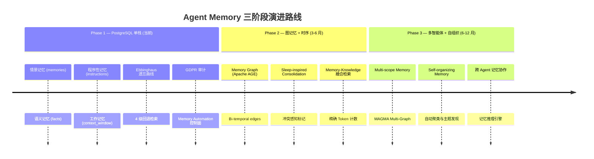

### 10.2 Phase 2: 图记忆与时序增强

#### Memory Graph

将 Memory 之间的语义关联存储为 Apache AGE 图边，复用 [`knowledge-graph.md`](./knowledge-graph.md) 的 AGE 基础设施：

- **节点**：每条 Memory 和 Fact 作为图节点
- **边**：因果关系（`CAUSES`）、时序关系（`FOLLOWS`）、主题关联（`RELATED_TO`）
- **查询**：Cypher 图遍历实现「关联记忆发现」—— 给定一条记忆，找到所有语义关联的记忆链

#### Bi-Temporal Model

参考 Zep/Graphiti<sup>[[18]](#ref18)</sup>的双时态模型，为记忆边引入时间有效性：

| 时间维度 | 含义 | 字段 |
| :-- | :-- | :-- |
| System Time | 记忆何时被系统记录 | `t_created`, `t_expired` |
| Valid Time | 记忆所描述的事实何时有效 | `t_valid_from`, `t_valid_until` |

优势：支持「当前什么是真的」和「过去某时刻什么是真的」两类时态查询。

#### Sleep-Inspired Consolidation

引入类 SleepGate<sup>[[22]](#ref22)</sup>的三阶段巩固机制：

1. **冲突感知标记**：检测新记忆与现有记忆的矛盾
2. **选择性遗忘**：基于冲突检测结果，自动失效/压缩过时记忆
3. **巩固压缩**：合并相关记忆为更紧凑的摘要表示

### 10.3 Phase 3: 多智能体与自组织

#### Multi-Scope Memory

参考 Mem0<sup>[[16]](#ref16)</sup>的四层作用域模型：

| 作用域 | 生命周期 | Negentropy 对应 |
| :-- | :-- | :-- |
| Conversation | 单轮对话 | ADK Session state |
| Session | 会话级 | threads 表 |
| User | 用户级长期 | memories / facts 表（当前） |
| Organization | 组织级共享 | **新增**：org_memories 表 |

#### MAGMA-Style Multi-Graph

参考 MAGMA<sup>[[8]](#ref8)</sup>的四图架构，将每条记忆同时映射到：

1. **Semantic Graph**：语义相似度边
2. **Temporal Graph**：时间顺序边
3. **Causal Graph**：因果关系边
4. **Entity Graph**：实体共现边

配合**自适应遍历策略 (Adaptive Traversal Policy)**，根据查询意图选择最相关的图视图进行检索。

#### Self-Organizing Memory

参考 EverMemOS<sup>[[24]](#ref24)</sup>，实现记忆的自组织能力：

- **自动聚类**：基于嵌入向量的在线聚类，发现记忆主题
- **冲突消解**：跨记忆矛盾检测与自动消解
- **重要性自适应**：超越固定 Ebbinghaus 公式，基于实际使用模式动态调整权重

### 10.4 技术决策记录 (ADR)

| ADR | 决策 | 理由 | 切换条件 |
| :-- | :-- | :-- | :-- |
| ADR-001 | PostgreSQL 单栈而非独立图库 | 零增量运维 + 数据一致性 + SQL+图混合查询 | 图遍历 4+ 跳延迟不可接受时评估 Neo4j |
| ADR-002 | Ebbinghaus 指数衰减而非线性/阶梯 | 符合认知科学 + 数学可导 + 参数可调 | 需要多维衰减因子时引入强化学习模型 |
| ADR-003 | pg_cron 而非应用层调度器 | 数据局部性 + 无额外进程 + 事务内调度 | 需跨数据库调度或复杂 DAG 时引入 Celery |
| ADR-004 | 4 级回退而非单一检索策略 | 最大化可用性 + 渐进降级 | Hybrid Search 稳定后可考虑收敛到 2 级 |

---

## 11. 价值量化体系 (Value Quantification System)

### 11.1 设计哲学

遵循 [AGENTS.md](../AGENTS.md) 的**反馈闭环 (Feedback Loops)** 原则：每一项工程行动都应产生可观测的反馈信号。Memory 价值量化体系的目标是：证明 Memory 子系统对 Agent 智能水平的**可测量贡献**。

### 11.2 核心指标四层模型

| 层级 | 指标名称 | 计算方式 | 目标 | 数据源 |
| :-- | :-- | :-- | :-- | :-- |
| **L0 基础设施** | 检索延迟 P95 | search_memory 端到端耗时 | < 100ms | Langfuse trace |
| L0 | 向量化成功率 | embedding_success / total | > 99% | 结构化日志 |
| L0 | Automation 健康度 | healthy / (healthy + degraded) | > 95% | automation API |
| **L1 记忆质量** | 平均 retention_score | `AVG(retention_score)` | > 0.3 | memories 表 |
| L1 | 记忆覆盖率 | users_with_memory / total_users | > 80% | memories 表 |
| L1 | Fact 活跃率 | valid_facts / total_facts | > 70% | facts 表 |
| **L2 检索效果** | 检索命中率 (HitRate@10) | queries_with_results / total_queries | > 85% | search 日志 |
| L2 | 上下文利用率 | recalled_tokens / budget_tokens | 40-70% | context_window |
| L2 | 检索回退率 | fallback_count / total_search | < 10% | search 日志 |
| **L3 业务影响** | 对话满意度提升 | with_memory_rating - baseline | > +15% | 用户反馈 |
| L3 | 重复提问减少率 | repeat_qa_reduction | > 30% | 对话分析 |
| L3 | 个性化响应准确率 | personalized_correct / total | > 80% | 人工评估 |

### 11.3 LongMemEval 基准对标

参考 LongMemEval<sup>[[9]](#ref9)</sup>（ICLR 2025）的 5 项核心能力维度，设计 Negentropy 的记忆能力评估方案：

| 能力维度 | 评估目标 | Negentropy 评估方案 |
| :-- | :-- | :-- |
| **信息抽取** | 从历史中准确提取特定信息 | 构造测试用例：跨 N 个 session 检索特定 Fact |
| **多会话推理** | 跨多个 session 关联推理 | 构造需要 2+ session 信息才能回答的问题 |
| **时序推理** | 理解时间顺序 | 测试 `valid_from / valid_until` 的时态查询准确率 |
| **知识更新** | 正确处理信息变更 | 测试 Fact upsert 后检索返回最新值 |
| **审慎拒答** | 对无记忆支撑的问题保持审慎 | 测试无相关记忆时返回空结果的比率 |

### 11.4 可观测性仪表盘设计

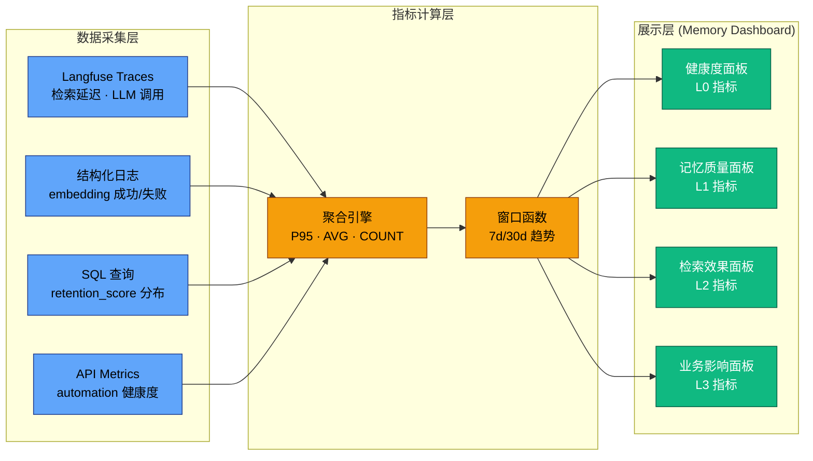

### 11.5 反馈闭环：指标驱动的自动调参

Memory 价值量化不仅用于展示，更构成**自我进化 (Evolutionary Design)** 闭环：

| 触发指标 | 调参动作 | 闭环目标 |
| :-- | :-- | :-- |
| 检索命中率 < 80% | 降低 `low_retention_threshold` | 保留更多记忆提高召回 |
| 检索命中率 > 95% + 记忆增长率过快 | 提高 `low_retention_threshold` | 精简记忆降低噪声 |
| 检索回退率 > 15% | 检查 pgvector/tsvector 健康 | 确保 Hybrid Search 可用 |
| 上下文利用率 < 30% | 提高 `memory_ratio` | 增加记忆在上下文中的占比 |
| 重复提问率未下降 | 调整巩固策略 | 确保关键信息被记忆 |

---

## 12. 安全与合规

### 12.1 数据安全

- **SQL 注入防护**：embedding 参数通过 `:embedding` 参数化绑定传递，杜绝字符串拼接
- **通配符注入防护**：ilike 回退中使用 `re.sub(r"([%_])", r"\\\1", query)` 转义 LIKE 特殊字符
- **Schema 隔离**：所有表和函数统一使用 `NEGENTROPY_SCHEMA` 常量前缀

### 12.2 GDPR 合规矩阵

| 数据主体权利 | Memory 对应操作 | 实现方式 |
| :-- | :-- | :-- |
| 访问权 (Right of Access) | `GET /memory/list` + `GET /memory/facts` | 用户可查看个人记忆 |
| 删除权 (Right to Erasure) | `POST /memory/audit` → `decision: "delete"` | 物理删除 Memory + 关联 Fact |
| 限制处理权 | `POST /memory/audit` → `decision: "anonymize"` | 内容替换 + 清除向量 |
| 数据可携带权 | `GET /memory/list` (JSON 格式) | 可导出个人记忆 |

### 12.3 权限模型

| 角色 | 可访问功能 |
| :-- | :-- |
| `admin` | Memory Dashboard + Audit + Automation（全功能） |
| `auth` (已认证用户) | 个人 Timeline + Facts + Search |
| 数据库用户 | `negentropy` schema 函数创建 + `cron.*` 访问（Automation 前置条件） |

---

## 13. 测试策略

### 13.1 单元测试

```bash
cd apps/negentropy
uv run pytest tests/unit_tests/engine/test_memory_governance.py -v
```

覆盖场景：

- 遗忘曲线计算：新鲜记忆 / 高频访问 / 长期未访问 / 指数衰减公式 / 边界值 / 自定义 λ
- 审计决策逻辑：retain / delete / anonymize / 版本冲突 / 幂等性

### 13.2 集成测试

```bash
cd apps/negentropy
uv run pytest tests/integration_tests/engine/adapters/postgres/test_memory_service.py -v
uv run pytest tests/unit_tests/engine/test_memory_automation_service.py -v
```

覆盖场景：

- PostgreSQL 混合检索（需要 pgvector）
- Fact upsert 唯一约束
- Automation 配置持久化与 reconcile

### 13.3 基准测试方案

| 场景 | 目标 | 方法 |
| :-- | :-- | :-- |
| 检索延迟 | P95 < 100ms | 10K 记忆 × 100 并发查询 |
| 巩固吞吐量 | > 1000 memories/min | 批量 consolidation_job 执行 |
| LongMemEval 适配 | 5 项能力维度基线 | 构造 Negentropy-specific 评测集 |

---

## 14. 相关文档

- Memory 与 Knowledge 职责边界：[`knowledges.md`](./knowledges.md)
- 知识图谱技术方案：[`knowledge-graph.md`](./knowledge-graph.md)
- 系统架构总览：[`framework.md`](./framework.md)
- DDL 原型（历史参考）：[`schema/hippocampus_schema.sql`](./schema/hippocampus_schema.sql)
- 项目初始化与目录约定：[`project-initialization.md`](./project-initialization.md)
- 外部设计文档：[020-the-hippocampus.md](https://github.com/ThreeFish-AI/agentic-ai-cognizes/blob/master/docs/design/020-the-hippocampus.md)

---

## 15. 参考文献

### 学术论文

<a id="ref1"></a>[1] ThreeFish-AI, "Negentropy: One Root, Five Wings Agent System," _GitHub Repository_, 2026.

<a id="ref2"></a>[2] H. Ebbinghaus, "Memory: A Contribution to Experimental Psychology," _Teachers College, Columbia University_, 1885/1913.

<a id="ref3"></a>[3] S. Maharana et al., "Memory in the age of AI agents: A survey," _arXiv preprint arXiv:2512.13564_, Dec. 2025.

<a id="ref4"></a>[4] Z. Zhang et al., "A survey on the memory mechanism of large language model based agents," _ACM Trans. Inf. Syst._, 2025.

<a id="ref5"></a>[5] E. Gamma, R. Helm, R. Johnson, and J. Vlissides, "Design Patterns: Elements of Reusable Object-Oriented Software," _Addison-Wesley_, 1994.

<a id="ref6"></a>[6] K. Shinn et al., "Reflexion: Language agents with verbal reinforcement learning," _NeurIPS_, 2023.

<a id="ref7"></a>[7] C. Packer et al., "MemGPT: Towards LLMs as operating systems," _arXiv preprint arXiv:2310.08560_, 2023.

<a id="ref8"></a>[8] T. Zhu et al., "MAGMA: A multi-graph based agentic memory architecture for AI agents," _arXiv preprint arXiv:2601.03236_, Jan. 2026.

<a id="ref9"></a>[9] D. Wu et al., "LongMemEval: Benchmarking chat assistants on long-term interactive memory," _ICLR_, 2025.

<a id="ref10"></a>[10] D. Edge et al., "From local to global: A Graph RAG approach to query-focused summarization," _arXiv preprint arXiv:2404.16130_, 2024.

<a id="ref11"></a>[11] G. V. Cormack, C. L. A. Clarke, and S. Buettcher, "Reciprocal rank fusion outperforms condorcet and individual rank learning methods," _SIGIR'09_, 2009.

### 工业框架

<a id="ref12"></a>[12] Google, "Memory: Long-term knowledge with MemoryService," _Agent Development Kit Documentation_, 2026. [Online]. Available: https://google.github.io/adk-docs/sessions/memory/

<a id="ref13"></a>[13] LangChain, "Memory," _LangGraph Documentation_, 2026. [Online]. Available: https://langchain-ai.github.io/langgraph/concepts/memory/

<a id="ref14"></a>[14] Citus Data, "pg_cron," _GitHub README_, 2026. [Online]. Available: https://github.com/citusdata/pg_cron

<a id="ref15"></a>[15] ThreeFish-AI, "The Hippocampus," _agentic-ai-cognizes_, 2026. [Online]. Available: https://github.com/ThreeFish-AI/agentic-ai-cognizes/blob/master/docs/design/020-the-hippocampus.md

<a id="ref16"></a>[16] Mem0, "Platform documentation," _Mem0_, 2025. [Online]. Available: https://docs.mem0.ai/

<a id="ref17"></a>[17] Cognee, "Cognee documentation," _Cognee_, 2025. [Online]. Available: https://docs.cognee.ai/

<a id="ref18"></a>[18] P. Rasmussen et al., "Zep: A temporal knowledge graph architecture for agent memory," _arXiv preprint arXiv:2501.13956_, Jan. 2025.

<a id="ref19"></a>[19] Letta, "Letta platform documentation," _Letta_, 2025. [Online]. Available: https://docs.letta.com/

<a id="ref29"></a>[29] Mem0, "Memory extraction and consolidation pipeline," _Mem0 Documentation_, 2025. [Online]. Available: https://docs.mem0.ai/open-source/quickstart

<a id="ref30"></a>[30] Letta (MemGPT), "Self-editing memory and virtual context management," _Letta Documentation_, 2025. [Online]. Available: https://docs.letta.com/

### 基准测试

<a id="ref20"></a>[20] ICLR 2026 Workshop, "MemAgents: Memory for LLM-based agentic systems," _OpenReview_, 2026.

<a id="ref21"></a>[21] Y. Wang et al., "Anatomy of agentic memory: Taxonomy and empirical analysis," _arXiv preprint arXiv:2602.19320_, 2026.

<a id="ref22"></a>[22] X. Chen et al., "Learning to forget: Sleep-inspired memory consolidation for resolving proactive interference in LLMs," _arXiv preprint arXiv:2603.14517_, 2026.

<a id="ref23"></a>[23] Y. Li et al., "LightMem: Lightweight and efficient memory-augmented generation," _arXiv preprint arXiv:2510.18866_, 2025.

<a id="ref24"></a>[24] EverMemOS, "A self-organizing memory operating system for structured long-horizon reasoning," 2026.

### Phase 2+ 增强参考文献

<a id="ref31"></a>[31] C. D. Manning, P. Raghavan, and H. Schütze, *Introduction to Information Retrieval*. Cambridge, UK: Cambridge University Press, 2008.

<a id="ref32"></a>[32] G. Shani and A. Gunawardana, "Evaluating recommendation systems," in *Recommender Systems Handbook*, F. Ricci, L. Rokach, B. Shapira, and P. B. Kantor, Eds. New York, NY: Springer, 2011, pp. 257–297.

<a id="ref33"></a>[33] P. F. Christiano et al., "Deep reinforcement learning from human preferences," in *Adv. Neural Inf. Process. Syst. (NeurIPS)*, vol. 30, pp. 7299–7307, 2017.

<a id="ref34"></a>[34] S. Es et al., "RAGAS: Automated evaluation of retrieval augmented generation," in *ECAI 2024*, 2024.

<a id="ref35"></a>[35] J. Carbonell and J. Goldstein, "The use of MMR, diversity-based reranking for reordering documents and producing summaries," in *Proc. 21st ACM SIGIR*, Melbourne, Australia, 1998, pp. 335–336.

<a id="ref36"></a>[36] A. Dong, Y. Chang, Z. Zheng, H. Zha, and K. Mei, "A time machine for search engine," in *Proc. 33rd ACM SIGIR*, Geneva, Switzerland, 2010, pp. 609–616.

<a id="ref37"></a>[37] A. Z. Broder, "On the resemblance and containment of documents," in *Proc. SEQUENCES*, Positano, Italy, 1997, pp. 21–29.

<a id="ref38"></a>[38] M. S. Charikar, "Similarity estimation techniques from rounding algorithms," in *Proc. 34th ACM STOC*, Montreal, Canada, 2002, pp. 380–388.

<a id="ref39"></a>[39] P. Indyk and R. Motwani, "Approximate nearest neighbors: Towards removing the curse of dimensionality," in *Proc. 30th ACM STOC*, Dallas, TX, 1998, pp. 604–613.

<a id="ref40"></a>[40] M. R. Henzinger, "Finding near-duplicate web documents: A large-scale evaluation of algorithms," in *Proc. 29th ACM SIGIR*, Seattle, WA, 2006, pp. 284–291.

<a id="ref41"></a>[41] J. Zhang et al., "Machine learning testing: Survey, landscapes, and horizons," *IEEE Trans. Softw. Eng.*, vol. 48, no. 2, pp. 508–539, Feb. 2022.

<a id="ref42"></a>[42] D. Sculley et al., "Hidden technical debt in machine learning systems," in *Adv. Neural Inf. Process. Syst. (NeurIPS)*, vol. 28, pp. 2503–2511, 2015.

<a id="ref43"></a>[43] T. Y. Chen, F.-C. Kuo, H. Liu, and S. L. Poon, "Metamorphic testing: A review of challenges and opportunities," *ACM Comput. Surveys*, vol. 51, no. 1, pp. 1–27, Jan. 2018.

<a id="ref25"></a>[25] R. Sennrich, B. Haddow, and A. Birch, "Neural machine translation of rare words with subword units," *ACL*, 2016.

<a id="ref26"></a>[26] S. J. Sara, "Reconsolidation and the stability of memory traces: A new perspective," *Current Opinion in Neurobiology*, vol. 35, pp. 110-115, 2015.

<a id="ref27"></a>[27] J. J. Rocchio, "Relevance feedback in information retrieval," in *The SMART Retrieval System*, G. Salton, Ed. Englewood Cliffs, NJ: Prentice-Hall, 1971, pp. 313-323.

<a id="ref28"></a>[28] C. J. C. Burges et al., "Learning to rank using gradient descent," *ICML*, 2005.

### Phase 2++ 增强参考文献

<a id="ref44"></a>[44] T. Haerder and A. Reuter, "Principles of transaction-oriented database recovery," *ACM Comput. Surveys*, vol. 15, no. 4, pp. 287–317, Dec. 1983.

<a id="ref45"></a>[45] J. R. Anderson et al., "An integrated theory of the mind," *Psychological Review*, vol. 111, no. 4, pp. 1036–1060, 2004.

<a id="ref46"></a>[46] FadeMem, "Biologically-inspired forgetting for agent memory," *arXiv preprint arXiv:2601.18642*, 2026.

<a id="ref47"></a>[47] M. Nygard, *Release It!*, 2nd ed. Raleigh, NC: Pragmatic Bookshelf, 2018.

<a id="ref48"></a>[48] C. Majors, L. Fong-Jones, and G. Miranda, *Observability Engineering*. Sebastopol, CA: O'Reilly, 2022.

### Phase 3 增强参考文献

<a id="ref49"></a>[49] C. E. Alchourrón, P. Gärdenfors, and D. Makinson, "On the logic of theory change," *J. Symbolic Logic*, vol. 50, no. 2, pp. 510–530, 1985.

<a id="ref50"></a>[50] J. Doyle, "A truth maintenance system," *Artificial Intelligence*, vol. 12, no. 3, pp. 231–272, 1979.

<a id="ref51"></a>[51] A. M. Collins and E. F. Loftus, "A spreading-activation theory of semantic processing," *Psychological Review*, vol. 82, no. 6, pp. 407–428, 1975.

<a id="ref52"></a>[52] D. R. Godden and A. D. Baddeley, "Context-dependent memory in two natural environments," *British J. Psychology*, vol. 66, no. 3, pp. 325–331, 1975.

<a id="ref53"></a>[53] E. Tulving, "Episodic and semantic memory," in *Organization of Memory*, E. Tulving and W. Donaldson, Eds. New York: Academic Press, 1972, pp. 381–403.

---

> **文档维护**：本文档与代码同步演进。架构变更时需同步更新对应章节，保持代码事实与文档描述的一致性。
