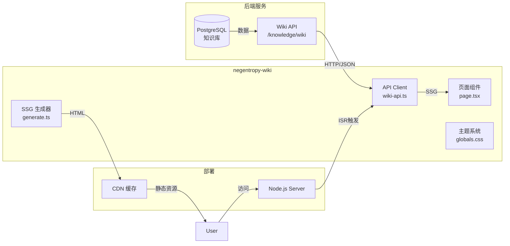

# Negentropy Wiki 运维指引

> **适用对象**: 负责部署、监控和维护 Negentropy Wiki 知识库发布站点的运维工程师
>
> **相关文档**: [架构设计](./framework.md) | [知识库设计](./knowledges.md)

---

## 1. 概述

### 1.1 定位

Negentropy Wiki 是 Negentropy 平台的知识库文档发布站点，负责将后端知识库中已发布的内容以静态网站形式对外展示。

| 组件 | 角色 | 技术栈 |
|------|------|-------|
| **negentropy** | 后端引擎（知识库管理） | Python + FastAPI |
| **negentropy-ui** | 用户交互界面 | Next.js + React |
| **negentropy-wiki** | 文档发布站点（本组件） | Next.js + SSG |

### 1.2 核心特性

- **SSG + ISR**: 静态生成 + 增量再验证，兼顾性能与数据新鲜度
- **主题系统**: 3 套预设主题 + 深色模式自动适配
- **零运行时数据库**: 宺全依赖后端 API，- **轻量依赖**: 仅 Next.js + React 核心库

---

## 2. 架构

### 2.1 系统架构



### 2.2 路由结构

| 路由 | 页面文件 | 功能 |
|------|---------|------|
| `/` | `src/app/page.tsx` | 首页：列出所有已发布的 Publication |
| `/:pubSlug` | `src/app/[pubSlug]/page.tsx` | Publication 首页：导航树 + 文档索引 |
| `/:pubSlug/:entrySlug` | `src/app/[pubSlug]/[entrySlug]/page.tsx` | 文档详情页：Markdown 渲染 |

### 2.3 数据流

```
用户访问 → CDN/Node 缓存命中?
    ├─ 是 → 返回静态 HTML
    └─ 否/过期 → 触发 ISR
                    ↓
               调用后端 Wiki API
                    ↓
               重新生成 HTML
                    ↓
               返回新内容（后台异步）
```

---

## 3. 环境配置

### 3.1 环境变量

| 变量名 | 默认值 | 说明 |
|--------|--------|------|
| `WIKI_API_BASE` | `http://localhost:8000` | 后端 API 基础地址 |

### 3.2 依赖版本

| 依赖 | 版本 | 用途 |
|------|------|------|
| `next` | ^15.2.0 | Next.js 框架 |
| `react` | ^19.0.0 | UI 库 |
| `typescript` | ^5.7.0 | 类型检查 |
| `vitest` | ^4.1.3 | 单元测试（dev） |

---

## 4. 开发环境

### 4.1 前置条件

- Node.js >= 18.x
- pnpm >= 8.x（项目包管理器规范）

### 4.2 本地启动

```bash
# 1. 进入项目目录
cd apps/negentropy-wiki

# 2. 安装依赖
pnpm install

# 3. 启动开发服务器（默认端口 3092）
pnpm dev
```

### 4.3 后端联调

开发模式下，API 请求通过 `next.config.ts` 中的 `rewrites` 配置自动代理到后端：

```typescript
// next.config.ts
async rewrites() {
  return [{
    source: "/api/:path*",
    destination: `${API_BASE}/knowledge/wiki/:path*`,
  }];
}
```

确保后端服务运行在 `WIKI_API_BASE` 指定的地址（默认 `localhost:8000`）。

---

## 5. 构建与部署

### 5.1 构建

```bash
# SSG 构建（需后端 API 可用）
pnpm build

# 输出：
# .next/           - Next.js 构建产物
# .next/standalone/ - 独立可运行的 Node.js 应用
```

### 5.2 本地预览

```bash
# 启动构建后的应用（由 scripts/start-production.mjs 注入 PORT=3092、HOSTNAME=localhost）
pnpm start

# 访问 http://localhost:3092（可通过 `PORT` 环境变量覆盖，与 `dev` 默认端口保持一致）
```

> `pnpm start` 内部通过 `scripts/start-production.mjs` 包装 Next.js standalone 入口：在临时目录中 symlink 回填 `.next/static/` 与 `public/`（standalone 模式不会自动拷贝这两类静态资产），并注入默认端口，避免裸 `node .next/standalone/server.js` 因 cwd 漂移导致 `/_next/static/*` 被动态路由 `[pubSlug]/[...entrySlug]` 吞并的回归。

### 5.3 Docker 部署

```dockerfile
# Dockerfile 示例
FROM node:20-alpine AS builder
WORKDIR /app
COPY package.json pnpm-lock.yaml ./
RUN npm install -g pnpm && pnpm install --frozen-lockfile
COPY . .
RUN pnpm build

FROM node:20-alpine
WORKDIR /app
# standalone 产物不包含 .next/static 与 public，需显式 COPY 至 server.js 邻近路径
COPY --from=builder /app/.next/standalone ./
COPY --from=builder /app/.next/static ./.next/static
COPY --from=builder /app/public ./public
ENV PORT=3092 HOSTNAME=0.0.0.0
EXPOSE 3092
CMD ["node", "server.js"]
```

> 容器镜像通过 `COPY` 直接把静态资产放到 standalone 目录下（与宿主机 `scripts/start-production.mjs` 的 symlink 同构），因此容器内可直接运行 `node server.js`，无需额外执行 wrapper 脚本。

### 5.4 生产环境检查清单

- [ ] 设置 `WIKI_API_BASE` 环境变量（后端生产地址）
- [ ] 配置 CDN 缓存策略（ISR 页面建议缓存 300s）
- [ ] 配置健康检查端点（可选）
- [ ] 设置日志收集（stdout/stderr）

---

## 6. ISR 缓存策略

### 6.1 机制说明

- **revalidate: 300** (5 分钟)
- 用户访问页面时，若缓存超过 5 分钟：
  1. 立即返回缓存的 HTML
  2. 后台异步触发重新生成
  3. 下次访问返回新内容

### 6.2 缓存更新场景

| 场景 | 行为 |
|------|------|
| 后端新增 Publication | 下次构建时自动收录，或通过 ISR 自然更新 |
| 后端更新内容 | 5 分钟内 ISR 自动刷新 |
| 需要立即生效 | 重新部署或清除 CDN 缓存 |

---

## 7. 主题系统

### 7.1 可用主题

| 主题名 | 风格 | 侧边栏宽度 | 内容区宽度 |
|--------|------|-----------|-----------|
| `default` | Notion/Vercel | 280px | 800px |
| `book` | GitBook | 300px | 900px |
| `docs` | Docusaurus | 260px | 1024px |

### 7.2 主题切换

主题由后端 Publication 数据中的 `theme` 字段决定。当前实现在 `layout.tsx` 中硬编码为 `default`：

```tsx
// src/app/layout.tsx
<html lang="zh-CN" data-theme="default">
```

> **TODO**: 未来应根据 Publication 配置动态切换主题。

### 7.3 深色模式

通过 CSS `prefers-color-scheme` 媒体查询自动适配：

```css
@media (prefers-color-scheme: dark) {
  :root {
    --wiki-bg: #1a1a1a;
    --wiki-text: #e5e5e5;
    /* ... */
  }
}
```

---

## 8. 故障排除

### 8.1 常见问题

| 问题 | 可能原因 | 解决方案 |
|------|---------|---------|
| 构建期告警 "Failed to fetch publications" | 后端 API 不可达（WARN 级，不阻断构建） | 后端暂不可达时 SSG 渲染空首页，首次请求由 ISR 自动自愈（5 分钟窗口）；若需构建期预渲染真实数据，检查 `WIKI_API_BASE` 配置和网络连通性 |
| 页面显示 "Wiki 未找到" | Publication 未发布或 slug 错误 | 检查后端 Publication 状态 |
| 页面内容不更新 | ISR 缓存未过期 | 等待 5 分钟或重新部署 |
| 深色模式样式异常 | 浏览器未启用深色模式 | 检查系统深色模式设置 |
| Markdown 渲染异常 | 不支持的语法 | 检查 markdown.ts 支持的语法子集 |

### 8.2 日志查看

```bash
# 查看 Next.js 服务日志
docker logs <container-id>

# 或直接运行时
pnpm start 2>&1 | tee wiki.log
```

### 8.3 健康检查

```bash
# 检查 API 连通性
curl ${WIKI_API_BASE}/knowledge/wiki/publications?status=published

# 预期返回
{"items": [...], "total": N}
```

---

## 9. 安全注意事项

- **XSS 防护**: Markdown 渲染器已内置 HTML 转义，但建议后续升级为 `react-markdown` + `DOMPurify`
- **无认证**: Wiki 站点为公开访问，不实现用户认证
- **API 鉴权**: 当前后端 Wiki API 不需要鉴权，生产环境应评估是否需要 IP 白名单

---

## 10. 关键文件速查

| 文件 | 用途 |
|------|------|
| `src/app/layout.tsx` | 根布局、元数据、主题设置 |
| `src/app/page.tsx` | 首页组件 |
| `src/app/[pubSlug]/page.tsx` | Publication 页面 |
| `src/app/[pubSlug]/[entrySlug]/page.tsx` | 文档详情页 |
| `src/lib/wiki-api.ts` | API 客户端 |
| `src/lib/markdown.ts` | Markdown 渲染器 |
| `src/app/globals.css` | 全局样式、主题变量 |
| `next.config.ts` | Next.js 配置、API 代理 |
| `vitest.config.ts` | 测试配置 |

---

## 11. 相关链接

- [Next.js SSG 文档](https://nextjs.org/docs/app/building-your-application/rendering/static-site-generation)
- [Next.js ISR 文档](https://nextjs.org/docs/app/building-your-application/data-fetching/incremental-static-regeneration)
