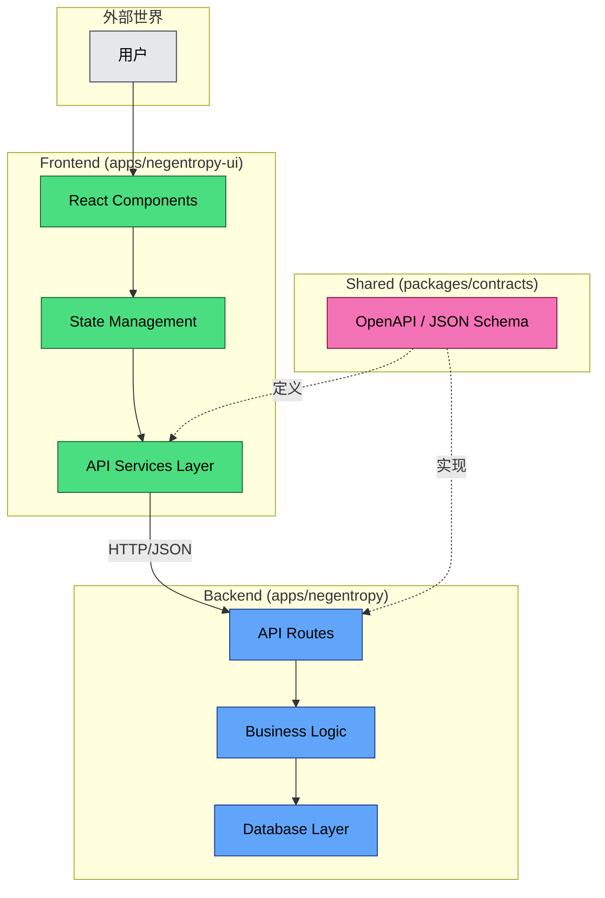
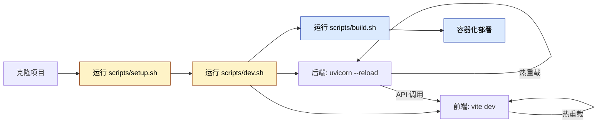

# Project Initiation

## 设计原则

> [!TIP]
>
> **适用场景**：使用 `uv` (Python) 与 `npm` (Node.js) 共同管理的前后端分离工程。

- **正交分解**：按"应用 / 共享 / 基础设施 / 文档"分层，减少跨层耦合。
- **边界管理**：前后端仅通过契约交互，禁止源码互引。
- **最小干预**：目录只承载必要职责，避免过度拆分。

---

## 架构视图



## 开发工作流



## 推荐结构

```sh
negentropy/
├── .gitignore                     # Git 忽略规则
├── .mcp.json                      # MCP 服务配置
├── AGENTS.md                      # AI 协作协议
├── LICENSE                        # 许可协议
├── README.md                      # 项目自述
├── Makefile                       # 统一任务入口（可选）
├── docs/                          # 项目文档
│   ├── project-structure.md       # 本文档
│   └── ...
├── scripts/                       # 跨端工程脚本
│   ├── setup.sh                   # 统一安装脚本
│   ├── dev.sh                     # 统一开发启动脚本
│   ├── build.sh                   # 统一构建脚本
│   └── clean.sh                   # 清理脚本
├── config/                        # 共享配置（可选）
│   └── docker-compose.yml         # 容器编排配置
├── packages/                      # 共享包（可选）
│   └── contracts/                 # API 契约 / OpenAPI / SDK
├── apps/                          # 应用根目录
│   ├── negentropy/                # Python 后端 (uv 管理)
│   │   ├── pyproject.toml         # uv 项目配置
│   │   ├── uv.lock                # uv 锁文件（提交至版本库）
│   │   ├── .python-version        # Python 版本锚定
│   │   ├── .env.example           # 环境变量模板（后端）
│   │   ├── src/                   # 源码目录
│   │   │   └── negentropy/        # 主包
│   │   │       ├── __init__.py
│   │   │       ├── main.py        # 应用入口
│   │   │       ├── api/           # API 路由
│   │   │       ├── core/          # 核心业务逻辑
│   │   │       ├── models/        # 数据模型
│   │   │       └── utils/         # 工具函数
│   │   ├── tests/                 # 测试目录
│   │   │   ├── unit/
│   │   │   └── integration/
│   │   ├── scripts/               # 后端专用脚本
│   │   └── README.md              # 后端自述
│   ├── negentropy-ui/             # Node.js 前端 (npm 管理)
│   │   ├── package.json           # npm 项目配置
│   │   ├── package-lock.json      # npm 锁文件（提交至版本库）
│   │   ├── node_modules/          # 依赖安装目录（忽略）
│   │   ├── .env.example           # 环境变量模板（前端）
│   │   ├── src/                   # 源码目录
│   │   │   ├── App.tsx            # 应用入口
│   │   │   ├── pages/             # 页面组件
│   │   │   ├── components/        # 通用组件
│   │   │   ├── hooks/             # 自定义 Hooks
│   │   │   ├── services/          # API 服务层
│   │   │   ├── stores/            # 状态管理
│   │   │   └── utils/             # 工具函数
│   │   ├── public/                # 静态资源
│   │   ├── tests/                 # 测试目录
│   │   ├── scripts/               # 前端专用脚本
│   │   ├── vite.config.ts         # 构建配置（示例）
│   │   └── README.md              # 前端自述
└── .temp/                         # 临时文件（自动清理）
```

## 职责边界

| 维度           | Backend (uv)                           | Frontend (npm)          |
| -------------- | -------------------------------------- | ----------------------- |
| **包管理器**   | `uv`                                   | `npm` / `pnpm` / `yarn` |
| **锁文件**     | `uv.lock`                              | `package-lock.json`     |
| **依赖安装**   | `uv sync`                              | `npm install`           |
| **开发命令**   | `uv run python src/negentropy/main.py` | `npm run dev`           |
| **测试命令**   | `uv run pytest`                        | `npm run test`          |
| **代码格式化** | `ruff` / `black`                       | `eslint` / `prettier`   |

## 核心配置说明

### Backend: `apps/negentropy/pyproject.toml`

- 锚定 Python 版本（`requires-python`）
- 运行依赖与开发依赖分离
- 锁文件提交到版本库

### Frontend: `apps/negentropy-ui/package.json`

- 明确 `dev` / `build` / `test` / `lint` 脚本
- 锁文件提交到版本库

---

## 工程脚本约定

- `scripts/setup.sh`：一键安装依赖（后端 `uv sync` + 前端 `npm install`）
- `scripts/dev.sh`：一键启动（后端 `uvicorn` + 前端 `npm run dev`）
- `scripts/build.sh`：统一构建入口
- `scripts/clean.sh`：清理缓存与产物

---

## 最佳实践

### 1. 依赖隔离

- **Backend**：依赖安装于 `apps/negentropy/.venv/`（uv 自动管理）
- **Frontend**：依赖安装于 `apps/negentropy-ui/node_modules/`
- **共享依赖**：通过契约通信，严禁跨端源码引用

### 2. 锁文件管理

| 文件                | 是否提交 | 说明                    |
| ------------------- | -------- | ----------------------- |
| `uv.lock`           | ✅ 是    | 确保 Python 环境可复现  |
| `package-lock.json` | ✅ 是    | 确保 Node.js 环境可复现 |
| `.python-version`   | ✅ 是    | 锚定 Python 版本        |

### 3. 环境变量

使用 `apps/negentropy/.env.example` 与 `apps/negentropy-ui/.env.example` 作为模板，各端通过 `.env` 文件管理本地配置：

```bash
# Backend
DATABASE_URL=postgresql://localhost:5432/negentropy
API_PORT=8000

# Frontend
VITE_API_BASE_URL=http://localhost:8000
```

### 4. 统一任务入口（可选）

使用根目录 `Makefile` 统一封装常用命令（如 `make setup` / `make dev` / `make build`），减少脚本自由度导致的漂移。

### 5. 容器化部署

`config/docker-compose.yml` 示例：

```yaml
services:
  backend:
    build: ./apps/negentropy
    ports:
      - "8000:8000"
    environment:
      - DATABASE_URL=postgresql://db:5432/negentropy

  frontend:
    build: ./apps/negentropy-ui
    ports:
      - "3000:80"
    depends_on:
      - backend
```

### 6. 契约治理（contracts）

- `packages/contracts` 作为唯一契约源（OpenAPI/JSON Schema/SDK）。
- 变更采用 **先扩展后收缩**：新增字段优先、弃用字段需保留过渡期。
- 发布时记录契约版本与变更说明，避免前后端漂移。

### 7. 环境分层

- 约定 `.env.example` 仅作模板，`.env.local` / `.env.production` 用于环境覆盖。
- 禁止提交包含密钥的实际 `.env` 文件。

### 8. CI / 质量门禁

- 最低门槛：`lint` / `test` / `build` 必须在 CI 通过。
- 根目录 `Makefile` 或 `scripts/` 需提供对应入口，保证一致执行面。

### 9. 版本与发布

- 前后端版本独立，但契约版本需显式标注（例如 `contracts/VERSION`).
- 若契约不兼容变更，需同步通知并约定发布窗口。

### 10. 命名与路径约束

- 目录与包名统一使用小写 + 短横线（kebab-case）。
- 避免复数歧义与语义重叠（如 `services`/`service` 混用）。

### 11. 可观测性约定

- 统一日志字段（`trace_id`/`request_id`/`service`/`env`）。
- 关键业务链路必须可追踪（前端→后端）。

---

## 常见陷阱 (二阶思维)

| 陷阱             | 表象                     | 根因                         | 防范措施                                     |
| ---------------- | ------------------------ | ---------------------------- | -------------------------------------------- |
| **依赖版本漂移** | 本地可运行，CI 失败      | 锁文件未提交或不同步         | 强制提交 `uv.lock` 与 `package-lock.json`    |
| **端口冲突**     | `Address already in use` | 多实例并发或未正确清理       | 脚本中增加端口检测与自动清理逻辑             |
| **契约不兼容**   | 前端调用报错 `400/500`   | 后端先行变更未通知前端       | 引入 `packages/contracts` 版本化管理         |
| **环境变量泄漏** | 密钥出现在日志中         | `.env` 文件误提交            | `.gitignore` 严格排除，Pre-commit Hook 检查  |
| **跨域问题**     | 浏览器报错 `CORS`        | 开发环境未配置代理           | 后端启用 CORS 中间件，前端配置 Proxy         |
| **虚拟环境丢失** | `uv run` 找不到模块      | `.venv` 被 `.gitignore` 忽略 | 添加 `uv sync` 恢复步骤到 `scripts/setup.sh` |

## 故障排查

### 后端启动失败

```bash
# 检查 Python 版本
cd apps/negentropy
python --version  # 应与 .python-version 一致

# 重新同步依赖
uv sync --reinstall

# 检查端口占用
lsof -i :8000
```

### 前端启动失败

```bash
# 清理缓存
cd apps/negentropy-ui
rm -rf node_modules package-lock.json
npm install

# 检查 Node 版本
node --version
npm --version
```

### 跨域请求问题

确认后端 `fastapi` 配置：

```python
from fastapi.middleware.cors import CORSMiddleware

app.add_middleware(
    CORSMiddleware,
    allow_origins=["http://localhost:3000"],
    allow_methods=["*"],
    allow_headers=["*"],
)
```

---

## 验证检查清单

在提交代码或发布前，请确认：

- [ ] 锁文件已更新并提交（`uv.lock`, `package-lock.json`）
- [ ] 所有测试通过（`uv run pytest` + `npm run test`）
- [ ] Linter 无报错（`ruff check` + `npm run lint`）
- [ ] 环境变量模板已同步（`.env.example`）
- [ ] 契约变更已通知对端（如有）
- [ ] `.gitignore` 正确排除敏感文件
- [ ] 文档已同步更新

---

## 参考文献

<a id="ref1"></a>[1] A. Toolkit, "uv: A very fast Python package installer," _Python Packaging Authority_, 2024. [Online]. Available: https://github.com/astral-sh/uv

<a id="ref2"></a>[2] M. Community, "npm best practices," _npm Documentation_, 2024. [Online]. Available: https://docs.npmjs.com/cli/v9/using-npm/best-practices

<a id="ref3"></a>[3] R. Richards, "Software Architecture Patterns," _O'Reilly Media_, 2015.

<a id="ref4"></a>[4] T. A. of Service-Oriented Architecture, "RESTful API Design Best Practices," _IEEE Softw._, vol. 32, no. 1, pp. 56–64, 2015.

<a id="ref5"></a>[5] A. Vaswani et al., "Attention is all you need," _Adv. Neural Inf. Process. Syst._, vol. 30, pp. 5998–6008, 2017.

---
