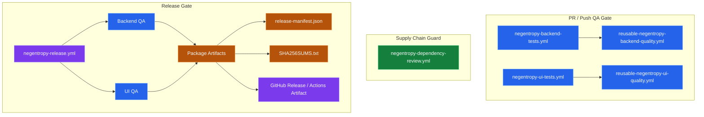

# QA 与发布流水线

> 目标：将 `Negentropy` 的测试门禁、发布打包与供应链防护收敛为一套可复用、可审计、可回放的交付流水线，降低 YAML 漂移、发布偶然性与运维认知负担。

## 1. 设计边界

- **测试单源化**：`PR`/`Push` 门禁与 `Release` 复用同一套 GitHub Actions reusable workflows，避免 QA 逻辑分叉<sup>[[1]](#ref1)</sup>。
- **发布收口**：仅在通过后端与 UI 全量 QA 后才生成版本工件，并通过 `release` environment 承接人工审批与发布保护位<sup>[[2]](#ref2)</sup>。
- **供应链防护**：对依赖清单变更启用 dependency review，在 PR 阶段提前暴露高危漏洞引入风险<sup>[[3]](#ref3)</sup>。
- **工件可核验**：发布阶段生成 `release-manifest.json` 与 `SHA256SUMS.txt`，为后续部署、回滚与归档提供完整的追溯指针。

## 2. 流程拓扑



## 3. 当前落地

### 3.1 QA Workflows

- 后端入口：[`.github/workflows/negentropy-backend-tests.yml`](../.github/workflows/negentropy-backend-tests.yml)
- UI 入口：[`.github/workflows/negentropy-ui-tests.yml`](../.github/workflows/negentropy-ui-tests.yml)
- 后端复用工作流：[`.github/workflows/reusable-negentropy-backend-quality.yml`](../.github/workflows/reusable-negentropy-backend-quality.yml)
- UI 复用工作流：[`.github/workflows/reusable-negentropy-ui-quality.yml`](../.github/workflows/reusable-negentropy-ui-quality.yml)
- UI 生产启动器：[apps/negentropy-ui/scripts/start-production.mjs](../apps/negentropy-ui/scripts/start-production.mjs)

其中：

- 后端复用工作流统一承载 `unit / integration / optional performance` 三层测试，并输出 `coverage.xml`、`htmlcov` 与 `junit xml`。
- UI 复用工作流统一承载 `lint / typecheck / vitest coverage / build smoke / playwright smoke` 五层门禁。
- UI 冒烟测试与 release 运行时统一经由 `pnpm start` -> [`scripts/start-production.mjs`](../apps/negentropy-ui/scripts/start-production.mjs) 启动，优先命中工件内 `server.js`，在源码工作树中回退到 `.next/standalone/server.js`，消除 `output: standalone` 下继续调用 `next start` 的契约漂移。
- `Release Pipeline` 直接复用上述 QA 工作流，避免“PR 能过、Release 另走一套”的 split-brain。

### 3.2 覆盖率与本地噪音治理

- 后端在 [`apps/negentropy/pyproject.toml`](../apps/negentropy/pyproject.toml) 中设置 `coverage fail_under = 50`。
- UI 在 [`apps/negentropy-ui/vitest.config.ts`](../apps/negentropy-ui/vitest.config.ts) 中设置总覆盖率阈值：`lines/functions/statements >= 50`、`branches >= 48`。
- UI 在 [`apps/negentropy-ui/eslint.config.mjs`](../apps/negentropy-ui/eslint.config.mjs) 中忽略 `coverage/`、`playwright-report/` 与 `test-results/`，避免生成产物反向污染本地 lint 信号。

### 3.3 发布工件

- 发布入口：[`.github/workflows/negentropy-release.yml`](../.github/workflows/negentropy-release.yml)
- UI 打包策略：通过 [`apps/negentropy-ui/next.config.ts`](../apps/negentropy-ui/next.config.ts) 启用 `standalone` 输出，以便将运行时工件与 `static/public` 一并归档。
- UI 工件同时收录 [`apps/negentropy-ui/scripts/start-production.mjs`](../apps/negentropy-ui/scripts/start-production.mjs)，保证源码工作树与 release bundle 共享同一条生产启动路径。
- 发布输出至少包含：
  - Python wheel / sdist
  - `negentropy-ui-{version}.tgz`
  - `release-manifest.json`
  - `SHA256SUMS.txt`

### 3.4 供应链与运维安全

- 依赖审查入口：[`.github/workflows/negentropy-dependency-review.yml`](../.github/workflows/negentropy-dependency-review.yml)
- 发布审批口：GitHub `release` environment（需在仓库 Settings 中补充 required reviewers / wait timer）<sup>[[2]](#ref2)</sup>
- 版本策略：
  - tag 发布：`negentropy-vX.Y.Z`
  - 手工演练：`workflow_dispatch` + `publish_release=false`
  - 候选版：`channel=candidate` 或语义化版本包含 pre-release 后缀

## 4. 运行约定

### 4.1 本地校验

```bash
cd apps/negentropy && uv run pytest tests/unit_tests/
pnpm --dir apps/negentropy-ui lint
pnpm --dir apps/negentropy-ui typecheck
pnpm --dir apps/negentropy-ui test:coverage
pnpm --dir apps/negentropy-ui build
pnpm --dir apps/negentropy-ui test:e2e
```

### 4.2 GitHub Actions 触发面

- 代码门禁：由 `push` / `pull_request` 自动触发。
- 性能测试：仅在后端 workflow 的 `workflow_dispatch` 或 `schedule` 中执行，避免默认门禁过重。
- Release：支持 `workflow_dispatch` 与 tag push 双入口。

## 5. 后续建议

1. 在仓库 Settings 中为 `release` environment 配置 required reviewers。
2. 若后端 lint 基线清理完成，可在复用后端工作流中补充 `ruff check` 门禁。
3. 若需要进一步增强供应链可信度，可在 release job 上叠加 artifact attestation。

## 参考文献

<a id="ref1"></a>[1] GitHub, "Reusing workflows," _GitHub Docs_. [Online]. Available: https://docs.github.com/actions/using-workflows/reusing-workflows. [Accessed: Mar. 10, 2026].

<a id="ref2"></a>[2] GitHub, "Managing environments for deployment," _GitHub Docs_. [Online]. Available: https://docs.github.com/actions/deployment/environments. [Accessed: Mar. 10, 2026].

<a id="ref3"></a>[3] GitHub, "dependency-review-action," _GitHub_. [Online]. Available: https://github.com/actions/dependency-review-action. [Accessed: Mar. 10, 2026].
