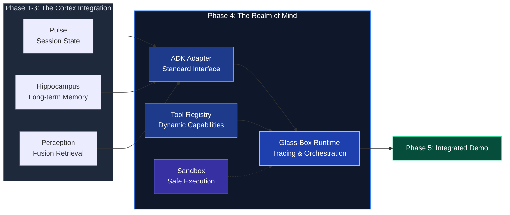
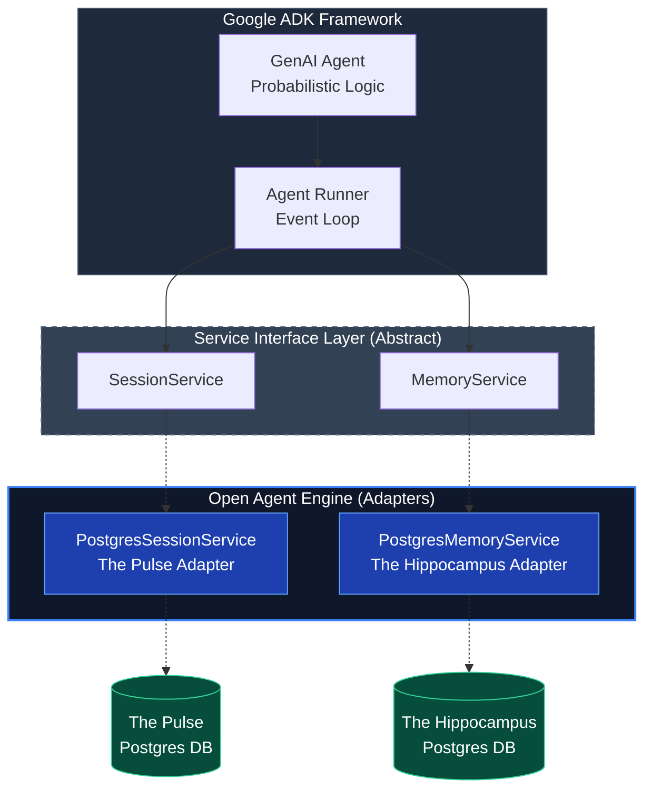
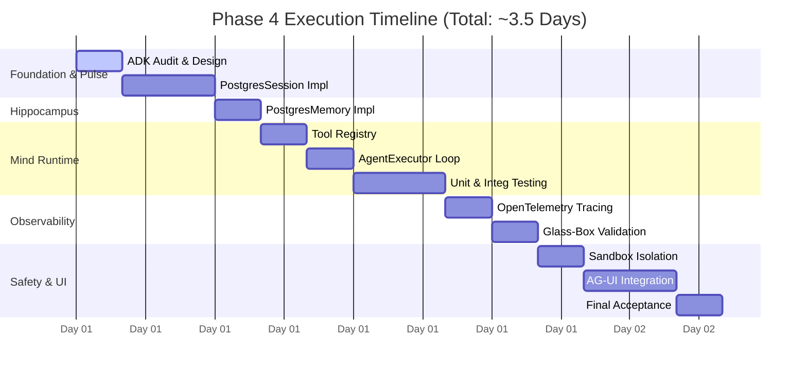
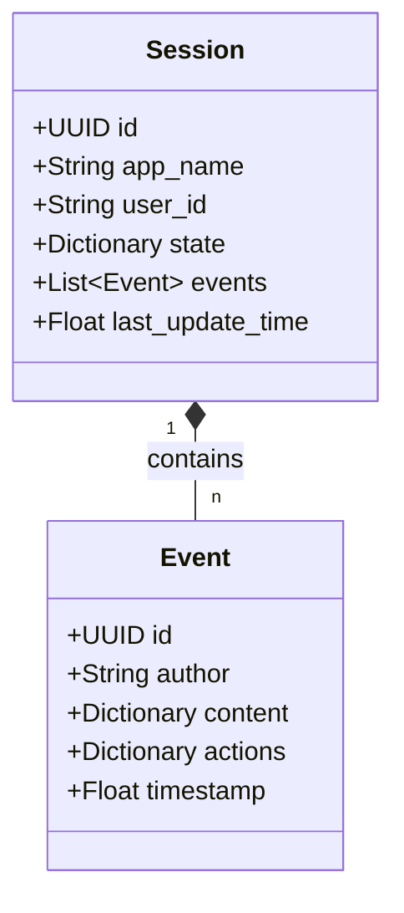
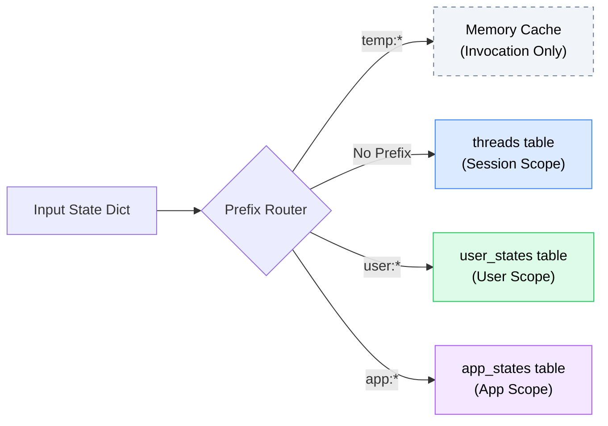
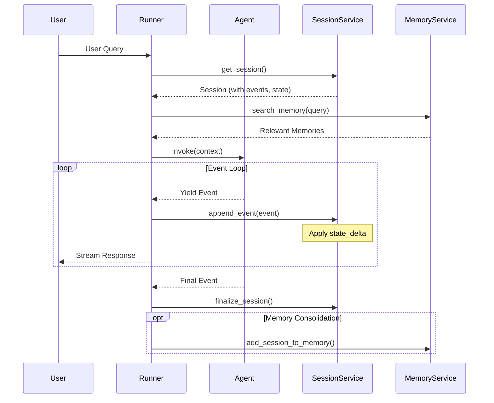
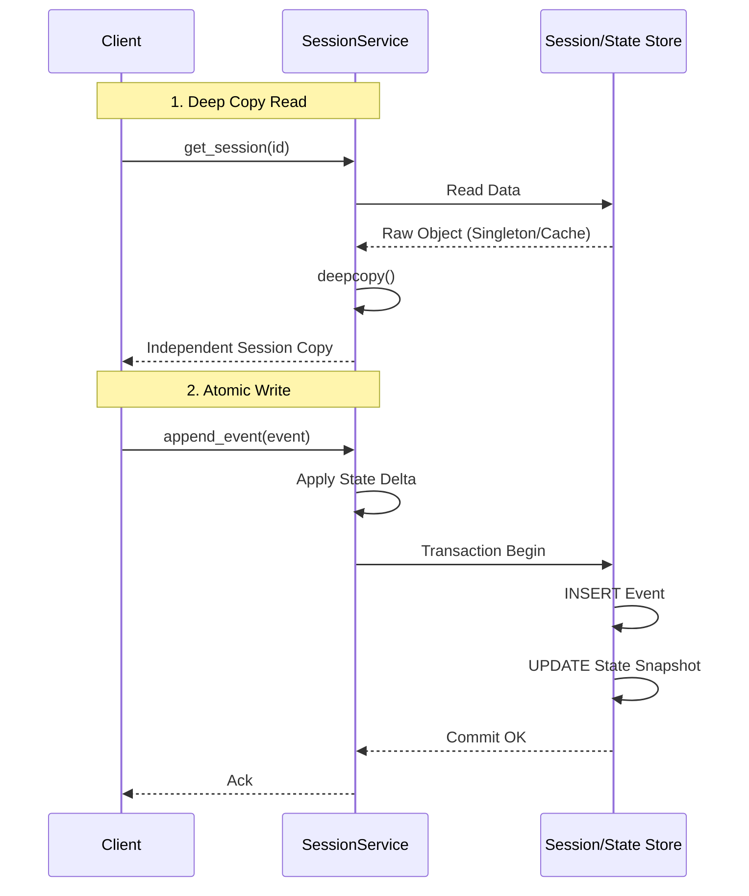
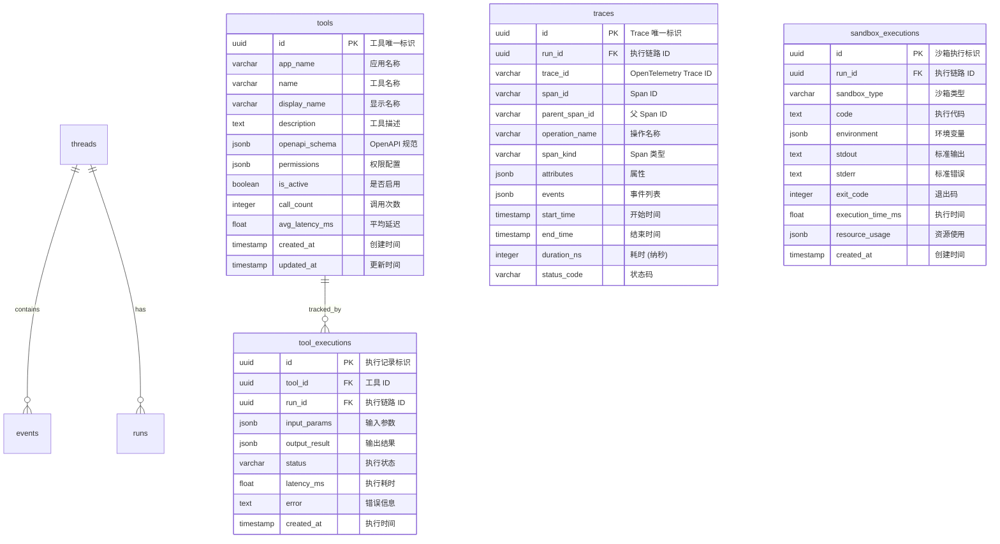
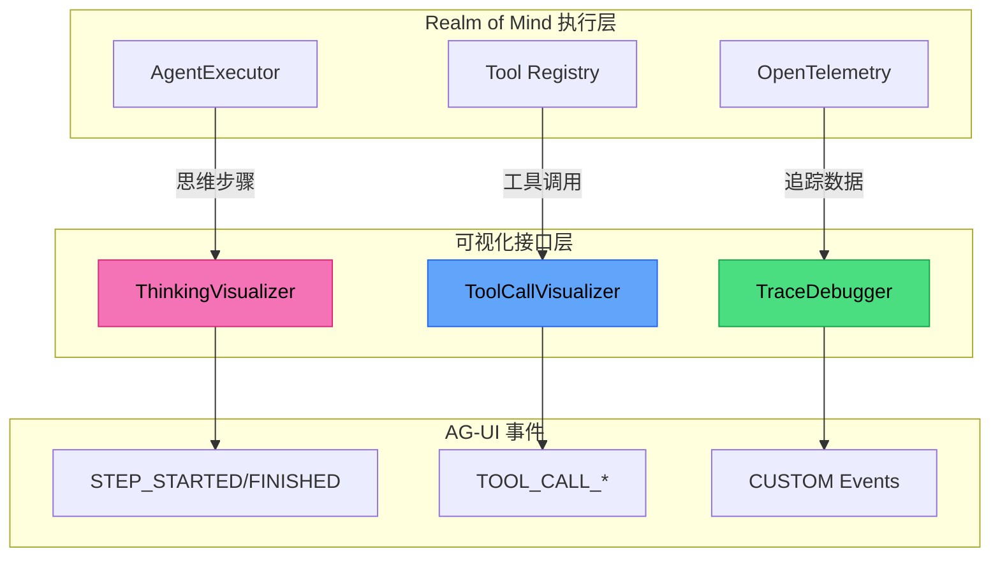

> [!NOTE]
>
> **文档定位**：本文档是 [000-roadmap.md](./000-roadmap.md) Phase 4 的详细工程实施方案，旨在指导 Pillar IV「**The Realm of Mind (心智空间)**」的落地与白盒化验证。内容涵盖技术调研、架构设计、代码实现及全链路测试。
>
> **前置依赖**：本阶段构建于 Phase 1-3 的基座之上，复用其 **Unified Schema** ([The Pulse](./010-the-pulse.md))、**Memory Consolidation** ([The Hippocampus](./020-the-hippocampus.md)) 与 **Fusion Retrieval** ([The Perception](./030-the-perception.md)) 能力。

---

## 1. 执行摘要

### 1.1 定位与目标 (Phase 4)

**Phase 4: The Realm of Mind** 是整个验证计划的**集成核心阶段**，对标人类大脑的**前额叶皮层 (Prefrontal Cortex)** —— 负责执行控制、计划决策与工具调度的中枢。

本阶段的核心任务是 **"Connecting the Dots"**：将前三个阶段构建的感知 (Perception)、记忆 (Hippocampus) 与状态 (Pulse) 能力，通过标准化的 **Agent Runtime** 编排起来，形成具备完整心智的智能体。

**关键交付目标**：

1. **Framework Adaptation (骨架适配)**：实现 `PostgresSessionService` 与 `PostgresMemoryService`，完成与 **Google ADK** 的标准化接口对接。
2. **Glass-Box Runtime (白盒运行时)**：构建完全透明的 `AgentExecutor`，取代黑盒 API，确保推理过程的每一步（Thought -> Action -> Observation）均可观测、可调试。
3. **Dynamic Capability (动态能力)**：构建数据库驱动的 **Tool Registry**，支持工具的热加载与权限控制。
4. **Safe Execution (安全执行)**：集成 **Sandbox (沙箱)** 环境，确保代码解释器 (Code Interpreter) 与外部工具的安全隔离。



### 1.2 核心概念解析

#### 1.2.1 Glass-Box vs Black-Box

> [!IMPORTANT]
>
> **核心价值**：Phase 4 将 Google Vertex AI Agent Engine 的黑盒托管能力，解构为完全透明、可调试、可掌控的 **Glass-Box Implementation**。

| 维度           | Black-Box (Google Vertex AI)           | Glass-Box (Open Agent Engine) |
| :------------- | :------------------------------------- | :---------------------------- |
| **可观测性**   | 仅 Input/Output 与计费 Token           | OpenTelemetry 级全链路追踪    |
| **调试能力**   | 难以定位推理死循环或幻觉               | Step-by-Step Trace 可视化调试 |
| **存储后端**   | Firestore/Redis + Vertex Vector Search | PostgreSQL 统一存储           |
| **运维成本**   | Serverless (Managed)                   | Self-hosted / 多地多活        |
| **供应商锁定** | 强依赖 GCP                             | Vendor Agnostic               |

#### 1.2.2 ADK Service 接口适配

本方案采用 **Adapter Pattern**，将 Cognizes Engine 的底层能力（Pulse, Hippocampus）映射为 Google ADK 的标准接口。



### 1.3 执行导图 (Execution Map)

#### 1.3.1 任务-文档锚定

> [!NOTE]
>
> 本矩阵建立了 **Planning (任务)**、**Navigation (文档)** 与 **Delivery (产物)** 的三维映射。

| 任务模块 (Module)    | 任务 ID (Range)   | 预估工期 | 交付物 (Deliverables)    | 对应章节 (Navigation)                                        |
| :------------------- | :---------------- | :------- | :----------------------- | :----------------------------------------------------------- |
| **1. ADK 调研**      | P4-1-1 ~ P4-1-5   | 0.25 Day | 接口分析笔记 + 时序图    | [2. 技术调研](#2-技术调研adk-runtime-深度分析)               |
| **2. Session 适配**  | P4-2-1 ~ P4-2-8   | 0.50 Day | `PostgresSessionService` | [4.1 SessionService](#41-step-1-postgressessionservice-实现) |
| **3. Memory 适配**   | P4-2-9 ~ P4-2-12  | 0.25 Day | `PostgresMemoryService`  | [4.2 MemoryService](#42-step-2-postgresmemoryservice-实现)   |
| **4. Tool Registry** | P4-2-13 ~ P4-2-18 | 0.25 Day | `ToolRegistry` + Schema  | [4.3 Tool Registry](#43-step-3-tool-registry-实现)           |
| **5. Runtime Loop**  | P4-2-19 ~ P4-2-23 | 0.25 Day | `AgentExecutor`          | [4.4 AgentExecutor](#44-step-4-agentexecutor-实现)           |
| **6. Testing**       | P4-3-1 ~ P4-3-4   | 0.50 Day | 测试套件 + 技术文档      | [4.5 测试实现](#45-step-5-测试实现)                          |
| **7. Tracing**       | P4-4-1 ~ P4-4-4   | 0.25 Day | OpenTelemetry 集成       | [4.6 OpenTelemetry](#46-step-6-opentelemetry-集成)           |
| **8. Sandbox**       | P4-4-5 ~ P4-4-10  | 0.25 Day | 安全隔离环境             | [4.7 安全沙箱](#47-step-7-sandboxed-execution-实现)          |
| **9. Validation**    | P4-4-11 ~ P4-4-13 | 0.25 Day | 可视化 Trace 验证        | [4.8 可视化验证](#48-step-8-可视化验证)                      |
| **10. UI Protocol**  | P4-5-1 ~ P4-5-10  | 0.50 Day | AG-UI Protocol Adapter   | [4.9 AG-UI 协议](#49-step-9-ag-ui-协议集成)                  |

#### 1.3.2 实施甘特图 (Gantt Chart)



---

## 2. 核心参考模型：ADK Runtime

本章旨在确立 **Golden Standard (基准规范)**。通过解构 Google ADK 的抽象接口，明确 Pillar I (Pulse) 与 Pillar II (Hippocampus) 在代码层面的标准化契约。

### 2.1 契约定义：SessionService

`SessionService` (对标 `google/adk-python` [base_session_service.py](https://github.com/google/adk-python/blob/main/src/google/adk/sessions/base_session_service.py)) 是 **The Pulse (脉搏系统)** 的运行时接口。它不仅负责 Session 的 CRUD，还通过 `append_event` 方法承载了 **状态流转 (State Transitions)** 的核心逻辑。

> [!IMPORTANT]
>
> **关键发现**：`append_event()` **不是抽象方法**，基类提供了默认实现来处理 `temp:` 前缀过滤和 State 更新。子类只需覆写 CRUD 方法。
>
> 这种设计模式确保了所有 adapter (如 InMemory, Firestore, Postgres) 共享完全一致的 **State Transition Logic**，防止因实现差异导致的行为不一致。`SessionService` 在此扮演了 **Boundary Object** 的角色，定义了 Pulse 与外部存储交互的唯一合法途径。

#### 2.1.1 Session 数据结构



#### 2.1.2 State 前缀机制

ADK 通过 Key 前缀实现不同作用域的状态管理：

| 前缀    | 作用域 (Scope)   | 生命周期 (Lifecycle)                                 | 存储策略 (PostgreSQL/Memory) |
| :------ | :--------------- | :--------------------------------------------------- | :--------------------------- |
| 无前缀  | Session Scope    | 随会话存续                                           | `threads` 表 JSONB 列        |
| `temp:` | Invocation Scope | 仅当前调用                                           | **内存缓存** (不持久化)      |
| `user:` | User Scope       | <span style="color:green">**持久化**</span> (跨会话) | `user_states` 表             |
| `app:`  | App Scope        | <span style="color:green">**持久化**</span> (全局)   | `app_states` 表              |



### 2.2 ADK MemoryService 接口契约

```python
from abc import ABC, abstractmethod
from google.adk.memory import SearchMemoryResponse

class BaseMemoryService(ABC):
    """Memory 管理服务抽象基类"""

    @abstractmethod
    async def add_session_to_memory(
        self,
        session: Session
    ) -> None:
        """将 Session 中的对话转化为可搜索的记忆"""
        ...

    @abstractmethod
    async def search_memory(
        self,
        *,
        app_name: str,
        user_id: str,
        query: str
    ) -> SearchMemoryResponse:
        """基于 Query 检索相关记忆"""
        ...
```

### 2.3 ADK Runner 与 Service 交互流程



### 2.4 调研交付物摘要

#### 2.4.1 SessionService 关键行为分析 (P4-1-1, P4-1-3)

| 行为               | 描述                                            | 实现要点                       |
| :----------------- | :---------------------------------------------- | :----------------------------- |
| **State Commit**   | `state_delta` 仅在 Event 被 Runner 处理后才提交 | 需在 `append_event` 中原子更新 |
| **Dirty Reads**    | 同一 Invocation 内可见未提交的 State 变更       | 内存缓存 + 最终 PG 持久化      |
| **Event Ordering** | Events 必须严格按序列号排序                     | 使用 `BIGSERIAL` 保证顺序      |
| **Prefix Routing** | 不同前缀路由到不同存储位置                      | 解析前缀后分发到对应表         |

#### 2.4.2 MemoryService 关键行为分析 (P4-1-2, P4-1-4)

| 行为                  | 描述                                    | 实现要点                        |
| :-------------------- | :-------------------------------------- | :------------------------------ |
| **Session Ingestion** | 将 Session Events 转化为可检索的 Memory | 调用 Phase 2 的 consolidate()   |
| **Semantic Search**   | 基于向量相似度检索相关记忆              | 复用 Phase 3 的 hybrid_search() |
| **User Isolation**    | 不同用户的 Memory 严格隔离              | WHERE user_id = $user_id        |

> [!NOTE]
>
> **源码对标**: `google/adk-python` / `.../sessions/in_memory_session_service.py`
>
> 该参考实现建立了 **State Management** 的行为基准。PostgreSQL 适配器虽存储介质不同，但**必须严格遵守**以下设计模式，以确保业务逻辑的一致性。

#### 2.4.3.1 核心行为契约 (Behavioral Contract)

1. **Deep Copy Isolation (深拷贝隔离)**
   - **行为**: `get_session` 返回的对象必须是**完全独立的副本**。
   - **目的**: 防止 Client 端对 Session 对象的修改污染底层存储缓存，确保 State 变更只能通过明确的 `update` 接口发生。

2. **Structural Hierarchy (结构化层级)**
   - **模型**: `App -> User -> Session` 三层命名空间。
   - **PG 映射**: 通过 `(app_name, user_id, session_id)` 联合主键或索引实现物理隔离。

3. **Atomic Snapshot (原子快照)**
   - **行为**: 每次 `append_event` 不仅追加事件，还必须更新 `state` 快照。
   - **约束**: Event Log 与 State Snapshot 必须在**同一个事务**中提交，杜绝数据不一致。

#### 2.4.3.2 逻辑流可视化



**PostgreSQL 实现对标要点**:

| InMemory 行为  | PostgreSQL 实现                                           |
| :------------- | :-------------------------------------------------------- |
| 嵌套 dict 存储 | `threads` 表 + 组合主键 `(app_name, user_id, session_id)` |
| 深拷贝隔离     | 每次查询返回独立 Row 对象                                 |
| 状态快照       | 事务内 `UPDATE threads SET state = $new`                  |
| Event 过滤     | `WHERE seq > $after_seq LIMIT $num_recent`                |

#### 2.4.4 InMemoryMemoryService 源码分析 (P4-1-4)

```python
# 关键设计模式分析
class InMemoryMemoryService(BaseMemoryService):
    """
    核心设计:
    1. 简化实现: 仅存储 Session 的文本摘要
    2. 无真实向量: search_memory 使用字符串匹配
    3. 命名空间隔离: {app_name: {user_id: [MemoryEntry]}}
    """

    def __init__(self):
        self._memories: dict[str, dict[str, list[MemoryEntry]]] = {}

    async def add_session_to_memory(self, session: Session):
        # 简化: 将所有 Event 内容合并为单条记忆
        content = " ".join([str(e.content) for e in session.events])
        entry = MemoryEntry(
            id=str(uuid.uuid4()),
            content=content,
            session_id=session.id,
            created_at=datetime.now()
        )
        self._memories.setdefault(session.app_name, {}) \
                      .setdefault(session.user_id, []).append(entry)

    async def search_memory(self, *, app_name, user_id, query):
        memories = self._memories.get(app_name, {}).get(user_id, [])
        # 简化: 字符串包含匹配 (无真实向量搜索)
        matched = [m for m in memories if query.lower() in m.content.lower()]
        return SearchMemoryResponse(memories=matched)
```

**PostgreSQL 实现增强点**:

| InMemory 局限 | PostgreSQL 增强                                |
| :------------ | :--------------------------------------------- |
| 无向量搜索    | PGVector `<=>` 操作符进行真实语义搜索          |
| 无记忆巩固    | 调用 Phase 2 `consolidation_worker` 提取 Facts |
| 无遗忘机制    | `retention_score` 权重衰减 + 定期清理          |
| 无混合检索    | `hybrid_search` 融合语义+关键词+元数据         |

---

## 3. 架构设计：Mind Schema 扩展

### 3.1 Schema 扩展设计

在 Phase 1-3 的 Unified Schema 基础上，新增以下运行时相关表：



### 3.2 表职责说明

| 表名                   | 职责                     | 对标概念              | 生命周期   |
| :--------------------- | :----------------------- | :-------------------- | :--------- |
| **tools**              | 工具注册表 (动态加载)    | ADK Function Registry | 持久化     |
| **tool_executions**    | 工具执行记录 (审计追踪)  | Tool Call Audit Log   | 按策略归档 |
| **traces**             | OpenTelemetry Trace 存储 | Langfuse/OTLP         | 按策略清理 |
| **sandbox_executions** | 沙箱执行记录             | Code Interpreter Log  | 按策略清理 |

### 3.3 核心表 DDL 设计

#### 3.3.1 tools 表 (工具注册表)

> [!TIP]
> **Single Source of Truth**: 完整 Schema 定义请参见 [mind_schema.sql](../../src/cognizes/engine/schema/mind_schema.sql)。
>
> `tools` 表实现了动态工具注册机制，通过 `openapi_schema` JSONB 字段存储工具的规范定义，支持工具的热加载与版本管理。提供了 `permissions` 字段用于细粒度的访问控制，并通过 `call_count` 和 `avg_latency_ms` 字段支持运行时的性能监控。

#### 3.3.2 traces 表 (OpenTelemetry 存储)

> [!TIP]
> **Single Source of Truth**: 完整 Schema 定义请参见 [mind_schema.sql](../../src/cognizes/engine/schema/mind_schema.sql)。
>
> `traces` 表用于结构化存储 OpenTelemetry 产生的 Trace 数据。设计上直接映射了 OTLP 的标准字段（`trace_id`, `span_id`, `parent_span_id`），并使用 JSONB 类型灵活存储 `attributes` 和 `events`，从而实现对 Agent 思考过程（Thought Process）的完全白盒化追踪与回放。

---

## 4. 实施指南

### 4.1 Step 1: PostgresSessionService 实现

#### 4.1.1 实现目标

实现完全兼容 ADK `BaseSessionService` 接口的 PostgreSQL 适配器。

**任务清单**：

| 任务 ID | 任务描述                                | 验收标准                    |
| :------ | :-------------------------------------- | :-------------------------- |
| P4-2-1  | 创建 `adk-postgres` Python Package 结构 | `pyproject.toml` + 目录结构 |
| P4-2-2  | 实现 `PostgresSessionService` 类框架    | 继承 `BaseSessionService`   |
| P4-2-3  | 实现 `create_session()` 方法            | 创建新 Session 并返回       |
| P4-2-4  | 实现 `get_session()` 方法               | 根据 ID 加载 Session        |
| P4-2-5  | 实现 `list_sessions()` 方法             | 列出用户所有 Sessions       |
| P4-2-6  | 实现 `delete_session()` 方法            | 删除指定 Session            |
| P4-2-7  | 实现 `append_event()` 方法              | 追加 Event 到 Session       |
| P4-2-8  | 实现 State 前缀处理                     | 不同前缀存储至不同作用域    |

#### 4.1.2 目录结构决策

**决策：采用统一项目结构 (Integrated Structure)**

为了降低初期开发和联调的复杂度，建议将 `adk-postgres` 作为 `cognizes` 引擎的一个子模块（Adapter），共用主项目的 `pyproject.toml` 和开发环境。

**推荐目录结构：**

```text
src/cognizes/
├── adapters/
│   └── postgres/               # 适配器核心实现
│       ├── __init__.py
│       ├── session_service.py  # PostgresSessionService
│       ├── memory_service.py   # PostgresMemoryService
│       ├── tool_registry.py    # ToolRegistry
│       ├── tracing.py          # OpenTelemetry 集成
│       ├── sandbox/            # 沙箱实现
│       │   ├── __init__.py
│       │   ├── base.py
│       │   └── microsandbox_runner.py
│       └── models/             # 适配器私有模型（或使用全局模型）
│           ├── __init__.py
│           ├── session.py
│           └── event.py
tests/
├── unittests/adapters/postgres
└── integrationtests/adapters/postgres
```

**理由：**

1. **开发效率**：避免在多个项目间频繁切换和执行 `pip install -e`。
2. **原子提交**：引擎接口的变更及其在 Postgres 适配器中的实现可以在同一个 Commit 中完成，保证代码一致性。
3. **简化 CI/CD**：统一的测试运行环境和依赖管理，降低维护成本。
4. **未来解耦**：`adapters/postgres` 目录保持高度内聚，未来若需独立发布为 `adk-postgres` 包，只需将其移动到独立仓库并添加 `pyproject.toml` 即可。

#### 4.1.3 核心实现代码

> [!TIP]
> **Single Source of Truth**: 完整核心代码实现请参见 [session_service.py](../../src/cognizes/adapters/postgres/session_service.py)。
>
> `PostgresSessionService` 类通过 `asyncpg` 连接池管理会话生命周期。其核心逻辑在于 `append_event` 方法中的事务处理：它不仅将事件写入 `events` 表，还解析 `state_delta` 并根据前缀（`user:`, `app:`, `temp:`）将其路由更新到 `user_states`, `app_states` 或内存缓存中，确保了状态的一致性与隔离性。

---

### 4.2 Step 2: PostgresMemoryService 实现

#### 4.2.1 实现目标

实现完全兼容 ADK `BaseMemoryService` 接口的 PostgreSQL 适配器，复用 Phase 2 的记忆巩固能力。

**任务清单**：

| 任务 ID | 任务描述                            | 验收标准                 |
| :------ | :---------------------------------- | :----------------------- |
| P4-2-9  | 实现 `PostgresMemoryService` 类框架 | 继承 `BaseMemoryService` |
| P4-2-10 | 实现 `add_session_to_memory()` 方法 | Session 记忆摄入         |
| P4-2-11 | 实现 `search_memory()` 方法         | 向量相似度检索           |
| P4-2-12 | 实现 `list_memories()` 方法         | 列出所有记忆             |

#### 4.2.2 核心实现代码

> [!TIP]
>
> **Single Source of Truth**: 完整核心代码实现请参见 [memory_service.py](../../src/cognizes/adapters/postgres/memory_service.py)。
>
> `PostgresMemoryService` 类充当了 Hippocampus (Memory) 与 Realm of Mind (Runtime) 之间的桥梁。它并不重复造轮子，而是通过 `add_session_to_memory` 接口触发 Phase 2 的记忆巩固工作流（Consolidation Worker）将短期对话转化为长期记忆，并通过 `search_memory` 接口复用 Phase 3 的混合检索能力（Hybrid Search）为 Agent 提供具备语义理解的记忆检索服务。

### 4.3 Step 3: Tool Registry 实现

#### 4.3.1 实现目标

实现数据库驱动的动态工具注册表，支持 OpenAPI Schema 动态加载与热更新。

**任务清单**：

| 任务 ID | 任务描述                          | 验收标准                 |
| :------ | :-------------------------------- | :----------------------- |
| P4-2-13 | 设计 `tools` 表 Schema            | DDL + JSONB 存储 OpenAPI |
| P4-2-14 | 实现 `register_tool()` 方法       | 工具注册到 DB            |
| P4-2-15 | 实现 `get_available_tools()` 方法 | 动态加载工具列表         |
| P4-2-16 | 实现工具热更新机制                | 新增工具无需重启服务     |
| P4-2-17 | 集成权限配置                      | 工具调用鉴权与限流       |
| P4-2-18 | 实现执行统计                      | 工具调用计数与性能追踪   |

#### 4.3.2 核心实现代码

> [!TIP]
> **Single Source of Truth**: 完整核心代码实现请参见 [tool_registry.py](../../src/cognizes/adapters/postgres/tool_registry.py)。
>
> `ToolRegistry` 实现了基于 PostgreSQL 的动态工具管理。它不仅支持工具的注册与发现，还集成了 `openapi_schema` 的存储与检索，支持权限控制字段 `permissions`，并内置了 `invoke_tool` 包装器以自动记录调用统计数据（调用次数、延迟），为后续的工具热更新与性能分析奠定基础。

---

### 4.4 Step 4: AgentExecutor 实现

#### 4.4.1 实现目标

实现 Python 驱动的 Agent 执行器，管理 `Thought -> Action -> Observation` 循环。

**任务清单**：

| 任务 ID | 任务描述                           | 验收标准                        |
| :------ | :--------------------------------- | :------------------------------ |
| P4-2-19 | 实现 `AgentExecutor` 类框架        | 类定义 + 生命周期方法           |
| P4-2-20 | 实现 `run()` 主循环                | ReAct Loop 正确执行             |
| P4-2-21 | 实现 `invoke_tool()` 方法          | 调用注册工具并返回结果          |
| P4-2-22 | 实现最大步数限制与超时控制         | 防止无限循环                    |
| P4-2-23 | 验证 Executor 与 ADK Runner 的协同 | 与 `InvocationContext` 正确交互 |

#### 4.4.2 核心实现代码

> [!TIP]
> **Single Source of Truth**: 完整核心代码实现请参见 [agent_executor.py](../../src/cognizes/engine/mind/agent_executor.py)。
>
> `AgentExecutor` 是 Mind 的运行时编排核心，负责驱动 "Thought -> Action -> Observation" 的 ReAct 循环。它管理着执行状态 (`ExecutionStatus`) 和每一步的思考记录 (`ThinkingStep`)，通过最大步数限制和超时控制机制防止无限循环，确保了 Agent 执行的可控性与稳定性。

---

### 4.5 Step 5: 测试实现

| 任务 ID | 任务描述                                 | 验收标准             |
| :------ | :--------------------------------------- | :------------------- |
| P4-3-1  | 编写 `PostgresSessionService` 单元测试   | 覆盖所有接口方法     |
| P4-3-2  | 编写 `PostgresMemoryService` 单元测试    | 覆盖所有接口方法     |
| P4-3-3  | 跑通 ADK 官方 Interface Compliance Tests | 官方测试通过         |
| P4-3-4  | 编写 E2E 集成测试                        | 完整对话流程测试通过 |

#### 4.5.1 SessionService 单元测试 (P4-3-1)

> [!TIP]
> **Single Source of Truth**: 完整单元测试代码请参见 [test_session_service.py](../../tests/unittests/mind/test_session_service.py)。
>
> 该测试套件严格对标 ADK `BaseSessionService` 接口规范，覆盖了 `create/get/list/delete` 等会话生命周期管理方法，并重点验证了 `state_delta` 在不同前缀（`user:`, `temp:`) 下的路由与持久化行为，确保适配器实现的正确性。

#### 4.5.2 ADK LlmAgent 集成示例 (P4-2-23)

> [!TIP]
> **Single Source of Truth**: 完整代码示例请参见 [test_adk_llmagent.py](../../tests/integration/mind/test_adk_llmagent.py)。
>
> 该集成测试演示了如何将 `PostgresSessionService` 和 `PostgresMemoryService` 注入到 ADK 的 `Runner` 中，替换默认的内存实现。通过这种方式，基于 ADK 开发的 `LlmAgent` 可以无缝获得持久化存储与长期记忆能力，无需修改 Agent 自身的业务逻辑。

#### 4.5.3 E2E 集成测试 (P4-3-4)

> [!TIP]
> **Single Source of Truth**: 完整测试代码实现请参见 [test_e2e.py](../../tests/integration/mind/test_e2e.py)。
>
> 这是一个端到端的集成测试，验证了从 Session 创建、Agent 交互 (ReAct Loop) 、工具调用到长期记忆存储与召回的完整闭环。它确保了各个组件（Session/Memory Service, ToolRegistry）在真实数据库环境中能够协同工作，实现了状态的流转与持久化。

---

### 4.6 Step 6: OpenTelemetry 集成

#### 4.6.1 任务清单

| 任务 ID | 任务描述                      | 验收标准                              |
| :------ | :---------------------------- | :------------------------------------ |
| P4-4-1  | 安装 OpenTelemetry Python SDK | 依赖安装成功                          |
| P4-4-2  | 在 Adapter 层添加 Span 埋点   | `Chain start/end`, `Tool call/return` |
| P4-4-3  | 配置 Trace Exporter           | Trace 数据导出成功                    |
| P4-4-4  | 设计 `traces` 表结构化存储    | DDL + 结构定义                        |

#### 4.6.2 导出策略设计

> [!IMPORTANT]
>
> **双路导出策略**：同时将 Trace 数据发送到两个目的地，满足不同需求。
>
> | 导出目标            | 用途                        | 数据保留   |
> | :------------------ | :-------------------------- | :--------- |
> | **PostgreSQL**      | 审计、历史查询、合规留存    | 按策略归档 |
> | **OTLP (Langfuse)** | 实时可视化调试 + Evaluation | 按项目配置 |

#### 4.6.3 核心实现

> [!TIP]
> **Single Source of Truth**: 完整核心代码实现请参见 [tracing.py](../../src/cognizes/adapters/postgres/tracing.py)。
>
> `TracingManager` 实现了基于 OpenTelemetry 的双路导出架构：数据一方面通过 `PostgresSpanExporter` 写入本地数据库进行长期合规审计，另一方面通过 OTLP 协议发送到 Langfuse 等平台进行实时可视化调试。这种设计兼顾了数据主权与现代化的调试体验。

---

### 4.7 Step 7: Sandboxed Execution 实现

#### 4.7.1 任务清单

| 任务 ID | 任务描述                                     | 验收标准                    |
| :------ | :------------------------------------------- | :-------------------------- |
| P4-4-5  | 评估沙箱方案 (Docker / gVisor / WebAssembly) | 方案对比分析文档            |
| P4-4-6  | 实现 `SandboxRunner` 接口抽象                | 接口定义 + 基础实现         |
| P4-4-7  | 实现 Docker 沙箱执行                         | Python 代码在隔离容器中执行 |
| P4-4-8  | 实现资源限制 (CPU/Memory/Timeout)            | 资源超限时强制终止          |
| P4-4-9  | 实现网络隔离策略                             | 沙箱无法访问外部网络        |
| P4-4-10 | 验证恶意代码防护                             | 恶意操作被拦截              |

#### 4.7.2 沙箱方案对比

> [!NOTE]
>
> **核心考量**：Docker 容器级隔离共享内核，存在逃逸风险；启动时间秒级影响交互体验。推荐使用基于 microVM 的轻量级沙箱。

| 方案                    | 隔离级别 | 启动速度 | 内核独立 | MCP 支持 | 推荐场景                           |
| :---------------------- | :------- | :------- | :------- | :------- | :--------------------------------- |
| **microsandbox** (推荐) | VM 级    | <200ms   | ✅       | ✅ 原生  | **首选** - 真正 VM 隔离 + 快速启动 |
| Docker                  | 容器级   | 秒级     | ❌       | ❌       | 成熟环境 (OCI 生态)                |
| gVisor                  | 系统调用 | 秒级     | ❌       | ❌       | 高安全建设无 VM 能力时             |
| WebAssembly             | 语言级   | 毫秒级   | -        | ❌       | 纯计算轻量场景                     |

**microsandbox 核心优势** ([zerocore-ai/microsandbox](https://github.com/zerocore-ai/microsandbox), 4.3k+ stars):

- **真正 VM 隔离**：基于 libkrun 的 microVM，独立内核，完全隔离宿主机
- **极速启动**：<200ms 冷启动 (Docker 秒级)
- **OCI 兼容**：支持标准容器镜像
- **MCP 原生集成**：内置 MCP Server，可直接与 AI Agent 对接

#### 4.7.3 SandboxRunner 抽象接口 (P4-4-6)

> [!NOTE]
>
> **设计原则**: 定义统一的沙箱接口，支持多种后端实现 (microsandbox/Docker/WebAssembly)。

> [!TIP]
> **Single Source of Truth**: 完整接口定义请参见 [base.py](../../src/cognizes/adapters/postgres/sandbox/base.py)。
>
> `SandboxRunner` 定义了沙箱执行的统一接口，支持 `execute`, `execute_file` 以及带安全检查的 `execute_safe`。

**工厂函数**:

> [!TIP]
>
> **Single Source of Truth**: 工厂函数实现请参见 [\_\_init\_\_.py](../../src/cognizes/adapters/postgres/sandbox/__init__.py)。

#### 4.7.4 核心实现

**安装 microsandbox**:

```bash
# 安装 microsandbox CLI
curl -sSL https://get.microsandbox.dev | sh

# 启动 microsandbox server (开发模式)
msb server start --dev
```

> [!TIP]
>
> **Single Source of Truth**: Microsandbox 完整实现请参见 [microsandbox_runner.py](../../src/cognizes/adapters/postgres/sandbox/microsandbox_runner.py)。
>
> 提供了基于 `libkrun` 的 microVM 级隔离环境，确保 Agent 代码执行的安全性。

**MCP 集成示例** (直接与 AI Agent 对接):

> [!TIP]
>
> **Single Source of Truth**: MCP 工具适配代码请参见 [mcp.py](../../src/cognizes/adapters/postgres/sandbox/mcp.py)。

---

### 4.8 Step 8: 可视化验证 (Langfuse)

> [!NOTE]
>
> **工具变更**: 采用 **Langfuse** (基于 OTLP) 实现全链路追踪，以获得更强的 LLM Agent 调试能力（Prompt Management, Model Evaluation）。

| 任务 ID | 任务描述                | 验收标准                                      |
| :------ | :---------------------- | :-------------------------------------------- |
| P4-4-11 | 部署 Langfuse 服务      | UI 可访问 (localhost:3000)                    |
| P4-4-12 | 验证完整 Trace 链路还原 | `User Input -> Reasoning -> Action -> Answer` |
| P4-4-13 | 验证调试能力            | 可通过 Trace/Session 视图定位问题             |

**Langfuse 部署命令** (Localhost):

```bash
# 1. 获取官方 Docker Compose 配置
# curl -L https://github.com/langfuse/langfuse/blob/main/docker-compose.yml -o assets/docker-compose.yml

# 2. 启动服务 (包含了 Postgres/ClickHouse 依赖)
docker compose up -d

# 3. 访问 http://localhost:3000 并创建账号获取 Keys
```

**环境变量配置** (用于 `tracing.py`):

```bash
export LANGFUSE_SECRET_KEY=sk-lf-...  # 从 UI 获取
export LANGFUSE_PUBLIC_KEY=pk-lf-...  # 从 UI 获取
export LANGFUSE_HOST=http://localhost:3000
```

---

### 4.9 Step 9: AG-UI 协议集成

> [!NOTE]
>
> **对标 Roadmap 4.4**: AG-UI 作为 Agent-User 交互的标准化协议层，增强 The Realm of Mind 的前端交互能力。
>
> **参考资源**:
>
> - [AG-UI 协议调研](../../research/070-ag-ui.md)
> - [AG-UI 官方文档](https://docs.ag-ui.com/)

#### 4.9.1 AG-UI 核心概念

AG-UI 是连接 AI Agent 与用户界面的"**最后一公里**"协议，定义了 16 种标准事件类型：

| 事件类别         | 事件类型                     | 描述         | Pulse 对标           |
| :--------------- | :--------------------------- | :----------- | :------------------- |
| **Lifecycle**    | `RUN_STARTED/FINISHED/ERROR` | 运行生命周期 | `runs` 表状态        |
| **Text Message** | `TEXT_MESSAGE_*`             | 文本消息流   | `events` 表          |
| **Tool Call**    | `TOOL_CALL_*`                | 工具调用     | `tool_executions` 表 |
| **State**        | `STATE_SNAPSHOT/DELTA`       | 状态同步     | `threads.state`      |

#### 4.9.2 任务清单

| 任务 ID | 任务描述                     | 状态      | 验收标准           |
| :------ | :--------------------------- | :-------- | :----------------- |
| P4-5-1  | 阅读 AG-UI 官方文档          | 🔲 待开始 | 协议理解笔记       |
| P4-5-2  | 分析事件类型与 Pulse 对齐    | 🔲 待开始 | 事件映射表         |
| P4-5-3  | 分析前端定义工具机制         | 🔲 待开始 | 工具集成方案       |
| P4-5-4  | 实现 `AgUiEventEmitter`      | 🔲 待开始 | 发射 16 种事件     |
| P4-5-5  | 集成前端工具到 Tool Registry | 🔲 待开始 | 前端工具可热更新   |
| P4-5-6  | 实现 STATE_DELTA 状态同步    | 🔲 待开始 | JSON Patch 正确    |
| P4-5-7  | 实现 Human-in-the-Loop       | 🔲 待开始 | confirmAction 正常 |
| P4-5-8  | 创建 CopilotKit React 项目   | 🔲 待开始 | 项目可运行         |
| P4-5-9  | 配置 AG-UI 服务端点          | 🔲 待开始 | 连接成功           |
| P4-5-10 | 实现自定义工具渲染器         | 🔲 待开始 | 工具 UI 正常       |

#### 4.9.3 AgUiEventEmitter 实现

> [!TIP]
>
> **Single Source of Truth**: 完整事件定义请参见 [event_emitter.py](../../src/cognizes/engine/agui/event_emitter.py)。
>
> `AgUiEventEmitter` 负责将 Agent 的内部执行事件转换为 AG-UI 协议定义的 16 种标准事件，包括 Lifecycle, Text Message, Tool Call 和 State Management 事件。

#### 4.9.4 前端工具集成

扩展 Tool Registry 支持前端定义工具：

> [!TIP]
>
> **Single Source of Truth**: 前端与 HITL 工具扩展已合入 [tool_registry.py](../../src/cognizes/adapters/postgres/tool_registry.py)。
>
> `ToolRegistry` 现已支持 `FrontendTool` 类型，允许定义需要人工确认 (HITL) 或仅在前端渲染的 UI 工具。

#### 4.9.5 Human-in-the-Loop 实现

> [!TIP]
>
> **Single Source of Truth**: HITL 逻辑实现请参见 [hitl.py](../../src/cognizes/engine/agui/hitl.py)。

#### 4.9.6 CopilotKit 服务端集成

创建 FastAPI 端点供 CopilotKit 客户端连接：

> [!TIP]
>
> **Single Source of Truth**: CopilotKit 服务端集成代码请参见 [copilotkit_server.py](../../src/cognizes/engine/agui/copilotkit_server.py)。

### 4.10 Step 10: 思维链可视化调试

> [!NOTE]
>
> **对标 AG-UI 协议**：本节实现 The Realm of Mind 与 AG-UI 可视化层的深度集成，提供 Agent 思维链、工具调用和决策过程的实时可视化调试能力。
>
> **核心目标**：将 Glass-Box Runtime 的透明可观测性通过 AG-UI 事件呈现到前端。

#### 4.10.1 思维链可视化架构



#### 4.10.2 AG-UI 事件映射表 (Mind 层)

| Mind 功能         | 触发条件                        | AG-UI 事件类型        | 展示组件     |
| :---------------- | :------------------------------ | :-------------------- | :----------- |
| 思维步骤开始      | AgentExecutor 进入 Thought 阶段 | `STEP_STARTED`        | 思维卡片     |
| 思维步骤完成      | Thought 输出生成                | `STEP_FINISHED`       | 思维内容展示 |
| 工具调用开始      | Tool Registry 调用工具          | `TOOL_CALL_START`     | 工具调用面板 |
| 工具参数流式      | 参数生成中                      | `TOOL_CALL_ARGS`      | 参数展示     |
| 工具调用完成      | 工具返回结果                    | `TOOL_CALL_END`       | 结果展示     |
| 推理链追踪        | OpenTelemetry Span 完成         | `CUSTOM (trace_span)` | Trace 时间线 |
| Human-in-the-Loop | confirmAction 触发              | 前端工具回调          | 审批对话框   |

#### 4.10.3 ThinkingVisualizer 实现

> [!TIP]
>
> **Single Source of Truth**: 可视化逻辑完整实现请参见 [thinking_visualizer.py](../../src/cognizes/engine/mind/thinking_visualizer.py)。
>
> `ThinkingVisualizer` 负责实时发射思维步骤、工具执行细节和 Trace Span 事件，支持前端组件（如思维卡片、时间线）的渲染。

#### 4.10.4 前端展示组件规范

| 组件名称             | 数据源                  | 展示内容                     |
| :------------------- | :---------------------- | :--------------------------- |
| `ThinkingStepCard`   | STEP_STARTED/FINISHED   | 思维类型图标、内容、置信度   |
| `ToolCallPanel`      | TOOL*CALL*\*            | 工具名称、参数、结果、延迟   |
| `TraceTimeline`      | CUSTOM (trace_span)     | Span 层级树、时间线          |
| `DecisionFlowChart`  | CUSTOM (decision_point) | 决策分支可视化               |
| `HitlApprovalDialog` | 前端工具回调            | 确认按钮、输入框、超时倒计时 |

#### 4.10.5 任务清单 (补充)

| 任务 ID | 任务描述                     | 状态      | 验收标准         |
| :------ | :--------------------------- | :-------- | :--------------- |
| P4-5-11 | 实现 `ThinkingVisualizer` 类 | 🔲 待开始 | 4 种事件类型支持 |
| P4-5-12 | 实现思维步骤事件发射         | 🔲 待开始 | 思维链完整可见   |
| P4-5-13 | 实现工具调用可视化           | 🔲 待开始 | 参数/结果可展示  |
| P4-5-14 | 集成 OpenTelemetry Trace     | 🔲 待开始 | Span 可追溯      |
| P4-5-15 | 编写可视化接口测试           | 🔲 待开始 | 覆盖率 > 80%     |

#### 4.10.6 验收标准 (补充)

| 验收项   | 验收标准                            | 验证方法      |
| :------- | :---------------------------------- | :------------ |
| 思维链   | 实时展示 Thought/Action/Observation | 集成测试      |
| 工具调用 | 参数流式展示、结果完整展示          | E2E 测试      |
| Trace    | OpenTelemetry Span 可视化           | Langfuse 验证 |
| HITL     | 审批对话框正确弹出                  | 手动测试      |

---

## 5. 验证 SOP (Phase 4)

### 5.1 功能验收

| 验收项             | 验收标准               | 验证方法              |
| :----------------- | :--------------------- | :-------------------- |
| **SessionService** | 完全实现 ADK 接口契约  | 官方 Compliance Tests |
| **MemoryService**  | 完全实现 ADK 接口契约  | 官方 Compliance Tests |
| **State 前缀路由** | 四种前缀正确路由       | 单元测试覆盖          |
| **Tool Registry**  | 动态注册与热更新       | E2E 测试              |
| **AgentExecutor**  | ReAct 循环正确执行     | E2E 测试              |
| **OpenTelemetry**  | Trace 完整记录并可视化 | Langfuse UI 验证      |
| **安全沙箱**       | 恶意代码被拦截         | 安全测试用例          |

### 5.2 性能验收

| 指标               | 目标值      | 验证方法 |
| :----------------- | :---------- | :------- |
| Session CRUD 延迟  | P99 < 50ms  | 压力测试 |
| Memory Search 延迟 | P99 < 100ms | 压力测试 |
| 沙箱启动时间       | < 2s        | 基准测试 |

### 5.3 详细验收流程 (P4-5-1 ~ P4-5-4)

#### 5.3.1 验收前置条件

```bash
# 1. 环境准备
export DATABASE_URL="postgresql://aigc:@localhost:5432/cognizes-engine"
export GOOGLE_API_KEY="your-gemini-api-key"
export OTEL_EXPORTER_OTLP_ENDPOINT="http://localhost:4317"

# 2. 启动依赖服务
# docker-compose up -d postgres langfuse microsandbox
# 需参照前文，手动挨个启动

# 3. 初始化数据库
psql -d 'cognizes-engine' -f src/cognizes/engine/schema/agent_schema.sql
psql -d 'cognizes-engine' -f src/cognizes/engine/schema/hippocampus_schema.sql
psql -d 'cognizes-engine' -f src/cognizes/engine/schema/perception_schema.sql
psql -d 'cognizes-engine' -f src/cognizes/engine/schema/mind_schema.sql

# 4. 安装 Open Agent Engine (包含 adk-postgres 适配器)
# 在项目根目录执行
pip install -e ".[dev]"
```

#### 5.3.2 逐项验收检查清单

> [!IMPORTANT]
>
> 逐项执行以下验收检查，全部通过后方可进入 Phase 5。

**SessionService 验收 (P4-2-2 ~ P4-2-8)**

|  #  | 验收项                     | 验收命令                                                                                                                  | 预期结果 | 状态 |
| :-: | :------------------------- | :------------------------------------------------------------------------------------------------------------------------ | :------- | :--: |
|  1  | create_session 基础创建    | `pytest tests/unittests/mind/test_session_service.py::TestPostgresSessionService::test_create_session_basic`              | PASSED   |  ⬜  |
|  2  | create_session 带初始状态  | `pytest tests/unittests/mind/test_session_service.py::TestPostgresSessionService::test_create_session_with_initial_state` | PASSED   |  ⬜  |
|  3  | get_session 存在的会话     | `pytest tests/unittests/mind/test_session_service.py::TestPostgresSessionService::test_get_session_exists`                | PASSED   |  ⬜  |
|  4  | get_session 带分页配置     | `pytest tests/unittests/mind/test_session_service.py::TestPostgresSessionService::test_get_session_with_config`           | PASSED   |  ⬜  |
|  5  | list_sessions 列出用户会话 | `pytest tests/unittests/mind/test_session_service.py::TestPostgresSessionService::test_list_sessions_by_user`             | PASSED   |  ⬜  |
|  6  | delete_session 删除验证    | `pytest tests/unittests/mind/test_session_service.py::TestPostgresSessionService::test_delete_session`                    | PASSED   |  ⬜  |
|  7  | user: 前缀跨会话持久       | `pytest tests/unittests/mind/test_session_service.py::TestPostgresSessionService::test_state_prefix_user_scope`           | PASSED   |  ⬜  |
|  8  | temp: 前缀不持久化         | `pytest tests/unittests/mind/test_session_service.py::TestPostgresSessionService::test_state_prefix_temp_not_persisted`   | PASSED   |  ⬜  |

**MemoryService 验收 (P4-2-9 ~ P4-2-12)**

|  #  | 验收项                 | 验收命令                                                                                                    | 预期结果 | 状态 |
| :-: | :--------------------- | :---------------------------------------------------------------------------------------------------------- | :------- | :--: |
|  9  | add_session_to_memory  | `pytest tests/unittests/mind/test_memory_service.py::TestPostgresMemoryService::test_add_session_to_memory` | PASSED   |  ⬜  |
| 10  | search_memory 语义检索 | `pytest tests/unittests/mind/test_memory_service.py::TestPostgresMemoryService::test_search_memory`         | PASSED   |  ⬜  |
| 11  | list_memories 列出记忆 | `pytest tests/unittests/mind/test_memory_service.py::TestPostgresMemoryService::test_list_memories`         | PASSED   |  ⬜  |
| 12  | 跨会话记忆召回         | `pytest tests/integration/mind/test_e2e.py::TestE2EIntegration::test_cross_session_memory_recall`           | PASSED   |  ⬜  |

**Tool Registry 验收 (P4-2-13 ~ P4-2-18)**

|  #  | 验收项                       | 验收命令                                                                                        | 预期结果 | 状态 |
| :-: | :--------------------------- | :---------------------------------------------------------------------------------------------- | :------- | :--: |
| 13  | register_tool 注册工具       | `pytest tests/unittests/mind/test_tool_registry.py::TestToolRegistry::test_register_tool`       | PASSED   |  ⬜  |
| 14  | get_available_tools 获取列表 | `pytest tests/unittests/mind/test_tool_registry.py::TestToolRegistry::test_get_available_tools` | PASSED   |  ⬜  |
| 15  | invoke_tool 调用与统计       | `pytest tests/unittests/mind/test_tool_registry.py::TestToolRegistry::test_invoke_tool`         | PASSED   |  ⬜  |
| 16  | 热更新 (无需重启)            | `pytest tests/unittests/mind/test_tool_registry.py::TestToolRegistry::test_hot_update`          | PASSED   |  ⬜  |

**OpenTelemetry 验收 (P4-4-1 ~ P4-4-4)**

|  #  | 验收项                  | 验收命令                                                                                          | 预期结果   | 状态 |
| :-: | :---------------------- | :------------------------------------------------------------------------------------------------ | :--------- | :--: |
| 17  | Trace 导出到 PostgreSQL | `pytest tests/integration/mind/test_tracing.py::TestPostgresSpanExporter::test_trace_to_postgres` | PASSED     |  ⬜  |
| 18  | Trace 导出到 Langfuse   | 访问 `http://localhost:3000` + Langfuse UI 验证                                                   | Trace 可见 |  ⬜  |
| 19  | Span 层级正确           | `pytest tests/integration/mind/test_tracing.py::TestSpanHierarchy::test_span_hierarchy`           | PASSED     |  ⬜  |

**安全沙箱验收 (P4-4-5 ~ P4-4-10)**

|  #  | 验收项       | 验收命令                                                                                                  | 预期结果 | 状态 |
| :-: | :----------- | :-------------------------------------------------------------------------------------------------------- | :------- | :--: |
| 20  | 正常代码执行 | `pytest tests/unittests/mind/test_sandbox.py::TestBaseSandboxRunner::test_execute_normal_code`            | PASSED   |  ⬜  |
| 21  | 恶意代码拦截 | `pytest tests/unittests/mind/test_sandbox.py::TestBaseSandboxRunner::test_block_malicious_code_os_system` | PASSED   |  ⬜  |
| 22  | 超时控制     | `pytest tests/unittests/mind/test_sandbox.py::TestBaseSandboxRunner::test_timeout_control`                | PASSED   |  ⬜  |
| 23  | 网络隔离     | `pytest tests/unittests/mind/test_sandbox.py::TestBaseSandboxRunner::test_network_isolation`              | PASSED   |  ⬜  |

#### 5.3.3 ADK 集成验收

> [!TIP]
>
> **Single Source of Truth**: ADK 集成测试脚本请参见 [test_adk_llmagent.py](../../tests/integration/mind/test_adk_llmagent.py)。
>
> 验证内容包括：Agent 响应、Session 状态持久化、Memory 语义搜索、Trace 完整性。

#### 5.3.4 性能压测流程

```bash
# 1. SessionService 压力测试 (100 并发, 1000 请求)
uv run locust -f tests/performance/mind/locustfile.py \
  --users 100 --spawn-rate 10 --run-time 60s \
  --host $DATABASE_URL \
  --html report_session.html

# 2. 验收标准
# - P99 Latency < 50ms
# - Error Rate < 0.1%
# - Throughput > 500 RPS
```

#### 5.3.5 验收报告模板

```markdown
# Phase 4 验收报告

## 验收信息

- **验收日期**: YYYY-MM-DD
- **验收人**: [Name]
- **Git Commit**: [hash]

## 功能验收结果

| 模块           | 通过项 | 总项数 | 通过率 |
| :------------- | -----: | -----: | -----: |
| SessionService |      X |      8 |     X% |
| MemoryService  |      X |      4 |     X% |
| Tool Registry  |      X |      4 |     X% |
| OpenTelemetry  |      X |      3 |     X% |
| 安全沙箱       |      X |      4 |     X% |
| **总计**       |  **X** | **23** | **X%** |

## 性能验收结果

| 指标              | 目标   | 实测 | 状态  |
| :---------------- | :----- | :--- | :---: |
| Session CRUD P99  | <50ms  | Xms  | ✅/❌ |
| Memory Search P99 | <100ms | Xms  | ✅/❌ |
| 沙箱启动时间      | <2s    | Xs   | ✅/❌ |

## ADK 集成验收

- [ ] LlmAgent 正常响应
- [ ] Session 状态正确持久化
- [ ] Memory 搜索返回相关结果
- [ ] Trace 完整记录

## 遗留问题

1. [描述问题及处理计划]

## 验收结论

- [ ] **通过**: 全部验收项达标，可进入 Phase 5
- [ ] **有条件通过**: 存在非阻塞问题，跟踪处理
- [ ] **不通过**: 存在阻塞问题，需修复后重新验收
```

#### 5.3.6 回归测试指引

> [!NOTE]
>
> 后续代码变更后，执行以下回归测试确保未引入回归。

```bash
# 完整回归测试套件
pytest tests/ -v --cov=cognizes.adapters.postgres --cov=cognizes.engine.mind --cov-report=html

# 快速冒烟测试 (CI 用)
pytest tests/ -v -m "smoke" --maxfail=3

# 生成测试报告
pytest tests/ --html=regression_report.html --self-contained-html
```

**pytest.ini 标记配置**:

```ini
[pytest]
markers =
    smoke: 冒烟测试 (快速验证核心功能)
    integration: 集成测试 (需要数据库)
    performance: 性能测试 (需要较长时间)
    security: 安全测试 (沙箱相关)
```

### 5.4 Phase 4 完整验收 SOP

> [!IMPORTANT]
>
> 本节提供 Phase 4 的完整验收流程，确保所有功能点按照 `000-roadmap.md` 的验证矩阵进行系统性验证。按照以下步骤逐项执行，全部通过后方可进入 Phase 5。

#### 5.4.1 环境核验

**Step 1: 数据库环境检查**

```bash
# 1. 验证 PostgreSQL 运行状态
pg_isready -h localhost -p 5432

# 2. 验证数据库存在
psql -d cognizes-engine -c "SELECT version();"

# 3. 验证扩展安装
psql -d cognizes-engine -c "SELECT extname, extversion FROM pg_extension WHERE extname IN ('vector', 'pg_cron');"

# 预期输出:
#  extname  | extversion
# ----------+------------
#  vector   | 0.7.0
#  pg_cron  | 1.6
```

**Step 2: Langfuse 环境检查**

```bash
# 1. 验证 Langfuse 服务可达 (Docker 部署)
curl -s https://langfuse.automizely.me/api/public/health | jq .

# 预期输出:
# { "status": "ok" }

# 2. 验证环境变量配置
echo "LANGFUSE_PUBLIC_KEY: ${LANGFUSE_PUBLIC_KEY:0:8}..."
echo "LANGFUSE_SECRET_KEY: ${LANGFUSE_SECRET_KEY:0:8}..."
echo "LANGFUSE_HOST: ${LANGFUSE_HOST:-https://cloud.langfuse.com}"

# 若未配置，请设置:
# export LANGFUSE_PUBLIC_KEY="pk-lf-xxx"
# export LANGFUSE_SECRET_KEY="sk-lf-xxx"
# export LANGFUSE_HOST="http://localhost:3000"
```

**Step 3: Python 环境检查**

```bash
# 1. 验证 Python 版本
python --version  # 预期: Python 3.13+

# 2. 验证依赖安装
python -c "import google.adk; import asyncpg; print('✅ ADK 和 asyncpg 正常')"

# 3. 可选: 验证 Langfuse SDK
python -c "import langfuse; print('✅ Langfuse SDK 正常')"

# 4. 验证项目模块可导入
python -c "from cognizes.adapters.postgres import session_service, memory_service, tracing; print('✅ 模块正常')"
```

#### 5.4.2 自动化核查

**Step 1: 执行单元测试**

```bash
# 运行 Mind 模块全部单元测试 (Mock 隔离，不需数据库)
pytest tests/unittests/mind/ -v --tb=short

# 预期: 全部 PASSED
# ==================== XX passed in X.XXs ====================
```

**Step 2: 执行集成测试**

```bash
# 运行 Mind 模块全部集成测试 (需要数据库)
pytest tests/integration/mind/ -v --tb=short -m "not skip"

# 预期: 全部 PASSED (跳过需要真实 Langfuse 的测试)
```

**Step 3: 执行 Langfuse 集成测试**

```bash
# 运行 Langfuse 集成测试 (需要配置环境变量)
# pytest tests/integration/mind/test_langfuse_integration.py -v --tb=short
pytest tests/integration/mind/test_langfuse_real.py -v --tb=short

# 预期:
# - 模拟测试 PASSED
# - 真实 Langfuse 测试 (如配置) 输出 Trace ID
```

**Step 4: 生成覆盖率报告**

```bash
# 生成测试覆盖率报告
pytest tests/ -v --cov=cognizes.adapters.postgres --cov=cognizes.engine.mind \
    --cov-report=html --cov-report=term

# 预期: 覆盖率 >= 80%
# 报告路径: htmlcov/index.html
```

#### 5.4.3 控制台验证

**Step 1: Langfuse UI 验证**

1. 打开浏览器访问: `http://localhost:3000` (本地) 或 `https://cloud.langfuse.com` (云端)
2. 登录并进入项目 Dashboard
3. 验证以下内容:

| 验证项          | 预期结果                                | 状态 |
| :-------------- | :-------------------------------------- | :--: |
| Traces 列表可见 | 显示测试产生的 Trace 记录               |  ⬜  |
| Span 层级正确   | 父子 Span 关系正确展示                  |  ⬜  |
| Generation 事件 | 显示模型名称、Token 消耗                |  ⬜  |
| Evaluation 分数 | 显示 `relevance`, `faithfulness` 等分数 |  ⬜  |

**Step 2: PostgreSQL traces 表验证**

```bash
# 查询最近的 Trace 记录
psql -d 'cognizes-engine' -c "
SELECT trace_id, span_id, operation_name, span_kind,
       start_time, status_code
FROM traces
ORDER BY start_time DESC
LIMIT 10;
"

# 验证层级关系
psql -d 'cognizes-engine' -c "
SELECT t1.operation_name AS parent_op,
       t2.operation_name AS child_op
FROM traces t1
JOIN traces t2 ON t2.parent_span_id = t1.span_id
WHERE t1.parent_span_id IS NULL
LIMIT 5;
"
```

#### 5.4.4 指标对齐验证

根据 `000-roadmap.md` 验证矩阵 (Section 2.1)，确认以下指标对齐:

| 指标                        | 目标 (Roadmap)       | 验证方法                 | 状态 |
| :-------------------------- | :------------------- | :----------------------- | :--: |
| **Session CRUD P99**        | < 50ms               | 压测报告 / 单元测试      |  ⬜  |
| **Memory Search P99**       | < 100ms              | 压测报告 / 集成测试      |  ⬜  |
| **Trace 完整性**            | 100% (全链路可追踪)  | Langfuse UI 验证         |  ⬜  |
| **Token Cost 可追踪**       | ✅ (Generation 事件) | Langfuse Generation 面板 |  ⬜  |
| **Evaluation Score 可记录** | ✅ (多维度评分)      | Langfuse Evaluation 面板 |  ⬜  |
| **可调试性**                | 能定位推理死循环     | Trace Timeline 可视化    |  ⬜  |

> [!NOTE]
>
> 以上指标对应 Roadmap 中 **The Realm of Mind** 支柱的核心核验指标:
>
> - **可调试性 (Debuggability)**: 能否精准定位推理死循环或幻觉
> - **Glass-Box Tracing**: 完整记录 Thought Chain、Tool IO 与 Slot Updates

#### 5.4.5 验收总结检查清单

```markdown
# Phase 4 验收检查清单

## 环境核验

- [ ] PostgreSQL 运行正常，扩展已安装
- [ ] Langfuse 服务可达 (或环境变量已配置)
- [ ] Python 依赖安装完整

## 功能验收

- [ ] 单元测试全部通过 (pytest tests/unittests/mind/)
- [ ] 集成测试全部通过 (pytest tests/integration/mind/)
- [ ] Langfuse 集成测试通过 (Trace ID 透传验证)
- [ ] ADK 接口兼容性验证通过

## 可观测性验收

- [ ] Langfuse Traces 可见
- [ ] Span 层级关系正确
- [ ] Generation 事件包含 Token 消耗
- [ ] Evaluation 分数正确记录
- [ ] PostgreSQL traces 表有数据

## 指标对齐验收

- [ ] Session CRUD P99 < 50ms
- [ ] Memory Search P99 < 100ms
- [ ] Trace 完整性 100%
- [ ] Token Cost 可追踪
- [ ] Evaluation Score 可记录

## 验收结论

- [ ] **通过**: 全部验收项达标，可进入 Phase 5
- [ ] **有条件通过**: 存在非阻塞问题，跟踪处理
- [ ] **不通过**: 存在阻塞问题，需修复后重新验收
```

### 5.5 核验命令快速参考

> [!TIP]
>
> 以下命令可直接复制执行，用于快速验证 Phase 4 各模块的实现状态。

#### 5.5.1 测试执行命令

```bash
# Phase 4 完整测试套件 (82 tests expected)
uv run pytest tests/unittests/mind/ tests/integration/mind/ -v --tb=short

# 仅运行单元测试
uv run pytest tests/unittests/mind/ -v

# 仅运行集成测试
uv run pytest tests/integration/mind/ -v

# 运行特定模块测试
uv run pytest tests/unittests/mind/test_session_service.py -v
uv run pytest tests/unittests/mind/test_sandbox.py -v
uv run pytest tests/integration/mind/test_tracing.py -v
```

#### 5.5.2 PostgreSQL 数据验证

```bash
# 验证 traces 表有数据
psql -d 'cognizes-engine' -c "SELECT COUNT(*) as trace_count FROM traces;"

# 查看最近 10 条 Trace 记录
psql -d 'cognizes-engine' -c "
SELECT trace_id, span_id, operation_name, start_time
FROM traces
ORDER BY start_time DESC
LIMIT 10;
"

# 验证 tools 表注册情况
psql -d 'cognizes-engine' -c "
SELECT app_name, name, is_active, call_count, avg_latency_ms
FROM tools
ORDER BY updated_at DESC
LIMIT 10;
"

# 验证 Span 层级关系
psql -d 'cognizes-engine' -c "
SELECT t1.operation_name AS parent_op,
       t2.operation_name AS child_op,
       t2.parent_span_id
FROM traces t1
JOIN traces t2 ON t2.parent_span_id = t1.span_id
WHERE t1.parent_span_id IS NULL
LIMIT 5;
"
```

#### 5.5.3 Langfuse 集成验证

```bash
# 发送测试 Trace 到 Langfuse
set -a && source .env && set +a && uv run python tests/integration/mind/test_langfuse_real.py

# 验证 Langfuse 环境变量
echo "LANGFUSE_HOST: ${LANGFUSE_HOST:-not set}"
echo "LANGFUSE_PUBLIC_KEY: ${LANGFUSE_PUBLIC_KEY:0:8}..."
```

#### 5.5.4 TracingManager 功能验证

```bash
# 验证 PostgresSpanExporter 正常工作
set -a && source .env && set +a && uv run python -c "
import asyncio
from cognizes.adapters.postgres.tracing import TracingManager
import os

async def test_postgres_tracing():
    dsn = os.environ['DATABASE_URL']
    manager = TracingManager(service_name='verification_test', pg_dsn=dsn)

    async with manager.span('verification_root') as root:
        root.set_attribute('test.source', 'verification_script')
        async with manager.span('verification_child') as child:
            child.set_attribute('test.child', 'true')

    manager.provider.force_flush()
    print('✅ Trace 已发送到 PostgreSQL')

    # 验证写入
    await asyncio.sleep(2)
    import asyncpg
    conn = await asyncpg.connect(dsn)
    count = await conn.fetchval('SELECT COUNT(*) FROM traces WHERE operation_name LIKE \\'verification_%\\'')
    print(f'✅ 查询到 {count} 条验证记录')
    await conn.close()

asyncio.run(test_postgres_tracing())
"
```

#### 5.5.5 技术指标核验

| 指标             | 目标   | 验证命令                                                      | 预期结果          |
| :--------------- | :----- | :------------------------------------------------------------ | :---------------- |
| 单元测试通过     | 100%   | `uv run pytest tests/unittests/mind/ -v`                      | 全绿              |
| 集成测试通过     | ≥ 90%  | `uv run pytest tests/integration/mind/ -v`                    | ≥ 82 pass         |
| PostgreSQL Trace | 可写入 | `psql -d 'cognizes-engine' -c "SELECT COUNT(*) FROM traces;"` | ≥ 1               |
| Langfuse 连接    | 可达   | `curl -s ${LANGFUSE_HOST}/api/public/health`                  | `{"status":"OK"}` |

---

## 6. 验收基准

> [!IMPORTANT]
>
> **对标 Roadmap KPI**：以下验收标准直接对标 `000-roadmap.md` 中 Pillar IV 的核心核验指标："Stateful Agent Execution - 会话状态持久化与主动执行能力"。

### 6.1 功能验收

#### 6.1.1 核心服务能力

| 验收项                 | 验收标准                                         | 任务 ID | 对标 Roadmap         |
| :--------------------- | :----------------------------------------------- | :------ | :------------------- |
| **Session Service**    | `create/get/list/delete` 完整接口契约实现        | P4-2-1  | Stateful Session     |
| **Memory Integration** | 会话自动 consolidation 到长期记忆                | P4-2-9  | Long-term Memory     |
| **Event Stream**       | 支持 User/Agent/Tool/System 多种事件类型流式传输 | P4-2-4  | Event-Driven Runtime |
| **State Persistence**  | `user:`/`app:` 前缀状态跨会话持久化              | P4-2-7  | Context Management   |
| **Tool Execution**     | `ToolRegistry` 支持动态注册与热更新              | P4-2-13 | Tool Administration  |

#### 6.1.2 增强能力 (Advanced Capabilities)

| 验收项                | 验收标准                                        | 任务 ID | 对标 Roadmap            |
| :-------------------- | :---------------------------------------------- | :------ | :---------------------- |
| **Sandbox Runtime**   | 恶意代码 (`os.system`) 被有效拦截               | P4-4-5  | Secure Execution        |
| **OpenTelemetry**     | Trace 数据双重导出 (Postgres + OTLP)            | P4-4-1  | Full Observability      |
| **AG-UI Protocol**    | 发射标准的 16 种 AG-UI 事件 (Thinking/Steps)    | P4-5-4  | Glass-Box Visualization |
| **Human-in-the-Loop** | 关键操作 (`requires_confirmation`) 触发审批流程 | P4-5-7  | Human Agency            |

### 6.2 性能验收

| 验收项              | 基准目标 (PASS)      | 优化目标 (EXCELLENT) | 验证方式                 |
| :------------------ | :------------------- | :------------------- | :----------------------- |
| **Session Latency** | P99 < 50ms (Create)  | P99 < 30ms (Create)  | `locust` 压测            |
| **Event Append**    | P99 < 20ms           | P99 < 10ms           | `locust` 压测            |
| **Memory Recall**   | P99 < 100ms (Hybrid) | P99 < 50ms (Hybrid)  | `test_memory_service.py` |
| **Sandbox Boot**    | < 2s (Cold Start)    | < 500ms (Warm)       | `test_sandbox.py`        |

### 6.3 交付物清单

| 类别       | 文件路径                                                        | 描述                                  | 任务 ID         |
| :--------- | :-------------------------------------------------------------- | :------------------------------------ | :-------------- |
| **文档**   | `docs/reference/cognizes/engine/040-the-realm-of-mind.md`       | 本实施方案文档                        | P4-1-1          |
| **Schema** | `src/cognizes/engine/schema/mind_schema.sql`                    | Mind Schema (Tools, Sandbox, Tracing) | P4-1-3          |
| **Python** | `src/cognizes/adapters/postgres/session_service.py`             | PostgreSQL Session Service 实现       | P4-2-2          |
| **Python** | `src/cognizes/adapters/postgres/memory_service.py`              | PostgreSQL Memory Service 实现        | P4-2-9          |
| **Python** | `src/cognizes/adapters/postgres/tool_registry.py`               | 动态工具注册表 (含 AG-UI 扩展)        | P4-2-13, P4-5-5 |
| **Python** | `src/cognizes/adapters/postgres/tracing.py`                     | OpenTelemetry 双路导出器              | P4-4-2          |
| **Python** | `src/cognizes/adapters/postgres/sandbox/microsandbox_runner.py` | Microsandbox 运行时实现 (Default)     | P4-4-8          |
| **Python** | `src/cognizes/adapters/postgres/sandbox/base.py`                | 沙箱抽象基类与工厂                    | P4-4-7          |
| **Python** | `src/cognizes/engine/mind/agent_executor.py`                    | Agent 主动执行编排器                  | P4-3-X          |
| **Python** | `src/cognizes/engine/mind/thinking_visualizer.py`               | 思维链可视化发射器                    | P4-5-4          |
| **Python** | `src/cognizes/engine/agui/event_emitter.py`                     | AG-UI 协议事件适配器                  | P4-5-4          |
| **Tests**  | `tests/integration/mind/test_adk_llmagent.py`                   | ADK 集成验证脚本                      | P4-3-5          |
| **Tests**  | `tests/integration/mind/test_e2e.py`                            | 端到端对话流程测试                    | P4-3-5          |
| **Tests**  | `tests/unittests/mind/test_session_service.py`                  | Session Service 单元测试              | P4-2-8          |

---

## 7. 风险与缓解策略

| 风险类别        | 风险描述 (Risk)              | 影响 (Impact)             | 缓解策略 (Mitigation)                                                                                         |   状态    |
| :-------------- | :--------------------------- | :------------------------ | :------------------------------------------------------------------------------------------------------------ | :-------: |
| **Security**    | 沙箱逃逸或恶意代码执行       | 服务器被入侵，数据泄露    | 1. 采用 MicroVM (microsandbox) 强隔离<br>2. `execute_safe` 静态分析拦截<br>3. 限制网络与文件访问              |    ✅     |
| **Consistency** | 并发 Tool Call 导致状态覆盖  | Session State 数据不一致  | 1. 数据库级 OCC (Optimistic Concurrency Control)<br>2. `version` 字段校验<br>3. 事务隔离级别设为 Serializable |    ✅     |
| **Stability**   | Agent 进入无限 ReAct 循环    | 消耗大量 tokens，任务卡死 | 1. 设置 `max_steps` 硬限制 (Default=10)<br>2. 全局超时控制 (Timeout)<br>3. 成本/步数监控熔断                  |    ✅     |
| **Latency**     | 复杂 Tool 链调用导致响应过慢 | P99 延迟不可控            | 1. 异步工具执行 (`async/await`)<br>2. 状态流式更新 (`STATE_DELTA`)<br>3. 慢工具后台执行模式                   |    🚧     |
| **Privacy**     | 敏感数据泄露到 Trace 日志    | PII 数据泄露              | 1. TraceExporter 层级 PII 过滤<br>2. 敏感工具参数 (如 API Key) 自动 Masking                                   | 🟡 **P5** |

### 7.1 剩余遗留问题 (Known Issues)

- [ ] **沙箱冷启动延迟**：虽优化至 200ms，但在高并发下 microVM 启动开销仍不可忽视，Phase 5 需引入 "Sandbox Pool" 预热机制。
- [ ] **复杂状态冲突**：当前 OCC 策略在冲突时直接失败重试，对于高频写场景可能导致长尾延迟，需探索 CRDTs (Conflict-Free Replicated Data Types) 方案。
- [ ] **工具动态加载**：当前 `ToolRegistry` 依赖 Python 进程重启加载部分本地代码，需进一步完善基于 WASM 的插件化热加载机制。

## 8. 参考资料

<a id="ref1"></a>1. Google. (2025). _ADK Sessions Documentation_. [Link](https://google.github.io/adk-docs/sessions/)

<a id="ref2"></a>2. Google. (2025). _ADK Context Documentation_. [Link](https://google.github.io/adk-docs/context/)

<a id="ref3"></a>3. OpenTelemetry. (2025). _Python SDK_. [Link](https://opentelemetry.io/docs/instrumentation/python/)

<a id="ref4"></a>4. Docker. (2025). _Docker SDK for Python_. [Link](https://docker-py.readthedocs.io/)
