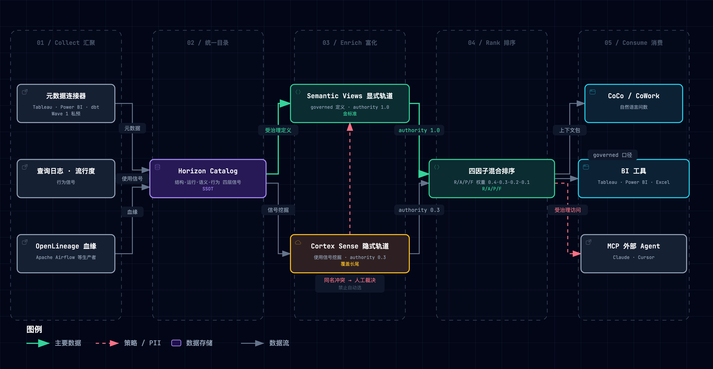
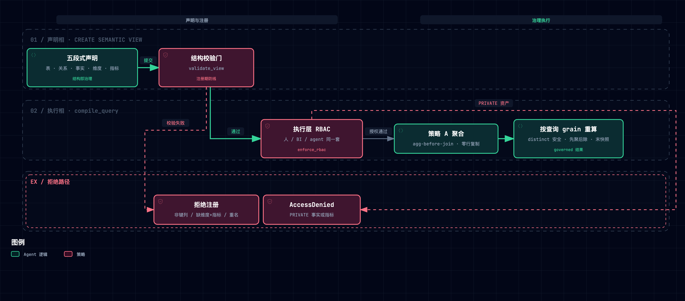

# Snowflake Horizon Context 精读笔记

> [Snowflake, "Horizon Context — Governed Semantic Layer & Data Catalog," 产品页, 2026](https://www.snowflake.com/en/product/features/horizon-context/) · [公告博客 "The Governed Context Layer for AI, BI and Apps," 2026-06](https://www.snowflake.com/en/blog/horizon-context-governed-context/) · [Summit 26 新闻稿, 2026-06-02](https://www.snowflake.com/en/news/press-releases/snowflake-advances-trusted-ai-with-snowflake-horizon-catalog-centralizing-governance-context-and-security-across-the-enterprise/) · [docs: 语义视图](https://docs.snowflake.com/en/user-guide/views-semantic/overview) / [CREATE SEMANTIC VIEW](https://docs.snowflake.com/en/sql-reference/sql/create-semantic-view) / [validation-rules](https://docs.snowflake.com/en/user-guide/views-semantic/validation-rules) · [Cortex Sense 博客, 2026-06-30](https://www.snowflake.com/en/blog/enterprise-ai-agents-grounded-context/) · [工程博客 "Why Do We Need Semantic Views?", 2026-03](https://www.snowflake.com/en/blog/engineering/why-we-need-semantic-views/) · [OSI→Apache Ossie](https://www.snowflake.com/en/blog/apache-ossie-open-semantic-interchange-incubator/)（产品深度研读，非论文；引用格式从惯例）

**一句话定位**：Horizon Context 是「**住进治理引擎、在查询时强制执行**」的上下文层——把业务定义、指标、关系、血缘、用法沉淀为受治理的元数据对象，让人、BI 工具、AI Agent 从同一份定义推理，而不是各自猜。官方三句话递进：*Without context, an agent guesses. With context built natively into the platform, an agent acts. With context that is also governed natively, an agent can be trusted.*

**总类比**：AI Agent 是一个**每天都在重新入职、毫无记忆的新员工**；Horizon Context 是那份**永远最新的入职包**——公司术语表（semantic views 显式定义）+「大家实际都在用什么」的行为统计（Cortex Sense 隐式挖掘）+ 门禁卡与权限（引擎级 RBAC）+ 前台问询处（CoCo 混合检索）+ 前辈验证过的 FAQ（AI_VERIFIED_QUERIES 带署名与日期）。

**怎么读这篇笔记**：每个机制按「类比 → 机制 → 原型实景」三拍走。实景全部取自配套最小原型 [`assets/horizon_context_lab.py`](./assets/horizon_context_lab.py)（约 916 行纯标准库，M1–M6 六机制 + 场景矩阵 + 破坏性实验，已随笔记入库；另有 MCP 服务原型 [`assets/horizon_context_mcp.py`](./assets/horizon_context_mcp.py) 验证平台集成路径）；所有日志均为实际运行输出。开发沙盒位于 `.temp/horizon-context-lab/`（gitignore，随时可清理，可用笔记中的日志与入库副本复刻）。⚠ 行数超出 skill 软上限（500）：以双语场景日志与更全断言换来的明确取舍。

配套产物：[Horizon Context ↔ negentropy 机制映射报告](./horizon-context-mapping-negentropy.md) · [Context Layer 基础设施设计蓝图](../context-layer-blueprint.md)。

---

## 1. 它要解决什么问题：每天都在重新入职的天才实习生

想象一位简历光鲜的实习生（LLM 能力很强），每天入职一次、毫无记忆。公司数据里没有业务含义——毛收入在库里叫 `amt_ttl_pre_dsc`，「净收入」的口径散落在 20 个看板的 `CASE WHEN` 里。两家独立实测给出了同一个基线：**没有上下文层时，agent 回答企业数据问题的准确率只有 ~25%（Snowflake 内测）/ 21%（Anthropic 独立复测）**——不是模型笨，是含义不在数据里。

归因出三个具体病灶：①含义散落（同一问题两个分析师两个答案）；②外挂语义层必然漂移（「层不在引擎里，每次查询要对账两套系统，agent 跟着错的定义走」——官方博客原话）；③治理外挂可被绕过（第三方层拦不住直查物理表）。由此提出五条设计规格，全文每个机制都能映射回其中一条：

| 设计规格 | 通俗版 | 对应机制 |
| --- | --- | --- |
| 定义一次、处处生效 | 术语表只写一遍，BI/agent/人都引用不抄写 | §2 上下文对象模型 |
| 算得对 | 菜谱按查询粒度现场做，不吃隔夜冷饭 | §3 查询时语义正确性 |
| 治理不可绕过 | 门禁装在楼里，不是贴在墙上的告示 | §4 治理内嵌引擎 |
| 覆盖得了 95% 的长尾 | 手册写不完的部分靠观察补 | §5 富化与自纠 |
| 处处可用 | 术语表带着走（开放格式 + 通用插头） | §7 开放互操作 |

## 2. M1 · 上下文对象模型：把便利贴装订成带版本号的手册

**类比**：墙上钉满便利贴（散落的 SQL/prompt 硬编码）vs 装订成册、有 owner、有版本、有权限的规章制度手册。手册里甚至夹着「agent 使用说明」（AI_SQL_GENERATION）和「前辈验证过的 FAQ」（AI_VERIFIED_QUERIES）。

**机制**：`CREATE SEMANTIC VIEW` 五段式声明——TABLES（带 PRIMARY KEY/UNIQUE 约束）→ RELATIONSHIPS（声明式 join，FK 必须指向键列）→ FACTS（行级量，可 `PRIVATE`）→ DIMENSIONS（切片维度，可挂 Cortex Search）→ METRICS（命名聚合）。语义视图**被官方明确定义为元数据**（"Semantic views are considered metadata"），与数据同库同治理。对象字段里藏着五个易被低估的设计：

1. **`WITH SYNONYMS`**——agent 召回所需的别名本身就是受治理上下文（「毛收入/营收/sales」写进定义）；
2. **`AI_VERIFIED_QUERIES`**——人验证过的问答对成为一等资产：`QUESTION + SQL + VERIFIED_AT + VERIFIED_BY (purpose=contact)`，**答案样例带审计溯源**；
3. **`AI_SQL_GENERATION / AI_QUESTION_CATEGORIZATION`**——给 agent 的提示词内嵌在定义里，随定义分发、随定义治理；
4. **`PRIVATE | PUBLIC`**——事实与指标级可见性；
5. **`NON ADDITIVE BY (dims)`**——半可加性声明（§3）。

四层上下文分类法（官方 FAQ）：**Structural**（有什么、怎么连）/ **Operational**（查询、新鲜度、性能）/ **Semantic**（定义、指标、本体）/ **Behavioral**（热度、用法模式）——这四层就是 Collect→Enrich→Activate 流水线上流转的原料。



> 图源（可 diff 文本）：[`horizon-context--collect-enrich-activate.mmd`](../../assets/mermaid/paper-notes/horizon-context--collect-enrich-activate.mmd) · 交互版（下载到本地打开）：[`horizon-context--collect-enrich-activate.html`](../../assets/architecture/paper-notes/horizon-context--collect-enrich-activate.html)

**原型实景**——结构校验门拦下「指向非键列的 relationship」（D6 实验，实际运行输出）：

```text
[PASS] D6: 拆结构校验（relationship 指向非键列）→ relationship bad: referenced column
customers.plan is not PRIMARY KEY/UNIQUE—— 无门则垃圾定义静默入库（行数失控的注册期引信）
```

## 3. M2 · 查询时语义正确性：菜谱写「临出锅再勾芡」

**类比**：指标是**命名聚合**（一段算式）不是存储值——每次查询按你要的粒度现场重算。菜谱写「临出锅再勾芡」，按菜谱做不会错；但淀粉若已被上游兑成芡水倒进来（dbt 已把日活预聚合成日汇总），菜谱救不了——**这条规律只保「按你给的 grain 算对」，不保「grain 本身对」**。

**机制**：四个聚合保障 + 一个消歧——①**agg-before-join**：每个指标先各自聚合到目标粒度再合并（防 fan trap：join 复制行把 $100 算成 $300）；②**distinct 聚合跨 join 安全**：`COUNT(DISTINCT)` 在复制行上数的是集合不是行；③**derived 先聚后除**：`DIV0(total_revenue, total_cost)` 分子分母各自聚合，防 average of averages；④**NON ADDITIVE BY**：按声明维度排序取**末快照**而非求和（余额可以跨账户相加、不能跨天相加）；⑤**USING (relationship)**：多 join 路径时显式消歧。官方工程博客用三个经典陷阱背书：fan trap（Sam Waters 案 $100→$300）、chasm trap（共享维度的笛卡尔爆炸）、average of averages（16.0 vs 真实 4.8）——并给出关键判断：「*valid SQL, but not valid analytics*」，LLM 在 TPC-DS 上同样踩坑。



> 图源（可 diff 文本）：[`horizon-context--declaration-execution.mmd`](../../assets/mermaid/paper-notes/horizon-context--declaration-execution.mmd) · 交互版（下载到本地打开）：[`horizon-context--declaration-execution.html`](../../assets/architecture/paper-notes/horizon-context--declaration-execution.html)

**原型实景**（B 场景实际运行输出，对照值均为引擎正确路径）：

```text
[PASS] B1: fan trap: 引擎 Jan=200 vs 朴素 Jan=440（o1 的 3 条事件把 $100 变 $300）
[PASS] B2: average of averages: 先聚后除 108.33 vs 月均值的均值 122.22
[PASS] B3: 拆 distinct: 退化为数事件行 [6,1,2]（对照 [3,1,2]）
[PASS] B4: NON ADDITIVE: 末快照 [5,6,7] vs 求和 [11,6,7]；全期 7 vs 24
[PASS] A3: distinct 跨 join 安全: 正常 [3,1,2]；fan-join 下 SUM=440 而 distinct 仍 [3,1,2]；月格相加 6 ≠ 总体重算 5
```

## 4. M3 · 治理内嵌引擎：门禁装在楼里，不是贴在墙上的告示

**类比**：独立监理公司（第三方上下文层）到处巡查提醒，但施工队可以半夜翻墙进场（直查物理表）；Horizon 把门禁装进大楼本身——**任何调用方（人、BI、agent）进门都刷卡**。

**机制**：官方文档原话——"*Governance policies execute at the query engine layer, not the application layer. They apply automatically to every caller: human analyst, BI tool, or AI agent. There is no separate governance configuration for AI workloads.*" agent 与人同一套 RBAC；PRIVATE 指标不可查询；AI Guardrails 在**出口**检测/脱敏/拦截 PII 与 PHI；标签与权限随数据产品携带（分享到 Marketplace 的数据集自带策略）；跨引擎（Iceberg REST 兼容引擎）策略一致执行。官方 FAQ 对第三方层的判词：「*Governance can be bypassed by querying tables directly. Horizon Context enforces security and business logic at the engine level — it cannot be circumvented.*」（注意边界：见 §10 第 3 条。）

**原型实景**——双层防线（C2，实际运行输出）：检索层把 PRIVATE 维度建议过滤掉只是第一层；**绕过检索直接闯执行层，照样被拒**：

```text
[PASS] C2: RBAC 双层: 检索层对 intern 过滤 plan 建议（["dim_filtered (PRIVATE): ['plan']"]，
降级总量 {(): 650}）；直闯执行层 → AccessDenied（引擎是最后防线）
```

## 5. M4 · 富化与自纠：encyclopedia 到 Wikipedia 的那一跳

**类比**：专家定期出版的百科全书（手工 semantic view，永远滞后、覆盖 <5%）→ 持续演化的 Wikipedia（从使用痕迹里长出理解）。Snowflake 官方总类比。关键在于**两轨冲突时系统不许自己挑**——必须端给人裁决。

**机制**：Snowflake 内部实测，9,685 张表 semantic view 覆盖**不到 5%**——「手册内的问题答得好，但大多数问题落在手册外」。Cortex Sense（2026-07 私预）从查询历史、转换工具模型、BI 指标里自动拼装「与 semantic view 同类的理解」，并用三层机制对抗「自动挖掘会 confidently wrong」的合理担忧：①**eval 自纠环**（金标准问答集 / 用户反馈 / 系统自检薄弱区三路输入，错配即修正理解）；②**冲突浮出**（挖到几十个互相矛盾的 DAU 定义时，不自动选，浮出给数据团队用自然语言指认「哪个口径归哪个团队」——官方自评「*forcing this level of honesty separates it from RAG that simply retrieve whatever is found*」）；③**信号排序**（§6）。战绩：在定义过时与未覆盖两个区域反超人工 10 个百分点；整站搭建从数月缩到一天。

**原型实景**（C3 冲突隔离 + C4 自纠环，实际运行输出）：

```text
[PASS] C3: 冲突浮出: CONFLICT 卡片 [('governed', 'count_distinct(orders.customer_id)'),
('inferred', 'count(events.id) by total')]（无数值）；agent 拒答；compile → ConflictingDefinitionError
[PASS] C3b: 人工裁决（governed 胜）后恢复: [3, 1, 2]
[PASS] C4: 自纠环: 错配前 top1=active_users（sum(dau)=[11,6,7] 错）→ 补 synonym + 调信号
→ top1=active_customers（count_distinct=[3,1,2] 对）
```

## 6. M5 + M6 · 检索激活与信号排序：前台问询处的排序哲学

**类比**：前台不把整本手册塞给你，按「跟问题多相关、多权威、多常被问、多新」抽两页；抽到的是**带署名的 FAQ**就直接念答案。

**机制**：agent 问自然语言问题 → 上下文层混合匹配（关键词 + 语义，Universal Search 的 "hybrid keyword and semantic ranking"）选 top-k 上下文包（定义 + 指令 + 验证问答）→ agent 据此生成查询。**四因子排序**（Cortex Sense 官方自比 web search 排网页）：*relevance / authority / popularity / freshness*——「受治理 semantic view 的定义 authority 高于从少量查询推断的；出现在 500 条生产 SQL 的 join 模式重于出现 3 次的；上月更新的定义压过两年前的」。无 SV 覆盖的新表（两周前上线的定价方案）是经典边缘：纯 semantic view 路径的 agent 拒答，通用 agent 可能自信错，Sense 给推断口径答案。

**原型实景**（A1 verified 短路 + C1 无覆盖 + C5 freshness，实际运行输出）：

```text
[PASS] A1: verified 短路重放 + 溯源: verified_query {'2026-01': 200, '2026-02': 150,
'2026-03': 300} by ( data_governance = data-team@acme.com )
[PASS] A1b: 引擎重算 == 验证答案（对账一致）: [200, 150, 300]
[PASS] C1: 新表无 SV: inferred 条目胜出 + 警告 ['no_governed_coverage']；覆盖 4/5 表
[PASS] C5: freshness 隔离: 'sales' → governed revenue(fresh=0.96) 压过 legacy(0.00):
[('revenue', 'governed', 0.854), ('revenue', 'legacy', 0.826)]
```

## 7. 开放互操作：定义的「通用插头」

**机制**：两条开放路径——①**OSI → Apache Ossie（Incubating）**：YAML/JSON 语义模型规范（metrics/dimensions/relationships），2025-11 由 Snowflake + Salesforce + dbt Labs 等 17 家发起，进 Apache 孵化器后 50+ 组织参与、3 个工作组（Metric Language / Catalog / Ontology），已交付 dbt MetricFlow、Apache Polaris、Snowflake Semantic Model 三个转换器；语义视图可经 `SYSTEM$CREATE_SEMANTIC_VIEW_FROM_YAML` 导入。②**MCP**：Snowflake 官方管理的 MCP server 把语义视图（经 Cortex Analyst）与 Cortex Search 暴露给外部 agent——Claude Desktop / Claude Code / Cursor 添加 custom connector 即可「受治理地」问数。

**原型实景**——MCP 服务原型（[`assets/horizon_context_mcp.py`](./assets/horizon_context_mcp.py)，纯标准库 stdio JSON-RPC，实际运行输出）：

```text
[PASS] T3: resolve_context: {'name': 'spend', 'score': 0.73, 'source': 'inferred'} + ['no_governed_coverage']
[PASS] T5: 引擎层 RBAC 经 MCP 仍生效: plan is a PRIVATE fact
[PASS] T6: 行为反馈闭环: feedback down 后 'sales' 解析 governed → legacy（popularity 参与排序）
[PASS] T8: 子进程 stdio 往返: 2 响应行, active_customers=[3, 1, 2]
```

## 8. 关键实证数字

| 实验 | 关键数字 | 一句话读法 |
| --- | --- | --- |
| 无上下文基线（Cortex Sense 博客） | ~25%（Snowflake 内测）；21%（Anthropic 独立复测） | 两家独立测出同一结论：缺业务含义时 agent 就是瞎猜 |
| CoCo + Cortex Sense（同上） | 准确率 24.1% → 86.3%；成本 $1.76 → $0.59/query | 上下文层把准确率抬 3.6 倍、成本砍 2/3（自家基准，见 §10-1） |
| 覆盖率现实（同上） | 9,685 表 semantic view 覆盖 <5% | 纯手工金标准覆盖不动——隐式轨道的存在理由 |
| fan trap（工程博客） | $100 → $300（join 复制后） | valid SQL ≠ valid analytics |
| average of averages（同上） | 16.0 vs 4.8 | 无加权平均把大小团队同权 |
| distinct 跨时间相加（Typedef 复现） | 玩具 4 vs 3；生产 477 vs 48 | governed 定义在塌缩 grain 上照样错——治理 ≠ 验证 |
| OSI → Apache Ossie | 17 创始伙伴 → 50+ 组织；100+ commits / 35 PRs | 语义可携带已成行业共识，非单一厂商私产 |
| 本原型 | 200 vs 440；7 vs 24；[3,1,2] vs [6,1,2]；108.33 vs 122.22 | 六机制在玩具域的逐点复现（§9） |

## 9. 动手实验室：把机制亲手拆坏七次

运行方式（秒级，仓库根目录执行）：

```bash
uv run --no-project python docs/reference/paper-notes/assets/horizon_context_lab.py --selftest
uv run --no-project python docs/reference/paper-notes/assets/horizon_context_mcp.py --selftest
```

机制 → 代码位置速查（`horizon_context_lab.py`）：

| 机制 | 位置 |
| --- | --- |
| M1 五段式对象 + 验证问答 | `SemanticView` :157 · `VerifiedQuery` :148 · `build_sales_view` :170 |
| M1 结构校验门 | `validate_view` :232（FK→键列 / ≥1 dim+metric / 重名 / NON ADDITIVE 维度存在） |
| M2 查询引擎 + 破坏开关 | `compile_query` :375 · `_naive_joined_rows` :316（策略 B 反事实）· `_aggregate` :342 · USING 消歧 `_dim_value` :288 |
| M3 双层 RBAC | 执行层 `compile_query` :375 内 `enforce_rbac` 分支；检索层 `resolve` :532 的 `dim_filtered` |
| M4 冲突隔离 + 自纠环 | `Catalog.detect_conflicts` :493 · `adjudicate` :509 · `eval_loop` :629 |
| M5 检索 + mock agent | `resolve` :532 · `mock_agent` :596（verified 短路 / compile / cannot_answer） |
| M6 四因子排序 | `rank` :463 · `freshness` :452（REF_DATE 固定字面量） |

**破坏性实验**（均为实测，每个只改一个 flag / 一行）：

| # | 拆什么 | 实测退化 | 教训 |
| --- | --- | --- | --- |
| D1 | `agg_before_join=False` | Jan 收入 440（对照 200） | join-then-aggregate 是 fan trap 的标准死法，LLM 也会踩 |
| D2 | `distinct_safe=False` | [6,1,2]（对照 [3,1,2]） | distinct 的安全性来自「数集合不数行」，退化即双计 |
| D3 | `last_snapshot=False` | DAU [11,6,7]（对照 [5,6,7]） | 半可加指标求和 = 同一台服务器按天重复计数（477 vs 48 的机制） |
| D4 | 冲突策略改 `auto_popularity` | 推断层 count(events) 胜出 [6,1,2]（对照 [3,1,2]） | 「不自动选」保住的正是多数派错误不碾压正确口径 |
| D5 | `enforce_rbac=False` | intern 按 plan 拿到 [90,560]（泄露发生） | 检索层过滤是体验，执行层拒绝才是治理 |
| D6 | 跳过 validate 注册坏视图 | relationship 指向非键列被拦下；无门则垃圾定义静默入库 | 结构校验是行数失控的注册期前置防线 |
| D7 | `derived_post_agg=False` | aov 122.22（对照 108.33） | 平均的平均不是平均——derived 必须先聚后除 |

七次实验合起来的实践心得与 PG 一致：每个组件单拎出来都不神奇，**拆掉任何一个都有具体的、可复现的坏法**——这是判别「工程组合创新」成色的试金石。

## 10. 批判性边界（材料没有证明的事）

1. **86.3% 是 Snowflake 自家基准**——自家数据、自家评测口径；Anthropic 只独立复现了 21% 的**基线端**，增益端无第三方复现。
2. **整体处于 preview**（2026-06 时点）——5 个元数据连接器与 Semantic Studio 私预、OpenLineage 公预、Business Glossary 在 H2 2026 路线图；BlackRock 是早期采用证言，不是效果数据；官方博客自带 forward-looking 声明。
3. **「不可绕过」只在引擎周界内成立**——直查底层数据库、导出数据即绕过；OSI 解决定义**携带**，不解决定义在别家引擎的**执行**。
4. **governance ≠ verification**——`NON ADDITIVE BY` 是人填的声明非系统推导；上游 dbt 已把 grain 塌缩（日汇总）后，semantic view 的正确算式照样产出 477 vs 48 的错误数字；lineage 是查询日志观察到的「谁喂谁」记录，不是「这么算合法吗」的校验（Cortex Agent Evaluations 是独立 opt-in 的事后评分，不在 Horizon Context 内）。
5. **信号排序可能放大多数派错误**——popularity 权重下，被 500 条查询使用的错误 join 模式压过 3 条查询的正确模式；per-role context 未交付（私测期单角色全量）。

## 11. 验收问答（自测答案要点）

1. **为什么语义层必须住进治理引擎**：外挂层每次查询对账两套系统→漂移；治理外挂可被直查绕过；引擎级执行对每个调用方自动生效、无单独 AI 配置（官方博客 + docs 原话；原型 C2 演示双层防线）。
2. **为什么按查询 grain 重算**：存储的总数冻结了粒度与过滤条件；按 grain 重算让 distinct 聚合跨 join 安全（数集合不数行）、derived 先聚后除；而 SUM 在复制行上必然膨胀（B1/B3/A3 实测）。
3. **为什么冲突必须浮出人工**：自动选择（哪怕按 popularity）会让多数派错误碾压正确口径（D4 实测 [6,1,2]）；「诚实度」正是与 RAG「找到什么用什么」的分界（官方原话）。
4. **OSI 没解决什么**：可携带 ≠ 可执行（别家引擎不替你 enforce）；可携带 ≠ 已验证（validator 只查 schema 合法性，不查计算合法性）。
5. **预测题（两周前新表）**：纯 SV 路径的 Cortex Agent 拒答（无覆盖即不猜）；CoCo+Sense 给推断口径的答案（authority 低、可带 warning）；直连库的通用 agent 可能自信错。第一步观察：Sense 给推断定义的 authority 与警告（原型 C1：`no_governed_coverage` + inferred 条目胜出）。

## 12. 与本仓的关联

- 机制级对照（definitions registry ↔ context objects、patrol/Judge ↔ eval 自纠环、三层渐进披露 ↔ verified query 分发等 10 条）见 [Horizon Context ↔ negentropy 机制映射报告](./horizon-context-mapping-negentropy.md)。
- 本仓的上下文治理织物方案（Collect/Enrich/Activate 三相 × 四信号层 × Context Catalog/Router/Guard）见 [Context Layer 技术方案](../../concepts/design/context-layer.md)；通用可复刻基础设施的架构设计见 [Context Layer 基础设施设计蓝图](../context-layer-blueprint.md)。
- Snowflake 数据云调研中的 Horizon Catalog 章节见 [研究文档 §D7](../../research/retrieval-storage/034-snowflake-data-cloud.md)。

## 参考

[1] Snowflake, "Horizon Context — Governed Semantic Layer & Data Catalog," *Snowflake Product*, 2026. [Online]. Available: https://www.snowflake.com/en/product/features/horizon-context/

[2] Snowflake, "Snowflake Horizon Context: The Governed Context Layer for AI, BI and Apps," *Snowflake Blog*, Jun. 2026. [Online]. Available: https://www.snowflake.com/en/blog/horizon-context-governed-context/

[3] Snowflake, "Snowflake Advances Trusted AI with Snowflake Horizon Catalog Centralizing Governance, Context, and Security Across the Enterprise," *Press Release*, Snowflake Summit 26, Jun. 2, 2026. [Online]. Available: https://www.snowflake.com/en/news/press-releases/snowflake-advances-trusted-ai-with-snowflake-horizon-catalog-centralizing-governance-context-and-security-across-the-enterprise/

[4] Snowflake Documentation, "Overview of semantic views," "CREATE SEMANTIC VIEW," "How Snowflake validates semantic views," "Snowflake Horizon Catalog," *docs.snowflake.com*, 2026. [Online]. Available: https://docs.snowflake.com/en/user-guide/views-semantic/overview

[5] Snowflake, "Introducing Cortex Sense: Grounded Context for the Data You Never Modeled," *Snowflake Blog*, Jun. 30, 2026. [Online]. Available: https://www.snowflake.com/en/blog/enterprise-ai-agents-grounded-context/

[6] Snowflake, "Why Do We Need Semantic Views? Avoiding Subtle Mistakes in Complex Calculations," *Snowflake Engineering Blog*, Mar. 2026. [Online]. Available: https://www.snowflake.com/en/blog/engineering/why-we-need-semantic-views/

[7] Snowflake, "Snowflake Unites Industry Leaders to Unlock AI's Potential with the Open Semantic Interchange Initiative," *Snowflake Blog*, Nov. 2025; "Apache Ossie (Incubating): The New Name for Open Semantic Interchange," *Snowflake Blog*, Jul. 2026. [Online]. Available: https://www.snowflake.com/en/blog/apache-ossie-open-semantic-interchange-incubator/

[8] Typedef, "What Is Horizon Context? Snowflake's Governed Context Layer Explained," Jun. 12, 2026. [Online]. Available: https://www.typedef.ai/blog/what-is-horizon-context-snowflakes-governed-context-layer-explained

[9] Atlan, "Snowflake Horizon Context vs the Enterprise Context Layer," Jun. 2026. [Online]. Available: https://atlan.com/know/snowflake/snowflake-horizon-context/

[10] A. K. Dey, "Understanding and Using Context," *Personal and Ubiquitous Computing*, vol. 5, no. 1, pp. 4–7, 2001.（上下文的经典学术定义）
