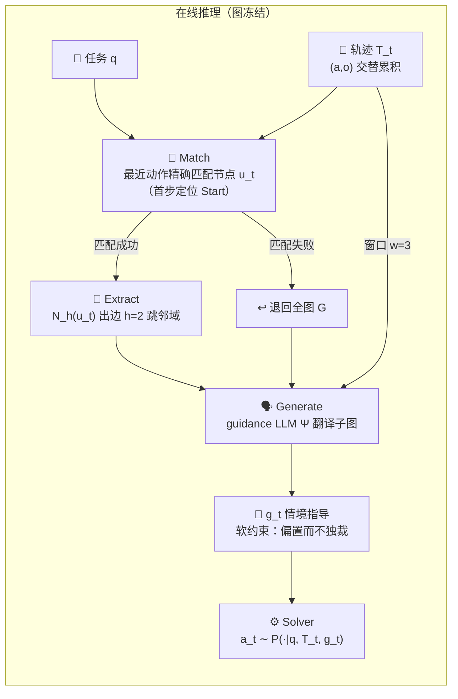
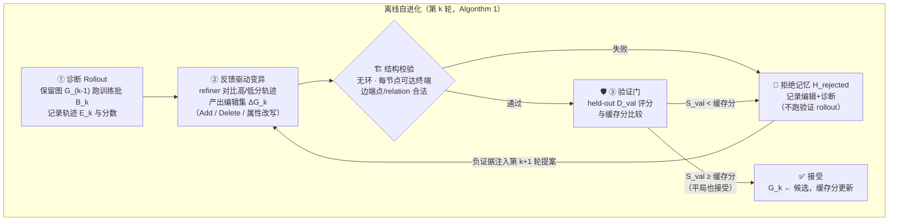

# Procedural Graph 论文精读笔记

> [Y. Lu, Y. Chen, S. Wu, and S. Ö. Arık, "Procedural Graphs: Self-Evolving Execution Structures for LLM Agents," arXiv:2609.09153, Sep. 2026.](https://arxiv.org/abs/2609.09153)（Google）

**一句话定位**：把「怎么做」（procedural knowledge）从模型权重和自由文本里拿出来，外置成一张**显式、带属性、可编辑的有向图**——agent 每步在图上定位自己、读周边子图得到软指导；离线时由 refiner 对比成败轨迹对图做增删改，**过 held-out 验证门才提交**。

**类比**：新员工与老员工的差距不在智商，而在老员工脑中那张「什么情况走什么流程」的地图。PG 做三件事：① 把地图画出来挂墙上（外置显式化）；② 干活时只看当前路口附近两步（定位 + 邻域）；③ 每次干完按成败复盘更新地图，新版本须先通过考核才许上墙（验证门）。

配套产物：[PG ↔ negentropy 机制映射报告](./pg-mapping-negentropy.md)；最小可运行原型 `.temp/pg-lab/pg_lab.py`（学习用途，随 .temp 清理，关键输出已摘录在本文 §5）。

---

## 1. 表示层：G=(V, R, E, Φ)

| 元素 | 含义 | 论文实现 |
| --- | --- | --- |
| 节点 V | 抽象的过程单元 | 工具函数 / 技能 / 推理步骤 / 任务状态 |
| 关系 R | 转移词表 | `LEADS_TO` · `TRIGGERS` · `PROVIDES_INPUT_FOR` · `CONVERGES_TO` |
| 边 E ⊆ V×R×V | 有向三元组 `(procedure, relation, procedure)`——**what-to-do 的对偶物**：知识图谱组织事实回答 what-is，PG 组织过程回答 what-to-do | 与 KG 的同构是全文的直觉入口（论文 Figure 1） |
| 属性 Φ | 边上命名属性 | `condition`（何时走）/ `guidance`（怎么走）/ `pitfalls`（别踩什么坑） |

金融规划示例（论文 §3.1 原例）：边 `(cash_flow_forecast, LEADS_TO, fund_raising_request)` 携带属性——condition「预计跑道跌破安全缓冲」、guidance「尽早提交请求以对冲到账延迟」、pitfalls「一笔在途时不要叠加第二笔」。

图规模极轻：除 BFCL v3（131 节点，映射其大工具目录）外，各基准图仅 **7–17 节点 / 7–27 三元组**（附录 B.4）。

## 2. 在线消费：Generative PG Guidance



三个设计决策及其理由（消融 §5.5 均有实证背书）：

1. **为什么邻域检索而非 top-k**——独立 top-k 检索会丢「程序性连接」：检索到 `submit` 的 guidance 却丢了前置 `check_answer`，验证步骤就此消失；连通邻域天然携带前置条件。
2. **为什么生成式翻译而非 raw 注入**——raw 注入整图让 solver 自己现场解读，结构化对话任务略升（MultiChallenge 80.27→86.60）但具身执行任务反降（ALFWorld 72.58→70.34）；**全图 + 生成式**更糟（ALFWorld 崩至 54.48，token 还更贵）。定位 + 生成式三者基准全优。
3. **为什么软注入**——`g_t` 只进 prompt 偏置分布，不约束解码（对比 TOOLDEC 的硬 FSM：保证语法合法但不管语义可否）。论文立场可概括为**「硬表示、软消费」**：图显式化合法转移（结构硬），注入保持推理自由（消费软）。

## 3. 离线自进化：四步循环 + 验证门 + 拒绝记忆



四个易被忽略的工程细节：

- **先删后加**：`delete_edges` 按 (source, target) 删该端点对全部边，需保留的边经 `add_edges` 加回（附录 B.5）——编辑语义幂等可重放。
- **平局也接受**（式 5 用 `≥` 而非 `>`）：随机评估下平局携带信息，且给拓扑简化等中性编辑留出路。
- **结构校验在 rollout 之前**：非法候选连验证预算都不花，直接入拒绝记忆（Algorithm 1 L11–13）。
- **拒绝记忆是「禁忌表」**：被拒编辑连同轨迹作为**负证据**进入下一轮 refiner 上下文（式 6），阻断等价坏编辑的重复提案——对应进化计算中的 tabu search。

## 4. 关键实证数字

| 实验 | 关键数字 | 读法 |
| --- | --- | --- |
| 主结果（§5.1） | 7 基准 × 4 LLM，21/24 第一或并列第一；vs 各设定最强 baseline 19 胜 2 平 3 负（sign test p=4.3×10⁻⁴） | 跨任务跨模型的一致增益，非单点运气 |
| 长程决策（§5.2） | EnterpriseArena 生存率：Claude 44→58%、Gemini Pro 6→34%、Grok 26→40%；决定性行为是**提前筹资**（资金延迟 1–6 月到账）：baseline 筹 $0.00M vs PG-Flash $9.39M / PG-Grok $30.11M | 图改变的是「何时调用什么工具」，不是调用次数 |
| 自进化（§5.4 + 附录 E） | 验证集生存率 0%→45%(R1 骨架发现)→80%(R2 recall_notes 工作记忆)→90%(R8 管理旁路)；工具调用 17.23→3.08 次/月（**-81.8%**）；测试 85% vs baseline 0%（Fisher p=2.6×10⁻⁸） | 逐轮拓扑演化全程可查：把 100 次失败压缩成一条边 |
| 构造模式（§5.3） | Mode 5（从零进化）HotpotQA 78.79 F1 全场最优（+7.58）；MultiChallenge 91.07 无人工先验；能修复劣质专家图 58.93→92.86（**+33.9**，而单次离线更新反而降到 53.57） | 人工设计可被进化取代乃至纠错；「一次更新」与「带门的迭代」有本质差距 |
| 消融（§5.5，Flash） | 邻域生成式三基准全优（89.31 / 63.99 / 81.53）；比全图生成式省 token 70.9% / 18.1% / 14.8%；但比无图 baseline 总 token **+33.4% / +55.4%** | 定位 + 生成式缺一不可；收益有代价（结论部分自认，列为 future work） |
| 被门拦下的提案（附录 E.2） | R3「降筹资阈值」训练集有效、验证 -15 分被拒；R5 结构非法未跑验证；R10 训练 90% / 验证 85% 被拒，循环止于 R9 | 验证门不是装饰——每个拦截面孔都有实例 |

## 5. 最小原型验证（pg-lab）

`.temp/pg-lab/pg_lab.py`（约 500 行，纯标准库）以「fetch → validate → fix → submit / abort」玩具域复现五机制，五轮进化日志（`uv run --no-project python pg_lab.py --selftest`）：

```text
Round 0 基线：S_val=0.40（初始图 2 条边）
Round 1 ACCEPT [add-validation-branch]：S_val 0.40 → 0.80
Round 2 REJECT [shortcut-fetch-to-submit]：S_val 0.40 < 缓存 0.80 → 写入拒绝记忆
Round 3 拒绝记忆命中：首选编辑 [shortcut-fetch-to-submit] → 改提 [add-abort-branch]
Round 3 ACCEPT [add-abort-branch]：S_val 0.80 → 1.00
Round 4 ACCEPT(平局) [revise-validate-submit-pitfalls]：S_val 1.00 → 1.00
Round 5 REJECT(结构性) [cycle-recheck]：存在环；验证 rollout 跳过
```

R2 是论文 R3/R10 的微缩复刻（训练集动机未泛化到验证集），R3 演示拒绝记忆如何把 refiner 推向不同提案。

## 6. 批判性边界（论文未证明的事）

1. **验证集极小**：EnterpriseArena 进化研究仅 20 局/切分，作者自陈「单次接受/拒绝由一两局决定，应读作搜索轨迹而非显著性检验」——进化部分是案例研究级别证据。
2. **模型未解耦**：guidance、refiner 与 solver 恒用同一 LLM，指导质量对模型家族的依赖未测。
3. **成本未摊销**：全部增益带 33–55% token 开销与每步一次额外 guidance 调用；steps 降了、总 token 反升。
4. **迁移未测**：跨 solver、跨工具接口的可复用性留白（作者列为 future work）——而这恰是「程序性知识资产化」主张的关键前提。
5. **拒绝记忆无界增长**：仅以尾部截断兜底，轮次多了以后负证据上下文的膨胀成本未讨论。

## 7. 验收问答（阶段 1 自测答案要点）

1. **top-k 为何不够 / 邻域如何修复**：top-k 按相似度独立取边，丢「程序性连接」（submit 丢了前置 check_answer）；邻域从当前定位点沿出边扩张，前置条件随连通性自带。
2. **验证门为何平局也接受**：随机评估下平局含信息（非退化）；且让拓扑简化类中性编辑可入图——门挡的是「可测退化」，不是「无改进」。
3. **结构校验为何在 rollout 之前**：非法候选（环、死端、断端点）注定不可用，先拦截省验证预算并直接沉淀为负证据（Algorithm 1 L11–13）。
4. **三种消费方式差异成因**：raw 注入把解读负担留给 solver（结构化任务略受益、具身任务受损）；全图生成式信息过载稀释定位焦点（ALFWorld 54.48）；邻域生成式「信息够用且聚焦」三者全优。
5. **为何报告 85% 而非 95%**：95% 是搜索途中单轮最优，报告它等于在测试集上选优（test-set selection bias）；返回图（85%）才是部署会拿到的真实产物。

## 8. 与本仓的关联

- 机制级对照（验证门 ↔ evolution 门控、拒绝记忆 ↔ 巡检失败记忆、平局接受 ↔ 金丝雀零改进容忍）详见 [PG ↔ negentropy 机制映射报告](./pg-mapping-negentropy.md)。
- 本仓已有的自进化设计（遥测→评测→提案→验证→门控发布闭环、GEPA/ACE 进化算子、Golden Set 双轨评测、金丝雀发布）见 [自进化 Agents Team 方案](../../concepts/design/self-evolving-agents.md)——PG 可视为该方案在「程序性知识表示层」的一个具体化样本。

## 参考

[1] Y. Lu, Y. Chen, S. Wu, and S. Ö. Arık, "Procedural Graphs: Self-Evolving Execution Structures for LLM Agents," arXiv:2609.09153, Sep. 2026. [Online]. Available: https://arxiv.org/abs/2609.09153

[2] T. Sumers, S. Yao, K. Narasimhan, and T. Griffiths, "Cognitive Architectures for Language Agents," *Trans. Mach. Learn. Res.*, 2023.（CoALA 记忆四象限；PG 自我定位为程序性记忆象限的实现）

[3] Y. Zhao et al., "ExpeL: LLM Agents Are Experiential Learners," in *Proc. AAAI*, 2024; Y. Fu et al., "AutoGuide," in *Proc. NeurIPS*, 2024; Z. Z. Wang et al., "Agent Workflow Memory," in *Proc. ICML*, 2025; Y. Zhu et al., "KnowAgent," in *Findings NAACL*, 2025.（结构化程度递增的 baseline 阶梯）

[4] J. Zhang et al., "AFlow: Automating Agentic Workflow Generation," in *Proc. ICLR*, 2025.（workflow 构造形式化为搜索——PG 的进化循环与之同族，差异在表示（attributed graph）与门控（验证门+拒绝记忆））
