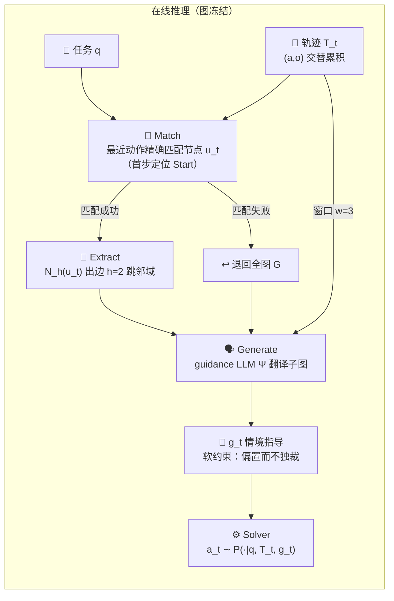
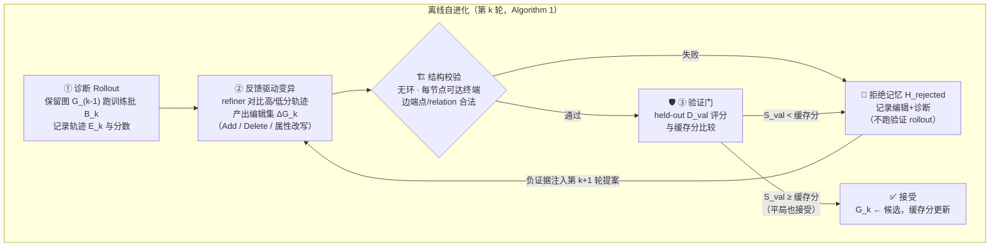

# Procedural Graph 论文精读笔记

> [Y. Lu, Y. Chen, S. Wu, and S. Ö. Arık, "Procedural Graphs: Self-Evolving Execution Structures for LLM Agents," arXiv:2609.09153, Sep. 2026.](https://arxiv.org/abs/2609.09153)（Google）

**一句话定位**：把「怎么做」（procedural knowledge）从模型权重和自由文本里拿出来，外置成一张**显式、带属性、可编辑的有向图**——agent 每步在图上定位自己、读周边子图得到软指导；离线时由 refiner 对比成败轨迹对图做增删改，**过 held-out 验证门才提交**。

**总类比**：新员工与老员工的差距不在智商，而在老员工脑中那张「什么情况走什么流程」的地图。PG 做三件事：① 把地图画出来挂墙上（外置显式化）；② 干活时只看当前路口附近两步（定位 + 邻域）；③ 每次干完按成败复盘更新地图，新版本须先通过考核才许上墙（验证门）。

**怎么读这篇笔记**：每个机制都按「类比 → 机制 → 原型实景」三拍走。实景全部取自配套最小原型 `.temp/pg-lab/pg_lab.py`（fetch → validate → fix → submit / abort 玩具域，纯标准库约 500 行，位于 gitignore 的 `.temp/`，可用 [§6 实验室](#6-动手实验室把机制亲手拆坏三次) 复刻）；所有代码与日志均为实际运行输出。

配套产物：[PG ↔ negentropy 机制映射报告](./pg-mapping-negentropy.md)。

---

## 1. 它要解决什么问题：聪明但没有流程意识的实习生

想象一位刚入职的实习生：简历光鲜、什么都会（LLM 能力很强），但没人给他流程手册——每做一步，他靠回忆自己干过的一切（accumulating history，越来越长的流水账）决定下一步。任务一长就露馅：忘了最初要干什么（**丢目标**）、先签字后审批（**乱序**）、同一份材料查三遍（**重复循环**）。这不是能力问题，是**流程知识缺位**：该走什么顺序、什么前提下才能做某步，全靠他临场发挥。

论文 §1 的诊断正是如此：unstrained generation over an accumulating history 把「程序性一致性」的责任压给了自由生成。由此提出四条设计规格，全文每个设计决策都能映射回其中一条：

| 设计规格 | 通俗版 | 对应机制 |
| --- | --- | --- |
| 足够结构化 | 把「什么不许做」画死在图上 | §2 三元组 + 边属性 |
| 保住推理自由 | 建议但不夺权，方向盘还在 agent 手里 | §3 软注入 |
| 响应当前进度 | 他在哪一步，就给哪一步的建议 | §3 Match 定位 + 邻域 |
| 能从经验改进 | 干砸了改地图，不用回炉重造实习生 | §4 进化循环 |

## 2. 表示层：一张带批注的菜谱

**类比**：知识图谱是**词典**——查「生抽是什么」（what-is）；Procedural Graph 是**菜谱**——查「下一步干什么」（what-to-do）。菜谱每一行「腌肉 → 下锅」的箭头边上，老师傅手写三行批注：**什么时候**走这步、**怎么**走、**千万别**做什么。普通菜谱只写步骤，好菜谱写满了踩过的坑。

形式化 `G = (V, R, E, Φ)`，`E ⊆ V × R × V`，每条边是一个有向三元组：

| 元素 | 含义 | 论文实现 |
| --- | --- | --- |
| 节点 V | 一个过程步骤 | 工具调用 / 技能 / 推理步骤 / 任务状态 |
| 关系 R | 箭头的类型 | `LEADS_TO` · `TRIGGERS` · `PROVIDES_INPUT_FOR` · `CONVERGES_TO` |
| 边 E | (procedure, relation, procedure)——词典条目的「怎么做」对偶物 | 与 KG 同构（论文 Figure 1） |
| 属性 Φ | 箭头上的批注 | `condition`（何时走）/ `guidance`（怎么走）/ `pitfalls`（别踩什么坑） |

金融例子（论文 §3.1 原例）：边 `(cash_flow_forecast, LEADS_TO, fund_raising_request)`——condition「预计跑道跌破安全缓冲」、guidance「尽早提交请求以对冲到账延迟」、pitfalls「一笔在途时不要叠加第二笔」。

**原型实景**——初始骨架故意是张**烂地图**：

```python
Edge("Start", "LEADS_TO", "fetch_data", guidance="先取数"),
Edge("fetch_data", "LEADS_TO", "submit_report",
     guidance="取数后直接提交",
     pitfalls="未校验的数据可能带 issues"),   # ← 批注喊了"有风险"，图上却没有校验这个路口！
```

pitfalls 嘴上说「未校验有风险」，图里却根本没有 `validate_data` 节点——**知识与结构脱节**。这正是后面进化要修的：这张 2 条边的烂图将在无人插手的情况下进化成 7 条边、验证分从 0.40 涨到 1.00（§4 实景）。

顺带一个反直觉事实：论文各基准的图只有 **7–17 节点 / 7–27 三元组**（附录 B.4）——一页纸的流程图，不是百科全书。唯一例外 BFCL v3 的 131 节点，也只是因为它的工具目录本身大。

## 3. 在线消费：导航三连

**类比**：你开车，导航系统干三件事——**GPS 先定位你在哪条路**（Match）；**只显示前方两个路口的放大图**，而不是摊开全国地图（2-hop 邻域）；**副驾的导航员把地图翻译成人话**：「下个路口右转，注意别压实线」（guidance LLM Ψ）。方向盘始终在你手里：导航员**建议而不夺权**（论文原话 *biases without dictating*）。



三个设计决策，消融（§5.5）逐一背书：

1. **为什么邻域检索而非 top-k 相似度**——相似 ≠ 相关。按关键词检索会取到「提交」的批注却丢了前置「校验」路口，验证步骤凭空消失（论文 §3.2 的 check_answer 例子）；邻域从「你站的位置」沿箭头展开，前置条件天然自带。就像导航要按当前位置展开，不是按路名搜全国。
2. **为什么生成式翻译而非把图原样塞进 prompt**——raw 注入等于递给司机一整本地图册让他自己找：结构化对话任务略受益（MultiChallenge 80.27→86.60），具身任务反而受损（ALFWorld 72.58→70.34）；**全图 + 生成式**更糟——导航员先把全城路线背一遍再开口（ALFWorld 崩至 54.48，token 还更贵）。邻域 + 生成式在三个基准全优。
3. **为什么软注入**——`g_t` 只进 prompt 偏置决策，不锁死动作空间。对比 TOOLDEC 的硬状态机：保证每个调用语法合法，但不管「此刻该不该做」。论文立场可概括为**「硬表示、软消费」**：地图是硬的（合法路线画死在图上），建议是软的（具体怎么开你定）。

**原型实景**——导航三连的代码面：

```python
match(None, g1)             # → "Start"          首个决策步，定位在起点
match("validate_data", g1)  # → "validate_data"  刚做完校验 → 此刻站在"校验"路口
neighborhood(g1, "validate_data", h=2)  # → 前方两跳：fix_format / submit_report（+ 二跳）
```

Ψ 收到的完整提示（实际运行输出）——定位、子图、批注、轨迹窗口、任务，五要素齐全：

```text
[Active Node] validate_data — 校验 schema 与完整性
[Subgraph]
  hop1: (validate_data) -TRIGGERS-> (fix_format)
      condition: 发现 issues
      guidance : 修复后重新进入提交流程
  hop1: (validate_data) -LEADS_TO-> (submit_report)
      condition: 无 issues
      guidance : 校验干净即可提交
      pitfalls : issues 未修复时严禁提交
  hop2: (fix_format) -LEADS_TO-> (submit_report)
      condition: 修复完成
[Recent Trajectory w=3] fetch_data -> validate_data
[Task] 交付本月经营数据报告
```

翻译出的 `g_t`（demo 版确定性翻译）：「当前位于 validate_data；可行动作：fix_format / submit_report；切勿：issues 未修复时严禁提交。」

而没有地图的 baseline 在 dirty 样本上的死法——`fetch_data → submit_report`，未校验即提交，直接失败——就是 §1 那位「乱序实习生」的最小复刻。

## 4. 离线自进化：月度复盘改手册

**类比**：餐厅每月复盘：① 把成功单和翻车单摆在一起对比（诊断 rollout）；② 老师傅据此提议改操作手册（refiner 变异：加步骤 / 删步骤 / 改批注）；③ 新手册先**试运营一周**，客诉没变多才正式换上（验证门，**打平也换**）；④ 试运营失败的改法连同翻车记录记进小本本（拒绝记忆），下次谁再提同样的馊主意，直接翻小本本怼回去。



四个易被忽略的工程细节，各配一句人话：

- **平局也接受**（式 5 用 `≥`）：门挡的是「可测退化」，不是「无改进」——就像 code review 放行「不改行为但更简洁」的重构；随机评估下打平本身携带信息。
- **先删后加**：`delete_edges` 按端点对清空、要保留的边重新加回（附录 B.5）——编辑幂等可重放，不会改属性改出半新半旧的边。
- **结构校验在 rollout 之前**：格式都没对的报表不必拿去算账——有环、死端的候选连验证预算都不花，直接进小本本（Algorithm 1 L11–13）。
- **拒绝记忆 = 禁忌表**：把进化计算的 tabu search 搬进 agent 自改造，被拒编辑连同轨迹作为**负证据**注入下一轮提案器（式 6）。

**原型实景**——五轮复盘全程（实际运行日志）：

```text
Round 0 基线：S_val=0.40（初始图 2 条边）
Round 1 ACCEPT [add-validation-branch]：S_val 0.40 → 0.80
Round 2 REJECT [shortcut-fetch-to-submit]：S_val 0.40 < 缓存 0.80 → 写入拒绝记忆
Round 3 拒绝记忆命中：首选编辑 [shortcut-fetch-to-submit] → 改提 [add-abort-branch]
Round 3 ACCEPT [add-abort-branch]：S_val 0.80 → 1.00
Round 4 ACCEPT(平局) [revise-validate-submit-pitfalls]：S_val 1.00 → 1.00
Round 5 REJECT(结构性) [cycle-recheck]：存在环；验证 rollout 跳过
```

逐轮讲故事，并与论文的真实进化对偶：

| 轮 | 发生了什么 | 论文对偶（EnterpriseArena） |
| --- | --- | --- |
| R1 | 复盘发现 dirty 样本全死于「未校验即提交」→ 加 4 条边建校验分支，0.40→0.80 | R1 发现「查现金→预测跑道→存笔记→查市场→再决策」骨架，生存率 0→45% |
| R2 | 「聪明」提案：clean 样本 3 步缩 2 步，训练集好看 → 验证集 0.40 大跌 → 拒绝并拉黑 | R3「降筹资阈值」训练有效、验证 -15 被拒；R10 训练 90% / 验证 85% 被拒 |
| R3 | refiner 首选又是删校验 → 撞黑名单 → **被迫换方向**提 abort 分支（空源时终止），0.80→1.00 | 拒绝记忆是论文的差异化设计；AFlow 等 workflow 搜索没有这层 |
| R4 | 只改批注（把经验写成显式 pitfalls），分数不动，平局接受 | 属性修订与拓扑编辑共用同一编辑接口（§3.3） |
| R5 | 提议「提交后回去复查」成环 → 结构校验拦截，验证都不用跑 | R5 候选结构校验失败，未跑 rollout 即拒 |

论文里同一循环的真实战绩更震撼：EnterpriseArena 十轮进化中，R2 只加了一条 `recall_notes` 边，就把「跨月记住上月算好的关键数字」变成了外部工作记忆——月均工具调用从 17.23 降到 3.08（**-81.8%**）。

**值得盯住的画面**：原型里 0.40 → 1.00 的全部编辑没有一个字节来自人工——图是从执行反馈里「长」出来的。这就是论文的核心主张「把 100 次失败压缩成一条边」。

## 5. 关键实证数字

| 实验 | 关键数字 | 一句话读法 |
| --- | --- | --- |
| 主结果（§5.1） | 7 基准 × 4 LLM，21/24 第一或并列第一；vs 最强 baseline 19 胜 2 平 3 负（sign test p=4.3×10⁻⁴） | 跨任务跨模型的一致增益，不是单点运气 |
| 长程决策（§5.2） | EnterpriseArena 生存率：Claude 44→58%、Gemini Pro 6→34%、Grok 26→40% | 决定性行为是**提前筹资**：贷款 1–6 个月才放款，必须晴天修屋顶——baseline 筹 $0.00M（现金见底才想起借钱），PG-Flash $9.39M、PG-Grok $30.11M |
| 自进化（§5.4 + 附录 E） | 验证集生存率 0%→45%(R1)→80%(R2)→90%(R8)；测试 85% vs baseline 0%（Fisher p=2.6×10⁻⁸） | 逐轮拓扑演化全程可查（见 §4 对偶表） |
| 构造模式（§5.3） | Mode 5（从零进化）HotpotQA 78.79 F1 全场最优；能修复劣质专家图 58.93→92.86（+33.9），而单次离线更新反而降到 53.57 | 新人靠复盘攒出的手册反超空降专家；「一次更新」与「带门的迭代」有本质差距 |
| 消融（§5.5，Flash） | 邻域生成式三基准全优；比全图生成式省 token 70.9% / 18.1% / 14.8%；但比无图 baseline 总 token **+33.4% / +55.4%** | 导航员不是免费的——收益有代价（作者自认，列为 future work） |
| 报告纪律（§5.4） | 报「返回图 85%」而非「搜索最优 95%」 | 只能报真正考出来的分，不能报刷题最好那一次（测试集选优） |

## 6. 动手实验室：把机制亲手拆坏三次

运行方式（约 1 秒）：`cd .temp/pg-lab && uv run --no-project python pg_lab.py --selftest`

机制 → 代码位置速查：

| 机制 | 位置（pg_lab.py） |
| --- | --- |
| 三元组 + 边属性 | `Edge` :38 · `Graph` 序列化 :53 |
| Match 定位 / 邻域 / Ψ 提示 | :122 / :129 / :147 |
| mock solver / 验证分 S_val | :212 / :249 |
| 结构校验 / 编辑集 | :259 / :304 |
| 提案器 / 四步循环 | :338 / :388 |

**破坏性实验**（以下结果均为实测，每个只改一两行）：

1. **把平局门改成严格门**：`evolve()` 里 `score >= cached` 改成 `>`。实测 R4 从「ACCEPT(平局)」变成「REJECT」——「把经验写进批注」这类中性改进**永远进不了图**。教训：门挡的应该是退化，不是无改进。
2. **拔掉拒绝记忆**：让 R3 看不到黑名单、重复 R2 的删校验提案。实测代价远不止「白烧一轮验证预算」：R3 同样被拒后，后续轮次再没发现 abort 分支——**终态停在 0.80，而正常路径是 1.00**。教训：拒绝记忆的价值是强迫搜索换方向，这 0.20 的差距就是它挣来的。
3. **关掉环校验**：`structural_check()` 跳过环检测。实测 R5 的环边候选通过其余校验、验证分打平 1.00 → **平局接受，垃圾环边混进图**。教训：验证门只看分数，拦不住「无害但无用」——结构校验拦的正是这一类。

三个实验合起来的实践心得：PG 的每个组件单拎出来都不神奇，**拆掉任何一个都有具体的、可复现的坏法**——这是判别「工程组合创新」成色的试金石。

## 7. 批判性边界（论文未证明的事）

1. **验证集极小**：EnterpriseArena 进化研究仅 20 局/切分，作者自陈「单次接受/拒绝由一两局决定，应读作搜索轨迹而非显著性检验」——进化部分是案例研究级别证据。
2. **模型未解耦**：guidance、refiner 与 solver 恒用同一 LLM，指导质量对模型家族的依赖未测。
3. **成本未摊销**：全部增益带 33–55% token 开销与每步一次额外 guidance 调用；steps 降了、总 token 反升。
4. **迁移未测**：跨 solver、跨工具接口的可复用性留白（作者列为 future work）——而这恰是「程序性知识资产化」主张的关键前提。
5. **拒绝记忆无界增长**：仅以尾部截断兜底，轮次多了以后负证据上下文的膨胀成本未讨论。

## 8. 验收问答（阶段 1 自测答案要点）

1. **top-k 为何不够 / 邻域如何修复**：top-k 按相似度独立取边，丢「程序性连接」（submit 丢了前置 check_answer）；邻域从当前定位点沿出边扩张，前置条件随连通性自带。
2. **验证门为何平局也接受**：随机评估下平局含信息（非退化）；且让拓扑简化类中性编辑可入图——门挡的是「可测退化」，不是「无改进」（亲手拆法见 §6 实验 1）。
3. **结构校验为何在 rollout 之前**：非法候选（环、死端、断端点）注定不可用，先拦截省验证预算并直接沉淀为负证据（Algorithm 1 L11–13；拆法见 §6 实验 3）。
4. **三种消费方式差异成因**：raw 注入把解读负担留给 solver（结构化任务略受益、具身任务受损）；全图生成式信息过载稀释定位焦点（ALFWorld 54.48）；邻域生成式「信息够用且聚焦」三者全优。
5. **为何报告 85% 而非 95%**：95% 是搜索途中单轮最优，报告它等于在测试集上选优；返回图（85%）才是部署会拿到的真实产物。

## 9. 与本仓的关联

- 机制级对照（验证门 ↔ evolution 门控、拒绝记忆 ↔ 巡检失败记忆、平局接受 ↔ 金丝雀零改进容忍）详见 [PG ↔ negentropy 机制映射报告](./pg-mapping-negentropy.md)。
- 本仓已有的自进化设计（遥测→评测→提案→验证→门控发布闭环、GEPA/ACE 进化算子、Golden Set 双轨评测、金丝雀发布）见 [自进化 Agents Team 方案](../../concepts/design/self-evolving-agents.md)——PG 可视为该方案在「程序性知识表示层」的一个具体化样本。

## 参考

[1] Y. Lu, Y. Chen, S. Wu, and S. Ö. Arık, "Procedural Graphs: Self-Evolving Execution Structures for LLM Agents," arXiv:2609.09153, Sep. 2026. [Online]. Available: https://arxiv.org/abs/2609.09153

[2] T. Sumers, S. Yao, K. Narasimhan, and T. Griffiths, "Cognitive Architectures for Language Agents," *Trans. Mach. Learn. Res.*, 2023.（CoALA 记忆四象限；PG 自我定位为程序性记忆象限的实现）

[3] Y. Zhao et al., "ExpeL: LLM Agents Are Experiential Learners," in *Proc. AAAI*, 2024; Y. Fu et al., "AutoGuide," in *Proc. NeurIPS*, 2024; Z. Z. Wang et al., "Agent Workflow Memory," in *Proc. ICML*, 2025; Y. Zhu et al., "KnowAgent," in *Findings NAACL*, 2025.（结构化程度递增的 baseline 阶梯）

[4] J. Zhang et al., "AFlow: Automating Agentic Workflow Generation," in *Proc. ICLR*, 2025.（workflow 构造形式化为搜索——PG 的进化循环与之同族，差异在表示（attributed graph）与门控（验证门+拒绝记忆））
