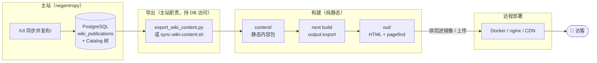

# Negentropy Wiki 独立部署与内容同步指引

> **适用对象**：负责把 `negentropy-wiki` 部署到远程环境、并把主站 Catalog 内容发布上去的工程师 / 运营。
>
> **一句话**：wiki 是**纯静态站点**（`output: export`），运行时无 Node/后端/数据库；内容来自仓库内 [`content/`](../../../apps/negentropy-wiki/content/) 静态内容包，**任何已发布内容都必须先「导出」到 `content/`、再「重建」才能上线**。
>
> **相关文档**：[Wiki 运维指引](./ops.md) · [Wiki 知识发布（UI 操作）](./user-guide/publishing.md) · [Docker 发布流水线](../../concepts/design/docker-release-pipeline.md) · [Wiki README](../../../apps/negentropy-wiki/README.md)

---

## 1. 架构前提

`negentropy-wiki` 在 [#931](https://github.com/ThreeFish-AI/negentropy/pull/931) 完成纯静态解耦：

- **运行时零依赖**：无 Node 服务端、无后端 API 调用、无数据库访问。产物是纯静态 HTML/CSS/JS（`apps/negentropy-wiki/out/`），可由任意静态托管（nginx / static-web-server / CDN / GitHub Pages）提供服务。
- **内容来自「内容根」**：构建期 `next build` 读取内容根的静态内容包烘焙为静态 HTML；运行时不再回源任何后端。内容根三级解析（`content-source.ts` 的 `resolveContentDir`）：
  - `WIKI_CONTENT_DIR`（显式覆盖）> `content/`（真实导出落点，**整体 gitignored**，存在 `index.json` 时采用）> [`content.fixture/`](../../../apps/negentropy-wiki/content.fixture/)（仓库内开发种子 fixture，**入 git**，构建兜底）。
  - 真实导出内容**环境相关、不入 git**；fixture 与真实物理隔离——导出工具覆盖式 `_reset` 只动 `content/`，不波及 `content.fixture/`。schema 见 [`content.fixture/README.md`](../../../apps/negentropy-wiki/content.fixture/README.md)。
- **关键不变量**：**内容更新 = 重建**。ISR 已退役——不存在「运行时 5 分钟自动刷新」。要让新发布的内容上线，必须重新导出 `content/` 并重建站点（Docker 镜像或静态产物）。

### 1.1 数据流（发布 → 上线）



> **边界**：导出动作由主站职责承担（合法持有 DB 访问），产出静态文件；wiki 端构建/运行时**不直接或间接依赖主站数据库**。内容包即「发布边界」。

---

## 2. 独立部署 negentropy-wiki

### 2.1 前置：构建产物形态

| 产物 | 路径 | 说明 |
| --- | --- | --- |
| 静态产物 | `apps/negentropy-wiki/out/` | `next build`（`output: export`）输出，含全部预渲染 HTML |
| 搜索索引 | `out/pagefind/` | `postbuild`（`pagefind --site out`）生成，**必须随 `out/` 一起部署**，否则全文搜索失效 |
| 真实内容（构建输入） | `apps/negentropy-wiki/content/` | 真实导出落点，**整体 gitignored**；由 `sync-wiki-content.sh` / CI 写入 |
| fixture（构建兜底） | `apps/negentropy-wiki/content.fixture/` | 开发种子，**入 git**；`content/` 缺失时构建自动回退（见 [§1 内容根解析](#1-架构前提)） |

> **内容根三级解析**（`content-source.ts` 的 `resolveContentDir`）：`WIKI_CONTENT_DIR` >
> `content/`（存在 `index.json` 时）> `content.fixture/`。即有真实导出用真实、否则回退 fixture，
> 二者物理隔离——导出工具覆盖式 `_reset` 只动 `content/`，不波及 fixture。

构建命令（仓库根目录）：

```bash
pnpm install --frozen-lockfile
pnpm --filter negentropy-wiki build      # next build（export）+ postbuild pagefind
```

### 2.2 方式 A：Docker 全链路（推荐）

独立 Dockerfile：[`docker/wiki/Dockerfile`](../../../docker/wiki/Dockerfile)（多阶段：deps → builder 产出 `out/` → runtime 用 `static-web-server` 托管，**无 Node 运行时**）。

**① 本地构建镜像**

```bash
# 仓库根目录；<tag> 例如 latest / 日期 / commit
docker build -f docker/wiki/Dockerfile -t threefishai/negentropy-wiki:<tag> .
```

**② 运行（单容器）**

```bash
docker run -d --name negentropy-wiki \
  -p 8080:80 --restart unless-stopped \
  threefishai/negentropy-wiki:<tag>
# 访问 http://<host>:8080/
```

**③ 独立 compose（验证独立性，无 backend/ui/postgres）**

```bash
docker compose -f docker-compose.wiki.yml up -d --build
# 见 docker-compose.wiki.yml：仅 wiki 服务，端口 3092:80
```

**④ 完整栈**：根 [`docker-compose.yml`](../../../docker-compose.yml) 中 `wiki` 服务已**无 `depends_on`**，可与 backend/ui 同栈部署，也可独立拉起。

**配置要点**：

| 项 | 值 |
| --- | --- |
| 容器端口 | `80`（static-web-server），宿主机任意（如 `8080`/`3092`） |
| 环境变量 | **无需任何 env**（纯静态） |
| 健康检查 | HTTP `GET /` 返回 200 |
| 重启策略 | `unless-stopped` |

**镜像发布通道（CI）**：`reusable-negentropy-docker.yml` 在 release 流水线构建并推送多架构镜像到 `docker.io/threefishai/negentropy-wiki`。详见 [Docker 发布流水线](../../concepts/design/docker-release-pipeline.md)。发布后任意远程主机可直接 `docker pull threefishai/negentropy-wiki:<tag>`。

### 2.3 方式 B：通用静态托管（直接托管 `out/`）

不想用 Docker 时，把 `out/` 作为纯静态资源托管到任意静态服务器/CDN。

**① 构建产物**：`pnpm --filter negentropy-wiki build` → `apps/negentropy-wiki/out/`。

**② nginx 示例**（`trailingSlash:true` 已生成目录式 HTML，无需 SPA fallback）：

```nginx
server {
  listen 80;
  server_name wiki.example.com;
  root /var/www/negentropy-wiki/out;   # 指向 out/

  # 目录式 HTML：/pub/entry/ → /pub/entry/index.html
  location / {
    try_files $uri $uri/ $uri.html =404;
  }

  # pagefind 搜索索引（随 out/ 一起部署）
  location /pagefind/ { add_header Cache-Control "public, max-age=3600"; }

  # 静态资源长缓存
  location /_next/static/ { add_header Cache-Control "public, max-age=31536000, immutable"; }

  gzip on;
  gzip_types text/css application/javascript application/json image/svg+xml;
}
```

**③ CDN / 对象存储**（Cloudflare / CloudFront / OSS）：上传 `out/` **全量**（务必包含 `out/pagefind/`）。设置默认根对象为 `index.html`。

**④ GitHub Pages**：把 `out/` 推到 `gh-pages` 分支（或用 [peaceiris/actions-gh-pages](https://github.com/peaceiris/actions-gh-pages)）。**注意 base path**：若部署在子路径（`user.github.io/repo/`），需在 `next.config.ts` 配 `basePath` 后重新构建。

### 2.4 反向代理 / HTTPS（可选）

前置 Caddy / Traefik / nginx 终止 TLS，反代到 wiki 容器的 `80`：

```nginx
server {
  listen 443 ssl http2;
  server_name wiki.example.com;
  # ... ssl 证书 ...
  location / { proxy_pass http://negentropy-wiki:80; }
}
```

---

## 3. 内容同步与发布

### 3.1 原理

wiki 只读 `content/`。**任何已发布内容必须经两步才能上线**：

1. **导出**：从主站 DB 把已发布 publication 序列化为 `content/` 静态内容包（`WikiExportService` + `export_wiki_content.py`）。
2. **重建**：`next build` 把 `content/` 烘焙进 `out/`（并据此构建 Docker 镜像或上传静态产物）。

> 这两步分别由 [`sync-wiki-content.sh`](../../../scripts/sync-wiki-content.sh)（本地）/ [`wiki-content-export.yml`](../../../.github/workflows/wiki-content-export.yml)（CI）+ 构建/部署流水线承担。

### 3.2 路径选型矩阵

| 场景 | 推荐路径 | 触发 | 详见 |
| --- | --- | --- | --- |
| **本地主站 → 远程 wiki**（一次性/快照） | **手动快照部署** | 人工 | [§3.3](#33-路径-a重点手动快照部署--本地主站--远程-wiki) |
| 主站 DB 在 CI 可达 + publish 自动化 | CI 自动 | publish webhook | [§3.4](#34-路径-bci-自动publish-触发) |
| 本地开发联调（本地 wiki） | 本地刷新 | `cli.sh restart` | [§3.5](#35-路径-c本地开发同步) / [README](../../../apps/negentropy-wiki/README.md) |

### 3.3 路径 A（重点）：手动快照部署 —— 本地主站 → 远程 wiki

> 最适合「我在本地主站编排好 Catalog 并发布，想把这份内容部署到一台远程 wiki」的场景。本质：**把本地 DB 的已发布内容烘焙进 Docker 镜像，推到 registry，远程拉取运行**。

**前置**：本地已能跑通主站（postgres + backend），且至少有一个 `status=published` 的 Wiki publication。

**Step 1 — 本地发布**：浏览器打开主站 `/knowledge/wiki`，编排 Catalog 树后点「**同步并发布**」（UI 操作详见 [Wiki 知识发布](./user-guide/publishing.md)）。发布成功后内容写入本地 DB。

**Step 2 — 导出本地 DB → `content/`**：

```bash
# 仓库根目录；自动连本地 DB（NE_DB_URL 或默认 localhost:5432/negentropy），
# 把已发布内容导出到 apps/negentropy-wiki/content/
./scripts/sync-wiki-content.sh
```

等价手动命令（便于排错）：

```bash
cd apps/negentropy
NE_SVC_ARTIFACT_BACKEND=inmemory uv run python scripts/export_wiki_content.py \
  --out ../negentropy-wiki/content
```

校验导出结果：

```bash
cat apps/negentropy-wiki/content/publications.json | python3 -m json.tool
# 期望：items 含你刚发布的 publication，entries_count > 0
```

> `sync-wiki-content.sh` 自动把 `NE_SVC_ARTIFACT_BACKEND` 置 `inmemory`，以容忍用户级 `~/.negentropy/config.yaml` 中可能与本分支枚举（`inmemory|gcs`）不符的取值。本地生成的 `content/` 是环境相关数据，**请勿提交**（仓库保留 fixture 种子）。

**Step 3 — 构建含内容的镜像**（`content/` 在构建期烘焙进 `out/`）：

```bash
docker build -f docker/wiki/Dockerfile -t threefishai/negentropy-wiki:<tag> .
```

**Step 4 — 推送 registry**：

```bash
docker login                           # 首次需登录 Docker Hub（或私有 registry）
docker push threefishai/negentropy-wiki:<tag>
```

**Step 5 — 远程拉取运行**（在远程主机）：

```bash
docker pull threefishai/negentropy-wiki:<tag>
docker run -d --name negentropy-wiki -p 80:80 --restart unless-stopped \
  threefishai/negentropy-wiki:<tag>
# 或：docker compose -f docker-compose.wiki.yml up -d   （需把 NEGENTROPY_IMAGE_TAG 设为 <tag>）
```

**Step 6 — 验证**：

```bash
curl -s https://<remote>/ | grep -o "<publication 名称>"
curl -s -o /dev/null -w "%{http_code}\n" https://<remote>/<pubSlug>/   # 期望 200
```

**变体：静态托管**（不走 Docker）：Step 3 换成 `pnpm --filter negentropy-wiki build`，把 `apps/negentropy-wiki/out/` 上传到远程 nginx/CDN（见 [§2.3](#23-方式-b通用静态托管直接托管-out)）。

### 3.4 路径 B：CI 自动（publish 触发）

主站 DB 在 CI 可达时，可配置「publish 自动导出 + 提交 + 重建」闭环。

**① 配置后端**（[`WikiRedeploySettings`](../../../apps/negentropy/src/negentropy/config/knowledge.py) env）：

| 环境变量 | 值 |
| --- | --- |
| `NE_KNOWLEDGE_WIKI_REDEPLOY__URL` | `https://api.github.com/repos/<owner>/<repo>/dispatches` |
| `NE_KNOWLEDGE_WIKI_REDEPLOY__TOKEN` | PAT（需 `repo` + `workflow` 权限） |
| `NE_KNOWLEDGE_WIKI_REDEPLOY__EVENT_TYPE` | `wiki_content_export` |

**② 配置仓库 Secrets**（GitHub Settings → Secrets）：`NE_DB_URL`（主站 DB 只读连接串）、`WIKI_CONTENT_BOT_TOKEN`（有 push 权限的 PAT）。

**③ 流程**：主站 publish → 后端 `trigger_wiki_redeploy`（WARN-only，不阻塞发布）→ GitHub `repository_dispatch` → [`wiki-content-export.yml`](../../../.github/workflows/wiki-content-export.yml) 导出 `content/` 并提交 → push 触发 wiki 重建校验。

> ⚠️ **重要限制（如实说明）**：`content/` 提交后，**wiki 镜像的重建当前并非全自动**——需要 release 流水线发版，或手动 dispatch `reusable-negentropy-docker.yml` 重建 `negentropy-wiki` 镜像（workflow 注释已标注「按需扩展」）。即：自动闭环目前覆盖到「内容进仓库」，镜像重发布仍需一次手动/发版动作。

### 3.5 路径 C：本地开发同步

本地开发联调（本地 wiki + 本地主站），`cli.sh restart` 已内置「导出 → 重建」：

```bash
./scripts/cli.sh restart   # 自动 sync-wiki-content.sh + pnpm build
```

详见 [Wiki README · 本地刷新](../../../apps/negentropy-wiki/README.md)。

### 3.6 内容刷新语义

- **纯静态 = 必须重建才更新**：不存在运行时 ISR。主站 publish 后，内容要上线必须走 §3.3 / §3.4 的「导出 + 重建」。
- **延迟**：手动快照 = 人工触发（即时）；CI 自动 = 一次 CI 构建（数分钟）。
- **回退**：重新部署旧 tag 镜像 / 旧 `out/` 快照即可（静态产物天然可回滚）。

---

## 4. 配置参考

### 4.1 后端 `WikiRedeploySettings`（仅 CI 自动路径需要）

| Env | 默认 | 说明 |
| --- | --- | --- |
| `NE_KNOWLEDGE_WIKI_REDEPLOY__URL` | `None` | 触发端点；未配置则跳过（等价被动，等下一次手动/定时重建） |
| `NE_KNOWLEDGE_WIKI_REDEPLOY__TOKEN` | `None` | GitHub dispatch 鉴权 PAT（Bearer） |
| `NE_KNOWLEDGE_WIKI_REDEPLOY__EVENT_TYPE` | `wiki_content_export` | dispatch 事件类型 |
| `NE_KNOWLEDGE_WIKI_REDEPLOY__SECRET` | `None` | 可选 HMAC 签名（自建 webhook 鉴权） |

### 4.2 CI Secrets（仅 CI 自动路径需要）

| Secret | 用途 |
| --- | --- |
| `NE_DB_URL` | 导出时只读访问主站 DB |
| `WIKI_CONTENT_BOT_TOKEN` | 提交 `content/` 的 push 权限 PAT |
| `NE_KNOWLEDGE_WIKI_EXPORT_ASSET_BASE_URL` | 可选；主站可达前缀，把图片重写为 `{base}/knowledge/wiki/documents/{doc}/assets/{file}` 绝对 URL（wiki 与主站分域部署时配置；同源反代可省略） |

### 4.3 通用注意

- **`artifact_backend`**：#932（GCS 退役）后枚举仅 `inmemory|postgres`，默认 `postgres`（制品持久化到 `adk_artifacts` 表）。若 `~/.negentropy/config.yaml` 仍保留 `services.artifact_backend: gcs` 等失效值，请改为合法值，否则主站启动校验报错。
- **资产/图片**：#932 起 GCS 全量退役、资产转 PostgreSQL bytea，由主站公开端点 `/knowledge/wiki/documents/{doc}/assets/{file}` 从 bytea 流式提供。导出期 `WikiExportService` 把 markdown 图片重写为该端点 URL（配置 `asset_base_url` 则为绝对 URL，否则为同源相对路径）。静态 wiki 经此端点取图——分域部署须配置 `asset_base_url` 并确保主站对 wiki 可达。

---

## 5. 验证与故障排除

### 5.1 独立性铁证

```bash
# 完全断网运行，仍能渲染内容（证明零运行时后端/DB 依赖）
docker run --rm -p 8080:80 --network none threefishai/negentropy-wiki:<tag> &
curl -s http://localhost:8080/            # 200 + 含真实文章
```

### 5.2 内容为空排查

| 现象 | 排查 |
| --- | --- |
| 首页「暂无已发布的 Wiki」 | `content/publications.json` 是否有 `status=published` 项；未导出则跑 §3.3 Step 2 |
| 详情页 404 | 镜像内是否烘焙：`docker run --rm  ls /public/<pubSlug>/` 应有 `index.html` |
| 搜索框无效 | `out/pagefind/` 是否一起部署（Docker 镜像已含；静态托管需手动上传） |

### 5.3 其他

- **端口/反代 404**：`trailingSlash:true` 生成目录式 HTML（`/pub/entry/`），静态层 `try_files $uri $uri/ $uri.html` 即可，无需 SPA fallback。
- **图片不显示**：markdown 图片重写为主站资产端点 `/knowledge/wiki/documents/{doc}/assets/{file}`（PostgreSQL bytea 流式提供，#935）。wiki 与主站**分域部署**时须配置 `NE_KNOWLEDGE_WIKI_EXPORT__ASSET_BASE_URL` 为主站可达前缀并确保网络可达；同源反代可省略。
- **导出报 `artifact_backend` 校验错**：用 `sync-wiki-content.sh`（已置 inmemory）或手动 `NE_SVC_ARTIFACT_BACKEND=inmemory`。

---

> 编辑本文档时，同步检查 [`ops.md`](./ops.md) §5/§6 与 [`publishing.md`](./user-guide/publishing.md) §8 的指针是否一致（本文档为部署 + 内容同步的单一事实源）。
