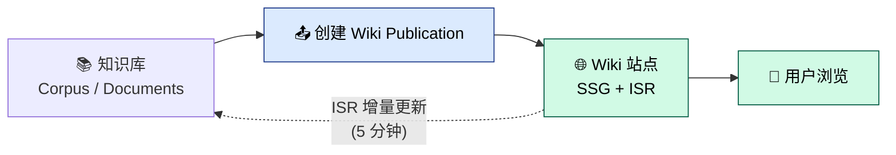

# Wiki 知识发布

Negentropy Wiki 是知识库的**对外发布窗口**，将知识库中整理好的内容以静态站点形式发布，供公众浏览。

### 8.1 站点概览

- **首页**：展示所有已发布的 Wiki Publication（卡片式布局，含名称、描述、版本号、文档数量）
- **Publication 页**：左侧导航树 + 右侧文档列表
- **文档详情页**：Markdown 渲染 + MathJax 数学公式支持

### 8.2 内容发布流程

> 📦 **下游刷新机制已变更**：wiki 纯静态化后不再有运行时 ISR。「同步并发布」的 UI 操作不变，
> 但发布后内容需经「**导出 → 重建**」才上线（本地 `cli.sh restart` 已内置；远程部署见
> [`deployment.md`](../deployment.md)）。下图与下文中的「ISR 增量更新 / webhook」描述仅作历史参考。

#### 8.2.1 在控制台一步步发布（实操指南）

> 适用于已经在 `/knowledge/wiki` 编排好 Catalog 树，希望把已编排内容推送到 negentropy-wiki 站点的运营/编辑同学。
> UI 入口在 [Knowledge / Wiki 模块发布入口一体化](../../../../CHANGELOG.md) 之后改为「顶部粘性发布工具栏」，不再有「Catalog/Publish」模式切换。

##### 前置条件

| 项                             | 说明                                                                                                                 |
| ------------------------------ | -------------------------------------------------------------------------------------------------------------------- |
| Catalog 树                     | 已在左栏完成层级编排，叶子节点已挂载文档（含已提取的 Markdown，否则同步会跳过未提取条目）                            |
| 后端服务                       | `pnpm dev:negentropy`（默认 `:3292`，与 `WIKI_API_BASE` 一致）                                                       |
| Wiki 站点                      | `pnpm dev:wiki`（默认 `:3092`，与 `NEXT_PUBLIC_WIKI_SSG_BASE_URL` 一致）                                             |
| 主动 ISR webhook（可选但推荐） | 后端环境变量 `NE_KNOWLEDGE_WIKI_REVALIDATE__URL=http://localhost:3092/api/revalidate`；未配置时退化为 5 分钟被动 ISR |

##### 第一次发布：从 0 到 1

1. **进入页面**：浏览器打开 `/knowledge/wiki`（默认端口 `http://localhost:3091/knowledge/wiki`）。页面顶部出现 **「Wiki 发布」工具栏**，左栏是 Catalog 树，右栏是节点详情。
2. **新建发布对象**：工具栏点 **「+ 新建」** → 在弹出的对话框填写：
   - **名称**：例如 `工程 Wiki`
   - **Slug**：站点 URL 前缀，例如 `engineering`（会自动从名称推导，可手动覆盖）
   - **描述**（可选）：发布的目标受众与内容范围
   - **主题**：`default` / `book` / `docs`
3. **同步条目**：工具栏点 **「从 Catalog 同步」** → 在节点选择器中勾选要发布的子树（可选多个，包含子节点） → 点 **「确认同步」**。同步完成后 toast 提示「同步成功：新增/保留 N 条」。
4. **触发发布**：工具栏点 **「同步并发布」**（蓝色 primary 按钮，等价于「同步」+「发布」的组合操作）。Pipeline 状态条出现，分三步：
   - `保存版本`（同步完成即 ✓）
   - `通知 SSG`（webhook 已派发 → dispatched）
   - `验证内容`（站点轮询返回的版本 ≥ 目标版本 → confirmed）
5. **访问站点验证**：打开 `${NEXT_PUBLIC_WIKI_SSG_BASE_URL}/${slug}`（默认 `http://localhost:3092/engineering`），看到新版本内容即发布成功。

##### 日常增量发布（已有发布对象）

1. 在 Catalog 树修改节点内容（编辑文档、调整层级、增删节点）。
2. 顶部工具栏从下拉中选中目标发布对象。
3. 直接点 **「同步并发布」** —— 一键完成「同步增量」+「触发 ISR」。

> 若仅修改了节点元数据但未修改文档内容，建议先「从 Catalog 同步」校对条目数与告警，再点「仅发布」推送新版本。

##### 取消发布与回滚

| 场景                             | 操作                                                                                                                                            |
| -------------------------------- | ----------------------------------------------------------------------------------------------------------------------------------------------- |
| 临时下线 Publication（保留草稿） | 工具栏点 **「取消发布」** → 确认后版本回退为草稿，访客 404                                                                                      |
| 删除整个 Publication（不可逆）   | 工具栏点 **「删除」** → 二次确认后，发布对象及历史版本一并清除                                                                                  |
| 误发布想回到上一版本             | 当前不提供「版本回滚」UI；按 [运维指引 §12.3 WikiPublication 多版本与回退](../ops.md#123-wikipublication-多版本与回退) 手动恢复 `ARCHIVED` 版本 |

##### 配置说明（环境变量）

| 变量                                | 作用范围        | 默认值                     | 说明                                                             |
| ----------------------------------- | --------------- | -------------------------- | ---------------------------------------------------------------- |
| `NE_KNOWLEDGE_WIKI_REVALIDATE__URL` | 后端 negentropy | （未配置时退化为被动 ISR） | 发布/取消发布完成后，POST 到此 URL 触发 SSG `/api/revalidate`    |
| `NEXT_PUBLIC_WIKI_SSG_BASE_URL`     | 前端 ui         | `http://localhost:3092`    | 工具栏 Pipeline 用此 URL 轮询 `/api/content-status` 做新鲜度验证 |
| `WIKI_API_BASE`                     | 站点 wiki       | `http://localhost:3292`    | SSG 端的后端 API 反向代理目标                                    |

##### 常见问题（FAQ）

- **「同步并发布」后首页持续显示「暂无已发布的 Wiki」** → 多半是端口错配或 ISR webhook 未触达。详见 [运维指引 §8 故障排除](../ops.md#8-故障排除)。
- **Pipeline 卡在「验证内容」步** → 站点未配置或不可达；改用被动 5 分钟 ISR 也能更新。
- **看不到「+ 新建」按钮** → 检查 Catalog 是否已加载（`catalogId` 非空）；后端 `/knowledge/catalogs/singleton` 是否返回正常。

### 8.3 主题与深色模式

Wiki 站点支持 3 套预设主题（`default` / `book` / `docs`），并自动适配深色模式。

### 8.4 运维概要

Wiki 已采用**纯静态导出**（`output: export`）模式：

- 构建期预渲染所有页面（`next build` → `out/`，含 Pagefind 搜索索引）
- 运行时**无 Node 服务端、无后端、无数据库依赖**
- 内容更新 = **重建**（ISR 已退役）；支持 Docker 独立部署或任意静态托管

> 独立部署与「本地主站内容 → 远程 wiki」同步的完整 step-by-step，请参阅
> [Wiki 独立部署与内容同步指引](../deployment.md)；综合运维见 [Wiki 运维指引](../ops.md)。
