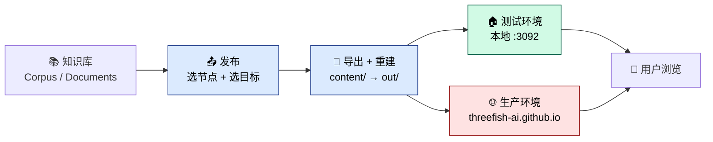

# Wiki 知识发布

Negentropy Wiki 是知识库的**对外发布窗口**，将知识库中整理好的内容以静态站点形式发布，供公众浏览。

### 8.1 站点概览

- **首页**：展示所有已发布的 Wiki Publication（卡片式布局，含名称、描述、版本号、文档数量）
- **Publication 页**：左侧导航树 + 右侧文档列表
- **文档详情页**：Markdown 渲染 + MathJax 数学公式支持

### 8.2 内容发布流程

> 📦 **下游刷新机制**：wiki 纯静态化（`output: export`）后无运行时 ISR，内容上线需经
> 「**导出 `content/` → `next build` 重建**」。发布入口已一体化为顶部粘性工具栏的单一
> **「发布」** 按钮，并支持**双目标**：
>
> - **测试环境**：重建本地 `negentropy-wiki`（`http://localhost:3092`）。
> - **生产环境**：推送到 [`threefish-ai.github.io`](https://github.com/ThreeFish-AI/threefish-ai.github.io) `master` 分支，直接更新 [https://threefish-ai.github.io/](https://threefish-ai.github.io/)。
>
> 重建 / 推送由后端在「发布」后 **fire-and-forget spawn** 承担；本地 `cli.sh restart` 亦内置相同闭环。
> 完整部署拓扑见 [`deployment.md`](../deployment.md)。

#### 8.2.1 在控制台一步步发布（实操指南）

> 适用于已经在 `/knowledge/wiki` 编排好 Catalog 树，希望把已编排内容发布到 wiki 站点的运营/编辑同学。
> UI 入口为「顶部粘性发布工具栏」——单一 **「发布」** 按钮承担「选节点同步 → 选目标发布」全流程，
> 并支持在「测试环境 / 生产环境」间切换。

##### 前置条件

| 项                       | 说明                                                                                                                                       |
| ------------------------ | ------------------------------------------------------------------------------------------------------------------------------------------ |
| Catalog 树               | 已在左栏完成层级编排，叶子节点已挂载文档（含已提取的 Markdown，否则同步会跳过未提取条目）                                                  |
| 后端服务                 | `pnpm dev:negentropy`（默认 `:3292`，与 `WIKI_API_BASE` 一致）                                                                             |
| 测试环境 wiki 站点       | `pnpm dev:wiki`（默认 `:3092`，与 `NEXT_PUBLIC_WIKI_SSG_BASE_URL` 一致）；发布后由后端 spawn 重建                                          |
| 生产环境推送凭证（生产目标） | `gh auth token` 可用（对 `threefish-ai.github.io` 有写权限）即可零配置；或配置 `NE_KNOWLEDGE_WIKI_PAGES_PUBLISH__TOKEN=<PAT>`（详见 [deployment.md](../deployment.md)） |

##### 第一次发布：从 0 到 1

1. **进入页面**：浏览器打开 `/knowledge/wiki`（默认端口 `http://localhost:3091/knowledge/wiki`）。页面顶部出现 **「Wiki 发布」工具栏**，左栏是 Catalog 树，右栏是节点详情。
2. **新建发布对象**：工具栏点 **「+ 新建」** → 在弹出的对话框填写：
   - **名称**：例如 `工程 Wiki`
   - **Slug**：站点 URL 前缀，例如 `engineering`（会自动从名称推导，可手动覆盖）
   - **描述**（可选）：发布的目标受众与内容范围
   - **主题**：`default` / `book` / `docs`
3. **选择发布目标**：工具栏右侧的目标选择器默认 **「测试环境」**（本地 `:3092`）。需要上线公开站点时切到 **「生产环境」**。
4. **触发发布**：工具栏点 **「发布」**（蓝色 primary 按钮）→ 在节点选择器勾选要发布的子树（可选多个，含子节点）→ 点 **「发布」** 确认。
   - 同步阶段：toast 提示「同步成功：新增/保留 N 条」（⚠️ 全量覆盖：未选子树内的既有条目将被删除）。
   - **生产目标**会额外弹出 **destructive 二次确认**（提示推送 `threefish-ai.github.io` master 不可逆），确认后才执行。
   - 发布阶段：后端 fire-and-forget spawn 重建 / 推送；toast 提示「发布成功：vN（测试/生产环境，站点 …）」。
5. **访问站点验证**：
   - 测试环境：打开 `http://localhost:3092/${slug}`（重建完成片刻后见新内容）。
   - 生产环境：等待 GitHub Pages 部署后打开 `https://threefish-ai.github.io/${slug}`。

##### 日常增量发布（已有发布对象）

1. 在 Catalog 树修改节点内容（编辑文档、调整层级、增删节点）。
2. 顶部工具栏从下拉中选中目标发布对象，选择「测试环境」或「生产环境」。
3. 直接点 **「发布」** → 勾选子树 → 确认 —— 一键完成「同步 + 重建/推送」。

> 重建 / 推送为 fire-and-forget：失败仅入后端日志，不回传前端。若发布后站点未见更新，查
> `./scripts/cli.sh logs`（测试环境 wiki 日志）或 GitHub Actions（生产环境 pages 部署）。

##### 取消发布与回滚

| 场景                             | 操作                                                                                                                                            |
| -------------------------------- | ----------------------------------------------------------------------------------------------------------------------------------------------- |
| 临时下线 Publication（保留草稿） | 工具栏点 **「取消发布」**（仅 published 态出现）→ 确认后版本回退为草稿，访客 404                                                               |
| 删除整个 Publication（不可逆）   | 工具栏点 **「删除」** → 二次确认后，发布对象及历史版本一并清除                                                                                  |
| 误发布想回到上一版本             | 当前不提供「版本回滚」UI；按 [运维指引 §12.3 WikiPublication 多版本与回退](../ops.md#123-wikipublication-多版本与回退) 手动恢复 `ARCHIVED` 版本 |

##### 配置说明（环境变量）

| 变量                                              | 作用范围        | 默认值                          | 说明                                                                 |
| ------------------------------------------------- | --------------- | ------------------------------- | -------------------------------------------------------------------- |
| `NEXT_PUBLIC_WIKI_SSG_BASE_URL`                   | 前端 ui         | `http://localhost:3092`         | 工具栏 Pipeline 轮询 `/api/content-status` 做新鲜度验证（测试环境）  |
| `WIKI_API_BASE`                                   | 站点 wiki       | `http://localhost:3292`         | SSG 端的后端 API 反向代理目标                                        |
| `NE_KNOWLEDGE_WIKI_PAGES_PUBLISH__TOKEN`          | 后端 negentropy | （未配置时回退 `gh auth token`）| 生产目标 HTTPS 推送 GitHub PAT；透传 `publish-wiki-pages.sh`         |
| `NE_KNOWLEDGE_WIKI_PAGES_PUBLISH__REPO`           | 后端 negentropy | `threefish-ai.github.io.git`    | 生产目标 Pages 仓库（可覆盖）                                        |
| `NE_KNOWLEDGE_WIKI_PAGES_PUBLISH__BRANCH`         | 后端 negentropy | `master`                        | 生产目标 Pages 分支                                                  |

##### 常见问题（FAQ）

- **「发布」后首页持续显示「暂无已发布的 Wiki」** → 多为重建 / 推送未完成或失败。测试环境查 `cli.sh logs`；生产环境查 GitHub Actions。详见 [运维指引 §8 故障排除](../ops.md#8-故障排除)。
- **生产目标发布未生效** → 确认 `gh auth token` 对 `threefish-ai.github.io` 有写权限；或配置 `NE_KNOWLEDGE_WIKI_PAGES_PUBLISH__TOKEN`。
- **看不到「+ 新建」按钮** → 检查 Catalog 是否已加载（`catalogId` 非空）；后端 `/knowledge/catalogs/singleton` 是否返回正常。

### 8.3 主题与深色模式

Wiki 站点支持 3 套预设主题（`default` / `book` / `docs`），并自动适配深色模式。

### 8.4 运维概要

Wiki 已采用**纯静态导出**（`output: export`）模式：

- 构建期预渲染所有页面（`next build` → `out/`，含 Pagefind 搜索索引）
- 运行时**无 Node 服务端、无后端、无数据库依赖**
- 内容更新 = **重建**（ISR 已退役）；支持 Docker 独立部署或任意静态托管

> 独立部署与「本地主站内容 → 远程 wiki」同步的完整 step-by-step，请参阅
> [Wiki 独立部署与内容同步指引](../deployment.md)；综合运维见 [Wiki 运维指引](../ops.md)。
