## 1. 执行摘要

### 1.1 研究背景

本项目旨在构建一个 **认知增强的学术研究助手**，通过 Agents 协作为中文读者提供高质量的论文收集、翻译、理解、语义检索与应用服务。传统 RAG 系统存在以下局限：

- **孤立上下文**：无法跨文档建立关联
- **单跳检索**：难以回答需要多步推理的复杂问题
- **无记忆能力**：每次会话独立，无法积累知识

**智能认知增强** 通过引入知识图谱、长期记忆和多模态检索，突破这些限制。

### 1.2 核心发现

| 维度            | 关键洞察                                                        |
| --------------- | --------------------------------------------------------------- |
| **Agentic RAG** | RAG 2.0 通过 Agent 驱动实现多步推理、自适应检索和自我修正       |
| **GraphRAG**    | Microsoft GraphRAG 通过社区检测和分层摘要，显著提升全局理解能力 |
| **记忆框架**    | 参考 Cognee 三存储理念，自研 Hippocampus 记忆引擎（pgvector + AGE（规划中） + 艾宾浩斯衰减） |
| **图数据库**    | Neo4j 成熟稳定，FalkorDB 在 AI 场景性能领先                     |
| **设计模式**    | Memory 模式是认知增强的核心，需区分短期/长期记忆                |

### 1.3 关键建议

1. **参考 Cognee 三存储理念，基于 PostgreSQL 自研 Hippocampus 记忆引擎**
2. **实施 Agentic RAG 架构**：Adaptive + Corrective + Self-RAG 组合
3. **PostgreSQL pgvector 作为向量存储**：基于已有 PostgreSQL 基础设施，一体化架构
4. **PostgreSQL AGE 作为图数据库**：与 pgvector 共享基础设施，降低运维复杂度
5. **分阶段实施**：向量增强 → 图谱增强 → Agentic RAG 完整实现

---

## 2. 理论基础

> 从知识图谱基础概念出发，逐步深入 GraphRAG 原理、Agentic AI 范式与 Agentic RAG 架构。

### 2.1 知识图谱基础

#### 2.1.1 定义与核心概念

知识图谱（Knowledge Graph, KG）是一种以图结构组织结构化知识的抽象方式，由 **节点**（实体）和 **边**（关系）组成<sup>[[1]](#ref1)</sup>。

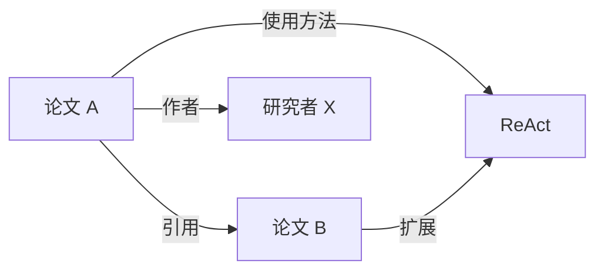

**核心特征**：**实体**（论文、作者、概念、方法等）、**关系**（引用、作者关系、方法演进等）、**属性**（发表时间、摘要、关键词等）。

#### 2.1.2 历史演进

| 阶段         | 时间  | 代表                   | 特点               |
| ------------ | ----- | ---------------------- | ------------------ |
| 语义网       | 2001  | W3C (T. Berners-Lee)   | RDF/OWL 标准化     |
| 大规模知识图谱 | 2012 | Google Knowledge Graph | 商业搜索增强应用   |
| AI 增强      | 2023+ | GraphRAG               | LLM 自动构建与推理 |

#### 2.1.3 与其他存储的关系

| 存储类型       | 优势               | 劣势           | 适用场景       |
| -------------- | ------------------ | -------------- | -------------- |
| **关系数据库** | 事务一致性、成熟   | 关系查询复杂   | 结构化业务数据 |
| **向量数据库** | 语义相似检索       | 无结构关系     | 模糊匹配、推荐 |
| **图数据库**   | 关系遍历、多跳推理 | 大规模扩展挑战 | 知识网络、推理 |

#### 2.1.4 知识图谱在 AI 中的应用（2024-2025 前沿）

**GraphRAG - 知识图谱增强检索生成**是 2024 年最重要的技术突破之一：

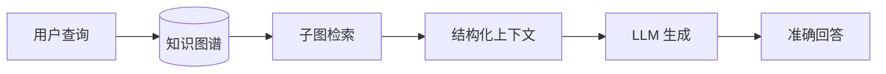

**核心优势**：RAG 系统相较裸 LLM 可降低约 40-71% 幻觉率（综合多份生产环境报告估算值，含 Gartner 2024、Databricks MLOps、Amazon Bedrock 生产指标等，GraphRAG 在此基础上通过图谱结构化上下文可进一步提升事实准确性）、支持多跳推理和复杂关系查询、提供可解释的决策路径。GraphRAG 架构与社区检测原理详见 § 2.2。

此外，LLM 正在革新传统知识工程：**LLM 驱动的实体关系抽取**显著减少手动标注成本，**自动图谱更新**实现实时知识增量融合。

### 2.2 GraphRAG 原理深入

#### 2.2.1 传统 RAG 的局限

传统 RAG 工作流程：`用户问题 → 向量检索 → Top-K 文档块 → LLM 生成回答`

**核心问题**：1) **点状检索**——只能找到孤立的相似文档；2) **全局盲区**——无法回答语料库全局主题类问题；3) **多跳困难**——难以回答跨文档关联推理问题。

#### 2.2.2 GraphRAG 架构

Microsoft GraphRAG 采用两阶段架构<sup>[[2]](#ref2)</sup>：

**阶段一：离线索引（知识图谱构建）**

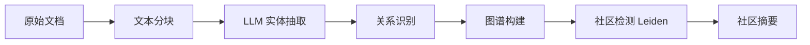

**阶段二：在线查询**

| 查询模式          | 机制                 | 适用场景     |
| ----------------- | -------------------- | ------------ |
| **Local Search**  | 图遍历，跟随关系路径 | 实体特定问题 |
| **Global Search** | 社区摘要 Map-Reduce  | 全局理解问题 |
| **Hybrid Search** | 向量 + 图谱结合      | 复杂推理问题 |

#### 2.2.3 社区检测与分层摘要

GraphRAG 的创新在于 **Leiden 社区检测算法**<sup>[[2]](#ref2)</sup>：将图谱划分为紧密连接的社区 → 为每个社区生成 LLM 摘要 → 支持多层级粒度（高层主题 → 细节实体）。

### 2.3 Agentic AI 与认知增强

#### 2.3.1 Agent 核心特征

根据 Andrew Ng 提出的 Agentic Design Patterns<sup>[[10]](#ref10)</sup>：

> **代理性（Agency）**：能够感知环境、做出决策、采取行动以自主实现目标

**Agent 工作循环**：`感知 Sense → 推理 Reason → 规划 Plan → 行动 Act → 感知...`

#### 2.3.2 认知记忆系统

借鉴人类认知科学，Agent 记忆分为三类：**语义记忆**（事实知识 → 用户画像、领域知识）、**情景记忆**（过往经历 → 历史会话、成功案例）、**程序性记忆**（技能规则 → System Prompt、行为模式）。

#### 2.3.3 从 ReAct 到认知增强

**ReAct 框架**（Reasoning + Acting）奠定了现代 Agent 基础<sup>[[5]](#ref5)</sup>，认知增强在此基础上扩展：**长期记忆**（跨会话保留）、**知识图谱**（结构化存储）、**自我反思**（评估改进）、**多 Agent 协作**（任务分解）。

### 2.4 Agentic RAG 深入解读（RAG 2.0）

Agentic RAG 将传统 RAG 的被动检索转变为主动推理，是构建智能认知增强系统的核心范式<sup>[[8]](#ref8)</sup><sup>[[9]](#ref9)</sup>。

#### 2.4.1 RAG 技术演进

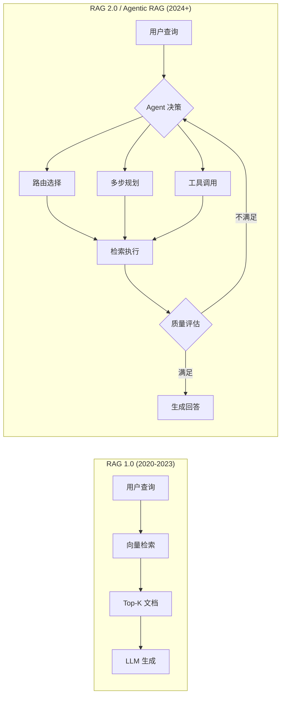

| 阶段             | 时间      | 特征              | 代表技术           |
| ---------------- | --------- | ----------------- | ------------------ |
| **Naive RAG**    | 2020-2022 | 简单检索-生成     | 基础向量检索       |
| **Advanced RAG** | 2022-2023 | 预处理/后处理优化 | 查询重写、重排序   |
| **Modular RAG**  | 2023-2024 | 组件化架构        | 可插拔检索器       |
| **Agentic RAG**  | 2024+     | 智能代理驱动      | 自主决策、多步推理 |

#### 2.4.2 Agentic RAG 核心定义

> **Agentic RAG** 是一种将自主 AI Agent 嵌入 RAG 流程的范式，使 LLM 不再仅仅是被动的内容生成器，而是成为能够主动规划、决策、检索和自我修正的智能编排者。

| 能力维度       | 传统 RAG       | Agentic RAG      |
| -------------- | -------------- | ---------------- |
| **执行模式**   | 线性流水线     | 循环迭代         |
| **决策能力**   | 无（固定流程） | 有（动态选择）   |
| **检索策略**   | 单次静态检索   | 多轮自适应检索   |
| **工具使用**   | 无             | 多工具动态调用   |
| **自我修正**   | 无             | 内置评估反馈循环 |
| **多步推理**   | 困难           | 原生支持         |
| **上下文管理** | 简单拼接       | 智能压缩与选择   |

#### 2.4.3 Agentic RAG 关键模式

**1. Adaptive RAG（自适应检索）**

Agent 根据查询特征动态选择检索策略：

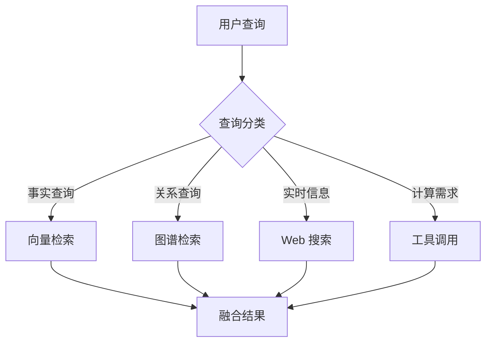

**2. Corrective RAG（纠错检索）**

引入文档相关性评估器，低质量时触发补救措施（查询重写 + Web 搜索补充），具体实现见 § 2.4.5 LangGraph 代码。

**3. Self-RAG（自反思检索）**

系统自主评估生成内容的质量和事实性：

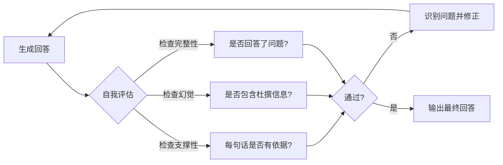

**4. Multi-Step Reasoning（多步推理）**

将复杂问题分解为子任务序列，如"查找同时引用 ReAct 和 CoT 的 2024 年论文"需依次执行：搜索 A 集合 → 搜索 B 集合 → 计算交集 → 提取摘要 → 生成回答。

#### 2.4.4 Agentic RAG 架构模式

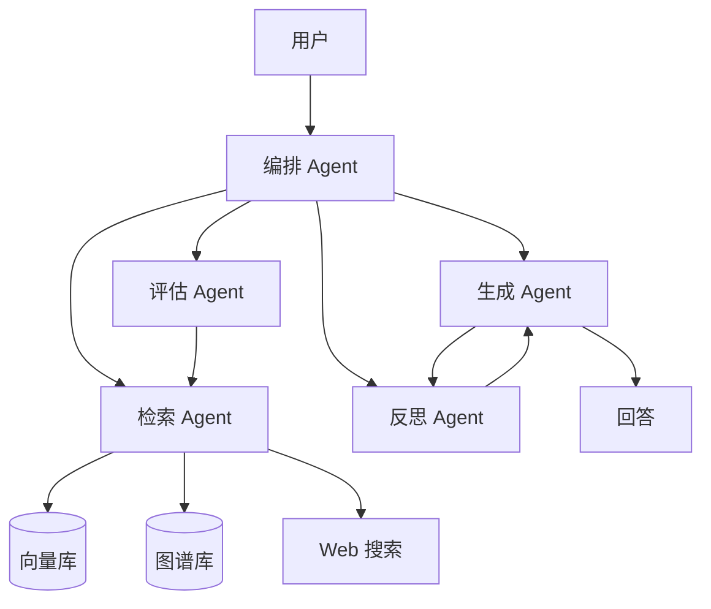

**单 Agent 架构**：由一个 RAG Agent 统一路由至向量库、图谱库、Web 搜索等工具，适合简单场景。

**多 Agent 协作架构**（上图）：编排 Agent 协调检索、评估、生成、反思四大专业 Agent，支持迭代优化，适合复杂认知增强场景。

#### 2.4.5 主流实现框架

**LangGraph 实现**

LangGraph 是构建 Agentic RAG 的主流框架，基于图结构编排工作流：

```python
from langgraph.graph import StateGraph, START, END
from typing import TypedDict, List

class AgentState(TypedDict):
    query: str
    documents: List[str]
    generation: str
    grade: str

def retrieve(state: AgentState) -> AgentState:
    """检索相关文档"""
    docs = retriever.invoke(state["query"])
    return {"documents": docs}

def grade_documents(state: AgentState) -> AgentState:
    """评估文档相关性"""
    grades = [grade_doc(state["query"], doc) for doc in state["documents"]]
    return {"grade": "pass" if sum(grades) > len(grades) * 0.5 else "fail"}

def decide_next(state: AgentState) -> str:
    """决定下一步动作"""
    if state["grade"] == "fail":
        return "web_search"  # 触发 Web 搜索补救
    return "generate"

def generate(state: AgentState) -> AgentState:
    """生成回答"""
    response = llm.invoke(build_prompt(state["query"], state["documents"]))
    return {"generation": response}

# 构建 Agentic RAG 工作流
workflow = StateGraph(AgentState)
workflow.add_node("retrieve", retrieve)
workflow.add_node("grade", grade_documents)
workflow.add_node("web_search", web_search)
workflow.add_node("generate", generate)

workflow.add_edge(START, "retrieve")
workflow.add_edge("retrieve", "grade")
workflow.add_conditional_edges("grade", decide_next)
workflow.add_edge("web_search", "generate")
workflow.add_edge("generate", END)

agentic_rag = workflow.compile()
```

**LlamaIndex 实现**

LlamaIndex 提供 Router Query Engine 实现自适应检索，通过 `QueryEngineTool` 定义多检索工具（向量、图谱、摘要），由 `RouterQueryEngine` 配合 `LLMSingleSelector` 自动选择最佳策略。完整实现详见 [Agent 运行时框架调研](./020-agent-runtime-frameworks.md)。

#### 2.4.6 Agentic RAG 评估指标

| 指标类别       | 具体指标                | 说明                   |
| -------------- | ----------------------- | ---------------------- |
| **检索质量**   | Context Precision       | 检索内容与问题的相关性 |
|                | Context Recall          | 关键信息的召回率       |
| **生成质量**   | Faithfulness            | 回答是否有检索内容支撑 |
|                | Answer Relevancy        | 回答与问题的相关性     |
| **Agent 效能** | Tool Selection Accuracy | 工具选择正确率         |
|                | Reasoning Steps         | 推理步骤合理性         |
|                | Self-Correction Rate    | 自我修正成功率         |

#### 2.4.7 本项目 Agentic RAG 应用建议

| 组件         | 建议方案                                | 优先级 |
| ------------ | --------------------------------------- | ------ |
| **检索策略** | Adaptive RAG（向量 + 图谱路由）         | P0     |
| **质量保障** | Corrective RAG（相关性评估 + Web 补充） | P1     |
| **多步推理** | LangGraph 状态机编排                    | P1     |
| **自我反思** | Self-RAG 生成后评估                     | P2     |
| **评估体系** | RAGAS 集成                              | P0     |

**推荐架构**：

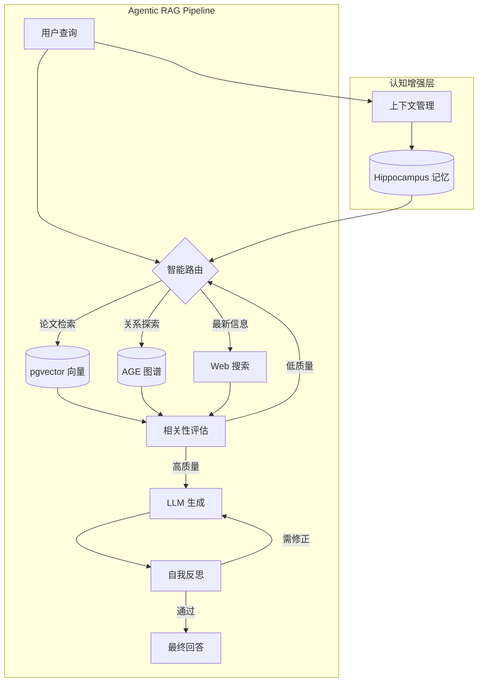

---

## 3. 工程框架与工具

> 深入解读五大主流认知增强框架，通过对比分析为技术选型提供依据。

### 3.1 Cognee

#### 3.1.1 核心定位

Cognee 是一个开源的 **AI 记忆控制平面框架**（Apache 2.0 许可证），将原始数据转换为可搜索、可连接的智能记忆<sup>[[11]](#ref11)</sup><sup>[[20]](#ref20)</sup>。

> **核心理念**：图+向量混合存储，支持语义搜索与结构推理统一

#### 3.1.2 三存储架构

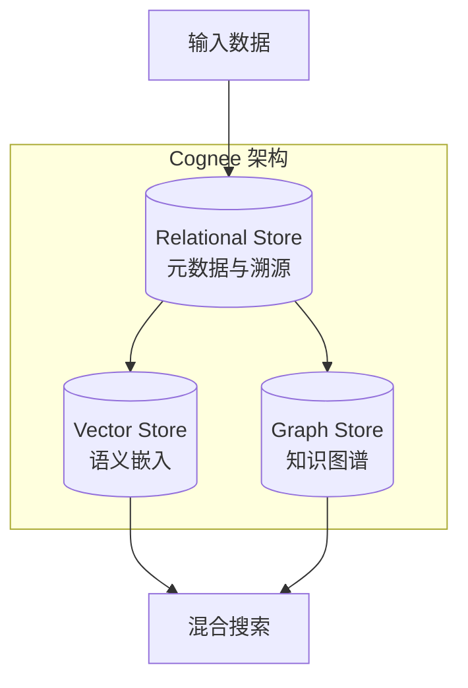

| 存储           | 职责                 | 使用阶段           |
| -------------- | -------------------- | ------------------ |
| **Relational** | 文档元数据、分块溯源 | Cognify 时追踪来源 |
| **Vector**     | 嵌入向量、语义指纹   | Search 时语义匹配  |
| **Graph**      | 实体、关系、知识结构 | Search 时结构推理  |

#### 3.1.3 优势与局限

| 优势                | 局限                 |
| ------------------- | -------------------- |
| 图+向量统一架构     | 相对较新，社区规模小 |
| 自学习反馈机制      | 文档相对简洁         |
| 多数据源支持（30+） | 大规模部署案例少     |
| 开源可自托管        | LLM 依赖成本         |

> 完整 API、搜索模式与高级配置详见 [Cognee 深度调研](./040-cognee.md)

### 3.2 Microsoft GraphRAG

#### 3.2.1 核心架构

Microsoft Research 开源的 GraphRAG 专注于 **知识图谱增强的 RAG**：

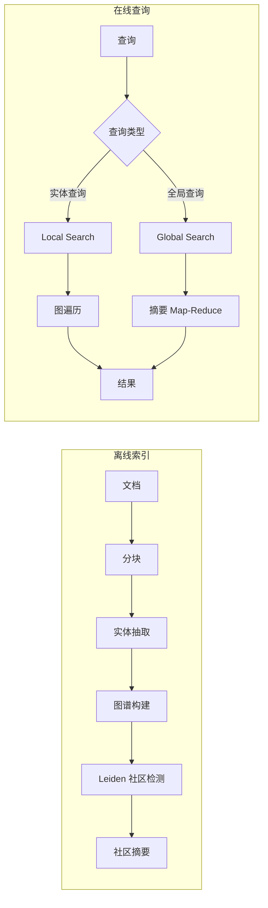

#### 3.2.2 优势与局限

| 优势                     | 局限                     |
| ------------------------ | ------------------------ |
| Microsoft 背书，持续维护 | 索引成本高（LLM tokens） |
| 社区检测创新             | 实时更新困难             |
| 全局搜索能力强           | 配置相对复杂             |

> 安装配置与高级用法详见 [Microsoft GraphRAG 官方文档](https://microsoft.github.io/graphrag/)

### 3.3 LlamaIndex Knowledge Graph

LlamaIndex 提供灵活的知识图谱构建与查询能力<sup>[[14]](#ref14)</sup><sup>[[22]](#ref22)</sup>：

- **PropertyGraphIndex**：属性图索引（推荐），支持节点/边属性，已替代已弃用的 KnowledgeGraphIndex
- **TextToCypherRetriever**：自然语言自动转 Cypher 查询，配合 PropertyGraphIndex 实现结构化图谱查询
- **LLMSynonymRetriever / VectorContextRetriever**：属性图检索器，支持关键词扩展和向量上下文检索

> 完整代码示例与高级配置详见 [Agent 运行时框架调研](./020-agent-runtime-frameworks.md)

### 3.4 LangGraph

LangGraph 是 LangChain 生态的 **Agent 工作流编排框架**<sup>[[15]](#ref15)</sup><sup>[[23]](#ref23)</sup>：**状态管理**（跨步骤保持状态）、**条件分支**（动态决策路由）、**循环支持**（迭代优化）。

> LangGraph Agentic RAG 完整实现示例详见 § 2.4.5

### 3.5 MemGPT / Letta AI

MemGPT（已更名为 Letta AI，开源许可证为 Apache 2.0）采用 **操作系统式内存管理**<sup>[[4]](#ref4)</sup><sup>[[16]](#ref16)</sup>：

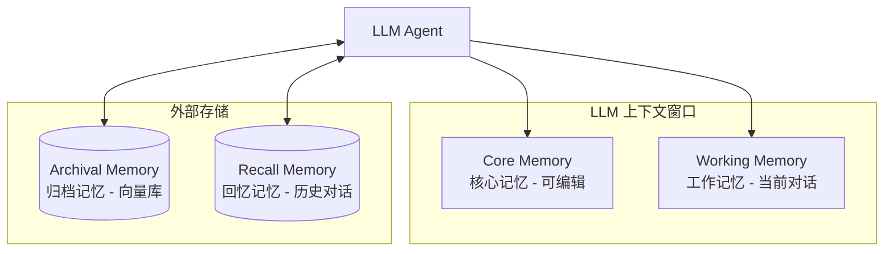

**自编辑记忆**：Agent 通过 `core_memory_append`、`core_memory_replace`、`archival_memory_insert`、`archival_memory_search`、`conversation_search` 等工具调用管理自己的记忆。

### 3.6 框架对比总结

| 特性         | Cognee      | GraphRAG    | LlamaIndex  | LangGraph  | MemGPT    |
| ------------ | ----------- | ----------- | ----------- | ---------- | --------- |
| **核心定位** | AI 记忆层   | 图谱 RAG    | 通用框架    | Agent 编排 | 长期记忆  |
| **图谱构建** | ✅ LLM 抽取 | ✅ LLM 抽取 | ✅ LLM 抽取 | ❌         | ❌        |
| **向量检索** | ✅ 内置     | ✅ 内置     | ✅ 内置     | ✅ 集成    | ✅ 内置   |
| **社区检测** | ❌          | ✅ Leiden   | ❌          | ❌         | ❌        |
| **自学习**   | ✅ 反馈优化 | ❌          | ❌          | ❌         | ✅ 自编辑 |
| **状态管理** | ✅ Session  | ❌          | ❌          | ✅ 核心    | ✅ 核心   |
| **多 Agent** | ❌          | ❌          | ❌          | ✅ 核心    | ✅ 支持   |
| **开源**     | ✅ Apache 2.0 | ✅ MIT      | ✅ Apache 2.0 | ✅ MIT     | ✅ Apache 2.0 |
| **成熟度**   | 🟡 新兴     | 🟢 稳定     | 🟢 成熟     | 🟢 成熟    | 🟡 新兴   |

**选型建议**：**全栈记忆** → Cognee | **图谱 RAG** → Microsoft GraphRAG | **通用开发** → LlamaIndex | **Agent 工作流** → LangGraph | **长期记忆** → MemGPT/Letta

---

## 4. 存储技术选型

> 图数据库与向量数据库是认知增强系统的双核心存储引擎，本章对两类技术进行选型分析。

### 4.1 图数据库

#### 4.1.1 Neo4j

Neo4j 是最成熟的原生图数据库，事实上的行业标准<sup>[[13]](#ref13)</sup>。

| 特性            | 说明                        |
| --------------- | --------------------------- |
| **成熟生态**    | 10+ 年历史，企业级支持      |
| **Cypher 语言** | 声明式图查询语言            |
| **ACID 合规**   | 完整事务支持                |
| **AI 集成**     | LLM Knowledge Graph Builder |

> Neo4j AI 特性与框架集成详见 [Neo4j 深度调研](./050-neo4j.md)

#### 4.1.2 FalkorDB

为 AI/ML 工作负载优化的高性能图数据库<sup>[[18]](#ref18)</sup><sup>[[25]](#ref25)</sup>。

| 特性           | 说明                            |
| -------------- | ------------------------------- |
| **极低延迟**   | 比 Neo4j 快 10-496x（特定场景，厂商基准测试） |
| **稀疏矩阵**   | 创新架构，内存高效              |
| **Redis 兼容** | 基于 Redis 模块                 |
| **OpenCypher** | 兼容 Cypher 语法                |

**性能对比**：

| 指标     | FalkorDB         | Neo4j          |
| -------- | ---------------- | -------------- |
| P99 延迟 | <140ms           | 可达数十秒     |
| 图遍历   | 10-500x 快（厂商基准） | 基准     |
| 内存效率 | 高（约 6x 节省） | 中等           |

> 上述性能数据来源于 FalkorDB 官方基准测试，独立第三方验证有限。

#### 4.1.3 Kuzu

嵌入式高性能图数据库，类似"图数据库的 DuckDB"：**嵌入式**（无需独立服务器）、**列式存储**（OLAP 优化）、**MCP 支持**（LLM 直接交互）、**MIT 许可**（完全开源）。

> **注意**：KuzuDB 已被创建者 Kùzu Inc. 归档废弃（GitHub 仓库已设为只读状态，最终版本 v0.11.3）。现有版本仍可使用，但不再接受维护与更新，新项目需审慎评估。

#### 4.1.4 Memgraph

内存图数据库，专注实时处理：**内存优先**（极低延迟）、**流处理**（实时图更新）、**GraphChat**（自然语言查询）、**AI Toolkit**（Python 工具集）。性能对比：比 Neo4j 低 41x 延迟，节点插入快 10x（厂商基准测试，独立验证有限）。

#### 4.1.5 图数据库对比与选型

| 特性         | Neo4j       | FalkorDB   | Kuzu    | Memgraph  |
| ------------ | ----------- | ---------- | ------- | --------- |
| **部署模式** | 独立服务    | Redis 模块 | 嵌入式  | 独立/容器 |
| **性能**     | 🟡 中等     | 🟢 极高    | 🟢 高   | 🟢 极高   |
| **成熟度**   | 🟢 最成熟   | 🟡 新兴    | 🟡 新兴 | 🟢 成熟   |
| **AI 集成**  | 🟢 最丰富   | 🟢 良好    | 🟡 基础 | 🟢 良好   |
| **开源**     | 🟡 开放核心 | 🟡 SSPLv1 | 🟡 已归档 | 🟢 完全   |

**本项目建议**：实际选用 **PostgreSQL AGE**（与 pgvector 共享基础设施）；Neo4j 详调见 [050-neo4j.md](./050-neo4j.md)，对比决策见 [051-postgres-neo4j.md](./051-postgres-neo4j.md)。

### 4.2 向量数据库

> OceanBase 多模向量检索完整调研详见 [OceanBase 三位一体调研](./033-oceanbase.md)

项目基于已有 PostgreSQL 基础设施，选用 **pgvector** 实现向量 + 图谱（AGE）+ 业务数据一体化架构，降低运维复杂度。

**其他向量数据库对比**：

| 数据库       | 特点                 | 适用场景     |
| ------------ | -------------------- | ------------ |
| **Weaviate** | GraphQL 接口、模块化 | 灵活集成需求 |
| **Qdrant**   | Rust 高性能、过滤强  | 高性能检索   |
| **Milvus**   | 大规模、分布式       | 十亿级向量   |
| **Chroma**   | 轻量、开发友好       | 快速原型     |

> 向量算法详见 [030](./030-vector-search-algorithm.md)、选型详见 [031](./031-vector-databases-selection.md)、深度调研详见 [032](./032-vector-databases.md)

---

## 5. Agent 设计模式

> 跨框架的通用方法论，可与前述框架和数据库组合应用。Andrew Ng 于 2024 年提出四大核心 Agentic Design Patterns（Reflection、Tool Use、Planning、Multi-Agent）<sup>[[10]](#ref10)</sup>，本章在此基础上扩展至完整设计模式体系。

### 5.1 Prompt Chaining（提示链）

将复杂任务分解为顺序执行的多个 LLM 调用，形成 `输入 → 信息提取 → 数据转换 → 结果优化 → 输出` 的流水线。适用场景：多步骤数据处理、内容生成工作流、代码生成与优化。

### 5.2 Routing（路由）

根据输入动态选择处理路径。实现方式：LLM 分类器路由、基于规则的路由、语义相似度路由。典型模式：用户输入 → 意图分类 → 技术 Agent / 翻译 Agent / 搜索 Agent。

### 5.3 Parallelization（并行化）

同时执行多个独立任务以提高效率，如 `ParallelAgent` 编排多个研究 Agent 并行采集论文。适用场景：多源数据采集、批量文档处理、多角度分析。

### 5.4 Tool Use（工具使用）

Agent 通过函数调用与外部系统交互：

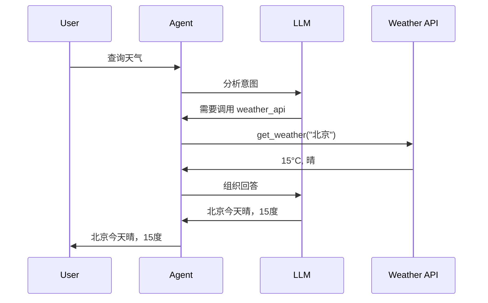

```python
@tool
def search_papers(query: str) -> list:
    """搜索相关论文"""
    return paper_database.search(query)
```

### 5.5 Planning（规划）

Agent 自主制定实现目标的步骤序列，具备**目标分解**、**步骤排序**、**动态调整**三关键特征。如总结 GraphRAG 研究进展：搜索论文 → 筛选高引用 → 提取创新点 → 分类整理 → 生成综述。

### 5.6 Reflection（反思）

Agent 评估自身输出并迭代改进：

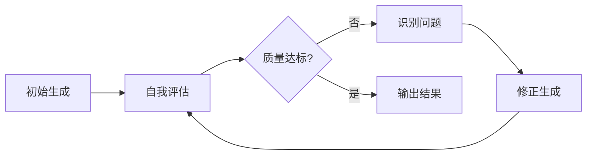

```python
def reflect(output, criteria):
    evaluation = llm.evaluate(output, criteria)
    if evaluation.needs_improvement:
        improved = llm.improve(output, evaluation.feedback)
        return reflect(improved, criteria)
    return output
```

### 5.7 Multi-Agent（多代理）

多个专业化 Agent 协作完成复杂任务。

**协作模式**：

| 模式          | 说明                   | 适用场景     |
| ------------- | ---------------------- | ------------ |
| **主管-工人** | 主管分配任务，工人执行 | 任务分解明确 |
| **对等协作**  | Agent 平等讨论         | 需要多角度   |
| **流水线**    | 顺序处理传递           | 阶段性任务   |

**本项目应用**：WorkflowAgent（编排主管）+ PDFProcessingAgent / TranslationAgent / HeartfeltAgent / BatchProcessingAgent（专业工人）

### 5.8 Guardrails（护栏）

为 Agent 设置安全边界和约束：**输入护栏**（过滤恶意/无效输入）、**输出护栏**（验证生成内容合规性）、**工具护栏**（限制可执行操作）。

### 5.9 Memory（记忆）

Agent 跨交互保持信息的能力，采用**双组件架构**：

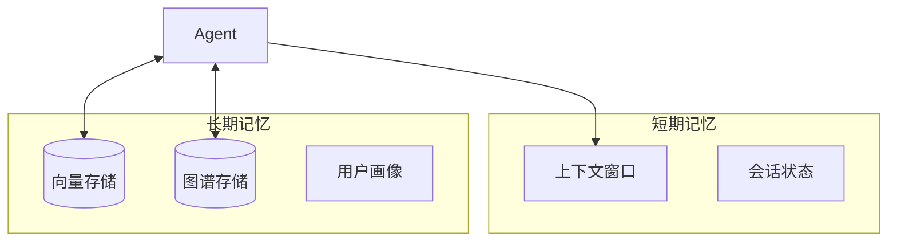

LangGraph 通过 `InMemoryStore` 实现：`store.put()` 存储记忆、`store.search()` 检索记忆，支持 embed 索引。

### 5.10 MCP（Model Context Protocol）

LLM 与外部系统交互的标准化协议。Agent 通过 MCP 协议与服务器端的 **Tools**、**Resources**、**Prompts** 交互，具备标准化接口、动态发现能力、跨平台兼容等优势。

---

## 6. 项目架构与实施

> 基于前述理论基础、框架对比和设计模式，将调研成果转化为具体技术选型、架构设计和实施路线。

### 6.1 本项目技术选型建议

| 组件           | 推荐方案         | 备选方案   | 理由                    |
| -------------- | ---------------- | ---------- | ----------------------- |
| **向量存储**   | PostgreSQL pgvector | OceanBase  | 已落地，一体化架构    |
| **图存储**     | PostgreSQL AGE   | Neo4j       | Schema 已设计，AGE 扩展待部署 |
| **记忆框架**   | 自研 Hippocampus（参考 Cognee） | Cognee（外部对标） | 基于 PostgreSQL 一体化 |
| **Agent 框架** | Claude SDK + ADK | -          | 双框架战略已定，保持    |
| **评估框架**   | RAGAS            | -          | RAG 质量评估标准        |

> Cognee 不作为依赖引入，项目自研记忆引擎，详见 [040-cognee.md](./040-cognee.md)

### 6.2 认知增强架构设计

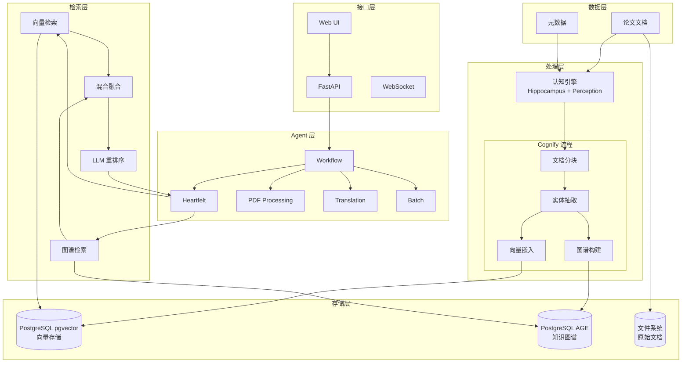

### 6.3 知识图谱 Schema 设计

**节点类型**：

| 节点        | 属性                                | 说明     |
| ----------- | ----------------------------------- | -------- |
| `Paper`     | id, title, abstract, year, arxiv_id | 论文实体 |
| `Author`    | name, affiliation                   | 作者     |
| `Concept`   | name, definition                    | 核心概念 |
| `Method`    | name, description                   | 方法论   |
| `Dataset`   | name, size, domain                  | 数据集   |
| `Framework` | name, version, url                  | 技术框架 |

**关系类型**：

| 关系           | 起点   | 终点      | 属性    |
| -------------- | ------ | --------- | ------- |
| `AUTHORED_BY`  | Paper  | Author    | order   |
| `CITES`        | Paper  | Paper     | context |
| `USES_METHOD`  | Paper  | Method    | -       |
| `INTRODUCES`   | Paper  | Concept   | -       |
| `EXTENDS`      | Method | Method    | -       |
| `EVALUATED_ON` | Paper  | Dataset   | metrics |
| `IMPLEMENTS`   | Paper  | Framework | -       |

```cypher
// 查找使用相似方法的论文
MATCH (p1:Paper)-[:USES_METHOD]->(m:Method)<-[:USES_METHOD]-(p2:Paper)
WHERE p1.title = "ReAct"
RETURN p2.title, m.name

// 查找引用链
MATCH path = (p1:Paper)-[:CITES*1..3]->(p2:Paper)
WHERE p1.title CONTAINS "GraphRAG"
RETURN path
```

### 6.4 混合检索策略

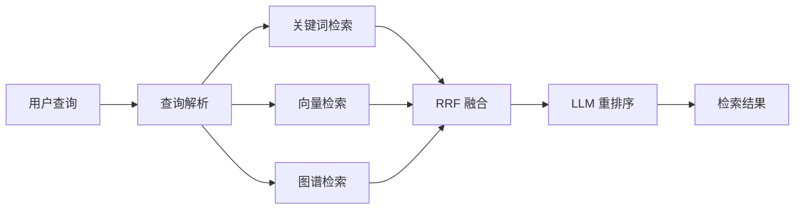

**融合算法（RRF - Reciprocal Rank Fusion）**：

```python
def rrf_fusion(rankings, k=60):
    """融合多路检索结果"""
    scores = {}
    for ranking in rankings:
        for rank, doc in enumerate(ranking):
            if doc not in scores:
                scores[doc] = 0
            scores[doc] += 1 / (k + rank + 1)
    return sorted(scores.items(), key=lambda x: x[1], reverse=True)
```

### 6.5 实施路线建议

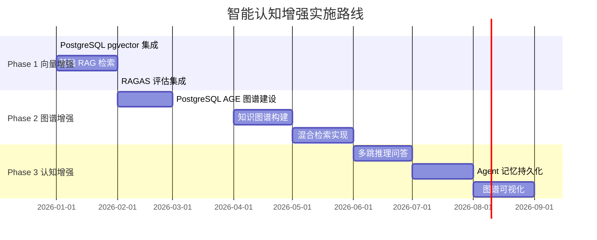

### 6.6 实施指引

> Cognee 快速入门与高级配置详见 [Cognee 深度调研](./040-cognee.md)；Neo4j + LlamaIndex 集成详见 [Neo4j 深度调研](./050-neo4j.md)；OceanBase 向量检索示例详见 [OceanBase 三位一体调研](./033-oceanbase.md)。

**混合检索 Pipeline**：

```python
class HybridRetriever:
    def __init__(self, vector_store, graph_store, llm):
        self.vector_store = vector_store
        self.graph_store = graph_store
        self.llm = llm

    def retrieve(self, query, top_k=10):
        # 1. 向量检索
        vector_results = self.vector_store.similarity_search(query, k=top_k)

        # 2. 图谱检索（注意：演示代码，生产环境需参数化查询防止注入）
        graph_results = self.graph_store.query(
            f"MATCH (n) WHERE n.content CONTAINS '{query}' RETURN n LIMIT {top_k}"
        )

        # 3. RRF 融合（算法见 § 6.4）
        all_docs = self.rrf_fusion([vector_results, graph_results])

        # 4. LLM 重排序
        reranked = self.rerank(query, all_docs[:top_k])
        return reranked

    def rrf_fusion(self, rankings, k=60):
        scores = {}
        for ranking in rankings:
            for rank, doc in enumerate(ranking):
                doc_id = doc.id
                if doc_id not in scores:
                    scores[doc_id] = {"doc": doc, "score": 0}
                scores[doc_id]["score"] += 1 / (k + rank + 1)
        sorted_items = sorted(scores.values(), key=lambda x: x["score"], reverse=True)
        return [item["doc"] for item in sorted_items]

    def rerank(self, query, docs):
        prompt = f"Query: {query}\n\nDocuments:\n"
        prompt += "\n".join(f"{i}. {doc.content[:200]}" for i, doc in enumerate(docs))
        prompt += "\n\nRank these documents by relevance to the query."
        response = self.llm.complete(prompt)
        # 解析并重排序
        return docs
```

---

## 7. References

<a id="ref1"></a>[1] V. Chaudhri et al., "Knowledge Graphs: Introduction, History, and Perspectives," _AI Magazine_, vol. 43, no. 1, pp. 17–29, 2022.

<a id="ref2"></a>[2] D. Edge et al., "From Local to Global: A Graph RAG Approach to Query-Focused Summarization," _arXiv preprint arXiv:2404.16130_, 2024.

<a id="ref4"></a>[4] C. Packer et al., "MemGPT: Towards LLMs as Operating Systems," _arXiv preprint arXiv:2310.08560_, 2023.

<a id="ref5"></a>[5] S. Yao et al., "ReAct: Synergizing Reasoning and Acting in Language Models," _arXiv preprint arXiv:2210.03629_, 2022.

<a id="ref8"></a>[8] A. Asai et al., "Self-RAG: Learning to Retrieve, Generate, and Critique Through Self-Reflection," _arXiv preprint arXiv:2310.11511_, 2023.

<a id="ref9"></a>[9] S. Yan et al., "Corrective Retrieval Augmented Generation," _arXiv preprint arXiv:2401.15884_, 2024.

<a id="ref10"></a>[10] A. Ng, "Four AI Agent Strategies That Improve GPT-4 and GPT-3.5 Performance," _DeepLearning.AI The Batch_, Mar. 2024. [Online]. Available: https://www.deeplearning.ai/the-batch/how-agents-can-improve-llm-performance/

<a id="ref11"></a>[11] Cognee, "Cognee Documentation," 2024. [Online]. Available: https://docs.cognee.ai/

<a id="ref13"></a>[13] Neo4j, "Neo4j Documentation," 2024. [Online]. Available: https://neo4j.com/docs/

<a id="ref14"></a>[14] LlamaIndex, "LlamaIndex Documentation," 2024. [Online]. Available: https://docs.llamaindex.ai/

<a id="ref15"></a>[15] LangChain, "LangGraph Documentation," 2024. [Online]. Available: https://langchain-ai.github.io/langgraph/

<a id="ref16"></a>[16] Letta AI, "MemGPT Documentation," 2024. [Online]. Available: https://docs.letta.com/

<a id="ref17"></a>[17] OceanBase, "OceanBase Vector Search Documentation," 2024. [Online]. Available: https://www.oceanbase.com/docs/

<a id="ref18"></a>[18] FalkorDB, "FalkorDB Documentation," 2024. [Online]. Available: https://docs.falkordb.com/

<a id="ref20"></a>[20] topoteretes, "Cognee," _GitHub Repository_, 2024. [Online]. Available: https://github.com/topoteretes/cognee

<a id="ref22"></a>[22] run-llama, "LlamaIndex," _GitHub Repository_, 2024. [Online]. Available: https://github.com/run-llama/llama_index

<a id="ref23"></a>[23] langchain-ai, "LangGraph," _GitHub Repository_, 2024. [Online]. Available: https://github.com/langchain-ai/langgraph

<a id="ref25"></a>[25] FalkorDB, "FalkorDB," _GitHub Repository_, 2024. [Online]. Available: https://github.com/FalkorDB/FalkorDB

---

## 附录 A：术语表

| 术语     | 英文                  | 定义                             |
| -------- | --------------------- | -------------------------------- |
| 认知增强 | Cognitive Enhancement | 利用 AI 技术增强人类认知能力     |
| 知识图谱 | Knowledge Graph       | 以图结构表示实体及其关系的知识库 |
| GraphRAG | Graph RAG             | 结合知识图谱的检索增强生成       |
| 向量嵌入 | Vector Embedding      | 将文本转化为高维数值向量         |
| 多跳推理 | Multi-hop Reasoning   | 需要多步关系遍历的推理           |
| Agent    | Agent                 | 能感知、决策、行动的自主实体     |
| 长期记忆 | Long-term Memory      | 跨会话持久化的信息存储           |
| 社区检测 | Community Detection   | 识别图中紧密连接的节点群组       |

---

## 附录 B：项目当前状态对照

| 架构组件 | 当前状态                       | 目标状态           | 差距分析                   |
| -------- | ------------------------------ | ------------------ | -------------------------- |
| Agent 层 | ✅ 5 个 Agent（WorkflowAgent / PDFProcessingAgent / TranslationAgent / HeartfeltAgent / BatchProcessingAgent） | 保持               | -                          |
| API 层   | ✅ 完成                        | 保持               | -                          |
| 向量存储 | ✅ PostgreSQL pgvector         | 保持               | -                          |
| 图谱存储 | ⏳ PostgreSQL AGE（规划中）    | Neo4j（外部备选） | AGE 扩展尚未实际部署，需实现 |
| 记忆框架 | ✅ 自研 Hippocampus 记忆引擎（艾宾浩斯衰减） | 保持               | 已实现分型记忆与衰减治理   |
| 混合检索 | ⏳ 自研混合检索                | 评估 RRF 优化      | 基础检索已有               |
| 多跳推理 | 📋 规划中                      | 图谱查询           | 需实现                     |
