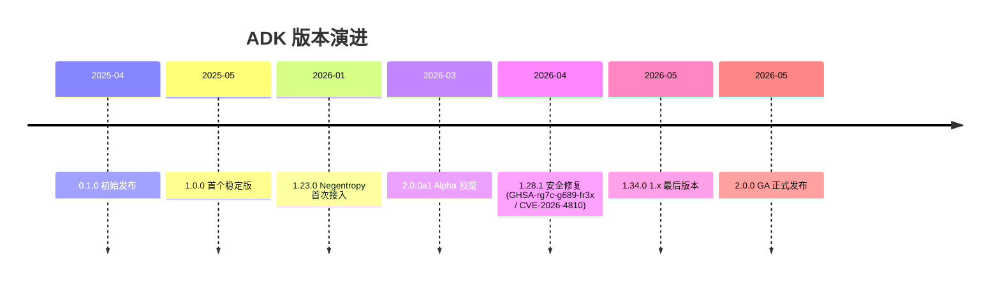
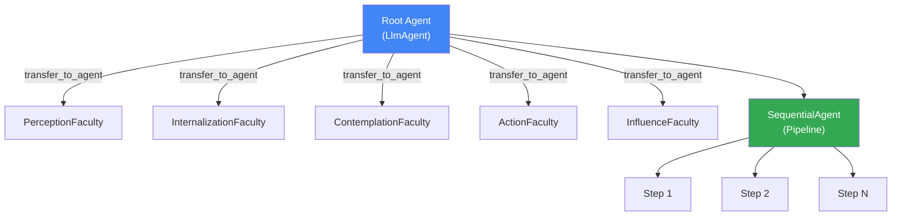
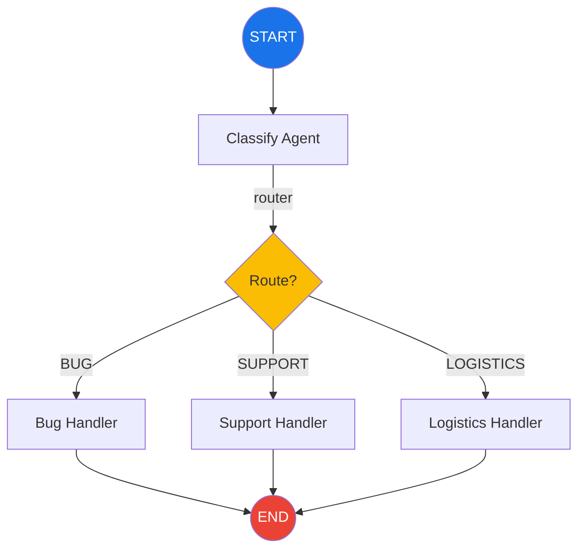
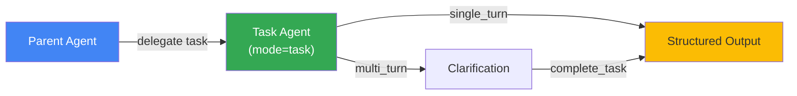
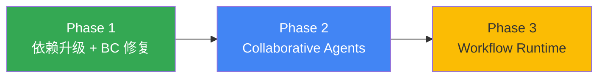

## 1. 概述

Google Agent Development Kit (ADK) 2.0.0 GA 于 **2026-05-19** 正式发布，距首个稳定版 (1.0.0, 2025-05-20) 整整一年。2.0 标志着 ADK 从 **层级式 Agent 执行器** 向 **基于图的执行引擎 (Graph-based Execution Engine)** 的根本性架构变革。

本调研与 [Agent Runtime Frameworks 调研](./020-agent-runtime-frameworks.md) 一脉相承，旨在：
1. **全景解码** ADK 2.0 核心新特性，建立与 1.x 的系统性对比
2. **影响评估** 量化 Breaking Changes 对 Negentropy 项目「一核五翼」架构的冲击
3. **价值研判** 评估 2.0 新特性在本项目中的引入价值与风险

### 1.1 版本演进时间线



1.x 线经历了 **34 个小版本**（约每周一个版本），积累的核心特性包括：A2A 协议、Durable Runtime、Anthropic/Claude 集成、OpenTelemetry Agentic Metrics、Skill Registry、Live API 等。

## 2. 核心架构变革：层级执行器 → 图执行引擎

### 2.1 1.x 架构：层级式 Agent 执行器



**特征**：
- Agent 是独立执行单元，通过 `transfer_to_agent` 在父子间传递控制权
- 工作流限于预置的 `SequentialAgent` / `ParallelAgent` / `LoopAgent`
- 控制流线性，缺乏条件路由、重试、fan-out/fan-in 能力

### 2.2 2.0 架构：基于图的 Workflow Runtime



**核心变化**：`BaseAgent` 现在继承自 `BaseNode`，Agent、Tool、Function 统一为图中的节点。

```python
from google.adk import Agent, Workflow, Event

# ⚠️ 以下 Workflow edges 语法基于社区示例推理，未经官方文档确认

# 2.0: 定义路由工作流
process_message = Agent(
    name="process_message",
    model="gemini-flash-latest",
    instruction='Classify user message into "BUG", "SUPPORT", or "LOGISTICS".',
    output_schema=str,
)

def router(node_input: str):
    routes = [r.strip() for r in node_input.split(",")]
    return Event(route=routes)

root_agent = Workflow(
    name="routing_workflow",
    edges=[
        ("START", process_message, router),
        (router, {
            "BUG": bug_handler,
            "SUPPORT": support_handler,
            "LOGISTICS": logistics_handler,
        }),
    ],
)
```

**支持的图语义**：
| 语义 | 说明 | 1.x 对应 |
|------|------|---------|
| 路由 (Routing) | 条件分支，基于输出选择下游节点 | 无 |
| Fan-out/Fan-in | 并行执行后汇聚 | `ParallelAgent`（但无汇聚） |
| 循环 (Loops) | 图中的循环路径 | `LoopAgent`（受限） |
| 重试 (Retry) | 节点级自动重试 | 无 |
| 状态管理 | 图级别的状态传递 | `output_key` + session state |
| HITL | 人机协同，暂停等待人工输入 | 无 |
| 嵌套工作流 | Workflow 作为图中的子节点 | 无 |

## 3. 三大核心新特性

### 3.1 Graph-based Workflows（基于图的工作流）

通过 `Workflow` 类和 `edges` 数组定义**确定性**执行流程。

**与 Negentropy 的映射**：当前 3 个 `SequentialAgent` 流水线可迁移为 `Workflow`：

| 1.x Pipeline | 2.0 Workflow | 收益 |
|-------------|-------------|------|
| `KnowledgeAcquisitionPipeline` (Perception → Internalization) | `Workflow(edges=[(START, perceive, route), (route, {...})])` | 支持条件跳过（如搜索无结果时跳过内化） |
| `ProblemSolvingPipeline` (Perception → Contemplation → Action → Internalization) | 同上，增加 Action 重试 | Action 失败可自动重试 |
| `ValueDeliveryPipeline` (Perception → Contemplation → Influence) | 同上 | 支持多分支输出 |

### 3.2 Collaborative Agents（协作型 Agent 团队）

通过 `mode` 属性为子 Agent 配置协作模式：

| 模式 | 用户交互 | 控制流返回 | 并行 | 隔离 |
|------|---------|-----------|------|------|
| `chat`（默认） | 完全交互 | 手动 `transfer` | 不支持 | 无 |
| `task` | 有限交互（澄清） | 自动 `complete_task` | 不支持 | Session branch |
| `single_turn` | 无 | 自动返回结果 | **支持** | Session branch |

```python
# 2.0: 协作型 Agent
weather_agent = Agent(name="weather_checker", mode="single_turn", tools=[...])
flight_agent = Agent(name="flight_booker", mode="task",
                     input_schema=FlightInput, output_schema=FlightResult)
root = Agent(name="travel_planner", sub_agents=[weather_agent, flight_agent])
```

**核心价值**：
- `single_turn` 模式 Agent 完成后**自动返回父 Agent**，无需手动 `transfer_to_agent`
- 子 Agent 在**独立 session branch** 中运行，不污染父 session
- `single_turn` 模式支持**并行执行**（fan-out）

**与 Negentropy 的映射**：

| 系部 | 推荐 mode | 理由 |
|------|----------|------|
| PerceptionFaculty | `single_turn` | 纯工具调用，无需交互 |
| ActionFaculty | `single_turn` | 执行类操作，无需交互 |
| InternalizationFaculty | `single_turn` | 存储类操作，无需交互 |
| ContemplationFaculty | `task` | 可能需要澄清问题 |
| InfluenceFaculty | `task` | 可能需要确认输出内容 |

### 3.3 Dynamic Workflows（动态工作流）

通过 `@node` 装饰器和 `Context.run_node()` 实现完全可编程的执行逻辑：

```python
from google.adk import Workflow, Event, Context

@node(name="hello_node")
def my_node(node_input: Any):
    return "Hello World"

@node(rerun_on_resume=True)
async def my_workflow(ctx: Context, node_input: str) -> str:
    # 可编程：条件、循环、错误处理
    for attempt in range(3):
        result = await ctx.run_node(my_node, input_data="hello")
        if result:
            return result
    return "fallback"
```

**核心优势**：`ctx.run_node()` 直接返回节点输出，无需处理 session state 或复杂路由。

## 4. Task API

ADK 2.0 新增 Task API，提供结构化的 Agent 间委托机制：



- **Multi-turn Task**: 多轮交互完成任务
- **Single-turn 受控输出**: 单次执行返回结构化结果（`output_schema`）
- **混合委托**: 组合使用上述模式
- **HITL 支持**: Task 执行中可暂停等待人工输入

## 5. Breaking Changes 全景

### 5.1 Event Schema 变更

新增 `node_info`（图节点追踪）和 `output`（工作流输出）字段。

**对 Negentropy 的影响**：**低**
- 自定义 `PostgresSessionService` 将 Event 存储为 **JSON blob**（`_serialize_content` → `model_dump()`）
- 新字段自然序列化到 JSON 中，**无需数据库 schema 变更**
- `_orm_to_adk_event` 恢复时新字段为 None（旧事件），需确认 `ADKEvent` 构造器兼容

### 5.2 Session 不兼容

**严禁 ADK 2.0 与 ADK 1.0 共享存储系统**。

- ADK 2.0 生成的 session 可被 ADK **1.28+** 读取（多余字段被忽略）
- 与更旧的 1.x 版本不兼容
- 本项目当前 `>=1.28.1`，**向前兼容**

### 5.3 执行驱动器变更

`_run_async_impl()` 和 `generate_content_async()` 等旧抽象方法的覆写**不再有效**。

**对 Negentropy 的影响**：**需验证**
- 本项目未覆写 `_run_async_impl()`（仅使用标准 `LlmAgent`/`SequentialAgent`）
- 自定义 `LiteLlm` 实现（`_dynamic_model.py`）使用 `generate_content_async`，需确认接口是否变更

### 5.4 Event 管理变更

禁止通过 `context.session.events.append()` 直接追加事件，禁止使用 `enqueue_event`。

**对 Negentropy 的影响**：**需验证**
- 搜索项目中是否存在 `events.append` 或 `enqueue_event` 调用
- 自定义 `PostgresSessionService.append_event` 是覆写基类方法，可能受影响

### 5.5 异常处理变更

ADK 2.0 新增 `NodeInterruptedError`（HITL 暂停信号）和自动重试机制。Tool 中宽泛的 `except Exception:` 会：
- 屏蔽框架的自动重试机制
- 拦截 `NodeInterruptedError`，破坏 HITL 功能

**对 Negentropy 的影响**：**中**（原评估为低，修正后上调）
- 工具层发现 **45 处** `except Exception:`，分布在 **12 个**工具文件中（`perception.py` 15 处、`paper.py` 6 处、`hybrid_planner.py` 4 处、`action.py` 3 处、`internalization.py` 3 处 等）
- 多数为配置降级或外部 API 容错，但广泛分布的异常捕获意味着引入 HITL 时需系统性排查
- 当前无 HITL 需求，暂不阻塞升级

### 5.6 Python 版本要求

ADK 2.0 要求 **Python 3.11+**（1.x 最低支持 Python 3.10）。

**对 Negentropy 的影响**：**无** — 本项目 `requires-python = ">=3.13,<3.14"`

## 6. 本项目影响矩阵

| 文件 | ADK 导入 | 2.0 影响 | 改造优先级 |
|------|---------|---------|-----------|
| `engine/adapters/postgres/session_service.py` | `BaseSessionService`, `ADKEvent`, `Session` | Event Schema 兼容 | P0 |
| `engine/adapters/postgres/memory_service.py` | `BaseMemoryService`, `MemoryEntry`, `SearchMemoryResponse` | 接口签名验证 | P0 |
| `engine/factories/runner.py` | `Runner`, `BaseAgent` | 构造器参数验证 | P0 |
| `agents/agent.py` | `LlmAgent`, `CallbackContext`, `LlmRequest` | LlmAgent 接口兼容 | P0 |
| `agents/pipelines/standard.py` | `SequentialAgent` | 2.0 中仍存在，但建议迁移至 Workflow | P1 |
| `agents/_dynamic_model.py` | `LiteLlm` | `generate_content_async` 签名验证 | P0 |
| `agents/_model.py` | `LiteLlm` | 同上 | P0 |
| `engine/bootstrap.py` | ADK CLI, OTel | CLI 接口变更验证 | P1 |
| `engine/factories/session.py` | `InMemorySessionService`, `VertexAiSessionService` | 内置服务类兼容 | P1 |
| `engine/factories/memory.py` | `InMemoryMemoryService`, `VertexAiMemoryBankService` | 同上 | P1 |
| `agents/tools/*.py` (15+ 文件) | `ToolContext` | ToolContext 接口变更验证 | P1 |
| `interface/subagent_presets.py` | `LoopAgent`, `ParallelAgent`, `SequentialAgent` | 类型判断兼容 | P2 |
| `engine/sessions_api.py` | `Event`, `EventActions` | 事件构造兼容 | P2 |
| `engine/adapters/postgres/credential_service.py` | `BaseCredentialService`, `AuthCredential` | 认证接口兼容 | P2 |

## 7. 核心新特性应用价值评估

### 7.1 评估总览

| 新特性 | 当前替代方案 | 引入价值 | 改造风险 | 建议 |
|--------|-------------|:-------:|:-------:|------|
| Graph-based Workflows | `SequentialAgent` 流水线 | ★★★★ | 中 | **推荐引入** |
| Collaborative Agents | `transfer_to_agent` + 手动协调 | ★★★★★ | 低 | **强烈推荐** |
| Dynamic Workflows | 无等价方案 | ★★★ | 低 | 观望，按需引入 |
| Task API | `output_key` + session state | ★★★ | 中 | 需进一步验证 |
| HITL (Human-in-the-Loop) | 无 | ★★ | 低 | 暂不引入 |

### 7.2 Graph-based Workflows — 推荐引入

**当前痛点**：3 个 `SequentialAgent` 流水线是**硬编码的线性序列**，无法支持条件分支或重试：
- 知识获取流水线：搜索无结果时仍会执行内化（浪费 token）
- 问题解决流水线：Action 执行失败时无法重试
- 价值交付流水线：所有路径固定，无法根据内容类型分流

**引入价值**：
1. **条件路由**：`router` 函数根据上游输出动态选择下游节点
2. **自动重试**：Action 系部执行失败可配置 `RetryConfig`
3. **Fan-out**：感知系部可并行调用多个搜索工具后汇聚
4. **向后兼容**：`SequentialAgent` 在 2.0 中仍可用，可渐进迁移

**改造路径**：将 `standard.py` 中的 3 个 `SequentialAgent` 逐步迁移为 `Workflow`。

### 7.3 Collaborative Agents — 强烈推荐

**当前痛点**：Root Agent 通过 `transfer_to_agent` 手动委派任务给子系部，存在显著协调熵：
- 控制权转移后需子系部**主动返回**（`transfer_to_agent` 回父节点）
- 子系部与父 Agent 共享 session state，**状态隔离不彻底**
- 5 个系部**串行调度**，无并行能力

**引入价值**：
1. **自动返回**：`single_turn`/`task` 模式完成后自动返回父 Agent，减少协调逻辑
2. **Session 隔离**：子 Agent 在独立 session branch 中运行，不污染父 session
3. **并行执行**：多个 `single_turn` Agent 可 fan-out 并行
4. **最小改动**：仅需为现有 `LlmAgent` 添加 `mode` 属性

**改造路径**：
```python
# Phase 1: 添加 mode 属性（向后兼容）
perception_agent = LlmAgent(
    name="PerceptionFaculty",
    mode="single_turn",  # 新增
    ...  # 其余不变
)

# Phase 2: 利用 task 模式
contemplation_agent = LlmAgent(
    name="ContemplationFaculty",
    mode="task",
    input_schema=ContemplationInput,
    output_schema=ContemplationOutput,
    ...
)
```

### 7.4 Dynamic Workflows — 观望

适合迭代反思循环（如「沉思→行动→评估→再沉思」），但当前流水线较简单。建议在 Collaborative Agents 落地后再评估。

### 7.5 Task API — 需进一步验证

与现有 `output_key` + session state 机制存在功能重叠。需验证：
- `output_schema` 是否支持 Pydantic 模型
- 与现有 `InstructionProvider` 的兼容性
- 对前端 AG-UI 协议的影响

### 7.6 HITL — 暂不引入

当前系统暂无人机协同需求（所有工具调用均自动执行）。未来若引入人工审批环节（如「发布前确认」），可启用此特性。

## 8. 升级路径与风险

### 8.1 推荐升级策略：渐进式



1. **Phase 1 — 依赖升级 + Breaking Changes 修复**（本次 PR）
   - 更新 `pyproject.toml` 依赖版本
   - 修复 Event Schema、接口签名等兼容性问题
   - 全量测试验证

2. **Phase 2 — Collaborative Agents 引入**（后续 PR）
   - 为 5 个系部 Agent 添加 `mode` 属性
   - 移除手动 `transfer_to_agent` 返回逻辑
   - 验证 session 隔离和并行能力

3. **Phase 3 — Workflow Runtime 迁移**（后续 PR）
   - 将 3 个 `SequentialAgent` 流水线迁移为 `Workflow`
   - 引入条件路由和自动重试
   - 评估 Dynamic Workflows 对迭代反思场景的价值

### 8.2 风险缓解

| 风险 | 概率 | 影响 | 缓解 |
|------|:----:|:----:|------|
| ADK 2.0 GA 刚发布（3 天），可能存在未发现 bug | 中 | 中 | 保留 `>=1.28.1` 回退能力；Phase 1 仅做依赖升级 |
| 自定义 PostgreSQL 适配器接口不兼容 | 低 | 高 | Event JSON blob 存储兼容性好；逐方法验证 |
| Runner 构造器参数变更 | 低 | 高 | 检查 `auto_create_session` 等参数是否仍存在 |
| LiteLlm `generate_content_async` 签名变更 | 中 | 高 | 自定义模型接入是核心链路，需重点验证 |
| Session 数据迁移 | 低 | 中 | ADK 2.0 session 可被 1.28+ 读取，向前兼容 |

## 参考文献

- [1] Google. "Welcome to ADK 2.0," *Google ADK Documentation*, 2026. https://google.github.io/adk-docs/2.0/
- [2] Google. "Graph-based agent workflows," *Google ADK Documentation*, 2026. https://google.github.io/adk-docs/workflows/
- [3] Google. "Collaborative agents," *Google ADK Documentation*, 2026. https://google.github.io/adk-docs/workflows/collaboration/
- [4] Google. "Dynamic workflows," *Google ADK Documentation*, 2026. https://google.github.io/adk-docs/workflows/dynamic/
- [5] Google. "Migration guide from ADK 1.x to 2.0," *GitHub Discussion #5263*, 2026. https://github.com/google/adk-python/discussions/5263
- [6] Google. "ADK CHANGELOG," *GitHub*, 2026. https://github.com/google/adk-python/blob/main/CHANGELOG.md
- [7] Google. "Agent Runtime," *Google ADK Documentation*, 2026. https://google.github.io/adk-docs/runtime/
- [8] Google Developers Blog. "Agents, ADK, Agent Engine, A2A Enhancements," 2026. https://developers.googleblog.com/en/agents-adk-agent-engine-a2a-enhancements-google-io/
