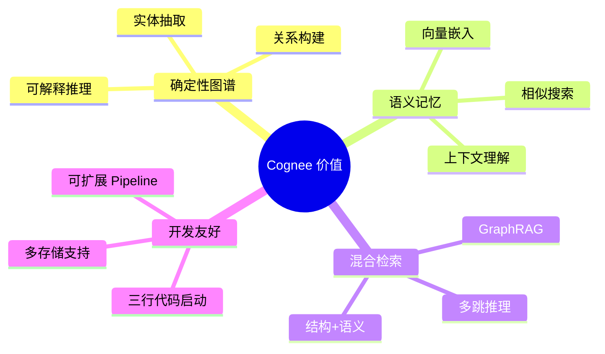
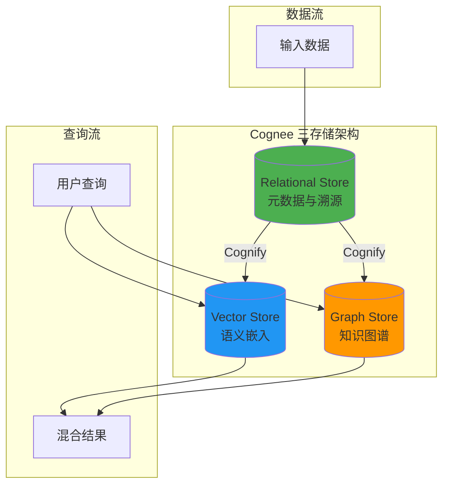
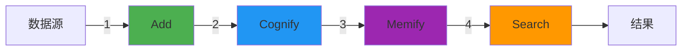
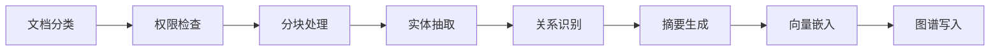
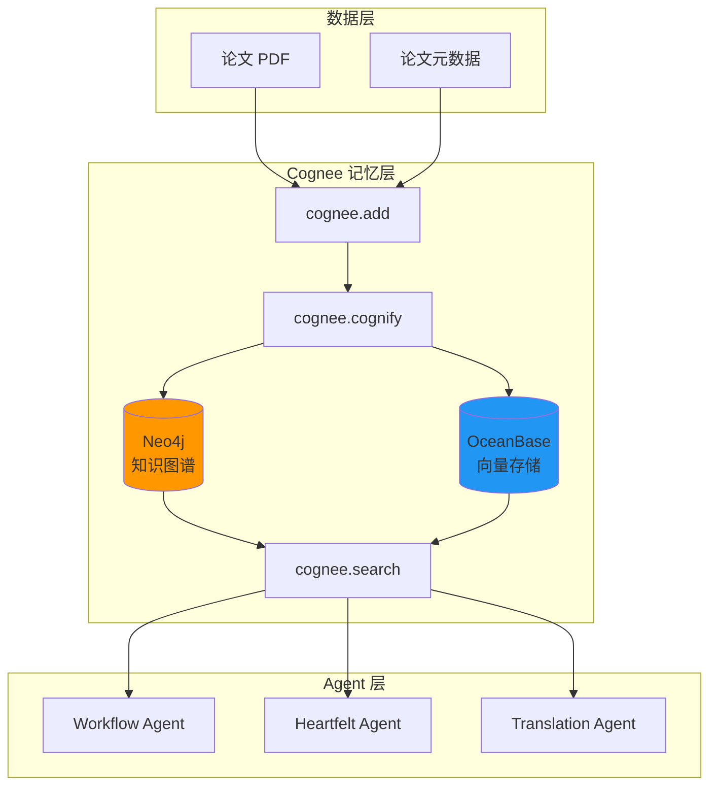
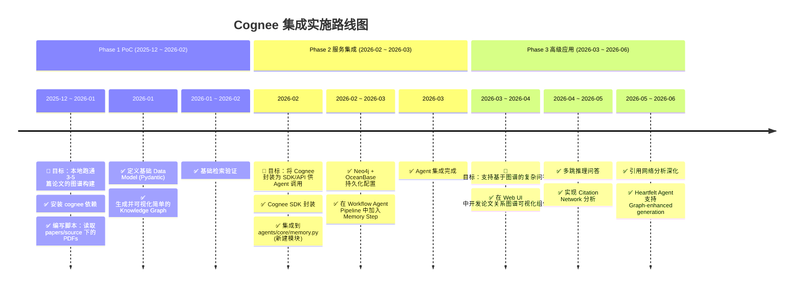

> [!IMPORTANT]
>
> **调研目的**：为本项目 AI 记忆层构建提供 Cognee 框架的深度技术调研和集成方案

---

## 1. 概述与核心价值

### 1.1 Cognee 是什么

Cognee 是一个开源的 **AI 记忆层框架**，将非结构化数据转化为可搜索、可推理的知识图谱<sup>[[1]](#ref1)</sup>。

> **核心理念**：将文档转换为 AI 记忆，构建确定性知识图谱与语义检索能力

### 1.2 解决的核心问题

| 问题           | 传统 RAG                        | Cognee 解决方案         |
| -------------- | ------------------------------- | ----------------------- |
| **无状态调用** | 每次 LLM 请求独立，无法记住历史 | 构建跨会话的记忆层      |
| **孤立文档**   | 文档被独立处理，无法感知关联    | 知识图谱连接实体与关系  |
| **浅层检索**   | 仅靠向量相似度，丢失结构信息    | 图遍历 + 向量的混合检索 |
| **上下文碎片** | 上下文无法跨文档建立关联        | 确定性图谱提供全局视图  |

### 1.3 核心价值



---

## 2. 架构深度解析

### 2.1 三存储架构

Cognee 采用三个互补的存储系统<sup>[[2]](#ref2)</sup>：



### 2.2 各存储职责

| 存储                 | 职责                               | 使用阶段           | 查询类型 |
| -------------------- | ---------------------------------- | ------------------ | -------- |
| **Relational Store** | 文档元数据、分块溯源、数据来源追踪 | Cognify 时追踪来源 | 精确查询 |
| **Vector Store**     | 语义嵌入向量、相似度指纹           | Search 时语义匹配  | 语义检索 |
| **Graph Store**      | 实体节点、关系边、知识结构         | Search 时结构推理  | 图遍历   |

### 2.3 存储使用场景

**Cognify 阶段**：

- Relational Store 负责追踪文档、分块及数据来源

**Search 阶段**：

- **语义搜索（Vector）**：基于嵌入找到概念相关的段落
- **结构搜索（Graph）**：使用 Cypher 探索实体和关系
- **混合搜索（Vector + Graph）**：结合两种视角，获得上下文丰富且结构精确的结果

---

## 3. 核心操作详解

Cognee 提供四个核心操作<sup>[[3]](#ref3)</sup>：



### 3.1 Add - 数据摄入

```python
import cognee

# 添加文本
await cognee.add("Your document content here")

# 添加文件或目录
await cognee.add("papers/source/", dataset_name="research_papers")

# 添加多种格式
await cognee.add(["file1.pdf", "file2.txt", "http://example.com"])
```

**支持的输入类型**：

- 纯文本字符串
- 本地文件路径（PDF、TXT、Markdown、DOCX）
- 目录路径（递归处理）
- URL（自动下载和解析）
- S3 URI

**Add 阶段处理**：

1. 输入归一化 → 将各种格式转换为纯文本
2. 存储到数据集 → 数据集作为组织数据的一级对象
3. 去重处理 → 避免重复添加相同内容
4. **不生成嵌入** → 这是 Cognify 阶段的任务

### 3.2 Cognify - 知识构建

```python
# 对添加的数据进行认知化处理
await cognee.cognify()

# 指定处理特定数据集
await cognee.cognify(dataset_name="research_papers")
```

**Cognify 执行的任务链**：



| 任务                   | 说明                       |
| ---------------------- | -------------------------- |
| **Classify Documents** | 将输入包装为 Document 对象 |
| **Check Permissions**  | 验证处理权限               |
| **Extract Chunks**     | 将文档分块                 |
| **Extract Graph**      | LLM 抽取实体和关系         |
| **Summarize Text**     | 生成文档摘要               |
| **Add Data Points**    | 写入向量和图存储           |

### 3.3 Memify - 语义增强（Coming Soon）

```python
# 语义增强（即将推出）
await cognee.memify()
```

**预期功能**：

- 深度语义理解
- 上下文关系增强
- 跨文档概念链接

### 3.4 Search - 智能检索

```python
from cognee.api.v1.search import SearchType

# 默认综合搜索
results = await cognee.search(query_text="What is Agentic AI?")

# 指定搜索类型
results = await cognee.search(
    SearchType.INSIGHTS,
    query_text="How do knowledge graphs improve RAG?"
)
```

**搜索模式**：

| 模式               | 说明                  | 适用场景     |
| ------------------ | --------------------- | ------------ |
| `INSIGHTS`         | 综合向量+图谱（默认） | 一般问答     |
| `CHUNKS`           | 仅向量相似度          | 快速语义匹配 |
| `GRAPH_COMPLETION` | 图补全扩展            | 关系探索     |
| `NATURAL_LANGUAGE` | 自然语言转 Cypher     | 结构化查询   |
| `CYPHER`           | 直接执行 Cypher       | 高级用户     |
| `FEELING_LUCKY`    | 自动选择最佳模式      | 不确定时使用 |

---

## 4. 构建块（Building Blocks）

### 4.1 DataPoints - 原子知识单元

DataPoints 是 Cognee 中知识的原子单位<sup>[[4]](#ref4)</sup>：

**核心特征**：

- **原子性**：每个 DataPoint 代表一个概念或信息单元
- **结构化**：基于 Pydantic 模型实现验证和序列化
- **上下文化**：携带溯源、版本和索引提示

**核心结构**：

```python
class DataPoint(BaseModel):
    id: UUID = Field(default_factory=uuid4)
    created_at: int = ...  # 毫秒时间戳
    updated_at: int = ...  # 毫秒时间戳
    version: int = 1
    topological_rank: Optional[int] = 0
    metadata: Optional[dict] = {"index_fields": []}
    type: str = "DataPoint"
    belongs_to_set: Optional[List["DataPoint"]] = None
```

**字段说明**：

| 字段                      | 说明                               |
| ------------------------- | ---------------------------------- |
| `id`                      | 唯一标识符                         |
| `created_at / updated_at` | 时间戳（毫秒）                     |
| `version`                 | 版本号，用于变更追踪               |
| `metadata.index_fields`   | **关键字段**：决定哪些字段被向量化 |
| `type`                    | 类名                               |
| `belongs_to_set`          | 分组关联                           |

**索引与嵌入**：

```python
# index_fields 中的字段 → 转换为嵌入向量
# 每个索引字段 → 独立的向量集合（Class_field）
# 非索引字段 → 保持为普通属性
```

**内置 DataPoint 类型**：

- `Document` - 原始文档
- `Chunk` - 文档分块
- `Summary` - 摘要
- `Entity` - 实体
- `Edge` - 关系边

### 4.2 Tasks - 处理单元

Tasks 是执行数据转换的独立单元：

```python
from cognee.tasks import Task

class ExtractEntitiesTask(Task):
    async def run(self, chunks: List[Chunk]) -> List[Entity]:
        # 实体抽取逻辑
        entities = await self.llm.extract_entities(chunks)
        return entities
```

**内置 Tasks**：

- `ChunkTask` - 文档分块
- `ExtractEntitiesTask` - 实体抽取
- `ExtractRelationsTask` - 关系抽取
- `SummarizeTask` - 摘要生成
- `EmbedTask` - 向量嵌入

### 4.3 Pipelines - 任务编排

Pipelines 将 Tasks 编排为协调的工作流：

```python
from cognee.pipelines import Pipeline

pipeline = Pipeline([
    ChunkTask(chunk_size=512),
    ExtractEntitiesTask(llm=claude),
    ExtractRelationsTask(llm=claude),
    EmbedTask(embedder=openai_embedding),
])

await pipeline.run(documents)
```

---

## 5. 存储配置

### 5.1 Graph Store 配置

Cognee 支持多种图数据库<sup>[[5]](#ref5)</sup>：

**Neo4j 配置**：

```python
import cognee
from cognee.infrastructure.databases.graph import Neo4jConfig

cognee.config.set_graph_db_config(Neo4jConfig(
    uri="bolt://localhost:7687",
    username="neo4j",
    password="password"
))
```

**FalkorDB 配置**：

```python
from cognee.infrastructure.databases.graph import FalkorDBConfig

cognee.config.set_graph_db_config(FalkorDBConfig(
    host="localhost",
    port=6379
))
```

**支持的图数据库**：

| 数据库       | 适用场景         | 特点               |
| ------------ | ---------------- | ------------------ |
| **Neo4j**    | 企业级、生产环境 | 最成熟，生态完善   |
| **FalkorDB** | 高性能 AI 场景   | 低延迟，Redis 兼容 |
| **Kuzu**     | 嵌入式、本地开发 | 无需服务器，高性能 |
| **NetworkX** | 原型开发、测试   | 内存图，轻量       |

### 5.2 Vector Store 配置

**Qdrant 配置**：

```python
from cognee.infrastructure.databases.vector import QdrantConfig

cognee.config.set_vector_db_config(QdrantConfig(
    url="http://localhost:6333",
    api_key="your-api-key"
))
```

**Weaviate 配置**：

```python
from cognee.infrastructure.databases.vector import WeaviateConfig

cognee.config.set_vector_db_config(WeaviateConfig(
    url="http://localhost:8080"
))
```

**支持的向量数据库**：

| 数据库       | 适用场景        | 特点           |
| ------------ | --------------- | -------------- |
| **LanceDB**  | 默认、本地开发  | 嵌入式，零配置 |
| **Qdrant**   | 生产环境        | 高性能，过滤强 |
| **Weaviate** | 灵活集成        | GraphQL 接口   |
| **Milvus**   | 大规模向量      | 十亿级支持     |
| **PGVector** | PostgreSQL 集成 | 复用现有 PG    |

### 5.3 LLM Provider 配置

```python
import cognee

# OpenAI
cognee.config.set_llm_api_key("sk-...")
cognee.config.set_llm_provider("openai")
cognee.config.set_llm_model("gpt-4o")

# Anthropic
cognee.config.set_llm_provider("anthropic")
cognee.config.set_llm_model("claude-3-5-sonnet-20241022")

# Azure OpenAI
cognee.config.set_llm_provider("azure")
cognee.config.set_azure_endpoint("https://your-resource.openai.azure.com")
```

---

## 6. 高级特性

### 6.1 Node Sets - 节点分组

Node Sets 提供标记和组织系统，帮助分类和过滤知识库内容<sup>[[6]](#ref6)</sup>：

```python
# 为数据点分配 Node Set
datapoint.belongs_to_set = [paper_set, method_set]

# 按 Node Set 检索
results = await cognee.search(
    query_text="...",
    node_sets=["research_papers"]
)
```

### 6.2 Ontologies - 外部知识接入

通过 RDF/XML 本体连接外部知识结构<sup>[[6]](#ref6)</sup>：

```python
# 加载外部本体
await cognee.load_ontology("https://example.org/ontology.owl")

# 知识接地
await cognee.ground_to_ontology(entities, ontology="schema.org")
```

**应用场景**：

- **知识组织**：系统化标记管理知识库
- **知识接地**：连接到外部验证的知识源
- **领域专业**：利用医学、金融等领域的现有本体

### 6.3 权限系统

Cognee 支持细粒度权限控制：

```python
# 设置数据权限
await cognee.add(
    data,
    permissions=["user:alice", "group:research"]
)

# 带权限检索
results = await cognee.search(
    query_text="...",
    user_id="alice"
)
```

---

## 7. 本项目集成方案

### 7.1 集成目标

在本项目中引入 Cognee 作为 **论文知识记忆层**，实现：

1. **论文关系图谱**：自动抽取作者、引用、方法论等关系
2. **跨论文推理**：支持 "使用相似方法的论文有哪些" 等复杂查询
3. **Agent 长期记忆**：为 Heartfelt Agent 提供跨会话上下文

### 7.2 技术选型

| 组件             | 选型                          | 理由                            |
| ---------------- | ----------------------------- | ------------------------------- |
| **Graph Store**  | Neo4j                         | 成熟生态，与 LangChain 集成完善 |
| **Vector Store** | OceanBase                     | 复用项目已选向量存储            |
| **LLM Provider** | Anthropic Claude              | 强大的指令遵循能力              |
| **Embedding**    | OpenAI text-embedding-3-small | 高质量嵌入                      |

### 7.3 集成架构



### 7.4 关键流程

1.  **数据摄入 (Ingestion)**：

    - 当 `PDF Agent` 完成解析后，将清洗后的 Markdown/Text 内容投递给 Cognee。
    - 调用 `cognee.add(data)` 进行存储。

2.  **认知化 (Cognify)**：

    - 调用 `cognee.cognify()`。
    - Cognee 利用 LLM 自动提取节点（Node）和边（Edge）。
    - _示例节点_：`Paper`, `Author`, `Method`, `Metric`.
    - _示例关系_：`AUTHORED_BY`, `CITES`, `USES_METHOD`.

3.  **语义增强 (Memify)**：

    - (可选) 针对特定领域逻辑，进一步丰富图谱。例如，建立 "Methodology Hierarchy"（这一方法论属于哪一类）。

4.  **检索与增强 (Retrieval)**：
    - 在 `Heartfelt Agent` 进行深度分析时，不仅检索相似文本，还查询图谱：
    - _"找出所有使用了 Chain-of-Thought 方法的论文，并总结其效果差异。"_

### 7.5 数据模型设计

为论文场景定义的 DataPoints：

```python
from cognee.models import DataPoint
from pydantic import Field
from typing import List

class Paper(DataPoint):
    title: str = Field(..., description="论文标题")
    abstract: str = Field(..., description="摘要")
    authors: List[str] = Field(default_factory=list)
    year: int = Field(..., description="发表年份")
    venue: str = Field(None, description="发表期刊/会议")

    class Config:
        index_fields = ["title", "abstract"]

class Author(DataPoint):
    name: str
    affiliation: str = None
    email: str = None

class Method(DataPoint):
    name: str
    description: str
    category: str  # e.g., "Prompt Engineering", "Agent Framework"

    class Config:
        index_fields = ["description"]

class Citation(DataPoint):
    source_paper_id: str
    target_paper_id: str
    context: str  # 引用上下文
```

### 7.6 实施路线图



> [!NOTE]
>
> **路线图说明**：
>
> - 🎯 表示各阶段核心目标
> - ✅ 表示具体行动项
> - 时间跨度基于预估，实际进度可能根据资源和优先级调整

---

## 8. Demo 实施指引

### 8.1 环境准备

**Step 1: 安装依赖**

```bash
# 安装 Cognee
pip install cognee

# 安装可选依赖（根据选用的存储）
pip install cognee[neo4j]     # Neo4j 支持
pip install cognee[qdrant]    # Qdrant 支持
pip install cognee[weaviate]  # Weaviate 支持
```

**Step 2: 配置环境变量**

```bash
# .env 文件
OPENAI_API_KEY=sk-your-openai-key
ANTHROPIC_API_KEY=your-anthropic-key

# Neo4j 配置（可选）
NEO4J_URI=bolt://localhost:7687
NEO4J_USERNAME=neo4j
NEO4J_PASSWORD=password
```

### 8.2 基础 Demo

```python
import cognee
import asyncio

async def paper_memory_demo():
    # 1. 重置环境（开发测试用）
    await cognee.prune.prune_data()
    await cognee.prune.prune_system(metadata=True)

    # 2. 配置 LLM
    cognee.config.set_llm_api_key("sk-...")
    cognee.config.set_llm_provider("openai")

    # 3. 添加论文内容
    papers = [
        """
        Title: ReAct: Synergizing Reasoning and Acting in Language Models
        Abstract: While large language models have demonstrated remarkable abilities...
        """,
        """
        Title: Chain-of-Thought Prompting Elicits Reasoning
        Abstract: We explore how generating a chain of thought...
        """
    ]

    for paper in papers:
        await cognee.add(paper, dataset_name="agent_papers")

    # 4. 构建知识图谱
    await cognee.cognify(dataset_name="agent_papers")

    # 5. 执行查询
    results = await cognee.search(
        query_text="What are the main reasoning approaches in LLMs?"
    )

    for result in results:
        print(f"Score: {result.score:.3f}")
        print(f"Content: {result.content[:200]}...")
        print("---")

if __name__ == "__main__":
    asyncio.run(paper_memory_demo())
```

### 8.3 进阶 Demo: 论文关系图谱

```python
import cognee
from cognee.api.v1.search import SearchType

async def paper_graph_demo():
    # 1. 添加论文目录
    await cognee.add(
        "papers/source/llm-agents/",
        dataset_name="agent_papers"
    )

    # 2. 构建图谱
    await cognee.cognify()

    # 3. 图遍历查询：找相关论文
    results = await cognee.search(
        SearchType.GRAPH_TRAVERSAL,
        query_text="ReAct framework",
        max_hops=2  # 最多两跳关系
    )

    # 4. 自然语言转 Cypher 查询
    cypher_results = await cognee.search(
        SearchType.NATURAL_LANGUAGE,
        query_text="Find all papers that cite ReAct and use chain-of-thought"
    )

    # 5. 直接 Cypher 查询（高级）
    raw_cypher = await cognee.search(
        SearchType.CYPHER,
        query_text="""
        MATCH (p1:Paper)-[:CITES]->(p2:Paper)
        WHERE p2.title CONTAINS 'ReAct'
        RETURN p1.title, p1.abstract
        LIMIT 10
        """
    )

asyncio.run(paper_graph_demo())
```

### 8.4 与 Agent 集成示例

```python
from agents.core.memory import CogneeMemory
from agents.heartfelt.agent import HeartfeltAgent

class CogneeMemory:
    def __init__(self):
        cognee.config.set_llm_provider("anthropic")
        cognee.config.set_llm_model("claude-3-5-sonnet-20241022")

    async def add_paper(self, content: str, metadata: dict):
        """添加论文到记忆"""
        await cognee.add(content, dataset_name="papers")
        await cognee.cognify()

    async def search(self, query: str, search_type: str = "INSIGHTS"):
        """检索相关知识"""
        type_map = {
            "INSIGHTS": SearchType.INSIGHTS,
            "GRAPH": SearchType.GRAPH_TRAVERSAL,
            "SEMANTIC": SearchType.CHUNKS
        }
        return await cognee.search(
            type_map.get(search_type, SearchType.INSIGHTS),
            query_text=query
        )

# Agent 使用示例
async def agent_with_memory():
    memory = CogneeMemory()
    agent = HeartfeltAgent(memory=memory)

    # Agent 查询时自动使用记忆
    response = await agent.analyze(
        "比较 ReAct 和 Chain-of-Thought 在表格推理任务上的表现"
    )
    print(response)
```

### 8.5 可视化集成

```python
import cognee

async def visualize_knowledge_graph():
    # 构建图谱后获取可视化
    await cognee.cognify()

    # 生成交互式图谱可视化
    from cognee.visualization import render_graph

    # 导出为 HTML（可交互拖拽、缩放）
    render_graph(
        output_path="paper_knowledge_graph.html",
        title="论文知识图谱"
    )
```

### 8.6 验证清单

| 验证项                  | 预期结果                 | 通过标准           |
| ----------------------- | ------------------------ | ------------------ |
| 基础 Add/Cognify/Search | 成功执行                 | 无报错，返回结果   |
| 图谱节点生成            | 论文、作者、方法实体存在 | Neo4j 可查询到节点 |
| 关系边生成              | CITES、USES_METHOD 等边  | 边数量 > 0         |
| 语义检索                | 相关论文排序靠前         | Top-3 相关性 > 0.7 |
| 图遍历检索              | 多跳关系可达             | 2-hop 内找到关联   |
| Agent 集成              | Agent 可调用记忆         | 集成测试通过       |

---

## 9. References

<a id="ref1"></a>[1] Cognee Documentation, "Getting started - Introduction," 2024. [Online]. Available: https://docs.cognee.ai/getting-started/introduction

<a id="ref2"></a>[2] Cognee Documentation, "Core concepts - Architecture," 2024. [Online]. Available: https://docs.cognee.ai/core-concepts/architecture

<a id="ref3"></a>[3] Cognee Documentation, "Core concepts - Main operations," 2024. [Online]. Available: https://docs.cognee.ai/core-concepts/main-operations

<a id="ref4"></a>[4] Cognee Documentation, "Core concepts - Building blocks (DataPoints)," 2024. [Online]. Available: https://docs.cognee.ai/core-concepts/building-blocks

<a id="ref5"></a>[5] Cognee Documentation, "Setup & configuration - Graph stores," 2024. [Online]. Available: https://docs.cognee.ai/setup-configuration/graph-stores

<a id="ref6"></a>[6] Cognee Documentation, "Core concepts - Further concepts (Node sets & ontologies)," 2024. [Online]. Available: https://docs.cognee.ai/core-concepts/further-concepts

<a id="ref7"></a>[7] topoteretes, "Cognee - Build dynamic AI memory," _GitHub Repository_, 2024. [Online]. Available: https://github.com/topoteretes/cognee

<a id="ref8"></a>[8] V. Chaudhri et al., "Knowledge graphs: Introduction, history, and perspectives," _AI Mag._, vol. 44, no. 1, pp. 1–20, 2023.

<a id="ref9"></a>[9] D. Edge et al., "From local to global: A Graph RAG approach to query-focused summarization," _arXiv preprint arXiv:2404.16130_, 2024.
