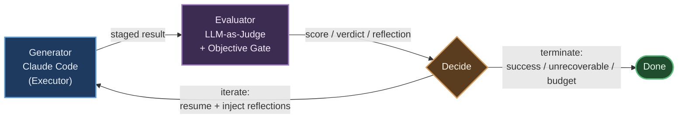

# Routine：长周期自主任务的 Agent 迭代模式调研

> **摘要 / 导言**：单次（single-shot）的智能体调用在长周期（long-horizon）任务上系统性失效——模型一旦交付便丧失对"结果是否达标"的判断与纠错能力，错误沿轨迹复利累积，且缺乏跨轮次的经验承继。Negentropy 的 **Routine** 特性主张以一个**闭环**应对这一困境：由 Engine 担任 Orchestrator + Evaluator，向 Claude Code（Executor）下发目标；Engine 对暂存（staged）产物进行评估——LLM-as-Judge 给出 0–100 分、verdict 与 reflection，并叠加可选的命令/测试客观门禁（objective gate）；据此决策**迭代**（恢复 Claude Code 会话并注入累积反思）或**终止**（成功 / 不可恢复 / 预算耗尽）。本报告综合迭代式智能体的学术基础、LLM-as-a-Judge 的偏差治理、业界编码智能体的长程执行工程，以及停止准则与失控防护，最终将这些证据映射到 Routine 的具体设计决策上。

---

## 1. 问题背景与设计命题

长周期任务（跨越数十至数百步、可能持续数小时的编码、重构、调研类工作）对智能体提出了三重挑战，而这三者恰是单次调用范式无法回应的。

其一，**误差复利（compounding error）**。Anthropic 在《Building Effective AI Agents》中明确指出，赋予智能体自主性会同时放大成本与"复合错误"（compounding errors）的风险，因此每一步都应从环境获取"ground truth"（如工具执行结果）以评估进展[[1]](#ref1)。单次调用恰恰缺失这一反馈通道：模型在内部"自信"地生成全部输出，却无任何外部信号校准其轨迹。

其二，**判停缺位**。模型自身难以可靠地判断"任务是否真正完成"。当评估与生成由同一前向过程承担时，模型倾向于在语言层面宣告成功而非在事实层面验证成功。将"生成"与"评判"正交解耦（Orthogonal Decomposition），使评估成为独立的、可锚定客观证据的环节，是恢复判停能力的前提。

其三，**经验不可承继**。朴素的"失败即重试"会丢弃上一轮的全部教训，使智能体在同一陷阱上反复跌倒。长周期任务需要一种跨轮次的**情节记忆（episodic memory）**，把失败转化为可被下一轮利用的约束。

由此引出 Routine 的核心设计命题——**闭环生成–评估–决策（generator → evaluator → decide loop）**：以独立评估器锚定客观信号对抗误差复利，以显式终止准则恢复判停，以反思注入实现经验承继。下文逐层论证其学术与工程基础。

---

## 2. 学术基础：迭代式智能体模式

闭环迭代并非新构想，过去数年的多项工作从不同侧面奠定了其方法论。以下逐一阐述其机制，并指明对 Routine 闭环的映射。

**ReAct（推理–行动交织）**。Yao 等人提出将"推理轨迹（reasoning trace）"与"行动（action）"在同一序列中交替生成：推理用于规划与追踪状态，行动用于与外部环境交互并取回观测，二者协同减少幻觉、提升可解释性[[2]](#ref2)。ReAct 确立了"思考→行动→观测"的基本节律，是 Executor 单次会话内部循环的原型；Routine 在其之上叠加了**跨会话**的外层循环。

**Reflexion（口头化自我反思持久为情节记忆）**。Shinn 等人提出 Reflexion 框架：智能体在一轮失败后，将环境反馈转译为**自然语言形式的"口头强化（verbal reinforcement）"反思**，并将其写入情节记忆缓冲，供后续轮次的决策检索利用——无需更新模型权重即可实现跨试验的策略改进[[3]](#ref3)。这正是 Routine **反思注入（reflection injection）**机制的理论内核：每轮评估产出的 reflection 被持久化并在下一轮恢复会话时回注，使智能体"记住"为何失败、如何规避。Reflexion 由此成为本报告最直接的设计依据。

**Self-Refine（自反馈迭代精修）**。Madaan 等人证明，同一个 LLM 可在无额外训练的前提下，对自身输出生成反馈并据此迭代改写，从而提升质量[[4]](#ref4)。它印证了"生成–反馈–精修"循环的有效性；Routine 的差异在于将反馈职责交由**独立**的评估器并锚定客观门禁，以缓解"自我评判"的乐观偏置（见 §3）。

**LATS（语言智能体树搜索）**。Zhou 等人将蒙特卡洛树搜索（MCTS）引入语言智能体，统一推理、行动与规划：通过对多条候选轨迹进行扩展、评估与回溯（backtracking），在解空间中进行有引导的探索[[5]](#ref5)。LATS 代表迭代的"分支搜索"形态。Routine 当前采用**线性恢复式迭代**（resume-and-retry）而非树搜索，以换取实现简洁与会话连续性；但 LATS 的"评估驱动回溯"思想为 Routine 未来引入分支/检查点回退预留了演进方向。

**Voyager（自动课程 + 技能库 + 自验证）**。Wang 等人在 Minecraft 中构建终身学习智能体 Voyager，其三大组件为：自动课程（automatic curriculum）渐进式提出目标、可复用技能库（skill library）沉淀可执行代码、以及**自验证（self-verification）**机制校验任务完成度并在失败时驱动重试[[6]](#ref6)。Voyager 的自验证回路与 Routine 的"评估器判停"同构；其技能库沉淀思想则与 Negentropy 的知识结晶（Knowledge Crystallization）理念相呼应——失败教训与成功范式都应被持久化为系统资产。

---

## 3. 评估机制：LLM-as-a-Judge 及其偏差治理

将 LLM 用作评估器（LLM-as-a-Judge）是 Routine 评估环节的技术选型，但该范式存在系统性偏差，必须以工程手段治理。Gu 等人的系统综述梳理了这一领域的主要偏差类型[[7]](#ref7)：

- **位置偏差（position bias）**：评判结果受候选呈现顺序影响；
- **冗长偏差（verbosity bias）**：倾向给更长的回答打高分，而非更正确的；
- **自我偏好（self-preference）**：评估模型偏好与自身风格相近或自身生成的内容；
- **评分区间偏差（scoring-range / scale bias）**：分数在区间内分布失衡、缺乏区分度。

针对上述偏差，Routine 采用三项相互正交的缓解策略：

1. **确定性评判（temperature = 0）**：将评估调用的温度置零，消除随机抖动，使同一产物在重复评估下给出稳定结论，便于"无进展/震荡"检测（见 §5）依赖可复现的分数轨迹。
2. **客观门禁锚定（objective gate anchoring）**：在主观分数之外引入可选的命令/测试门禁（如编译、单测、lint）。客观门禁提供不可被语言风格"游说"的硬信号，从根本上抑制冗长偏差与自我偏好对最终决策的污染——评估器再"健谈"，也无法让一个未通过测试的产物被判为成功。
3. **分数与裁定解耦（score + verdict decoupling）**：将连续分数（0–100，用于趋势与阈值判断）与离散裁定（verdict，如 pass/fail/continue）分离产出，并要求评估器附带 reflection 说明理由。解耦避免了"用单一标量承载过多语义"的脆弱性，也使 reflection 成为可注入下一轮的结构化经验。

此外，长上下文场景下的"**Lost in the Middle**"效应不容忽视。Liu 等人发现，当关键信息位于长上下文的中段时，模型的利用率显著低于其位于首尾时——性能随相关信息位置呈现 U 形曲线[[8]](#ref8)。这对 Routine 有两点直接含义：其一，注入评估器的累积反思应**置于提示的显著位置**（首部或尾部），而非淹没于冗长的历史中段；其二，反思需经提炼压缩而非无限堆叠，以免关键约束因落入"中间盲区"而被忽视。

---

## 4. 工程实践：业界编码智能体的长程执行

学术模式之外，主流编码智能体的工程实现为 Routine 提供了可直接借鉴的落地范式。

**Anthropic —《Building Effective AI Agents》**。该文（2024-12-19）系统归纳了若干可组合的工作流与智能体模式，其中两者与 Routine 高度契合[[1]](#ref1)：

- **Evaluator-Optimizer（评估器–优化器）**：一个 LLM 生成响应，另一个 LLM 评估并给出反馈，在循环中迭代。适用场景的判据是"存在清晰的评估标准，且迭代精修能带来可测量的提升"。这正是 Routine 闭环的工程命名对应物。
- **Orchestrator-Workers（编排者–工作者）**：中央 LLM 动态拆解任务、分派子任务、再汇总结果；适用于"无法预先预测子任务"的复杂任务（如跨多文件的代码变更）。Routine 中 Engine 即扮演 Orchestrator 角色，Claude Code 则是承接具体执行的 Worker。

尤为关键的是其关于停止准则的指引：文中建议为自主智能体设置停止条件"**例如最大迭代次数（maximum number of iterations）**"以保持可控，并强调因自主性抬升成本与复合错误风险，须在沙盒环境中充分测试并辅以"适当的护栏（appropriate guardrails）"[[1]](#ref1)。这为 §5 的硬性护栏提供了权威背书。

**Claude Code Headless / Agent SDK**。Claude Code 的无头模式是 Routine 将其作为 Executor 编排的技术基础[[9]](#ref9)。关键能力包括：以 `claude -p`（`--print`）非交互运行；`--output-format stream-json` 以 NDJSON 逐行输出事件，适配长任务的实时监控；通过捕获 JSON 输出中的 `session_id` 并以 `--resume $session_id` **恢复既有会话**，从而在多次独立调用间承继完整对话历史；以及以 `--max-turns` 约束单次调用的内部迭代上限（无头模式默认上限为 10 轮），作为成本与安全控制（部分版本另提供 `--max-budget-usd` 等预算开关，需以实际 CLI/SDK 版本为准）。其中，**会话跨调用连续性**是有状态迭代的命门——它使 Engine 能够"暂停—评估—带着反思恢复"，而非每轮从零重启，丢失上下文。

**OpenAI Codex（2025）**。Codex 体现了"Plan → Edit → Test → Observe → Repair"的测试驱动自纠循环：以持久化的规约/计划/状态文件（spec / plan / status）作为长任务的锚点，使智能体在长时间运行中维持目标一致性（业界曾报道其在约 25 小时的连续自主实验中的表现）[[10]](#ref10)。其启示是：**持久化的外部状态文件**能显著抑制长程任务的目标漂移，而测试反馈是自纠的客观信号源——二者分别对应 Routine 的持久化状态表与客观门禁。

**Google Gemini CLI**。Gemini CLI 以 ReAct 循环为执行内核，配合 `GEMINI.md` 提供项目级上下文约定，并支持非交互（non-interactive）模式以嵌入自动化管线[[11]](#ref11)。它印证了"ReAct 内核 + 项目记忆文件 + 无头执行"已成为编码智能体的事实标准组合，与 Claude Code 的形态高度一致。

**OpenHands（原 OpenDevin）**。Wang 等人将智能体抽象为"**从事件历史到下一事件的函数，在循环中运行**"（agent = function from event history to next event, run in a loop），并内置 `MAX_ITERATIONS` 与成本（cost）截断作为护栏[[12]](#ref12)。这一极简而深刻的抽象，恰是 Routine "事件驱动 + 硬护栏"架构的直接思想来源：迭代循环本身是纯粹的状态转移，而护栏是循环之外的强制约束。

---

## 5. 停止准则与失控防护

闭环若无可靠的出口，便从"自主"退化为"失控"。Routine 的护栏设计遵循一条总原则——**护栏在 Engine 代码中硬编码强制（enforce, don't just alert），而非依赖模型自我约束**。模型自我约束在对抗性或退化场景下不可信；唯有执行层的确定性逻辑才能保证终止。

**硬性上限（hard caps）**。三类必备上限：最大迭代次数（`max_iterations`）、最大累计成本（`max_cost`）、绝对截止时间（`deadline`）。任一触顶即无条件终止并标记 `budget_exhausted`。这与 OpenHands 的 `MAX_ITERATIONS` + cost 截断[[12]](#ref12)、Anthropic 的"最大迭代次数"指引[[1]](#ref1) 一脉相承。

**无进展 / 停滞检测（no-progress / plateau detection）**。当连续 N 轮的评估分数不再提升（或提升幅度低于阈值），判定为陷入平台期，提前终止以止损——这依赖 §3 的确定性评判保证分数轨迹可比。

**震荡检测（oscillation detection）**。当产物或分数在若干状态间往复跳变（A→B→A→B）而无净收敛，判定为震荡并终止，避免在循环中空耗预算。

需要警惕的核心失败模式包括：

- **奖励作弊 / 评估器游说（reward hacking / evaluator gaming）**：Executor 学会"取悦"评估器而非真正达标（例如以冗长辞令利用 verbosity bias）。**对策即客观门禁锚定**——硬信号不可被游说。
- **震荡（oscillation）**：见上，由震荡检测兜底。
- **上下文漂移（context drift）**：长程迭代中目标逐渐偏离初衷。**对策为持久化目标/状态文件**（借鉴 Codex[[10]](#ref10)）与显著位置的目标重述（对抗 Lost in the Middle[[8]](#ref8)）。
- **成本失控（cost blowup）**：业界已有真实教训——某自主智能体循环因执行层未强制预算约束，最终累积高达数万美元的开销。其关键教益正是"**enforce, don't just alert**"：仅设置告警而不在执行层硬性切断，等同于没有护栏。Routine 据此将预算切断置于决策代码的确定性路径中，使任何单轮调用都无法越过预算红线。

---

## 6. 对 Routine 系统的设计映射

下表将前述每一项模式/证据收敛为 Routine 的具体设计决策，构成"理论—实现"的可追溯映射。系统的完整架构详见 [Routine 系统架构设计](../concepts/039-the-routine-system.md)。

| 学术 / 工程模式 | 关键机制 | Routine 设计决策 |
| :--- | :--- | :--- |
| Reflexion[[3]](#ref3) | 口头化反思持久为情节记忆，跨轮回注 | **反思注入** + `reflections` JSONB 字段持久化累积反思 |
| Self-Refine[[4]](#ref4) | 生成–反馈–精修循环 | 闭环精修；但反馈职责外移至独立评估器 |
| ReAct[[2]](#ref2) | 思考–行动–观测交织 | Executor 会话内部循环节律 |
| Evaluator-Optimizer[[1]](#ref1) | 生成器 + 独立评估器在环 | `inspect_once`：单轮 evaluate + decide |
| Orchestrator-Workers[[1]](#ref1) | 中央编排 + 工作者执行 | Engine 为 Orchestrator，Claude Code 为 Worker |
| LLM-as-a-Judge[[7]](#ref7) | 主观评分 + 偏差治理 | `RoutineEvaluator`：temperature=0 + 客观门禁锚定 + score/verdict 解耦 |
| Lost in the Middle[[8]](#ref8) | 长上下文中段利用率低 | 反思置于提示显著位置 + 提炼压缩 |
| Claude Code Headless[[9]](#ref9) | `--resume` 会话连续性 | `claude_session_id` 跨调用恢复有状态迭代 |
| Codex[[10]](#ref10) | 持久化 spec/plan/status + 测试自纠 | 持久化状态表锚定目标 + 测试型客观门禁 |
| OpenHands[[12]](#ref12) | 事件历史→下一事件 + 硬护栏 | 护栏硬编码于 `decision.py` 纯函数 |
| 硬性护栏[[1]](#ref1)[[12]](#ref12) | max_iterations / cost / deadline | `decision.py` 确定性切断（enforce, not alert）|
| 持久化状态 | 可审计的迭代轨迹 | `Routine` / `RoutineIteration` 数据表 |

综上，Routine 并非对单一论文的复刻，而是将 Reflexion 的反思承继、Evaluator-Optimizer 的双角色解耦、LLM-as-Judge 的偏差治理、Claude Code 的会话连续性，以及 OpenHands/Anthropic 的硬护栏五条证据线，正交地组装为一个可审计、可止损、可自我承继经验的长周期自主执行闭环。

---

## 参考文献

[1] Anthropic, "Building effective AI agents," *Anthropic Engineering Blog*, Dec. 19, 2024. [Online]. Available: https://www.anthropic.com/research/building-effective-agents

[2] S. Yao, J. Zhao, D. Yu, N. Du, I. Shafran, K. Narasimhan, and Y. Cao, "ReAct: Synergizing reasoning and acting in language models," in *Proc. Int. Conf. Learn. Representations (ICLR)*, 2023, arXiv:2210.03629.

[3] N. Shinn, F. Cassano, E. Berman, A. Gopinath, K. Narasimhan, and S. Yao, "Reflexion: Language agents with verbal reinforcement learning," in *Adv. Neural Inf. Process. Syst. (NeurIPS)*, vol. 36, 2023, arXiv:2303.11366.

[4] A. Madaan, N. Tandon, P. Gupta, S. Hallinan, L. Gao, S. Wiegreffe, U. Alon, N. Dziri, S. Prabhumoye, Y. Yang, S. Gupta, B. P. Majumder, K. Hermann, S. Welleck, A. Yazdanbakhsh, and P. Clark, "Self-Refine: Iterative refinement with self-feedback," in *Adv. Neural Inf. Process. Syst. (NeurIPS)*, vol. 36, 2023, arXiv:2303.17651.

[5] A. Zhou, K. Yan, M. Shlapentokh-Rothman, H. Wang, and Y.-X. Wang, "Language agent tree search unifies reasoning, acting, and planning in language models," in *Proc. Int. Conf. Mach. Learn. (ICML)*, 2024, arXiv:2310.04406.

[6] G. Wang, Y. Xie, Y. Jiang, A. Mandlekar, C. Xiao, Y. Zhu, L. Fan, and A. Anandkumar, "Voyager: An open-ended embodied agent with large language models," *Trans. Mach. Learn. Res. (TMLR)*, 2023, arXiv:2305.16291.

[7] J. Gu, X. Jiang, Z. Shi, H. Tan, X. Zhai, C. Xu, W. Li, Y. Shen, S. Ma, H. Liu, S. Wang, K. Zhang, Y. Wang, W. Gao, L. Ni, and J. Guo, "A survey on LLM-as-a-judge," 2024, arXiv:2411.15594.

[8] N. F. Liu, K. Lin, J. Hewitt, A. Paranjape, M. Bevilacqua, F. Petroni, and P. Liang, "Lost in the middle: How language models use long contexts," *Trans. Assoc. Comput. Linguist. (TACL)*, vol. 12, pp. 157–173, 2024, arXiv:2307.03172.

[9] Anthropic, "Run Claude Code programmatically (headless mode)," *Claude Code Documentation*, 2025. [Online]. Available: https://code.claude.com/docs/en/headless

[10] OpenAI, "Introducing Codex," *OpenAI Blog*, 2025. [Online]. Available: https://openai.com/index/introducing-codex/

[11] Google, "Gemini CLI," *Google Cloud / GitHub Documentation*, 2025. [Online]. Available: https://github.com/google-gemini/gemini-cli

[12] X. Wang, B. Li, Y. Song, F. F. Xu, X. Tang, M. Zhuge, J. Pan, Y. Song, B. Li, J. Singh, H. H. Tran, F. Li, R. Ma, M. Zheng, B. Qian, Y. Shao, N. Muennighoff, Y. Zhang, B. Hui, J. Lin, R. Brennan, H. Peng, H. Ji, and G. Neubig, "OpenHands: An open platform for AI software developers as generalist agents," in *Proc. Int. Conf. Learn. Representations (ICLR)*, 2025, arXiv:2407.16741.
