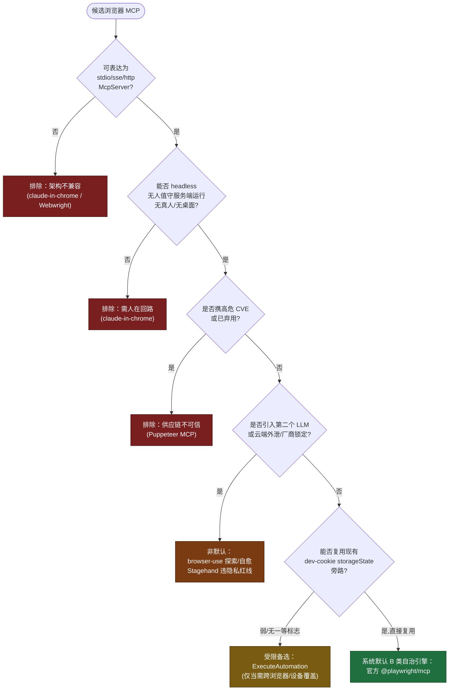

# 浏览器操作 MCP 调研：选型论证与横向盘点

> **摘要 / 导言**：本报告面向一个明确的工程命题——为 Negentropy（一核五翼平台）选择一款浏览器操作 MCP，**内置为全系统默认配备**，并用于**所有 Routine 任务运行时的浏览器实机回归验证**。评估锚定本项目两类真实执行上下文：(1) 6 个 ADK Agent 经 `ActionFaculty.invoke_claude_code` 调用 Claude Code（无直接 ADK→MCP 桥）；(2) Routine 任务 = 自治后台 Claude Code 子进程（**无真人、无桌面浏览器、headless**）。二者经**同一** `builtin_tools(claude_code).config.mcp_config` 注入点喂入 MCP——这意味着默认 MCP 必须能表达为 `McpServer`（stdio/sse/http）、能无人值守 headless 运行，并能复用本仓既有的 dev-cookie 鉴权旁路。结论：采用 **Microsoft 官方 `@playwright/mcp`**；落地方案见 [浏览器操作 MCP 集成方案](../concepts/design/browser-automation-mcp-integration.md)。本文遵循 [AGENTS.md](../../AGENTS.md) 的循证要求，引用格式遵 [reference-specifications.md](../.agents/reference-specifications.md)。

---

## 1. 背景与评估目标

Negentropy 的 [浏览器实机验证协议](../.agents/browser-validation.md) 已确立"Agent 不得自行完成/绕过 OAuth、登录态须来源于真实用户"的核心不变量，并已在 `negentropy-ui` 集成 Playwright E2E（含 dev-cookie 旁路）。但平台**尚未**把任何浏览器操作 MCP 作为系统级默认能力内置——Routine 自治任务在运行时拿不到浏览器工具，无法对其刚刚改动的 Web 产物做"实机回归验证"。

选型须同时满足三项**硬约束**（源自上述两类执行上下文）：

1. **可表达为 `McpServer`**：能以 stdio（command/args/env）或 sse/http（url/headers）形态注入 [`builtin_tools(claude_code).config.mcp_config`](../../apps/negentropy/src/negentropy/engine/schedulers/handlers/claude_code.py)（→ CLI `--mcp-config` / SDK `options.mcp_servers`）。
2. **无人值守 headless 运行**：Routine 是后台 Claude Code 子进程，无真人、无桌面浏览器，不可依赖 OAuth 同意屏/CAPTCHA 的人工介入。
3. **复用既有 dev-cookie 鉴权旁路**：鉴权回归 negentropy-ui 时，应能复用 [playwright.config.ts](../../apps/negentropy-ui/playwright.config.ts) 已验证的自签 `ne_sso` storageState，而非模拟 IdP 登录。

## 2. 候选盘点

针对"自治 Routine 浏览器实机回归验证 + 全系统默认 MCP"这一选型目标，本节逐一盘点五类候选，聚焦其本质定位与对上述硬约束的命中度。

**Playwright MCP（`@playwright/mcp`）**[[1]](#ref1) 由 Microsoft 官方维护（仓库 `microsoft/playwright-mcp`，作者为 Playwright 核心维护者 yury-s、pavelfeldman），Apache-2.0 许可。它是一个标准 MCP 服务，可经 `npx @playwright/mcp@latest` 以 stdio 启动，或以 `--port` 暴露 HTTP/streamable 端点，二者均可直接表达为本项目的 `McpServer`。其决定性优势在于**完全无人值守的 headless 服务端运行**：`--headless` 启动无 GUI 的 Chromium，官方 `mcr.microsoft.com/playwright/mcp` 容器镜像即为此场景而生，无需 OAuth 同意屏、CAPTCHA、扩展或真实用户登录态——浏览器由 MCP 服务进程自身拉起并驱动。鉴权经 `--isolated --storage-state=<state.json>` 以非交互方式注入预置 cookie/localStorage，与 negentropy-ui 现有 dev-cookie storageState 旁路一一对应。它暴露约 22 个核心工具并以 `--caps` 按需开启扩展能力组，最新版本 v0.0.75（2026-05），由拥有 Playwright 本体的团队首方背书，弃坑风险在所有候选中最低。其主要成本杠杆是每步 a11y 快照（`browser_snapshot`）的 Token 膨胀，以及"非确定性"——MCP 驱动的回归是 AI 探索式的，而非确定性 PASS/FAIL 闸门。

**chrome-devtools-mcp**[[2]](#ref2) 由 Google / Chrome DevTools 团队维护，Apache-2.0，原生 stdio（`npx -y chrome-devtools-mcp@latest`），可直接表达为 `McpServer`。它**能**经 `--headless --isolated` 或沙箱推荐的 `--remote-debugging-port` + `--browser-url` 路径无人值守 headless 运行（注意：`--autoConnect` 需真人在 `chrome://inspect` 点击"Allow"，属交互 A 类，不可用于 Routine）。其强项是深度 DevTools 内省（网络、控制台、性能 Trace、堆快照、Lighthouse），且基于 2026 年某结账流程基准，单任务 Token 较 Playwright MCP 低约 78%[[6]](#ref6)。但对本项目的**致命短板是无 storageState 机制**：会话/登录态完全绑定 Chrome 的 user-data-dir，现有 dev-cookie storageState 旁路无法迁移，`--isolated` 的 Routine 会话恒为登出态；获取鉴权会话只能预烘焙真实 profile 或脚本注入 cookie，与 [browser-validation.md](../.agents/browser-validation.md) 红线冲突。它本质是调试/内省工具，而非断言优先的 E2E 驱动器。

**claude-in-chrome**[[3]](#ref3) 为 Anthropic 首方的 Chrome 扩展集成（扩展 ID `fcoeoabgfenejglbffodgkkbkcdhcgfn`），经 `claude --chrome` 或 `/chrome` 启用，工具出现在内部 `claude-in-chrome` 命名空间下。它**并非** pip/pnpm/npx 包，**无法**经 mcp_config 注入——它是 native messaging 桥接，不是 stdio/sse/http server，无法表达为 `command/url` server。它**绝对无法** headless 无人值守运行：需要可见的桌面 Chrome/Edge 窗口，遇登录页/CAPTCHA 会暂停等待真人，MV3 service worker 空闲时会静默断连，且账号级竞争消费路由无设备锁定。其真正强项——零摩擦复用用户真实已认证桌面会话——恰恰是 Routine 所禁止的人在回路。

**Webwright（`microsoft/Webwright`）**[[4]](#ref4) 为 Microsoft Research（AI Frontiers）于 2026-05 发布的 MIT 许可浏览器 **Agent 框架**（注意与无关同名项目 MittaAI/webwright 区分），**并非 MCP 服务**。它给编码 LLM 一个终端来编写/运行/丢弃 Playwright-Chromium 脚本，以自反思裁判门控"完成"，以插件/Skill 形态供 Claude Code/Codex 等宿主消费——刻意回避 MCP。对本项目它两头不靠：作为"全系统默认 MCP"它架构上不合格（不暴露任何 stdio/sse/http server）；作为自治 Routine 回归引擎它同样欠佳（无会话/storageState 复用、仅 Chromium、在已自治的 Routine 子进程之上再叠一层 Token 重、非确定性的嵌套 LLM 循环、执行任意 LLM 生成代码构成 RCE 级面）。至多可作开发期辅助，用于"撰写"一份随后提交并经现有确定性 Playwright 管道运行的脚本。

**其他生态（Stagehand/Browserbase MCP、browser-use MCP、ExecuteAutomation playwright-mcp、已弃用的 Puppeteer MCP）** 四者均可表达为 stdio/sse/http `McpServer`，但自治适配度分化显著。**ExecuteAutomation playwright-mcp**（MIT，社区单维护者）是唯一真正 Routine-fit 的备选：自包含、无内嵌 LLM、确定性工具面，且额外覆盖 Firefox/WebKit + 143 个设备模拟预置；短板是 storageState 支持较弱（无复用现有 dev-cookie 文件的一等公民标志）与单维护者供应链风险。**browser-use**（headless 默认开启）虽能无人值守，但其价值在于非确定性的 `retry_with_browser_use_agent`，并在 Claude Code 之下注入**第二个 LLM + API 账单**，侵蚀确定性回归。**Stagehand/Browserbase** 要求付费第三方**云端**浏览器 + 第二个 LLM + 会话/鉴权态外泄至厂商，直接违反 Negentropy 隐私红线。**Puppeteer MCP** 已弃用、停止维护、携高危 SDK CVE（ReDoS、无 DNS 重绑定防护、无 URL 白名单），应直接排除。

## 3. 横向决策矩阵

| 维度 | Playwright MCP（官方） | chrome-devtools-mcp | claude-in-chrome | Webwright | ExecuteAutomation | browser-use | Stagehand/Browserbase | Puppeteer MCP |
|---|---|---|---|---|---|---|---|---|
| **传输** | stdio / http(streamable) ✅ | stdio ✅；http 需外置 mcp-proxy | native messaging（**非** MCP server）❌ | **无**（插件/Skill，非 MCP）❌ | stdio / http / sse ✅ | stdio ✅ | stdio / SHTTP ✅ | stdio（已弃用） |
| **自治/headless** | ✅ 完全无人值守（`--headless` + 官方容器） | ✅ 经 `--headless --isolated`（`--autoConnect` 需真人，属 A 类） | ❌ 必须可见桌面浏览器 + 真人 | ⚠️ 原则可行，但无 headless 服务文档/守护模式 | ✅ 自包含 headless 服务端 | ✅ headless 默认开启 | ✅ 但浏览器跑在云端非本地 | ⚠️ 技术可行但弃用 |
| **鉴权与会话复用** | ✅ `--storage-state` 直复用 dev-cookie 旁路 | ❌ 无 storageState；isolated 恒登出 | ✅ 复用真实桌面会话（但人在回路） | ❌ 无会话复用（一次性丢弃） | ⚠️ 有 session ID，无一等 storageState 标志 | ⚠️ 可指向 Chrome profile，无 storageState 标志 | ⚠️ 云端 context，需上传 cookie（外泄风险） | ❌ 已弃用 |
| **Token 成本** | 中-偏高（a11y 快照可膨胀，`--caps` 可控） | 工具定义高（~18K，`--slim` 降至 3 工具）；单任务较低（~78%↓） | 最省（工具定义 ~7.7%，定向响应） | 高（自身即 LLM 循环，含第二层 Token） | ~官方持平（无内嵌 LLM，截图偏重） | 高（内嵌第二个 LLM + 第二份账单） | 高（内嵌第二个 LLM） | 低（但不可用） |
| **浏览器覆盖** | Chromium/Firefox/WebKit/Edge（容器仅 headless Chromium） | **仅 Chrome** | **仅 Chrome/Edge 桌面** | **仅 Chromium** | Chromium/Firefox/WebKit + 143 设备预置 | 仅 Chromium | Chromium 类云端浏览器 | 仅 Chromium |
| **CI 适配** | ✅ 最佳（官方 Docker、`--headless --no-sandbox --port`） | ⚠️ 可行但定位于调试而非 E2E 闸门；需镜像内置 Chrome | ❌ 不适用（需真人 + 桌面） | ❌ 无 CI/部署指南 | ✅ 良好（自包含、localhost、MIT） | ⚠️ 可运行但每次需第二 LLM 密钥、非确定性 | ⚠️ 硬耦合付费云 + 厂商锁定 | ❌ 不适用（弃用 + CVE） |
| **安全模型** | 明确"**非**安全边界"；需禁 `browser_run_code_unsafe`、隔离 HTTP 端口、storageState 视同凭据 | 远程调试端口需绑定 localhost；默认遥测开启需关闭；`evaluate_script` 等价 RCE | 高信任高爆炸半径（注入攻击未缓解成功率 23.6%） | 执行任意 LLM 生成 bash/Python，RCE 级面 | localhost 绑定、无内嵌 LLM，攻击面最小（社区供应链需审） | `DISABLE_SECURITY=true` 脚枪；内嵌 LLM 自主决策爆炸半径大 | 会话/鉴权态外泄第三方云，违隐私红线 | 高危 CVE（ReDoS、无 DNS 重绑定防护） |
| **维护/License** | Apache-2.0；Microsoft 首方；紧贴 Playwright 本体；v0.0.75（2026-05） | Apache-2.0；Google 首方；v1.1.1（2026-05），健康 | 专有（Anthropic）；需付费直连订阅；beta | MIT；MS Research；无 release，研究品 | MIT；社区单维护者；v1.0.10 | 历史 MIT；高动能 OSS | Apache-2.0；Browserbase 厂商；v3.0.0 | MIT；**已弃用** |
| **工具面** | ~22 核心 + `--caps`（含 testing verify_* 断言动词） | ~46 工具/11 类（内省导向：网络/控制台/性能/堆/Lighthouse） | ~16 工具（导航/交互/多标签/调试，运行时 `/mcp` 探查） | 代码编写原语（非固定 click/type MCP 工具） | ~30+ 确定性工具 + 设备模拟 | ~14 工具（含自治 agent 回退） | 6 个 NL 驱动工具（act/observe/extract/agent） | 5 个（已弃用） |

## 4. 结合本项目的选型分析

本项目两类执行上下文经**同一** `builtin_tools(claude_code).config.mcp_config` 注入点喂入 MCP，因此默认 MCP 一旦确立即为全系统统一能力。下文先将各候选映射到两类上下文，再给出结论。

### 4.1 映射到两类执行上下文

**上下文 (1)：6 个 ADK Agent 经 `ActionFaculty.invoke_claude_code` 调 Claude Code。** 由于无直接 ADK→MCP 桥，Agent 只能继承在共享注入点喂入的 MCP。Playwright MCP 作为标准 stdio/http server 在此干净落位，从单一注入点对全部上下文统一可用——正是"全系统默认 MCP"的目标形态。ExecuteAutomation 同为协议兼容、可暴露；但 browser-use 与 Stagehand 会向**每个** Agent 的工具面注入第二个自治 LLM 与外部密钥，造成跨 6 Agent 的 Token/成本放大与注入爆炸半径，不宜常驻默认；Stagehand 更额外强加云依赖与鉴权态外泄，全局违隐私红线。claude-in-chrome 与 Webwright 无法经 mcp_config 注入，故无法成为 Agent 的统一默认能力。

> **完备性校正（已在本次集成中闭合）**：源码核验显示，6 ADK Agent 的会话态键 `claude_code_config['mcp_config']` 在基线代码中**从未被写入**，即 Agent 侧 mcp_config 原为 `None`——这意味着不修复时"全系统默认"事实上仅覆盖 Routine/Scheduler。[集成方案](../concepts/design/browser-automation-mcp-integration.md) 的"6 Agents 缺口修复"（`invoke_claude_code` 在 session state 缺省时回退 `_load_claude_code_defaults()`）已闭合该缺口，使三入口统一于单一事实源。

**上下文 (2)：Routine 任务 = 自治后台 Claude Code 子进程（无真人、无桌面浏览器、headless）。** 这是硬约束最严苛的场景。Playwright MCP 满足全部硬约束：(a) 可表达为 command/args stdio server，经 `mcp_config` 注入；(b) `--headless` + 官方容器实现无人值守服务端运行，无桌面浏览器；(c) `--isolated --storage-state=<dev-cookie.json>` 复用 negentropy-ui 已验证的 dev-cookie storageState 旁路。chrome-devtools-mcp 机制上可 headless，但**无 storageState 即无法迁移 dev-cookie**，鉴权回归受阻；claude-in-chrome 物理上不能 headless；Webwright 在已自治的 Routine 之上再叠 LLM 循环且无会话复用；ExecuteAutomation 可 headless 但 storageState 人机工程较弱；browser-use 非确定性且引入第二 LLM；Stagehand 需云端浏览器与外泄；Puppeteer 直接排除。

### 4.2 选型决策流

### 4.3 结论：官方 @playwright/mcp 为系统默认

**采用 Microsoft 官方 `@playwright/mcp` 作为自治 Routine 浏览器实机回归与全系统默认 MCP。** 决策依据：

1. **自治契合**：唯一同时满足"可表达为 `McpServer` + 完全 headless 无人值守 + 复用现有 dev-cookie 旁路"三项硬约束的成熟首方选项。Routine 配置基线：`--headless --isolated --browser chromium --no-sandbox`（鉴权回归再加 `--storage-state=<dev-cookie.json>`），并禁用 `browser_run_code_unsafe`。
2. **回归目的工具**：`--caps=testing` 提供 `browser_verify_element_visible/text_visible/list_visible/value` 等断言动词，可将关键路径钉为半确定性校验，弥补 AI 驱动回归的非确定性。
3. **复用既有 Playwright + dev-cookie**：`--storage-state` 直接消费 negentropy-ui `playwright.config.ts` 已验证的 storageState，无第二个 LLM、无云端外泄、无真实会话强制要求。
4. **协议一致**：stdio/http 形态经单一 `mcp_config` 注入点统一喂入两类上下文，符合单一事实源；与 [browser-validation.md](../.agents/browser-validation.md) 中 claude-in-chrome=交互 A 类、playwright(headless)=自治 B 类的分类一致。

**须诚实纳入的对抗性 caveat（经对抗校验保留）：**

- **官方 README 的 CLI+SKILLS 取向**：Microsoft 自家 README 现已引导编码 Agent 优先选 CLI+SKILLS 而非 MCP，以获约 4–10x Token 效率，仅在"需维持连续浏览器上下文的长时自治工作流"才保留 MCP。Routine 恰是这一被豁免的场景，故结论成立；但须自觉承担权衡——即便非浏览器 Routine 也会拉起 Playwright MCP 子进程并支付工具 schema 的 Token 税。若 Token 压力变得尖锐，Playwright CLI+SKILL 路径是有据可循的逃生通道，不应将 MCP 视为永久终态。
- **会话可靠性衰减**：社区 issue 报告 Playwright MCP 会话在约 15–20 次浏览器交互后随 a11y-tree 状态累积而退化，而 Routine 可运行至 3 小时。缓解：本项目选用的 **stdio 传输**已规避 HTTP `--port` 的 5s-ping 缺陷；Routine 应主动 `browser_close` 释放 context，并依赖 [orchestrator](../../apps/negentropy/src/negentropy/engine/routine/orchestrator.py) 已开启的 Claude Code 自动 compact。
- **鉴权非自动**：钉死的 `--headless --isolated` 启动的是**登出态净室**，对公开 URL 正确；认证态 negentropy-ui 回归**额外**需 `--storage-state=<.auth/dev-admin.json>`。集成文档须显式说明，避免误以为鉴权自动生效。
- **MCP 回归非确定性**：MCP 驱动回归是探索/实现循环驱动器，**非**确定性 PASS/FAIL 闸门。这不否定默认选型（目标是自治实现期的"实机回归验证"，区别于 CI 闸门），但关键断言仍应经 `--caps=testing` 的 `verify_*` 动词或固化进 negentropy-ui `.spec.ts` 确定性路径。应保持"AI 驱动浏览器校验"与"确定性 `.spec` 闸门"为两条互补车道。

**须纳入的事实校正：**

- **dev-cookie 与红线的精确关系**：[browser-validation.md](../.agents/browser-validation.md) 红线禁止的是**跨上下文复制 OAuth/SSO（IdP 绑定）storageState**，**并不**禁止项目自签的 **dev-cookie storageState**——后者经协议明确**许可**用于非 OAuth B 类场景（`apps/negentropy-ui/tests/e2e/dev-cookie.setup.ts`：以与后端共享的 `NE_AUTH_TOKEN_SECRET` 签发 `ne_sso`，写入 `.auth/dev-admin.json`）。故 Playwright MCP `--storage-state` 复用的是**被许可的 dev-cookie 路径**，绝非模拟 IdP 登录。此区分（dev-cookie 许可 / IdP-storageState-复制禁止）是承重的。

**关于 ExecuteAutomation 备选的定位**：它是唯一受认可的跨浏览器/设备 fallback（提供官方容器所缺的 Firefox/WebKit + 设备预置），但 storageState 人机工程较弱且存单维护者供应链风险。仅当确需官方服务所缺的覆盖时按任务范围采用，**不取代** `@playwright/mcp` 默认地位。

## 5. claude-in-chrome 的定位

claude-in-chrome 在本项目中**维持其交互式 A 类开发工具定位，但排除于自治默认之外**。这一判定基于两条相互独立的否决理由，任一即足以排除其作为系统默认 MCP。

**否决理由一（能力）——物理上无法 headless 无人值守。** 它强制要求一个可见、运行中的桌面 Chrome/Edge 窗口，浏览器动作在该窗口实时执行；遇登录页或 CAPTCHA 会**暂停并请真人手动完成**，无任何程序化凭据路径；不支持 WSL，无 headless 模式；MV3 service worker 在长会话中空闲即静默断连，需交互式重连，对长时自治运行是致命的；且注册为账号级竞争消费、无设备锁定——服务端调度任务可能非确定性地劫持开发者本机浏览器。这与 Negentropy Routine 的"无真人/无桌面/headless 子进程"模型直接冲突。

**否决理由二（架构）——无法表达为 `McpServer`。** 它是经 Claude Code `--chrome` 标志启用的 native-messaging 桥接，**不是** stdio/sse/http server，无法以本代码库 `McpServer` 模型（command/args/env 或 url/headers）表达，亦无法经单一共享注入点注入。因此它**永远无法**成为统一的系统默认 MCP。

**为何仍保留为交互 A 类。** 其真正强项——零摩擦复用用户**真实已认证**的桌面会话（无 token、无 cookie 注入、无会话重放），登录态保真度最高——恰是 Routine 所禁止的人在回路能力，却正是某些场景的合法所需：在真人在场、本机运行有效登录态的桌面 Chrome 且启用 `--chrome` 的受监督会话中，对真实认证应用做可视化/认证态校验。故将其保留为 6 ADK Agent 在**人类监督会话**中的 opt-in 交互工具，**绝不**作为 Routine 或系统默认能力。

## 6. 风险与缓解

将 Playwright MCP 作为单一共享注入点的常驻默认，安全加固与运维纪律是**强制项而非可选项**（Microsoft 明确其"**NOT a security boundary**"）。

| 风险 | 表征与影响 | 缓解措施 |
|---|---|---|
| **`npx` / 版本未钉死** | `@latest` 不钉版本，破坏可复现性；自治常驻下版本漂移引入静默行为变化 | 钉死具体版本（本集成钉 v0.0.75）；纳入依赖审计；版本升级走幂等 data-fix 迁移 |
| **浏览器安装** | 容器/CI 需内置浏览器二进制；官方容器仅 headless Chromium；`--browser chromium` 实解析为 `chrome-for-testing` 构建（非通用 `playwright install chromium`） | 预执行 `npx @playwright/mcp@<ver> install-browser chrome-for-testing`；跨浏览器需求另走 ExecuteAutomation |
| **`--no-sandbox`** | 多数容器内必需，但摘除 Chromium 沙箱，扩大攻击面 | 与容器/worktree 隔离配对；限导航至受控的内部/已知 URL；对不可信外链门控 |
| **`browser_run_code_unsafe`（RCE）** | 在服务进程内执行任意 JS，等价 RCE | 默认禁用；选 stdio 传输已规避 HTTP `0.0.0.0:8931` 无鉴权端口风险 |
| **凭据外泄** | storageState/dev-cookie 含实时会话 cookie，等同凭据 | `.gitignore`/`.dockerignore`；视同 secret；绝不在 CI 挂真实账号态 |
| **每运行子进程成本** | 非浏览器 Routine 也拉起子进程，支付工具 schema Token 税 | `--caps` 最小化工具面；Token 尖锐时切 Playwright CLI+SKILL 逃生通道；个别 Routine 可经 `disallowed_tools` 关闭 |
| **优雅降级** | 浏览器拉起失败/无 GUI 时 Routine 不应硬崩 | 工具失败降级为"跳过浏览器校验 + 显式告警"；与确定性 `.spec` 闸门分置互补车道 |

## 7. 结论与落地指引

综上，**`@playwright/mcp`（stdio · headless · isolated，版本钉死）** 是本项目唯一同时满足三项硬约束的成熟首方选项，采纳为全系统默认浏览器操作 MCP 与 Routine 实机回归引擎；claude-in-chrome 维持交互 A 类定位；chrome-devtools-mcp / ExecuteAutomation 作为按需的诊断/跨浏览器补充。具体的系统集成与使用指引见 **[浏览器操作 MCP 集成方案](../concepts/design/browser-automation-mcp-integration.md)**。

## 参考文献

[1] Microsoft, "Playwright MCP (`@playwright/mcp`)," GitHub repository, 2026. [Online]. Available: https://github.com/microsoft/playwright-mcp

[2] Google Chrome DevTools, "chrome-devtools-mcp: Chrome DevTools for coding agents," GitHub repository, 2026. [Online]. Available: https://github.com/ChromeDevTools/chrome-devtools-mcp

[3] Anthropic, "Use Claude Code with Chrome (beta)," Claude Code Documentation, 2026. [Online]. Available: https://code.claude.com/docs/en/chrome

[4] Microsoft Research, "Webwright," GitHub repository, 2026. [Online]. Available: https://github.com/microsoft/Webwright

[5] S. Kinney, "Runtime Tools Compared: Playwright MCP, Chrome DevTools MCP, and Claude in Chrome," *Self-Testing AI Agents*, 2026. [Online]. Available: https://stevekinney.com/courses/self-testing-ai-agents/runtime-tools-compared

[6] S. Özal, "Browser DevTools MCP: 78% fewer tokens than Playwright MCP," Medium, 2026. [Online]. Available: https://medium.com/@serkan_ozal

[7] Anthropic, "Model Context Protocol Specification," 2026. [Online]. Available: https://modelcontextprotocol.io
