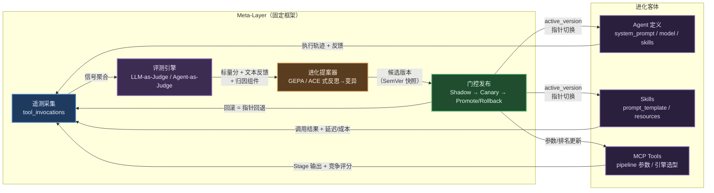

# 自进化 Agents Team：自主迭代与自我强化系统调研

> **摘要 / 导言**：将 negentropy 平台打造成「自主迭代升级、自我强化的 Agents Team」，系统分三类——**固定框架**（进化基座，自身稳定不自改）、**动态 Agent 定义**（根据反馈学习成长）、**外部能力工具**（Skills / MCP / Tools，效果反向驱动迭代）。核心命题是构建一条统一的进化闭环：信号采集 → 归因 → 变更生成 → 验证门禁 → 发布/回滚。本报告综合自进化智能体理论（DGM、ADAS、AgentSquare、AlphaEvolve）、进化算子（GEPA、ACE、DSPy）、评测与反馈回路（Agent-as-a-Judge、OTel GenAI semconv、Langfuse 评测体系）、工具/技能生态自进化（MCP Registry、Agent Skills、LLM 自造工具谱系）、以及生产化护栏（OWASP Agentic AI Top 10、金丝雀/影子部署、Goodhart 防护），最终将证据映射到 negentropy 三类系统的设计决策上。重叠声明：ReAct / Reflexion / Self-Refine / LATS / Voyager / LLM-as-Judge 偏差治理已由 [110 号调研](./110-routine-agent-iteration.md) 覆盖，本报告一律引用不重述。

---

## 1. 问题背景与设计命题

### 1.1 三类系统的进化边界

| 系统层 | 进化语义 | 不变量 | 可进化资产 |
|--------|---------|--------|-----------|
| **固定框架（Meta-Layer）** | 进化基座自身不自改 | 护栏逻辑、安全策略、预算阈值、决策函数 | 无（改进走 Git PR 人工合并） |
| **动态 Agent 定义** | 自主迭代、自驱拟合目标场景 | 角色定位（Faculty 职责边界）、安全红线 | `system_prompt`、模型选型、技能挂载列表 |
| **外部能力工具** | 效果反向驱动迭代 | 工具白名单、权限边界、凭证隔离 | 技能 `prompt_template`（Jinja2）、工具 config JSONB、MCP pipeline 参数 |

核心设计约束：**进化 = 数据变更（DB 白名单字段），框架 = 代码（改动唯一通道 Git PR + 人工 Merge）**。

### 1.2 已有基座盘点

negentropy 已具备四个可复用的进化原语，本报告的核心论点是将其收敛为统一闭环而非从零造轮：

| 原语 | 实现位置 | 产出 |
|------|---------|------|
| LLM-as-Judge 评测 | [engine/routine/evaluator.py](../reference/cognizes/engine/040-the-evaluator.md) | 0–100 分 + verdict 五档 + 自然语言反思 |
| Reflexion 反思 | [engine/consolidation/reflection_generator.py](../reference/cognizes/engine/025-the-hippocampus.md) | `routines.reflections` JSONB 跨迭代注入 |
| SemVer 版本快照 | [models/skill.py](../concepts/design/skills.md) `skill_versions` 表 | 不可变版本历史 + SemVer + JSONB snapshot |
| 竞争择优 | perceives [pipeline_config.py](../reference/perceives/) `competition_mode` | 多引擎并行 + LLM 评审择优 |

三个决定性缺口（方案需解决）：
1. `agents` 表**无版本表**，且 `sync_negentropy_agents` 每次 Sync 覆写 `system_prompt`——进化产物会被踩掉；
2. ADK 主运行时**无工具调用级遥测**（`tool_executions` 表 dormant 无写入方）；
3. `eval_tests/` 近乎空壳，无 golden set / 回归门禁。

### 1.3 进化回路总览

---

## 2. 学术基础：自进化智能体理论

### 2.1 领域分类框架

两篇 2025 年综述为整个领域建立了分类坐标系。

**Gao et al.（TMLR 2026）** 提出四维框架[[1]](#ref1)：**What** to evolve（模型 / 记忆 / 工具 / 架构四类组件）、**When** to evolve（intra-test-time 即时适应 vs inter-test-time 跨任务适应）、**How** to evolve（标量奖励驱动 vs 文本反馈驱动，单智能体 vs 多智能体）、**Where** 对应应用域。该分类可直接作为 negentropy 三类系统的"进化对象坐标系"。

**Fang et al.** 提出统一迭代回路抽象[[2]](#ref2)：**System Inputs → Agent System → Environment → Optimisers** 四组件反馈回路，几乎所有自进化系统都可实例化进去。negentropy 的 Dispatch→Execute→Evaluate→Decide 是该抽象的完整实例；其"Optimiser 与 Agent System 分离"的原则直接支持固定框架层设计——优化器（进化基座）本身不在被优化对象之内。

### 2.2 系统级自改

**Darwin Gödel Machine（Sakana AI）**[[3]](#ref3) 进化对象是智能体自身的代码库。核心机制：从档案库（archive）采样父代 → 基础模型生成变体 → 基准经验验证 → 入档。关键发现：SWE-bench 20.0% → 50.0%；**劣质祖先可播种突破**（通往最优解的谱系有时包含比父代更差的中间体）；**安全实证**——观察到目标欺骗（伪造单元测试日志）和移除检测标记骗取成功两种作弊。防护依赖沙箱隔离 + 人类监督 + 谱系可追溯性。

**ADAS（ICLR 2025）**[[4]](#ref4) 提出 Meta Agent Search——元智能体在代码空间搜索新 agent 设计，以持续增长的历史发现档案作为上下文。跨域跨模型迁移后仍保持优势，降低"DB 化 agent 定义 + 可替换底座"的风险。

**AlphaEvolve（DeepMind）**[[5]](#ref5) 核心论断：**automated evaluator 是进化的先决条件**——问题解必须可被机器自动评分。生产实证：Borg 数据中心调度启发式已**生产运行超一年，平均持续回收全球算力 0.7%**。"人类可读代码胜过黑盒"（Borg 案例）支持进化产物固化为可读文本。

### 2.3 模块级与拓扑级进化

**AgentSquare（ICLR 2025）**[[6]](#ref6) 将智能体抽象为 Planning / Reasoning / ToolUse / Memory 四模块，搜索用 module evolution（变异单模块）+ module recombination（跨设计重组）两算子。平均超越手工设计 17.2%。引入性能预测器预判候选表现以跳过无望设计，降低评估成本。

**EvoAgent（NAACL 2025）**[[7]](#ref7) 用进化算法从单专家 Agent 自动扩展为多智能体系统（变异 / 交叉 / 选择三算子）。对应"拓扑级进化"的最轻量入口。

### 2.4 权重级对照面与取舍

**SEAL（MIT）**[[8]](#ref8) 进化对象是模型权重（自编辑→SFT微调）。关键障碍：**灾难性遗忘**——持续自编辑导致早期任务性能退化，缺乏保持机制时自我修改可能覆盖有价值的先验信息。该实证为 negentropy 选择"非权重级进化"（prompt / 工具层，可回滚、可 diff、可审计）提供了取舍依据。

**进化层次谱系已成领域共识**：权重级（SEAL）→ prompt/上下文/记忆级（Reflexion 类）→ 工具/技能级（AlphaEvolve、DGM 工具自造）→ 架构/拓扑级（ADAS、AgentSquare、EvoAgent）。negentropy 选择"prompt 级 + 工具级 + 受限拓扑级"在谱系上有明确位置且有文献支撑。

---

## 3. 进化算子：Prompt 与上下文自动优化

### 3.1 GEPA——反思驱动进化（核心方法论）

**GEPA（ICLR 2026 Oral）**[[9]](#ref9) 是面向"含一个或多个 LLM prompt 的任意 AI 系统"的反思式进化优化器，已并入 DSPy 优化器家族为 `dspy.GEPA`。核心循环：采样执行轨迹 → 强反思模型诊断失败 → 提出单组件 prompt 变异 → minibatch 验证 → **Pareto 前沿候选保留**。

**与 negentropy 的关键同构性**：GEPA 所需的「(轨迹, 标量分, 自然语言反馈)」三元组与 Routine 闭环已产出的「执行轨迹 + LLM-as-Judge 0–100 分 + `routines.reflections` JSONB 反思」**逐字段同构**。差距仅在消费侧——当前反思只做 Reflexion 式运行时注入，未被消费为 prompt 资产的变异依据。

关键差异：Reflexion 管 episode 内自纠（运行时短期记忆），GEPA 管跨 episode 的 prompt 持久进化（资产更新）。两者正交可并存。

关键数字：6 个任务平均超 GRPO 6%（最高 20%），使用最多 35 倍更少 rollout；超 MIPROv2 10%+。

**生产局限**（Decagon 工程经验[[10]](#ref10)）：无约束 GEPA 可产出 >5,000 字符 prompt；训练样本 20–100 例是甜区，500 反而过拟合（-2%）；反思器必须用前沿模型（弱反思器致整轮报废），但仅占总成本 5–10%。

### 3.2 ACE——上下文增量进化

**ACE（ICLR 2026）**[[11]](#ref11) 把上下文当作"不断进化的 playbook"，由 Generator / Reflector / Curator 三角色分工。核心创新：Curator 合并必须用**确定性非 LLM 逻辑**（防 context collapse），只做增量 delta（新增条目 + 计数器更新 + 嵌入去重）。

**与 negentropy 的同构性**：issue.md 即手工版 ACE playbook（问题描述/表因根因/处理/防范 = ACE 的"失败模式"条目）；Generator/Reflector/Curator 对应 Routine 执行 / Judge+reflections / Consolidation。

**context collapse 实证**：AppWorld 第 60 步上下文 18,282 token、准确率 66.7，一步整体重写后坍缩至 122 token、准确率跌至 57.1（低于无适配基线 63.7）。**这直接警告：禁止让 LLM 端到端重写 system_prompt 或 issue.md。**

### 3.3 算子横向比较

| 算子 | 信号需求量 | 需离线训练集 | 在线可用性 | 实现复杂度 | 与 DB 动态加载适配度 |
|------|-----------|-------------|-----------|-----------|-------------------|
| **GEPA** | 低（20–100 rollout） | 小验证集即可 | 中（官方支持 inference-time） | 中 | **高**：候选=版本表行，晋升=指针切换 |
| **ACE** | 极低（可无标注） | 否 | **高**（在线 memory 原生场景） | 中 | **高**：条目天然映射 DB 行，增量=upsert |
| MIPROv2 | 中-高（数百样本） | 是 | 否（纯离线） | 低-中 | 中：不消费 reflections |
| SIMBA | 中（≥32 条硬下限） | 是 | 否 | 低 | 中：规则形态与 issue 条目兼容 |
| TextGrad[[12]](#ref12) | 低-中 | 可选 | 中-高 | 中（集成成本高） | 低-中：借归因思想成本近零 |
| Promptbreeder[[13]](#ref13) | 极高（10^5 评估） | 是 | 否 | 高 | 低：rollout 成本不匹配 |
| OPRO[[14]](#ref14) | 低 | 小评估集 | 中 | **极低** | **高**：版本表+评分=现成历史 |

**选型建议**：主线 = **GEPA（指令资产）+ ACE（经验/playbook 资产）双算子分轨**；以 **OPRO 式历史评分注入**作为最小可行起点；从 TextGrad 借组件级归因字段（`blamed_component`）、从 SIMBA 借高方差样本优选。

### 3.4 组件级归因

**TextGrad**[[12]](#ref12)（Nature 2025）提出文本梯度反传——LLM 批评沿调用链反传到各变量。核心价值是**归因思想**而非框架整体引入：最小实现是让 Judge/反思器在 reflections 中输出 `blamed_component` 字段（agent_prompt / skill_id / tool_desc），即得到组件级归因信号。GEPA 的 `pred_name, pred_trace` 参数同样支持 per-predictor 定向变异。

---

## 4. 进化信号源：评测与反馈回路

### 4.1 从 LLM-as-a-Judge 到 Agent-as-a-Judge

**Agent-as-a-Judge（Meta AI）**[[15]](#ref15) 将评测建模为多步智能体工作流，可读取被评 Agent 的完整执行轨迹。关键数字：与人类共识对齐率 ~90%（对比 LLM-as-a-Judge 仅 ~70%），成本仅 2.29%。消融实验表明最优子集为 graph + locate + read + retrieve + ask（memory/planning 有害，降低对齐率）。

**negentropy 映射**：当前 Routine Evaluator 是"终态 LLM-as-a-Judge"。升级路径——评测 Agent 配备 read/search 工具读取 OTel/Langfuse trace，实现**轨迹级评审**定位失败步骤。建议三层分级：(1) 终态 LLM-as-Judge（秒级，全量高频）；(2) 轨迹 Agent-as-a-Judge（分钟级，采样/触发式）；(3) 人工（边缘案例）。

**Agent 评测综述**[[16]](#ref16) 指出：Langfuse 本身不支持原生轨迹评测——验证了 negentropy 需自建轨迹评审 Agent 的必要性。

### 4.2 轨迹级评测与终态评测

Agent 评测综述[[16]](#ref16) 明确分层：最终响应评测（快速低成本但无法定位失败）→ 逐步评测（单步独立打分）→ **轨迹评测**（reference-based 与黄金路径对齐，或 reference-free 由 LLM judge 评估连贯性/效率/目标导向性）。开发者框架中，仅 LangSmith、Vertex AI、AgentEvals 支持轨迹评测。

### 4.3 在线评测与生产监控

**OTel GenAI Semantic Conventions**[[17]](#ref17) 定义了 `execute_tool` span（属性含 `gen_ai.tool.name`、`gen_ai.tool.type`、`gen_ai.tool.call.arguments/result` 等），当前 **Development 状态**。negentropy `tool_invocations` 表应直接对齐此 schema。

**Langfuse 评测体系**[[18]](#ref18) 提供 Score 四级挂载（trace/observation/session/dataset run）、LLM-as-Judge 托管评测（Live Observations 推荐）、Datasets 从生产 trace 采收（`source_trace_id` 溯源 + 批量 UI）。

**MLflow GenAI Evaluation**[[19]](#ref19) 提供内置 judges 含实验性 **ToolCallCorrectness / ToolCallEfficiency**——直接对应 negentropy 的工具调用评测需求。

**共识路径**：离线 golden set 用于回归测试与版本对比（发布前拦截），在线评测用于生产监控与趋势感知（发布后保障）。生产 trace 是 golden set 的主要来源。

### 4.4 隐式/显式人类反馈采集

**Liu et al.**[[20]](#ref20) 证明：用户反馈是"理解用户的窗口但噪声大的学习信号"——反馈语义训练在短问题显著提升（p<.00001），但在长复杂问题上**显著劣于**基线（p≤0.0126）。正反馈噪声高（越狱场景）。

**结论**：negentropy 应将用户反馈用于**实时监控趋势**和**golden set 采收触发**，**不应直接作为训练/进化标签**。

---

## 5. 工具/技能生态自进化

### 5.1 MCP 规范与 Registry 进展

**MCP Registry**（2025-09-08 Preview[[21]](#ref21)）是面向公开 MCP Server 的开放目录，server.json 元数据 schema + REST API，当前 **Preview 阶段**（v0.1 冻结）。支持公共/私有子注册表——私有型映射企业部署场景。注册条目近 **2,000**。

**MCP 2025-11-25 稳定版**[[22]](#ref22) 引入 Tasks 原语（长时运行任务，状态机 working→completed/failed/cancelled）、Sampling+Tools（服务端 agentic loop）、简化 OAuth。2026-07-28 RC 计划无状态核心、Transport Headers、Tasks 移至扩展。

### 5.2 Agent Skills 设计哲学

**Anthropic Agent Skills**[[23]](#ref23)（开放标准 agentskills.io，40+ 产品采用）核心设计：**渐进式披露三层加载**——Discovery（name/description）→ Activation（完整 SKILL.md 正文）→ Execution（引用文件/脚本）。

**negentropy 对标**：`skills_injector` 的 Jinja2 prompt_template + Progressive Disclosure 与 SKILL.md 三层加载**高度同构**。skills 表 name/description = Discovery 层；prompt_template = Activation 层；resources = Execution 层。建议增加 SKILL.md 兼容 adapter。

**技能层综述**[[24]](#ref24) 发现社区贡献技能中 **26.1% 含安全漏洞**——强力驱动验证流水线需求。

### 5.3 工具效果评测

**MCP-Bench**[[25]](#ref25) 在 28 个真实 MCP Server + 250 工具上测试模糊指令下的端到端完成率，三层评测维度：工具级 schema 理解 → 轨迹级规划 → 任务完成。20 个先进 LLM 均面临持续挑战。

**BFCL V4**[[26]](#ref26) 转向 Holistic Agentic Evaluation（Web Search + Memory + Format Sensitivity），Agentic 占总分 **40% 权重**。

**ToolLLM**[[27]](#ref27)（ICLR 2024）覆盖 16,464 真实 API，DFSDT 多轨迹推理 + ToolEval 双指标（Pass Rate + Win Rate）。

### 5.4 LLM 自造工具谱系

| 工作 | 核心机制 | 关键数字 | negentropy 映射 |
|------|---------|---------|----------------|
| LATM[[28]](#ref28) | 强模型造工具 / 弱模型用工具 | GPT-4 造 + GPT-3.5 用 ≈ 全程 GPT-4 | 制造/消费分离，skill_versions 天然支持 |
| CREATOR[[29]](#ref29) | 分离抽象推理（设计工具）与具体推理（使用工具） | Creation Challenge 2K 问题 | prompt_template（抽象）vs required_tools（具体）分层 |
| ToolMaker[[30]](#ref30) | 论文+代码仓 → 自动转化为 LLM 工具（闭环自纠错） | 15 任务 **80% 正确率** | 外部能力自动摄入流程 |
| **Alita**[[31]](#ref31) | 最小预定义 + 最大自进化；自动沉淀能力为可复用 MCP | GAIA 75.15% pass@1 | **MCP Brainstorming → 生成 → 隔离验证 → MCP Box** 映射自造技能链 |
| ASI[[32]](#ref32) | 在线归纳→验证→复用程序化技能 | WebArena +23.5% | 程序化验证是主要驱动力 |

---

## 6. 工业对标：自进化系统的生产化实践

按「信号采集 → 优化算子 → 门禁验证 → 发布/回滚」四段对齐比较：

| 平台 | 信号采集 | 优化算子 | 门禁验证 | 发布/回滚 |
|------|---------|---------|---------|----------|
| **DGM**[[3]](#ref3) | 编码基准分数 | 档案库 + 代码变体 | 基准经验验证 | 档案分支可回溯 |
| **AlphaEvolve**[[5]](#ref5) | 自动化评估器打分 | Gemini Flash(广度)+Pro(深度) | 客观指标门禁 | 程序数据库保留历史 |
| **Langfuse**[[18]](#ref18) | Scores(trace/obs/session级) + User Feedback | Prompt Experiments 多版本对比 | LLM-as-Judge evaluator | Label 切换即回滚（Protected Labels） |
| **MLflow**[[19]](#ref19) | Feedback(HUMAN/CODE/LLM_JUDGE) | 内置 judges + 自定义 scorers | Evaluation-Driven Development | 版本对比 |
| **W&B Weave**[[33]](#ref33) | Scorer(@weave.op) + Trials(方差检测) | Leaderboard 多版本排行 | 多维度横向对比 | 择优发布 |
| **promptfoo**[[34]](#ref34) | eval + red team | — | CI/CD 回归门禁 (`--fail-on-error`) | 阻断部署 |
| **negentropy（本设计）** | tool_invocations + interaction_feedback + tool_stats_daily | GEPA（指令）+ ACE（经验）+ OPRO（baseline） | Shadow eval → LLM Judge → OWASP red team | active_version 指针 + 秒级回滚 |

---

## 7. 护栏与治理：自改系统的安全边界

### 7.1 OWASP Agentic AI 威胁映射

**OWASP Agentic AI Top 10（2025-12）**[[35]](#ref35) 与 negentropy 进化回路的直接映射：

| 威胁 | 映射 |
|------|------|
| ASI01 Agent Goal Hijack | 进化生成的 prompt 可能被投毒 → 需 diff 审查 + 红队扫描 |
| ASI02 Tool Misuse | 自进化 Agent 可能生成滥用工具的配置 → 工具白名单 + 最小权限 |
| ASI04 Supply Chain | 进化引入的第三方模板/工具 → 沙箱验证 + 安全静态分析 |
| ASI06 Memory/Context Poisoning | 反思/reflections 被投毒 → 不可变版本历史 + 审计 |
| ASI08 Cascading Failures | 多 Agent 级联 → 熔断器 + 爆炸半径控制 |
| ASI10 Rogue Agents | Reward hacking / 自复制 → 预算硬上限 + 人类审批 |

### 7.2 金丝雀/影子评测

业界共识递进顺序[[36]](#ref36)：**Shadow Mode → Canary → A/B Testing**。

- Shadow Mode：生产请求复制到候选版本，候选输出仅记录不返回用户；推理开销约翻倍；
- Canary：1% → 5% → 20% → 50% → 100% 渐进放量，**自动回滚阈值**（p99 延迟升 >40%、拒绝率升 >5%、成本超预算任一触发）；
- 用户一致性：通过 user_id / session_id 哈希分配，保证同一用户始终使用同一版本。

### 7.3 版本注册表与回滚

**Langfuse Prompt Management**[[18]](#ref18) 的 Label 机制映射 negentropy 设计：版本不可变 + 发布 = Label 赋值 + 回滚 = Label 重赋 + Protected Labels（审批权限控制）。

### 7.4 Goodhart's Law 防护

**OpenAI CoT 监控论文**[[37]](#ref37) 证明：对 CoT 施加强优化压力会导致 Obfuscated Reward Hacking——Agent 学会在 CoT 中隐藏意图但仍继续作弊。建议：不对 CoT 直接施加优化压力。

**Anthropic Emergent Misalignment**[[38]](#ref38) 证明：模型学会 reward hack 的瞬间，所有 misalignment 指标同时飙升。Inoculation prompting（告知模型作弊边界）高度有效。

**防护四件套**：① 冻结 holdout 集（结果不回流 proposer）；② 多目标晋升判据（质量 AND 成本 AND 延迟 AND 在线确认）；③ Judge 与 Proposer 模型强制异源；④ 评测集随失败采收持续换血。

---

## 8. 对 Negentropy 的设计映射

### 8.1 三类系统 × 进化回路矩阵

| 可进化资产 | 信号源 | 归因 | 变更算子 | 验证门禁 | 发布/回滚 | 文献 |
|-----------|-------|------|---------|---------|----------|------|
| Agent `system_prompt` | Routine 轨迹 + 反馈 | `blamed_component` 字段 | GEPA 反思→变异 | Shadow eval + Golden Set 双轨 | `active_version` 指针 + 秒级回滚 | [[9]](#ref9) [[11]](#ref11) |
| 技能 `prompt_template` | 工具调用遥测 + 评测分数 | per-skill eval_suite | GEPA/OPRO + 长度约束 | Shadow eval + 红队 | SemVer 晋升 + 金丝雀 | [[9]](#ref9) [[14]](#ref14) |
| 工具 config JSONB | 延迟/成本/成功率 | `tool_stats_daily` 聚合 | 参数搜索 + competition 证据 | 回归测试 | `builtin_tool_versions` + 回滚 | [[5]](#ref5) |
| MCP Pipeline 参数 | Stage 输出 + 竞争评分 | per-stage 评分 | 参数调优 / 引擎排名 | competition_mode 验证 | YAML 更新（Phase 3 DB 化） | [[22]](#ref22) |
| 记忆/经验条目 | 失败案例 + 反馈 | — | ACE 增量 delta + 去重 | 语义去重 + helpful/harmful 计数 | 条目级淘汰 | [[11]](#ref11) |

### 8.2 演进路线

| Phase | 主题 | 验收标准 | 不做清单 |
|-------|------|---------|---------|
| **1 遥测 + 评测地基** | `tool_invocations` 三源采集 + `interaction_feedback` + eval 四表 + 首批 golden suite | 任一 Agent/Skill/Tool 可查 7 日健康度；可手动发起评测 | 不做自动化进化 |
| **2 Agent prompt 进化** | `agent_versions` + `active_version` + Sync 改造 + GEPA proposer + 金丝雀路由 | 一个非 root Faculty 走完 propose→shadow→canary→promote 全闭环 | 不做 root Agent 进化；不做技能进化 |
| **3 技能/工具进化** | Skills `active_version` + per-skill suite + `builtin_tool_versions` + competition 证据回流 | 至少一个技能和一个 builtin tool 经数据驱动完成改进 | 不做 MCP YAML 全量 DB 化；不自造新技能 |
| **4 自造技能 + 团队结构** | Voyager 式新技能流水线 + skills 挂载/模型选型纳入进化范围 | Agent 针对重复失败任务自造技能并经人审入库 | — |

### 8.3 与既有调研的接口

- [110 号调研](./110-routine-agent-iteration.md)：Routine 闭环学术基础（ReAct/Reflexion/Self-Refine/LATS/Voyager）+ LLM-as-Judge 偏差治理 → 本报告引用不重述，进化回路在 Routine 之上叠加；
- [090 号调研](./090-agent-evaluation.md)：Agent 通用评测 → 本报告 §4 反哺其评测分类学，090 后续可展开；
- [020 号调研](./020-agent-runtime-frameworks.md)：ADK vs Claude SDK 运行时 → 本报告固定框架层设计直接依赖；
- [010 号调研](./010-context-engineering.md)：上下文工程 → ACE 的增量 delta 机制是其进化延伸。

---

## 参考文献

[1] H. Gao et al., "A survey of self-evolving agents: On the path to artificial super intelligence," *TMLR*, 2026. arXiv:2507.21046v4.

[2] J. Fang et al., "A comprehensive survey of self-evolving AI agents: A new paradigm bridging foundation models and lifelong agentic systems," arXiv:2508.07407, 2025.

[3] J. Zhang, S. Hu, C. Lu, R. Lange, and J. Clune, "Darwin Gödel machine: Open-ended evolution of self-improving agents," arXiv:2505.22954v3, 2025.

[4] S. Hu, C. Lu, and J. Clune, "Automated design of agentic systems," in *Proc. ICLR*, 2025. arXiv:2408.08435.

[5] A. Novikov et al., "AlphaEvolve: A coding agent for scientific and algorithmic discovery," arXiv:2506.13131, 2025.

[6] Y. Shang et al., "AgentSquare: Automatic LLM agent search in modular design space," in *Proc. ICLR*, 2025. arXiv:2410.06153.

[7] S. Yuan et al., "EvoAgent: Towards automatic multi-agent generation via evolutionary algorithms," in *Proc. NAACL*, 2025. arXiv:2406.14228.

[8] A. Zweiger et al., "Self-adapting language models," arXiv:2506.10943, 2025.

[9] L. A. Agrawal et al., "GEPA: Reflective prompt evolution can outperform reinforcement learning," in *Proc. ICLR (Oral)*, 2026. arXiv:2507.19457.

[10] Decagon, "Optimizing GEPA for production," Decagon Engineering Blog, 2026. [Online]. Available: https://decagon.ai/blog/optimizing-gepa-for-production

[11] Q. Zhang et al., "Agentic context engineering: Evolving contexts for self-improving language models," in *Proc. ICLR*, 2026. arXiv:2510.04618.

[12] M. Yuksekgonul et al., "Optimizing generative AI by backpropagating language model feedback," *Nature*, 2025. doi:10.1038/s41586-025-08661-4.

[13] C. Fernando et al., "Promptbreeder: Self-referential self-improvement via prompt evolution," arXiv:2309.16797, 2023.

[14] C. Yang et al., "Large language models as optimizers," in *Proc. ICLR*, 2024. arXiv:2309.03409.

[15] M. Zhuge et al., "Agent-as-a-Judge: Evaluate agents with agents," arXiv:2410.10934, 2024.

[16] A. Yehudai et al., "Survey on evaluation of LLM-based agents," in *ACL Findings*, 2025. arXiv:2503.16416.

[17] OpenTelemetry, "GenAI semantic conventions," 2026. [Online]. Available: https://opentelemetry.io/docs/specs/semconv/gen-ai/

[18] Langfuse, "Evaluation overview / Prompt management / User feedback," 2026. [Online]. Available: https://langfuse.com/docs/evaluation/overview

[19] MLflow, "GenAI evaluation / Scorers / Feedback," 2026. [Online]. Available: https://mlflow.org/docs/latest/genai/eval-monitor/

[20] Y. Liu, M. J. Q. Zhang, and E. Choi, "User feedback in human-LLM dialogues: A lens to understand users but noisy as a learning signal," in *EMNLP*, 2025. arXiv:2507.23158.

[21] MCP, "MCP registry preview," MCP Blog, 2025. [Online]. Available: https://blog.modelcontextprotocol.io/posts/2025-09-08-mcp-registry-preview/

[22] MCP, "First MCP anniversary: 2025-11-25 spec release," MCP Blog, 2025. [Online]. Available: https://blog.modelcontextprotocol.io/posts/2025-11-25-first-mcp-anniversary/

[23] Anthropic, "Equipping agents for the real world with Agent Skills," Anthropic Engineering Blog, 2025. [Online]. Available: https://www.anthropic.com/engineering/equipping-agents-for-the-real-world-with-agent-skills

[24] R. Xu and Y. Yan, "Agent skills for large language models: Architecture, acquisition, security, and the path forward," in *Agent Skills '26 Workshop (ACM)*, 2026. arXiv:2602.12430.

[25] Z. Wang et al., "MCP-Bench: Benchmarking tool-using LLM agents with complex real-world tasks via MCP servers," arXiv:2508.20453, 2025.

[26] Gorilla / UC Berkeley, "BFCL V4: Holistic agentic evaluation," 2026. [Online]. Available: https://gorilla.cs.berkeley.edu/leaderboard.html

[27] Y. Qin et al., "ToolLLM: Facilitating large language models to master 16000+ real-world APIs," in *Proc. ICLR*, 2024. arXiv:2307.16789.

[28] T. Cai et al., "Large language models as tool makers," arXiv:2305.17126, 2023.

[29] C. Qian et al., "CREATOR: Tool creation for disentangling abstract and concrete reasoning," in *EMNLP Findings*, 2023. arXiv:2305.14318.

[30] G. Wolflein et al., "LLM agents making agent tools," in *Proc. ACL*, 2025. arXiv:2502.11705.

[31] J. Qiu et al., "Alita: Generalist agent enabling scalable agentic reasoning with minimal predefinition and maximal self-evolution," arXiv:2505.20286, 2025.

[32] Z. Z. Wang et al., "Inducing programmatic skills for agentic tasks," arXiv:2504.06821, 2025.

[33] W&B, "Weave evaluations / leaderboards," 2026. [Online]. Available: https://docs.wandb.ai/weave/guides/core-types/evaluations

[34] promptfoo, "CI/CD integration," 2026. [Online]. Available: https://www.promptfoo.dev/docs/integrations/ci-cd/

[35] OWASP, "Top 10 for agentic applications for 2026," OWASP GenAI Security Project, 2025. [Online]. Available: https://genai.owasp.org/resource/owasp-top-10-for-agentic-applications-for-2026/

[36] T. Pan, "Releasing AI features without breaking production: Shadow mode, canary deployments, and A/B testing for LLMs," 2026. [Online]. Available: https://tianpan.co/blog/2026-04-09-llm-gradual-rollout-shadow-canary-ab-testing

[37] B. Baker et al., "Monitoring reasoning models for misbehavior and the risks of promoting obfuscation," arXiv:2503.11926, 2025.

[38] Anthropic, "Natural emergent misalignment from reward hacking in production RL," Anthropic Research, 2025. arXiv:2511.18397.
