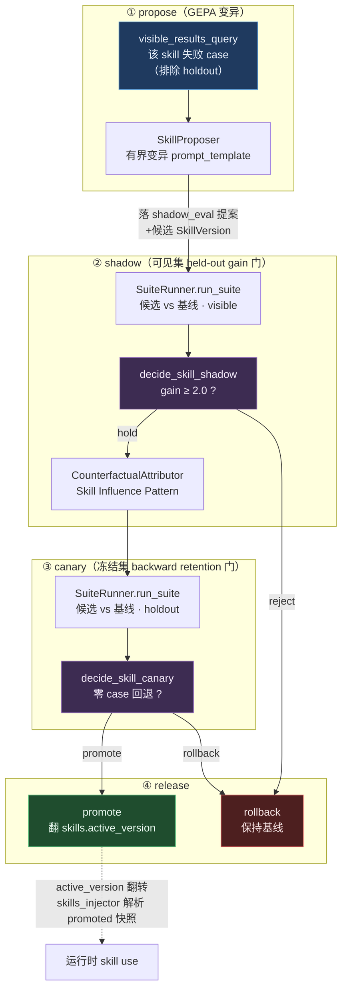

# Skill 进化闭环 × 自我改进评测：综述 §3/§7/§8 的工程落地

> **摘要**：本报告把「经验时代」自进化综述 [1] 的三个核心章节——**§3 Skills 三阶段生命周期**、
> **§7 Meta-Evolving Agents 三体制**、**§8 自我改进评测六目标（SI）**——逐项映射到 negentropy 的
> 自进化子系统，并以 **Skill 进化闭环**为载体，落地综述强制的「验证其价值」层：离线 eval 四表 +
> held-out 双相门 + 反事实归因。实现见 PR [#1038](https://github.com/ThreeFish-AI/negentropy/pull/1038)
> （① eval+归因基座 → ② TargetHandler 抽象 → ③ Skill 进化消费者）。理论框架的完整映射见
> [140 号调研](./140-experience-era-self-improvement.md)，四层自进化架构见
> [设计方案](../concepts/design/self-evolving-agents.md)；本文聚焦本切片新增的 **Skill/Meta/SI 度量**
> 框架（140 号未覆盖）。

---

## 1. 综述锚点（本切片的三个理论支柱）

### 1.1 §3 Skills：Experience Becomes Reusable Procedure

综述把 skill 形式化为 `σ=⟨M, I, R, A⟩`（manifest/instruction/references/artifacts，即 SKILL.md 文件夹），
并给出**三阶段生命周期**：Creation → Use → Evolution。绝大多数系统（含本项目 #1037 前）Creation+Use
成熟，但 **Evolution 是缺口**。综述 §3.5 强调：

- **证据发现**（正向/负向/统计型轨迹）→ **更新操作**（add/edit/prune/version）→ **验证准入是硬门**
  （SkillsBench 86 任务中 16 例出现**负迁移**——看似提升的 skill 实则在他处退化）。
- **held-out 验证门**：候选 skill 须在冻结 holdout 集上零回归方可晋升（防过拟合 adaptation 集）。

→ 本项目 #1037 前 `skill_versions`（SemVer）+ 三层渐进披露已就绪，但**无验证门、无证据驱动更新**。
本切片的 `SkillTemplateHandler` + `decide_skill_*` 双相门正是补这一段。

### 1.2 §7 Meta-Evolving Agents：Who Controls What to Evolve

综述两轴三体制（what evolves × who controls）：

| 体制 | 谁控制 | 演化对象 |
|---|---|---|
| TaskAgent self-evolution | TaskAgent 内 | 内容资产（skill/memory） |
| TaskAgent meta-learning | TaskAgent 内 | 执行机制 / 改进策略 |
| **Meta-evolving agent** | **独立持久 meta 层** | 执行机制 / 改进策略 / **meta 层自身** |

综述关键设计范式：**Agentic Harness Engineering**（harness 拆成可编辑文件级资源，Agent Debugger 蒸馏
证据，Evolve Agent 编辑被后续任务结果检验）、**Autogenesis**（RSPL 版本化资源 + SEPL reflect-select-
improve-evaluate-commit 协议）、**SkillOS**（冻结 executor + 独立 Curator，分组任务流使早期编辑被后续
相关任务结果奖励）。

→ 本项目 #1037 的 `engine/evolution/` 是 **stub 级 meta 层**（基建齐备但仅 retrieval 一面接线）。
本切片以 `TargetHandler` 抽象 + `SkillTemplateHandler` 把它从「TaskAgent self-evolution」推向
「meta-evolving agent」——一个**功能独立、持久、按 target_kind 分派**的 meta 层首次跑成真闭环。

### 1.3 §8 Measuring Self-Improvement：SI 六目标 + SIP-Bench

综述的核心论断：**「更高的适应后分数 ≠ 系统整体变好」**。在线 canary 指标单独无法区分真实增益与
过拟合/成本转移/隐藏回归。提出 SI 六目标（Table 4）：

1. **Backward retention**（旧任务回放是否退化）2. **Held-out gain**（新任务是否变强）
3. **Longitudinal stability**（T0→T1→T2 增益是否存活）4. **Improvement efficiency**（单位增益成本）
5. **Path attribution**（增益来自 skill/memory/tool/param 哪条路径）6. **Safety non-regression**

并给出 **SIP-Bench 协议**：T0/T1/T2 checkpoint + replay/adapt/**held-out** 分区；**冻结 holdout 结果不回流
proposer**（§9.4 防 Goodhart 四件套之首）。另指出 **Counterfactual Trace Auditing**：with-skill vs
without-skill 同 case 对齐 → Skill Influence Pattern（pass-rate Δ 仅 +0.3pp 但 522 处行为影响）=
**路径归因的工程化手段**。

→ 本切片落地目标 1/2/5：`decide_skill_shadow`（held-out gain）+ `decide_skill_canary`（backward retention）
+ `CounterfactualAttributor`（path attribution）+ `visible_results_query`（结构性排除 holdout = 防 Goodhart）。
目标 3/4/6（纵向稳定性/效率/安全非回归）留后续。

---

## 2. 落地方案（PR #1038 三段）

### 2.1 ① Eval + 归因基座（综述 §8 + §9.4 + §10.3）

| 产物 | 文件 | 综述锚点 |
|---|---|---|
| eval 四表（套件/用例/运行/结果） | [`models/eval_suite.py`](../../apps/negentropy/src/negentropy/models/eval_suite.py) + [迁移 0083](../../apps/negentropy/src/negentropy/db/migrations/versions/0083_eval_subsystem.py) | §8 SIP-Bench 分区 |
| `is_frozen` holdout 权威标志 | 同上 `EvalCase.is_frozen` | §9.4 冻结 holdout |
| `SuiteRunner`（按 partition 切片跑 Judge + 聚合 + regression_count） | [`engine/eval/runner.py`](../../apps/negentropy/src/negentropy/engine/eval/runner.py) | §8 held-out/backward |
| `SkillExecutor`（v1 judge-the-prompt） | 同上 | §3 skill = prompt 资产 |
| `CounterfactualAttributor`（Skill Influence Pattern） | [`engine/eval/attribution.py`](../../apps/negentropy/src/negentropy/engine/eval/attribution.py) | §8 CTA path attribution |
| `visible_results_query`（排除 partition=holdout） | 同上 runner.py | §9.4 防 Goodhart |
| `decide_skill_shadow`（visible 增益门）/ `decide_skill_canary`（holdout 零回归门） | [`engine/evolution/decision.py`](../../apps/negentropy/src/negentropy/engine/evolution/decision.py) | §8 held-out gain + backward retention |
| `judge_once`（非锚定 Judge 复用，routine 路径零行为差） | [`engine/routine/evaluator.py`](../../apps/negentropy/src/negentropy/engine/routine/evaluator.py) | 复用 §8 Judge 机制 |

### 2.2 ② TargetHandler 抽象（综述 §7 + 设计 §10「第二面接入时再抽」）

| 产物 | 文件 | 综述锚点 |
|---|---|---|
| `TargetHandler` ABC（advance_shadow/canary/rollback/maybe_spawn） | [`handlers/base.py`](../../apps/negentropy/src/negentropy/engine/evolution/handlers/base.py) | §7 独立持久 meta 层 |
| `RetrievalConfigHandler`（原 retrieval 硬编码逻辑原样迁入） | [`handlers/retrieval.py`](../../apps/negentropy/src/negentropy/engine/evolution/handlers/retrieval.py) | 零行为差（byte-equivalence golden 守护） |
| orchestrator 退化为薄分派层 | [`orchestrator.py`](../../apps/negentropy/src/negentropy/engine/evolution/orchestrator.py) | §7 meta-layer 调度 |
| golden 状态机集成测试 | [`test_evolution_orchestrator_state_machine.py`](../../apps/negentropy/tests/integration_tests/engine/test_evolution_orchestrator_state_machine.py) | 首次经 inspect_once 覆盖全路径 |

### 2.3 ③ Skill 进化消费者（综述 §3.5 + §7；闭 ①+② 的环）

| 产物 | 文件 | 综述锚点 |
|---|---|---|
| `SkillProposer`（GEPA 有界变异 prompt_template） | [`handlers/skill.py`](../../apps/negentropy/src/negentropy/engine/evolution/handlers/skill.py) | §3.5 证据发现→更新；[2] GEPA |
| `SkillTemplateHandler`（shadow→canary→promote/rollback 全闭环） | 同上 | §7 meta-evolving |
| `skills.active_version` 指针（发布机制） | [迁移 0084](../../apps/negentropy/src/negentropy/db/migrations/versions/0084_skill_active_version.py) + [`models/skill.py`](../../apps/negentropy/src/negentropy/models/skill.py) | §3 version + 晋升 |
| `skills_injector` 解析 promoted 快照 | [`skills_injector.py`](../../apps/negentropy/src/negentropy/agents/skills_injector.py) | §3 skill use 阶段 |

---

## 3. 数据流：一次 Skill 进化的完整闭环

**关键不变量**：`visible_results_query` 是 proposer 读证据的**唯一入口**——结构性排除
`partition='holdout'` 的 run（综述 §9.4 防 Goodhart：holdout 仅服务于晋升裁决，不回流 proposer）。

---

## 4. 与综述开放问题（§10）的对应 + SI 六目标完成度

**SI 六目标（综述 §8）—— 已全部落地（Round 1 + Round 2）**：

| SI 目标 | 落地 | 产物 |
|---|---|---|
| #1 backward retention | ✅ | `decide_skill_canary`（holdout 零回归门） |
| #2 held-out gain | ✅ | `decide_skill_shadow`（visible 增益门） |
| #3 longitudinal stability | ✅ Round2 | `decide_longitudinal_drift` + `longitudinal_recheck` 调度 + drift 回退 `active_version` |
| #4 improvement efficiency | ✅ Round2 | `improvement_efficiency`（cost_units 以 Judge 调用数代理）+ 写入 `shadow_eval_result` |
| #5 path attribution | ✅ | `CounterfactualAttributor`（反事实 Skill Influence Pattern） |
| #6 safety non-regression | ✅ Round2 | `EvalSuite.is_safety` + `decide_safety_nonregression`（晋升前置硬门） |

**综述 §10 开放问题**：

| §10 开放问题 | 状态 |
|---|---|
| 10.3 弱反馈下信用分配 | ✅ 部分——反事实归因给 case 级 Δ；trajectory 内子动作级归因仍后续 |
| 10.4 自生成经验稳定性 | ⚠️ 触及——`is_noop_template` 防「重排空白当改进」；外部 grounding（独立 eval 集换血）列后续 |
| 10.5 纵向评估 | ✅ Round2——`longitudinal_recheck` 周期复跑 holdout vs 晋升均值，drift 回退 |
| 10.9 部署后修改安全 | ✅ 部分——默认全关灰度 + 双相门 + 安全套件非回归前置；持续红队（§9.3 末段）列后续 |

---

## 5. 后续方向（多轮迭代拟合综述）

> **R1+2 评测层（SI 六目标）；R3 能力扩展（runtime canary / agent-loop / 第三面）；R4 闭环增强（消费接线 / $-cost / 窗口末复评门）；R5 judge 侧 $-cost；R6 第四面 + 在线 error-rate 门**。
> 下列为仍未触达的更细粒度增强。

**Round 6 已落地**：
- ✅ **builtin_tool_config 第四进化面**（R6-a，综述 §7）：`BuiltinToolConfigHandler` + 迁移 0088
  （`builtin_tools.active_version` + `builtin_tool_versions` 快照表）+ `BuiltinToolExecutor`。
  **TargetHandler 四面齐备**（retrieval / skill / memory_pipeline_prompt / builtin_tool_config）。
- ✅ **runtime canary 在线 error-rate 门**（R6-b，综述 §9.3）：`tool_telemetry` 对 `expand_skill` 调用打
  `skill_ref` + `canary_assignment`（同步缓存读，不触 DB）；`advance_runtime_canary` 在离线复评门前先跑在线门
  （`decide_runtime_canary_online`：候选桶 error-rate 退化 → rollback）。受控发布在线信号补齐。

**仍未触达**：
1. **agent-loop 完整多轮 + 工具 + MicroSandbox**（R3-a v1 为单轮 skill-conditioned generation）：需每 case
   沙箱 Agent + 工具预算，dedicated round。
2. **其余进化面**：`agent_prompt`（需 ADR-3 `sync_negentropy_agents` 改造）/ `knowledge_strategy`（需 KG eval suite）。
3. **`pre_propose_check.cost_today_usd` 接入**（需先解 D7：ADK 侧 `tool_invocations.cost_usd` NULL）。
4. **持续红队 / 安全 benchmark**（SI #6 增强 + §9.3 末段）：综述要求「红队自身 agent 化」（AutoRedTeamer 式），
   等具体安全评测目标。

---

## 6. 理论依据（IEEE）

- [1] C. Jiang, J. Zhong, Y. Fu, *et al.*, "Self-Improving Agents in the Era of Experience: A Survey of
  Self- to Meta-Evolution," *Frontis.AI / Tsinghua University*, Jun. 2026. §3 Skills / §7 Meta-Evolving /
  §8 SI 六目标 + SIP-Bench / §9.4 防 Goodhart / §10.3 信用分配。
- [2] L. A. Agrawal *et al.*, "GEPA: Reflective prompt evolution can outperform reinforcement learning,"
  in *Proc. ICLR (Oral)*, 2026. arXiv:2507.19457. 反思驱动 prompt 变异三元组。
- [3] Z. Zhou *et al.*, "Counterfactual trace auditing for skill influence," 2026. with-skill vs
  without-skill 行为影响度量（Skill Influence Pattern）。
- [4] S. Ouyang *et al.*, "SkillOS: Learning to curate agentic skill repositories," 2026.
  冻结 executor + 独立 Curator + 分组任务流奖励——`TargetHandler` + `SkillTemplateHandler` 的范式对应物。
- [5] C. Lam *et al.*, "Governing evolving memory in LLM agents: Risks, mechanisms, and the SSGM
  framework," arXiv:2603.11768, 2026. 进化回路须显式验证门与回滚（双相门的理论依据）。

> 关联：理论映射见 [140 号调研](./140-experience-era-self-improvement.md)；自进化理论与 GEPA/ACE/DGM
> 见 [130 号调研](./130-self-evolving-agents-team.md)；四层架构见
> [设计方案](../concepts/design/self-evolving-agents.md)。
