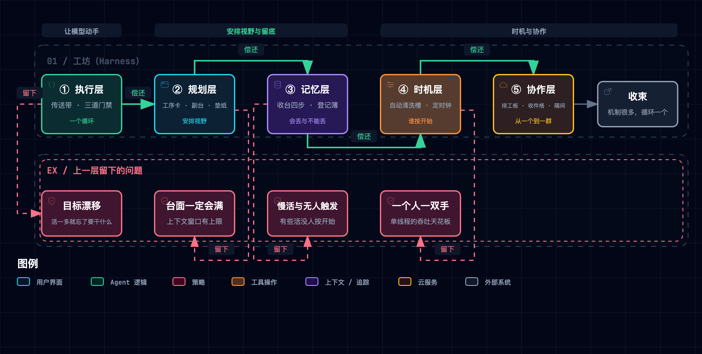

# Learn Claude Code 五层 Harness 精读总览

> [!NOTE] **核心精读范围**
>
> - 课程站点（20 章修订）：[Learn Claude Code](https://learn.shareai.run/zh/s01/)，取数 2026-09-18
> - 课程仓库（main 17 章整合版）：[shareAI-lab/learn-claude-code](https://github.com/shareAI-lab/learn-claude-code) @ [`f9e8b280`](https://github.com/shareAI-lab/learn-claude-code/tree/f9e8b280f715f9ba107d4517fd39bc5f8ddda618)，License **MIT**
> - 配套最小原型：[`assets/cc_harness_lab.py`](./assets/cc_harness_lab.py)（纯标准库，`--selftest` 秒级，六次破坏性实验）

**一句话定位**：这门课程用 Python 从一百余行长到一千七百余行，每章只加一个机制——而它真正证明的事情只有一件：**从头到尾，循环没有变过**。让模型能在你机器上动手的，不是更聪明的模型，是循环外面一层层挂上去的 harness。

**总类比**：把整套东西想象成**一间通宵不打烊的工坊**。模型是那位手很快、但从不记事的师傅；harness 是这间工坊本身——传送带把活一趟趟送到他面前，门禁决定哪些活允许上机器，台面会满、满了要收拾，墙上的钟替他记着几点该干什么，隔壁工位上还有别人在同时干活。**全篇五章 = 工坊的五个区**，同一个物件在全文只扮演一个角色，绝不换脸。

**怎么读这篇笔记**：五章各自独立成篇，每个机制节按「**类比 → 机制 → 实景**」三拍走。实景全部取自配套最小原型的**实际运行输出**——它把材料里由模型承担的角色换成确定性脚本，因此回答的是「机制是否自洽」，不回答「模型是否聪明」。

---

## 1. 为什么是这五层：一条不能跳步的依赖链

五层不是并列的功能清单，是一条**每一层都在偿还上一层欠下的债**的链子：



> 图源（可 diff 文本）：[`claude-code-harness--five-layer-dependency.mmd`](../../assets/mermaid/agent-harness/claude-code-harness--five-layer-dependency.mmd) · 交互版（下载到本地打开）：[`claude-code-harness--five-layer-dependency.html`](../../assets/architecture/agent-harness/claude-code-harness--five-layer-dependency.html)

读法：**每一层的存在理由，都写在上一层的失败里**。跳过任何一层去看下一层，都会觉得后者是过度设计。

## 2. 角色台账（全篇单射，严禁一物多喻）

这是全文最容易破的地方，因此先立账。**同一个技术概念在五章里只绑定一个角色**，各章只展示它的不同职责切面。

| 技术概念 | 固定角色 | 首现 |
|:---|:---|:---|
| 主循环 `while True` | **传送带** | ① |
| 续轮判据（看内容块，不看停止标记） | **验活动作**——看手里还有没有活 | ① |
| 工具分发表 | **转接号码簿** | ① |
| 工具批次 | **一托盘**（同盘同时上，盘间排队） | ① |
| 权限闸门 | **门口三道门禁** | ① |
| Hooks | **传送带边的插线口**（能加装置，改不了锁芯） | ① |
| 上下文窗口 | **台面** | ② |
| 待办清单 | **钉在台面的工序卡** | ② |
| 子 agent | **支起的副台**（只带回一张回执） | ② |
| 技能目录 / 技能正文 | **工具柜的抽屉标签** / **抽屉里的手册** | ② |
| System prompt | **每轮重铺的垫纸** | ② |
| 压缩 | **收台四步** | ③ |
| 摘要模型 | **记录员**（只写字不动手） | ③ |
| 持久记忆 / 记忆索引 | **登记簿** / **登记簿的扉页目录** | ③ |
| 记忆挑选 | **目录员**（最多抽几页，拿不准就不抽） | ③ |
| 后台任务 | **自动清洗槽**（按下就走开） | ④ |
| 后台完成通知 | **叫号器** | ④ |
| 定时调度 | **墙上的定时钟** | ④ |
| 任务图 | **入口排工板** | ⑤ |
| 消息总线 | **每人门口的收件格**（读一条撕一条） | ⑤ |
| 协议请求/响应 | **一式两份的派工单** | ⑤ |
| worktree 隔离 | **各自的隔间** | ⑤ |
| MCP | **标准插口上外接的别人家机器** | ⑤ |

> [!WARNING] **三条防撞规则**
>
> 1. **「桌子」一词全篇禁用**——台面（上下文窗口）／副台（子 agent）／隔间（worktree）／工位（队友本人）语义各异，共用一词必然一喻多物。
> 2. **四个「帮手」不得混用**：记录员（写摘要）≠ 目录员（挑记忆）≠ 夜班整理工（记忆整合）≠ 学徒（进度字条）。
> 3. **三类「卡片」不得同名**：工序卡（待办）／抽屉标签（技能目录）／扉页目录（记忆索引）；同理叫号器（后台通知）≠ 收件格（队友消息）≠ 排工板（任务）。

## 3. 五章导航

| 章 | 覆盖 | 一句话本质 |
|:---|:---|:---|
| [① 工具与执行](./171-claude-code-tooling-execution.md) | 循环 · 工具 · 权限 · 钩子 | 它敢在你机器上动手，靠的不是更聪明，是传送带外面挂着的三层可拆卸装置 |
| [② 规划与协调](./172-claude-code-planning-coordination.md) | 待办 · 子 agent · 技能 · 系统提示 · 错误恢复 | 它每一轮都把台面从头重读一遍——所以「看见什么」从来不是它自己说了算 |
| [③ 记忆管理](./173-claude-code-memory-management.md) | 上下文压缩 · 持久记忆 | 记忆不是一个功能，是两套咬合的机制：一套承认会丢，一套保证不丢 |
| [④ 并发与时机](./174-claude-code-concurrency.md) | 后台任务 · 定时调度 | 所谓后台没有平行宇宙，只是「不等它」；而有些活连按开始的人都不要 |
| [⑤ 多 Agent 平台](./175-claude-code-multi-agent-platform.md) | 任务图 · 团队 · 协议 · 自治 · 隔离 · MCP | 把「多 Agent」拆开，全是朴素物件；而循环还是那一个 |

## 4. 证据分级（全篇纪律）

这门课程的信息密度最高之处，恰恰也是最容易说错之处：它对 Claude Code **闭源**源码的分析，我们无从核验。因此每条断言标注来源等级：

| 级 | 含义 | 本文的义务 |
|:---|:---|:---|
| 【一】 | 课程仓库固定提交实测，或本文最小原型 `--selftest` 可复算 | 可直接断言 |
| 【二】 | 课程站点正文，或 Anthropic 官方文档 | 可断言，但属「官方／课程的讲法」 |
| 【三】 | 课程作者对闭源 Claude Code 源码的分析 | **必须带归属句**，且本文**一律不转引具体文件行号**，只转引结构性结论 |

> [!IMPORTANT] **本组不是口播取证源**
>
> 科普视频各集的逐章取证、原文引语、可调参数与生产版对照，归各集 `research/source-notes.md`；章→集归属与固定提交的选择，只登记在[系列信源地图](../../../apps/negentropy-influence/source-map/claude-code-explained.md)。
> **除「main 轨独有两章」与本文最小原型实测外，本组任何断言若与各集 source-notes 冲突，一律以 notes 为准。**

## 5. 本组不得重述的事实（SSOT 边界）

为避免第二事实源漂移，以下事实**只给链接，不在本组复述**：

1. 章→集归属 · 2. 固定提交的选择与理由 · 3. 站点 20 章 ↔ main 17 章逐行对照表 · 4. 取证台账的条目命名与审计判据 —— 全部指向[系列信源地图](../../../apps/negentropy-influence/source-map/claude-code-explained.md)
5. 各集标题／集序／配色／时长／交付状态 —— 指向 `series.json` / `series.md`
6. 逐字口播文本与各集口播禁用清单 · 7. 站点／仓库原文的逐字引语 · 8. 站点插图的文字规格转写 · 9. 闭源源码的文件名与行号 · 10. 各章总行数／工具数实测总表与各集分歧清单 —— 全部指向各集 `research/source-notes.md`

**可写与不可写的判据**：**机制不变式与顺序约束可写**（如「大结果必须先落盘，之后才允许旧结果变成占位符」），它跨修订稳定，是精读的本体；**随修订漂移的可调常数不写**（保留条数、字节阈值、预算上限、小时数、个数上限），一律以「参数见对应集 notes」代之。

## 6. main 轨独有的两章：视频未取材的净增量

课程仓库 main 有两章不在站点 20 章修订内，[系列信源地图](../../../apps/negentropy-influence/source-map/claude-code-explained.md)已登记其不被任何一集取材——即科普视频五个作品均未以它们为信源。它们没有任何一集持有，**因此本组是它们的唯一事实源**，两章各自附完整取证：

| 目录（main 轨全称） | 文件 | 行数 | 落位 |
|:---|:---|---:|:---|
| `s16_workflow_runtime` | `code.py` | 874 | [④ 并发与时机 · 附录](./174-claude-code-concurrency.md) |
| | `README.zh.md` | 245 | |
| `s17_goal_loop` | `code.py` | 882 | [② 规划与协调 · 附录](./172-claude-code-planning-coordination.md) |
| | `README.zh.md` | 233 | |

> 取证：`raw.githubusercontent.com/shareAI-lab/learn-claude-code/f9e8b280f715f9ba107d4517fd39bc5f8ddda618/<目录>/<文件>`，取数 2026-09-18，License MIT。行数为该提交上 `wc -l` 实测【一】。
>
> ⚠️ **撞号警告**：这两章的编号与站点 20 章修订里的 s16／s17 **不是同一章**。本组提及它们时一律书写「main 轨 + 完整目录名」全称，禁止裸用编号。

## 7. 全局批判性边界（材料没有证明的事）

以下五条跨章成立，各章不再重述，只链接本节：

1. **站点与仓库不是同一时刻的产物**。站点整站是课程的旧修订（20 章），仓库 main 已整合为 17 章——页面上的数字与它旁边的代码之间存在时间差。任何「站点说 X 行」的数字都不能拿去核对仓库当前代码。
2. **「流式下停止标记不可靠」在材料内无法自证**。全仓没有流式调用（无 `stream=True`），这条核心论点只能引课程作者对闭源产品的分析【三】。
3. **文档与实现不一致，至少两处**。其一，第二章 README 把 concurrency 列为要点，而该章代码是纯串行循环（无线程池、无 `asyncio.gather`）；其二，站点讲任务图时跳过环检测，而 main 轨对应实现里有递归环检测。
4. **没有项目级配置文件加载机制**。全仓没有 `CLAUDE.md` / `.claude/` 的读取，项目记忆完全由自研的记忆目录承担——凡涉及「Claude Code 怎么读项目约定」的结论，材料给不出证据。
5. **全程没有横向对照实验**。「多 Agent 更好」「待办清单减少跑偏」「后台任务更省」这类主张，材料**一次 A/B 都没做过**；它证明的是机制自洽，不是效果更优。

此外有一处**仓内导航陷阱**：课程仓库除根级 17 章外，还保留着一套旧的 12 课轨（`agents/` 与 `docs/` 目录），**两轨章号不对应**。本仓此前的两处引用正是引了旧轨编号——见下节。

## 8. 与本仓 negentropy 的关联

本仓早在这次精读之前就消费过这门课程。本次核验（2026-09-18）发现：两处既有引用指向的是该仓库**已被取代的旧 12 课轨**——
课程仓库在根级 17 章之外，还保留着一套旧的 `agents/` 目录（实测含 `s05_skill_loading.py` / `s06_context_compact.py` / `s07_task_system.py`），
**两轨章号互不对应**。引用本身在旧轨上成立，但轨号与随之而来的结论都已陈旧，检索时极易命中过期文件：

| 本仓位置 | 现状 | 处置 |
|:---|:---|:---|
| [`docs/concepts/subsystems/025-the-memory-system.md`](../../concepts/subsystems/025-the-memory-system.md) §2.5 | 引旧轨 `agents/s05_skill_loading.py` / `s06_context_compact.py` / `s07_task_system.py` | 现行根级对应为 `s07_skill_loading` / `s08_context_compact` / `s10_task_system`。建议标注轨别以消歧 |
| [`context_assembler.py`](../../../apps/negentropy/src/negentropy/engine/adapters/postgres/context_assembler.py) 文件头参考文献 | 引「learn-claude-code s06 — 三层压缩管线」 | 旧轨确为三层；现行根级 `s08_context_compact` 已是**四步**管线（另有一条应急通道）。引用未失实，但轨号与层数均已陈旧 |

机制对位（结论性，实现细节归本仓设计文档）：

| 课程机制 | 本仓对应 | 判定 |
|:---|:---|:---|
| 技能两层加载（目录常驻 + 正文按需） | [Skills 设计](../../concepts/design/skills.md) 的渐进披露「描述常驻 Layer 1 / 模板按需 Layer 2」 | ✅ 已对齐（同一范式，本仓已分阶段落地） |
| 压缩的预算分配 | [`context_assembler.py`](../../../apps/negentropy/src/negentropy/engine/adapters/postgres/context_assembler.py) 的记忆／历史／系统三档预算 | ✅ 已对齐（该文件头部参考文献即引本课程） |
| 三闸门权限 + 钩子作为共用扩展点 | [Claude Code 集成设计](../../concepts/subsystems/038-claude-code-integration.md) | ✅ 已对齐（以 BuiltinTool 接入，闸门由宿主 CLI 侧承担） |
| 任务图：落盘、带依赖、可认领 | [Routine 系统](../../concepts/subsystems/039-the-routine-system.md)（Orchestrator + Evaluator 闭环） | ✅ 已对齐 |
| 队友运行时、收件格与协议握手 | [Routine 多 Agent 归因](../../concepts/subsystems/040-routine-multi-agent-faculty.md)（一核五翼 Faculty 编排） | 🔶 值得落地（本仓无对等的消费式收件格，也无带类型校验与幂等的请求／响应协议） |
| **目标闸门把「达成／判定不可能／超上限」做成互斥的一等状态**（main 轨 `s17_goal_loop`） | 本仓 `engine/routine/decision.py` 的 `decide()`：成功判定以**标量分数阈值**为主，Judge 显式判 pass 需经 `accept_verdict_pass` 开关旁路才被接受 | 🔶 **值得落地**，详见[② 规划与协调 · 附录](./172-claude-code-planning-coordination.md) |

> 最后一行是这次精读对本仓最有价值的一条。课程的目标闸门把**终止原因**建模为互斥的一等状态（达成／判定不可能／连续阻断超限／出错／先等后台完成），
> 而本仓把「成功」压在一个可比较的分数阈值上——当评分尺度与阈值不可达时，一个实际已经收敛的任务会落进「无进展」分支。
> 本仓已用开关与分数容差带做了局部对冲；课程的做法提示了一个更上游的选项：**让判定先分类，再打分**。

## 9. 动手实验室

配套原型 [`assets/cc_harness_lab.py`](./assets/cc_harness_lab.py)（纯标准库、无随机数、无墙钟依赖，同一命令永远同一份日志）：

```bash
cd docs/research/agent-harness/assets
uv run --no-project python cc_harness_lab.py --selftest     # 全绿自证
uv run --no-project python cc_harness_lab.py --break all    # D1..D6 破坏性实验
```

**完好基线**（实际运行输出）：

```text
== 完好基线 ==
  ran_deny_listed    = False
  ran_first_tool     = True
  ran_late_tool      = True
  persisted_files    = ['a1.txt', 'a2.txt', 'a3.txt', 'b1.txt', 'b2.txt', 'b3.txt']
  lost_forever       = 0
  pointer_lost       = 0
  pairs_intact       = True
  makespan           = 4.0
  notify_reuses_id   = False

SELFTEST PASSED ✔
```

**六次破坏性实验**（每次只拆一个机制，改完真跑，逐字记录）：

| # | 拆什么 | 实测退化 | 教训 | 详见 |
|:---|:---|:---|:---|:---|
| D1 | 循环判据退回「信停止标记」 | `ran_late_tool  True → False`——内容块里明明还有活，循环提前收工 | 判据要看手里有没有活，不看它说没说完 | [①](./171-claude-code-tooling-execution.md) |
| D2 | 压缩顺序调换（旧结果替换抢在落盘之前） | **无可观测差异** | 顺序不是唯一的保险，「没看过的不许动」独立兜住了同一条不变式 | [③](./173-claude-code-memory-management.md) |
| D3 | 关掉工具调用与其结果的配对保护 | `pairs_intact  True → False`——裁剪把配对拆散 | 裁剪可以丢内容，不能丢结构 | [①](./171-claude-code-tooling-execution.md) |
| D4 | 权限闸门顺序倒置（人工审批先于硬拒绝表） | `ran_deny_listed  False → True`——硬拒绝表上的命令被放行执行 | 不可协商的拒绝必须排在可协商的同意前面 | [①](./171-claude-code-tooling-execution.md) |
| D5 | 无屏障管道改成有屏障并行 | `makespan  4.0 → 6.0`（+50%） | 屏障的代价是让快的等慢的，且逐段累积 | [④](./174-claude-code-concurrency.md) |
| D6 | 顺序与「没看过的不许动」**两道保险同时失效** | `lost_forever 0 → 1`（一份原文从未落盘）、`pointer_lost 0 → 1`（一份已落盘但指针被抹掉） | 两道保险各自都够用，一起拆才出事——这才是顺序纪律真正的分量 | [③](./173-claude-code-memory-management.md) |

> **两个意外发现**（按实验纪律照单全收）：
> ① D2 单独调换顺序**没有**造成损失——材料 README 把顺序讲成唯一理由，实测显示「没看过的结果不许压成占位符」这道守卫独立地维持了同一条不变式，二者是纵深防御而非单点。
> ② D6 暴露了占位符的**不幂等**：已被压成 `[Earlier tool result saved at <路径>]` 的条目，若路径够长使其再次越过长度阈值，会被二次压缩——而该占位符里没有可供提取的落盘路径行，指针就此丢失。

## 10. 验收问答

1. **为什么说「循环从未改变」不是一句漂亮话？** 因为每章新增的机制都挂在循环**外面**：门禁挂在上件之前，插线口挂在传送带边，收台挂在每次开工之前，叫号器挂在下一轮的入口。循环体本身只做一件事——看手里还有没有活。
2. **为什么判据要看内容块而不是停止标记？** 停止标记在流式输出下会失真【三】；而「内容块里有没有工具调用」是本地可直接观察的事实。D1 实测：信标记的版本会在标记失真的那一轮提前收工，把已经排好的活丢掉。
3. **压缩四步的顺序为什么不能换？** 便宜的先做、贵的最后做只是成本理由；真正的正确性理由是**大结果必须先落盘，之后才允许旧结果变成占位符**——否则原文还没存下来就先被压成了一行。D2/D6 实测显示这条不变式其实由两道独立保险共同维持。
4. **子 agent 和队友的本质差别是什么？** 副台是一次性的：另起一份干净的历史，干完只带回一张回执，中间过程全部丢弃；队友是常驻的：有自己的收件格、能被唤醒、能自己去排工板上认领活。
5. **这门课程最不能外推的结论是哪一条？** 「教学实现 = 产品实现」。材料里凡涉及闭源产品的部分都属第三级证据，且全程没有任何横向对照实验——它证明的是机制自洽，不是效果更优。

## 参考

[1] shareAI-lab, "learn-claude-code — Bash is all you need: a nano claude code–like agent harness, built from 0 to 1," GitHub repository, commit `f9e8b280`, Aug. 18, 2026. License MIT. [Online]. Available: https://github.com/shareAI-lab/learn-claude-code

[2] shareAI-lab, "Learn Claude Code（课程站点，20 章修订）," 2026. [Online]. Available: https://learn.shareai.run/zh/s01/

[3] Anthropic, "How Claude Code works," *Claude Docs*. [Online]. Available: https://code.claude.com/docs

[4] 本仓, "系列信源地图 · Claude Code Harness Engineering," `apps/negentropy-influence/source-map/claude-code-explained.md`（章→集归属与固定提交选择的唯一登记处）
