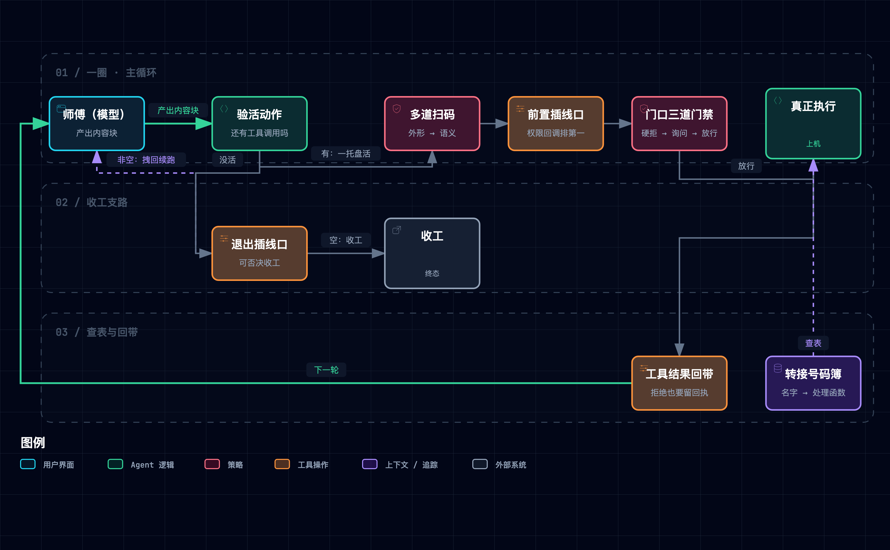

# ① 工具与执行：一个循环，和挂在它外面的东西

> [!NOTE] **定位**
> 五层依赖链的地基（[总纲](./170-claude-code-harness-overview.md) §1）。本章只讲一件事：让模型能在你机器上动手的那个循环长什么样，以及为什么 agent 工程反复给出的答案不是「更聪明的循环」，而是**循环外面挂着的三层可拆卸装置**。类比角色沿总纲 §2 台账，全章单射。

**一句话本质**：它敢在你机器上动手，靠的不是更聪明，是传送带外面挂着的三层可拆卸装置。

---

## 1. 这一层要解决什么问题

模型能推理代码，但碰不到机器：不能读文件、跑测试、看报错。没有 harness 时，每次工具调用都要人把结果手动粘回去——**人自己就是那个循环**。一个 `while True` 就能把人换下来：把模型响应里的工具调用拿出来执行，结果作为新消息追回去，再问一次模型。

但裸循环有两个致命伤。其一，**它什么都敢执行**——一条删库命令和一条列目录命令在它眼里没有区别。其二，如果每加一个约束都往循环体里写一行 `if`，循环很快就会膨胀成没人敢动的烂泥——而循环恰恰是唯一必须永远稳定的东西。

本层的答案是：循环保持极小，把所有可生长的东西**挂到外面**——能力挂进一张号码簿，检查挂成一排扫码口，闸门和扩展逻辑挂在传送带边的插线口上。后面四层的每一个机制，也都是照这个路子挂上来的。

| 缺口 | 机制 | 大白话 |
|:---|:---|:---|
| 模型碰不到机器 | 循环 + 续轮判据 | 一趟趟把活送到手边，干完看手里还有没有活 |
| 每加一个能力都要动核心 | 工具分发表 | 加工具改号码簿，不动传送带 |
| 检查该按什么顺序排 | 执行前校验链 | 便宜的、不可协商的排前面，人的时间放最后 |
| 什么都敢执行 | 权限三道门禁 | 硬拒绝不可协商，问不问人放在最后 |
| 扩展逻辑会把循环撑爆 | 钩子插线口 | 装置插在带边，锁芯不动 |

## 2. 机制全景



> 图源（可 diff 文本）：[`claude-code-tooling--execution-panorama.mmd`](../../assets/mermaid/agent-harness/claude-code-tooling--execution-panorama.mmd) · 交互版（下载到本地打开）：[`claude-code-tooling--execution-panorama.html`](../../assets/architecture/agent-harness/claude-code-tooling--execution-panorama.html)

## 3. M1 · 传送带：循环与续轮判据

> [!TIP] **类比**
> 传送带只做一件事：把活送到师傅手边，接住他递回的东西。它每转一圈都做同一个**验活动作**——看他手里还有没有活。有，就继续转；没有，才考虑收工。注意它看的是**手里**，不是师傅嘴上说自己干没干完。

**不变式**：循环体只回答一个问题——**本轮响应的内容块里还有没有工具调用**。有就执行并把结果作为新消息追回去，没有就退出。这个判据是本地可直接观察的**结构事实**；而停止标记是模型/传输层给出的**声明**。二者在流式输出下可能不同步：内容块里已经排好了工具调用，标记却报了结束——信声明，活就丢了【三，课程作者拆过闭源源码后指出，产品不把停止标记当续轮的唯一依据，而是另设一个独立标志位，流式过程中一旦收到工具调用块就置真，理由正是声明会滞后于事实】。

判据在课程材料内部就有一场活生生的对照——同一个课程、两个修订，判据正好相反，这本身就是「站点与仓库有时间差」的最小样本：

| 版本 | 退出判据 | 读法 | 证据级 |
|:---|:---|:---|:---|
| 课程站点旧修订 | 停止标记不是工具调用，即返回 | 信声明 | 【二】 |
| 仓库固定提交 s01–s04 | 从内容块过滤工具调用，空才退出（s04 起先问退出事件） | 看事实 | 【一】 |

且固定提交全仓没有一处流式调用、也没有一处停止标记判据——判据的选择是**代码里的事实**，不是注释里的口号【一】。

第二条续轮通道是 s04 加上的：`if not tool_calls:` 之后并非直接返回，而是先触发一次退出事件；若某个回调返回非空，就把它作为用户消息追加并继续循环【一】。也就是说——**「手里没活」的收工可以被传送带边的插线口否决**，退出不是循环一个人说了算的。

> [!IMPORTANT] **实景**
> `s01_agent_loop/code.py @ f9e8b28`
>
> ```python
> messages.append({"role": "assistant", "content": response.content})
> tool_calls = [b for b in response.content if b.type == "tool_use"]
> if not tool_calls:
>     return                      # 验活动作：手里没活，收工
> ```
>
> 配套原型（[`assets/cc_harness_lab.py`](./assets/cc_harness_lab.py)）把判据拆回「信停止标记」的破坏性实验（实际运行输出）：
>
> ```text
> == D1 · 循环判据退回「信 stop_reason」 ==
>   改动：Switches.trust_stop_reason = True
>   退化：ran_late_tool  True  →  False
> ```
>
> 内容块里明明还有一件排好的活，循环提前收工——判据错，活就丢。

**口播落点**：停止标记是声明，内容块是事实；信声明就会丢活。

## 4. M2 · 转接号码簿：工具分发表与一托盘

> [!TIP] **类比**
> 师傅会用的机器越来越多，但传送带不需要认识任何一台——它只按**转接号码簿**查号：活上写着名字，簿上名字对着处理函数，查到就转过去。一批活算**一托盘**，教学版的托盘是一件一件上的。

**不变式**：工具能力的增长发生在**表**里，不发生在**循环**里。s01 的执行行是硬编码的 `run_bash(...)`；s02 起改成「按名字查表、以实参展开调用」，此后课程再未变过【一】。把「调哪个」从循环体里拿走，循环才可能在后续十几章里保持逐字不变——否则每加一个机制都要动核心。

**「只改两处」其实是三处耦合**【一】。课程正文说加一个工具＝在 schema 数组加一条、在处理函数字典加一行。但调用方式是按关键字展开（`handler(**block.input)`），于是 **schema 的属性名必须与处理函数的形参名逐字一致**——名字对不上，运行时直接炸。注册表只有两条显式条目，却隐含第三个契约：签名对齐。这条课程正文没写，是这一层最容易被「两行搞定」话术盖住的坑。查不到名字时回退为一句「未知工具」字符串而不是抛异常，循环因此对坏名字免疫【一】。

**托盘的真实分布**：教学版**没有批次并行**——多个工具调用严格按模型给出的原始顺序逐个执行，全章无线程池、无异步、无并发原语【一】；该章自己的说明也明写逐个执行【一】。但**仓库的章节索引表把「并发」列为该章关键概念**，与代码和该章自身说明直接矛盾【一】。顺带一笔：课程前一章的结尾以提问方式抛出「几个工具同时跑会不会互相踩」，课程后一章给出的答案其实是「不存在同时」。产品侧则是另一回事【三，课程作者拆过闭源源码后指出：工具调用被切成**连续的批次**，批内并行且有并发上限、批间严格有序；能否并行由**本次调用的实参**判定，而非工具的读写属性——同一个 shell 工具，列目录可并行、删除不可并行，而某些会写状态的工具反而可并行，因为每次写的是不同文件】。官方钩子文档也列有「一批并行工具调用全部完成后」触发的生命周期事件，可佐证产品确有「批」这一层【二】。

> [!IMPORTANT] **实景**
> `s02_tool_use/code.py @ f9e8b28`
>
> ```python
> handler = TOOL_HANDLERS.get(block.name)
> output = handler(**block.input) if handler else f"Unknown: {block.name}"
>
> # 第三处契约就藏在这一行展开里——schema 属性名 ↔ 处理函数形参名：
> #   read_file 的 schema 属性是 path / limit，函数签名就必须是 run_read(path, limit=None)
> ```
>
> 并发原语排查（固定提交实测）：`grep -nE "import (threading|asyncio|concurrent)|ThreadPool|gather|async def"` 作用于 s01–s04 全部代码，**零命中**【一】。

**口播落点**：加一个工具，改的是号码簿，不是传送带。

## 5. M3 · 上件前的多道扫码：执行前的校验链

> [!TIP] **类比**
> 活件上机器前要过一排扫码口：先看外形对不对（结构合法），再看这台机器认不认它（语义合法），再看今天允不允许上机（许可），全过了才通电。越便宜、越不可协商的检查排越前面。

**顺序不变式**：**结构校验 → 工具自校验 → 前置钩子 → 权限判定 → 真正执行**——外形合法先于语义合法，语义合法先于是否许可，许可先于动手。注意**稳定的是顺序，不是段数**：课程站点两个页面对这条链的分段数给出不同口径（多出的一档是输入回填与钩子裁决的归并；课程作者拆过闭源源码后对分段口径不一）【三】，本文只写顺序不数段。排法的因果很直白：结构检查是纯本地计算、几乎免费；语义检查可能要读文件；而「要不要问人」是唯一要付出**人类时间**的一步，必须放到最后——且问完人之前，前面的检查已经把明显非法的都挡掉了，人不至于被垃圾问题轰炸。

教学版只实现了这条链的**后两段**【一】，前半段不是不存在，是被外部件代工了：

| 链段 | 教学版由谁负责 |
|:---|:---|
| 结构校验 | SDK 侧承担（未自建校验层） |
| 工具自校验 | 无 |
| 前置钩子 | s04 起：一次前置事件触发 |
| 权限判定 | s03 为循环里一行调用；s04 起为前置回调第一项 |
| 真正执行 | 号码簿查表分发 |

前半段之所以能省，是因为教学版工具个位数、SDK 替它扛了外形检查；规模一大，被代工的段迟早要自己接回来。

这条链上还有一个「机制之间互相踩」的反直觉样本【三，课程作者拆过闭源源码后指出：产品给工具结果配了「过大就溢写到磁盘」的上限，唯独**读文件工具把它设为无限**——否则会出现「读到大文件 → 结果被溢写成一个路径 → 模型再去读那个路径 → 再次溢写」的自噬死循环】。上限本是保护，落到读文件上恰好变成递归发生器。

> [!IMPORTANT] **实景**
> `s03_permission/code.py @ f9e8b28`
>
> ```python
> # s03：循环里插入的一次权限调用（校验链的许可段）
> if not check_permission(block):
>     results.append({...}); continue
> # s04（s04_hooks/code.py @ f9e8b28）：换成一次前置事件触发，循环不再点名任何检查函数
> blocked = trigger_hooks("PreToolUse", block)
> ```

**口播落点**：越便宜的检查排越前面，人的时间放在最后。

## 6. M4 · 门口三道门禁：权限

> [!TIP] **类比**
> 门口三道门禁按固定次序开：第一道是焊死的铁门（硬拒绝），第二道是对讲机（问一下），第三道才是敞开的门。先碰到哪道就按哪道办——铁门永远排在可以对讲的那道前面。

**顺序不变式**：**硬拒绝 → 需询问 → 放行，先匹配到哪一档就按哪一档办**，规则写得多细都不改变先后。这条不必只信课程作者的源码分析——Anthropic 官方权限文档明写：规则按拒绝、询问、放行求值，**第一条命中即决定结果，规则的具体程度不改变次序**；一条宽的拒绝规则会盖住更窄的放行规则，**放行无法在拒绝上开洞**【二】。因果在于：拒绝是不可协商的，同意是可协商的；若把可协商的排前面，一句「同意」就能把整张拒绝表架空。配套原型实测印证：把人工审批挪到硬拒绝表之前，拒绝表上的命令被放行执行（见下实景 D4）。

教学版的三条实测细节【一】，每条都值得单独记：

1. **硬拒绝表只对 shell 工具生效**：第一道闸门被「仅当工具是 bash」包住，文件类工具越界只会落到第二道闸门，变成「问一下」。同一道门禁，不是对所有活都开。
2. **引入权限管线的同时，撤掉了文件工具原有的硬边界**。上一版的文件工具全部经过一个把路径钉死在工作区内的辅助函数，越界直接报错；加了门禁的这一版起，文件工具不再调用它，越界改由规则去「问用户」（固定提交实测：该辅助函数的调用次数从上一版的五处降到零）。**装门禁那天，原来那堵墙被换成了一句问话**——这是「引入机制反而放松了约束」的最干净的样本。
3. **被拒也要补一条结果**：拒绝路径不是跳过了事，而是先补一条内容为「拒绝」的工具结果再继续。这就是执行层为记忆层留下的**配对义务**——每一个工具调用都必须有一条结果与之成对，否则历史不再合法（详见 [③ 记忆管理](./173-claude-code-memory-management.md) 的 D3 实验）。

产品侧还有四条结构性差异【三，课程作者拆过闭源源码后指出】，其中两条有官方口径可直接加固：

| 产品侧差异（【三】） | 官方口径加固 |
|:---|:---|
| 表态多一种「不表态、交回通用管线」，最终仍收敛为「问一下」 | —（官方未披露表态内部结构） |
| 规则来自多个配置来源合并，有固定优先级 | 官方明列：**受管策略 > 命令行参数 > 本地 > 项目 > 用户**，受管策略连命令行也覆盖不了【二】 |
| 一个名字看起来像安全字段的标记，实际只是界面标签、不参与任何决策 | — |
| 有「先自动判、判不了再问人」的自动批准路径 | 官方即 auto 模式：由分类器模型代替人审，且看不到工具结果原文【二】 |

正文以官方口径为准，课程的源码级说法降为佐证。

> [!IMPORTANT] **实景**
> `s03_permission/code.py @ f9e8b28`
>
> ```python
> def check_permission(block) -> bool:
>     if block.name == "bash":                      # 闸门一：硬拒绝（只对 shell 生效）
>         reason = check_deny_list(block.input.get("command", ""))
>         if reason: return False
>     reason = check_rules(block.name, block.input) # 闸门二：规则匹配
>     if reason:
>         if ask_user(...) == "deny": return False  # 闸门三：人工审批
>     return True
> ```
>
> 闸门顺序倒置的破坏性实验（[`assets/cc_harness_lab.py`](./assets/cc_harness_lab.py)，实际运行输出）：
>
> ```text
> == D4 · 权限闸门顺序倒置：人工审批先于硬拒绝表 ==
>   改动：Switches.gate_order_correct = False
>   退化：ran_deny_listed  False  →  True
> ```

**口播落点**：不可协商的拒绝，必须排在可协商的同意前面。

## 7. M5 · 插线口：钩子

> [!TIP] **类比**
> 传送带边留了一排插线口，每种活的前后都能插装置。装置按插上的顺序依次通电，第一个说「停」的就地断电——后面的装置这一趟就不跑了。插线口能加装置，换不了传送带的锁芯。

**不变式**：**事件名 → 回调列表，按注册顺序逐个调用，第一个返回非空的就地短路**。前置事件返回非空＝拦下这次工具调用；退出事件返回非空＝把循环拽回去再跑一轮；另两类事件（输入提交、执行后）的返回值在调用方被丢弃【一】。因果很清楚：循环要保持稳定，权限、日志、副作用、收尾这些横切行为就必须有一个**不侵入循环**的挂载点；而挂载点一旦统一，**权限就不再是特权逻辑，只是众多插件中的第一个**——s03 里权限还是循环体中的一行硬编码调用，s04 之后它只是前置事件回调列表里的第一项，和日志回调平级【一】。这是本层最值得学的一笔结构决定。

但共用扩展点有代价。教学版四个事件、五个回调的注册格局与返回值去向如下【一】：

| 事件 | 教学版回调（注册序） | 返回非空的实际效果 |
|:---|:---|:---|
| 输入提交 | 打印工作目录 | 无——调用方丢弃返回值；文档却称其用途为「注入上下文」 |
| 前置 | 权限（第一）、日志（第二） | 拦下本次调用，并**就地短路**后续回调 |
| 执行后 | 大输出提醒 | 无效果——返回值被丢弃，却仍会静默吞掉同事件后续回调 |
| 退出 | 收尾统计 | 拽回循环续跑一轮 |

由此可实测的三处瑕疵【一】：

1. **短路会让审计漏记**：权限回调注册在日志回调之前，一旦拦截就地短路——**被拒绝的调用永远不会被日志回调记录**。共用扩展点的代价，恰恰是「被挡下的那一次」在日志里消失。
2. **执行后事件的返回值被调用方丢弃，触发函数却仍会在非空时短路**——一个执行后回调若返回非空，会静默吞掉它后面所有同事件回调，且没有任何其他效果。短路语义统一了，消费语义没统一。
3. **输入提交事件的回调文档口径是「注入上下文」，实现却只打印一行、返回值也无人读**——文档承诺与实现能力不符，是又一处文档—实现不一致。

**安全不变量**（官方口径，比「钩子能拦」重要得多）【二】：官方权限文档明写**钩子的决定不能绕过权限规则**——钩子放行，拒绝规则照样拦、询问规则照样问；反向却成立——**一个以阻断方式退出的钩子在权限规则求值之前就把调用停住**，因此它压得过放行规则。合起来是一条干净的对称不变量：**插线口只能收紧，不能放松**。官方还直接建议：要硬性放行或拒绝，用权限系统而不是钩子；并且「钩子沉默不等于批准」。教学版与产品在这里方向相反【三，课程作者拆过闭源源码后指出：产品里钩子是喂进权限管线的输入、从属于拒绝/询问规则——「权限实现成一个钩子」只是教学版的权宜】。另据课程作者对闭源源码的分析，退出事件的钩子若反复阻止退出，会有一个「本轮已由退出钩子接管」的标志位抑制重复触发以防死循环【三】。

> [!IMPORTANT] **实景**
> `s04_hooks/code.py @ f9e8b28`
>
> ```python
> def trigger_hooks(event, *args):
>     for callback in HOOKS[event]:
>         result = callback(*args)
>         if result is not None:   # 第一个非空返回值 → 就地短路
>             return result
>     return None
>
> register_hook("PreToolUse", permission_hook)  # 先注册：拦截即短路
> register_hook("PreToolUse", log_hook)         # 后注册：被拦的调用永远到不了这里
> ```
>
> 配对义务的破坏性实验（[`assets/cc_harness_lab.py`](./assets/cc_harness_lab.py)，实际运行输出）：
>
> ```text
> == D3 · 关掉 tool_use/tool_result 配对保护 ==
>   改动：Switches.pair_protection = False
>   退化：pairs_intact  True  →  False
> ```

**口播落点**：插线口只能收紧，不能放松。

## 8. 教学版与生产版的距离

教学版砍掉了什么、为什么砍了仍然成立——每条都是结构性结论：

| 距离 | 为什么教学版能这么简化 |
|:---|:---|
| 续轮只有一条判据、一条退出路径 | 非流式调用下停止标记与内容块不会分叉；产品因流式而必须另设标志位并铺开多条退出/续跑分支【三，带归属：课程作者拆过闭源源码后指出】 |
| 批次＝严格串行的 `for` 循环 | 单用户、单任务下「同时」不产生收益；产品的批内并行与实参级并行判定，收益在多工具并发场景才兑现【三，同上归属】 |
| 无独立 schema 校验层 | SDK 侧已承担外形检查；教学版工具个位数、签名契约靠人眼盯得住 |
| 钩子无匹配器、无并行执行、无超时语义 | 官方钩子体系另有按模式匹配、并行执行、超时且「超时不算拦截」等完整语义【二】；教学版四个事件、五个回调，冲突面近乎为零 |
| 权限是教学版里「实现成钩子」 | 产品方向相反：钩子从属于权限管线【三，归属见 M5】。教学版的写法演示的是**扩展点统一**这个结构，不是产品的权限架构 |

一句话：教学版省掉的都是**规模**才逼出来的东西；留下的恰恰是任何规模下都不变的骨架——判据看事实、能力长在表里、检查有次序、扩展不进循环。

## 9. 关键实证

（表中【三】条目均出自课程作者对闭源源码的分析，归属不逐行重述。）

| 事实 | 一句话读法 | 证据级 | 随修订漂移 |
|:---|:---|:---|:---|
| 四章循环骨架逐字相同，差异全在循环外 | 加机制不等于改内核 | 【一】 | 否 |
| 续轮判据是「内容块里有无工具调用」，非停止标记 | 看手里有没有活，不听它说没说完 | 【一】 | 否 |
| 站点旧修订用停止标记，仓库固定提交用内容块 | 同一课程两个修订，判据相反 | 【一】+【二】 | 是（修订差） |
| 退出可被退出事件钩子否决并续轮 | 收工不是循环一个人说了算 | 【一】 | 否 |
| 工具执行纯串行，全章无并发原语 | 教学版里「同时」根本不存在 | 【一】 | 否 |
| 仓库章节索引把「并发」列为该章关键概念 | 索引承诺了代码没有的东西 | 【一】 | 是 |
| 处理函数形参名须与 schema 属性名一致 | 「只改两处」背后还有签名契约 | 【一】 | 否 |
| 硬拒绝表只对 shell 工具生效 | 同一道门禁不是对所有活都开 | 【一】 | 否 |
| 引入权限管线的同时撤掉文件工具硬路径边界 | 加了门禁，反而把墙换成一句问话 | 【一】 | 否 |
| 被拒调用仍补一条工具结果 | 拒绝也要留回执，否则历史不合法 | 【一】 | 否 |
| 权限回调排在日志回调之前，拦截即短路 | 被挡下的那次不会被记下 | 【一】 | 否 |
| 执行后事件返回值被丢弃，却仍短路后续回调 | 短路语义统一，消费语义不统一 | 【一】 | 否 |
| 官方：规则按拒绝→询问→放行求值，首中即决 | 不可协商的排在可协商的前面 | 【二】 | 否 |
| 官方：钩子放行绕不过拒绝/询问；阻断型钩子先于权限生效 | 插线口只能收紧，不能放松 | 【二】 | 否 |
| 官方：shell 规则匹配命令文本，换写法即失配 | 闸门标的是位置，不是防线 | 【二】 | 否 |
| 官方：存在「一批并行工具调用完成」的生命周期事件 | 产品确有「批」这一层 | 【二】 | 否 |
| 产品不以停止标记为续轮唯一依据，另设标志位 | 流式下声明滞后于事实 | 【三】 | 是 |
| 产品按实参而非工具读写属性判定能否并行 | 同一工具，参数不同安全性不同 | 【三】 | 是 |
| 产品把读文件工具的溢写上限设为无限 | 不设上限才不会读自己吐出的路径 | 【三】 | 是 |
| 产品有看似安全字段的标记只是界面标签 | 名字像门禁，其实是贴纸 | 【三】 | 是 |

> 课程正文里出现的各类计数（事件个数、结果字段个数、拒绝表条数）与官方现行清单已不一致，属随修订漂移的可调口径，本文一律定性表述；逐条取证的唯一登记处是[系列信源地图](../../../apps/negentropy-influence/source-map/claude-code-explained.md)。

## 10. 批判性边界

本章独有四条（跨章的五条见[总纲 §7](./170-claude-code-harness-overview.md)）：

1. **「加一个工具只改两处」不可外推**。第三处签名契约是隐含的；产品侧的工具注册代价没有任何公开证据——官方文档只给工具清单与能力分类，不披露注册机制。
2. **闸门的字符串匹配不是安全边界**。课程自己说明那张表只用来说明闸门位置、不能视为安全边界【二】；官方对产品也是同口径：shell 规则匹配的是模型写出的命令文本，同一程序换种写法即失配，官方甚至对会被复合命令绕过的写法直接忽略并在启动时告警【二】。需要不依赖命令文本的强制，应交给权限系统与系统级沙箱。
3. **引入机制可能放松既有约束**。权限管线落地的同时，文件工具的硬路径边界被拆除（五处调用清零）——评价新机制要看**净效应**，不能只数加了什么、不数拆了什么。
4. **两套 harness 分解不同构**。课程把 harness 拆成五元（工具、知识、观测、行动接口、权限），官方术语表是三元（工具、上下文管理、执行环境）加能力清单——课程的「权限」在官方口径里只是能力之一。引用时必须并列标注并以官方为准。

## 11. 与本仓的关联

| 课程机制 | 判定 | 结论 |
|:---|:---|:---|
| 三闸门权限 + 钩子作为共用扩展点 | ✅ 已对齐 | 沿[总纲 §8](./170-claude-code-harness-overview.md) 判定：本仓经 [Claude Code 集成设计](../../concepts/subsystems/038-claude-code-integration.md) 以宿主 CLI 侧承担闸门 |
| 「被拒也补一条工具结果」的配对义务 | ✅ 已对齐 | 闸门由宿主 CLI 侧承担，拒绝同样回写结果、不破坏历史配对；判定沿[总纲 §8](./170-claude-code-harness-overview.md)，与裁剪的交互在 [③ 记忆管理](./173-claude-code-memory-management.md) 对位 |
| 批次并行（按实参判定能否并行） | ⏸ 暂缓 | 单 agent 串行满足现状；待真实并发需求出现再评，不预先造批调度 |
| 短路导致的审计盲区（被拦调用不留日志） | 🔶 值得落地 | 本仓若引入统一前置扩展点，审计回调应排在任何可短路回调之前，不让「被挡下的那次」消失 |
| 「引入闸门时拆除既有硬边界」的教训 | 🔶 值得落地 | 评审任何新门禁时强制核对它是否降级了旧约束，按净效应裁决 |

## 12. 验收问答

1. **为什么续轮判据要看内容块，不看停止标记？** 停止标记是声明，内容块是事实；流式输出下声明会滞后于事实【三，带归属：课程作者拆过闭源源码后指出】。仓库固定提交四章全部按内容块判定【一】；原型 D1 实测：信标记的版本会在标记失真的那一轮提前收工，丢掉已排好的活。
2. **加一个工具到底要改几处？** 显式两处（schema 一条、处理函数映射一行）＋隐式一处：处理函数形参名必须与 schema 属性名逐字一致，否则按关键字展开的调用直接失败【一】。
3. **引入权限管线时，教学版发生了什么「倒退」？** 文件工具原有的工作区硬边界（越界直接报错）被整体拆除，越界降级为「问一下用户」——硬墙变成了对讲机。教训是评价新机制要看净效应：门禁加上了，墙却拆了。
4. **为什么说钩子「只能收紧，不能放松」？** 官方口径：钩子放行绕不过拒绝/询问规则；而阻断型钩子在权限求值之前就停住调用，压得过放行规则【二】。要硬性放行或拒绝，官方指定用权限系统，钩子沉默也不等于批准。
