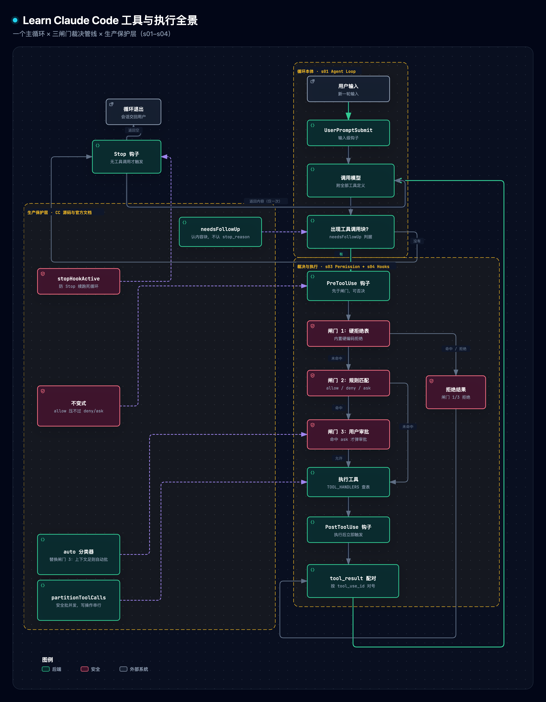

# 精读：Learn Claude Code「工具与执行」

> [1] shareAI-lab, "Learn Claude Code," GitHub 仓库，s01_agent_loop / s02_tool_use / s03_permission / s04_hooks 四章。所据版本为双轨钉点：站点轨取 fix 分支 `67a9126c`（2026-07-29，README.md 默认中文；站点 learn.shareai.run 的实况与该钉点于 2026-10-07 逐章对账一致），main 轨取 `ce8f9f18`（upstream/main，2026-09-28，README.md 默认英文，中文见 README.zh.md）。访问日期 2026-10-07。两轨在循环判据上有实质差异：本文以站点轨为骨架，以 main 轨作对照，差异处逐一注明。

**一句话定位**：把会思考的 LLM（大语言模型）变成会动手的 Agent，靠的就是一个把工具结果喂回 LLM 的循环。Tool Use 让它长出更多的手，Permission 在动手前设闸门，Hooks 把闸门和其他扩展逻辑都接在循环的固定挂点上；四章读下来，循环本体一行没改。

**SCQA 导读**。共识背景是：LLM 早已能写出正确的指令，你让它「列一下目录、跑一下脚本」，它会给出一串可直接复制粘贴的命令——只是它只能把办法说出来，说不到动手。于是有一对问题要答：其一，怎么让它把想法变成动作——自己跑命令、看结果、接着走下一步，而不是每一步都等人搬运；其二，动手之后，一个真能删文件、改系统的程序，凭什么敢放手让它跑。课程四章作答：s01 Agent Loop 造出回路（§3）；s02 Tool Use 把万能的 bash 换成查表分发的专用工具（§4）；s03 Permission 在执行前插入三道闸门（§5）；s04 Hooks 把检查与扩展逻辑挪出循环，挂到固定事件上（§6）。§7 列关键实证数字；§8 是配套原型 `docs/research/agent-harness/assets/lcc_tooling_lab.py`（纯标准库，可直接运行）与五次破坏性实验；§9 收拢规律与争议；§10 自测；§11 划定适用边界。

> [!TIP]
> **白话主线**：先拿一件小事考考 LLM：「帮我在购物清单上加一行牛奶，再把清单念给我听」。它回你的是一段说明：「请打开清单文件，在第二行加上牛奶……」。办法说得头头是道，可话一说完就停了：文件它动不了，清单也念不了；真要办成，得你打开文件照着改，再把结果告诉它，等它想好下一步——一来一回，你不是在使唤一个助手，是在当它的牛马。它只会说，不会做。Agent 补上的，正是「会做」这半边：给 LLM 配一个替它动手的程序，LLM 说写，程序就写；说读，程序就读。于是两边接力转了起来：LLM 想下一步怎么做，程序动手执行并把结果交还给它，LLM 看过结果，接着往下想，周而复始，直到它的回答里不再带有下一步指令，只剩一句交代结果的话。这个循环就是 Agent Loop。如此，会思考却不会动手的 LLM 便升级成了拥有自主决策和行动能力的 Agent。接下来，我们看看如何在此基础上一步步强化它，把它变成 Claude Code 这样的成熟 Coding Agent。

## 1. 它要解决什么问题

s01 的开场与上一段的清单故事讲的是同一件事，但课程多问了一层：把这个来回自动化，得到的不是「更快的问答」，而是一个能在真实环境里连续行动的程序，这同时意味着它有了搞破坏的能力。因此这四章要满足一份四项规格，缺一项，方案就立不住：

| 规格 | 通俗版 | 对应机制 |
|---|---|---|
| 持续 | LLM 一停就续、一呼就应，回路永不断 | s01 主循环：两信号判据 + tool_result 回喂 |
| 可扩展 | 手（工具）越多也越好加，加新的不动旧的 | s02 工具分发：TOOLS 定义 + TOOL_HANDLERS 查表 |
| 可拦截 | 动作落地之前，有人（或规则）点头 | s03 权限：硬拒绝 → 规则 → 用户审批三道闸门 |
| 可插入 | 日志、审计、自动化这类扩展有地方可挂 | s04 Hook：事件注册表，循环只喊号、不干活 |

读这四章，最好盯住一条主线：每一章相对上一章的循环，都只动一个点。s02 把循环里写死的 `run_bash()` 换成 `TOOL_HANDLERS[block.name]` 查表；s03 在执行前插一行 `check_permission(block)`；s04 再把这一行换成 `trigger_hooks("PreToolUse", block)`，检查逻辑降格成注册表里的普通回调。三次演进，循环骨架始终不变。材料每章开头都标了一行「Harness 层」（循环、工具分发、权限、Hook），Harness 指的就是 LLM 外面这层运行装置：LLM 负责决策，装置负责执行与守门。

先交代三个前置概念。其一，「调一次 LLM = 发一串消息、收一段回答」：对话不是连续的意识流，而是一次次独立的调用，LLM 记不住上一次调用的内容，除非程序自己把上次的结果放进下次的输入。其二，命令行（shell / bash）：用文字命令操作电脑的方式，列目录、读写文件、跑程序都靠它。其三，JSON：一种自描述的结构化数据格式（字段名加值），程序之间靠它交换工具定义与执行结果。

## 2. 全貌解剖

先看全景图（图源 [lcc-tooling--panorama.mmd](../../assets/mermaid/agent-harness/lcc-tooling--panorama.mmd)）。一句话读图：蓝色的循环本体是唯一不变的骨架；绿色与琥珀色的裁决执行 Pipeline 挂在判据之下，靠 tool_result 配对回喂形成闭环；紫色的生产保护层用虚线，各守护一个骨架节点。


> 交互版（下载到本地打开）：[`lcc-tooling--panorama.html`](../../assets/architecture/agent-harness/lcc-tooling--panorama.html) · 双主题渲染 [`dark`](../../assets/architecture/agent-harness/lcc-tooling--panorama-dark.png) / [`light`](../../assets/architecture/agent-harness/lcc-tooling--panorama-light.png)

| 层级 | 部分 | 回答的问题 | 性质 |
|---|---|---|---|
| 地基：四个核心机制 | Agent Loop 主循环 | LLM 怎么获得「动手」能力？ | 机制，精读 |
| 地基：四个核心机制 | 工具定义与分发 | 怎么给 LLM 更多的手，又不改循环？ | 机制，精读 |
| 地基：四个核心机制 | 权限三道闸门 | 怎么敢让它动手，又不出事？ | 机制，精读 |
| 地基：四个核心机制 | Hook 注册表与四事件 | 怎么继续扩展，又不碰循环？ | 机制，精读 |
| 证据链：生产版对照 | needsFollowUp、连续批并发、五步验证、八个规则来源、Hook 不变式、stopHookActive（各名词在 §3–§6 逐一讲清） | 教学机制在生产里长什么样？ | 证据，评判真伪 |
| 证据链：两轨差异 | main 轨把循环判据从 stop_reason 改为内容块、删除 Claude Code（下称 CC）附录、正则化破坏性检测 | 教学取舍怎么演进？ | 证据，版本对齐 |
| 证据链：官方文档对照 | 截至 2026-10-07 的 33 个 Hook 事件、六种权限模式、规则由 Claude Code 执行 | 机制现状与边界？ | 证据，独立口径 |
| 地图：课程坐标 | s05 起的规划、记忆、并发、多 Agent 各章都叠在此循环上 | 这部分在整门课的位置？ | 地图 |

因果脉络链，从观察一路推到证据闭环：

```
观察：LLM 输出命令即停，人肉粘贴结果当中间层（s01）
  ↓ 归因
LLM 内部没有「行动 → 观察 → 再思考」的回路；回路只能外置，且要能自动持续
  ↓ 设计规格
持续 × 可扩展 × 可拦截 × 可插入（§1 四项）
  ↓ 机制
Agent Loop（消息回喂循环）
  → Tool Use（查表分发 + safe_path 给文件工具划界）
    → Permission（三道闸门插在执行前）
      → Hooks（检查降格为回调，扩展挂固定事件；Stop 可强制续跑）
  ↓ 证据闭环
教学 code.py 可跑 × 材料对 CC 源码的核查 × 官方文档独立口径 × 本篇原型五路破坏性实验
```

基础层是三个前置概念（§1 已交代）。学习焦点按价值排成五项。第一，主循环的两个信号：这是整个体系的根基，后面 16 章都叠在它上面。第二，权限闸门，以及「规则由代码执行，不靠 LLM 自觉」这条原则：这是敢用的关键。第三，Hook 注册表：它是「扩展不打断核心」的范本，其中 Stop 强制续跑最反直觉。第四，生产保护机制群（needsFollowUp、Hook 不变式、stopHookActive）：工程含金量集中在这里。第五，两轨判据差异：它是「教学求简洁，生产求鲁棒」的现成样本。批判性边界（材料没证明的事）统一列在 §11，读机制时请对照那份清单。

## 3. Agent Loop：主循环——LLM 获得手的唯一通路

### 3.1 会写命令的 LLM 没有手

「能写出正确的命令」和「会做事」之间，还隔着一条沟。命令只是文本，要变成动作，得有人按下回车、看到输出、再决定下一步。s01 之前，这个人就是用户自己：跑一遍，贴回去，再跑一遍。麻烦还在其次，真正的问题是：这个回路里 LLM 只贡献了「下一步做什么」的判断，执行和观察全靠人。把它自动化，就是给 LLM 接上一双手：程序替它执行、替它观察，再把观察结果递回它眼前。

### 3.2 机制解构：三十行循环与两个信号

教学实现（站点轨 s01 code.py）的全部逻辑，就是一个五步循环。第一步，用户的问题作为第一条消息进入 `messages` 列表。第二步，程序带着 `messages` 和工具定义（`tools=TOOLS`）调用 LLM。第三步，LLM 的回答原样追加为 assistant 消息，然后查一个信号：回答里有没有工具调用。第四步，对每个工具调用块执行 `run_bash(block.input["command"])`，把输出包成 `tool_result`（带上该调用的 `tool_use_id`）。第五步，这些结果作为新的 user 消息追加回 `messages`，回到第二步。判断只有两个去向：有工具调用就继续转，没有就 `return` 退出。

这里有一条容易看漏的约定：工具结果是以 user 角色回塞的。对话里 assistant 先说「我要调工具」，紧接着一条 user 消息说「这是你要的结果」。角色名看着别扭，机制上却说得通（推断：对 LLM 而言，凡不是它自己产出的内容，都算输入）。官方 API 语义与此一致：LLM 以 `stop_reason: "tool_use"` 结束并返回一个或多个 tool_use 块，你的代码执行操作后，再以 tool_result 回传 [2]。

### 3.3 单步走查：一条「改文件」请求的完整往返

拿一个具体输入走一遍全程。用户输入：「帮我在清单里加一行牛奶，然后把清单念给我听」。此刻 `messages` 里只有一条 user 消息。程序第一次调用 LLM，回答里带一个 tool_use 块（写文件，参数是清单路径和新内容），`messages` 变成两条：user 的提问，加上 assistant 的调用请求。程序执行写入，磁盘上的清单多了一行，`messages` 追加第三条（user 角色的 tool_result：「已写入 N 字节」）。程序第二次调用 LLM，这次回答里又带一个 tool_use 块（读文件），于是再执行、再回喂，`messages` 长到五条。第三次调用，LLM 回答纯文本「清单现在是……」，不再带工具调用块，循环退出。整个会话三次调用、两次执行，LLM 的每一次决策都建立在程序喂回的结果之上。

### 3.4 判据之争与生产版差异：认内容块，不认收尾字段

判据怎么选，两轨给出了不同答案，这是本篇最值得停下来看的一处分歧。站点轨教学版查 API 响应的收尾字段，`stop_reason == "tool_use"` 就继续。概念上很干净，却有个隐患：流式场景下，回答像打字机一样逐字到达，收尾字段可能比内容更晚更新，程序已经看到工具调用块时，字段还停在上一个值。等字段再决定，等于把行动绑在一个可能迟到的信号上。这像火警接警：接警员一听到「着火、地址」就派车，不会等这通报警电话按规矩收完尾才出发。CC 同理，它用 `needsFollowUp` 标志，流式过程中只要检测到 tool_use 块就置真，循环照常转，收尾字段另作他用（材料引 CC 源码注释：stop_reason 在流式下不可靠）。不过这个火警的比方有一处不成立：接警员听完还能补派，而循环对同一次响应不会判第二遍。main 轨已把教学代码也改成内容块判据：先筛出 `tool_calls` 列表，为空才退出（对应提交 `168fff8`「Fix empty tool-use response handling」，本仓 git 实测），与生产实现对齐。附带的好处是顺手消掉了教学版的一个边界情况：空的工具结果消息不会再被追加。

生产版其余的差异，都是「往这个核心上叠保护」（材料对 `src/query.ts` 1729 行的核查）。教学版只维护一个 `messages`，CC 的 State 对象有十个字段，各自追踪一类运行状态（压缩追踪、Token 恢复计数、Stop Hook 状态、轮次计数等），材料的总结是「所有复杂字段和退出路径都是保护机制」。教学版只有一条退出路径，CC 则有阻塞上限、Prompt 超长、LLM 报错、中止、Hook 停机、轮次上限、Token 预算续跑、响应式压缩重试等多条。**三十行的骨架就是 1729 行的核心**，其余全是保险丝。

### 3.5 原型实景

本篇原型（`lcc_tooling_lab.py`，用确定性脚本替代 LLM，文件系统放在内存中）跑通了同一条主线，下面是实际运行日志（`--selftest` 基线）：

```text
== 基线（四机制齐备） ==
turns 10/10 · executed 7 · denied 2 · asked 2 · pairing_errors 0 · checkpoints 5/5
```

十个脚本轮次走完：七个工具调用落地，两次被闸门拦下，两次要用户点头，任务的五个检查点全部通过。判据换回收尾字段会怎样，见 §8 实验 1 的实测退化。

## 4. Tool Use：工具分发——加一个工具只加两行

### 4.1 只有 bash，一切都得拼命令

只有 bash 一个工具时，LLM 心里想的是「读这个文件」，说出口却得是 `cat path/to/file`；想写文件得拼 `echo "..." > file.py`，想改文件得动用 `sed`。s02 点破了这笔损耗：LLM 要在自己的意图和 shell 语法之间做一层翻译，既浪费 Token，又容易拼错。更深的一层是，bash 万能却没有形状，程序侧没法区别对待「读」和「写」，因为所有命令都只是字符串。给每个动作一个有名字、有参数结构的专用工具后，LLM 直接说意图，程序侧也第一次拿到了「这个调用想干什么」的结构化信息。

### 4.2 机制解构：定义与注册，查表分发

加一个工具只需改两处：`TOOLS` 数组里加一条 JSON 定义，`TOOL_HANDLERS` 字典里加一行映射（名字对应实现函数）。JSON 定义包含名字、描述和参数 schema，其中 schema 就是参数的格式说明书，写明每个参数叫什么、什么类型，告诉 LLM「我能做什么、参数长什么样」。循环里的执行，由硬编码的 `run_bash()` 变成一行查表：`handler = TOOL_HANDLERS[block.name]; output = handler(**block.input)`。教学版从 1 个工具长到 5 个（bash、read_file、write_file、edit_file、glob），循环一行没改。文件类工具还多了 `safe_path` 校验：路径解析后必须落在工作目录内，越界直接报错。安全边界由此第一次有了结构化的着力点。

### 4.3 多工具调用与 tool_use_id 配对

LLM 经常一次返回多个工具调用，比如「读一下 a.py 和 b.py，然后列出所有 .py 文件」。API 允许这样做：每个 tool_use 块自带唯一编号，执行侧把每个结果包成带对应编号的 tool_result 回喂。编号配对像快递并发派送：一次下了多个订单，每个包裹都贴单号，不管谁先到、谁后到，签收时凭单号对回订单。不同的是，快递单号可以跨天有效、还能查物流状态，而这里的编号只在一轮对话里有效，结果也只是一次性回执。教学版按返回顺序逐个执行，配对的价值要到乱序与并发场景才显形；§8 实验 2 把配对拆掉，两个结果当场错绑。

### 4.4 生产版：连续批并发、五步验证与结果落盘

材料对 CC 源码的核查，补齐了三个生产细节。其一，并发的判定没有「只读都能并发」这么粗：`isConcurrencySafe(input)` 按具体输入判定，`ls` 可以并发，`rm` 不行；TaskCreate（任务创建工具，课程 s12 讲）虽然会改状态，但每次写的是不同文件，所以也可以并发。写操作之所以要隔离出并发批，是因为并发写会互相干扰：两个写操作抢同一份东西，或者一读一写交错、读到半成品。分区算法 `partitionToolCalls()` 把一串调用按原始顺序切成连续批：`[读 A, 读 B, glob, bash "rm x", 读 C]` 切成三批，前三个并发，删除单独串行，最后一个再单独成一个并发批，批与批之间严格保序。其二，CC 里每个工具调用都要过五步验证 Pipeline：schema 校验、工具级输入校验、PreToolUse Hook（可改输入、可拦截）、权限检查、执行。其三，每个工具都有结果长度上限，超限就落盘，LLM 看预览加路径；唯独读文件的上限是无穷大，否则读文件的结果被落盘成新文件，下次再读这个文件又触发落盘，会无限循环。

## 5. Permission：三道闸门——动手之前的裁决

### 5.1 rm -rf / 与「信任 LLM」的破产

s02 结束时，Agent 已经能读写文件、跑任意命令，而 bash 完全没有保护。s03 开场的一句判断，成了整门课的安全观，原话是「安全不能靠信任模型，要靠代码——在工具执行之前做判断」。官方文档的口径一致，说得更直白：权限规则由 Claude Code 执行，不由 LLM 执行；Prompt 或 CLAUDE.md 里写什么，影响的是 LLM 会尝试做什么，改变不了程序允许什么 [4]。这句话划出了一条信任边界：LLM 在边界内决策，边界本身由边界外的代码把守。

### 5.2 机制解构：硬拒绝、规则匹配、用户审批

三道闸门串在工具执行之前，顺序固定。闸门 1 是硬拒绝表 `DENY_LIST`，命中即拦，不问任何人。教学版列了 7 条字符串：rm -rf /、sudo、shutdown、reboot、mkfs、dd if=、重定向裸设备（裸设备指整块磁盘这类最底层的设备文件，重定向写入等于绕过文件系统直接写盘）。闸门 2 是规则匹配 `PERMISSION_RULES`，每条规则指定作用的工具和检查条件：文件类工具查路径是否越界，bash 命令查是否含删除文件、向系统配置目录写入、放开全盘权限一类的关键词，教学版列了 rm、> /etc/、chmod 777 三种。命中的操作交给闸门 3。闸门 3 是用户审批：打印原因，停下来等一个 y 或 n。三道都没命中的，直接执行。大部分日常操作走的就是这条直通路，设计上的隐含目标是尽量少打扰用户：默认直接放行，例外才问，极少数情形一概不商量。

还有一个容易被问到的细节：s02 给文件工具加的 safe_path 硬界，s03 的教学代码没有保留，越界读写改由闸门 2/3 裁决，用户批准就放行，也就是说，教学版把「界」整个交给了权限层。另外，教学版自己给闸门 1 挂了免责声明，原话是「简单字符串匹配不是可靠安全机制，命令变体和 shell 展开可能绕过」。

### 5.3 单步走查：一条删除命令过三关

LLM 发起一次 bash 调用，命令是 `rm old-notes.txt`。闸门 1 逐条比对硬拒绝表：不含 rm -rf /，不含 sudo……七条都没命中，放行到下一关。闸门 2 检查 bash 规则：命令含关键词「rm 」，命中「有潜在破坏性的命令」，打上标记。闸门 3 暂停并打印警示，等用户输入。用户敲 y，命令执行，删除结果作为 tool_result 回喂，LLM 继续；用户敲 n（或其他任何键），该调用收到「Permission denied.」的回喂，LLM 知道这条路被拒了，通常会换一种安全的做法。再看另一个分支：若命令以 sudo 开头，闸门 1 直接拦下，用户根本不会被问。这一档不商量，既不打扰人，也不给人犯错的机会；拦下后同样以拒绝结果回喂 LLM，它知道这条路走不通。闸门放在执行之前而不是之后，道理只有一条：这些动作不可逆，文件删了就是删了，事后惩罚挡不住既成事实。

### 5.4 生产版：四种裁决、八个来源与自动分类器

CC 的实际裁决比三道闸门厚。裁决值有四种：allow / deny / ask / passthrough。最后一种 passthrough 是「工具不表态，交给通用 Pipeline」，这里的通用 Pipeline 指由一串固定处理步骤组成的常规裁决流程。验证分布在多个阶段：schema 校验、输入校验、PreToolUse Hook、Hook 与 Pipeline 之间的裁决协调、多层规则检查。规则也不止一张表，而是八个来源（用户设置、项目设置、本地设置、特性开关、企业策略、命令行参数、内联命令、会话内授权），高优先级覆盖低优先级。`isDestructive` 标记纯属界面展示，不参与裁决，这是材料专门澄清的一个易误解点。

auto 模式下，审批还能进一步自动化：先看「接受编辑」模式（自动放行工作区内的文件改动）是否已经允许，再查安全白名单，最后把工具调用连同对话上下文交给一个分类器（专门判断安不安全的小模型）；连续拒绝太多次，就回退到人工 [1][4]。教学版的「问用户」，在生产里被拆成了一台分级判案机器。

官方文档当前列出六种权限模式（default、acceptEdits、plan、auto、dontAsk、bypassPermissions），并明确写出 bypassPermissions 只应在容器或虚拟机这类隔离环境里使用（截至 2026-10-07）[4]。

## 6. Hooks：Hook 注册表——扩展不进循环

### 6.1 每加一个检查，循环烂一分

s03 的权限检查是直接写在循环体里的。假设之后要加「每次执行前记日志」「某些操作后自动 git add」，每加一项就得改一次 `agent_loop` 函数，循环很快就成了材料里展示的那副模样：log、check、notify、auto_git-add 一行行往里堆，「很快循环就认不出来了」。病灶不在任何一行代码，而在依赖方向：你想扩展的是行为，改的却是核心流程。

### 6.2 机制解构：四个事件，一个注册表

Hooks 的解法，好比墙上的插座：回路（循环本体）和一排插座（固定事件）装修时就位，之后要添什么电器（回调函数），插上就能用，不用拆墙布线。不过，插座只负责供电，不参与控制流，而 Hook 的返回值能拦下工具、能让循环续跑。注册表就是一个字典，事件名映射到回调列表；循环里只留一句 `trigger_hooks(event, ...)` 的喊号，具体跑什么由注册表决定。四个事件覆盖一个完整周期：UserPromptSubmit（输入提交后、进 LLM 前，可注入上下文）、PreToolUse（执行前，可拦截；s03 的三道闸门整个降格成挂在这里的普通回调）、PostToolUse（执行后，副作用与输出检查）、Stop（循环即将退出时，收尾统计）。从此，循环里不再有任何具名的检查逻辑。

### 6.3 单步走查：Stop Hook 拦住「做完了」

Stop 事件的语义最反直觉：循环判据已经判定「没有工具调用，该退出了」，Hook 却还能拦。教学实现是退出前先调一次 `force = trigger_hooks("Stop", messages)`：Hook 返回了内容，就把这段话作为新的 user 消息塞回对话，continue 续跑；返回空，才真正退出。效果是 LLM 说「我做完了」，Hook 说「还没，这是没做完的理由」。下面是原型的实际运行日志（`--t5` 模式，Hook 第一次返回核对指令，之后放行）：

```text
[HOOK] Stop: session used 8 tool results
[HOOK] Stop: session used 9 tool results
turns 10/10 · stop_continued 1
注入的新消息条数: 1 · 角色: user
```

第一次停机被拦，注入一条 user 消息，多跑一轮核对；第二次放行退出。全程没动循环的一行代码。

### 6.4 生产版：事件清单、结果字段与两条保险

教学版有 4 个事件，材料对 CC 源码的核查数出 27 个（涵盖工具、会话、用户交互、子 Agent、压缩、团队等类别），官方文档截至 2026-10-07 已列 33 个（新增用户命令展开、并行批完成、消息展示、目录添加、LLM 切换前后等 6 个）[3]。事件清单一直在增长，但要理解骨架，始终是看那四个核心事件。Hook 结果在生产里是一个 14 字段的对象：阻塞错误会注入对话，让 LLM 自行纠错；`updatedInput` 能在执行前改写工具参数；`permissionBehavior` 直接表达权限裁决。

生产版里有两条保险最值得细看。其一是不变式（无论走哪条路都不许违反的规则）：**Hook 说 allow，也压不过设置里的 deny / ask 规则**，官方文档原文是「Deny and ask rules are still evaluated regardless of what the hook returns」[3]。允许要各方一致，拒绝只要一方摇头；任何一个来源，包括用户自己写的 Hook，都不能单方面放行被禁的操作。其二是 stopHookActive：Stop Hook 的阻塞错误会让循环带着标志重入，后续迭代看到这个标志，就不再触发 Stop Hook，避免「LLM 自纠、Hook 再报错、LLM 再自纠」无限转下去。此外，PostToolUse 还有一条优雅停机通道：返回阻止续跑的标志时，循环平静退出，算完成而非崩溃。

## 7. 关键实证数字

| 数字 | 条件 · 截至或出处 | 一句话读法 |
|---|---|---|
| 30 行 vs 1729 行 | 教学版 agent_loop vs CC query.ts（材料核查） | 骨架极小、保险丝极多，复杂度的去向一目了然 |
| 1 → 5 个工具 = 2 处改动 | s02（TOOLS 加一条 + HANDLERS 加一行） | 加能力不碰核心循环的最小证据 |
| 4 → 27 → 33 个 Hook 事件 | 教学 / 材料核查 CC 源码 / 官方文档 2026-10-07 [3] | 扩展点一路增多，核心的四个事件不变 |
| 5 步验证 Pipeline | CC toolExecution.ts（材料核查） | 每个工具调用都要过五道关才落地 |
| 8 个权限规则来源 | CC types/permissions.ts（材料核查）[4] | 「一张黑名单」在生产里是一整层配置体系 |
| 14 字段 HookResult | CC types/hooks.ts（材料核查） | 「返回值拦一下」在生产里是一个结构化的裁决对象 |
| 读文件工具结果上限 = 无穷大 | CC（材料核查） | 为防落盘自触发循环而设的特例：例外都有理由 |
| 教学输出截断 50000 字符、max_tokens 8000 | 教学版 code.py | 教学版也守「结果别撑爆对话」的底线 |

一句话定位背后有三条核心主张，都有官方文档直接佐证：循环回喂语义见 API 文档 [2]，「规则由代码执行」见权限文档 [4]，Hook 裁决的非对称性见 Hooks 文档 [3]。至于生产源码的行号与字段计数，只有材料作者的单方核查，官方没有发布对应数字。

## 8. 动手实验室

原型是 `docs/research/agent-harness/assets/lcc_tooling_lab.py`（452 行，纯标准库、零依赖）。其中 LLM 用脚本化序列代替，文件系统放在内存里，所以同一条命令永远产出同一份日志。运行 `python3 docs/research/agent-harness/assets/lcc_tooling_lab.py --selftest`（另有 `--t5` 可复现 §6.3 的场景）；实验用的 Sandbox 在系统临时目录下独立重建，不碰真实文件。

机制到代码行号速查：

| 机制 | 位置 |
|---|---|
| 主循环与判据切换 | `lcc_tooling_lab.py:255`（agent_loop，criterion 开关） |
| 工具查表分发 | `lcc_tooling_lab.py:116-123`（四个 run_* 实现）、`:242`（execute） |
| safe_path 工作区边界 | `lcc_tooling_lab.py:69` |
| 闸门 1 / 2 / 3 | `:125`（check_deny_list）、`:132`（check_rules）、`:225`（_ask_user 脚本化用户） |
| 权限三道闸门（PreToolUse 回调形态） | `:199`（_permission_hook） |
| Hook 注册表与触发 | `:178`（register）、`:181`（trigger） |
| Stop 强制续跑 | `:231`（_verify_hook）、`:231-239`（Hook 本体） |
| 连续批分区算法 | `:43`（partition_tool_calls） |
| 脚本化「LLM」 | `:300`（base_script 十轮剧情） |
| 五路破坏性实验 | `:360`（selftest 内 exps 表） |

破坏性实验的实测结果（每次只动一个开关，其余全开；基线是 turns 10/10、executed 7、denied 2、asked 2，五个检查点全过）：

| 实验 | 改动 | 实测退化（实际运行日志） | 教训 |
|---|---|---|---|
| 1 判据换回收尾字段 | criterion 改 stop_reason | turns 8/10、executed 7→5：两个已被请求的工具调用被静默丢弃，核对步骤缺失 | 字段晚到时，等字段等于丢调用 |
| 2 拔掉编号配对 | 同轮结果旋转错绑 | pairing_errors 0→2：双调用轮两个结果互换归属 | 没有配对，乱序即错位 |
| 3 用户放行压过硬拒绝 | 闸门 3 的 allow 短路闸门 1 | deny_listed_executed 0→1：sudo 开头的命令经用户点头后落地 | 谁都能点头，硬拒绝这一档就名存实亡 |
| 4 注销权限回调 | PreToolUse 权限 Hook 摘除 | outside_writes 0→1、asked 2→0：越界文件写出、无人被问 | 拔掉闸门，伤害立刻显形 |
| 5 忽略 Stop 续跑 | 续跑指令被丢弃 | stop_continued 1→0、turns 8/10：核对轮没发生 | 退出权也是扩展点，堵上就少一道质检 |

原型证明的是机制逻辑按上文所述运作；其中的数字来自玩具场景，不与课程或 CC 的任何实测对账。

## 9. 底层规律与核心争议

### 9.1 底层规律

**规律 1：核心循环不变，能力正交叠加**（正交指各维独立变化、互不牵连）。能力清单可以一直加长，主循环从第一课到最后一课一行不改；每个新能力都是在固定挂点上加东西（工具加查表行、权限插一道门、Hook 注册回调），而不是改核心。不守这条规律，每加一个功能都要改核心，而每改一次都可能弄坏既有功能，这份风险随功能数线性增长。例证：s02 加 4 个工具只改一行，s03 只插一行，s04 把检查挂上 Hook 后，循环里零硬编码；反面教材是材料 s04 展示的那个膨胀的循环。[5][6]

**规律 2：安全靠机制，不靠 LLM 自觉**。安全约束要写在 LLM 管不到的地方（代码与配置），Prompt 里说什么，改变不了执行面。不守这条规律，输入里被夹带的恶意指令，或一次误解，就能变成一次真实的破坏。例证：s03 的立场句与官方「Permission rules are enforced by Claude Code, not the model」是同一口径。[7]

**规律 3：拒绝票比允许票重**。多个来源都点头才放行，任何一个摇头就拦下；Hook 的 allow 压不过 deny / ask 规则。不守这条规律，任何一个被攻破的来源，都能单方面放行危险操作。例证：不变式的官方原文，以及 §8 实验 3 拆掉这条规律后的实测后果。[7][8]

**规律 4：协作靠契约与配对回执**。LLM 与程序之间，只通过「工具定义 + 带编号的调用与结果」沟通：一次可以有多个调用，结果乱序返回，靠编号对号入座。没有配对，并发的结果会张冠李戴；没有稳定的参数说明书（schema），LLM 就不知道有什么可调。例证：教学代码里的 tool_use_id，以及官方说的「一个或多个 tool_use 块 + tool_result 回传」。[9]

**规律 5：简洁内核加保护外圈**。生产版与教学版的差别不在核心，而在外圈：复杂性全部以「出事时怎么办」的保护层叠上去，而且每个保护层都能映射回核心的一个判据点（needsFollowUp 对应判据，stopHookActive 对应 Stop，八个来源对应闸门 2）。不守这条规律，复杂度会压进核心，核心就成了没人敢动的泥球。[10]

五条规律各有分工：规律 1 管生长，规律 2、3 管安全，规律 4 管协作接口，规律 5 管工程形态；合起来，是一个「长得大又不出事」的完整答案。

### 9.2 核心争议

**争议 1：该不该拦，规则说了算还是分类器说了算**。规则派要白纸黑字：字符串、正则、来源层级，可审计、零延迟。分类器派要语义判断：命令组合的变形无穷无尽，静态匹配永远有绕过的口子，得让小模型结合上下文来看才够用。两派的分歧，源于各自见过的失败模式不同：被变体绕过的人信分类器，被误放行、又问不出理由的人信规则。往根上说，分歧在于：安全判定是能写成明确规则的模式匹配，还是必须理解含义的语义判断。工程上正在走向混合（「接受编辑」预检、白名单、分类器、连续拒绝回退人工的分级判案），不可消除的是语义判断的可审计性缺口。课程自己在这个谱系上走了三步：字符串表（自认不可靠）→ main 轨换成词边界正则（按词的边界精确匹配文本的规则写法）→ CC 分类器。[1][4]

**争议 2：判据跟规范字段走，还是跟内容事实走**。站点轨拿 API 明文定义的收尾字段当判据，一行判断就够；main 轨与 CC 则翻看内容，找工具调用块，不信派生信号。分歧源于处境不同：教学版是非流式的一次性响应，字段总是就绪，字段判据无懈可击；生产版是流式逐字到达，字段晚于内容，等字段就会丢调用。说到底，这是简洁与鲁棒的取舍：规范说字段存在，实况说字段会晚到。具体分歧可以克服（main 轨已经改了），这个张力却始终存在。[1]

**争议 3：自动放行该走多远**。自动化派认为，每次都问人，Agent 就退化成要人盯着的工具；auto 让分类器替你审，bypass 干脆跳过提示。审慎派则指出：官方文档白纸黑字警告过，bypassPermissions 只该在隔离环境里用；在他们看来，「不用问」换来的每一分效率，都是一份风险敞口。分歧源于环境：在可回滚的受控环境里，放行的成本低；在不可逆的开放环境里，放行的成本高。根子上，权限自动化的收益与损失并不对称；这种不对称消除不了，只能对冲（dontAsk、企业管理开关、分类器回退人工，都是对冲手段）。[4]

## 10. 用户自测与费曼研讨套件

1. 给一位只会用微信的长辈讲清楚「Claude Code 为什么敢让 AI 删文件而不出大事」：三句话以内，你会先讲哪个装置，怎么讲？讲完自查：有没有把「规则由代码执行」这一点说进去？
2. 给这个循环加第六个工具「运行数据库查询」：schema、handler、权限规则、Hook 各要动哪里？哪些不用动？如果这个工具只读不写，并发分区时它该进并发批还是串行批，依据是什么？
3. 收尾字段判据在什么场景下会出错，为什么「看内容块」能避免？这个「认事实不认派生信号」的思路，你能想到一个非编程场景的用法吗？

## 11. 适用边界

### 成立条件

定义域：CLI（命令行）形态的 Coding Agent 的工具执行机制；输入是对话消息与工具调用，输出是工具结果与最终回答；架构假设是单 Agent、单主循环、client 工具（LLM 发起，本地程序执行）。成立工况：工具结果可以文本化回喂；用户在场、可审批，或显式选用 auto / bypass 等自动模式；单用户会话。Out-of-Scope：多 Agent 协作与权限冒泡（子 Agent 的审批弹窗转回主 Agent 终端，见课程第五部分）；规划、记忆、并发调度（第二至四部分）；Sandbox 隔离与网络权限（在受限环境里跑命令的官方机制，另有专章）；server tools（运行在 Anthropic 服务器上、客户端不经手的工具）；真实攻防安全的完备性证明。

### 材料没有证明的事

1. 材料附录的全部生产数字（1729 行、27 个事件、14 字段、8 来源、五步 Pipeline）来自作者对某一时点 CC 源码的核查，没有锁定所查的 CC 版本号；官方文档 2026-10-07 的快照显示事件清单已增至 33 个，可见这类计数会随时点漂移。
2. 三道闸门与词边界正则的防御力，都没有做过攻防实测；材料自认字符串匹配可被命令变体与 shell 展开绕过，正则版的绕过面同样没测过。
3. 材料和官方文档，都没有给出 auto 模式分类器的准确率与误放行率。
4. 连续批并发相对顺序执行的吞吐收益，没有实测。
5. 「后面所有章节都叠在这个循环上，循环不变」是课程的结构性主张，材料没有提供逐章的代码层验证。

## 参考（IEEE）

- [1] shareAI-lab, "Learn Claude Code," GitHub repository, chapters s01_agent_loop–s04_hooks, pinned at fix branch `67a9126c` (Jul. 29, 2026) and main `ce8f9f18` (Sep. 28, 2026). [Online]. Available: https://github.com/shareAI-lab/learn-claude-code (accessed Oct. 7, 2026).
- [2] Anthropic, "Tool use overview," Claude Docs. [Online]. Available: https://platform.claude.com/docs/en/build-with-claude/tool-use/overview (accessed Oct. 7, 2026).
- [3] Anthropic, "Hooks reference," Claude Code Docs. [Online]. Available: https://code.claude.com/docs/en/hooks (accessed Oct. 7, 2026).
- [4] Anthropic, "Configure permissions," Claude Code Docs. [Online]. Available: https://code.claude.com/docs/en/permissions (accessed Oct. 7, 2026).
- [5] B. Meyer, *Object-Oriented Software Construction*, 2nd ed. Upper Saddle River, NJ, USA: Prentice Hall, 1997.
- [6] R. E. Johnson and B. Foote, "Designing reusable classes," *Journal of Object-Oriented Programming*, vol. 1, no. 2, pp. 22–35, Jun. 1988.
- [7] J. H. Saltzer and M. D. Schroeder, "The protection of information in computer systems," *Proc. IEEE*, vol. 63, no. 9, pp. 1278–1308, Sep. 1975.
- [8] V. C. Hu, D. Ferraiolo, R. Kuhn, A. Schnitzer, K. Sandlin, R. Miller, and K. Scarfone, "Guide to attribute based access control (ABAC) definition and considerations," NIST Special Publication 800-162, Jan. 2014.
- [9] G. Hohpe and B. Woolf, *Enterprise Integration Patterns: Designing, Building, and Deploying Messaging Solutions*. Boston, MA, USA: Addison-Wesley, 2003.
- [10] J. H. Saltzer, D. P. Reed, and D. D. Clark, "End-to-end arguments in system design," *ACM Trans. Comput. Syst.*, vol. 2, no. 4, pp. 277–288, Nov. 1984.
