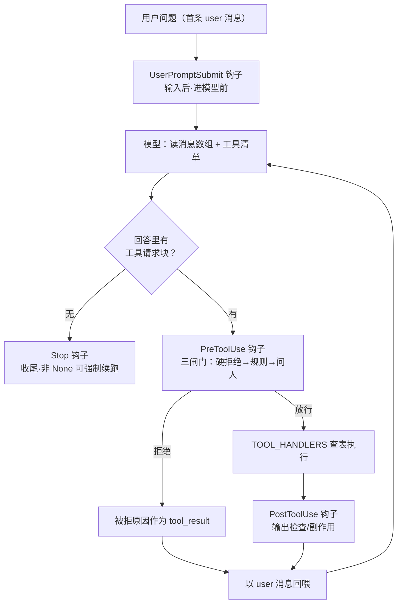
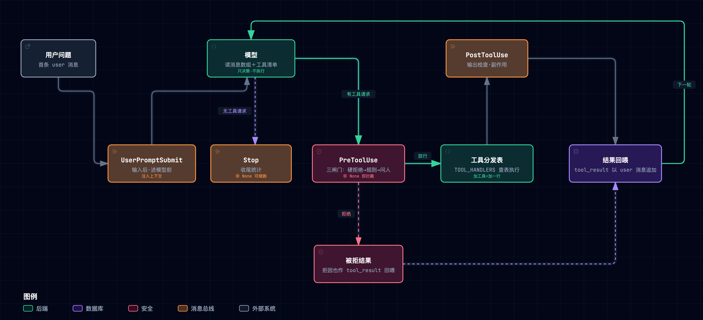

# ① 工具与执行：一个循环，和挂在它外面的东西 —— Learn Claude Code（s01–s04）精读与通俗拆解

> [1] shareAI-lab, "Learn Claude Code（课程站点·工具与执行 s01–s04）," 2026. [Online]. Available: https://learn.shareai.run/zh/s01/（s02/s03/s04 同构；2026-09-30 实况快照，版本差异记录见文末「版本与信源说明」）。所据站点版本晚于课程源仓 main 轨 [2] 的部分内容，差异已在文中逐处标注。

**一句话定位**：一个能干活的 AI 编程助手（这类自主干活的程序就叫 agent），等于一个 30 行的「调模型 → 执行 → 把结果喂回去」循环，加上三样挂在循环外面的东西——一张可注册的工具表、一道前置的权限闸门、一圈按点位挂载的钩子；四节课程一百多行代码的演进里，循环本体几乎一行没改 [1]。

**导读**：聊天模型早就能写出 shell 命令（共识），但它只会「说」——不会自己执行、看不到结果，人被迫当人肉中间层；而且能力、安全、扩展三类需求如果都往主程序里塞，程序很快认不出来（痛点）。本文回答：最小可用 agent 的构成部件是什么？它怎么一步步长成 Claude Code 的样子？（问题）四节各拆一层：循环（s01）、工具表（s02）、权限闸门（s03）、钩子（s04），每层配一条具体输入从头到尾的走查，和一套可以亲手复跑的拆解实验（答案；实验见「动手实验室」）。

> [!TIP]
> **白话主线**：模型只出主意，程序只干活——把「执行命令、结果原样回喂、再让模型看」写成一个 while 循环，最小 agent 就诞生了。加能力不靠改循环：工具名和处理函数做成一张表，加工具就是加一行。bash 能删库，所以工具执行前立一道闸门，按「永远不行 → 看情况 → 问人」三档、固定顺序放行。日志、权限、收尾这类围绕循环的需求，则挂到循环的四个固定点位上，循环本体回归零改动。生产级 Claude Code 那个 1729 行的核心文件，核心仍是这 30 行循环，其余全是保护壳 [1]。

## 1. 它要解决什么问题

先看三个真实处境，它们分别对应后面三节：

1. **模型有手无脚**。你对模型说「帮我看看目录里有什么、跑一下那个脚本」，它能写出命令，但输出完就停了——不执行、看不到结果、更不会接着推理。你手动跑一遍、把输出粘回对话框，下一个命令出来再跑再贴。每一个来回，你都在给模型当手脚 [1]。
2. **会说命令不等于会安全地执行**。给模型一个不受限制的 bash（直通系统命令的执行通道），让它「清理一下项目」，它可能执行整盘删除。把安全的关口押在对模型的信任上靠不住，得押在代码上——判断必须发生在工具执行之前 [1]。
3. **扩展需求会弄脏核心**。想记录每次工具调用？想操作后自动 git add？如果每个需求都改主循环，循环很快变成谁也认不出的线团 [1]。

| 设计规格 | 通俗版 | 对应机制 |
| :--- | :--- | :--- |
| 模型与真实世界之间要有「执行 + 回喂」通道 | 别让人当手脚 | s01 循环 |
| 加能力不改核心 | 加工具 = 表上加一行 | s02 分发 |
| 危险操作在执行前被拦下 | 永远不行 → 看情况 → 问人 | s03 权限 |
| 横切需求（日志、权限这类每种工具都沾边的公共需求）挂在循环外 | 扩展 = 挂回调，不是改循环 | s04 钩子 |

## 2. 全貌解剖：一个循环，三样挂件

| 层级 | 部分 | 回答的问题 | 在本笔记的位置 |
| :--- | :--- | :--- | :--- |
| 地基 | 循环（s01） | 模型怎么「持续行动」？靠什么信号继续/停止 | §3 |
| 地基 | 工具表（s02） | 加能力为什么不用改循环 | §4 |
| 地基 | 权限闸门（s03） | 危险操作怎么拦 | §5 |
| 地基 | 钩子（s04） | 扩展怎么不弄脏循环 | §6 |
| 证据层 | 教学版 ↔ 生产版距离 | 差距在哪、为什么存在 | §7 |
| 证据层 | 三轨版本漂移实测 | 站点 / 源仓 / 官方文档的时点差异 | §7 与文末 |

因果脉络一条线读下来：

```
观察：模型只会输出命令不会执行，人肉回贴结果
  ↓ 归因
模型与真实世界之间缺一个「执行＋回喂」的运行框架，
且加能力、加安全、加扩展都必须不动核心循环
  ↓ 设计规格（四节共同的总纲）
能力靠注册（一张表）· 安全靠前置（一道闸）· 扩展靠外挂（一圈钩子）· 循环零改动
  ↓ 机制
s01 while 循环 ＋ 两信号 → s02 查表分发 → s03 三闸门 → s04 钩子注册表（闸门迁入 PreToolUse 钩子）
  ↓ 证据闭环
教学四版代码递进（循环体不变）＋ 生产版源码对照 [1] ＋ 官方文档交叉 [3][4][5] ＋ 本仓原型拆解实验（§8）
```

一张全景图把四个点位连起来看（结论先说：所有扩展能力——工具、权限、日志、收尾——都长在循环的四个固定触点上，循环本体从 s01 到 s04 只换过一行取值方式）：


```mermaid
flowchart TD
    IN["用户问题（首条 user 消息）"] --> UPS["UserPromptSubmit 钩子<br/>输入后·进模型前"]
    UPS --> MODEL["模型：读消息数组 + 工具清单"]
    MODEL --> SIG{"回答里有<br/>工具请求块？"}
    SIG -- 无 --> STOP["Stop 钩子<br/>收尾·非 None 可强制续跑"]
    SIG -- 有 --> PRE["PreToolUse 钩子<br/>三闸门：硬拒绝→规则→问人"]
    PRE -- 拒绝 --> DENY["被拒原因作为 tool_result"]
    PRE -- 放行 --> DISP["TOOL_HANDLERS 查表执行"]
    DISP --> POST["PostToolUse 钩子<br/>输出检查/副作用"]
    DENY --> FEED["以 user 消息回喂"]
    POST --> FEED
    FEED --> MODEL
```



> 图源（可 diff 文本）：[`claude-code-tooling--loop-mounted-layers.mmd`](../../assets/mermaid/agent-harness/claude-code-tooling--loop-mounted-layers.mmd) · 交互版（下载到本地打开）：[`claude-code-tooling--loop-mounted-layers.html`](../../assets/architecture/agent-harness/claude-code-tooling--loop-mounted-layers.html)

值得按这个顺序学的理由：循环是地基，读懂它后面三节都只是「往哪儿挂」的问题；工具表和钩子表其实是同一个「查表」哲学的两副面孔——一张表扩展「能做什么」，另一张扩展「围绕做的事的检查与收尾」；权限闸门则演示了一个反直觉的安全铁律：多道检查叠加时，**允许**必须每一道都说允许，任何一道**禁止**都直接否决（最严者胜，不是最后说的算）。

阅读前只需三个就地讲清的前置认识（后文首次用到时还会再点一次）：

- **消息数组**：模型 API 只认一串带角色标签的消息——`user` 是提问方、`assistant` 是回答方，一问一答交替排列。这是协议规定，不是拟人。
- **工具请求块（tool_use）与停止标记（stop_reason）**：模型「举手要工具」有两条通道——回答内容里出现 `tool_use` 块；回答尾部带一个 `stop_reason` 标记（是否等于 `tool_use`）。两条通道通常同时出现。
- **JSON Schema**：一段「这个工具叫什么、吃哪些参数」的结构化说明书，随对话发给模型，让它知道自己能调什么。

## 3. 循环（s01）：把「人肉中间层」写成 30 行代码

把你在做的事交给程序：把问题连同工具清单发给模型 → 模型回答；回答里带着工具请求，程序就真的执行，把结果作为一条新消息放回对话，再次发给模型；回答里没有工具请求，说明模型认为做完了，退出。模型从头到尾只做决策（要不要用工具、用哪个），程序只做执行和回喂 [1]。

落到代码，教学版核心函数拢共五步 [1]：

```python
def agent_loop(messages):
    while True:
        response = client.messages.create(
            model=MODEL, system=SYSTEM, messages=messages,
            tools=TOOLS, max_tokens=8000,
        )
        messages.append({"role": "assistant", "content": response.content})
        if response.stop_reason != "tool_use":
            return
        results = []
        for block in response.content:
            if block.type == "tool_use":
                output = run_bash(block.input["command"])
                results.append({
                    "type": "tool_result",
                    "tool_use_id": block.id,
                    "content": output,
                })
        messages.append({"role": "user", "content": results})
```

拿一条具体输入走一遍（输入：`List all Python files in this directory`）[1]，看消息数组怎么一步步演变：

1. `user`:「List all Python files…」——你的问题成为第一条消息。
2. 程序把消息数组 + bash 工具清单发给模型；`assistant` 回答追加进数组，内容是一个 `tool_use` 块（`command="ls *.py"` 一类），尾部 `stop_reason="tool_use"`。
3. 程序执行命令，把输出装进一条 `tool_result`，**以 `user` 角色**追加为新消息——协议只认两种角色，工具结果必须借「提问方」的信封回传；模型上一次的回答已经定稿，不能往回塞。
4. 再次调用模型。这次模型看到文件列表，给出最终文字回答，没有工具请求——循环退出。

为什么判断「继续/停止」只看「有没有工具请求」？因为模型每一轮都在「说话」，说没说不构成信号；唯一能把「还有活」和「做完了」区分开的，是它有没有举手要工具 [1]。

生产版怎么写这一段？课程对 Claude Code 核心文件 `query.ts`（1729 行）的核查结论：核心仍是这 30 行循环，但续轮判据不一样——CC 不拿 `stop_reason` 当唯一依据，而是维护一个 `needsFollowUp` 标志：流式输出（模型的回答是一件一件送到、不是整段一次性到齐）时，`stop_reason` 可能还没送达，而 `tool_use` 块已经出现在正文里了；只要看到 `tool_use` 块就置真、继续循环 [1]。源码注释原话点破：「stop_reason === 'tool_use' is unreliable」。其余的 1700 行是退出路径（阻塞上限、提示过长、模型报错、中止、钩子停机、轮次上限等）与流式执行器这类保护壳 [1]。课程的代码仓库（源仓）里，可运行的运行版代码已经跟进这个思路：教学循环改为「收集回答里的工具请求块、空则退出」[2]——站点页面仍先教 `stop_reason` 两信号表，把差异留给附录 [1]，这是同一课程家族内部的教学口径分叉（见 §9 争议 2）。

这个分叉不是纸上谈兵。本仓拆解实验 1（§8）实测：当模拟流式响应的 `stop_reason` 迟到（置空）而正文已带工具请求时，只看 `stop_reason` 的教学判据让循环**第一轮就退出、一个工具都没执行**；看内容块的生产判据正常跑完 3 轮、执行 2 个工具。用迟到的信号当判据，任务半途而废。


循环不是智能，是让智能能持续行动的最小运行框架；「继续」的唯一依据是模型还在举手。

## 4. 工具表（s02）：加一个工具，只加一行

s01 的模型只有一个 bash：读文件要拼 `cat`、写文件要 `echo ... >`、找文件要 `find`——模型想的是「读这个文件」，却要先翻译成命令，多一层翻译就多一层出错机会，还浪费篇幅 [1]。解决思路不是把循环改聪明，而是把「工具名 → 处理函数」做成一张表：像公司前台的总机分机表，新开一个部门只需在表上加一行，接线员（循环）永远只做「查表转接」一个动作。加工具 = 在 `TOOLS` 数组加一条说明 + 在 `TOOL_HANDLERS` 字典加一行映射，循环不变 [1]。

五个工具各就各位，文件类工具统一过一个路径安全检查（不许逃出工作区）[1]：

```python
TOOL_HANDLERS = {
    "bash": run_bash, "read_file": run_read, "write_file": run_write,
    "edit_file": run_edit, "glob": run_glob,
}
# 循环里只改了一行——从硬编码 run_bash 变成查表：
handler = TOOL_HANDLERS[block.name]
output = handler(**block.input)
```

换一条输入再走（输入：`Read both README.md and requirements.txt, then create a summary file`）[1]：模型一轮可以返回**多个** `tool_use` 块：两个 `read_file` 加一个 `write_file`。教学版按回答里出现的原始顺序逐个执行，每个请求各产生一条 `tool_result`，打包成一条 `user` 消息回喂。顺序执行意味着「同时跑会不会互相踩」这个问题在教学版不存在——它压根不并发 [1]。

生产版怎么排多个工具？CC 的做法是按「连续块」分批 [1]：把一串工具调用按原始顺序扫描，连续的、可以并发的编进同一批真正并行跑（有并发上限），遇到不能并发的就单独开批串行，批与批之间严格保序。能不能并发**不是按工具类型**判断，而是按这次的具体输入判断——`Bash ls`（只读）可以并发，`Bash rm`（写）不行；`TaskCreate` 虽然写任务状态，但每次写的是不同文件，照样可以并发 [1]。此外 CC 的每个工具调用过五步验证（schema 校验 → 工具级参数校验 → PreToolUse 钩子 → 权限检查 → 执行），结果超过上限会落盘成「预览 + 文件路径」，读文件工具的上限设为无穷大——否则「读文件 → 输出落盘 → 再读落盘文件」会无限套娃 [1]。

本仓拆解实验 2（§8）实测了查表的失败形态：把表里 `edit_file` 那一行删掉、并把取值方式改成硬索引（`TOOL_HANDLERS[name]` 而不是 `.get(name)`），模型再调 `edit_file` 时程序当场抛 `KeyError` 崩溃、整轮结果消息都没生成；软查表 `.get` 的对照写法只会得到一条 `Unknown: edit_file` 回喂给模型自纠。同一张表，取值方式决定「未知工具」是「程序停摆」还是「模型改道」。


能力增长的单位是「表项」不是「代码改动」；查表这一行，就是循环与能力之间的全部接口。

## 5. 权限闸门（s03）：执行之前，先过三道关

像机场安检的三道检查：违禁品直接没收（永远不行）、超量液体要申报问询（看情况、问人）、普通行李直接放行（三档都没命中）。检查顺序固定——先过违禁品关，再谈申报 [1]。循环完全保留，唯一变动是工具执行前插入一次 `check_permission()`：

| 闸门 | 作用 | 命中后 |
| :--- | :--- | :--- |
| 1. 拒绝列表 | 永远禁止的操作（整盘删除、提权命令） | 直接拒绝，不执行也不问人 |
| 2. 规则匹配 | 取决于上下文的操作（写工作区外、命令带删除词） | 交给闸门 3 |
| 3. 用户审批 | 闸门 2 命中后暂停等确认 | 用户决定允许或拒绝 |

三道都没命中 → 直接执行，日常大多数操作走这条路 [1]。这个比方到安检为止：它并不负责告诉你「哪些词算违禁」，规则细节要看下面这张实测分路表。

教学版拒绝表是七条字符串；规则就两条——文件工具要写工作区外的路径，bash 命令里带删除词（`rm `）、向系统目录写入（`> /etc/`）或改权限位（`chmod 777`）这类关键词。这层匹配是教学示意而非可靠安全边界，下面这张表会把它的两面都露出来 [1]。用五条具体命令走一遍（五条均已在本仓原型 `--pred gates` 逐条实跑，见 §8）：

| 命令 | 闸门 1 | 闸门 2 | 最终 |
| :--- | :--- | :--- | :--- |
| `rm -rf /` | 命中（整盘删除） | —— | 拒绝 |
| `rm -rf /tmp/cache` | **命中**（子串 `"rm -rf /"` 同样匹配一切绝对路径删除） | —— | 拒绝 |
| `rm -rf ./tmp/build-cache` | 未命中（相对路径） | 命中（含 `rm `） | 问用户 |
| `sudo ls` | 命中（`sudo`） | —— | 拒绝 |
| `cat /etc/hosts` | 未命中 | 未命中 | 放行 |

这张表同时暴露字符串匹配的两面：**过拦**（凡是绝对路径的递归删除——从文件系统最顶层一路往下删——都被连带拦下）与**漏拦**（换个写法、加层 shell 展开就可能绕过）。课程自己把话说明白了：这只是教学示意，「简单字符串匹配不是可靠安全机制，命令变体和 shell 展开可能绕过」[1]。课程源仓的运行版已经在补这个洞——闸门 2 加入了一条词边界正则（匹配独立的 `rm`/`del` 词，`model`、`delimiter` 这类假阳性不再误伤），并把「工作区外」检查扩到读文件工具 [2]；站点页面尚未同步这版 [1]。

顺序为什么不能换？把「问用户」放最前，每条无害命令都要烦人；把「永远不行」放最后，危险命令可能先被别的规则放行。生产版再加一条铁律：**任何环节说了「允许」，都不能推翻配置里写死的「禁止」**——安全决策取最严的，不取最后的 [1]。本仓拆解实验 3（§8）实测了调序的代价：把规则提到最前、用户顺手按了一个 `y`，整盘删除命令真的被执行，虚拟文件系统从 4 个文件变成 0 个。

生产版的闸门长什么样？CC 的权限结论不是三种而是四种行为（允许 / 拒绝 / 询问 / 「本工具不表态、交通用管线」，最后这种最终也转成询问）；规则不是一张本地表，而是从 8 个来源（用户级、项目级、本地级、功能开关、企业策略、命令行参数、内联命令、会话内授权）分层合并，高优先级覆盖低优先级 [1]；官方文档对「设置文件分层覆盖」给出了同构口径（企业托管 > 命令行 > 项目本地 > 项目共享 > 用户级）[5]。两个容易误会的细节：`isDestructive()` 只管界面上的红色标签、不参与权限决策 [1]；自动模式下有一个「分类器」把工具调用连同对话上下文发给一个判断模型决定能否自动批准，连拒太多次会回退人工 [1]——官方权限模式谱系（手动 / 接受编辑 / 计划 / 自动 / 不问 / 全跳过）正是「问多少」这个连续谱的产品化 [4]。


安全闸门的全部设计只有一句话——最严的检查最先、且否决权不可被推翻；表里写什么是策略，顺序与合取（几道检查都点头才算过）是机制。

## 6. 钩子（s04）：挂在循环上，不写进循环里

s03 之后想再加「记录每次调用」「操作后自动 git add」，难道再改一次循环？换一种挂法：循环在四个固定点位喊一声「出事了，谁管」——输入提交后、工具执行前、工具执行后、循环退出前；每种扩展写成一个回调函数（一段登记在册、到点自动执行的小函数），注册到对应点位上。循环只负责喊，不认识任何具体检查 [1]。

注册表就是一个字典：事件名映射到回调列表；注册是往列表里追加，触发是依序执行、**谁的返回值不是 `None`（编程里表示「什么都没说」的空值）谁就喊停** [1]：

```python
def trigger_hooks(event, *args):
    for callback in HOOKS[event]:
        result = callback(*args)
        if result is not None:   # 返回值 ≠ None → hook 说"停"
            return result
    return None
```

| 事件 | 触发时机 | 典型用途 |
| :--- | :--- | :--- |
| UserPromptSubmit | 用户输入提交后、进入模型前 | 输入验证、注入上下文 |
| PreToolUse | 工具执行前 | 权限检查、日志记录 |
| PostToolUse | 工具执行后 | 副作用（自动 git add 等）、输出检查 |
| Stop | 循环即将退出时 | 收尾清理、可强制续跑 |

返回值的语义是**非对称**的：同样是「非 `None`」，挂在 PreToolUse 上是踩刹车（本次工具不执行、拒因回喂模型），挂在 Stop 上是踩油门（把这句话注入对话、循环继续跑）[1]。s03 的权限逻辑原封不动迁进一个 PreToolUse 回调，循环里那行 `check_permission(block)` 换成 `trigger_hooks("PreToolUse", block)`——扩展点从「改循环」变成「注册回调」[1]。

再用 §5 分路表里的 `rm -rf ./tmp/build-cache` 走一遍 s04 链路（逐行为本仓原型实测日志）：用户输入后先过 UserPromptSubmit（打印工作目录提示）；模型举手后，PreToolUse 链按注册顺序执行——权限回调先跑：命中规则、暂停问用户；用户答 `y`，权限回调返回 `None`（放行），轮到日志回调打印 `HOOK PreToolUse log: bash(...)`；然后查表执行、PostToolUse 检查输出、结果以 `user` 消息回喂。下一轮模型若无新请求，Stop 回调统计本会话工具调用次数后放行停机 [1]。

注意一个细节：**被拒的调用连日志回调都轮不到**——权限回调返回了非 `None`，触发函数立即短路返回，后面的回调不再执行。这是「谁先喊停谁负责」的自然结果。

**生产版的钩子长什么样**。CC 实际有 27 个事件（工具相关、会话相关、用户交互、子代理、压缩、团队协作……），教学版只讲覆盖一个完整回合的 4 个 [1]——而官方文档今天的实况已经列出 33 个（新增了消息展示、目录变更、模型切换等 6 类），数字本身也在长 [3]。返回值从「`None` 与否」扩展成 14 个字段（阻塞错误、阻止后续、权限行为、改写输入、附加上下文……）[1]。三条生产级保护最值得记：其一，**钩子说「允许」越不过配置里的「拒绝/询问」**——课程称这是 CC 权限系统最重要的安全设计，教学版没有这一层，「在生产环境中会形成安全漏洞」[1]；其二，`stopHookActive` 防无限循环——Stop 钩子报错后循环带着这个标志重入，后续迭代看到标志就不再被同一个钩子拖着跑 [1]，官方文档证实了这个字段的存在与用途，并追加了「连续强制续跑 8 次即硬停」的上限 [3]；其三，PostToolUse 可以「优雅停机」（返回阻止继续的字段，让代理完成任务式收束，不是崩溃）[1]。

本仓拆解实验 4、5（§8）实测了这套语义的脆弱点：把「`None` 当放行」反转成「`None` 当阻止」，没有一个工具能执行、Stop 钩子也被劫持成无限续跑直到轮次封顶；把防循环标志拿掉，一个总在报错的 Stop 钩子让代理冲到 100 条消息的封顶才停（有防护时 3 条消息内正常停机）。「非 `None` 才喊停」是钩子的契约，契约一反，全盘皆输。

**一句话点破本节**：钩子把「围绕循环的需求」从核心里搬出来，代价是所有扩展共享一套必须严格遵守的返回值契约——点位是循环的，语义是大家的。

## 7. 关键实证数字与三轨漂移

| 事实 | 关键数字 | 条件 · 截至日期 | 一句话读法 |
| :--- | :--- | :--- | :--- |
| 站点宣称各节代码体量 | 102 / 135 / 180 / 232 行 | 站点页首徽章，2026-09-30 [1] | 教学叙事的「体感进度尺」 |
| 源仓实况代码体量 | 151 / 206 / 267 / 280 行 | main 轨 `wc -l` 实测 @ `ce8f9f18` [2] | 运行版比叙事版厚——徽章描述的是更早的教学版 |
| CC 核心文件体量 | `query.ts` 1729 行 | 材料所读时点 [1] | 「核心是 30 行、其余是保护壳」的参照系 |
| CC 钩子事件数 | 材料 27 个 → 官方今日 33 个 | [1] vs 官方文档 2026-09-30 [3] | 事件清单在持续生长，数字要带日期读 |
| CC 续轮状态字段 | State 10 个字段 | 材料所读时点 [1] | 教学版只用到其中的 messages |
| 权限规则来源 | 8 个来源分层合并 | 材料所读时点 [1]；官方分层口径 [5] | 「一张本地表」是教学压缩 |
| Stop 强制续跑上限 | 连续 8 次即硬停 | 官方文档 2026-09-30 [3] | 防无限循环的双保险（标志之外再加计数上限） |

三条核心宣称的独立证据情况：27 个事件数与 `stop_hook_active` 字段在官方文档获得交叉证实（且前者已演进为 33）[3]；设置来源分层覆盖获官方文档同构支撑 [5]；其余源码行号级论断（`query.ts:830` 一类）来自材料对闭源源码的阅读，无法独立复核——见「材料没有证明的事」。

三轨（站点 / 源仓 / 官方）不是同一时点的三张照片：站点叙事晚于源仓 main 的部分工程改进（s01 续轮判据、s03 词边界正则已进源仓 [2]、站点未同步 [1]），官方文档又晚于材料所读的源码时点（事件数 27→33 [3]）。本笔记以站点叙事为主材料、以「分歧即标注」处理三轨差异；逐字快照与漂移判定记录存于仓库 `.temp` 实验室（随清理消失，判定结论均已写入本节）。

## 8. 动手实验室

原型两份同源：仓库资产版 [`assets/cc_tools_lab.py`](./assets/cc_tools_lab.py)（长期保存）与 `.temp` 实验室版（随清理消失）。纯标准库、确定性 mock 模型、虚拟文件系统——材料里的模型角色全部脚本化替代，原型回答「机制是否自洽」，不回答「模型是否聪明」。运行：`uv run --no-project python docs/research/agent-harness/assets/cc_tools_lab.py --selftest`（全场景断言）或 `--exp 1..5` / `--pred t4|t5|gates`，产物落脚本旁 `.lab_out/`（与仓内其他 lab 同口径，不随执行目录漂移）。

机制 → 代码行号速查（`cc_tools_lab.py` 资产版）：

| 机制 | 位置 |
| :--- | :--- |
| 虚拟文件系统与五个工具实现 | `VFS` 类（L24）、`bash`（L45） |
| 确定性 mock 模型（`stop_reason` 可迟到） | `MockModel`（L100） |
| 工具分发表 | `make_handlers`（L121） |
| 闸门 1/2/3 | `check_deny_list`（L135）、`check_rules`（L141）、`ask_user`（L151）、`check_permission`（L155） |
| 钩子注册表与触发 | `make_hooks`（L172）、`register_hook`（L175）、`trigger_hooks`（L178） |
| s04 完整引擎 | `run_agent`（L187）、默认钩子组（L236） |

破坏性实验实测退化（每次只拆一个机制，逐字取自实际运行日志）：

| # | 改了什么 | 实测观察到什么 | 教训一句话 |
| :--- | :--- | :--- | :--- |
| 1 | 续轮判据只信 `stop_reason`，且模拟流式使其迟到 | 教学判据：1 轮即停、0 个工具执行；生产判据（看内容块）：3 轮跑完、2 个工具执行 | 用迟到的信号当判据，任务半途而废 |
| 2 | 分发表删掉 `edit_file` 项 + 改硬索引取值 | `KeyError: 'edit_file'` 当场崩溃，整轮 tool_result 未生成；软查表对照只得 `Unknown: edit_file` 回喂自纠 | 查表的失败形态由取值方式决定 |
| 3 | 闸门调序（规则→问用户在前，硬拒绝殿后），用户按 `y` | 虚拟文件系统 4 个文件 → 0 个，整盘删除真的执行了 | 「永远不行」必须最先，否则被一句同意放走 |
| 4 | 钩子返回值语义反转（`None` 当阻止） | 0 个工具成功执行，Stop 钩子被劫持成无限续跑直到 50 轮封顶 | 「非 `None` 才喊停」是全部扩展共享的契约 |
| 5 | 拿掉 Stop 防循环标志，Stop 钩子永远要求续跑 | 无防护：冲到 100 条消息封顶不停；有防护：3 条消息内正常停机 | 防循环标志是停机权的最后一道闸 |

原型只证明机制逻辑按上述描述运作，不构成对材料数字的复现；实验里的虚拟文件系统、50/100 条封顶均为本仓玩具域参数。

## 9. 底层规律与核心争议

### 规律 1：决策与执行分离
模型只出主意（要不要用工具、用哪个），程序只干活（执行 + 结果原样回喂），两边靠一个循环焊在一起 [1]。没有这层分离，人就是那个循环。模块边界沿「会变的决策」与「不变的机制」切开，正是经典模块化文献的主张 [7]。

### 规律 2：对扩展开放、对循环关闭
加能力 = 表上加一行；加横切需求 = 点位上挂一个回调。循环本体零改动 [1]。这是开闭原则在 agent 框架里的查表形态 [8]——工具表与钩子表是同一哲学的两副面孔，分别扩展「能做什么」与「围绕做的事」。

### 规律 3：安全决策取最严者
多道检查叠加时，「允许」必须每一道都允许才成立，任何一个「禁止」直接否决；硬拒绝最先、且钩子的允许翻不了配置的案 [1]。这是最小权限与故障安全默认的合取形态 [9]。

### 规律 4：判据选先到且稳定的信息源
「还要不要继续」这个判断，教学版看尾部标记、生产版看正文里有没有工具请求块——因为流式输出时标记会迟到而请求已到 [1]。信号选择的第一标准不是「语义最贴切」而是「到达最早且语义稳定」。

### 规律 5：简化保骨架、砍规模
教学版每层简化都保留因果骨架（三档保序、四点位俱全），只砍规模（27 事件→4、8 来源→1、多阶段→三闸门）[1]。骨架在，规模可以后来长回来——源仓正则补丁、官方事件清单的生长都是规模在长、骨架未动 [2][3]。示例先行、逐步抽掉细节的教学法有实证支撑 [10]。

五条分别管：职责分界（1）、演化方式（2）、安全语义（3）、观察可靠性（4）、认知负荷（5）——合起来是「一个循环如何长成一个框架」的全部取舍面。

### 争议 1：权限审批自动化到什么程度
一派坚持危险边界必须人来把关、每次都问（手动模式）；一派用分类器在后台自动批（自动模式），连拒太多次才回退人工 [1]。两派看到不同的失败模式：前者怕自动放行的破坏，后者怕审批疲劳——问得太多，用户就会无脑全同意，等于没问。这是「误放行代价」与「误打扰代价」的连续谱选址问题，不可消解只可对冲；官方至今把两端（手动 / 全跳过）都留在产品里 [4]。

### 争议 2：第一课的续轮判据教哪个
站点教 `stop_reason`（把继续/停止浓缩成一个字段，第一课就懂）；源仓 README 与代码已改为「数内容里的工具请求块」（与生产行为一致、流式下不踩坑）[1][2]。分歧本体是第一课优先「概念最简」还是「行为最真」。两派都对——课程的解法是分层：正文教字段、附录揭差异，本笔记的实验 1 则把这个差异做成了可运行的分岔。

### 争议 3：钩子的能力边界
一派把钩子当全能扩展点（能允许、能拒绝、能改输入、能塞上下文）；一派坚持钩子只能「看」，放行与否必须归权限层。分歧本体是扩展能力与安全边界的划界。生产版给出了工程裁决：能力给足、否决权不给——钩子的「允许」越不过配置的「禁止/询问」[1]；教学版省略此层，材料自认这在生产环境会成安全漏洞 [1]。

## 10. 适用边界

### 成立条件
- **定义域**：单进程终端 agent、单一消息数组、本地工具——教学机制在此域内自洽（原型全场景断言通过）。
- **成立工况**：教学机制面向「读懂原理」的最小复现；生产对照论断以材料所读 CC 源码时点为准，官方文档仅部分可交叉 [3][5]。
- **非目标（Out-of-Scope）**：s05–s20（规划、记忆、并发、多 agent 平台）不在本笔记范围；CC 闭源源码的逐行验证不可行；真实大模型的行为质量（「聪明不聪明」）不是本域问题；教学代码不构成生产可用的安全实现。

### 材料没有证明的事
1. 「1729 行的核心就是 30 行循环」是修辞性等价：材料没有量化保护机制的行数占比，「核心」是教学定位而非测量结论。
2. 源码行号级论断（`query.ts:830-834` 等）不可独立复核——CC 闭源；官方文档只能部分交叉（`stop_hook_active` 已证实、事件数已演进）[3]。
3. 「教学版三闸门在教学场景够用」的边界本身在移动：字符串匹配可被绕过系材料自认，但绕过面未量化；源仓已补词边界正则而站点未同步 [1][2]。
4. 站点代码体量徽章（102/135/180/232 行）与源仓实况（151/206/267/280 行）不同版，材料未说明口径。
5. 「读文件工具上限设为无穷大以防落盘套娃」是材料对 CC 行为的转述，无独立证据；教学版无此机制亦无实验。

## 11. 用户自测与费曼研讨套件

1. 「1729 行的核心就是 30 行循环」——你会怎么验证或反驳这句话？（提示：先想「核心」和「保护壳」分别怎么度量，再想哪些证据可得、哪些不可得。）
2. 现在要给教学版加一个「每次工具执行限时 10 秒」的需求：你会挂钩子、改分发表、还是改循环？三种位置各会把复杂度放到哪里？
3. 「钩子的允许不能推翻配置的禁止」——这条铁律防的具体是什么场景？如果拿掉它，攻击者（或一个被误导的模型）最短的一条路是什么？

## 版本与信源说明

- 本篇所据三轨版本与逐句核对记录存于仓库临时工作区，随清理消失；核对结论已并入「关键实证数字」节。
- 课程章节编号存在新旧两轨（站点 20 节制 vs 源仓旧 12 节制，`s03/s04` 同号不同物），章号与视频集的归属对照以系列信源地图为唯一事实源 [6]，本笔记不另行维护。

## 参考（IEEE）

[1] shareAI-lab, "Learn Claude Code（课程站点·工具与执行 s01–s04，2026-09-30 实况快照）," 2026. [Online]. Available: https://learn.shareai.run/zh/s01/（s02/s03/s04 同构 URL）

[2] shareAI-lab, "learn-claude-code — Bash is all you need: a nano claude code–like agent harness, built from 0 to 1," GitHub repository, main 轨 @ commit `ce8f9f18`，Sep. 28, 2026（取数 2026-09-30）. License MIT. [Online]. Available: https://github.com/shareAI-lab/learn-claude-code

[3] Anthropic, "Claude Code Docs: Hooks reference," 2026. [Online]. Available: https://code.claude.com/docs/en/hooks (accessed Sep. 30, 2026).

[4] Anthropic, "Claude Code Docs: Configure permissions," 2026. [Online]. Available: https://code.claude.com/docs/en/permissions (accessed Sep. 30, 2026).

[5] Anthropic, "Claude Code Docs: Settings files and precedence," 2026. [Online]. Available: https://code.claude.com/docs/en/settings (accessed Sep. 30, 2026).

[6] 本仓, "系列信源地图：claude-code-explained," apps/negentropy-influence/source-map/claude-code-explained.md.

[7] D. L. Parnas, "On the criteria to be used in decomposing systems into modules," Commun. ACM, vol. 15, no. 12, pp. 1053–1058, 1972, doi: 10.1145/361598.361623.

[8] B. Meyer, Object-Oriented Software Construction, 2nd ed. Upper Saddle River, NJ, USA: Prentice Hall, 1997.

[9] J. H. Saltzer and M. D. Schroeder, "The protection of information in computer systems," Proc. IEEE, vol. 63, no. 9, pp. 1278–1308, 1975, doi: 10.1109/PROC.1975.9939.

[10] R. K. Atkinson, S. J. Derry, A. Renkl, and D. Wortham, "Learning from examples: Instructional principles from the worked examples research," Rev. Educ. Res., vol. 70, no. 2, pp. 181–214, 2000, doi: 10.3102/00346543070002181.
