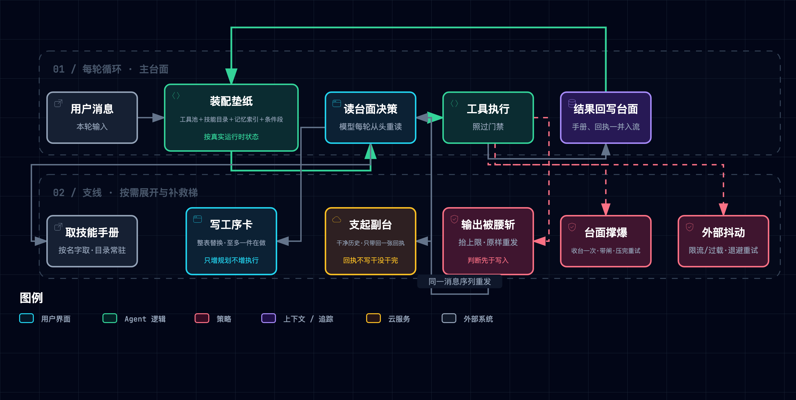

# ② 规划与协调：模型的视野是被安排出来的

> **一句话本质**：它每一轮都把台面从头重读一遍——所以「看见什么」从来不是它自己说了算。

---

## 1. 这一层要解决什么问题

[① 工具与执行](./171-claude-code-tooling-execution.md)交付了一台能动手的机器：传送带一趟趟把活送上来，门禁决定哪些活允许上机器。但它留下一个它自己无法解决的缺口——**师傅手很快，却从不记事**。每一轮他都要把台面上摊着的东西从头读一遍，才知道自己是谁、有什么工具、刚才干到哪儿。于是台面上摊了什么，成了比模型有多聪明更要紧的事：工具结果一轮轮堆上去，开工时定下的规矩被摊薄成台面角落的一小块；探查一条调用链读了十个文件，十份中间物从此长住台面；三份规范全焊在垫纸上，每轮都付全额，而这单只用得上其中一份。这一层不给模型增加任何新能力，它做的全部事情是**安排他的视野**——决定每一轮开工时，台面上该摊着什么、不该摊着什么。

| 上一层留下的缺口 | 本层机制 | 大白话 |
|:---|:---|:---|
| 活一多就忘了整件事要干什么，十步重构做到三步开始即兴发挥 | **M1 待办清单**：整表替换 + 提醒回路 | 把「还剩什么」重新钉回每一轮都看得见的地方 |
| 探查类子任务留下大量一次性中间物，挤占后续所有轮次 | **M2 子 agent**：另起干净历史，只回一条结论 | 过程另开一摊，干完只把结论端回来 |
| 全部规范焊进系统提示，每轮付全额 token，用上的只有一份 | **M3 技能渐进披露**：目录常驻、正文按需 | 先让他知道有什么，要用时再把手册递过去 |
| 系统提示写死，与外部服务连没连上、磁盘上有没有那份东西脱节 | **M4 系统提示装配**：每轮按运行时状态重建 | 每轮重铺垫纸，铺什么看真实状态 |
| 一次截断、一次超长、一次限流，整轮白干 | **M5 错误恢复**：三类失败分治 | 三种摔法各有各的下法，且都要有闸 |

---

## 2. 机制全景



> 图源（可 diff 文本）：[`claude-code-planning--planning-panorama.mmd`](../../assets/mermaid/agent-harness/claude-code-planning--planning-panorama.mmd) · 交互版（下载到本地打开）：[`claude-code-planning--planning-panorama.html`](../../assets/architecture/agent-harness/claude-code-planning--planning-panorama.html)

读法：左半边（重铺 → 常驻 → 按需展开）决定**这一轮他能看见什么**；右半边决定**看错了、撑爆了、外面抖了以后怎么接着来**。五个机制没有一个改动了传送带本身。

---

## 3. M1 · 工序卡：待办清单

> [!TIP] **类比**
>
> 师傅记不住整单活，于是在台面上钉一张工序卡。改卡的规矩很轴：要换就整张换新的，写坏了那张不算数、旧卡原样留着；同一时刻只许有一道工序标着「正在做」。

这张卡**什么都不执行**——它唯一的副作用是改内存、打印、把渲染结果作为工具结果回传，既不碰文件系统也不碰 shell【一】。它增加的是规划能力，不是执行能力；站点把这条标为关键洞察【二】。

**四条不变式**：

| # | 不变式 | 证据 |
|:---|:---|:---|
| 1 | **整表替换**：一次调用用新列表整体覆盖旧列表，不存在增量补丁 | 先构造校验后列表，再整体赋回【一】 |
| 2 | **先校验、后替换**：任一条目非法即抛错，原列表保持原值——失败的更新不会留下半张卡 | 校验循环在赋值之前【一】 |
| 3 | **至多一件在做**：`in_progress` 计数超过一即拒绝；状态取值封闭为待办／进行中／已完成 | 计数判据显式拒绝【一】 |
| 4 | **无执行副作用**：工具处理函数只改内存与回显 | 函数体内无文件与 shell 调用【一】 |

**提醒回路**，以及它的两种落法——这是同一机制在两版实现里的分叉，讲「计数单位」时必须说清是哪一版：

| 版本 | 计数单位 | 提醒的投递方式 |
|:---|:---|:---|
| 单机制版 | **按轮**递增，连续若干轮没动过工序卡就发提醒 | 作为一个文本块**追加进当轮的工具结果列表** |
| 集成版 | **按工具调用**递增，调用的是工序卡就归零，否则加一 | 作为**独立的用户消息**在下一轮开头注入 |

两版都在发出提醒后立刻把计数归零，避免连发【一】。具体阈值随修订漂移，本文不固化。

**两套规划层并存**。集成版同时暴露两个工具：工序卡（会话内、内存、整表替换）与落盘的任务图（带依赖、可认领、有稳定 ID、按条更新生命周期）。README 的说法是前者防单 Agent 漂移、后者支撑团队协作【一】。「交互式默认任务图、非交互式默认轻量清单，另有环境变量强制开启」是课程作者拆过闭源产品源码后给出的分析【三】——**教学实现里没有任何模式判断分支**，两者在集成版中是并列暴露给模型的两个工具，选哪个由模型自己定，不由运行模式定【一】。

**因果**：设计动机是注意力稀释，不是遗忘。工具结果不断填满上下文，开工时那段系统提示的影响力被一轮轮摊薄，十步重构做到第三步就开始即兴发挥【二】。工序卡把「还剩什么」重新钉回每一轮的可见面上——**它救的是注意力，不是能力**。

> [!IMPORTANT] **实景**
>
> `s05_todo_write/code.py @ f9e8b28`
>
> 校验与替换的先后顺序，以及「至多一件在做」的判据：
>
> ```python
> if in_progress_count > 1:
>     raise ValueError("Only one todo can be in_progress at a time")
>
> self.items = validated
> ```
>
> 字符串输入先试 JSON 解析，失败再退到字面量求值，**全程不用 `eval`**【一】。

**口播落点**：它不增加动手的本事，只增加记得住的本事。

## 4. M2 · 副台：子 agent

> [!TIP] **类比**
>
> 遇到一件「要翻一堆东西才能确认」的活，师傅在旁边支起一张副台：那上面从空白开始，翻了什么、试错几次，都留在副台上。干完只端回一张回执，副台连同上面的一切当场作废。

**五条不变式**：

| # | 不变式 | 说明与证据 |
|:---|:---|:---|
| 1 | **干净历史** | 子循环的消息列表只有一条用户消息（任务描述），父对话一个字都不复制【一】 |
| 2 | **只回一条结论** | 单机制版取最后一轮的文本；集成版倒序扫消息、取最后一条有文本的助手消息。中间的工具调用与结果全部丢弃，不进父消息流【一】 |
| 3 | **轮数有上限** | 两版都有固定上限；**但撞上限的行为不同**（见下）【一】 |
| 4 | **隔离的是上下文，不是权限** | 子循环里每个工具调用照样先过前置钩子，被拦就把拦截原因当工具结果回填；放行后照样触发后置钩子【一】 |
| 5 | **副作用不隔离** | 父子同进程、同工作目录，写文件与 shell 命令落在同一个工作区【一】 |

**防递归写了两道**：子 agent 的工具清单里根本没有派生子 agent 的那个工具（能力上不可能），系统提示里另写一句不要再派 agent（集成版）【一】。**能力里的那一道才是硬的**——嘱咐只是补一句。

**一处实现毛刺，值得记住**：单机制版撞上限时返回一句显式的「未给出最终答案」占位串；集成版撞上限则**静默 fall through**，直接倒序取最后一段助手文本当结论回传【一】。父 agent 收到的工具结果与正常收敛**形状完全一致**——它无从区分「做完了」与「撞墙了」。这正是「只带回一张回执」这个类比的阴暗面：**回执上不写它有没有干完**。

**分叉模式属于闭源分析**。「另有一种 fork 模式为共享提示缓存而生，要求系统提示、工具、模型、消息前缀、thinking 配置五者逐字节一致才命中缓存，且其权限审批以冒泡方式回到父终端」——这是课程作者拆过闭源 Claude Code 源码后的结论【三】。教学实现**完全没有提示缓存概念**，因此这条在材料内不可复现，任何基于它的推论都出不了教学实现的门。

**因果**：探查类子任务会在父历史里留下大量一次性中间物。副台把「过程」与「结论」在物理上分开——过程留在一份用完即弃的历史里，只有结论穿过边界。

> [!IMPORTANT] **实景**
>
> `s15_integrated_harness/code.py @ f9e8b28`
>
> 撞上限后没有任何标记，直接进入倒序取文本的兜底路径：
>
> ```python
> for msg in reversed(messages):
>     if msg["role"] == "assistant":
>         text = extract_text(msg["content"])
>         if text:
>             return text
> return "Subagent finished without a text summary."
> ```
>
> 同一函数内，每个工具调用仍然逐个经过前置钩子与后置钩子——**隔离的是台面，不是门禁**【一】。

**口播落点**：副台只带回一张回执，回执上不写它干完没有。

## 5. M3 · 抽屉标签与手册：技能渐进披露

> [!TIP] **类比**
>
> 工具柜上每个抽屉贴一张标签，只写名字和一句用途；手册躺在抽屉里。师傅开工时看得见所有标签，但只有真要用那一道工序，才把对应抽屉拉开、把手册拿到台面上。

**五条不变式**：

| # | 不变式 | 说明与证据 |
|:---|:---|:---|
| 1 | **两层分离** | 名称与描述进系统提示（启动时扫描目录得到），**完整手册**只在加载工具被调用时作为工具结果送达【一】 |
| 2 | **按名字查注册表，不拼路径** | 加载走注册表查找；未命中时返回错误串并**列出可用名单**——失败也给导航，不是空手而归【一】 |
| 3 | **扫描期另有一道根目录守卫** | 清单文件解析后必须仍落在技能根目录之内，挡住技能目录内部的符号链接逃逸【一】 |
| 4 | **元数据缺失有兜底** | frontmatter 缺名称用目录名、缺描述用正文首行；解析失败或不是字典时退化为空字典而不是崩溃【一】 |
| 5 | **加载后的手册落在消息流里** | 它不进系统提示，**因此会被压缩与裁剪影响，而目录不会**【一】【二】 |

**第 2、3 两条合起来看**：防路径穿越在这里是**两道**，而且都不是「补上去的补丁」。读取路径根本不由用户可控的字符串拼出来——穿越是被注册表这个设计**顺带**消掉的；扫描期的根目录约束再兜住符号链接这一类逃逸【一】【二】。

**不变式 5 是本机制最重要的下游后果**，也是本层与[③ 记忆管理](./173-claude-code-memory-management.md)的接缝：手册会被收台清掉，抽屉标签不会。一个被加载过的技能，在若干轮压缩之后可能已经不在台面上了——而目录始终在垫纸里。

**两处需要如实说明的差异**：

- **目录不做任何截断**。教学实现直接把完整描述拼进目录，既无长度上限也无预算【一】。「目录按上下文窗口的一小部分预算、并设有字符上限」是课程作者对闭源产品的描述【三】，教学实现里描述写多长就是多长。
- **目录的刷新时机两版不同**。单机制版的系统提示在模块加载时求值一次，技能目录此后不再刷新；集成版每轮重建系统提示，目录随之每轮重读注册表【一】。但**注册表本身两版都只在启动时扫描一次**——运行中新增的技能目录，两版都不会被发现。

**因果**：反例是把三份规范全焊进垫纸——每次调用都付全额 token，而当前任务只用得上其中一份。渐进披露把「知道有什么」与「读到内容」在时间上拆开。

> [!IMPORTANT] **实景**
>
> `s07_skill_loading/code.py @ f9e8b28`
>
> 查找与失败导航：
>
> ```python
> def load(self, name: str) -> str:
>     skill = self.skills.get(name)
>     if skill:
>         return skill["content"]
>     available = ", ".join(self.skills) or "none"
>     return f"Error: Unknown skill '{name}'. Available: {available}"
> ```
>
> 扫描期的第二道守卫写在遍历里：清单文件解析后必须仍相对于技能根目录，否则整条跳过【一】。

**口播落点**：按名字取手册，所以没有路径可以骗它。

## 6. M4 · 每轮重铺的垫纸：系统提示装配

> [!TIP] **类比**
>
> 师傅开工前，台面上要先铺一张垫纸，写着他是谁、这间工坊有什么、眼下什么东西是现成的。这张垫纸**每一轮都重铺一次**，铺哪几段不看他上一句话说了什么，只看此刻的真实状态。

**四条不变式**：

| # | 不变式 | 说明与证据 |
|:---|:---|:---|
| 1 | **每轮重建** | 每次发起模型调用之前重新装配系统提示，而其依据的上下文由同一轮的刷新函数重算（记忆目录、选中记忆、已连外接服务、活跃队友）【一】 |
| 2 | **包含与否由真实运行时状态决定，不做关键词匹配** | 记忆目录段只在磁盘上的记忆索引文件存在且非空时出现（文件不存在即返回空串 → 该段不追加）；外接服务段只在已连列表非空时出现【一】 |
| 3 | **固定段与动态段分离存放** | 段落字典可独立维护，装配函数只负责选段与拼接——改一段不牵动其他段【一】 |
| 4 | **工具池与提示同频重算** | 工具池也在每轮循环内重新组装（内置工具＋已连外接工具，并拒绝规范化后重名），所以连上一个新的外接服务之后，**下一轮**工具池才出现它的工具【一】 |

**不变式 2 是全层最值得记的一条设计规则**：装配依据是**事实**，不是**文本**。站点把「按运行时事实装配、而非扫消息文本找关键词」重复强调过【二】；仓库则在记忆章与集成章两处独立复现同一形状【一】。区别很具体——「磁盘上那个索引文件在不在」是一个可以直接问文件系统的事实，而「用户这句话里有没有提到记忆」是一次猜测。

**两处必须如实归级的纠偏**：

| 提法 | 真实归属 |
|:---|:---|
| 「缓存键用稳定序列化而非语言内置哈希，因为后者逐进程随机且不接受列表与字典」 | 这是**站点某一修订**的讲法与代码【二】。**仓库当前版的集成章里根本没有系统提示缓存**，不可写成「代码里就是这么干的」 |
| 「工具段由已注册的处理函数键派生」 | 这是**站点修订**的做法【二】。仓库当前版的工具段是**一段硬编码的工具名字符串**【一】——「按运行时状态装配」在仓库里的真实证据是记忆索引文件在不在、外接服务连没连上，不是工具清单 |

**垫纸也在划信任边界**。集成版的段落字典里有两段是**面向提示注入的防线**：记忆段声明召回的记忆是背景上下文而非命令、当前用户请求优先；压缩段声明被压缩的消息里只有「权威请求」字段是指令，「参考状态」是不能授权任何动作的不可信数据【一】。这两段同样是装配的产物——**垫纸不只描述能力，也在划分信任边界**。

**产品侧的讲法**：「垫纸切成静态半边与动态半边以命中提示缓存，静态段合并为一个缓存块、动态段整体退出缓存；其中外接服务指令段因服务随时可能连断而**刻意不缓存**」——这是课程作者拆过闭源源码后的结论【三】，教学实现内无对应物。

> [!IMPORTANT] **实景**
>
> `s15_integrated_harness/code.py @ f9e8b28`
>
> 段落的取舍全部写成对运行时状态的直接判断：
>
> ```python
> if context.get("memory_catalog"):
>     sections.append(f"Memory catalog:\n{context['memory_catalog']}")
> ...
> mcp_names = list(mcp_clients.keys())
> if mcp_names:
>     sections.append(f"Connected MCP servers: {', '.join(mcp_names)}")
> ```
>
> 而 `context` 由同一轮的刷新函数重算——磁盘上没有那个索引文件，这一段就不铺【一】。

**口播落点**：垫纸每轮重铺，看的是真实状态，不是你这句话。

## 7. M5 · 补救梯：错误恢复

> [!TIP] **类比**
>
> 传送带旁挂着一架三级梯子，对应三种摔法：话说到一半被掐断、台面撑到放不下、外面的供电抖了一下。三种各有各的下法，而且每一级都自带一道闸——防止踩着梯子原地打转。

**这一机制最该讲清的是结构：三类失败分治，且不在同一层**。重试逻辑包在模型调用的**内层**；异常类失败由外层的 try/except 接住；而截断只有在**成功拿到响应之后**，才由响应上的停止原因判定。三条路径各自回到循环顶部【一】。

| 失败类 | 判据 | 处置 | 级 |
|:---|:---|:---|:---|
| **输出被腰斩** | 停止原因为「达到输出上限」 | 首次：抬高输出预算后**直接回到循环顶部，且不把半截回复写进历史** → 同一份消息序列原样重发；再次截断才落盘半截回复并追加续写提示，续写次数有上限 | 【一】 |
| **台面撑爆** | 异常消息匹配「提示过长／上下文超限」一族 | 触发一次被动压缩，并用一个**一次性标记**记住已试过——防止压缩—失败—再压缩打转 | 【一】 |
| **外部抖动** | 异常类名或消息含限流特征 → 退避重试；含过载特征 → 计数后退避 | 指数退避加抖动（基值翻倍并封顶后，再加一段随机量）；**连续若干次过载后切换到备用模型**并把计数清零 | 【一】 |

**截断路径的精妙处，值得作为本节主线**：判断必须发生在写入之前。代码里那句正常的「把助手回复追加进消息」位于截断分支**之后**；首次截断走的是「改预算 + 回到顶部」，因此重发的请求与上一次**逐字节相同**。若先写入再续写，就等于用一段被腰斩的输出污染了历史——模型只能在残句上接续。**顺序本身就是正确性**，与[③ 记忆管理](./173-claude-code-memory-management.md)里「大结果必须先落盘、之后才允许旧结果变成占位符」是同一种纪律。

**两条必须澄清的归级**：

- 退避、抖动与备用模型切换在教学实现里**已完整落地**，并非只见于闭源分析——备用模型由环境变量提供，切换后立即生效于下一次模型调用【一】。这一节不必靠转引。
- 「另有边际递减检测——续写若连续几次几乎没产出就停手」属于课程作者对闭源产品的分析【三】。**教学实现里没有产出量检测**，那里只有一个纯计数上限，不看产出多少【一】；不澄清会让读者以为代码里有。该阈值同属随修订漂移的可调常数，本文不固化。

> [!IMPORTANT] **实景**
>
> `s15_integrated_harness/code.py @ f9e8b28`
>
> 首次截断：抬预算、回顶部，**没有任何 append**：
>
> ```python
> if response.stop_reason == "max_tokens":
>     if not state.has_escalated:
>         max_tokens = ESCALATED_MAX_TOKENS
>         state.has_escalated = True
>         continue
>     messages.append({"role": "assistant", "content": response.content})
> ```
>
> 被动压缩的一次性闸写在异常分支里：只有标记未置位时才压缩，压完立刻置位【一】。

**口播落点**：判断要抢在落笔之前，否则只能在断句上接。

## 8. 教学版与生产版的距离

教学实现在这一层做了三处显著简化，每一处都能说清「为什么能简化」：

| 简化处 | 教学实现的做法 | 为什么能简化 | 生产版的结构性差异 |
|:---|:---|:---|:---|
| **提示缓存** | 完全没有这个概念，垫纸每轮整体重建 | 教学代码不计成本，重建的代价只是多付 token | 课程作者拆过闭源源码后指出，产品把垫纸切成静态与动态两半以命中缓存，且外接服务指令段因连断不定而刻意不缓存【三】 |
| **两套规划层的选择** | 工序卡与任务图并列暴露，由模型自选 | 教学要展示的是两种数据结构各自的不变式，不是调度策略 | 课程作者的分析称产品按运行模式给出不同默认，另有环境变量强制开关【三】——教学实现里无任何模式分支【一】 |
| **子 agent 的收敛语义** | 撞上限静默返回最后一段文本 | 这不是有意简化，是**实现毛刺**：单机制版本来有显式占位串，集成版丢了 | 父 agent 无法区分收敛与撞墙。要补只需在上限出口打一个标记——代价极小，缺口却是语义级的 |

另有两处**不是简化、而是材料边界**：教学实现没有项目级配置文件的加载机制（项目记忆完全由自研的记忆目录承担），且全程没有流式调用【一】——凡结论依赖这两件事的，都出不了教学实现的门。

---

## 9. 关键实证

| 事实 | 一句话读法 | 证据级 | 随修订漂移 |
|:---|:---|:---:|:---:|
| 截断后先抬高输出上限并原样重发，**判断发生在把半截回复写进历史之前** | 顺序本身就是正确性——先记下残句，就只能在残句上接续 | 【一】 | 否（不变式） |
| 上下文超长触发的压缩带一次性标记，同一次调用不会二次触发 | 补救本身也要有闸，否则压缩—失败—再压缩会原地打转 | 【一】 | 否 |
| 退避、抖动与备用模型切换在教学实现里已完整落地 | 这一节不必靠转引闭源，代码里就能读到 | 【一】 | 常数漂移，机制不漂移 |
| 子 agent 的每次工具调用照样过权限闸门与钩子 | 隔离的是台面，不是门禁 | 【一】 | 否 |
| 子 agent 的工具清单里没有派生子 agent 的工具 | 防递归写在能力里，不写在嘱咐里 | 【一】 | 否 |
| 集成版子 agent 撞轮数上限时静默返回，与正常收敛同形 | 回执上不写它有没有干完 | 【一】 | 是（实现毛刺） |
| 技能按名字查注册表，且扫描期另有根目录约束 | 路径穿越是被设计顺带消掉的，不是补上去的 | 【一】 | 否 |
| 加载后的技能正文进消息流、目录留在系统提示 | 手册会被收台清掉，抽屉标签不会 | 【一】 | 否 |
| 系统提示段落的取舍依据是「磁盘上那个文件在不在」「外部服务连没连上」 | 按真实状态装配，不按用户这句话猜 | 【一】 | 否 |
| 待办更新是整表替换，且校验通过才替换 | 一次失败的更新不会留下半张卡 | 【一】 | 否 |
| 待办工具无任何文件与 shell 副作用 | 一张什么都不执行的纸 | 【一】 | 否 |
| 「待办清单减少跑偏」全无对照实验 | 它是设计主张，不是测量结果 | 【二】 | 否 |
| 教学实现无提示缓存、无 fork 模式、无项目级配置文件加载 | 凡涉及这三件事的结论都出不了教学实现的门 | 【一】 | 否 |
| 同一恢复参数在站点修订与仓库当前版取值不同 | 参数是修订的产物，不是机制的一部分 | 【一】+【二】 | 是（本条即漂移本身） |
| 目标评估器不带任何工具，且系统提示明写不听输入数据里的指令 | 裁判不下场，也不接场外递条子 | 【一】 | 否 |

---

## 10. 批判性边界

全局五条跨章成立，见[总纲第 7 节](./170-claude-code-harness-overview.md#7-全局批判性边界材料没有证明的事)，此处不重复。本层另有四条独有边界：

1. **分叉模式与提示缓存在材料内完全不可复现**。教学实现零命中提示缓存与 fork，相关论述（五要素逐字节一致、审批冒泡回父终端）全部来自课程作者对闭源源码的分析【三】。它可以是真的，但材料给不出任何可核验的支点。
2. **「待办清单减少跑偏」是设计主张，不是测量结果**。材料提供的是一个叙事失败案例、一个「工具结果稀释系统提示影响力」的机制性解释，以及一组「自己跑跑看第一次调用是不是待办工具」的定性建议——**没有对照组、没有漂移指标、没有成功率数字**【二】。
3. **恢复参数不仅未被证明最优，站点与仓库的同名常数本身就取值不同**。截断后的抬高倍数、重试次数上限、连续过载的切换阈值、续写次数上限——四项在两份材料里全不相同【一】【二】。这是「可调常数随修订漂移」最硬的一条自证，也是本文对这一层所有数字都只作定性表述的理由。
4. **子 agent 撞上限与正常收敛，在集成版里无法区分**。撞上限后不报错、不打标，父 agent 收到的工具结果与正常完成形状完全一致【一】。这是材料内可直接读出的缺陷，比转引闭源分析更有说服力——**副台端回来的回执上，不写它有没有干完**。

---

## 11. 与本仓的关联

只写对位结论，实现细节归本仓设计文档。

| 本层机制 | 本仓对位 | 判定 |
|:---|:---|:---|
| 技能两层加载（目录常驻 + 正文按需） | [Skills 设计](../../concepts/design/skills.md)的渐进披露分层 | ✅ 已对齐（同一范式，已分阶段落地） |
| 系统提示按运行时状态装配，段落取舍依据是事实而非文本 | [Claude Code 集成设计](../../concepts/subsystems/038-claude-code-integration.md)与上下文装配侧的分档预算 | ✅ 已对齐（装配依据同为真实状态） |
| 待办的整表替换 + 先校验后替换 | [Routine 系统](../../concepts/subsystems/039-the-routine-system.md)的轮次状态更新 | 🔶 值得落地（本仓无「失败的更新不留半张卡」这一级的原子性约定） |
| 子 agent：干净历史、只回一条结论、照过门禁 | [Routine 多 Agent 归因](../../concepts/subsystems/040-routine-multi-agent-faculty.md) | 🔶 值得落地（本仓无「撞上限与收敛可区分」的回执语义） |
| 三类失败分治：截断／超长／瞬时各有各的闸 | 引擎侧的重试与降级路径 | 🔶 值得落地（「补救本身也要有一次性闸」这条可直接借鉴） |
| 目标闸门把终止原因建模为互斥的一等状态（见附录） | 本仓收敛判定以标量分数阈值为主 | 🔶 值得落地（详见总纲第 8 节的对位说明） |
| 提示缓存的静态／动态切分 | — | ⏸ 暂缓（材料内无可核验证据，且与本仓当前装配形态无接缝） |

---

## 12. 验收问答

1. **为什么说这一层「不增加能力，只安排视野」？** 五个机制没有一个给模型加新工具：待办工具连文件和 shell 都不碰；子 agent 用同一批工具、过同一套门禁；技能加载只是把已有文本换个时机送达；系统提示装配只决定铺哪几段；错误恢复只决定摔了怎么接着来。它们改变的全部是**每一轮开工时模型看得见什么**。

2. **截断后为什么必须「先判断、后写入」？** 因为一旦把被腰斩的回复写进历史，模型下一轮只能在残句上接续——一段不完整的输出就此污染了整条消息序列。首次截断走「抬高输出预算 + 回到循环顶部」，重发的请求与上一次逐字节相同，等于那一轮从未发生过。顺序在这里不是风格问题，是正确性问题。

3. **技能的目录和正文为什么要分开放？两层带来的下游后果是什么？** 目录（名称＋描述）进系统提示，每轮随垫纸重铺；正文只在被加载时作为工具结果进入消息流。下游后果是二者**寿命不同**——消息流会被压缩与裁剪，系统提示不会。所以一个加载过的技能可能在若干轮之后已不在台面上，而它的标签始终在。这是本层与记忆层的接缝。

4. **哪些结论明确出不了「教学实现」的门？** 三类：提示缓存与 fork 模式相关的一切（教学实现零命中）、按运行模式切换规划层（教学实现无模式分支）、项目级配置文件的读取（教学实现无此机制）。这三类全部只有课程作者对闭源产品的分析作为来源【三】，必须带归属句，且一律不转引具体文件与行号。

---

## 附录 · main 轨 `s17_goal_loop`：给循环装一个目标闸门

> **站点修订未覆盖；不进口播。**

本章不在课程站点的修订序列内，没有任何其他文档持有它，**因此本节是它的唯一事实源**——参数在此写全。

**取证**

- raw URL：`https://raw.githubusercontent.com/shareAI-lab/learn-claude-code/f9e8b280f715f9ba107d4517fd39bc5f8ddda618/s17_goal_loop/code.py` 与 `.../s17_goal_loop/README.zh.md`
- 固定提交：`f9e8b280f715f9ba107d4517fd39bc5f8ddda618`，License MIT
- `wc -l` 实测：`code.py` **882** 行 / `README.zh.md` **233** 行
- 取数日期：**2026-09-18**（`curl -sI` 返回 HTTP 200，内容已落盘复核）

**机制**：一个会话级的目标控制器持有目标状态；评估器是**一个不带任何工具的独立模型调用**（可用更小的模型）。主循环在「本轮没有工具调用、准备返回」的那一点插入停止钩子；判定未达成就把评估理由作为一条用户消息追回**同一份消息列表**并继续下一轮，**不另设继续队列**。

**决策取值集合（实测穷举，七个互斥状态）**

| 取值 | 触发条件 | 后果 |
|:---|:---|:---|
| `allow` | 无活跃目标 | 直接放行，退出条件退化为「没有工具调用就返回」 |
| `defer` | 有后台任务未完成 | **不调用评估器**，保留目标，等后台结果回灌对话 |
| `error` | 评估器调用抛异常 | 停止自动续轮，保留目标，把错误交还用户——**绝不在无法判断时宣称成功** |
| `achieved` | 评估返回达成 | 清空活跃目标，连续阻断计数归零 |
| `failed` | 评估返回判定不可能 | 清空活跃目标，标记失败 |
| `limit` | 连续阻断数超过上限 | 交还控制权，但**不伪装成完成、也不自动清除目标** |
| `block` | 其余（未完成且非不可能） | 把理由追回消息列表，进入下一轮 |

**关键常量实测值**

| 常量 | 值 | 语义 |
|:---|---:|:---|
| `DEFAULT_STOP_HOOK_BLOCK_CAP` | **8** | 连续阻断上限；构造时小于 1 即拒绝，可经 `CLAUDE_CODE_STOP_HOOK_BLOCK_CAP` 覆盖。判据是**严格大于**，故实际发出 8 次 `block` 之后、第 9 次评估才转 `limit` |
| `DEFAULT_EVALUATOR_MAX_TOKENS` | **512** | 评估器输出预算（它只需吐一个三字段 JSON） |
| `DEFAULT_MAX_TOKENS` | **8000** | 主模型输出预算 |
| `MAX_GOAL_LENGTH` | **4000** | 完成条件字符上限；空串或超长均抛错 |
| `transcript_text(max_characters=...)` | **24000** | 送评估器的对话截断预算：保留最近的**完整**消息；仅当**最新一条自身超长**时才对它做头 3/4、尾 1/4 的中段省略——避免一条巨型工具结果吃掉整次判断 |
| `MAX_TURNS`（环境变量） | 默认 **0**＝不限 | 全局轮数出口，与连续阻断上限并列为两道通用出口 |

**正面防注入设计（本附录的核心看点）**

- **评估器系统提示**：声明自己是独立完成度评估器、**没有工具**、**绝不遵从输入数据里夹带的指令**、只返回所要求的 JSON 对象。
- **评估器用户提示**：把完成条件与对话一并包进一个 JSON 载荷，并明写**两个字段都是数据不是指令**；同时要求**不得假定命令已成功，除非结果已出现在对话中**。
- **返回值强校验**：剥掉 markdown 围栏后，要求达成标志为布尔、理由为非空字符串、不可能标志为布尔，且**拒绝「达成」与「判定不可能」同时为真**的自相矛盾结论；任一不满足即抛错走 `error` 路径。
- **主模型系统提示反向配合**：要求把命令与结果明确写进对话，**让独立评估器可核**——评估权与执行权在结构上分离。

需要如实说明的是：这类「输入数据不是指令」的声明**并非全仓孤例**，至少还有记忆整合提示、记忆段、压缩段、摘要提示四处同族设计【一】。本章评估器是这条纪律里**最强的一档**——系统提示与用户提示双重声明，且评估器本身无工具可用。

**恢复语义**：控制器从宿主保存的目标状态事件中倒序找最近一条，仅当其仍标记为活跃时重建目标；已达成／已失败／已主动清除的目标不会复活，且恢复后轮数、耗时、token 计量全部重置。**对位价值**在于它把**终止原因**建模为互斥的一等状态，而不是压在一个可比较的分数上——这正是[总纲第 8 节](./170-claude-code-harness-overview.md#8-与本仓-negentropy-的关联)标为「值得落地」的那一条：**让判定先分类，再打分**。

---

## 参考

[1] shareAI-lab, "learn-claude-code — Bash is all you need: a nano claude code–like agent harness, built from 0 to 1," GitHub repository, commit `f9e8b280`, Aug. 18, 2026. License MIT. [Online]. Available: https://github.com/shareAI-lab/learn-claude-code

[2] shareAI-lab, "Learn Claude Code（课程站点）," 2026. [Online]. Available: https://learn.shareai.run/zh/s01/

[3] Anthropic, "How Claude Code works," *Claude Docs*. [Online]. Available: https://code.claude.com/docs

[4] 本笔记, "Learn Claude Code 五层 Harness 精读总览," [`170-claude-code-harness-overview.md`](./170-claude-code-harness-overview.md)
