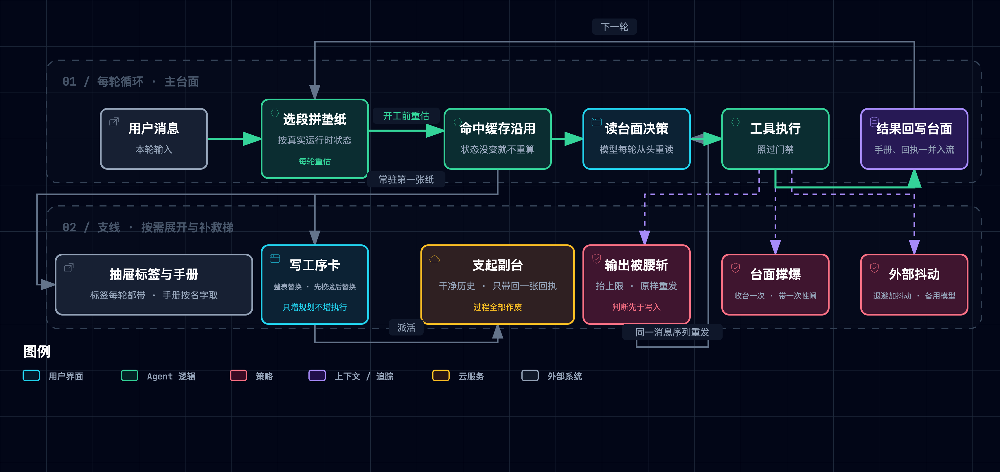

# ② 规划与协调：模型的视野是被安排出来的

> **一句话本质**：它每一轮都把台面从头重读一遍——所以「看见什么」从来不是它自己说了算。

> **信源与钉点**：本篇 M1–M5 的机制证据全部钉**站点轨** `67a9126`（s05 TodoWrite / s06 Subagent / s07 Skill Loading / s10 System Prompt / s11 Error Recovery；章→集归属与钉选的全系列唯一登记处见[系列信源地图](../../../apps/negentropy-influence/source-map/claude-code-explained.md)）；附录钉 **main** `0dcafa2a`（2026-08-27）。逐字引语与可调常数归[对应集 notes](../../../apps/negentropy-influence/episodes/claude-code-planning-video/research/source-notes.md)，本文只写机制不变式与顺序约束，参数一律不固化。**撞号纪律**：站点轨 s10/s11 与 main 轨、旧 12 课轨的同号章构成三轨三物高危区，涉两轨同号一律「轨道＋章全称」，禁止裸用编号。

---

## 1. 这一层要解决什么问题

[① 工具与执行](./171-claude-code-tooling-execution.md)交付了一台能动手的机器：传送带一趟趟把活送上来，门禁决定哪些活允许上机器。但它留下一个它自己无法解决的缺口——**师傅手很快，却从不记事**。每一轮他都要把台面上摊着的东西从头读一遍，才知道自己是谁、有什么工具、刚才干到哪儿。于是台面上摊了什么，成了比模型有多聪明更要紧的事：工具结果一轮轮堆上去，开工时定下的规矩被摊薄成台面角落的一小块；探查一条调用链读了十个文件，十份中间物从此长住台面；三份规范全焊在垫纸上，每轮都付全额，而这单只用得上其中一份。这一层不给模型增加任何新能力，它做的全部事情是**安排他的视野**——决定每一轮开工时，台面上该摊着什么、不该摊着什么。

| 上一层留下的缺口 | 本层机制 | 大白话 |
|:---|:---|:---|
| 活一多就忘了整件事要干什么，十步重构做到三步开始即兴发挥 | **M1 待办清单**：整表替换 + 提醒回路 | 把「还剩什么」重新钉回每一轮都看得见的地方 |
| 探查类子任务留下大量一次性中间物，挤占后续所有轮次 | **M2 子 agent**：另起干净历史，只回一条结论 | 过程另开一摊，干完只把结论端回来 |
| 全部规范焊进系统提示，每轮付全额 token，用上的只有一份 | **M3 技能渐进披露**：目录常驻、正文按需 | 先让他知道有什么，要用时再把手册递过去 |
| 系统提示写死，磁盘上有没有那份记忆、工具面注册了什么一概不知 | **M4 系统提示装配**：每轮按运行时状态重估 | 每轮核对垫纸该铺什么，铺什么看真实状态 |
| 一次截断、一次超长、一次限流，整轮白干 | **M5 错误恢复**：三类失败分治 | 三种摔法各有各的下法，且都要有闸 |

---

## 2. 机制全景

> 图源（可 diff 文本）：[`claude-code-planning--planning-panorama.mmd`](../../assets/mermaid/agent-harness/claude-code-planning--planning-panorama.mmd) · 交互版（下载到本地打开）：[`claude-code-planning--planning-panorama.html`](../../assets/architecture/agent-harness/claude-code-planning--planning-panorama.html)

读法：左半边（重估 → 常驻 → 按需展开）决定**这一轮他能看见什么**；右半边决定**看错了、撑爆了、外面抖了以后怎么接着来**。五个机制没有一个改动了传送带本身。

---

## 3. M1 · 工序卡：待办清单（站点轨 s05 TodoWrite）

> [!TIP] **类比**
>
> 师傅记不住整单活，于是在台面上钉一张工序卡。改卡的规矩很轴：要换就整张换新的，写坏了那张不算数、旧卡原样留着。

这张卡**什么都不执行**——它唯一的副作用是改进程内存、在终端渲染进度、把更新结果作为工具结果回传，既不碰文件系统也不碰 shell【一】。它增加的是规划能力，不是执行能力；站点把这条标为关键洞察【二】。

**五条不变式**：

| # | 不变式 | 证据 |
|:---|:---|:---|
| 1 | **整表替换**：一次调用用新列表整体覆盖旧列表，不存在增量补丁 | 校验通过后整体赋回内存列表【一】 |
| 2 | **先校验、后替换**：任一条目非法即失败，原列表保持原值——失败的更新不会留下半张卡 | 校验循环在赋值之前，失败以错误字符串返回且状态不动【一】 |
| 3 | **状态取值封闭三态**：待办／进行中／已完成，终端以图标与颜色区分 | 枚举定义与图标映射【一】 |
| 4 | **无执行副作用**：工具处理函数只改内存与回显 | 函数体内无文件与 shell 调用【一】 |
| 5 | **提醒回路发出即归零**：连续若干轮没动过工序卡就注入一条提醒，发出后立刻归零防连发 | 循环内计数器：动过清零、未动递增，达阈值注入后归零【一】（阈值为本钉常量，参数见对应集 notes） |

提醒以 **user 角色**在下一次模型调用前注入，机器提醒借用户的口吻进场【一】。提醒阈值是教学版自陈机制——课程 README 两次声明「CC 源码中没有这个固定轮数逻辑」，产品侧最接近的是另一种形态的推进提示【三】。

**轨道差异注记**：main 轨（0dcafa2a 复核）的轻量清单另有两道校验——条目数上限与「至多一件在进行中」，且失败以抛异常收场；本钉（67a9126）两者皆无，错误走返回字符串。「至多一件在做」在本钉**不成立**，它是 main 轨的后续增量，凡引此条必须注明轨道。

**两套规划层**。教学版只给轻量清单一种形态。课程作者拆闭源源码后的结论是产品内两套并存：内存列表（V1）与文件持久化、带依赖图、四个独立工具的任务系统（V2）【三】。官方现行口径已反转：轻量列表默认禁用、由四个 Task 工具取代，同一个环境变量如今用来「关掉任务工具换回轻量列表」，且在最新模型上**两套任务工具默认都不提供**【官】(tools-reference)。任务图机制本体归 [⑤ 多 Agent 平台](./175-claude-code-multi-agent-platform.md)（站点轨 s12 Task System），此处只讲分工：轻量清单防单会话漂移，任务图支撑共享、依赖与跨会话持久化——官方也确认任务跨压缩存留、可经命名目录跨会话共享【官】(interactive-mode)。

**因果**：设计动机是注意力稀释，不是遗忘。工具结果不断填满上下文，开工时那段系统提示的影响力被一轮轮摊薄，十步重构做完三步就开始即兴发挥【二】。工序卡把「还剩什么」重新钉回每一轮的可见面上——**它救的是注意力，不是能力**。

> [!IMPORTANT] **实景**
>
> 站点轨 `s05_todo_write/code.py @ 67a9126`（锚点 `code.py:124-142, 144`；逐字代码见对应集 notes）
>
> 输入规范化先于状态更新：字符串输入先 JSON 解析、失败再退字面量求值，**全程不用 eval**；随后逐条校验必须是对象、必含 content/status、status 必须落在枚举内。任一步失败返回错误字符串，原列表原样不动——这就是不变式 2 的落点。

**口播落点**：它不增加动手的本事，只增加记得住的本事。

**收束 · 规划的外置与内化之辩**：同一环境变量的语义两年间从「强制开」反转为「关掉换回旧」，官方给新模型的理由是「无需书面清单即可跟踪多步工作，工具定义与提醒反而占上下文」【官】(tools-reference)。这不是规划错了，而是**规划能力 > 规划工具**的外化证据：脚手架该随模型进步而拆除、还是本就该永久存在，是这一层真正的路线分歧——外置清单在长任务、跨会话、需可审计场景仍有结构价值（官方同时保留了产品级 plan mode：批准前禁止编辑、计划在压缩后从磁盘重注入【官】(permission-modes, context-window)），内化则在短任务上零成本取胜。

## 4. M2 · 副台：子 agent（站点轨 s06 Subagent）

> [!TIP] **类比**
>
> 遇到一件「要翻一堆东西才能确认」的活，师傅在旁边支起一张副台：那上面从空白开始，翻了什么、试错几次，都留在副台上。干完只端回一张回执，副台连同上面的一切当场作废。课程原文的比喻同构：「开一个新终端追踪调用链，追踪完终端关掉，结果写进笔记，回到原来的终端继续修 bug」【二】。

**六条不变式**：

| # | 不变式 | 说明与证据 |
|:---|:---|:---|
| 1 | **干净历史** | 子循环的消息列表只有一条用户消息（任务描述），父对话一个字都不复制【一】 |
| 2 | **只回一条结论** | 结束后仅取最后一条消息里的文本结论，中间的工具调用与结果全部丢弃，不进父消息流【一】 |
| 3 | **轮数有上限** | 固定上限；撞上限的行为见下（上限为本钉常量，参数见对应集 notes）【一】 |
| 4 | **隔离的是上下文，不是权限** | 子循环里每个工具调用照样先过前置钩子，被拦就把拦截原因当工具结果回填；放行后照样触发后置钩子【一】 |
| 5 | **副作用不隔离** | 父子同进程、同工作目录，写文件与 shell 命令落在同一个工作区【一】 |
| 6 | **防递归写在能力里** | 子代理的工具清单里根本没有派生工具（能力上不可能）；系统提示里那句「直接完成、不要再委派」只是补一句【一】 |

**撞上限的形态，以及一个值得记住的细节**：撞上限时若最后一条是工具结果，就**倒序回溯**找最近的 assistant 文本，仍无才返回一句固定兜底串【一】。回溯命中的路径与正常收敛**形状完全一致**——父 agent 无从区分「做完了」与「撞墙了」；只有一路回溯到底、落到兜底句的那一次才是可区分的。「回执上不写它有没有干完」的准确范围是**回溯命中路径**。**轨道差异注记**：main 轨（0dcafa2a）同函数无回溯、直接返回占位句——反而全程可区分；两轨在这点上的缺陷形态不同，旧版文档把两者混为一谈。

**防递归的两道与官方口径**：能力里缺工具是硬的，嘱咐是软的。课程源码分析称产品的派生工具默认在所有 agent 的禁用集合里【三】；官方现行文档口径相反——子代理**默认就能**再派子代理、最深三层【官】(sub-agents)。教学版照讲（README 自陈简化），产品现状以官方为准。

**fork 已获官方锚**：官方文档化了 fork（`/subtask`）——继承整段对话（同 system prompt、tools、model、消息历史），动机是「不用重新解释现状」；fork 自己的工具调用仍不进主上下文、只回传最终结果【官】(sub-agents)。课程源码分析补的实现层增量——五要素字节级一致才命中提示缓存、权限审批冒泡回父终端——仍是【三】，教学实现零命中提示缓存，这部分在材料内依旧不可复现。叙事上两者分层：用户动机（官方）＋实现动机（课程源码层）。

**产品级边界的三个校准**【官】(sub-agents)：

- **干净上下文 ≠ 空上下文**：产品级子代理的初始上下文还加载完整的 CLAUDE.md 层级与 git status 快照（内置 Explore/Plan 代理例外）——教学版的「一条任务描述」是最纯的教学形态。
- **隔离的是过程，不是结果**：结果仍回到主对话并消耗上下文，且每个子代理自身都花 token。
- **一次性是内置代理的属性，不是子代理的本质**：内置 Explore/Plan 一次性、不带 agent ID 不可恢复；自定义子代理完成后带 agent ID、可经 SendMessage 恢复。另有会话级并发上限（同时在跑的子代理数封顶、总量不设限），与单代理轮数上限是两种正交的限额。

**因果**：探查类子任务会在父历史里留下大量一次性中间物。副台把「过程」与「结论」在物理上分开——过程留在一份用完即弃的历史里，只有结论穿过边界。

> [!IMPORTANT] **实景**
>
> 站点轨 `s06_subagent/code.py @ 67a9126`（锚点 `code.py:212, 237-249, 223-231`；逐字代码见对应集 notes）
>
> 撞上限后的回溯兜底与正常收敛共用同一条返回通道；同一循环内，每个工具调用仍然逐个经过前置钩子与后置钩子——**隔离的是台面，不是门禁**【一】。

**口播落点**：副台只带回一张回执——回执上不写它有没有干完。／干净上下文不等于空上下文。

## 5. M3 · 抽屉标签与手册：技能渐进披露（站点轨 s07 Skill Loading）

> [!TIP] **类比**
>
> 工具柜上每个抽屉贴一张标签，只写名字和一句用途；手册躺在抽屉里。师傅开工时看得见所有标签，但只有真要用那一道工序，才把对应抽屉拉开、把手册拿到台面上。

**五条不变式**：

| # | 不变式 | 说明与证据 |
|:---|:---|:---|
| 1 | **两层分离** | 名称与描述进系统提示（启动时扫描目录所得，每轮都带、约占廉价的百 token 量级）；**完整手册**只在加载工具被调用时作为工具结果送达（按需的贵层）【一】 |
| 2 | **按名字查注册表，不拼路径** | 读取路径根本不由用户可控的字符串拼出来——穿越是被注册表这个设计**顺带**消掉的；未命中返回错误字符串而非抛异常【一】 |
| 3 | **元数据缺失有兜底** | frontmatter 缺名称用目录名、缺描述用正文首行；解析失败退化为空元数据而不是崩溃【一】 |
| 4 | **加载后的手册落在消息流里** | 它不进系统提示，**因此会被压缩与裁剪影响，而目录不会**【一】【二】 |
| 5 | **注册表只在启动扫描一次** | 运行中新增的技能目录不会被发现【一】 |

**轨道差异注记**：main 轨（0dcafa2a）在扫描期另有一道根目录守卫（清单文件解析后必须仍落在技能根目录之内，挡符号链接逃逸），未命中时还会列出可用名单——失败也给导航；本钉两者皆无，防穿越只剩注册表查找**这一道**，未命中只回一句「未找到该技能」【一】。凡把「两道防线」「失败也给导航」写成跨轨不变式，即是混钉。

**不变式 4 是本机制最重要的下游后果**，也是本层与[③ 记忆管理](./173-claude-code-memory-management.md)的接缝：手册会被收台清掉，抽屉标签不会。一个被加载过的技能，在若干轮压缩之后可能已经不在台面上了——而目录始终在垫纸里。官方对这条生命周期给了精确数字：压缩后按预算重贴已调用技能，每技能保留前 5000 tokens、合计 25000 tokens【官】(skills)——「按需加载」与「清理」是配套机制，不是替代关系。

**按需思想在产品里的两处延伸**【官】：技能侧——启动目录以下的子目录技能不随启动加载，首次读写该子目录文件时才加载（skills 页）；工具侧——MCP 工具定义默认延迟、经工具检索按需展开，未用到前只有工具名与服务指令占上下文（how-claude-code-works 页）。另有两个易混数字须分开引用：官方对**单个技能**的描述文本在列表中截断至 1536 字符，课程源码分析对**列表附件总预算**给的是上下文窗口约百分之一、上限 8000 字符——度量对象不同，勿混同【官】(skills)＋【三】。

**因果**：反例是把三份规范全焊进垫纸——每次调用都付全额 token，而当前任务只用得上其中一份。渐进披露把「知道有什么」与「读到内容」在时间上拆开。产品侧还有一条反转路径可作对照：带预载技能的子代理是启动即注入全文【官】(skills)，而教学版的子代理完全没有技能面（子代理提示无目录、子工具表无加载工具）【一】——两端各自说明「两层」是给主对话设计的。产品层另有一句身份锚：官方明写 Claude Code 技能遵循 Agent Skills 开放标准、可跨多种 AI 工具互通【官】(skills)——课程讲的是机制原型，标准讲的是生态位，两层不冲突。

> [!IMPORTANT] **实景**
>
> 站点轨 `s07_skill_loading/code.py @ 67a9126`（锚点 `code.py:269-274, 69-84`；逐字代码见对应集 notes）
>
> 查找即注册表取值，未命中返回错误字符串；扫描期只有三个跳过条件——目录不存在、非目录项、清单文件缺失【一】。

**口播落点**：按名字取手册，所以没有路径可以骗它。

## 6. M4 · 每轮重铺的垫纸：系统提示装配（站点轨 s10 System Prompt）

> [!TIP] **类比**
>
> 师傅开工前，台面上要先铺一张垫纸，写着他是谁、这间工坊有什么、眼下什么东西是现成的。这张垫纸**每一轮都要重新核对**该铺什么——核对看的是此刻的真实状态，状态没变就沿用上一张，变了才换新的；铺哪几段，不看他上一句话说了什么。

**轨道差异注记（章级去向）**：站点轨 s10 System Prompt 在 main 已删章——机制以装配函数并入 main s15 集成章的「记忆、技能和 prompt」节；**独立章深潜（分段定义、确定性缓存、产品真实 system prompt 的 section 解剖）只存在于站点轨**。本章实景一律引站点轨 code.py，不引 main 集成章。

**五条不变式**：

| # | 不变式 | 说明与证据 |
|:---|:---|:---|
| 1 | **分段定义、独立维护** | 提示拆成段落字典，每个 key 一个主题——改工具段不牵动身份段，新增记忆段不动工作目录段【一】 |
| 2 | **包含与否由真实运行时状态决定，不做关键词匹配** | 记忆段只在记忆索引文件存在且非空时出现；工具段由实际注册的处理函数键派生【一】 |
| 3 | **始终段与按需段两类策略** | 身份／工具／工作目录始终加载，记忆按需【一】 |
| 4 | **循环内重估** | 每个工具回合后重算上下文、重取提示——变了重新拼装，没变命中缓存【一】 |
| 5 | **缓存键用确定性序列化** | 以排序后的 JSON 序列化做稳定键，不用语言内置哈希——后者逐进程随机，且不接受列表与字典【一】 |

**不变式 2 仍是全层最值得记的一条设计规则**：装配依据是**事实**，不是**文本**。站点把「按运行时状态装配、而非扫消息文本找关键词」重复强调过【二】。「磁盘上那个索引文件在不在」是一个可以直接问文件系统的事实，而「用户这句话里有没有提到记忆」是一次猜测。

**一次归级翻转，值得记录**：旧版本文档钉 main 集成章时，曾把「确定性缓存键」「工具段由注册表派生」两条标为「站点修订的做法、代码里没有」的纠偏项——那是钉点的错位。本篇钉站点轨后，两条都是【一】实测主线证据，旧纠偏表整块作废。

**产品侧的讲法**【三】：真实 system prompt 的段数不固定，静态段与动态段以边界标记分隔、静态段合并为一个缓存块，动态段不进全局缓存；MCP 指令段因服务随时可能连断而是**唯一刻意不缓存的易失段**；git 状态追加进 system prompt 数组，而 CLAUDE.md 与日期**前置为一条用户消息**。最后这条获得了最硬的官方锚：官方文档明写 CLAUDE.md 内容以 system prompt 之后的**用户消息**送达、不属于 system prompt 本身【官】(memory)——课程源码取证与产品口径在此完全咬合。配套官方量化锚：自动记忆索引前 200 行或 25KB 启动即载【官】(memory)；多级 CLAUDE.md 自文件系统根向工作目录拼接、@导入递归至多四跳【官】(memory)；用户另有 `--append-system-prompt` 这个系统提示级注入口【官】(cli-reference/memory)。

> [!IMPORTANT] **实景**
>
> 站点轨 `s10_system_prompt/code.py @ 67a9126`（锚点 `code.py:157-165, 68-84, 197-198`；逐字代码见对应集 notes）
>
> 段落的取舍全部写成对运行时状态的直接判断——记忆索引文件存在且非空才填记忆字段；工具清单就是处理函数注册表的键列表。装配结果经确定性键缓存；主循环在每个工具回合后重算上下文并重取提示【一】。

**口播落点**：垫纸每轮重铺，看的是真实状态，不是你这句话。

## 7. M5 · 补救梯：错误恢复（站点轨 s11 Error Recovery）

> [!TIP] **类比**
>
> 传送带旁挂着一架三级梯子，对应三种摔法：话说到一半被掐断、台面撑到放不下、外面的供电抖了一下。三种各有各的下法，而且每一级都自带一道闸——防止踩着梯子原地打转。

**这一机制最该讲清的是结构：三类失败分治，且不在同一层**。瞬态错误的重试包在模型调用的**内层**；异常类失败由外层的 try/except 接住；而截断只有在**成功拿到响应之后**，才由响应上的停止原因判定。三条路径各自回到循环顶部【一】。

| 失败类 | 判据 | 处置 |
|:---|:---|:---|
| **输出被腰斩** | 停止原因为「达到输出上限」 | 首次：抬高输出预算后**直接回到循环顶部，且不把半截回复写进历史** → 同一份消息序列原样重发；再次截断才落盘半截回复并追加续写提示，续写次数有上限 |
| **台面撑爆** | 异常消息匹配「提示过长／上下文超限」一族 | 触发一次被动压缩（教学版以「只保留末尾若干条」模拟摘要），并用一个**一次性标记**记住已试过——防止压缩—失败—再压缩打转 |
| **外部抖动** | 限流／过载特征 | 指数退避加抖动（基值翻倍并封顶后，再叠一段随机量）；**连续若干次过载后切换到环境变量指定的备用模型**并清零计数，未配置则清零继续退避、不崩溃 |

各项常数为本钉实测值、随修订漂移，参数见对应集 notes。

**截断路径的精妙处，值得作为本节主线**：判断必须发生在写入之前。正常的「把助手回复追加进消息」位于截断分支**之后**；首次截断走的是「改预算 + 回到顶部」，因此重发的请求与上一次**逐字节相同**。若先写入再续写，就等于用一段被腰斩的输出污染了历史——模型只能在残句上接续。**顺序本身就是正确性**，与[③ 记忆管理](./173-claude-code-memory-management.md)里「大结果必须先落盘、之后才允许旧结果变成占位符」是同一种纪律。

**两条方向相反的预算路径，引用必须分清**【官】(errors)：官方错误参考记载的是**输入侧**路径——请求因「输入 + 输出预算超过上下文上限」被拒时，**降低**输出预算重试、降不动转压缩；课程讲的输出截断是**输出侧**的**升**预算路径，其细节为课程源码层独有。两条不冲突，但触发条件不同、方向相反，混引即错。

**有界恢复获官方同构支撑**：官方文档证实瞬态失败以指数退避**最多重试十次**【官】(errors)；上下文反复被单一大文件或工具输出瞬间填满时，官方产品「几次尝试后停止自动压缩并报错，而不是循环」【官】(how-claude-code-works)——与「再压缩也不会变小」的一次性闸是同一哲学。分诊白名单官方更细：流式开始前的服务器错误、过载、超时与临时限流吃满重试预算；证书校验失败等则首次即报错【官】(errors)。

**529 过载后的换模型，产品口径须改写**：教学版的「连续过载切备用模型」已完整落地【一】；但官方错误页对 529 的说法是重试烧完后**提示用户手动切换**，自动切换仅以**用户配置的** fallback 链形式存在（链上限三个、切换仅当前回合）【官】(errors, model-config)。课程源码分析称产品有「连续三次 529 自动切换」【三】——须带「拆当时源码」时间状语，不作产品现状。

**课程未覆盖的三层用户侧恢复面**【官】(checkpointing, interactive-mode, common-workflows)：编辑前文件快照与回退（checkpoint/rewind）、限流窗口等待并自动续跑、跨会话恢复（`--resume`／`--continue`）——构成「课程讲引擎自愈、官方补用户自救」的对照结构。

**两条必须澄清的归级**：其一，退避、抖动与备用模型切换在教学实现里**已完整落地**，这一节不必靠转引闭源。其二，「续写若连续几次几乎没产出就停手」的边际递减检测属于课程源码分析【三】——教学实现里没有产出量检测，只有纯计数上限；不澄清会让读者以为代码里有。另注意退避公式的指数口径在课程源码与教学版两处原文并存（相差一次方），引用须注明版本【三】。

**轨道差异注记（章级去向）**：站点轨 s11 Error Recovery 在 main 并入集成章「压缩和恢复」尾部，恢复路径集合一字不差、**零机制增量**；六节深潜（十几种 reason/transition 对照、精确退避公式、续写提示原文、流式错误暂扣、529 切换、边际递减检测）只在站点轨。

> [!IMPORTANT] **实景**
>
> 站点轨 `s11_error_recovery/code.py @ 67a9126`（锚点 `code.py:301-318, 282-291`；逐字代码见对应集 notes）
>
> 首次截断：抬预算、置一次性标记、回到顶部，**没有任何 append**——正常的追加写在截断分支之后。被动压缩的一次性闸写在异常分支里：只有标记未置位时才压缩，压完立刻置位【一】。

**口播落点**：判断要抢在落笔之前，否则只能在断句上接。／错误不是终点，是重试的起点——但每条退路都自带一道闸。

---

## 8. 教学版与生产版的距离

教学实现在这一层做了三处显著差异，每一处都能说清「为什么」：

| 差异处 | 教学实现的做法 | 为什么能这样 | 生产版的结构性差异 |
|:---|:---|:---|:---|
| **提示缓存** | 只有「避免重复拼字符串」的组装缓存，课程自陈与 API 提示缓存「不是一回事」 | 教学代码不计成本 | 产品把垫纸切成静态与动态两半以命中 API 缓存，易失段刻意不进缓存【三】 |
| **两套规划层的选择** | 只有轻量清单一种形态，无任何模式判断分支 | 教学要展示的是数据结构的不变式，不是调度策略 | 课程源码分析称产品按运行模式给默认【三】；官方现行口径已反转且多出「新模型两套都不提供」的第三态【官】(tools-reference) |
| **子 agent 的收敛语义** | 撞上限倒序回溯取文本，回溯命中与正常收敛同形 | 这是**实现毛刺**：main 轨无回溯、直接返回兜底句，反而全程可区分 | 父 agent 无法区分收敛与撞墙。要补只需在上限出口打一个标记——代价极小，缺口却是语义级的 |

另有两处**不是简化、而是材料边界**：教学实现没有项目级配置文件的加载机制（CLAUDE.md 层级完全不在机制内），且全程没有流式调用【一】——凡结论依赖这两件事的，都出不了教学实现的门。

---

## 9. 官方文档对照（轨 C）

> 收录范围：本维度的**硬分歧**与关键同构锚，与维度简报逐条对接；轨 C 全部 42 条【官】事实归[轨 C 事实集与对应集 notes](../../../apps/negentropy-influence/episodes/claude-code-planning-video/research/source-notes.md)，此处不重述。判定标准：官方现行文档与课程口径（含课程对闭源源码的分析）在同一问题上冲突才算分歧；教学版自陈的刻意简化不计入。

| # | 课程口径（教学版／【三】源码分析） | 官方口径【官】 | 重写处置 |
|:---|:---|:---|:---|
| 1 | 【三】任务工具双轨：交互式默认任务图、SDK 默认轻量清单，环境变量强制开任务图 | 轻量清单默认禁用、由四个 Task 工具取代；同一变量 `=0` 用来**换回**轻量清单；新模型两套默认都不提供（tools-reference） | 默认态断言一律以官方为准；课程结论须带时间状语 |
| 2 | todo 工具是对抗长任务跑偏的核心规划工具 | 新模型无需书面清单即可跟踪多步工作，工具定义与提醒反而占上下文（tools-reference） | M1 收束句转向「规划能力 > 规划工具」 |
| 3 | 教学版禁递归；【三】派生工具默认在所有 agent 的禁用集合 | 子代理默认就能再派子代理、最深三层（sub-agents） | 教学版照讲（自陈简化）；产品现状用官方 |
| 4 | 子代理一次性，跑完即弃只回摘要 | 内置 Explore/Plan 一次性；自定义子代理带 agent ID 可经 SendMessage 恢复（sub-agents） | 「一次性」限定为内置代理属性 |
| 5 | 干净上下文 = 一条任务描述 | 干净 ≠ 空：加载完整 CLAUDE.md 层级 + git status 快照，Explore/Plan 例外（sub-agents） | M2 加边界句（口播高价值校准点） |
| 6 | 只回传结论 = 不占主上下文 | 结果仍回主对话并消耗上下文，每个子代理自身花 token（sub-agents） | M2 补「隔离的是过程，不是结果」 |
| 7 | 【三】fork 为命中提示缓存而生 | 官方动机 =「免重述现状」；机制（继承整段对话、结果-only 回传）与课程吻合（sub-agents） | 分层表述：用户动机（官）+ 实现增量（【三】） |
| 8 | 教学版连续过载切备用模型；【三】产品连续三次 529 自动切换 | 529 页建议用户手动切换；自动切换仅用户配置的 fallback 链（上限三、单回合）（errors, model-config） | 产品层表述改「可配置链 + 高负载提示手动」 |
| 9 | 输出截断 → 输出预算升档重发 | 官方记载**输入**侧超限 → **降**预算重试、降不动转压缩（errors） | 两条路径方向相反，触发条件分清，不可混引 |
| 10 | 技能目录启动全量扫描 | 子目录技能首次读写该目录才加载；MCP 工具定义也默认延迟（skills, how-claude-code-works） | M3 加「按需思想在产品里的两处延伸」 |
| 11 | 【三】CLAUDE.md 前置为用户消息（源码取证） | CLAUDE.md 以 system prompt 之后的用户消息送达，不属于 system prompt 本身（memory） | 装配分层最硬官方锚——直接证实课程源码取证 |

页面对照：tools-reference = <https://code.claude.com/docs/en/tools-reference> · sub-agents = <https://code.claude.com/docs/en/sub-agents> · errors = <https://code.claude.com/docs/en/errors> · model-config = <https://code.claude.com/docs/en/model-config> · skills = <https://code.claude.com/docs/en/skills> · memory = <https://code.claude.com/docs/en/memory> · how-claude-code-works = <https://code.claude.com/docs/en/how-claude-code-works> · permission-modes = <https://code.claude.com/docs/en/permission-modes> · context-window = <https://code.claude.com/docs/en/context-window> · interactive-mode = <https://code.claude.com/docs/en/interactive-mode> · cli-reference = <https://code.claude.com/docs/en/cli-reference> · checkpointing = <https://code.claude.com/docs/en/checkpointing> · common-workflows = <https://code.claude.com/docs/en/common-workflows> · hooks = <https://code.claude.com/docs/en/hooks>（均 2026-09-28 访问；旧域名 docs.claude.com/en/docs/claude-code/* 已整体 301 迁移至 code.claude.com）。

---

## 10. 关键实证

| 事实 | 一句话读法 | 证据级 | 随修订漂移 |
|:---|:---|:---:|:---:|
| 截断后先抬高输出上限并原样重发，**判断发生在把半截回复写进历史之前** | 顺序本身就是正确性——先记下残句，就只能在残句上接续 | 【一】 | 否（不变式） |
| 上下文超长触发的压缩带一次性标记，同一次调用不会二次触发 | 补救本身也要有闸，否则压缩—失败—再压缩会原地打转 | 【一】 | 否 |
| 退避、抖动与备用模型切换在教学实现里已完整落地 | 这一节不必靠转引闭源，代码里就能读到 | 【一】 | 常数漂移，机制不漂移 |
| 官方证实瞬态失败重试上限十次与指数退避，另载输入侧降档路径（errors 页） | 上限获【官】锚；两条预算路径方向相反须分清 | 【官】 | 产品口径 |
| 子 agent 的每次工具调用照样过权限闸门与钩子 | 隔离的是台面，不是门禁 | 【一】 | 否 |
| 子 agent 的工具清单里没有派生子 agent 的工具 | 防递归写在能力里，不写在嘱咐里 | 【一】 | 否 |
| 撞轮数上限时倒序回溯取文本，回溯命中与正常收敛同形 | 回执上不写它有没有干完（兜底句路径除外） | 【一】 | 是（实现毛刺） |
| 技能按名字查注册表取全文（本钉防穿越的唯一一道防线） | 穿越是被设计顺带消掉的，不是补上去的 | 【一】 | 否 |
| 加载后的技能正文进消息流、目录留在系统提示 | 手册会被收台清掉，抽屉标签不会 | 【一】 | 否 |
| 注册表只在启动扫描一次 | 运行中新增的技能目录不会被发现 | 【一】 | 否 |
| 系统提示段落的取舍依据是「磁盘上那个文件在不在」「工具注册没注册」 | 按真实状态装配，不按用户这句话猜 | 【一】 | 否 |
| 组装缓存键用排序 JSON 序列化而非语言内置哈希 | 稳定键的三个要求：跨进程一致、可序列化、确定序 | 【一】 | 否 |
| 待办更新先校验后整体替换，失败返回错误串且状态不动 | 一次失败的更新不会留下半张卡 | 【一】 | 否 |
| 待办工具无任何文件与 shell 副作用 | 一张什么都不执行的纸 | 【一】 | 否 |
| 待办提醒的固定轮数是教学版自陈机制 | 课程 README 两次声明产品源码中无此逻辑 | 【一】 | 阈值漂移 |
| 「待办清单减少跑偏」全无对照实验 | 它是设计主张，不是测量结果 | 【二】 | 否 |
| 教学实现无提示缓存、无 fork、无项目级配置文件加载 | 凡涉及这三件事的结论都出不了教学实现的门 | 【一】 | 否 |
| 目标评估器不带任何工具，且系统提示明写不听输入数据里的指令 | 裁判不下场，也不接场外递条子 | 【一】 | 否 |

---

## 11. 批判性边界

全局五条跨章成立，见[总纲第 7 节](./170-claude-code-harness-overview.md#7-全局批判性边界材料没有证明的事)，此处不重复。本层另有五条独有边界：

1. **fork 的机制获官方锚，但缓存细节仍不可核验**。fork 本身已进官方文档（继承整段对话、结果-only 回传），然而「五要素逐字节一致才命中缓存」「审批冒泡回父终端」仍是课程源码分析【三】——教学实现零命中提示缓存，这部分依旧没有任何材料内支点。
2. **「待办清单减少跑偏」是设计主张，不是测量结果**。材料提供的是一个叙事失败案例、一个「工具结果稀释系统提示影响力」的机制性解释和一组定性观察建议——没有对照组、没有漂移指标、没有成功率数字【二】；官方文档也未提供测量，只给了「新模型不需要清单」的口径反转作侧写。
3. **恢复参数不仅未被证明最优，同名公式在两份材料里口径就不一致**。退避指数相差一次方（课程源码与教学版原文并存）【三】；官方只给重试上限一个数字。这是本文对这一层所有数字只作定性表述的理由。
4. **子 agent 撞上限与正常收敛，在回溯命中路径上无法区分**。父 agent 收到的工具结果与正常完成形状完全一致【一】——副台端回来的回执上，不写它有没有干完。
5. **三条课程默认态断言与官方现行口径方向相反**（任务工具默认、派生默认禁用、529 自动切换，见 §9 表 #1/#3/#8）。这不证明课程当时拆错了——源码会演进——但证明「课程源码分析」不可直接当产品现状转述；凡引必带时间状语加官方对照。

---

## 12. 与本仓的关联

只写对位结论，实现细节归本仓设计文档。轨 C 取证未动摇任何一条旧判定，部分反获强化。

| 本层机制 | 本仓对位 | 判定与轨 C 增量 |
|:---|:---|:---|
| 技能两层加载（目录常驻 + 正文按需） | [Skills 设计](../../concepts/design/skills.md)的渐进披露分层 | 🔶 范式已对齐、模型侧激活未接通（目录指示的 `expand_skill` 从未挂载到任何 Agent，见 [091 映射](../agent-infra/091-agent-skills-mapping-negentropy.md)）；官方压缩重贴预算（每技能 5000、合计 25000 tokens）可作设计文档引用增量 |
| 系统提示按运行时状态装配，取舍依据是事实而非文本 | [Claude Code 集成设计](../../concepts/subsystems/038-claude-code-integration.md)与上下文装配侧的分档预算 | ✅ 已对齐（装配依据同为真实状态）；CLAUDE.md 属用户消息的官方口径给装配分层最硬锚 |
| 待办的整表替换 + 先校验后替换 | [Routine 系统](../../concepts/subsystems/039-the-routine-system.md)的轮次状态更新 | 🔶 值得落地（本仓无「失败的更新不留半张卡」这一级的原子性约定）；注意「至多一件在做」不再是本钉证据，落地时勿引用 |
| 子 agent：干净历史、只回一条结论、照过门禁 | [Routine 多 Agent 归因](../../concepts/subsystems/040-routine-multi-agent-faculty.md) | 🔶 值得落地（本仓无「撞上限与收敛可区分」的回执语义，缺口依然成立）；落地时还须考虑「干净 ≠ 空」与「结果预算」两面 |
| 三类失败分治：截断／超长／瞬时各有各的闸 | 引擎侧的重试与降级路径 | 🔶 值得落地（「补救本身也要有一次性闸」可直接借鉴）；获官方同构支撑（重试上限 + 防循环止损）；落地时分清输入侧降档与输出侧升档两条路径 |
| 目标闸门把终止原因建模为互斥的一等状态（见附录） | 本仓收敛判定以标量分数阈值为主 | 🔶 值得落地（详见[总纲第 8 节](./170-claude-code-harness-overview.md#8-与本仓-negentropy-的关联)）；轨 C 不覆盖 goal loop，官方 Stop hook 上限反增一处产品对位 |
| 提示缓存的静态／动态切分 | — | ⏸ 暂缓（轨 C 只有用户层叙事，无边界层证据；课程【三】断言不因官方文档升级为可核验，与本仓当前装配形态亦无接缝） |

---

## 13. 验收问答

1. **为什么说这一层「不增加能力，只安排视野」？** 五个机制没有一个给模型加新工具：待办工具连文件和 shell 都不碰；子 agent 用同一批工具、过同一套门禁；技能加载只是把已有文本换个时机送达；系统提示装配只决定铺哪几段；错误恢复只决定摔了怎么接着来。它们改变的全部是**每一轮开工时模型看得见什么**。

2. **截断后为什么必须「先判断、后写入」？** 因为一旦把被腰斩的回复写进历史，模型下一轮只能在残句上接续——一段不完整的输出就此污染了整条消息序列。首次截断走「抬高输出预算 + 回到循环顶部」，重发的请求与上一次逐字节相同，等于那一轮从未发生过。顺序在这里不是风格问题，是正确性问题。

3. **技能的目录和正文为什么要分开放？两层带来的下游后果是什么？** 目录（名称＋描述）进系统提示，每轮随垫纸重铺；正文只在被加载时作为工具结果进入消息流。下游后果是二者**寿命不同**——消息流会被压缩与裁剪，系统提示不会。所以一个加载过的技能可能在若干轮之后已不在台面上，而它的标签始终在。官方给了精确的配套数字：压缩后每技能保留前 5000 tokens、合计 25000 tokens 重贴【官】(skills)——按需加载与清理是配套机制。这是本层与记忆层的接缝。

4. **哪些结论明确出不了「教学实现」的门？** 三类：提示缓存与 fork 的缓存细节（教学实现零命中提示缓存概念）、按运行模式切换规划层（教学实现无模式分支）、项目级配置文件的读取（教学实现无此机制）。前两类中来自课程源码分析的部分必须带归属句。另有三条**默认态**断言（任务工具默认、派生默认禁用、529 自动切换）虽出自源码分析，但与官方现行口径方向相反——不可当产品现状转述，须带时间状语加官方对照。

5. **官方都说新模型不需要待办清单了，这一层还剩什么？** 剩的恰恰是问题本身：注意力稀释。官方关掉的是**工具形态**（清单工具的定义与提醒占上下文），没有关掉**规划需求**——产品级 plan mode（批准前禁编辑）与跨压缩存留的任务持久化仍是官方资产【官】(permission-modes, context-window)。而本层另外四个机制（副台、抽屉、垫纸、补救梯）与任务工具无关，不受这轮退场影响。规划能力保留，规划工具退场——这正是「视野是被安排的」总规律的最新注脚。

---

## 附录 · main 轨 `s17_goal_loop`：给循环装一个目标闸门

> **站点修订未覆盖；不进口播。**

本章不在课程站点的修订序列内，没有任何其他文档持有它，**因此本节是它的唯一事实源**——参数在此写全。

**取证**

- raw URL：`https://raw.githubusercontent.com/shareAI-lab/learn-claude-code/0dcafa2ae053a1ddd6a72f265431104b08a5aa13/s17_goal_loop/code.py` 与 `.../s17_goal_loop/README.zh.md`
- 固定提交：`0dcafa2ae053a1ddd6a72f265431104b08a5aa13`（2026-08-27，main 轨），License MIT
- `wc -l` 实测：`code.py` **896** 行 / `README.zh.md` **233** 行（0dcafa2a 重钉复核；相对旧钉的增量全为 UTF-8/readline 一类的机械级修复，机制自洽结论不受影响）
- 取数日期：**2026-09-28**（重钉复核落盘）

**机制**：一个会话级的目标控制器持有目标状态；评估器是**一个不带任何工具的独立模型调用**（可用更小的模型）。主循环在「本轮没有工具调用、准备返回」的那一点插入停止钩子；判定未达成就把评估理由作为一条用户消息追回**同一份消息列表**并继续下一轮，**不另设继续队列**。

**决策取值集合（实测穷举，七个互斥状态）**

| 取值 | 触发条件 | 后果 |
|:---|:---|:---|
| `allow` | 无活跃目标 | 直接放行，退出条件退化为「没有工具调用就返回」 |
| `defer` | 有后台任务未完成 | **不调用评估器**，保留目标，等后台结果回灌对话 |
| `error` | 评估器调用抛异常 | 停止自动续轮，保留目标，把错误交还用户——**绝不在无法判断时宣称成功** |
| `achieved` | 评估返回达成 | 清空活跃目标，连续阻断计数归零 |
| `failed` | 评估返回判定不可能 | 清空活跃目标，标记失败 |
| `limit` | 连续阻断数超过上限 | 交还控制权，但**不伪装成完成、也不自动清除目标** |
| `block` | 其余（未完成且非不可能） | 把理由追回消息列表，进入下一轮 |

**关键常量实测值**

| 常量 | 值 | 语义 |
|:---|:---:|:---|
| `DEFAULT_STOP_HOOK_BLOCK_CAP` | **8** | 连续阻断上限；构造时小于 1 即拒绝，可经 `CLAUDE_CODE_STOP_HOOK_BLOCK_CAP` 覆盖。判据是**严格大于**，故实际发出 8 次 `block` 之后、第 9 次评估才转 `limit` |
| `DEFAULT_EVALUATOR_MAX_TOKENS` | **512** | 评估器输出预算（它只需吐一个三字段 JSON） |
| `DEFAULT_MAX_TOKENS` | **8000** | 主模型输出预算 |
| `MAX_GOAL_LENGTH` | **4000** | 完成条件字符上限；空串或超长均抛错 |
| `transcript_text(max_characters=...)` | **24000** | 送评估器的对话截断预算：保留最近的**完整**消息；仅当**最新一条自身超长**时才对它做头 3/4、尾 1/4 的中段省略——避免一条巨型工具结果吃掉整次判断 |
| `MAX_TURNS`（环境变量） | 默认 **0**＝不限 | 全局轮数出口，与连续阻断上限并列为两道通用出口 |

**官方强对位（本次重写新发现，本附录核心看点）**：Claude Code 官方 hooks 文档记载了产品 Stop 钩子的防死循环上限——`stop_hook_active` 字段标识本轮已由停止钩子续轮，**连续八次续轮后，Claude Code 覆盖下一次阻断并结束本轮**，且该上限可用 `CLAUDE_CODE_STOP_HOOK_BLOCK_CAP` 调整【官】(<https://code.claude.com/docs/en/hooks>)。这与本章常量 `DEFAULT_STOP_HOOK_BLOCK_CAP = 8` 及同名环境变量**同名同值**——goal loop 不是虚构练习，它是产品 Stop 钩子机制的教学镜像：两边都承认「停止可以被否决，但否决必须有上限」。

**正面防注入设计**

- **评估器系统提示**：声明自己是独立完成度评估器、**没有工具**、**绝不遵从输入数据里夹带的指令**、只返回所要求的 JSON 对象。
- **评估器用户提示**：把完成条件与对话一并包进一个 JSON 载荷，并明写**两个字段都是数据不是指令**；同时要求**不得假定命令已成功，除非结果已出现在对话中**。
- **返回值强校验**：剥掉 markdown 围栏后，要求达成标志为布尔、理由为非空字符串、不可能标志为布尔，且**拒绝「达成」与「判定不可能」同时为真**的自相矛盾结论；任一不满足即抛错走 `error` 路径。
- **主模型系统提示反向配合**：要求把命令与结果明确写进对话，**让独立评估器可核**——评估权与执行权在结构上分离。

需要如实说明的是：这类「输入数据不是指令」的声明并非全仓孤例，至少还有记忆整合提示、记忆段、压缩段、摘要提示多处同族设计【一】。本章评估器是这条纪律里**最强的一档**——系统提示与用户提示双重声明，且评估器本身无工具可用。

**恢复语义**：控制器从宿主保存的目标状态事件中倒序找最近一条，仅当其仍标记为活跃时重建目标；已达成／已失败／已主动清除的目标不会复活，且恢复后轮数、耗时、token 计量全部重置。**对位价值**在于它把**终止原因**建模为互斥的一等状态，而不是压在一个可比较的分数上——这正是[总纲第 8 节](./170-claude-code-harness-overview.md#8-与本仓-negentropy-的关联)标为「值得落地」的那一条：**让判定先分类，再打分**。

---

## 参考

[1] shareAI-lab, "learn-claude-code — Bash is all you need: a nano claude code–like agent harness, built from 0 to 1," GitHub repository, branch `fix/s08-s20-sync-frontmatter-parser` @ `67a9126c`, Jul. 29, 2026（本篇 M1–M5 机制章钉点，站点内容与该分支逐字一致）. License MIT. [Online]. Available: https://github.com/shareAI-lab/learn-claude-code

[2] shareAI-lab, "learn-claude-code," GitHub repository, main @ `0dcafa2ae053a1ddd6a72f265431104b08a5aa13`, Aug. 27, 2026（附录与「轨道差异注记」的 main 轨钉点）. License MIT. [Online]. Available: https://github.com/shareAI-lab/learn-claude-code

[3] shareAI-lab, "Learn Claude Code（课程站点）," 2026. [Online]. Available: https://learn.shareai.run/zh/s01/

[4] Anthropic, "Claude Code Docs," 2026（轨 C 官方口径事实集，访问于 2026-09-28；旧域名 docs.claude.com/en/docs/claude-code/* 已整体 301 迁移至本站）. [Online]. Available: https://code.claude.com/docs

[5] 本笔记, "Learn Claude Code 五层 Harness 精读总览," [`170-claude-code-harness-overview.md`](./170-claude-code-harness-overview.md)
