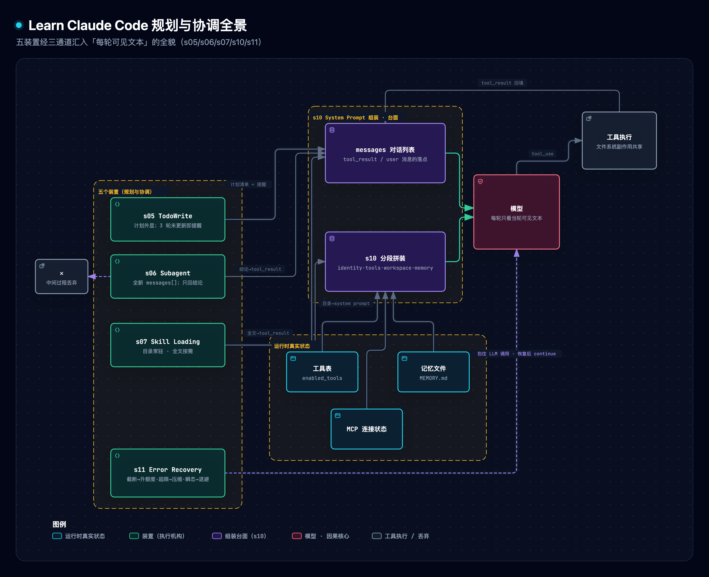

# 精读：Learn Claude Code 规划与协调

> [1] shareAI-lab, *Learn Claude Code*（开源课程，MIT 许可证）. 所据版本：站点轨（20 章版，learn.shareai.run 实况）= fix 分支钉点 `67a9126c`（钉点＝钉住的具体提交版本）（2026-07-29，站点页与小节标题 20/20 对账）；main 轨（17 章版）= main HEAD `ce8f9f18`（2026-09-28）。本篇覆盖站点轨 s05_todo_write / s06_subagent / s07_skill_loading / s10_system_prompt / s11_error_recovery 五章及其 code.py，以 main 轨 s05–s07 与 s15_integrated_harness（system prompt 组装与错误恢复的 main 轨所在）为对照必读，main 轨 s17_goal_loop 作附录级对照。截至 2026-10-07 复核：上游 main 等于钉点（钉点即最新）；课程的一处 fork（仓库分叉副本）后续两提交把教学路径重排到 `agents/` 轨，对上述五章目录为纯删除、无内容修改，故不影响本篇。

**一句话定位**：这五章不是五个孤立的技巧，而是同一件事的五个侧面——Harness 如何安排**LLM（大语言模型）每轮看到的文本**，让长任务不跑偏。

**SCQA 导读**（背景、冲突、问题、回答式的导读）。到第四章为止，这门课的 Agent 已经会干活：能调工具、有权限拦截、有 hook 扩展点（hook＝在固定时机插进自定义检查的钩子）。但把一个真实的长任务交给它，比如「把所有 Python 文件改成 snake_case 命名（单词全小写、下划线相连的风格），然后跑测试，修好失败」，它做到第三步就开始即兴发挥——测试失败把注意力全吸走了，最初的目标被忘在脑后。对话越长越严重，这是结构问题不是智力问题：LLM 每一轮决策，只取决于**这一轮摆在它面前的文本**，对话一长，早期指令在整堆工具结果里的分量越来越轻。本文回答的问题是：外围系统（Harness）能在这件事上做什么。站点轨的五章依次给出五个装置：TodoWrite 把计划变成始终可见的文本并定时提醒更新（§3）、Subagent 给子任务一份干净的对话只带结论回来（§4）、Skill Loading 让知识按需进入而不常驻（§5）、System Prompt 按运行时真实状态组装（§6）、Error Recovery 让出错的轮次被分类救回（§7）。§2 先给全貌图景，§8 汇总可核对的数字，§9 是配套原型与五次拆除实验，§10–§11 讲规律、争议与边界。

> [!TIP]
> **白话主线**：Agent 做长任务会跑偏，根源是它每轮只看当轮可见文本，早期目标被工具结果稀释。这靠换更聪明的 LLM 解决不了——信息不在场，再聪明也看不见。课程给的解法全在「每轮给 LLM 看什么」上做文章：计划要外显并定时顶回眼前，无关过程要挡在主对话外，知识只在用到时进入，提示按真实状态拼装，出错的轮次按错误类型救回。验证靠每章一个两三百行的可运行教学实现加真实 Claude Code 源码对照；本篇再用一个确定性原型复跑这套机制，并逐个拆掉看退化。

## 1. 它要解决什么问题

先把三个贯穿全文的词就地讲清。**system prompt（系统提示）**：每次调用 LLM 时，身份与规则所在的那段固定文本，LLM 每一轮都会看到它，「你是谁、有哪些工具、遵守什么规矩」都写在这里。**messages（对话列表）**：LLM 可见的历史消息数组，用户说的话、LLM 的回复、工具执行的结果，全部按顺序排在里面。**tool_result（工具结果）**：工具执行完毕后，结果以用户侧消息的形式回填进 messages。LLM 看到的「文件内容」「命令输出」都是这么进来的。三个通道合起来，就是「LLM 每轮看到什么」的全部：system prompt + messages + 工具定义表。

五章的痛点各自不同，但指向同一个病灶。s05_todo_write 的例子：Agent 改了 3 个文件、跑测试发现 2 个失败、一头扎进修测试，把「改 snake_case」的初衷丢了。课程的观察是，十步的重构做完三步就开始即兴发挥，后面的步骤已经不在注意力里了[1]。这就像聊天群开头发过的约定：记录里明明还在，但新消息刷屏不断堆上来，注意力只落在最新一段，早期的约定渐渐说了等于没说。这个比方到此为止：人可以主动回翻并重新重视旧约定，LLM 对早期内容的注意力权重是随长度摊薄的，没有「翻回去加重」的动作，所以才需要外围装置把关键信息重新摆回眼前。s06_subagent 换个角度：修一个 bug 要读 30 个文件、聊 60 轮，messages 涨到 120 条，其中大部分是追踪调用链的中间过程，理清之后就没用了，却一直占着位置。s07_skill_loading 算的是钱：项目里有 React 规范 2000 行、SQL 指南 1500 行、API 文档 3000 行，全塞进 system prompt 就是 6500 行。改 CSS 颜色时也每轮带着，99% 的内容与当前任务无关。s10_system_prompt 面对的是结构：提示硬编码成一行字符串，加一个能力就多一段，换项目要整段重写、加一段可能跟旧指令打架。s11_error_recovery 最直接：一次 `529 overloaded` 报错（服务端过载错误），Agent 直接崩溃——不重试、不换 LLM、不减上下文。

设计规格可以压成一张表。五个装置共同维护的 invariant 是：**当轮可见文本必须包含完成任务所需的计划、知识与规则，且不含与任务无关的过程**。

| 规格 | 通俗版 | 对应机制 |
| --- | --- | --- |
| 计划在长对话中始终可见 | 做到哪一步，清单跟到哪一步，忘了就提醒 | TodoWrite 回显 + nag reminder（§3） |
| 中间过程不进主对话 | 探查的脏活留在子对话，只带结论回来 | Subagent 全新 messages[]（§4） |
| 知识按需进入 | 目录常驻，全文点到才上 | Skill 两级加载（§5） |
| 提示反映真实状态 | 有什么工具、有什么记忆，提示里才写什么 | System Prompt 运行时组装（§6） |
| 错误不终止循环 | 截断先升额度，超长先压缩，拥塞先等待 | Error Recovery 三路径（§7） |

## 2. 全貌：五个装置与「每轮看到什么」

五个装置不是并列的散件。s10_system_prompt 讲的组装是台面：system prompt 按 context 拼段、messages 由对话推进、工具表由注册决定，三个通道都在这里汇合。其余四个装置的产出，最终都经这三个通道之一进入 LLM 视野：todo 的渲染文本和 skill 全文走 tool_result 回填，reminder 走 user 消息注入，子代理的结论作为一个工具结果回来；恢复机制则保证出错的轮次不把整张台面掀翻。main 轨 s15_integrated_harness 把这个汇合关系摆得最清楚：一条 `while True` 循环里，压缩管线、记忆与技能目录、MCP 状态（MCP＝外接工具服务，连上以后它的工具进工具表）先汇进 system prompt 组装。LLM 调用包着恢复逻辑，工具执行前后挂着 hook，tool_result 与后台任务通知回填 messages 再进下一轮[1]。

分层看，读者的注意力应该这样分配：

| 层级 | 部分 | 回答的问题 | 性质 |
| --- | --- | --- | --- |
| 地基 | 「每轮看到什么」三要素视角 | 所有装置作用在哪 | 统一框架（s10 集大成） |
| 地基 | TodoWrite 计划外显（s05） | 计划怎么始终可见 | 核心机制 |
| 地基 | Subagent 消息隔离（s06） | 中间过程怎么移出主对话 | 核心机制 |
| 机制群 | Skill 两级加载（s07） | 知识怎么按需进入 | 核心机制 |
| 机制群 | System Prompt 组装（s10） | 提示怎么按状态拼、怎么缓存 | 核心机制 |
| 机制群 | Error Recovery（s11） | 出错轮次怎么救回 | 核心机制 |
| 地图坐标 | 教学版与真实 CC 的差异带 | 教学简化牺牲了什么 | 评判真伪 |
| 地图坐标 | main 轨 s15_integrated_harness 集成形态 | 五装置怎么进同一个循环 | 全貌收拢 |

因果链一条线读下来：观察到「轨迹越长 agent 越失控」，归因到「LLM 当轮决策 ≈ 当轮可见文本的函数」，而可见文本被四类问题侵蚀：中间过程占位、无关知识常驻、提示硬编码失真、错误即终止。设计规格于是成为：把每轮可见文本当作被管理的资源。五个装置是这份规格的五个执行者。证据闭环由每章可运行的 code.py、课程深读对照的真实 CC 源码、官方文档的印证（子代理各自持有独立上下文[2]、技能正文按需加载[3]、待办生命周期与触发时机[4]）以及本篇原型的拆除实验共同构成。

先学什么也有优先级。第一是「每轮看到什么」这个视角本身，没有它，五个装置只是五个招式。第二是 reminder 的注入点选择：往 messages 里注一条消息还是改 system prompt，是 Harness 干预 LLM 行为的最小决策样本。第三是 Subagent「只回摘要」的边界，隔离什么、不隔离什么，一字之差就是安全边界。

双轨组织还要交代一句。站点轨（钉点 `67a9126c`）的 s10_system_prompt 与 s11_error_recovery 是独立章；main 轨（钉点 `ce8f9f18`）没有这两章的独立目录，对应实现并入 s15_integrated_harness 的单循环里，参数取值也不同（§7 详述）。s05–s07 两轨同名同目录，机制一致、实现细节有差，各机制节内随讲随对照。

## 3. TodoWrite：把计划摆回 LLM 眼前

连续 3 轮没更新待办清单，系统就往对话里塞一条提醒——这个不到二十行的机制，是整门课「规划」的起点。

机制本身分两半。前一半是 `todo_write` 工具：LLM 传入一个带状态的清单，每条内容标 pending、in_progress、completed 三态之一；系统把清单存进进程内存，并把渲染后的文本（`[ ]` / `[▸]` / `[✓]` 逐行）作为 tool_result 回填。后一半是 nag reminder：循环里维护一个 `rounds_since_todo` 计数器，本轮工具调用里出现了 todo_write 就清零，否则加一；计数到 3，下一次调用 LLM 之前，往 messages 追加一条 `<reminder>Update your todos.</reminder>`，然后再清零。整个工具没有任何执行能力：读不了文件，跑不了命令。课程的判断写得很直白：它增加的不是执行能力，是规划能力[1]。

拿课程自己的任务走一遍单步状态。输入：「把所有 Python 文件改成 snake_case，然后跑测试，修好失败」，计划拆三步：重命名、跑测试、写报告。

```
t1  LLM 调 todo_write（3 条，首条 in_progress）→ messages 尾部出现清单渲染文本
t2  LLM 看到清单 → 执行 step1（bash）→ 计数器 1
t3  LLM 更新清单（step1 completed，step2 in_progress）→ 计数器清零
t4  执行 step2 跑测试 → 计数器 1
t5-t6  测试出失败，LLM 一头扎进修测试，连续不碰清单 → 计数器到 3
t7  前  提醒注入：messages 多一条 <reminder>Update your todos.</reminder>，计数器清零
t7  LLM 还在修最后一轮测试（提醒已进场，但吸收未结束）
t8  LLM 被提醒拉回 → 重建清单（step2 completed，step3 in_progress）
t9-t11  执行 step3、更新、收尾
```

关键在 t7 到 t8：修测试那几轮（LLM 被一个环节吸住、连续不理计划的轮次，下文称吸收窗口）把 t3 的清单渲染文本挤出了 LLM 的注意力范围，要不是 t7 前注入的那条提醒还留在尾部，LLM 就顺着测试的惯性走下去了。

原型的 episode A 完整复刻了这条时间线。mock LLM 的决策严格依赖「尾部可见文本」（实际运行日志，`python3 lcc_planning_lab.py --episode A`）：

```
[episode A nag=3] {"turns_used": 11, "steps_completed": 3, "steps_total": 3,
 "reminders": 1, "drift_actions": 0, "messages": 23, "chars": 821, "finished": true}
  t1 [todo_write] initial plan -> done=0
  t4 [work] step2 run tests tag=do:step2 run tests
  t5 [bash] pytest -k test_step2 --fix-attempt tag=absorbed
  t7 [nag] reminder injected (#1)
  t8 [todo_write] refresh after reminder -> done=2
  t11 [final] migration complete: all steps done
```

拆掉 reminder 再跑同一任务（`--experiment 1`）：吸收窗口一过，清单文本已经出了可见区，LLM 进入漂移：完成 2/3 步，7 个重复的格式化动作，轮数耗尽也没能收尾。提醒不是客套，是把计划顶回可见区的唯一外力。把阈值本身当变量再跑两组（实际运行日志）：阈值 1 时提醒出现 6 次、对话多 5 条消息（28 对 23），任务照常完成——计划跟得更紧，代价是对话更啰嗦；阈值 999 时提醒 0 次、完成 2/3 步、漂移动作 7 个、未能收尾，与拆掉提醒的实测逐项相同。

两轨差异有三处，都在细节而不在机理。其一，注入点：站点轨 s05_todo_write 把 reminder 作为**新的 user 消息**插入下一轮 LLM 调用前；main 轨 s05_todo_write 则把 reminder 文本**追加到第三轮的 tool results 里**，不新增消息条目。同一意图，两种通道。其二，校验：main 轨的 TodoManager 限制清单至多 20 条、只允许一条 in_progress、字符串输入走 JSON/字面量解析而不碰 eval（一个会执行字符串内容的函数）；站点轨只校验三态合法。其三（也最有意思）：课程自己声明这个「固定 3 轮」是教学设定，CC 源码里没有对应的固定轮数逻辑，真实实现更接近「3 个以上 todo 全部完成、但没有 verification 项时」才追加验证提示[1]。官方文档的口径还能再推一步：v2.1.268 起，较新的 LLM 默认根本不启用任务工具，「更新的 LLM 不需要书面待办清单也能做多步任务」；在提供这套工具的 LLM 上，默认给的是四个 Task 工具，设 `CLAUDE_CODE_ENABLE_TASKS=0` 这个环境变量开关才换成 TodoWrite 单工具形态[4]。一个装置的教学形态、真实形态与官方姿态三者不同，这本身就是 §10 争议一的素材。

## 4. Subagent：过程隔离，只回结论

给子任务单独开一间会议室，谈完只把结论带回主会场，但两间会议室共用同一块白板。后半句是理解 Subagent 全部边界的关键。

机制上，主代理多了一个 `task` 工具。调用它时传入一段任务描述，Harness 随即启动子代理：一份全新的 messages（里面只有这段描述）、一套自己的循环、一个独立的 SUB_SYSTEM 提示（要求「直接完成任务，不要再委派」）。子代理的工具表是基础五件（跑命令、读文件、写文件、改文件、按模式找文件），唯独没有 task，不能再往下开子代理，递归深度锁定为一层。子代理跑完，只把最后一条文本结论返回，作为 task 这次调用的 tool_result 进入主对话；中间几十轮的过程消息整体丢弃[1]。丢弃的是对话，不是工作成果：子代理写文件、改文件、跑命令的副作用都落在同一个工作目录，主代理通过文件系统立刻可见。

边界还有一条容易漏：子代理的每次工具调用照样过 PreToolUse 权限钩子。上下文隔离不等于权限豁免；课程把这条列进了决策表，原型的 episode B 也实测了它（子代理第一次试图跑 `rm -rf /`（一条会删掉整个文件系统的命令），被 deny list 拦下，返回 Permission denied 后继续干活）。

单步走查一遍主代理视角。输入：「找一下这个项目用什么测试框架」，文件有 a.py 到 f.py 共 6 份。

```
t1  主代理调 task(description="find testing framework")
t2  子代理开跑：read a.py → 结果；试图 rm -rf / → 被 hook 拦；read b..f → 结果
    （这 15 条消息全部留在子代理自己的 messages 里）
t3  子代理收尾，返回一句："Scanned 6 files: testing framework is pytest."
t4  主对话里只多两条：task 的 tool_use 和这句结论的 tool_result
```

实测数字（实际运行日志，`--episode B`，direct 对照）：主代理自己读 6 份文件，主对话 14 条、2626 字符；派子代理，主对话 4 条、147 字符，子代理内部 15 条、2617 字符自生自灭。把「只回摘要」改成「回传全部子历史」，主对话涨到 16 条、2649 字符，约 18 倍——子代理存在的意义被这个改动原样抹掉。

课程深读给出的真实 CC 对照，信息量比教学版大得多[1]。真实实现有三种执行模式：Normal（全新上下文）、Fork、General-purpose。其中 Fork 模式不创建全新上下文，而是构造与父对话**字节级一致**的缓存前缀（system prompt、tools、model、messages 前缀、thinking 配置五件必须完全相同），目的是让 API 层的 prompt cache 命中（对话前缀完全一致时，API 端不必重算这部分，省钱省时）。隔离与缓存效率是一对真实的权衡，教学版只展示最干净的一端。隔离的粒度也不是铁板一块：文件读取状态（readFileState）从父代理克隆以避免重复读同一文件，权限弹窗以 bubble 模式冒泡回父终端审批。官方文档从使用侧印证了独立上下文这一核心：「子代理在它自己的上下文窗口里干活，只返回摘要」，且各自持有定制的系统提示、受限的工具集与独立的权限；自建子代理（不含内置那批）的描述合计超过 15,000 tokens 时启动会告警，提示把细节移进各自的系统提示[2]。描述常驻、正文按需，这与 §5 的两级加载是同一个经济学。

## 5. Skill Loading：目录常驻，全文按需

6500 行规范全塞 system prompt 的账，不用类比就能算清：system prompt 每轮请求都全额计费，任务只改 React 组件时，SQL 指南与 API 文档就是每轮都在付的闲置成本。

课程的两级设计把知识拆成两档[1]。第一级是**目录**：Harness 启动时扫描 `skills/` 目录，读每个子目录 SKILL.md 的 YAML frontmatter（文件开头用两行 `---` 括起的元数据段，这里取 name 与 description 两字段），存进注册表；由注册表生成的目录行（名字加一句话描述）注入 system prompt，每轮常驻。第二级是**全文**：LLM 判断「这个任务需要 SQL 规范」，调用 `load_skill("sql-style")`。注册表按名查找，不是按文件路径，天然没有路径遍历风险（指借路径字符串读到目录之外文件的那类攻击）；SKILL.md 全文作为 tool_result 进入当前对话。课程的量级估计是目录每技能约 100 tokens 常驻、全文每技能约 2000 tokens 按需[1]（token 是 LLM 计量文本长度与费用的单位）。全文进场后的去向也别漏看：它不是 system prompt 的一部分，而是变成对话历史的一部分，后续每一轮都还在场；只有上下文压缩、截断或会话结束时才被清出去。「按需加载解决了不该提前带的不要带，压缩解决该丢的怎么丢」，课程自己点出了它与下一章的衔接。

单步走查（原型 episode C，实际运行日志）：

```
[episode C inline_all=False] {"system_chars": 281, "loads": 1,
 "per_turn_input_chars": [323, 352, 2384], "total_input_chars": 3059}
```

第一轮 system prompt 281 字符：其中目录四行只占约两百字符，四个技能的描述全在里面。第二轮 LLM 决定加载 sql-style，全文进场一次，输入在下一轮涨到 2384。第三轮起全文已在历史里，不再重复加载。对照破坏实验（`--experiment 3`）：把四个技能全文全部拼进 system prompt，system 段从 281 字符涨到 8370，三轮总输入从 3059 涨到 25323，约 8.3 倍。这个倍数还随轮数继续放大，因为常驻成本按每轮计费。

main 轨 s07_skill_loading 与站点轨机制一致，实现上封装成一个叫 SkillLoader 的类（把扫描与查找包在一段代码里）。另有一处细节：系统提示里拼了 OS-aware 的环境段，Windows 下 bash 工具走 cmd.exe 语法。这是 main 轨钉点新增的「课程 prompt 增加 OS-aware shell 上下文」落点之一。真实 CC 的对照里，两级加载的形态更丰富[1]。技能来源有十类（用户级、项目级、插件、MCP 远程等），frontmatter 字段除了 name/description 还有 when_to_use、allowed-tools、context（inline 还是作为子代理 fork 运行）等。目录预算被控制在上下文窗口的约 1%（上限 8000 字符）；Skill 工具返回的 tool_result 文案只是「Launching skill: 名字」，真正的全文经新消息注入；教学版把这两步合并成「tool_result 注入」，是声明的简化。官方文档从另一头印证同一结构。技能正文「只在使用时加载，长参考材料在用到之前几乎零成本」。frontmatter 的 description 帮 LLM 决定何时加载，且 description 与 when_to_use 合计在技能清单里截断到 1,536 字符以控制上下文开销[3]。目录要短，是因为目录自己是常驻内容。

## 6. System Prompt：按真实状态组装

从第一章到第九章，教学代码的系统提示都是写死的一行字符串。到第十章，这行字符串已经欠了一屁股债：加一个能力就多一段，换项目要整段重写，加的工具描述可能跟旧指令冲突，每轮还带着当前用不到的段落。

s10_system_prompt 的解法把提示从「写死的手稿」变成「运行时拼装的配置」[1]。第一步**分段**：把提示拆成按主题维护的 PROMPT_SECTIONS（identity 身份、tools 工具、workspace 目录、memory 记忆），各自独立演进，改 tools 不动 identity。第二步**按状态拼装**：每轮调用 LLM 前，依据一份 context 决定拼哪些段。判断依据是真实状态：`enabled_tools` 取自实际注册的工具表，memories 看的是记忆文件是否存在且有内容。段加载基于这些状态，「不在消息里搜关键词」。第三步**缓存**：context 没变就直接返回上次拼好的结果，用 `json.dumps(context, sort_keys=True)` 的序列化文本（把结构数据转成一段可比对的文字）做比对键。课程特意说明为什么不用内置 `hash()`（Python 自带的指纹函数）：进程随机化、嵌套结构不可哈希。

单步走查（原型 episode D，实际运行日志）：

```
[episode D keyword=False] {"sections_t1": 3, "has_memory_t1": false,
 "cache_hit_same_ctx": true, "keyword_false_positive": false,
 "has_memory_after_file": true, "prompt_chars": [113, 113, 113, 154]}
```

第一次取提示：无记忆文件，拼出三段（identity/tools/workspace），113 字符；同状态再取一次，缓存命中。第二次：用户闲聊「我对写这个模块毫无记忆（no memory）」，提示不变，因为「提到 memory」不是状态。第三次：磁盘上真的出现 MEMORY.md，context 变化，拼出四段、154 字符，memory 段到场。破坏实验（`--experiment 4`）把判据换成关键词猜测：同样的闲聊立刻误注入一个空的 memory 段（false positive 从 0 变 1）。段加载看状态不看话术，这一条判据的差异在真实系统里意味着提示的稳定性。

两轨在这章的分歧最值得对照。站点轨 s10_system_prompt 的四段是「三恒加一按需」，并有进程内的组装缓存；main 轨 s15_integrated_harness 的 assemble_system_prompt 则**每轮重建**、不加本地缓存。固定七段（identity/tools/tasks/teams/workspace/memory/compaction）之外，还拼接当前时间、技能目录、记忆目录与记录、已连接的 MCP 服务器名，任何一个状态变了提示就变[1]。哪个对？都对，但服务的目标不同：站点轨的缓存省的是「重复拼字符串」的本地开销；真实 CC 保护的是另一层，即 API 级 prompt cache，靠 `SYSTEM_PROMPT_DYNAMIC_BOUNDARY` 把静态段与动态段切开，静态段命中全局缓存、不因动态内容失效。课程深读列出真实 CC 的三层缓存（lodash memoize（在会话中缓存）的会话级缓存、section 注册缓存、API 级 boundary 切分）与两类 section（静态恒载与动态按状态）。其中 mcp_instructions 是唯一易失 section，因为 MCP 服务器可以在轮间连接和断开[1]。动态内容的边界，恰好画在「会随轮变化的状态」上。标准交互模式下 system prompt 核心约 20-30KB，极简模式约 150 字符，同一套装置在两种模式下的体量差了两个数量级[1]。

## 7. Error Recovery：分类恢复，循环不亡

生产环境里 API 报错是常态：输出被截断、上下文超限、429 限流、529 过载。教学版第十章之前的循环对此的回答是崩溃——「一个不处理错误的 Agent 就像一个一碰就熄火的车」[1]。

s11_error_recovery 把 LLM 调用包进 try/except（先试、出错按类型接住的写法），按错误类型走三条恢复路径，恢复后 `continue` 回循环开头[1]。**路径一（截断）**：`stop_reason == "max_tokens"` 时，第一次先把输出额度从 8K 升到 64K、原样重发同一请求（此时不把截断的半截输出追加进 messages，保持请求干净）。64K 还不够，才保存半截输出、注入续写提示让 LLM「从断点直接继续，不道歉不复述」，续写至多 3 次，超过就放弃。**路径二（超限）**：`prompt_too_long` 时触发 reactive compact，比常规压缩更激进，教学版只保留尾部 5 条消息模拟压缩效果，压缩后重试；压缩过一次还超限就退出，「再压缩也不会变小」。**路径三（瞬态）**：429/529 统一指数退避，`min(500 × 2^attempt, 32000)` 毫秒起步、每次翻倍、封顶 32 秒，再叠 0 到 25% 的随机抖动「让并发请求不在同一时刻重试」；服务器返回 Retry-After 时优先采用；连续 3 次 529 且配置了备用 LLM 就切换。每条路径都有自己的上界：升级一次、续写三次、压缩一次、重试十次。有界性不是省事，是防止恢复机制本身变成无限循环。

单步走查用原型的 episode E（虚拟时钟，实际运行日志）：

```
[episode E script=('529','529','429')] {"ok": true, "attempts": 4, "switched": false, "clock_s": 3.7}
  retry 1: 529 wait 0.58s (clock 0.6s)
  retry 2: 529 wait 1.01s (clock 1.6s)
  retry 3: 429 wait 2.14s (clock 3.7s)
```

三次瞬态错误共消耗 3.7 秒虚拟等待后成功，LLM 未切换。换成三次连续 529：第三次触发切换，`"switched": true, "model": "model-backup"`。超限路径：压缩一次、messages 从 9 条收到 6 条后重试成功。截断路径：先升 8K→64K（messages 保持 1 条不变），再连续续写 3 次后收尾。破坏实验（`--experiment 5`）把分类恢复改成一刀切重试，prompt_too_long 也当瞬态原样重发：10 次重试全部撞墙，白等 175.6 秒虚拟时间后以失败告终，而分类路径 0 秒压缩即恢复。超限是容量错误，重试不减小请求规模，只会把时间烧光。

真实 CC 的对照把这套骨架拉宽到十几个量级[1]：每轮 LLM 调用后有十几种 reason/transition（教学版只展开最常见的五种），退避公式的指数从 attempt-1 起算。续写提示原文多了「把剩余工作拆小」一句。流式路径（LLM 边生成边返回的传输方式）中可恢复的错误在 streaming 期间被暂扣不展示、结束后才进入恢复判断，token budget 的续写有「连续 3 次增量小于 500 即判停止」的边际收益检测。main 轨 s15_integrated_harness 的取值则是另一档：升级额度 8K→16K（不是 64K）、瞬态重试上限 3 次（不是 10）、连续 529 两次即切换（不是 3 次）。reactive compact 前先把完整对话存档到 `.transcripts/` 再裁剪，且压缩摘要尽力调用 LLM 生成、失败才降级为一句占位说明[1]。同一门课程的两轨给出两组不同的参数，这本身就是 §10 争议三的直接证据。

## 8. 关键实证数字

| 数字 | 条件 | 一句话读法 | 出处 |
| --- | --- | --- | --- |
| 3 轮 / 30 轮 | nag 阈值 / 子代理轮数上限（教学设定） | 提醒与兜底的节奏是教学参数，非真实 CC 行为 | [1] s05/s06 |
| ~100 vs ~2000 tokens/skill | 目录常驻 / 全文按需（课程估计） | 两级加载的成本差一个数量级，常驻项要尽量小 | [1] s07 |
| 8K→64K、续写 ≤3、压缩 1 次 | 截断路径（教学版取值） | 每条恢复路径有上界，防恢复变死循环 | [1] s11 |
| 500ms×2^n 封顶 32s + 0-25% 抖动、重试 ≤10、529×3 切换 | 瞬态路径（站点轨取值） | 退避管节奏，抖动管并发错峰 | [1] s11 |
| 16K、3 次、529×2 | 同三参数的 main 轨 s15_integrated_harness 取值 | 同课程两轨两档参数，说明常数是调参不是机制必然 | [1] main s15_integrated_harness |
| 20-30KB / ~150 字符 | 真实 CC 标准 / 极简模式的 system prompt 体量 | 组装机制同一套，模式决定体量差两个数量级 | [1] s10 深读 |
| 清单预算 ~1% 上下文（上限 8000 字符）、1536 字符截断 | 真实 CC 的技能目录 / 官方 description+when_to_use 截断 | 目录自己是常驻内容，官方用硬上限压它 | [1] s07 深读、[3] |
| 15,000 tokens | 子代理描述合计告警线 | 常驻描述超线即告警，细节移入各自的系统提示 | [2] |
| 原型：2/3 步、7 个漂移动作 | 拆掉 reminder 后（对照 3/3、0 个） | 计划可见性失去外力后，吸收窗口一过即漂移 | 实际运行日志 |
| 原型：18.0 倍 / 8.3 倍 | 子代理改回传全史 / 技能全文全内联 | 「只回摘要」与「两级加载」分别是上下文体积的存亡线 | 实际运行日志 |

前三条核心宣称（计划外显的收益、子代理的上下文节约、技能按需加载）的独立证据状态：官方文档从机制形态上印证三者（多步任务大多会建待办，例示包括三个以上不同动作的复杂任务等多类场景[4]、子代理独立上下文只回摘要[2]、技能正文按需加载[3]）。但「收益多大」的量化对照，材料与官方文档都没有给出。

## 9. 动手实验室

原型是 `docs/research/agent-harness/assets/lcc_planning_lab.py`（纯标准库，即只用 Python 自带模块、无第三方依赖；单文件、确定性：mock LLM 每轮决策是可见文本的纯函数，抖动用固定种子（随机数序列可复现），时间用虚拟时钟（不真等待，只累计秒数））。把文件拷进一个空目录后运行：

```sh
python3 lcc_planning_lab.py --selftest      # 全部机制 + 断言，秒级
python3 lcc_planning_lab.py --episode A     # 单机制实景（A-E）
python3 lcc_planning_lab.py --experiment 1  # 破坏性实验（1-5）
```

机制到代码的行号速查（行号随文件版本，以仓内文件为准）：

| 机制 | 实现单元 | 行号 |
| --- | --- | --- |
| M1 TodoWrite | render_todos / run_todo_write | 63 / 69 |
| M1 mock 决策 | MockModel.next_action（可见文本驱动） | 114 |
| M1 场景与 nag | episode_a | 144 |
| M2 子代理 | spawn_subagent / permission_hook | 199 / 191 |
| M3 两级加载 | scan_skills / catalog_lines / load_skill | 246 / 252 / 256 |
| M4 组装 | update_context / assemble / get_system_prompt | 287 / 292 / 303 |
| M5 恢复 | retry_delay / episode_e / episode_e_tokens | 335 / 342 / 384 |
| 教学参数 | 常量区（NAG_THRESHOLD 等） | 25-37 |

五次破坏性实验，每次只拆一个组件、改完真跑（实测退化摘录，完整日志见 `--experiment N` 输出）：

| 实验 | 改了什么 | 实测观察到什么 | 教训 |
| --- | --- | --- | --- |
| E1 | 拆掉 reminder 注入（阈值设 None） | 完成 2/3 步、漂移动作 0→7 个、收尾失败（对照 3/3、0） | 提醒是把计划顶回可见区的唯一外力 |
| E2 | 子代理改回传全部子历史 | 主对话 4 条/147 字符 → 16 条/2649 字符（18.0 倍） | 只回结论是主对话上下文的存亡线 |
| E3 | 技能全文全量拼进 system prompt | 三轮总输入 3059 → 25323 字符（8.3 倍，随轮数放大） | 常驻内容按每轮计费，不用进目录不进正文 |
| E4 | 组装判据改关键词猜测 | 闲聊提及 memory 即误注入空记忆段（false positive 0→1） | 段加载看状态不看话术 |
| E5 | 分类恢复改一刀切重试 | prompt_too_long 重试 10 次全撞墙、白等 175.6s 虚拟时间（对照压缩一次 0s 恢复） | 容量错误重试无效，要先减规模 |

原型只证明机制逻辑按上述描述运作；mock LLM 的注意力窗口、吸收窗口是教学建模，数字不构成对真实 LLM 行为的复现。

## 10. 底层规律与核心争议

五个装置背后有五条可以带走的规律。

**规律一：可见性即影响力。** LLM 每轮的走向由当轮可见文本决定，信息「在场」才有影响力，被稀释等于缺席。没有这条归因，长任务失控会被误诊为 LLM 能力问题，然后拿「换更强 LLM」「在提示里恳求」去修，修不对。长上下文 LLM 对中部信息的利用率系统性下降，是这条规律在 LLM 侧的实证基础[5]。

**规律二：状态外置。** 跨轮要用的状态（计划、进度）写成外部结构再回灌可见文本，比指望 LLM 记住更可靠。todo 列表存内存、渲染进对话，是「把心智状态放进环境再读回来」的最小工程化；认知科学把这叫延展心智[6]，工程的版本更朴素：别考验记忆，考验摆放。

**规律三：常驻与按需的分层。** 上下文是每轮计费的稀缺资源，「每轮都要在」的元数据（目录、清单）常驻、「用到才要」的正文按需，这一层账在虚拟存储的按需调页（操作系统内存管理：用到哪页才把哪页调入）里早已算过一遍[7]：常驻集要小，缺页才按需调。

**规律四：按真实状态组装。** 提示从运行时真实状态（工具表、文件存在性）分段拼出，状态稳定时复用，不做关键词猜测。分段的意义与软件工程里按职责分解模块同源：一段的变更不牵动其余[8]。

**规律五：有界的分类恢复。** 错误按类型分径（容量升级、规模压缩、时间退避），每条路径有次数上界。退避加抖动是分布式系统的老结论[9]；「有界」这半句同样重要：恢复机制自身不能成为新的死循环源。

三条争议，都是材料内部真实存在的分歧，不是外加上去的辩论题。

**争议一：计划外显是补丁还是必需。** 教学版用固定 3 轮的 nag 保证计划可见；真实 CC 的事件驱动 nudge（全部完成且无验证项才提示）与官方「较新 LLM 默认不启用任务工具」的口径[4]，都指向另一端的判断：LLM 规划能力够时，外显清单是多余的打扰。分歧的本质是对「LLM 自身规划可靠性」的估计不同，加上提醒的打扰成本；LLM 能力在演进，答案随版本漂移，只能对冲不能一劳永逸。

**争议二：隔离的粒度。** 教学版一刀切全新 messages（最干净）；真实 CC 另有 Fork 模式构造字节级一致的缓存前缀，因为完全隔离等于放弃 prompt cache，贵[1]。隔离收益与缓存效率是一对连续谱上的选址，Fork 是工程折中，但「五组件字节级一致」的约束让它娇气，前缀里任何一处漂移就整段失效。

**争议三：恢复预算给多少。** 站点轨（64K 升级、10 次重试、529×3 切换）与 main 轨 s15_integrated_harness（16K、3 次、529×2）同课程两档取值。激进一派多给机会，成功率优先；保守一派早失败，延迟与成本优先。这是成本结构经济学，没有唯一正解：两组常数的并存本身证明这些数字是调参，不是机制必然。

## 11. 适用边界

**成立条件。** 这套机制的 定义域是单进程、单主循环、工具调用式的 LLM Agent：LLM 每轮靠当轮可见文本决策、上下文窗口有限且输入按长度计费、LLM 除可见文本外无跨轮内在状态。三个前提缺一不可：决策不依赖可见文本的系统（传统状态机：按固定规则在状态间转移的程序）用不上「可见性管理」，上下文免费的世界里两级加载失去经济动机。最佳适用区间是多步长任务：步骤在三五步以上、中间过程体积大、知识面宽但每次只用一角。

**Out-of-Scope（明确不覆盖的范围）。** 分布式多机与跨进程协调不在五章范围内；真实 CC 的生产细节全集（Fork 缓存的字节级约束、流式暂扣、十几种 reason/transition）只作差异带呈现，不是本篇的可复现对象；任务系统、团队协作、后台任务在课程的后续章节（站点轨 s12 及以后），本篇只在附录触及 goal 闸门（判断整个目标是否完成的关卡，见附录）一个接口。

**材料没有证明的事。**

1. 教学数字（3 轮 nag、30 轮上限、8K→64K、529×3、重试 10 次）是教学设定，材料自认真实 CC 无固定轮数逻辑；这些数字的有效性没有任何实验支撑。
2. 「长任务不跑偏」的全部收益论证是机理推演加经验叙述，材料没有提供任何任务成功率的量化对照。
3. 课程深读对 CC 源码的论断（Fork 五组件字节级一致、readFileState 克隆、permissionMode bubble 等）只给文件名与行号、未附源码 commit 版本。本篇无法逐条核实到源。
4. 「~100 / ~2000 tokens per skill」是课程估计值，官方文档能印证的是机制形态（正文按需、清单截断 1536 字符[3]），不能印证这两个数。
5. 教学版「30 轮上限」防失控的效果未经验证；真实 CC 的递归防护是另一套（对话历史标记检查加工具禁用集合），材料未证明两者等价。

## 12. 用户自测与费曼研讨套件

1. 一个团队抱怨：「我们的 Agent 每轮都带着 30 页内部规范，还是经常漏步骤。」用这套框架诊断：哪一半问题归 §5 的账，哪一半归 §3 的账？两副药分别怎么下？
2. 把「按真实状态组装」迁移到权限系统：一个工具的可用性取决于「外部服务器已连接」，判断该看什么、不该看什么？如果改成「对话里聊到这个服务器就放开工具」，会踩中 §6 破坏实验里的哪类坑？
3. 争议一问：如果你维护的产品跑在「较新的 LLM」上，官方默认不发任务工具，你会保留还是移除计划外显机制？写出你的判据——打扰成本怎么估，「LLM 规划可靠性」怎么测？

## 参考（IEEE）

- [1] shareAI-lab, *Learn Claude Code*（开源课程）. 站点轨 20 章版，fix 分支钉点 `67a9126c`（2026-07-29）；main 轨 17 章版，main HEAD `ce8f9f18`（2026-09-28）. [Online]. Available: https://github.com/shareAI-lab/learn-claude-code 与 https://learn.shareai.run （访问于 2026-10-07）
- [2] Anthropic, "Create custom subagents," *Claude Docs*. [Online]. Available: https://code.claude.com/docs/en/sub-agents （访问于 2026-10-07）
- [3] Anthropic, "Extend Claude with skills," *Claude Docs*. [Online]. Available: https://code.claude.com/docs/en/skills （访问于 2026-10-07）
- [4] Anthropic, "Track todos," *Claude Docs (Agent SDK)*. [Online]. Available: https://code.claude.com/docs/en/agent-sdk/todo-tracking （访问于 2026-10-07）
- [5] N. F. Liu, K. Lin, J. Hewitt, A. Paranjape, M. Bevilacqua, F. Petroni, and P. Liang, "Lost in the middle: How language models use long contexts," *Trans. Assoc. Comput. Linguistics*, vol. 12, pp. 157–173, 2024, doi: 10.1162/tacl_a_00638.
- [6] A. Clark and D. Chalmers, "The extended mind," *Analysis*, vol. 58, no. 1, pp. 7–19, 1998, doi: 10.1093/analys/58.1.7.
- [7] P. J. Denning, "Virtual memory," *ACM Comput. Surv.*, vol. 2, no. 3, pp. 153–189, 1970, doi: 10.1145/356571.356573.
- [8] D. L. Parnas, "On the criteria to be used in decomposing systems into modules," *Commun. ACM*, vol. 15, no. 12, pp. 1053–1058, 1972, doi: 10.1145/361598.361623.
- [9] M. Brooker, "Exponential backoff and jitter," *AWS Architecture Blog*, Mar. 2015. [Online]. Available: https://aws.amazon.com/blogs/architecture/exponential-backoff-and-jitter/

## 附录：main 轨 s17_goal_loop 对照

main 轨的收尾章 s17_goal_loop 回答的是另一个问题：Agent 说「做完了」的时候，整个目标真的完成了吗？它的答案是一个会话级的 Stop hook（LLM 停止时的检查关卡）：主 LLM 停止调用工具时，先过一个独立的评估器：单独的 LLM 调用、没有工具、只读当前对话，判断完成条件是否被对话中的实际结果支撑；不满足就把理由追加进 messages 继续下一轮，后台任务未完时先 defer（暂缓判定，等结果回来再评）。它与本篇的关系有两点：评估器读的正是「每轮看到什么」沉淀下来的对话记录，所以 §3 的提醒机制要求验证结果被清楚地上报进对话；而它的两个退出上界（全局轮数上限、连续 block 上限）与 §7 的有界恢复是同一个设计直觉——自动续跑的机制必须自带出口。详细机制属于「持续执行」层，此处不展开。

---

*图源：本篇全景拓扑见 [lcc-planning--panorama.mmd](../../assets/mermaid/agent-harness/lcc-planning--panorama.mmd)（五个装置在「每轮可见文本」三个通道上的汇合关系；交互版与双主题渲染由资产管线统一产出）。原型：[lcc_planning_lab.py](./assets/lcc_planning_lab.py)。*


> 交互版（下载到本地打开）：[`lcc-planning--panorama.html`](../../assets/architecture/agent-harness/lcc-planning--panorama.html) · 双主题渲染 [`dark`](../../assets/architecture/agent-harness/lcc-planning--panorama-dark.png) / [`light`](../../assets/architecture/agent-harness/lcc-planning--panorama-light.png)
