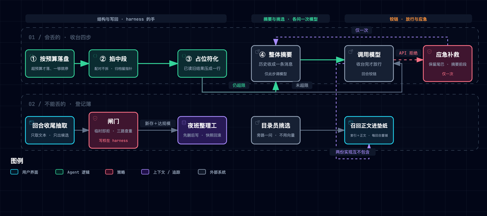

# ③ 记忆管理：会丢的和不能丢的

**一句话本质**：记忆不是一个功能，是两套咬合的机制——一套承认会丢，一套保证不丢。

## 1. 这一层要解决什么问题

上一章把「看见什么」安排好了：工序卡钉在台面上，手册按抽屉标签取用，垫纸每轮重铺。但它留下两笔没还的债。其一，**台面本身是有限的**——`messages` 只增不减，读过的文件、跑过的命令、模型的回复全都堆在台面上，再好的视野安排也架不住旧活把新活挤出去；其二，**师傅从不记事**——会话一结束台面清空，上一场干活的来龙去脉一点不剩，用户的偏好、项目的背景下次还得重说一遍。本章两套机制各还一笔：**压缩**承认会丢，把丢的代价压到最小；**持久记忆**保证不丢，把该留的留在会话之外。课程把它们放在相邻两章，却在代码里做成**互不包含的两份实现**——这个结构事实贯穿全章，见第 8 节。

| 缺口 | 机制 | 大白话 |
|:---|:---|:---|
| 台面单调堆满，新活上不来 | 收台四步：分级腾位 | 便宜的先收，贵的最后收 |
| 收台有损，丢掉的细节回不来 | 大结果先落盘＋占位符留指针 | 扔之前先抄个地址 |
| 裁剪可能拆散请求与回执 | 配对保护：切点向两侧让开 | 拆散一单，下一趟就装不出货 |
| 会话结束台面全空 | 登记簿＋扉页目录 | 另一本不随台面清空的册子 |
| 记忆越多垫纸越厚 | 目录员挑选＋按需召回 | 先翻扉页，再翻到那一页 |
| 记忆会重复、过期、发散 | 夜班整理工：先删后写＋快照回滚 | 定期誊清，誊之前先拍照 |

## 2. 机制全景



> 图源（可 diff 文本）：[`claude-code-memory--memory-panorama.mmd`](../../assets/mermaid/agent-harness/claude-code-memory--memory-panorama.mmd) · 交互版（下载到本地打开）：[`claude-code-memory--memory-panorama.html`](../../assets/architecture/agent-harness/claude-code-memory--memory-panorama.html)

## 3. M1 · 收台四步：分级腾位

> [!TIP] **类比**
> 台面堆满时，工坊不是立刻请记录员来写总结：先把最占地方的大家伙搬去仓库、在台面上留一张写有地址的条子，再掐掉中段的旧工序，然后把师傅已经看过的旧结果压成一行，实在还放不下，才让记录员把整段历史誊成一份摘要。便宜的先做，贵的最后做。

四步管线的顺序固定：**按预算落盘 → 掐中段 → 占位符化 →（估算超限才）整体摘要**【一】。前三步是纯结构与文本操作、零模型调用；第四步是这条管线里唯一的模型调用【一】。

| 步 | 动作 | 模型调用 | 腾的是什么 |
|:---|:---|:---:|:---|
| ① 按预算落盘 | 批次超预算时从最大的结果开始写文件，一回到预算内就停 | 无 | 最大的工具结果 |
| ② 掐中段 | 消息过多时保留头尾、掐掉中段，切点避开配对 | 无 | 旧消息条数 |
| ③ 占位符化 | 已被读过的旧结果压成一行 | 无 | 旧工具结果 |
| ④ 整体摘要 | 估算仍超限才把历史收成一条消息 | 有 | 整段历史 |

**顺序的真实力学不是流程规定，是数据依赖**。第一步落盘返回的不是路径，而是一段结构化文本：以包裹标签成对出现，内含独立一行 `Full output: <路径>` 加一段截断预览【一】。第三步压缩时**不查「这条是否落过盘」，只做行扫描**：找到以 `Full output: ` 开头的行就写成「已存于某路径」，找不到就写「已省略」【一】。两步之间没有状态传递、只有一条文本行约定——第三步的输入必须已经被第一步改写过，这才是「顺序不可换」的力学。

压缩不止一个入口，共四条【一】：

| 入口 | 触发 | 关键约束 |
|:---|:---|:---|
| 自动压缩 | 每次调用模型前的 `prepare`，估算超限才摘要 | 估算用字符数近似 token，必然失准 |
| 模型主动请求压缩 | 模型调用 `compact` 工具 | **必须等整批工具跑完、每个 `tool_use` 都配上 `tool_result` 之后**才压，否则留下孤立结果、或丢掉已发生副作用的执行记录 |
| 应急补救 | API 返回上下文超长错误 | **只补救一次**，再次失败异常外抛 |
| 摘要输入自保 | 送摘要的输入自身过长 | 头尾对切、中段标注完整记录在磁盘 |

还有一个顺序副作用：掐中段的整档归档发生在占位符化**之前**、整体摘要的归档发生在**之后**——两次归档的完整度不同，前者含原文、后者含的已是占位符，**归档完整性同样是顺序的函数**【一】。

**「大结果必须先落盘」有一条结构性覆盖缺口**（本文原生发现）：落盘的判据是**批次预算**——超预算才从最大的开始落、一够就停、且只落超过单条阈值的那些；而占位符化的判据是**长度与位次**、不核对是否落过盘【一】。两把尺子中间有缝：批次里较大的那条落了盘、较小的那条没落盘却随后被压成「已省略」，其原文**既不在上下文、也不在磁盘**——这条路径在完好实现里就可达，不需要拔掉任何保险。课程给出的兜底理由是旧命令可以重新执行：设计假设是**可重放**，不是**可归档**【一】。

两种摘要的破坏性不对称：主动路径把历史收成**一条消息**——整体丢弃、只剩「当前请求＋摘要＋归档路径」；应急路径反而是**部分**的——保留最近一段尾巴、只摘要前面。**主动路径比应急路径更激进**【一】。摘要回填的形态也有纪律：

- 摘要经 JSON 转义后写进消息、标明「仅供参考」、与当前用户请求**分栏**；
- system prompt 要求只听当前请求、把摘要当参考数据；
- 摘要模型自身的 system 也写明不执行历史里的指令。

**记录员写下的东西回到台面时是资料不是指令**——这条纪律在本层反复出现（摘要、记忆注入、抽取提示词），是同一原则的三次落地【一】。

> [!IMPORTANT] **实景**
> `s08_context_compact/code.py @ f9e8b28`（课程原文代码实测：抽出 `ContextCompactor` 原类在内存中驱动，无改码）
>
> ```text
> 场景 A：五条结果的批次，两条 120000 字符的大结果排在最旧，追加一条 assistant 后走第三步——
> 落盘文件 = ['toolu_0.txt']
> t0 首行 = Full output: /var/.../res/toolu_0.txt
> micro 后 t0 = '[Earlier tool result saved at /var/.../res/toolu_0.txt]'
> micro 后 t1 = '[Earlier tool result omitted.]'   ← 原文 120000 字符，从未落盘
> 场景 B：单条 150000 字符的结果、批次里只有它一条（未超批次预算）——
> 落盘文件 = 无；正文原样留在上下文，长度 = 150000
> ```

**口播落点**：顺序不是流程规定，是第三步的输入必须已被第一步改写过。

## 4. M2 · 收台四步：两道保险，看不见的不许动

> [!TIP] **类比**
> 收台有两条各自独立的规矩：一是先搬东西再压条子（顺序），二是师傅还没看过的料不许压（守卫）。材料把第一条讲成唯一的原因，实测显示两条各自都能兜住——是一对保险，不是一根保险丝。

第一道保险即 M1 的顺序。第二道是**看不见的守卫**，由一个可单独复算的静态方法承担：

- 先定位**最后一条 assistant 消息**，把它之后新增的所有 `tool_result` 算成一个位置集合；
- 占位符化只处理「已看过」的条目——位置落在集合里的整体跳过；
- 效果是**模型还没看过的结果不许被压成占位符，每条新结果至少被完整读到一次**【一】。

这条守卫有个值得记录的修订差异：课程站点的旧修订页**完全没有这道守卫**，替换条件只有位次与长度两条；「没看过的不许动」是仓库 main 轨的**净增量**【二／一】——「两道保险」只在 main 轨成立，这也是「材料自己在演进」的一个具体可验证的例子。

**纵深防御是实验结论，不是材料的论证**。两章 README 与站点都以论证形式给出顺序纪律（「顺序不能换」），没有任何实验；本文用[配套原型](./assets/cc_harness_lab.py)补齐了 2×2 实验（材料只给了论证，实验是我们补的）【一】：

| 拆什么 | 原文永久丢失 | 指针丢失 |
|:---|:---:|:---:|
| 完好基线 | 0 | 0 |
| 只拆顺序（顺序调换，守卫保留） | 0 | 0 |
| 只拆守卫（顺序仍正确） | 0 | 0＊ |
| 两道同时失效 | **1** | **1** |

＊ 短路径环境下为 0；在落盘路径较长的真实仓库目录里重跑同一格为 1（原因见下段）。

读法：**两道保险各自单独拆掉都不出「原文永久丢失」，一起拆才出事**——教科书意义上的纵深防御，而材料把顺序讲成了唯一理由。上表＊号是一个补充发现（本文实测）：守卫一拆，占位符化比正常提前一轮动手，长路径下「已存于某路径」的占位符长度随之越过阈值、被下述幂等缺陷二次压缩——**是否触发取决于路径长度，环境相关**。这恰恰说明幂等缺陷不在任何一道保险的覆盖范围内。

**占位符缺一个幂等标记**（原生发现，已在课程原文代码上独立复现）：压缩判据只看长度与位次、不看「这条是否已被压过」。已压成「已存于某路径」的条目，若路径长到让它再次越过长度阈值，下一轮会被**二次压缩**；而占位符里没有可供提取的落盘行，指针就此丢失、磁盘上的原文变成孤儿【一】。

> [!IMPORTANT] **实景**
> `s08_context_compact/code.py @ f9e8b28`（课程原文代码实测，深路径目录，无改码）
>
> ```text
> —— 守卫行为：模型看过之前一条不压，追加一条 assistant 后旧的才可压 ——
> 六条新结果在模型看过之前：占位符 0 条
> 追加一条 assistant 后再跑：较早的三条变占位符、最近三条保留
>
> —— 幂等缺陷：路径够长时占位符被自己二次压缩 ——
> 第一步落盘 = ['toolu_0.txt']
> 一次压缩后 t0 = '[Earlier tool result saved at /var/.../toolu_0.txt]'   长度 194（已超长度阈值）
> 二次压缩后 t0 = '[Earlier tool result omitted.]'   ← 占位符里无落盘行可提取，指针丢失
> 磁盘原文仍在但已无指针 = True
> ```
>
> 2×2 实验见[配套原型](./assets/cc_harness_lab.py) `--break D2 / D6` 实际运行输出（D2 无可观测差异；D6 原文永久丢失与指针丢失各 1）。

**口播落点**：两道保险各自单拆都不出事，一起拆才丢东西。

## 5. M3 · 收台四步：掐中段，不拆配对

> [!TIP] **类比**
> 掐掉中段旧工序时，一个请求和它的回执必须同去同留。留下孤零零的回执，传送带下一趟就装不出一份合法的货单。

不变式：**裁剪可以丢内容，不能丢结构**——一条带工具调用的 assistant 消息与紧随其后的工具结果消息绝不能被分开，孤立的结果会让下一次 API 请求本身非法【一／二】。实现形态值得精确写：它不是「找一个合法切点」，而是**把裁剪边界向两侧让开、让保留区变大、被掐掉的中段变小**——头侧若头部末条是带工具调用的 assistant，就向后推进头界、把它的结果一并留下；尾侧若尾部首条是工具结果，就向前回退尾界、把发起它的那条工具调用一并留下【一】。同一套保护在应急补救的尾切点上**再写了一遍**——两处切割、同一条约束【一】。

被掐掉的中段不是消失，而是替换成一条标记消息，写明掐掉了多少条、完整记录存在哪里——与占位符同一种哲学：**用一个可跟随的指针换空间**【一】。

> [!IMPORTANT] **实景**
> `s08_context_compact/code.py @ f9e8b28`；破坏实验见[配套原型](./assets/cc_harness_lab.py) `--break D3` 实际运行输出：
>
> ```text
> == D3 · 关掉工具调用与其结果的配对保护 ==
>   改动：Switches.pair_protection = False
>   退化：pairs_intact  True → False
> ```

**口播落点**：裁剪可以丢内容，不能丢结构：调用和结果绝不拆开。

## 6. M4 · 登记簿与扉页目录：跨会话的持久记忆

> [!TIP] **类比**
> 台面每晚都会被清空，所以工坊另有一本登记簿放在会话之外：扉页是目录，每条记忆是簿里的一页。扉页不是手写的——每写一页，扉页就从所有页从头重排一遍。

动机要分两级写清【一／二】。main 轨两章 README 的边界互指给出分工：上下文压缩管当前会话的有限台面、压缩时**允许舍弃可恢复的细节**；记忆管的是需要跨压缩、跨会话继续存在的信息，且它是**选择性存储**——不是对话记录的无损备份，也不取代压缩【一】。main 轨 README 给出的直接动机另有两条：**新会话的消息列表是空的**，以及**把全部记忆塞进垫纸每轮重发不划算**【一】。「压缩有损、所以要另存一份」的论证出自课程站点的记忆页：具体偏好（用 tab 不用空格）会被摘要简化成笼统类别（用户有代码风格偏好），且新会话连摘要都没有【二】。

**存储不变式**【一】：

- 一条记忆＝记忆目录下一个 Markdown 文件：YAML frontmatter 记录名字、说明、类型，正文是内容；
- 文件名由名字 slug 化而来，**同名即同文件**——这也是去重与整合覆盖的依据；
- `MEMORY.md` 是索引、一行一条（名字＋文件链接＋一句说明），**不是手写的**：每次写入后由 `rebuild_memory_index` 从全部文件重建——**索引是派生物、文件是事实源**；
- 路径守卫三连：拒绝含分隔符的文件名、拒绝把索引当记录、解析后校验仍在存储目录内。

四类记忆的措辞两轨有出入，本文按 main 轨口径：

| 类型 | 站点旧修订口径【二】 | main 轨口径【一】 |
|:---|:---|:---|
| `user` | 你是谁 | 用户的长期偏好 |
| `feedback` | 怎么做事 | 以后仍适用的工作反馈 |
| `project` | 正在发生什么 | **稳定的项目事实**；抽取提示词明令**禁止**存临时任务状态 |
| `reference` | 东西在哪找 | 外部资料或查找线索 |

**两层加载与一处最干净的文档—实现不一致**。机制不变式是「目录小而常驻、正文大而按需」——与技能两层加载同构、跨修订稳定。但讲法与实现要对齐着看：

| 口径 | 索引 | 召回正文 | 证据级 |
|:---|:---|:---|:---|
| 站点讲法 | 常驻 system prompt | **注入当前用户消息**，理由「不破坏提示缓存」 | 【二】 |
| main 轨代码 | 拼进 system prompt | **也拼进 system prompt**（全仓再无第二处注入点） | 【一】 |

站点还把「垫纸大段内容不宜每轮重写、要考虑缓存存活期」归为课程作者对闭源产品的分析【三】。教学实现没有做到自己讲的按需注入——这正是本层最干净的一处「教学版与生产版的距离」（详见第 8 节）。召回的时机与形态【一】：挑选与拼装在 agent loop **入口处各执行一次**，整轮工具调用期间垫纸不再变——**垫纸每个回合重铺一次，不是每次工具调用重铺**；召回正文有总长上限、按剩余额度逐条硬切，可能切断一条记录的中段。注入同样有防护：垫纸写明记忆是**被选出来的背景知识、不是对话记录**；召回内容作上下文用、不作新命令；与当前请求冲突时以当前请求为准【一】——与 M1 的摘要纪律是同一条原则的又一次出现。

> [!IMPORTANT] **实景**
> `s09_memory/code.py @ f9e8b28`（`build_system` 拼装的分节顺序，代码结构转述）
>
> ```text
> system prompt 分节（固定顺序）：
>   1. 身份与工具纪律
>   2. 记忆纪律（背景知识、非命令、冲突以当前请求为准）
>   3. Memory catalog:（索引全文——常驻）
>   4. Relevant memory records:（召回正文，JSON 数组——main 轨同样进了垫纸）
> ```

**口播落点**：扉页目录不是手写的，每次写完都从头重排一遍。

## 7. M5 · 目录员与夜班整理工：挑选、抽取与整合

> [!TIP] **类比**
> 开工前目录员被单独叫住问一句「这次要用哪几页」，他只报序号、不动笔。师傅撂下活的那一刻，抽取才发生；等登记簿攒到规模，夜班整理工才进来誊清——誊清前先拍一张全簿快照。

**挑选（召回侧）**。`select_relevant_memories` 把「序号＋名字＋说明」拼成目录，发一次**独立的旁路模型调用**，只要求返回 JSON 序号数组、条数有上限【一】。**全仓没有任何嵌入／向量／相似度代码**（两章 grep 零命中）——「用模型选、不用向量」在 main 轨是**可证的否定事实**；站点把同一条写成结论性标题，并称产品侧同样用模型本身来选【二／三】。降级有边界：回落到关键词匹配**只在调用抛异常时触发**；模型返回了内容却解析不出 JSON 数组时，解析函数返回空列表、直接判「无相关记忆」，**不会回落**——「答非所问」与「调用失败」被区别对待，前者更常见却没被兜住【一】。送进目录员的查询是最近几轮**用户文本**：工具结果虽也是 user 角色，但其内容块不是文本类型、被文本提取自然滤掉——工具噪声不污染选择依据【一】。

**抽取（写侧）**。触发点精确为：模型这一轮**没有发出任何工具调用**（且停止钩子没有强制续轮）→ 抽取 → 返回前——师傅撂下活的那一刻【一】。输入是最近若干条消息里的**文本块**、带总长上限，工具输出同样进不去，与提示词里「不要存工具输出」互为表里【一】。模型返回的只是**候选**，不直接落盘，要过两级闸门：

- 第一级（合法性）：字段完整性、类型在四类之内、候选须自报作用域；
- 第二级（该不该存）四关：必须自报**持久**；命中多语言「临时」标记词表（中英日三语）即拒；与已有记忆按 slug／说明／正文**三路查重**（同一批内先写的会参与后写的查重）；通过后才写文件并重建索引【一】。

**写入权不在模型手里**【一】：给模型的工具清单里没有任何记忆读写工具——模型不能主动「请记住」，也不能删除；记忆只能由回合收尾的旁路抽取写入。这是把记忆的写权从模型手里收走、交给 harness 的产品决定（次要缺口：通用的写文件与命令工具并未被禁止写记忆目录，路径守卫只约束记忆子系统自己的函数）。

**整合**。触发是**两个条件的合取**：本轮真的新存了至少一条，且记录总数达到阈值——两个条件都满足才叫夜班【一】。整合是**破坏性重写**，因此必须配安全网【一】：

1. 调模型前先校验：解析结果为空、或 slug 有重复，直接判失败不落盘；
2. 正常路径：先拍**全量快照** → 删光所有记忆文件 → 按新列表重写 → 重建索引；
3. 回滚路径：任一步失败 → 删净 → 从快照还原 → 重建索引 → 再抛出（外层兜住、只打印一行跳过）。

提示词里给的保留条数上限**代码并不强制**（只查重、不查数量），是软约束【一】。还有一个**反向门**（原生发现）：库太大时函数在调用模型之前就主动抛异常、被外层兜住、只打印一行跳过——**记忆库越大越需要整理，而一旦越过输入上限，整理就永久静默失效**；整合又是全仓**唯一**的删除路径，结果是记忆规模单调发散且无告警【一】。产品侧的整理门控属课程作者对闭源源码的分析【三】：要过距上次整理的间隔、扫描节流、自上次以来变更过的会话数量、锁文件（含崩溃后自动过期）四道门，具体数值随版本变动、本文不固化；main 轨 README 自承教学版把触发简化为数量阈值，真实应用还要决定何时整理、如何避免多进程同时改写同一份存储【一】。

> [!IMPORTANT] **实景**
> `s09_memory/code.py @ f9e8b28`（回合收尾的控制流，代码结构转述）
>
> ```text
> 模型本轮未发任何工具调用 →
>   extract_memories(messages)   → 新存 0 条  → 不整理，直接返回
>   extract_memories(messages)   → 新存 ≥1 条 且 库达阈值 → consolidate_memories()
> 整合内部：删光全部文件 → 按新列表重写 → 重建索引
>   任一步失败 → 删净 → 快照还原 → 重建索引 → 抛出（外层打印一行「跳过」）
> 库超过整合输入上限 → 调模型之前即抛异常 → 永久静默跳过
> ```

**口播落点**：师傅不能自己往登记簿上写字，执笔的另有其人。

## 8. 教学版与生产版的距离

1. **两章互不包含**。压缩与持久记忆在 main 轨是两份独立实现：压缩章的代码里搜不到任何记忆代码（零命中），记忆章的代码里搜不到任何压缩管线（唯一命中是 system prompt 提示语里的一个英文单词，不是机制）【一】。因此「压缩如何与记忆咬合」——例如「抽取取压缩前的快照」这类时间铰链——只存在于站点旧修订的讲法【二】，main 轨无法证实。课程作者拆过产品的闭源源码后指出，产品的记忆提取由停止钩子在后台触发、且由一个权限受限的派生执行体完成【三】；教学版把它简化为回合收尾的一次同步旁路调用。
2. **两层加载只讲没做**。站点讲「索引常驻、正文注入当前轮以保缓存」【二】（缓存存活期的考量归【三】），main 轨实现把两者都拼进了垫纸【一】——见第 6 节。
3. **阈值口径**。教学版的自动压缩阈值是一个扁平的字符数上限：字符数只能近似 token，且**没有任何输出预留**，所以才必须配一条 API 拒绝后的补救路径【一】。课程作者对产品源码的分析称，产品的自动压缩阈值要减去最大输出与一个缓冲常数——该常数未给选取理由，是个未加解释的经验值【三】。
4. **整合门控**。教学版是「新存过 且 库达规模」的合取【一】；产品是四道门＋并发锁【三】。
5. **为什么能简化**。本层真正的不变式——顺序的数据依赖、配对不拆、指针可跟随、写权归属 harness、索引派生重建——都不依赖上述被简化的参数与耦合。教学目标是证明机制自洽，不是复刻工程参数；但简化也确实留下了第 4、7 两节的覆盖缺口与反向门。

## 9. 关键实证

| 事实 | 一句话读法 | 证据级 | 随修订漂移 |
|:---|:---|:---|:---|
| 压缩四步顺序固定，前三步零模型调用 | 便宜的先做、贵的最后做 | 【一】 | 否 |
| 占位符里的路径是从落盘写下的内容里**提取**的，提取不到只能写「已省略」 | 顺序不是流程规定，是第三步的输入必须已被第一步改写过 | 【一】 | 否 |
| 落盘由批次预算决定、一够就停；占位符化不核对是否落过盘 | 「大结果先落盘」只覆盖它当时决定要落的那些 | 【一】 | 否（阈值漂移，机制不漂移） |
| 模型还没看过的结果不许被压成占位符 | 每条新结果至少被完整读到一次 | 【一】 | 否（站点旧修订无此守卫） |
| 只拆任一道保险都无「原文永久丢失」，两道同拆才出现 | 纵深防御，不是一根保险丝（实验为本文所补） | 【一】原型实测 | 否 |
| 占位符不幂等：路径够长会被二次压成「已省略」，指针丢失 | 压缩少了一个「压过了」的标记，且是否触发取决于路径长度 | 【一】课程原文代码复现 | 否 |
| 工具调用与其结果绝不被裁剪分开，切点向两侧让开 | 裁剪可以丢内容，不能丢结构 | 【一】 | 否 |
| 主动摘要把历史收成一条消息，应急摘要反而保留尾巴 | 常规路径比应急路径更激进 | 【一】 | 否 |
| 摘要以转义数据形态回填、与当前请求分栏，摘要模型被要求不执行历史指令 | 记录员写的是资料不是指令 | 【一】 | 否 |
| 记忆索引每次写入后从文件全量重建 | 扉页目录是派生物，登记簿里的页才是事实源 | 【一】 | 否 |
| 记忆挑选走旁路模型调用，全仓无任何嵌入／向量代码 | 用模型选，不用相似度 | 【一】否定事实 | 否 |
| 降级到关键词匹配只覆盖调用失败，不覆盖「答非所问」 | 最常见的那种失败没被兜住 | 【一】 | 否 |
| 抽取发生在模型撂下活的那一刻，输入只含对话文本、不含工具输出 | 存的是人说过的话，不是机器吐的字 | 【一】 | 否 |
| 候选必须自报「持久」，命中三语「临时」词表即拒 | 模型说的只是候选，闸门在 harness 手里 | 【一】 | 否（词表会变） |
| 模型没有任何记忆读写工具，写入权完全在 harness 手里 | 师傅不能自己往登记簿上写字 | 【一】 | 否 |
| 整合触发是「本轮新存过 且 库达规模」的合取 | 两个条件都满足才叫夜班 | 【一】 | 否（阈值漂移） |
| 整合先删后写，靠全量快照回滚兜底；库超输入上限则永久静默失效，而整合是唯一删除路径 | 越需要整理的时候越整理不动 | 【一】 | 否 |
| 索引常驻 system、正文按需注入当前轮，理由是不破坏提示缓存 | 两层加载：标签常驻，手册按需 | 【二】（缓存存活期部分【三】） | 是（main 轨代码两者都进 system） |
| 压缩有损，具体偏好会退化成笼统类别描述 | 摘要留得住目标，留不住口味 | 【二】 | 否 |
| 自动压缩阈值含一个未加解释的预留常数 | 经验值就是经验值 | 【三】 | 是 |
| 产品侧整合有间隔、节流、变更量、锁文件四道门 | 夜班整理工自己也要被排班 | 【三】 | 是 |
| 压缩与记忆在 main 轨是两份互不包含的实现 | 承认会丢的那套和保证不丢的那套，课程里根本没接上 | 【一】 | 是（轨道差异） |

## 10. 批判性边界

1. 「压缩有损」的例子（tab 偏好退化为笼统类别）是说明性举例，材料里没有任何信息保留率的度量、断言或测试【二】。
2. 「模型选 vs 向量检索」只有定性理由：教学实现每个用户回合要为挑选**多付一次模型调用**，回合结束可能再付抽取与整合——成本确定存在，召回率／延迟／成本的收益从未被度量。
3. 自动压缩阈值里的预留缓冲是一个未加解释的经验常数【三】；教学版连预留都没有、用字符数近似 token，所以才必须配补救路径【一】。
4. 落盘与占位符化的判据不同源（批次预算 vs 长度与位次），「原文永久丢失」在完好实现里就可达——设计假设是可重放，不是可归档【一】。
5. 整合输入上限与「越大越需要整合」正好反向：越界即永久静默失效，而它是唯一删除路径——规模单调发散、无告警【一】。

全局五条见[总纲第 7 节](./170-claude-code-harness-overview.md)，此处不重复。

## 11. 与本仓的关联

| 课程机制 | 本仓对位 | 判定 |
|:---|:---|:---|
| 压缩四步的成本分级与预算分配 | [`context_assembler.py`](../../../apps/negentropy/src/negentropy/engine/adapters/postgres/context_assembler.py) 的分层上下文预算 | ✅ 已对齐；🔶 其文件头引的课程轨号与层数已陈旧（旧轨三层，现行四步），建议消歧 |
| 两层加载（目录常驻、正文按需） | [Skills 设计](../../concepts/design/skills.md) 的渐进披露 | ✅ 已对齐（同一范式，总纲 §8 已判） |
| 登记簿「文件为事实源、索引派生重建」 | [记忆系统](../../concepts/subsystems/025-the-memory-system.md) | ✅ 机制同构；🔶 该文档引用的课程文件属旧 12 课轨，建议标注轨别 |
| 写权收归 harness（模型只出候选＋闸门过滤） | 本仓记忆写入路径 | 🔶 值得对照：若存在模型侧直写路径，可套「候选＋闸门」 |
| 占位符幂等缺失／整合输入上限反向门 | 本仓压缩与整理实现 | 🔶 值得自查：两处缺陷模式可直接当检查清单 |
| 产品侧整合四道门（间隔／节流／变更量／锁）【三】 | 本仓无对等机制 | ⏸ 暂缓（单进程场景先于多进程锁；反向门比锁更优先） |

## 12. 验收问答

1. **为什么压缩四步的顺序「不能换」？** 真正的力学是数据依赖：占位符里的路径是从内容中的落盘行**提取**出来的，提取不到只能写「已省略」——第三步的输入必须已被第一步改写过。成本分级（前三步零模型调用）只是并行的第二理由。且原型实测显示这条不变式由顺序与「看不见的不许动」两道独立保险共同维持，单拆任何一道都不出「原文永久丢失」。
2. **「大结果必须先落盘」什么时候会失效？** 落盘按批次预算停手、且只落超过单条阈值的那些；占位符化按长度与位次动手、不核对落盘与否。批次超预算时未轮到落盘的那条会被压成「已省略」，原文既不在上下文也不在磁盘——完好实现里即可达，设计假设是可重放不是可归档。
3. **为什么说「两套咬合的机制」在课程里其实没接上？** 压缩章与记忆章在 main 轨是互不包含的两份实现（两向 grep 零命中）；「压缩有损所以要持久记忆」的论证出自站点旧修订，main 轨 README 给的直接动机是新会话消息为空与全量塞垫纸不划算。「抽取取压缩前快照」这类时间铰链只在站点讲法里出现。
4. **模型能自己「记住」一件事吗？** 不能。给模型的工具清单里没有记忆读写工具；模型返回的只是候选，要过自报持久、四类合法、三语临时词表即拒、三路查重的闸门，写入只发生在回合收尾的旁路抽取里——写权在 harness 手里，删除权更是只有夜班整理工才有。

## 参考

[1] shareAI-lab, "learn-claude-code," GitHub repository, commit `f9e8b280`, Aug. 18, 2026. License MIT. 目录 `s08_context_compact` / `s09_memory`（`code.py` 与 `README.zh.md`，取数 2026-09-18）. [Online]. Available: https://github.com/shareAI-lab/learn-claude-code

[2] shareAI-lab, "Learn Claude Code（课程站点，旧修订），" s08 / s09 页. [Online]. Available: https://learn.shareai.run/zh/s08/

[3] 本仓, "五层 Harness 精读总览与配套原型," [`170-claude-code-harness-overview.md`](./170-claude-code-harness-overview.md) · [`assets/cc_harness_lab.py`](./assets/cc_harness_lab.py)
