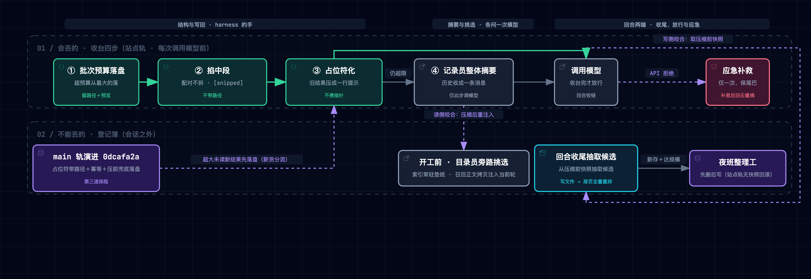

# ③ 记忆管理：会丢的和不能丢的

> [!TIP]
> **换代重读**：s08/s09 的最新完全重读（2026-09-30 站点形态 + main `ce8f9f18` + 官方文档当日交叉）见 [176](./176-learn-claude-code-memory.md)；本篇保留五层综观中的记忆层视角与双钉演进叙事。

**一句话本质**：记忆不是一个功能，是两套咬合的机制——一套承认会丢，一套保证不丢。

> [!NOTE]
> **本篇双钉与证据级**。机制正文钉**站点轨** `s08_context_compact` / `s09_memory` @ `67a9126`（2026-07-29，站点 20 章修订，第 3 集信源）；main 轨同名目录已演进到 `0dcafa2a`（2026-08-27），差异集中设第 8 节、随文内联「main 轨差异」注记；旧钉 `f9e8b28`（2026-08-18）只在演进叙事中出现。**两轨同号同目录名而内容不同版本，凡引机制必带轨别。**章→集归属与钉选理由只登记在[系列信源地图](../../../apps/negentropy-influence/source-map/claude-code-explained.md)；逐字引语与可调参数见[对应集 notes](../../../apps/negentropy-influence/episodes/claude-code-memory-video/research/source-notes.md)。证据级沿用[总纲 §4](./170-claude-code-harness-overview.md)：【一】钉点实测／【二】课程讲法／【三】课程作者对闭源源码的分析（带归属句）／【官】Anthropic 官方文档（2026-09-28 抓取，URL 见第 9 节）。

## 1. 这一层要解决什么问题

上一章把「看见什么」安排好了：工序卡钉在台面上，手册按抽屉标签取用，垫纸每轮重铺。但它留下两笔没还的债。其一，**台面本身是有限的**——`messages` 只增不减，读过的文件、跑过的命令、模型的回复全都堆在台面上，再好的视野安排也架不住旧活把新活挤出去，满了之后 API 直接拒绝；其二，**师傅从不记事**——会话一结束台面清空，上一场干活的来龙去脉一点不剩，用户的偏好、项目的背景下次还得重说一遍。本章两套机制各还一笔：**压缩**承认会丢，把丢的代价压到最小；**持久记忆**保证不丢，把该留的留在会话之外。两套机制怎么咬合，在站点轨、main 轨与官方产品里是三种不同形态——这个结构事实贯穿全章，见第 10 节。

| 缺口 | 机制 | 大白话 |
|:---|:---|:---|
| 台面单调堆满，新活上不来 | 收台四步：分级腾位 | 便宜的先收，贵的最后收 |
| 收台有损，丢掉的细节回不来 | 大结果先落盘＋占位符留线索 | 扔之前先抄个地址 |
| 裁剪可能拆散请求与回执 | 配对保护：切点向两侧让开 | 拆散一单，下一趟就装不出货 |
| 会话结束台面全空 | 登记簿＋扉页目录 | 另一本不随台面清空的册子 |
| 记忆越多垫纸越厚 | 目录员挑选＋按需召回 | 先翻扉页，再翻到那一页 |
| 记忆会重复、过期、发散 | 夜班整理工：先删后写 | 定期誊清，誊之前先拍个照（main 轨才有） |

## 2. 机制全景



> 图源（可 diff 文本）：[`claude-code-memory--memory-panorama.mmd`](../../assets/mermaid/agent-harness/claude-code-memory--memory-panorama.mmd) · 交互版（下载到本地打开）：[`claude-code-memory--memory-panorama.html`](../../assets/architecture/agent-harness/claude-code-memory--memory-panorama.html)

## 3. M1 · 收台四步：分级腾位

> [!TIP] **类比**
> 台面堆满时，工坊不是立刻请记录员来写总结：先把最占地方的大家伙搬去仓库、在台面上留一张写有地址的条子，再掐掉中段的旧工序，然后把师傅已经看过的旧条子压成一行，实在还放不下，才让记录员把整段历史誊成一份摘要。便宜的先做，贵的最后做。

站点轨把收台组织成四层并给它们编了号：裁中段、占位符化、批次预算落盘、整体摘要。**编号是讲课的顺序，干活是另一套顺序**——README 自己说明这四层编号只是讲解编号、实际执行顺序和编号不对应【二】，代码里每轮调用模型前真实执行的是**批次预算落盘 → 掐中段 → 占位符化 →（估算仍超限才）整体摘要**【一】；按课程作者对 CC 源码的分析，产品实序是「落盘 → 裁中段 → 清旧结果 → collapse → 摘要」，教学前三步与其一致【三】。前三步是纯结构与文本操作、零模型调用，第四步是这条管线里唯一的模型调用【一】——「便宜的先跑，贵的后跑」是全章的设计哲学【二】。

| 步 | 动作 | 模型调用 | 腾的是什么 |
|:---|:---|:---:|:---|
| ① 批次预算落盘 | 最新一批工具结果超预算时从最大的开始写文件，一回到预算内就停 | 无 | 最大的工具结果 |
| ② 掐中段 | 消息过多时保留头尾、掐掉中段，切点避开配对 | 无 | 旧消息条数 |
| ③ 占位符化 | 已滑出最近窗口的旧结果压成一行 | 无 | 旧工具结果 |
| ④ 整体摘要 | 估算仍超限才把历史收成一条消息 | 有 | 整段历史 |

各步的触发条数、保留窗口、长度门槛、批次预算等可调参数随修订漂移，**参数见对应集 notes**；本篇只写跨修订稳定的顺序约束。

压缩不止一个入口，共四条【一】：

| 入口 | 触发 | 关键约束 |
|:---|:---|:---|
| 自动压缩 | 每次调用模型前的预处理，估算超限才摘要 | 估算用字符数近似 token，必然失准 |
| 模型主动请求压缩 | 模型调用 `compact` 工具 | 回一条回执、结束当前轮，以压缩后的上下文开新一轮 |
| 应急补救 | API 返回上下文超长类错误 | **只补救一次**，再次失败异常外抛；成功调用后重试计数归零（README 未展示该重置） |
| 摘要输入自保 | 送摘要的输入自身过长 | 站点轨整体截断；main 轨改为头尾对切、中段标注完整记录在磁盘 |

「顺序不能换」的力学：占位符化是破坏性替换，**批次预算必须赶在它之前把完整内容送上磁盘**，破坏才不等于永久丢失【二】；课程作者指出 CC 源码也把落盘步放在最前面【三】。为什么必须留一条应急通道：字符估算对真实 token 有换算失准、未计请求固定开销、无输出预留三重误差，上下文增长快于压缩触发时 API 仍会拒绝【一】。另一个边界：**子代理不参与压缩**——它另有一份系统提示、没有压缩工具、上下文独立且有轮数上限【一】。

> [!IMPORTANT] **实景**
> `站点轨 s08_context_compact/code.py @ 67a9126`（课程原文函数，无改码内存驱动）
>
> ```text
> 场景 B：单条 150000 字符的结果、批次里只有它一条（未超批次预算）——
>   落盘文件 = 无；正文原样留在上下文，长度 = 150000
>   → 「大结果先落盘」只覆盖「批次超预算」这一种触发；单条大而批次未超时不动手
> ```

**口播落点**：编号是讲课的顺序，干活是另一套顺序——先落盘、再裁中段、再压条子，实在放不下才请记录员。

## 4. M2 · 配对不拆：裁剪的边界保护

> [!TIP] **类比**
> 掐掉中段旧工序时，一个请求和它的回执必须同去同留。留下孤零零的回执，传送带下一趟就装不出一份合法的货单。

不变式：**裁剪可以丢内容，不能丢结构**——一条带工具调用的 assistant 消息与紧随其后的工具结果消息绝不能被分开，孤立的结果会让下一次 API 请求本身非法【一】。实现形态值得精确写：它不是「找一个合法切点」，而是**把裁剪边界向两侧让开、让保留区变大、被掐掉的中段变小**——头侧若切口压在带工具调用的 assistant 上，就向后推进头界、把它的结果一并留下；尾侧若切口压在工具结果上，就向前回退尾界、把发起它的那条调用一并留下；头尾若已交叠则整档不裁【一】。同一套保护在应急补救的尾切点上**再写了一遍**——两处切割、同一条约束【一】。

被掐掉的中段不是消失，而是替换成一条 `[snipped {n} messages]` 标记消息，写明掐掉了多少条【一】。注意站点轨的这条标记**不带路径**——被掐的消息就此离开上下文，没有任何指针指回它们。

> **main 轨差异**：main 轨掐中段前先把完整历史写入 transcript 目录，归档标记写成「N messages archived at \<归档路径\>」——掐掉的内容有指针可寻【一】；`0dcafa2a` 再加两处加固：中段恰为单条归档标记时跳过再裁（标记本身要过三重核验：归档标记正则、路径落在归档目录内、文件真实存在），以及尾界偏移的一处修正——掐过的地方**留了记号就不再掐第二刀**【一】。

> [!IMPORTANT] **实景**
> 破坏实验见[配套原型](./assets/cc_harness_lab.py) `--break D3` 实际运行输出：
>
> ```text
> == D3 · 关掉工具调用与其结果的配对保护 ==
>   改动：Switches.pair_protection = False
>   退化：pairs_intact  True → False
> ```

**口播落点**：裁剪可以丢内容，不能丢结构：调用和结果绝不拆开。

## 5. M3 · 落盘与占位符：指针换空间

> [!TIP] **类比**
> 最占地方的大家伙先搬去仓库，台面上留一张写有地址的取货条。站点轨的条子分两种：刚落盘的大件，条子上写了地址；过几轮再压的旧条子，只剩一句「需要的话重跑一遍」。

两步合成「指针换空间」【一】：

- **批次预算落盘（写指针的一步）**：只统计**最新一批**工具结果（最后一条 user 消息里）的总量，超批次预算才按大小降序、从最大的开始落盘，一回到预算内就停，且只落超过单块门槛的块；替换文本是一个包裹标签，内含独立一行 `Full output: <路径>` 加一段截断预览。模型看到标记知道完整内容在磁盘上、需要时可以重新读。
- **占位符化（可能丢指针的一步）**：收集全对话的工具结果，最近窗口内的整体豁免，更旧且超过长度门的逐条压成一行通用提示 `[Earlier tool result compacted. Re-run if needed.]`。

**站点轨的占位符不携指针**（本钉点关键事实）：「Re-run if needed」直说了设计假设——**可重放，不是可归档**。由此有两条原文不可达路径（本文实测，均在完好实现里可达、不需要拔掉任何保险）：

1. **指针滑窗即丢**：已在批次预算里落盘的大结果，其包裹标签（路径＋预览）本身超过长度门；一旦滑出最近窗口，就被压成那行通用提示——磁盘原文仍在，但上下文里再无路径指向它。
2. **覆盖缺口**：落盘的判据是「批次预算＋单块门槛」，占位符化的判据是「位次＋长度」、不核对是否落过盘——两把尺子中间有缝，批次里未轮到落盘的较大结果被压后，原文**既不在上下文、也不在磁盘**。

> **main 轨差异**：旧钉 `f9e8b28` 起，占位符升级为「saved at」型——压缩时从内容中的 `Full output:` 落盘行**提取**路径、写进占位符，「顺序不可换」由此多了一层数据依赖论证（第三步的输入必须已被第一步改写过）；同时引入「看不见的守卫」（最后一条 assistant 之后新增的结果不压——每条新结果至少被完整读到一次）。`0dcafa2a` 再修复幂等并把原文丢失路径正面堵上，见第 8 节。

**保险的双口径**。维持「原文不丢」这条不变式的保险，两轨数量不同：

| 轨 | 保险 | 实测依据 |
|:---|:---|:---|
| 站点轨 `67a9126` | 两道：①先落盘再占位的顺序；②最近窗口豁免（最近若干条整体不压，粗粒度的「新结果不许动」） | 场景 A 实测 |
| main 轨 `0dcafa2a` | 三道：①顺序；②「看不见的守卫」（精确到每条结果是否已被读过）；③压前兜底落盘（无指针可提取的先落盘再写占位符） | 2×2 实验（旧钉）＋ V2（新钉） |

main 旧钉上的 2×2 破坏实验（[配套原型](./assets/cc_harness_lab.py) `--break D2 / D6`，历史实证）：**只拆任一道都不出「原文永久丢失」，两道同拆才出现**——教科书意义上的纵深防御，而材料把顺序讲成了唯一理由。＊号是当时的补充发现：守卫一拆，占位符化提前一轮动手，长路径下「saved at」占位符越过长度门被二次压缩而丢指针——**是否触发取决于路径长度**；这个幂等缺陷不在任何一道保险的覆盖范围内，`0dcafa2a` 已修（第 8 节 V1）。

> [!IMPORTANT] **实景**
> `站点轨 s08_context_compact/code.py @ 67a9126`（课程原文函数，无改码内存驱动）
>
> ```text
> 场景 A：批次 [250000 字大结果 t0 ＋ 5000 字旧结果 t1] 超预算 →
>   budget：落盘文件 = ['t0.txt']；t0 块 = 包裹标签＋Full output: …/t0.txt＋2000 字预览（共 2201 字）
>           t1 未落盘（低于单块门槛），原文留在上下文
> 下一轮新增三条小结果、t0/t1 滑出最近窗口 →
>   micro：t0 = '[Earlier tool result compacted. Re-run if needed.]'   ← 落过盘的指针被压掉
>          t1 = '[Earlier tool result compacted. Re-run if needed.]'   ← 从未落盘，原文不可达
>   最近窗口三条原样保留；磁盘 t0.txt 仍在 = True，但上下文已无路径指向它
> ```

**口播落点**：搬去仓库之前先抄地址——站点轨的旧条子上却只写了「需要就重跑一遍」。

## 6. M4 · 登记簿与扉页目录：跨会话的持久记忆

> [!TIP] **类比**
> 台面每晚都会被清空，所以工坊另有一本登记簿放在会话之外：扉页是目录，每条记忆是簿里的一页。扉页不是手写的——每写一页，扉页就从所有页从头重排一遍。

动机要分两级写清【二】：其一，压缩有损——「用 tab 不用空格」这类具体偏好会被摘要简化成「用户有代码风格偏好」这样的笼统类别，摘要留得住目标、留不住口味；其二，新开一个会话连摘要也没有——LLM 没有持久状态，所有信息都在上下文窗口里。所以要有一层**不参与压缩、跨会话保留**的存储。

> **main 轨差异**：main 轨 README 把直接动机写为新会话消息列表为空、把全部记忆塞进垫纸每轮重发不划算，并强调记忆是选择性存储而非对话记录的无损备份、不取代压缩【一】。

**存储不变式**【一】：

- 一条记忆＝记忆目录下一个 Markdown 文件：YAML frontmatter 记录名字、说明、类型，正文是内容；
- 文件名由名字 slug 化而来，**同名即同文件**——这也是去重与整合覆盖的依据；
- `MEMORY.md` 是索引、一行一条（名字＋文件链接＋一句说明），**不是手写的**：每次写入后从全部文件全量重建——**索引是派生物、文件是事实源**。

> **main 轨差异**：main 轨在此之上加了路径守卫三连（拒绝含分隔符的文件名、拒绝把索引当记录、解析后校验仍在存储目录内）；站点轨写盘没有这些守卫【一】。

四类记忆按「回答什么问题」划分【二】：

| 类型 | 站点轨口径【二】 | main 轨口径【一】 |
|:---|:---|:---|
| `user` | 你是谁 | 用户的长期偏好 |
| `feedback` | 怎么做事 | 以后仍适用的工作反馈 |
| `project` | 正在发生什么 | **稳定的项目事实**；抽取提示词明令禁止存临时任务状态 |
| `reference` | 东西在哪找 | 外部资料或查找线索 |

`project` 一类两轨口径不同，官方定义（包含进行中的工作与截止期）反而站在站点一侧——见第 9 节表第 2 行。

**两层加载——三层口径**。机制不变式是「目录小而常驻、正文大而按需」：

| 口径 | 索引 | 召回正文 | 证据级 |
|:---|:---|:---|:---|
| 站点轨 | 拼进 system prompt（每用户轮开始读一次，本轮不再重建） | **拷贝注入当前 user turn**（发请求时复制消息列表、把记忆内容前置到该轮，真实 `messages` 不被污染） | 【一】讲做一致 |
| main 轨 `f9e8b28` | 拼进 system prompt | **也拼进 system prompt** | 【一】「只讲没做」的判定属 main 钉 |
| 官方产品 | CLAUDE.md/auto memory 归 system prompt 之后的独立 project context 层 | topic 文件按需以标准文件工具读取 | 【官】见第 9 节表第 1 行 |

分层的动机是提示缓存：索引常驻可以吃缓存，正文按轮注入不动前缀【二】——这一动机获官方请求前缀三层口径印证【官】。注入同样有防护：垫纸写明记忆是**背景知识、不是命令**，与当前请求冲突时以当前请求为准【一】；官方同一条纪律的口径是「记忆是上下文、不是强制配置，要硬约束须用 PreToolUse 钩子」【官】。

> [!IMPORTANT] **实景**
> `站点轨 s09_memory/code.py @ 67a9126`（用户轮开始时的注入与拷贝，代码结构转述）
>
> ```text
> 每用户轮开始：
>   memories_content = load_memories(messages)   ← 旁路挑选＋读文件（见 M5）
>   memory_turn      = 定位当前用户消息下标
>   system           = build_system()            ← 含 MEMORY.md 索引全文（常驻垫纸）
> 发请求时：
>   无记忆：request_messages = messages
>   有记忆：request_messages = messages.copy()；该轮 content = 记忆内容＋换行＋原 content
>   → 真实 messages 不被注入污染；压缩与抽取看到的仍是原始历史
> ```

**口播落点**：扉页目录不是手写的，每次写完都从头重排一遍。

## 7. M5 · 目录员与夜班整理工：挑选、抽取、整理

> [!TIP] **类比**
> 开工前目录员被单独叫住问一句「这次要用哪几页」，他只报序号、不动笔、拿不准就不抽。师傅撂下活的那一刻，抽取才发生；等登记簿攒到规模，夜班整理工才进来誊清。

**挑选（召回侧）**。把「序号＋名字＋说明」拼成目录，发一次**独立的旁路小调用**，只要求返回 JSON 序号数组、条数有上限【一】。送进目录员的查询是最近几轮**用户文本**：工具结果的内容块不是文本类型、被文本提取自然滤掉——工具噪声不污染选择依据【一】。**两章合计没有任何嵌入／向量／相似度代码**（grep 零命中）——「用模型选、不用向量」在教学轨是**可证的否定事实**【一】。降级边界：站点轨上「调用失败」与「答非所问」（返回了内容但解析不出序号数组）**都**回落到关键词匹配【一】；main 轨差异——解析失败不回落、直接判「无相关记忆」，更常见的「答非所问」反而没被兜住【一】。产品侧按课程作者对 CC 源码的分析是用 Sonnet 本身来选、不是向量相似度【三】；官方文档则只说模型需要时用标准文件工具按需读取、未记载任何旁路挑选【官】——三层并列，谁也不能升格为产品事实。

**抽取（写侧）**。触发点精确为：模型这一轮**没有发出任何工具调用**（对话告一段落）→ 从**压缩前快照**抽取 → 返回前【一】。这条时间铰链是站点轨上压缩与记忆的咬合点：即使本轮压缩管线已经把 `messages` 压扁，抽取看到的仍是压缩前的原文——保真不被压缩破坏【一】。输入是最近若干条消息里的**文本块**、带总长上限，工具输出进不去【一】。模型返回的只是**候选**，站点轨的写盘门槛很弱：字段齐全即写文件并重建索引，防重只靠把已有清单塞进提示词（软约束）【一】。

> **main 轨差异**：main 轨在写盘前设两级闸门——合法性（字段完整、类型在四类内、自报作用域）与该不该存（必须自报**持久**、命中多语言「临时」标记词表即拒、与已有记忆按 slug／说明／正文**三路查重**）【一】。

**写入权不在模型手里**【一】：站点轨给模型的六个工具里没有任何记忆读写工具——模型不能主动「请记住」，也不能删除；记忆只能由回合收尾的旁路抽取写入。官方表述把读写主体说成 Claude 本身（界面会提示「Saved 2 memories」），但未给出写入路径细节——与 harness 侧写入并不矛盾，张力如实记录【官】。

**整理**。站点轨触发条件是单一的**文件数阈值**【一】。整理是破坏性重写：提示词要求去重、合并矛盾、淘汰过时并给出保留条数上限（**代码并不强制的软约束**）；把目录截断后送模型，然后**删光全部记忆文件、按新列表重写、重建索引**；任一步失败被静默吞掉，且**没有快照回滚**【一】。由此有一个原生反向门（本文观察）：送整理的目录在截断窗口之外的记忆**不进整理视野、却照样被删**——越大越需要整理、越整理不动，而整理又是全仓唯一的删除路径。

> **main 轨差异**：main 轨的整理加了全量快照回滚（先拍快照→删光→重写→任一步失败则删净还原再抛出），触发改为「本轮新存过 且 库达规模」的合取；但它有另一种形态的反向门——库超过整理输入上限时函数在调模型之前就抛异常、被外层兜住只打印一行，**整理永久静默失效**【一】。产品侧按课程作者的分析有四道门：距上次整理的时间间隔、扫描节流、自上次以来变更过的会话数量、锁文件（含崩溃后自动过期），数值随版本变动不固化【三】。

**Memory 与 session memory 的分工**：Memory 管跨会话长期知识，session memory 管同会话内压缩后的续接——一个管一辈子，一个管这一场【二】。教学版未实现 session memory；按课程作者的分析，产品的压缩在动手前会先尝试用 session memory 做轻量摘要、内容足够时**零 LLM 调用**【三】——这是「便宜先跑」在记忆侧的同族实证。

> [!IMPORTANT] **实景**
> `站点轨 s09_memory/code.py @ 67a9126`（回合收尾控制流，代码结构转述）
>
> ```text
> 每轮调用模型前：
>   pre_compress = messages 的完整快照            ← 「压缩前」在此定格
>   messages = 批次预算 → 掐中段 → 占位符化（→ 估算超限则整体摘要）
> 模型本轮停止且未发任何工具调用 →
>   extract_memories(pre_compress)                 ← 从压缩前快照抽取（保真）
>     候选字段齐全即写文件 → 扉页全量重排
>   consolidate_memories()                          ← 文件数达阈值才动手
>     目录截断后送模型 → 删光全部旧文件 → 按新列表重写 → 重建索引
>     任一步失败 → 静默跳过（无快照回滚）
> ```

**口播落点**：师傅不能自己往登记簿上写字，执笔的另有其人。

## 8. main 轨演进（0dcafa2a）：四项机制级修复

main 自旧钉 `f9e8b28` 前进 25 个提交（2026-08-19 → 08-27，104 文件），唯一落在本章的机制级变更是压缩章的一次重写（PR #537，`code.py` 净增约 175 行），共四项【一】：

1. **条件化收手**：占位符化签名加了目标值，逐条压缩前先估算、已降到目标内即停——收台工从「无差别扫全台」变成「**腾到够放就停手**」；管线目标定为阈值的八成。
2. **新货分流**：新增 `fit_tool_results`——若仅**未读取的最新一批结果**就足以撑爆上下文，把其中最大的先落盘、留短预览与完整路径，避免模型还没看到新结果就先总结整段历史。它与第一步的批次预算搬运不同：那是旧结果的批次整理，这是「**刚出炉的大件直接进仓库，不上台面**」。
3. **占位符幂等**：指针提取同时识别包裹标签与「saved at」两种形态，且校验路径必须落在落盘目录内、是真实文件——**条子上的地址必须是本坊仓库的门牌**，外地址一律不认。自身占位符被再次压缩时提取出同一指针重写，指针不再丢。
4. **掐口不二刀**：掐中段识别「中段恰为单条归档标记」的场景并跳过再裁（标记须过正则、目录内、文件存在三重核验），外加一处尾界偏移修正。

管线随之更新为：**批次预算 → 掐中段 →（超限？占位符化(目标) → 新货分流(目标) → 整体摘要）**【一】。

**「批判性边界被上游采纳」的少见实证**。旧文曾把两条缺陷登记为现行缺陷：「原文永久丢失在完好实现里可达」（覆盖缺口）与「占位符不幂等、路径够长会被二次压掉指针」。`0dcafa2a` 的修法恰好是当初指出的两条路径——先落盘再压缩、识别既有指针——我们按实验纪律照单记录这个收敛，**不宣称因果**。站点轨（视频信源钉）上这两条缺口至今仍在。保险口径随之升格：站点轨两道（顺序＋最近窗口），main 轨三道（再加压前兜底落盘——它把 2×2 实验里「两道同拆才出事」的那一格也兜住了）。

> [!IMPORTANT] **实景**
> `main 轨 s08_context_compact/code.py @ 0dcafa2a`（课程原文 `ContextCompactor`，无改码内存重放；实验期脚本 `.temp/learn-cc-lab/verify/verify_fixes.py`，场景可按此处描述重建）
>
> ```text
> == V1 · 占位符幂等（长路径占位符二次压缩）==
>   压前长度 = 301，占位符路径长度 = 270
>   压后内容：[Earlier tool result saved at …/tool-results/x….txt]（仍含 saved at，无「已省略」）
>   V1 判定：PASS 指针保留——旧钉上同一场景会被二次压成通用提示、指针丢失
> == V2 · 原文永久丢失路径（未落盘内容先存再压）==
>   场景：5000 字从未落盘的大结果排在最旧、下带填充结果
>   压后内容：[Earlier tool result saved at …/tool-results/t1.txt]
>   磁盘文件 = ['f1.txt', 't1.txt']，原文在磁盘 = True
>   V2 判定：PASS 先落盘再压缩——旧钉上同一场景原文既不在上下文也不在磁盘
> ```

## 9. 官方文档对照

官方文档站已整体迁至 `code.claude.com/docs/en/*`（旧 `docs.claude.com` 地址 301 重定向）。本维度硬分歧与同构锚如下（【官】断言均出自下列七页，访问 2026-09-28：`memory` / `context-window` / `model-config` / `how-claude-code-works` / `costs` / `sessions` / `prompt-caching`）：

| # | 议题 | 课程口径 | 官方口径【官】 | 本篇处置 |
|:---|:---|:---|:---|:---|
| 1 | 记忆注入位置 | 站点轨：索引进 system、正文注入当前轮（讲做一致）；main 轨：两者都进 system | CLAUDE.md 以 system prompt **之后的 user message** 送达；CLAUDE.md/auto memory/无 paths 规则归独立 project context 层 | 三层对照（第 6 节）；缓存动机获印证 |
| 2 | `project` 类边界 | 站点：「正在发生什么」；main：「稳定事实、禁临时状态」 | project＝ongoing work、deadlines、decisions（不可从代码或 git 历史推导） | 官方站站点一侧；按钉点分层叙述 |
| 3 | 压缩与记忆的结构关系 | main 钉两章互不包含；站点轨单向包含＋写侧快照 | 压缩点有文档化接合：CLAUDE.md、auto memory、计划 **re-injected from disk**；中途编辑的 CLAUDE.md 下次 /clear、/compact 重载 | 「没接上」限定 main 钉；三形态并列（第 10 节） |
| 4 | 主动摘要的丢弃面 | 全部旧消息换成一条摘要；主动比应急激进 | 结构化摘要保留 requests/intent、关键概念、文件与代码片段、错误与修法、pending tasks；并重注入记忆与最近文件 | 教学事实保留；产品保留面显著更宽 |
| 5 | 记忆挑选机制 | 旁路调用选文件名（全仓零向量代码）；【三】产品用 Sonnet 自选 | 未文档化旁路挑选；模型需要时用**标准文件工具**按需读取 | 三层并列（第 7 节）；否定事实保留 |
| 6 | MEMORY.md 维护 | 每次写入后从全部文件全量重建（索引派生） | Claude 会话中持续维护；首 200 行或 25KB 常驻；超限写成功但报错引导重写 | 教学不变式保留＋官方量化锚补记 |
| 7 | 「micro compact」术语 | 课程/社区把清旧工具结果一步称作 micro compact | 7 页全文＋全站检索**无此词**；表述为 "clears older tool outputs first, then summarizes" | 正文用「占位符化／清旧工具结果」，机制名标注课程口径 |
| 8 | 两层加载的缓存动机 | 索引常驻吃缓存、正文按需不动前缀 | 请求前缀三层；project context 层会话开始或 /clear、/compact 时变化；压缩重写记 expected rebuild | 同构印证 |
| 9 | 指针换空间 | 包裹标签＋`Full output:` 行＋预览；掐段标记 | 压缩后超 5,000 token 的文件回来只剩 `Referenced file` 路径引用；hook 输出超 10,000 字符落盘＋预览＋路径 | 同哲学的官方落地 |
| 10 | 阈值量级 | 教学扁平字符上限；【三】产品公式＝窗口−最大输出−13,000 缓冲 | 1M 窗口默认约 967K 提前压 | 967,000＝1,000,000−20,000−13,000 精确吻合——方向互证；官方未公布各成分，精确归因不可核 |
| 11 | 补救有界 | 应急只试一次、再失败外抛 | 抖动守卫：摘要后立刻 refill 时几次尝试后停止并报错 | 一致·互补（触发口径不同：API 拒绝 vs 抖动） |
| 12 | 阈值可调 | 无可调面 | `/autocompact` 命令、flag、设置、环境变量四层调法（100K–1M） | 互补新增 |
| 13 | 「落盘」一词 | 教学 transcript＝压缩时一次性归档 | transcript＝完整会话持续写 plaintext JSONL（支撑 rewind/resume/fork）；默认 30 天保留而**记忆文件豁免清理** | 同词异物，正文已消歧（第 10 节） |

课程之外的官方面（本篇不展开、参数见对应集 notes）：CLAUDE.md 四级作用域（含组织托管层）与多文件拼接排序、`@path` 导入递归上限、体量建议与加载硬上限、`/init`／`/memory`／`/context` 核查面、AGENTS.md 直读、auto memory 默认开启与三层开关、`modified` 时间戳、子代理记忆隔离、图片/PDF 批量移除、闲置大会话的摘要恢复。

## 10. 教学版与生产版的距离

1. **压缩与记忆的咬合，三种形态**。站点轨：记忆章完整保留压缩章管线（单向包含），并以「抽取取压缩前快照」实现**写侧**咬合【一】。main 轨：两章互不包含的两份实现（压缩章代码里搜不到任何记忆代码、记忆章代码里搜不到任何压缩管线，两向 grep 零命中）——「互不包含」是 main 钉的课程仓事实【一】。官方产品：压缩点有**读侧**接合——CLAUDE.md、auto memory、计划从磁盘重注入，压缩后重读至多五个最近文件、超限文件回来只剩路径引用、已调用技能体按预算重注入【官】。「课程里根本没接上」的旧判定收窄为 main 钉专属。
2. **两层加载三口径**：站点做到了、main 轨退化、官方位置另议——见第 6 节表与第 9 节表第 1 行。
3. **阈值口径**。教学版是一个扁平的字符数上限：字符数只能近似 token、无任何输出预留，所以必须配一条 API 拒绝后的补救路径【一】。产品侧按课程作者分析是「窗口 − 最大输出 − 13,000 缓冲」的精确 token 公式【三】；官方 1M 窗口默认约 967K 提前压缩，与该公式在 20K 输出预留下精确吻合——量级互证，但缓冲常数的选取理由官方从未公布【官／三】。官方另提供四层可调窗口，教学版无可调面【官】。
4. **摘要保留面**。教学版主动摘要把历史收成一条消息、整体丢弃（只剩摘要与归档）——常规路径比应急路径更激进【一】；产品的结构化摘要保留面宽得多且压后重注入（第 9 节表第 4 行）【官】。
5. **整理门控**。教学版：站点轨是单一数量阈值＋截断盲区＋静默失败；main 轨是「新存过且达规模」合取＋快照回滚，但换入「超限静默失效」形态的反向门【一】。产品是四道门＋并发锁【三】。
6. **为什么能简化**。本层真正的不变式——顺序的数据依赖、配对不拆、指针可跟随、写权归属 harness、索引派生重建——都不依赖上述被简化的参数与耦合；教学目标是证明机制自洽，不是复刻工程参数。但简化也确实留下了站点轨的指针滑窗、覆盖缺口与整理反向门（第 5、7 节），其中前两条已在 main 轨 `0dcafa2a` 修复（第 8 节）。
7. **两处「落盘」是两物**。课程说的落盘是压缩管线的大结果溢写与压缩时归档；官方的转录落盘是完整会话记录（每条消息、工具用、结果持续写 plaintext JSONL），支撑回溯、恢复与分叉，默认 30 天保留——而记忆文件豁免于这轮清理，「保证不丢」在产品侧由此落地【官】。

## 11. 关键实证

| 事实 | 一句话读法 | 证据级 | 随修订漂移 |
|:---|:---|:---|:---|
| 四步执行序固定为「落盘→掐中段→占位符化→摘要」，前三步零模型调用 | 便宜的先做、贵的最后做；编号只是讲课顺序 | 【一】 | 否（参数漂移，顺序不漂） |
| 先落盘再占位的顺序约束：占位符化是破坏性替换，落盘必须发生在它之前 | budget 先把完整内容送上磁盘，破坏才不等于永久丢失 | 【二／三】 | 否 |
| 站点轨占位符是「Re-run if needed」型、不携指针 | 设计假设是可重放，不是可归档 | 【一】 | 是（main 轨已改「saved at」型） |
| 落过盘的大结果滑出最近窗口后，指针被压成通用提示 | 磁盘原文仍在，上下文再无路径指向它 | 【一】实测 | 是（main `0dcafa2a` 已修） |
| 落盘按批次预算停手且只落超单块门槛的块；占位符化不核对落盘与否 | 两把尺子中间的缝：未轮到落盘的较大结果被压后原文不可达 | 【一】实测 | 是（main `0dcafa2a` 已堵） |
| 工具调用与其结果绝不被裁剪分开，切点向两侧让开；snip 与 reactive 两处同约束 | 裁剪可以丢内容，不能丢结构 | 【一】 | 否 |
| 只拆任一道保险都无「原文永久丢失」，两道同拆才出现 | 纵深防御，不是一根保险丝（实验为本文所补，main 旧钉） | 【一】原型实测 | 是（main 新钉第三道兜住同拆格） |
| 主动摘要把历史收成一条消息，应急摘要反而保留尾巴 | 常规路径比应急路径更激进 | 【一】 | 否 |
| 抽取发生在模型撂下活的那一刻，输入是压缩前快照、只含对话文本 | 写侧咬合：存的是人说过的话，且保真不被压缩破坏 | 【一】 | 否（main 轨保留同构） |
| 记忆索引每次写入后从文件全量重建 | 扉页目录是派生物，登记簿里的页才是事实源 | 【一】 | 否（官方另有持续维护口径【官】） |
| 记忆挑选走旁路小调用，两章合计零向量代码 | 用模型选，不用相似度 | 【一】否定事实 | 否 |
| 站点轨降级关键词覆盖「调用失败」与「答非所问」两种 | 站点轨把最常见的那种失败也兜住了；main 轨没有 | 【一】 | 是（轨间差异） |
| 模型没有任何记忆读写工具，写入权完全在 harness 手里 | 师傅不能自己往登记簿上写字 | 【一】 | 否 |
| 整理是唯一的删除路径：站点轨无快照回滚、失败静默、截断窗外照样删 | 越需要整理的时候越整理不动 | 【一】 | 是（main 轨加回滚、换入超限静默形态） |
| 索引常驻、正文按需注入当前轮，动机是不破坏提示缓存 | 两层加载：标签常驻，手册按需 | 【一／二】（【官】印证） | 是（main 轨两者都进 system） |
| 压缩有损，具体偏好会退化成笼统类别描述 | 摘要留得住目标，留不住口味 | 【二】 | 否 |
| 产品阈值含未加解释的预留常数；1M 窗口约 967K 与公式精确吻合 | 方向互证，成分不可核 | 【三／官】 | 是 |
| 产品整理有时间、节流、会话数、锁文件四道门 | 夜班整理工自己也要被排班 | 【三】 | 是 |
| `0dcafa2a` 四项演进：条件化收手、新货分流、占位符幂等、掐口不二刀 | 两条旧缺陷被上游以当初指出的路径修复（不宣称因果） | 【一】V1/V2 实测 | — |
| 产品压缩点从磁盘重注入 CLAUDE.md/auto memory/计划，重读最近文件 | 读侧咬合：压完把不能丢的拿回来 | 【官】 | — |
| 现行官方文档不使用「microcompact」一词 | 机制一致、命名是课程/社区口径 | 【官】 | — |

## 12. 批判性边界

1. **信息保留率零度量**：「压缩有损」（tab 退化为笼统类别）与「记忆有用」都是说明性举例——保留率、召回率、注入对后续行为的影响，材料里没有任何数字、断言或测试【二】。
2. **「模型选 vs 向量检索」缺权威第三方**：教学实现每个用户回合要为挑选**多付一次小调用**，回合结束可能再付抽取与整理——成本确定存在，召回侧零度量；产品侧断言属闭源分析【三】、官方文档不记载挑选机制【官】，两派都升不了格。
3. **阈值预留常数无解释**：缓冲常数的选取理由材料内无处可查【三】；官方只给行为数字不给成分【官】；教学版连预留都没有、用字符数近似 token，所以才必须配补救路径【一】。
4. **站点轨两处原文不可达路径**：指针滑窗与覆盖缺口在完好实现里即可达——设计假设是可重放，不是可归档【一】；main 轨已修（第 8 节），但「重跑找回」本身有正反馈风险（见第 6 条）。
5. **整理反向门两种形态**：站点轨「截断窗外照样删＋无回滚＋静默」与 main 轨「超限静默失效」——共同点是越需要整理越整理不动，而整理是唯一删除路径，规模单调发散且无告警【一】。
6. **崩溃顺序是推演不是实验**（极限场景分析）：这套系统最先倒下的多半是计量尺——字符当 token 的三重误差撞上 API 拒绝，应急通道只试一次且压不掉未计量的固定开销，异常外抛（全仓唯一「失败即异常」的机制）；第一个静默退化是整理反向门；而「无指针占位符 → 重跑找回 → 输出再膨胀」构成正反馈加速器——三者都无告警。
7. **【三】层不可升格**：对产品的全部断言（Sonnet 自选、Dream 四道门、常量表、cache 路径）是课程作者对闭源源码的分析，官方文档不背书且部分术语（microcompact）官方不使用——转述必须带归属句。

全局五条见[总纲第 7 节](./170-claude-code-harness-overview.md)，此处不重复。

## 13. 与本仓的关联

| 课程机制 | 本仓对位 | 判定 |
|:---|:---|:---|
| 压缩四步的成本分级与预算分配 | [`context_assembler.py`](../../../apps/negentropy/src/negentropy/engine/adapters/postgres/context_assembler.py) 的分层上下文预算 | ✅ 已对齐（文件头课程轨号与层数的旧 🔶 已于 commit `7a192f4f5` 消歧：现引根级四步管线并注明旧轨为历史形态） |
| 两层加载（目录常驻、正文按需） | [Skills 设计](../../concepts/design/skills.md) 的渐进披露 | ✅ 已对齐（同一范式，总纲 §8 已判；官方索引常驻上限与按需读取口径再印证） |
| 登记簿「文件为事实源、索引派生重建」 | [记忆系统](../../concepts/subsystems/025-the-memory-system.md) | ✅ 机制同构（旧 🔶 轨别标注已解决：025 已注明所引为仓库根级现行目录） |
| 写权收归 harness（候选＋闸门过滤） | 本仓记忆写入路径 | 🔶 值得对照：闸门强度按钉点分层——站点轨仅软防重、main 轨才有两级闸门与三路查重，对照时以强轨为准 |
| 占位符幂等缺失／整合反向门（自查清单） | 本仓压缩与整理实现 | 🔶 维持自查；**性质更新**——幂等与原文丢失已在课程上游 `0dcafa2a` 修复（V1/V2 PASS），从「现行缺陷」变「历史案例＋修复回执」；反向门两种形态（截断盲区＋全删＋无回滚／超限静默失效）都要对 |
| 产品侧整合四道门（间隔／节流／变更量／锁）【三】 | 本仓无对等机制 | ⏸ 暂缓（单进程场景先于多进程锁；反向门比锁更优先） |
| （新增）压缩后从磁盘重注入记忆与最近文件【官】 | 本仓 compact/re-inject 链路 | 🔶 值得自查：本仓压缩后是否重注入持久记忆与最近文件、有无预算上限（官方：至多 5 个文件、单文件与技能体均有 token 上限、最旧先丢） |

## 14. 验收问答

1. **为什么「先落盘再占位」的顺序不能换？** 站点轨的力学：占位符化是破坏性替换，批次预算必须赶在它之前把完整内容送上磁盘，破坏才不等于永久丢失；课程作者指出产品源码同样把落盘步放在最前【三】。main 轨还有一层数据依赖论证：「saved at」占位符里的路径是从落盘写下的 `Full output:` 行**提取**的——第三步的输入必须已被第一步改写过。
2. **站点轨的占位符为什么敢写「Re-run if needed」？这个承诺什么时候破产？** 设计假设是可重放、不是可归档。破产有两条路：落过盘的大结果滑出最近窗口，指针被压掉、磁盘原文成孤本；以及未轮到落盘的较大结果被压，原文既不在上下文也不在磁盘。两条都在完好实现里可达；main 轨 `0dcafa2a` 分别用「压前兜底落盘」与「占位符幂等」堵上（V1/V2 实测 PASS），站点轨至今仍在。
3. **压缩和记忆在课程里接上了吗？** 三种形态：站点轨记忆章完整保留压缩管线，抽取取压缩前快照——写侧咬合；main 轨两章互不包含（两向 grep 零命中）——「没接上」的判定只对 main 钉成立；官方产品在压缩点从磁盘重注入 CLAUDE.md、auto memory 与最近文件——读侧咬合。
4. **模型能自己「记住」一件事吗？** 不能。工具清单里没有记忆读写工具；模型返回的只是候选，站点轨字段齐全即写（软防重），main 轨再加两级闸门、三语临时词表即拒、三路查重——写入只发生在回合收尾的旁路抽取里，删除权更是只有夜班整理工才有。官方把读写主体表述为 Claude 本身，但未给出写入路径细节，与 harness 侧写入不矛盾。
5. **这套系统最先在哪里崩溃？** 推演顺序：计量尺先倒——字符估 token 的三重误差撞上 API 拒绝，应急通道只试一次且压不掉未计量的固定开销，异常外抛；第一个静默退化是整理反向门（越需要整理越整理不动）；而「无指针 → 重跑找回 → 输出再膨胀」是正反馈加速器。三者都无告警。
6. **官方文档与课程最大的分歧在哪里？** 注入位置（官方以 system prompt 之后的 user message 送达，不占 system prompt 本身）、记忆挑选（官方只说按需标准文件工具读取，不记载旁路挑选）、以及摘要保留面（产品的结构化摘要远宽于「一条消息顶全部历史」且压后重注入）。机制大体同构，术语与口径须分轨表述。

## 参考

[1] shareAI-lab, "learn-claude-code," GitHub repository, branch `fix/s08-s20-sync-frontmatter-parser`, commit `67a9126c`, Jul. 29, 2026. License MIT. 目录 `s08_context_compact` / `s09_memory`（`code.py` 与 `README.md`，取数 2026-09-28；站点 20 章修订与该分支逐字一致）. [Online]. Available: https://github.com/shareAI-lab/learn-claude-code

[2] shareAI-lab, "learn-claude-code," GitHub repository, main branch, commit `0dcafa2ae053a1ddd6a72f265431104b08a5aa13`, Aug. 27, 2026（演进对照旧钉 `f9e8b280`, Aug. 18, 2026）. 同目录 `s08_context_compact` / `s09_memory`. [Online]. Available: https://github.com/shareAI-lab/learn-claude-code

[3] Anthropic, "Claude Code documentation," *code.claude.com/docs/en*：`memory` / `context-window` / `model-config` / `how-claude-code-works` / `costs` / `sessions` / `prompt-caching`（访问 2026-09-28；旧域名 `docs.claude.com/en/docs/claude-code/*` 已 301 迁移至此）.

[4] 本仓, "五层 Harness 精读总览与配套原型 · 系列信源地图 · 第 3 集事实源," [`170-claude-code-harness-overview.md`](./170-claude-code-harness-overview.md) · [`assets/cc_harness_lab.py`](./assets/cc_harness_lab.py) · [`source-map/claude-code-explained.md`](../../../apps/negentropy-influence/source-map/claude-code-explained.md) · [`source-notes.md`](../../../apps/negentropy-influence/episodes/claude-code-memory-video/research/source-notes.md)
