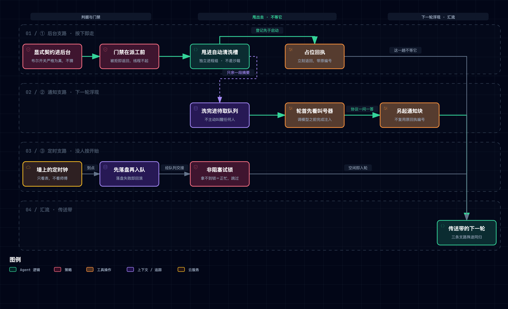

# ④ 并发与时机：谁来按下开始

> **一句话本质**：所谓后台没有平行宇宙，只是「不等它」；而有些活连按开始的人都不要。

---

## 1. 这一层要解决什么问题

上一层把台面守住了：会丢的进收台四步，不能丢的进登记簿。但它们守的都是**空间**——台面还剩多少地方。空间守住之后，暴露出来的是另一种浪费：师傅手很快，可有些活本身就慢。一条编译命令要跑十分钟，传送带就停十分钟；而这十分钟里，师傅既没在思考也没在动手，只是站着等一个他帮不上忙的进程。更尴尬的是另一类活——每天早上该做的巡检、每小时该发的汇总，它们不属于任何一次对话，**没有人会把它们放上传送带**。

第四层因此不是「让它跑得更快」，是**把两类时间还回来**：一类是「这一趟不必等」，另一类是「这一趟根本没人按开始」。

| 上一层留下的缺口 | 本层机制 | 大白话 |
|:---|:---|:---|
| 慢命令把传送带整条卡住 | 后台任务：显式契约 + 独立进程组 | 按下清洗槽的开关就走开，不站着看 |
| 甩出去之后，怎么知道洗完了 | 完成通知：独立通知块 + 轮首收集 | 叫号器只在你下次路过时才看得见 |
| 甩出去的活卡在半路，没人发现 | 停滞巡视 + 进度小字条（教学实现未落地） | 输出不再长了，就去看看它是不是在问人话 |
| 有些活不由任何一次对话触发 | 周期调度：四层解耦 + 至少一次交付 | 墙上的钟替你按开始 |
| 钟叫起来的活，谁来批准它动手 | 非主线程一律拒绝人工审批 | 没人在场的时候，那道门不许敲 |

---

## 2. 机制全景



> 图源（可 diff 文本）：[`claude-code-concurrency--timing-panorama.mmd`](../../assets/mermaid/agent-harness/claude-code-concurrency--timing-panorama.mmd) · 交互版（下载到本地打开）：[`claude-code-concurrency--timing-panorama.html`](../../assets/architecture/agent-harness/claude-code-concurrency--timing-panorama.html)

读法：三条支路**互不叠加**。后台交出去的是「某条命令的结果」，定时钟交出去的是「一段待执行的请求」——课程 README 明确说明后一章并不包含前一章的后台执行，因为二者传递的东西根本不是一类【二】。它们是两种并列的「不等」，不是叠罗汉。

---

## 3. M1 · 自动清洗槽：后台任务

> [!TIP] **类比**
> 工坊角落有一台自动清洗槽。师傅把一托盘器皿放进去、按下开关，就转身回台面继续干活——他不站在旁边看着它转。清洗槽自己有电有水，跟台面上的活彻底分开。

**不变式一 · 进后台是显式契约，不是猜出来的。** 路由判据只有一条：工具是命令执行工具，**且**入参里那个布尔开关严格为真（用的是身份判断，不接受任何「看起来为真」的值）。没有关键词表，没有「遇到编译就默认后台」这类兜底【一】。

这一条是有代价才换来的。关键词猜测在「一条测试命令其实只跑三秒」这类场景必然误判，而**误判的代价不对称**：该等的没等，模型就拿着一个占位符继续往下推理，后面全是错的；不该等的等了，无非是慢一点。所以整合版把判据完全交给模型说，宁可少放后台也不猜。

> 这里存在一处站点修订与仓库整合版的**实质分歧**，不是版本细节：旧修订里判据是两级的（显式参数优先、否则按命令词猜「慢操作」）【二】；仓库整合版把兜底那一级**整个删掉**，收敛为一级【一】。

**不变式二 · 后台不是通用能力。** 非命令类工具走后台路径会直接抛错——这条旁路只为「一条会跑很久的命令」而开【一】。

**不变式三 · 门禁在派工之前。** 工具执行的第一件事是跑前置钩子（权限闸门在其中）；被拒就直接返回，**线程根本不会起**。后台分支排在门禁之后【一】。

**不变式四 · 登记先于启动。** 锁内先分配编号、写进登记，再起线程；线程起失败就把登记回滚掉。占位结果立刻返回，传送带一秒不停【一】。

**不变式五 · 清理边界是进程组，不是沙箱。** 子进程以独立会话启动，退出、收到终止信号、进程退出钩子三条路径上都按**进程组**回收。README 自己把话说死了：这只是生命周期清理，不是沙箱——子进程若自己另起一个会话，照样跑得掉【一】。

**一条容易被略过的硬事实**：后台任务的**完整输出会被丢弃**。收集时把结果整条弹出，只把开头一段塞进通知，其余既不落盘也不留存【一】（截断长度属可调参数，本文不固化）。上一层刚立下「大结果必须先落盘、之后才允许变成占位符」的纪律，到了这条支路上，**落盘这一步压根不存在**。

> [!IMPORTANT] **实景**
> `s11_background_tasks/code.py @ f9e8b28`
>
> ```python
> def should_run_background(tool_name: str, tool_input: dict) -> bool:
>     return (
>         tool_name == "bash"
>         and tool_input.get("run_in_background") is True
>     )
> ```
>
> 判据全文就这四行：一个工具名，一个严格为真的布尔。旁边的执行函数里，前置钩子返回拒绝就直接 `return`，后台分支在它下面——顺序即语义。

**口播落点**：后台不是另开一个宇宙，只是这一趟不等它。

---

## 4. M2 · 叫号器：完成通知

> [!TIP] **类比**
> 清洗槽洗完不会跑来拍师傅肩膀，它只是把号码牌挂上门口的叫号器。师傅下一趟经过时抬头看一眼，才知道自己那盘好了。

**不变式一 · 一次派工只对应一张回执。** 命令甩出去的那一刻，占位结果已经带着原调用编号回过去了。协议规定一次调用只能有一条对应结果，所以完成事件**不得复用**那个编号，只能作为一条**独立的通知文本块**出现【一】，README 也把这条约束单独论证过【二】。这是协议派生的结构约束，不是设计偏好——想「补发第二条答复」在协议层就不成立。

**不变式二 · 通知只能挂在用户角色上。** 注入时若发现会话末条已是用户消息，就把通知块**追加进同一条**（于是通知和上一批工具结果同框）；否则新建一条用户消息【一】。

**不变式三 · 收集点固定在调用模型之前。** 循环每一轮的第一件事就是注入，之后才发请求。顺序反过来，通知就要多压一轮【一】。

**不变式四 · 后台结果不会主动唤醒任何人。** 没有回调、没有唤醒信号；结果躺在待取队列里，等下一次有人进入循环。会话结束即丢失【一】【二】。

**两条属于闭源产品、教学实现零落地的说法**：课程作者拆过闭源产品后指出，产品侧的通知投递**分优先级档位**，后台完成默认走低档，以免抢在用户输入前面【三】；同一分析还提到产品侧对**前台同时在跑的工具数**设有可由环境变量调节的上限，而后台命令因为是独立子进程，**不受这个上限约束**【三】。教学代码里两者皆无：工具批次是一个串行循环，既无优先级字段也无并发上限。

> [!IMPORTANT] **实景**
> `s11_background_tasks/code.py @ f9e8b28`
>
> ```python
> def agent_loop(messages: list):
>     while True:
>         inject_background_results(messages)
>         response = client.messages.create(...)
> ```
>
> 循环体第一行就是注入，第二行才是模型调用。而注入函数产出的是 `{"type": "text", ...}` 块、不是工具结果块——「另起一条」这件事在数据结构上是写死的。

**口播落点**：叫号器不会来找你，得等你下一次路过。

---

## 5. M3 · 学徒的小字条：停滞巡视与进度摘要

> [!TIP] **类比**
> 老工坊里会有个学徒，每隔一会儿去清洗槽边上瞄一眼：水位不动了，多半是卡住了。他还顺手在每批活边上贴一张小字条，写四五个字——师傅扫一眼就知道刚才干了什么。

这一整节**全部属于闭源产品的分析，教学实现里一行都没有**：停滞检测、交互提示嗅探、进度摘要生成，三项在两章代码中均无对应实现【一】（负向实测）。因此下文每一条都必须带归属句。

| 子项 | 课程作者对闭源产品的分析【三】 | 要写准的地方 |
|:---|:---|:---|
| 停滞巡视 | 后台任务**输出长时间不再增长**时，去嗅探它的输出里有没有形如「是/否」的交互提问，防止它卡在一个没人会回答的对话框上 | 判据是**增量**不是**时长**——「很久没长」而非「跑了很久」；一条正常的长编译不该被判停滞 |
| 进度小字条 | 每批工具执行完，另起一路更小的模型侧查询，生成一句极短的**过去时**标签（更像提交标题而不是句子） | 「近乎免费」不是因为它便宜，而是因为它**并行且更快**——主模型还在出字时，小字条已经写完了 |

停滞判定的秒数、小字条的目标字数、所用小模型的型号，全部是随修订漂移的可调参数，本文不固化；课程作者的分析中还提到其中部分参数可被远程配置在运行时调整【三】，因此它们连「本地常量」都算不上。

> [!IMPORTANT] **实景**
> `s11_background_tasks/code.py` + `s12_cron_scheduler/code.py @ f9e8b28`
>
> ```text
> 检索「停滞 / 交互提示嗅探 / 进度摘要」相关实现 —— 两章命中 0 处
> ```
>
> 这是一处**负向实证**：本节能讲的全部内容都来自对闭源产品的分析，教学实现只到「甩出去 + 下轮收回」为止，中间那段「它还活着吗」是空的。

**口播落点**：判它卡住，看的是输出还长不长，不是跑了多久。

---

## 6. M4 · 墙上的定时钟：周期调度

> [!TIP] **类比**
> 墙上挂着一口定时钟，它不认识师傅，也不知道台面上在干什么——它只认表。到点了，它把一张请求塞进入口的小格子；至于谁什么时候来取，跟它无关。

**不变式一 · 四层解耦，没有一层同时知道时间和状态。** 调度线程以秒级固定节拍醒来，只看表不看师傅；它把到期任务放进队列——这是**唯一的交接面**；队列处理线程只看队列不看表；循环只负责消费。**调度线程从不查师傅在不在忙，循环也从不看表**【一】。

**不变式二 · 去重键是「日期 + 分钟」而不是「分钟」。** 只用时分，次日同一分钟会被误判成「已经触发过」而整天漏掉；带上日期，同一分钟的重复触发与次日的漏触发**两种错一起挡住**【一】。

**不变式三 · 双重去重。** 除了上次触发标记，还看「已入队未交付」标志：排在队里还没被取走的任务不会二次入队【一】。

**不变式四 · 用非阻塞试锁探空闲。** 队列处理线程尝试以非阻塞方式拿会话锁，**拿不到就说明有人在用，直接跳过这一拍**。这是本章最漂亮的一处设计：忙碌状态不需要额外的变量，**锁本身就是那个状态**——不会有「标志位说空闲、实际上正忙」这种不一致【一】。

**不变式五 · 先持久化后入队。** 入队前先改状态并落盘，**落盘失败就把状态回滚、并且不入队**——绝不把一个只存在于内存里的状态交给下一棒。落盘走临时文件加原子替换【一】。

**不变式六 · 至少一次交付。** 模型调用失败时，把这一轮已经追加进会话的那几条定时消息**整段删掉**，并把任务放回队列；只有调用成功之后才写回确认（一次性任务删除，周期任务清掉待交付标志）。代价是明写的：确认写回之前崩溃，重启后可能重复交付一次【一】【二】。

**不变式七 · 定时轮次拿不到人工审批。** 权限请求一旦发现自己不在主线程，**直接返回拒绝**，不去抢终端输入。钟叫起来的活，永远敲不开那道需要人点头的门——这是安全性上的正确决定：没人在场时，不该有任何调用能拿到「用户同意」【一】。

**不变式八 · 导入不起线程。** 两条后台线程只在命令行入口启动，把文件当模块导入不会凭空多出线程【一】。

**作者自己划的边界**（README 原地声明，【二】）：调度器跑在同一个进程里，进程一关线程即停；持久化**只保住任务定义**；重启只恢复定义，**不补跑停机期间错过的时间点**；真要「关了也能跑」，请交给系统级的定时服务。

**产品侧的增补**（课程作者对闭源产品的分析，教学实现全无【三】）：按任务标识哈希派生的确定性抖动以防惊群（周期任务按周期比例延后并设上限；一次性任务若正落在整点、半点这类拥挤时刻，反而可能**提前**触发）；周期任务带**有效期**，到期前最后触发一次再删除；任务总数设**上限**；定时触发的请求被标为**降级服务质量**的工作负载，容量紧张时优先让位；多会话场景用**锁文件**保证同一持久任务不被触发两次。以上全部数值属漂移参数，本文一律定性。

> [!IMPORTANT] **实景**
> `s12_cron_scheduler/code.py @ f9e8b28`
>
> ```python
> def queue_processor_loop(stop_event: threading.Event = RUNTIME_STOP):
>     while not stop_event.wait(0.2):
>         if not has_cron_queue() or not agent_lock.acquire(blocking=False):
>             continue
> ```
>
> 一行 `acquire(blocking=False)` 同时完成了两件事：判断师傅忙不忙，以及在他不忙时把他占住。没有第二个变量需要跟它保持同步，因此也不存在「状态说空闲、实际在忙」的窗口。

**口播落点**：拿不到锁，就说明他正忙——忙碌不需要另立一个变量。

---

## 7. M5 · 传送带的自白：这一层其实没有真并发

> [!TIP] **类比**
> 清洗槽在转，定时钟在走，可传送带始终只有一条，上面的托盘也始终一盘一盘地过。工坊没有变成两间，只是师傅学会了不站着等。

这一收束需要按精确口径讲——放宽一点就会说错。

| 命题 | 核实结果 |
|:---|:---|
| 本层两章**没有并行执行工具** | ✅ 成立【一】。两章的工具批次都是串行循环，无线程池、无事件循环、无聚合等待、无信号量 |
| 本层两章「不含线程」 | ❌ **不成立**【一】。后台那章每个任务一条守护线程，调度那章有调度与队列处理两条。**线程确实存在，但它们不执行工具**——只做两件事：把一条命令甩出去，以及替循环看表、端队列 |
| 「全仓唯一有真并发的是工作流运行时那章」 | ❌ **过强**【一】。协作层的队友运行时同样是真并发（每个队友一条守护线程各跑自己的循环）。准确说法：**工作流运行时是全仓唯一用事件循环做扇出并发、并给出「有屏障／无屏障」语义对照的章节** |
| 「它是全仓唯一使用事件循环的章节」 | ❌ **不成立**【一】。目标闭环那章也用，但只用到「跑起来」和「把同步调用挪到线程」两种用法，**没有扇出** |

**真正成立的那句是**：这一层从头到尾在回答「谁来按下开始」「要不要等」，**没有一处在回答「同时能跑几个」**。吞吐问题要到附录那章才第一次被正面处理。

> [!IMPORTANT] **实景**
> `s11_background_tasks/code.py` + `s12_cron_scheduler/code.py @ f9e8b28`
>
> ```text
> 守护线程：后台章 1 处，调度章 3 处 —— 线程存在
> 扇出式并发聚合：两章均 0 处       —— 并发不存在
> 工具批次：两章均为串行循环         —— 吞吐未被处理
> ```

**口播落点**：这一层回答谁来按开始，不回答同时能跑几个。

---

## 8. 教学版与生产版的距离

**距离最大、也最反直觉的一处**：教学版**有**真线程，闭源产品**没有**。教学实现每个后台任务起一条守护线程，结果留在内存字典里【一】；而课程作者拆过闭源产品的源码后指出，产品侧压根不开线程——它跑在单线程事件循环里，「后台」的全部含义就是**发起之后不去等它**，子进程的输出被重定向到文件，由后续轮次去读【三】。换句话说，**教学版在实现形态上比产品版更「并发」，而语义上两者一致**：都只是「这一趟不等」。

能这样简化的结构性理由有三条：

1. **教学版不需要背压**。产品要在同一进程里同时服务用户输入、流式渲染与多路工具，必须用事件循环统一调度，否则线程会彼此争抢终端与渲染；教学版是一问一答的命令行，没有渲染压力，起线程反而是最短的路。
2. **教学版不需要跨会话存活**。产品的后台任务要跨越多轮、可被列举与终止，输出必须落在文件里；教学版会话一结束就全部作废，留内存足够。
3. **教学版不需要多实例协调**。产品要处理「同一项目开了几个会话」——课程作者拆过闭源源码后指出——因此才有锁文件与降级服务质量这类机制【三】；教学版默认单进程，于是去重标记做成进程内字段即可。

**被简化掉、且课程作者明确承认的那一块**：可观测性（停滞巡视、进度小字条）在教学实现里完全缺席。它不是「小细节」——它正是「甩出去之后怎么知道它还活着」这个问题的答案，而教学版对这个问题**没有给出任何答案**。

---

## 9. 关键实证

| 事实 | 一句话读法 | 证据级 | 随修订漂移 |
|:---|:---|:---:|:---|
| 后台路由只认命令类工具上一个严格为真的布尔参数，无关键词兜底 | 是否后台，交给模型说，不靠工坊猜 | 【一】 | 否（站点旧修订有兜底，属版本分歧非漂移） |
| 非命令类工具走后台路径直接抛错 | 后台不是通用能力，只是给命令开的一条旁路 | 【一】 | 否 |
| 权限闸门在启动后台线程之前执行 | 甩出去之前，门禁已经过了 | 【一】 | 否 |
| 登记先于启动，起线程失败即回滚登记 | 先记账，再动手 | 【一】 | 否 |
| 清理按进程组回收，README 自承不是沙箱 | 管得住生命周期，管不住逃逸 | 【一】 | 否 |
| 完成通知不复用原回执编号，以独立通知块随下一轮浮现 | 协议规定一问一答，所以补不了第二条答 | 【一】 | 否 |
| 通知收集固定发生在每轮调用模型之前 | 先看叫号器，再开工 | 【一】 | 否 |
| 后台结果不会主动唤醒循环，会话结束即丢失 | 叫号器只在你路过时才看得见 | 【一】【二】 | 否 |
| 后台任务的完整输出被丢弃，只余一段摘要进入对话 | 这条路上没有落盘这一步 | 【一】 | 摘要长度漂移，行为本身不漂移 |
| 教学版用真守护线程；课程作者称闭源产品没有线程，只是不去等 | 教学版反而比产品版更「并发」 | 【一】／【三】 | 产品实现可能变 |
| 停滞判据是「输出不再增长」而非「耗时过久」 | 看的是还长不长，不是跑了多久 | 【三】 | 是 |
| 去重键是「日期 + 分钟」而非「分钟」 | 带上日期，既不重放也不漏放次日 | 【一】 | 否 |
| 用非阻塞试锁判断会话是否空闲 | 拿不到锁本身就是「他正忙」 | 【一】 | 否 |
| 入队前先落盘，落盘失败即回滚且不入队 | 只存在于内存里的状态，不许交给下游 | 【一】 | 否 |
| 至少一次交付：调用失败则删回消息并把任务放回队列 | 宁可重来一次，不许悄悄丢掉 | 【一】 | 否 |
| 定时轮次一律拒绝需要人工审批的调用 | 钟叫起来的活，敲不开需要人点头的门 | 【一】 | 否 |
| 持久化只保任务定义，重启不补跑错过的时间点 | 存下的是闹钟，不是没响的那几次 | 【一】【二】 | 否 |
| 两章代码中工具执行均为串行循环 | 这一层解决时机，不解决吞吐 | 【一】 | 否 |
| 材料对「后台更省」零 token／费用论证 | 它只证明了不必干等 | 【一】 | 否 |
| 附录：无屏障 makespan 4.0 → 有屏障 6.0（+50%） | 屏障的代价是让快的等慢的，且逐段累积 | 【一】（原型 `--break D5`） | 否 |
| 附录：首跑 agents=11 / tokens=883，续跑 agents=0 / tokens=0 | 续跑命中缓存，一次模型都没再叫 | 【一】（实测） | 演示数据可变 |

---

## 10. 批判性边界

全局五条跨章成立，见[总纲 · 全局批判性边界](./170-claude-code-harness-overview.md)；以下四条是这一层独有的。

1. **「后台不是并行」这句话要分两半说，否则就说错了。** 本层两章确实没有并行的**工具执行**（两处工具批次均为串行循环），也确实没有扇出式并发聚合；但**线程是有的**——只是它们不执行工具，只负责甩命令与看表端队列。把「不含线程」当成本层的特征，是一个会被 grep 当场证伪的说法。

2. **恢复路径从未被跑过一次。** 代码里**有**回滚与至少一次交付语义【一】；README 也诚实承认持久化只保定义、不补跑错过的时间点【二】。但「确认写回前崩溃 ⇒ 重启后重复交付」这一结论，材料里**没有任何崩溃或重启的实测与测试**，它只是文档中的一句推理。准确的批评不是「没有恢复机制」，而是**只恢复定义、不补跑时间点，且这条路径一次都没被验证过**。

3. **单进程假设是硬前提，而正确解法材料给过、实现里没有。** 上次触发标记是进程内字段，落盘文件既无锁也无归属字段——两个进程加载同一份定义会各自触发【一】。多实例并非完全没被讨论：课程作者指出闭源产品用一个锁文件，让同项目的多个会话中只有持锁者负责持久任务【三】。**解法在第三级证据里，教学实现里一行都没有。**

4. **同一个仓库里并存两条相反的结果处置口径，材料未作解释。** 上一层刚立下「大结果必须先落盘，之后才允许旧结果变成占位符」；到了这一层，后台结果被截成一段摘要直接丢进对话，**原文当场作废，没有落盘这一步**【一】。两条纪律面对的是同一类东西——一份可能很大的工具输出——却给出了完全相反的处置，而 README 对此一字未提。

5. **「后台更省」这个主张材料从未提出过，也就无从证伪。** 在这两章的代码与 README 中，token、费用、成本、节省这类表述**零命中**【一】；全部论证只围绕「不必干等」展开。因此任何「后台任务更省钱」的引申都不是这份材料能支撑的——它证明的是时机，不是开销。

---

## 11. 与本仓的关联

| 课程机制 | 本仓对应 | 判定 |
|:---|:---|:---|
| 周期调度的四层解耦与至少一次交付 | [Routine 系统](../../concepts/subsystems/039-the-routine-system.md) 的节奏机制与执行轮次 | ✅ **已对齐**，且本仓是**进程外**调度——正好落在课程作者亲自划出的那条边界之外（他承认进程内调度关了就停，建议交给系统级定时服务） |
| 无屏障管道（每项各走各的，不设对齐点） | [Routine 多 Agent 归因](../../concepts/subsystems/040-routine-multi-agent-faculty.md) 的多 Faculty 编排 | 🔶 **值得落地**：本仓当前编排更接近「每段都等齐」，附录里的两个原语给出了何时该等、何时不必等的判据 |
| 后台完成通知的优先级档位与前台工具并发上限 | 无对应 | ⏸ **暂缓**：整条属第三级证据，教学实现零落地，缺乏可核验的形态 |
| 定时轮次一律拒绝人工审批 | 本仓自治轮次的权限模型 | ✅ **已对齐**（无人在场的轮次不应能拿到「用户同意」，二者结论一致） |

---

## 12. 验收问答

1. **为什么完成通知不能像普通工具结果那样回去？** 因为占位结果在命令甩出去的那一刻就已经带着原调用编号回过一次了，而协议规定一次调用只对应一条结果。想补发第二条在协议层就不成立，所以只能另起一条独立的通知文本块，挂在下一轮的用户消息上。

2. **「用非阻塞试锁判断忙不忙」好在哪里？** 好在它**没有引入第二份状态**。如果用一个布尔标志表示「正忙」，就必须保证它与真实占用同步，中间必然存在不一致的窗口；而锁本身既是状态也是占用手段，拿到了就是空闲并且已经占住，拿不到就是正忙——判断与获取是同一个原子动作。

3. **去重键为什么必须带日期？** 只用时分会产生一个隐蔽的漏触发：今天十点触发过，标记停在「10:00」，明天十点比对下来一模一样，于是被当成「已经触发过」整天跳过。带上日期后，同一分钟的重复触发与次日的漏触发被同一个键一起挡住。

4. **这一层最容易被夸大的结论是哪一条？** 「后台 = 并行」。教学实现里线程确实存在，但它们不执行工具；工具批次自始至终是串行循环。这一层解决的是「要不要等」和「谁来按开始」，从未解决「同时能跑几个」——吞吐要到工作流运行时那章才第一次被正面处理。

---

## 附录 · main 轨 `s16_workflow_runtime`：全仓唯一的真并发

> **站点修订未覆盖；不进口播。**

这一章不在课程站点的章节序列内，只存在于仓库整合版；本文是它的唯一事实源，因此下文**写全参数并附完整取证**。

### 取证

| 项 | 值 |
|:---|:---|
| 仓库 | shareAI-lab/learn-claude-code，License MIT |
| 固定提交 | `f9e8b280f715f9ba107d4517fd39bc5f8ddda618` |
| raw URL（code） | `https://raw.githubusercontent.com/shareAI-lab/learn-claude-code/f9e8b280f715f9ba107d4517fd39bc5f8ddda618/s16_workflow_runtime/code.py` |
| raw URL（README） | `https://raw.githubusercontent.com/shareAI-lab/learn-claude-code/f9e8b280f715f9ba107d4517fd39bc5f8ddda618/s16_workflow_runtime/README.zh.md` |
| `wc -l` 实测 | `code.py` **874** 行；`README.zh.md` **245** 行 |
| 取数日期 | 2026-09-18 |

### 关键常量实测值

| 常量／限制 | 实测值 | 语义 |
|:---|:---|:---|
| 并发上限 `CONCURRENCY` | **8** | 信号量的许可数，**只**套在真正发起子调用的那一段外面；命中缓存的路径不占许可 |
| 调用总数上限 `AGENT_CAP` | **1000** | 单次运行内子调用总数的硬上限，超限即抛输入错误 |
| 嵌套层数 | **一层**（`self._depth >= 1` 即拒绝） | 子工作流与父共享同一份日志、预算与调用计数器 |
| token 预算 | 由运行参数 `budget` 提供，**默认 `None` 即不限**；演示脚本传的正是 `None` | 累加超出时抛错而非静默超支；子调用入口另有「剩余额度是否已耗尽」的前置检查 |
| 工作流名约束 | 1–64 字符安全 slug（字母或数字起头，允许 `.` `_` `-`） | 因为这个名字会进入产物文件名 |
| schema 校验重试 | **一次** | 不合法则追加一句「请返回合法 JSON」重试；再不合法即失败 |

**两道熔断口径不同，这点值得单记**：调用计数在**查缓存之前**就已经累加，因此**命中缓存的调用同样计入总数上限**；而用量统计里的调用次数只在真跑时才加一。这正是续跑时统计显示调用次数为零、而脚本仍然走完了全部子调用的原因【一】。

### 两个语义对立的原语

二者**都用同一个并发聚合原语**，区别在**被聚合的粒度**：

- **有屏障**：聚合的是「同一段里的一批调用」，脚本必须等这一批全部回来才继续；任一失败即整个工作流失败。
- **无屏障**：聚合的是「每个条目各自一整条阶段链」，条目 A 可以已经跑到第三段，而条目 B 还在第一段。

无屏障的可见证据（演示以确定性数据运行，**实际运行输出**的顺序节选）：某一维度的审查刚完成，另一维度的审查与**它后面那一段**的验证就已经发出——各维度的阶段推进彼此交错，全程没有对齐点。

### 日志与续跑

- 日志以「**种类 + 标签 + 提示词 + schema**」算稳定哈希作为键，**不是**完成序号计数器——并发下完成顺序不确定，用序号会让两次运行的缓存整体错位。
- 续跑时脚本**重新执行**，但每个子调用先查键：命中即短路返回，只有内容变了的调用及其下游才真跑。
- 缓存结果**再校验一次 schema**，不合法直接报错而非将就。
- 整次运行持有运行锁（以排他文件创建预留运行标识），另一进程不能并发续跑同一次运行；续跑还会比对快照中的工作流名与参数，不一致即拒绝。

**实测**（代码原样复制到临时目录执行，**实际运行输出**）：

```text
首跑：status=completed  agents=11  tokens=883
续跑：status=completed  agents=0   tokens=0     （11 次子调用全部 status=cached）
```

### 屏障的代价：总纲原型 D5

[配套最小原型](./assets/cc_harness_lab.py) 把这条对比做成了可复算实验：

```text
== D5 · 无屏障管道改成有屏障并行 ==
  改动：Switches.pipeline_has_barrier = True
  退化：makespan  4.0  →  6.0
```

**为什么恰好是 +50%**：原型设 A／B／C 三项、每项两段，耗时分别为 A=(3,1)、B=(1,3)、C=(1,1)，并发槽位数不少于条目数——**差异只来自屏障，不来自资源竞争**。无屏障时各走各的，总时长取最长的那条链：`max(4, 4, 2) = 4.0`；有屏障时每一段都要等最慢的那个：`max(3,1,1) + max(1,3,1) = 6.0`。

**屏障的代价不是一次性的，是逐段累积的**：每多一段，就多一次「让快的等慢的」。因此取舍规则很干净——**下一步必须同时用到上一段的全部结果时才用屏障；每项各自独立走完全程时用管道**。

---

## 参考

[1] shareAI-lab, "learn-claude-code — Bash is all you need: a nano claude code–like agent harness, built from 0 to 1," GitHub repository, commit `f9e8b280`, Aug. 18, 2026. License MIT. [Online]. Available: https://github.com/shareAI-lab/learn-claude-code

[2] 本文, "Learn Claude Code 五层 Harness 精读总览," [`170-claude-code-harness-overview.md`](./170-claude-code-harness-overview.md)

[3] 本文, "最小原型 cc_harness_lab," [`assets/cc_harness_lab.py`](./assets/cc_harness_lab.py)
