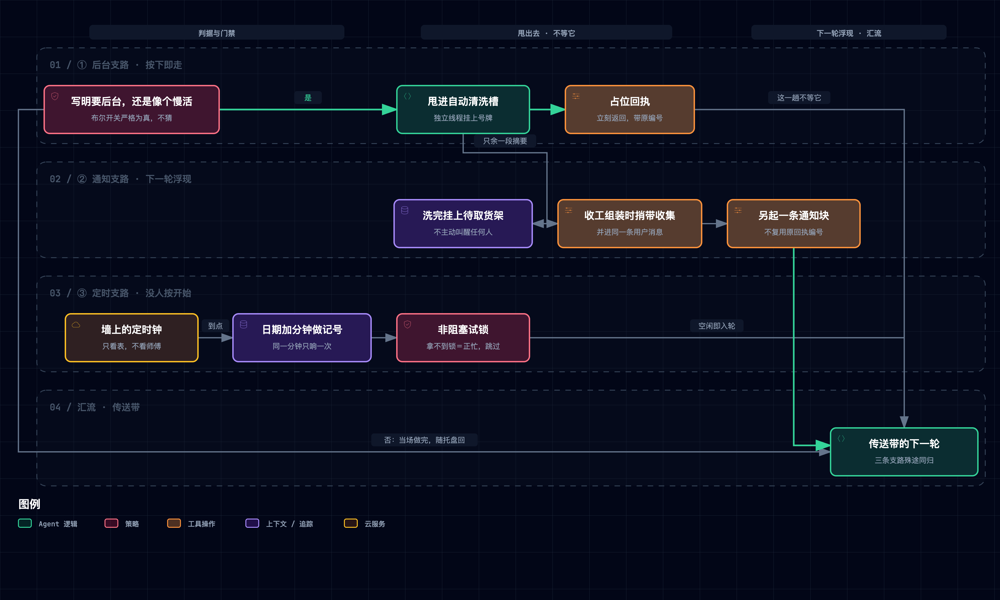

# ④ 并发与时机：谁来按下开始

> 独立重学篇：s13/s14 两节另有一篇不继承本篇叙事与结论的全新精读，见 [176](./176-claude-code-concurrency-relearn.md)（与本篇并存，互不替代）。

> **一句话本质**：所谓后台没有平行宇宙，只是「不等它」；而有些活连按开始的人都不要。

---

## 1. 这一层要解决什么问题

上一层把台面守住了：会丢的进收台，不能丢的进登记簿。但它们守的都是**空间**——台面还剩多少地方。空间守住之后，暴露出来的是另一种浪费：师傅手很快，可有些活本身就慢。一条 `pip install torch` 要跑十分钟，传送带就停十分钟；而这十分钟里，师傅既没在思考也没在动手，只是站着等一个他帮不上忙的进程【二】。更尴尬的是另一类活——每天早上该做的巡检、每小时该发的汇总，它们不属于任何一次对话，**没有人会把它们放上传送带**。

第四层因此不是「让它跑得更快」，是**把两类时间还回来**：一类是「这一趟不必等」，另一类是「这一趟根本没人按开始」。

| 上一层留下的缺口 | 本层机制 | 大白话 |
|:---|:---|:---|
| 慢命令把传送带整条卡住 | 后台任务：两级判定 + 独立线程 + 占位回执 | 按下清洗槽的开关就走开，不站着看 |
| 甩出去之后，怎么知道洗完了 | 完成通知：独立通知块 + 同框合流 | 叫号器只在你下次路过时才看得见 |
| 甩出去的活卡在半路，没人发现 | 停滞巡视 + 进度小字条（教学实现零落地） | 输出不再长了，就去看看它是不是在问人话 |
| 有些活不由任何一次对话触发 | 周期调度：四层解耦 + 错过不补 | 墙上的钟替你按开始 |
| 钟叫起来的活，撞上师傅正忙 | 非阻塞试锁探空闲，拿不到就跳过这一拍 | 拿不到锁就说明他正忙 |

> **证据口径**：本章机制正文按站点轨 `s13_background_tasks` / `s14_cron_scheduler`（钉 `67a9126`）叙述，与第 4 集钉点一致；main 轨（`0dcafa2a`）的演进差异以「轨道差异注记」内联。双轨钉选与章→集归属唯一登记在[系列信源地图](../../../apps/negentropy-influence/source-map/claude-code-explained.md)；逐字引语与可调参数归[对应集事实源](../../../apps/negentropy-influence/episodes/claude-code-concurrency-video/research/source-notes.md)。撞号纪律：站点轨 s13/s14 与 main 轨 s13（Agent Teams）/s14（MCP Plugin）同号不同物，凡引章号一律带轨名。

---

## 2. 机制全景



> 图源（可 diff 文本）：[`claude-code-concurrency--timing-panorama.mmd`](../../assets/mermaid/agent-harness/claude-code-concurrency--timing-panorama.mmd) · 交互版（下载到本地打开）：[`claude-code-concurrency--timing-panorama.html`](../../assets/architecture/agent-harness/claude-code-concurrency--timing-panorama.html)

读法：三条支路**互不叠加**。后台支路交出去的是「某条命令的执行」，定时支路交出去的是「一段待执行的提示词」——前者从工具分发层出走、以通知块回流，后者从队列汇入消息流、以 `[Scheduled]` 前缀进场，入口与载体都不是一类东西。站点轨 s14 继承了 s13 的后台执行件（code.py 标注 synced），但两条支路在任何一拍都不会合成同一件事【一】；它们是两种并列的「不等」，不是叠罗汉。

---

## 3. M1 · 自动清洗槽：后台任务

> [!TIP] **类比**
> 工坊角落有一台自动清洗槽。师傅把一托盘器皿放进去、按下开关，就转身回台面继续干活——他不站在旁边看着它转。清洗槽自己有电有水，跟台面上的活彻底分开。（课程原文的比喻是洗衣机：「你不会站在洗衣机前面干等 30 分钟」【二】——工坊里的对应物就是这台清洗槽。）

**不变式一 · 进后台是两级判定，主路是模型显式说。** 第一级看参数：bash 工具的 `run_in_background` 为真值，即模型显式请求后台；第二级是兜底：模型没指定时，用关键词启发式猜这条命令「likely to take > 30s」（install/build/test/deploy 等十一个词）【一】【二】。课程自己把主次说死：CC 的 bash schema 里有 `run_in_background: boolean` 参数，「模型自己决定哪些命令丢后台，不靠关键词猜。教学版保留启发式作为兜底，但主路径是模型显式请求」【二】。

这一条是有代价才换来的。关键词猜测在「一条测试命令其实只跑三秒」这类场景必然误判，而**误判的代价不对称**：该等的没等，模型就拿着一个占位符继续往下推理，后面全是错的；不该等的等了，无非是慢一点。所以产品的终点是把判据完全交给模型说，兜底只是还没走到终点时的拐杖。

> **轨道差异注记**：仓库整合版（main 轨 `s11_background_tasks`）把兜底一级**整个删掉**，收敛为「工具名严格匹配 + 布尔开关严格为真」的一级判定——演进方向与上面这句 README 自承的产品主路径一致（实景见旧钉 `f9e8b28` 精读；main 前进至 `0dcafa2a` 对该两章机制零变更，fork-ledger 净判定，断言可继承）。

**不变式二 · 占位回执立即返回。** 判定为后台的调用当场回一条带 `bg_0001` 形式编号（四位零填充）的占位 tool_result——「这个命令还在跑，结果回头给」——主循环一拍不停【一】。

**不变式三 · 登记、线程、锁三件套。** 每个后台任务在内存字典 `background_tasks` 里登记（tool_use_id / command / status），worker 跑在 daemon 线程里，所有对共享字典的读写都包在 `background_lock` 临界区内——这是课程首次引入跨线程共享状态，先立锁再动手【一】。

**不变式四 · 进程退出连带清理。** `daemon=True` 让 Agent 进程退出时后台线程跟着退【一】【二】。官方口径同向："Background tasks are automatically cleaned up when Claude Code exits."【官】（interactive-mode；官方另补：经 `setsid`/`timeout` 分离出去的进程也会连坐终止）。

**不变式五 · 结果是内存态、弹出即弃。** `background_results` 没有任何落盘路径；收集时把结果整条弹出，只把开头一段（200 字符，漂移参数）塞进通知，会话结束即全部作废【一】。上一层「大结果怎么办」的问题，在这条支路上的教学答案是：丢。（产品面另有答案：官方文档记载后台输出**写文件**、由 Read 工具取回【官】——见 §8/§9。）

**不变式六 · 工具批次串行分发。** 分发层是对 `response.content` 逐块处理的 for 循环，无线程池、无事件循环、无聚合等待——后台化改的是「这一条命令要不要等」，不是「几条命令一起跑」【一】。

> **main 轨后来加的四道闸（站点轨皆无）**：前置钩子门禁排在派工之前，被拒则线程根本不起；非命令类工具走后台路径直接抛错；登记先于启动、起线程失败即回滚登记；清理按进程组回收、README 自承「不是沙箱」。站点轨无 hooks 集成层、判定不按工具名设门、无回滚语义、只有 daemon 线程连带清理。以上为相对旧钉（`f9e8b28`）的演进叙事，不混入正文站点轨口径。

> [!IMPORTANT] **实景**
> `站点轨 s13_background_tasks/code.py @ 67a9126`
>
> ```python
> def should_run_background(tool_name: str, tool_input: dict) -> bool:
>     """Model explicit request takes priority; fallback to heuristic."""
>     if tool_input.get("run_in_background"):
>         return True
>     return is_slow_operation(tool_name, tool_input)
> ```
>
> 判据全文就这四级缩进：第一级看参数真值（模型显式说），第二级 `is_slow_operation` 拿关键词猜慢活（`code.py:318-325`）。旁边的分发层里，命中即 `start_background_task` 回占位、未命中照旧同步执行——同一个 for 循环，两种走法（`code.py:433-445`）。

**口播落点**：后台不是另开一个宇宙，只是这一趟不等它。

---

## 4. M2 · 叫号器：完成通知

> [!TIP] **类比**
> 清洗槽洗完不会跑来拍师傅肩膀，它只是把号码牌挂上门口的叫号器。师傅下一趟经过时抬头看一眼，才知道自己那盘好了。

**不变式一 · 一次派工只对应一张回执。** 命令甩出去的那一刻，占位结果已经带着原调用编号回过去了。协议规定一次调用只能有一条对应结果，所以完成事件**不得复用**那个编号，只能作为一条**独立的通知文本块**出现——README 把这条约束单独论证过：「这符合 Messages API 的工具配对语义：一个 `tool_use` 只对应一个 `tool_result`」【二】，代码里以 `<task_notification>` XML 块落地【一】。这是协议派生的结构约束，不是设计偏好——想「补发第二条答复」在协议层就不成立。官方 Agent SDK 的 `TaskNotificationMessage` 与此同构（完成/失败/停止三态独立成消息，带输出文件与用量字段；MCP 长调用被后台化后，真实结果也经这条消息返回）【官】（agent-sdk-python）。

**不变式二 · 通知与工具结果同框，收集点在本轮组装之时。** 站点轨的收集不发生在轮首，而在本轮工具结果组装之时：`user_content = list(results)` 之后把通知 text block 追加进去，合成**同一条** user 消息发给模型【一】（`code.py:447-455`）。效果与「轮首注入」等价——下一次调用模型之前一定可见；差别只在挂点。轨道差异注记：main 轨把收集挪到循环体第一行（每轮先注入再请求）——两种形态都满足「先看叫号器，再开工」。

**不变式三 · 后台结果不会主动唤醒任何人。** 没有回调、没有唤醒信号；结果躺在内存字典里，等下一次有人进入循环。会话结束即丢失【一】【二】。

**不变式四 · 摘要截断。** 通知里的摘要只保留开头 200 字符（可调常数，参数见对应集 notes，本文不固化）【一】。

**两条属于闭源产品、教学实现零落地的说法**：据课程对 CC 源码的分析，产品侧的通知投递**分优先级档位**（`next` > `later`），后台完成默认走低档、以免抢在用户输入前面——入队走 `enqueueTaskNotification` / `enqueuePendingNotification`，消费点在 `query.ts:1566-1593`【三】；同一分析提到产品侧对**前台同时在跑的工具数**设上限，而后台命令因为是独立子进程、不受这个上限约束【三】——后一条现已获官方文档逐字背书（`CLAUDE_CODE_MAX_TOOL_USE_CONCURRENCY`，默认 10，作用于可并行的只读工具与子代理【官】env-vars，见 §9 对照 g）。教学代码里两者皆无：工具批次是一个串行 for 循环，既无优先级字段也无并发上限。

> [!IMPORTANT] **实景**
> `站点轨 s13_background_tasks/code.py @ 67a9126`
>
> ```python
> # Inject tool results + background notifications in one user message
> user_content = list(results)
> bg_notifications = collect_background_results()
> if bg_notifications:
>     for notif in bg_notifications:
>         user_content.append({"type": "text", "text": notif})
> messages.append({"role": "user", "content": user_content})
> ```
>
> 工具结果在前、通知在后，同一条 user 消息。而 `collect_background_results` 产出的是 XML 文本块、不是工具结果块——「另起一条」这件事在数据结构上是写死的（`code.py:369-386`）。

**口播落点**：叫号器不会来找你，得等你下一次路过。

---

## 5. M3 · 学徒的小字条：停滞巡视与进度摘要

> [!TIP] **类比**
> 老工坊里会有个学徒，每隔一会儿去清洗槽边上瞄一眼：水位不动了，多半是卡住了。他还顺手在每批活边上贴一张小字条，写四五个字——师傅扫一眼就知道刚才干了什么。

这一整节**全部属于课程对闭源产品源码的分析，教学实现里一行都没有**：停滞检测、交互提示嗅探、进度摘要生成，三项在站点轨两章代码中均无对应实现【一】（负向实测）。因此下文每一条都必须带归属句。

| 子项 | 课程对 CC 源码的分析【三】 | 要写准的地方 |
|:---|:---|:---|
| 停滞巡视 | 后台任务**输出长时间不再增长**时（45 秒无增长，`LocalShellTask.tsx` L24-25 常量、L59-98 看门狗逻辑），去嗅探输出里有没有形如「(y/n)」的交互提问，防止它卡在一个没人会回答的对话框上 | 判据是**增量**不是**时长**——「很久没长」而非「跑了很久」；一条正常的长编译不该被判停滞 |
| 进度小字条 | 每批工具执行完，另起一路更小的模型侧查询生成一句极短的**过去时**标签（`query.ts:1411-1482` 发起 + `toolUseSummaryGenerator.ts:15` 提示词，"think git-commit-subject, not sentence"，约 30 字符） | 「近乎免费」不是因为它便宜，而是因为它**并行且更快**——Haiku 摘要约 1 秒完成，而主模型还在 5–30 秒的流式生成里 |

停滞判定的秒数、小字条的目标字数、所用小模型的型号，全部是随修订漂移的可调参数，本文不固化。

官方文档对以上全部不置可否（对账空窗，维持归属句）；但官方产品面给这两个问题各给了一个新答案：「它还活着吗」产品化为 **Monitor 工具**——后台脚本逐行回流或直连 WebSocket 事件源，每次 watch 有时限（默认 5 分钟、上限 30 分钟、`-p` 单提示上限 10 分钟）；「完成时找得到人」产品化为 **PushNotification**——桌面通知 + Remote Control 手机推送，让长任务/定时任务在人走开时仍能找到人【官】（tools-reference）。给模型的通知通路与给人的通知通路是两条路，课程只讲了第一条。

> [!IMPORTANT] **实景**
> `站点轨 s13_background_tasks/code.py` + `站点轨 s14_cron_scheduler/code.py @ 67a9126`
>
> ```text
> 检索「停滞 / 交互提示嗅探 / 进度摘要」相关实现 —— 两章命中 0 处
> ```
>
> 这是一处**负向实证**：本节能讲的全部内容都来自对闭源源码的分析，教学实现只到「甩出去 + 下轮收回」为止，中间那段「它还活着吗」是空的。

**口播落点**：判它卡住，看的是输出还长不长，不是跑了多久。

---

## 6. M4 · 墙上的定时钟：周期调度

> [!TIP] **类比**
> 墙上挂着一口定时钟，它不认识师傅，也不知道台面上在干什么——它只认表。到点了，它把一张请求塞进入口的小格子；至于谁什么时候来取，跟它无关。

**不变式一 · 四层解耦，没有一层同时知道时间和状态。** 调度线程以 1 秒节拍醒来，只看表不看师傅；它把到期任务放进 `cron_queue`——这是**唯一的交接面**；队列处理线程以 0.2 秒节拍只看队列不看表；循环只负责消费注入【一】【二】。**调度线程从不查师傅在不在忙，循环也从不看表**【二】。

**不变式二 · 去重键是「日期 + 分钟」而不是「分钟」。** 1 秒轮询对分钟级表达式每分钟命中约 60 次，去重靠 `"YYYY-MM-DD HH:MM"` 标记；只用时分，次日同一分钟会被误判成「已经触发过」而整天漏掉。带上日期，同一分钟的重复触发与次日的漏触发**两种错一起挡住**【一】【二】。

**不变式三 · 用非阻塞试锁探空闲，拿到锁再查一遍。** 队列处理线程以非阻塞方式拿 `agent_lock`，**拿不到就说明有人在用，直接跳过这一拍**；拿到之后还要再查一次队列非空（double-check），防「首次检查后、拿锁前」队列已被消费而空转一轮。忙碌状态不需要额外的变量，**锁本身就是那个状态**——不会有「标志位说空闲、实际上正忙」这种不一致【一】。

**不变式四 · 坏任务三层防护。** 注册前 `validate_cron` 校验（字段数必须为 5、分 0-59/时 0-23/日 1-31/月 1-12/星期 0-6）；磁盘加载时跳过非法表达式，防单个坏任务拖垮启动；运行期 per-job try/except，一个坏闹钟不许杀掉整面钟墙；调度线程遍历的还是 `scheduled_jobs` 的拷贝【一】。

**不变式五 · 一次性任务触发即删。** `recurring=False` 的任务触发后立即从登记里删除；durable 的还会同步落盘【一】。

**不变式六 · durable ≠ 补跑。** 持久化只保住**任务定义**；进程一关调度即停，重启后调度器只触发「当下该触发」的任务。README 把边界原地说死：「如果需要『即使应用关闭也能定时跑』，请用系统 crontab 或 systemd timer」【二】。官方口径一致且更精确："No catch-up for missed fires… it fires once when Claude becomes idle, not once per missed interval."【官】（scheduled-tasks）。

**不变式七 · 定时消息汇入同一条 messages 流。** 已触发任务的 prompt 以 `[Scheduled] ` 前缀追加为 user 消息——对 LLM 而言，钟说的话和人说的话进了同一条流，无差别【一】。

**不变式八 · DOM 与 DOW 同约束取 OR。** 日（day-of-month）与星期（day-of-week）同时被约束时任一命中即可——标准 vixie-cron 语义，官方文档逐字一致【官】（scheduled-tasks）。

> **main 轨后来加的四道闸（站点轨皆无）**：先持久化后入队、落盘失败即回滚不入队；至少一次交付（模型调用失败则删回已追加的定时消息、把任务放回队列）；「已入队未交付」双重去重；定时轮次非主线程一律拒绝人工审批。另一处两轨**相反**：main 轨「导入不起线程」，站点轨的调度线程在**模块导入即启动**（`code.py:560-562`），只有队列处理线程等在 `__main__`——把站点轨文件当模块导入，会凭空多出一条看表的线程。以上为相对旧钉（`f9e8b28`）的演进叙事；main 前进至 `0dcafa2a` 对调度机制零变更。

**产品侧的增补**（课程对 CC 源码的分析，教学实现全无【三】；官方能对账的已标注）：三个 cron 工具 CronCreate/CronDelete/CronList 与会话 50 个任务上限、8 字符任务 ID 均获官方一致【官】（scheduled-tasks）；调度器 1 秒检查、低优先级入队、忙则等本轮结束，官方逐点一致【官】；双层门控（编译时 `feature('AGENT_TRIGGERS')` + 运行时 GrowthBook `tengu_kairos_cron`）、`.scheduled_tasks.lock` 锁文件、`chokidar` 文件观察、「持锁者触发文件任务」锁语义、`WORKLOAD_CRON` 降级服务质量，均为源码级单侧口径（官方仅 "enqueues them at low priority" 间接对应）。抖动与过期是仅有的两处数值口径冲突，处置见 §9 对照 b/c。

> [!IMPORTANT] **实景**
> `站点轨 s14_cron_scheduler/code.py @ 67a9126`
>
> ```python
> def queue_processor_loop():
>     """Auto-deliver fired cron jobs when the agent is idle."""
>     while True:
>         time.sleep(0.2)
>         if not has_cron_queue():
>             continue
>         if not agent_lock.acquire(blocking=False):
>             continue
>         try:
>             if not has_cron_queue():
>                 continue
>             run_agent_turn_locked()
>         finally:
>             agent_lock.release()
> ```
>
> 一行 `acquire(blocking=False)` 同时完成两件事：判断师傅忙不忙，以及在他不忙时把他占住。没有第二个变量需要跟它保持同步，因此也不存在「状态说空闲、实际在忙」的窗口；拿到锁后的第二次 `has_cron_queue()` 是防空转的 double-check。

**口播落点**：拿不到锁，就说明他正忙——忙碌不需要另立一个变量。

---

## 7. M5 · 传送带的自白：这一层其实没有真并发

> [!TIP] **类比**
> 清洗槽在转，定时钟在走，可传送带始终只有一条，上面的托盘也始终一盘一盘地过。工坊没有变成两间，只是师傅学会了不站着等。

这一收束需要按精确口径讲——放宽一点就会说错。

| 命题 | 核实结果 |
|:---|:---|
| 本层两章**没有并行执行工具** | ✅ 成立【一】。分发层是对 `response.content` 逐块处理的 for 循环（站点轨 s13 `code.py:433-445`；s14 继承同形态），无线程池、无事件循环、无聚合等待、无信号量 |
| 本层两章「不含线程」 | ❌ **不成立**【一】。后台章每个任务一条 daemon worker（`code.py:363`），调度章有调度与交付两条线程。**线程确实存在，但它们不执行工具**——只做两件事：把一条命令甩出去，以及替循环看表、端队列 |
| 「全仓唯一有真并发的是工作流运行时那章」 | ❌ **过强**（main 轨口径）【一】。协作层的队友运行时同样是真并发。准确说法：**工作流运行时是全仓唯一用事件循环做扇出并发、并给出「有屏障／无屏障」语义对照的章节**（附录） |
| 「它是全仓唯一使用事件循环的章节」 | ❌ **不成立**（main 轨口径）【一】。目标闭环那章也用，但只用到「跑起来」和「把同步调用挪到线程」两种用法，**没有扇出** |

**真正成立的那句是**：这一层从头到尾在回答「谁来按下开始」「要不要等」，**没有一处在回答「同时能跑几个」**。吞吐问题第一次被正面处理，在附录那章。

> [!IMPORTANT] **实景**
> `站点轨 s13_background_tasks/code.py` + `站点轨 s14_cron_scheduler/code.py @ 67a9126`
>
> ```text
> 守护线程：后台章每任务 1 条 worker + 调度章 2 条 —— 线程存在
> 扇出式并发聚合：两章均 0 处              —— 并发不存在
> 工具批次：两章均为 for 循环串行分发       —— 吞吐未被处理
> ```

**口播落点**：这一层回答谁来按开始，不回答同时能跑几个。

---

## 8. 教学版与生产版的距离

**距离最大、也最反直觉的一处**：教学版**有**真线程，闭源产品**没有**。教学实现每个后台任务起一条 daemon 线程，结果留在内存字典里【一】；而据课程对 CC 源码的分析，产品跑在 Node.js/Bun 单线程事件循环里，「后台」的全部含义就是**发起之后不去等它**，子进程的输出被重定向到文件，由后续轮次去读【三】（线程模型断言属源码分析，官方文档不背书）。换句话说，**教学版在实现形态上比产品版更「并发」，而语义上两者一致**：都只是「这一趟不等」。

能这样简化的结构性理由有三条：

1. **教学版不需要背压**。产品要在同一进程里同时服务用户输入、流式渲染与多路工具，必须用事件循环统一调度，否则线程会彼此争抢终端与渲染；教学版是一问一答的命令行，没有渲染压力，起线程反而是最短的路。
2. **教学版不需要跨会话存活**。产品的后台任务要跨越多轮、可被列举与终止，输出必须落在文件里；教学版会话一结束就全部作废，留内存足够。
3. **教学版不需要多实例协调**。产品要处理「同一项目开了几个会话」——据课程对 CC 源码的分析，因此才有锁文件与降级服务质量这类机制【三】；教学版默认单进程，于是去重标记做成进程内字段即可。

**官方文档补上的产品现状**【官】（interactive-mode / tools-reference / headless，2026-09-28）：后台输出**写文件**、由 Read 工具取回；`/tasks` 列出与停止后台任务；`TaskOutput` 已弃用、改用 Read 读输出文件；**超时自动转后台**——命令到达超时（默认 120 秒）还没跑完就自动挪进后台而不是停掉，`sleep` 开头的命令豁免，转后台的报文把任务 ID 与输出文件路径写得明明白白；用户侧 `Ctrl+B` 手动后台化（tmux 需双击）；5GB 输出上限与闲置 ≥30 分钟的内存压力收割（v2.1.193+）；总开关 `CLAUDE_CODE_DISABLE_BACKGROUND_TASKS`；headless `-p` 返回结果且 stdin 关闭后约 5 秒宽限回收后台 Bash。

**被简化掉、而官方有答案的那一块**：可观测性。停滞巡视与进度小字条在教学实现里完全缺席【一】（负向实证）——它正是「甩出去之后怎么知道它还活着」的答案，教学版对这个问题没有给出任何答案；官方产品面则把这一问产品化为 Monitor 工具、把「完成时找得到人」产品化为 PushNotification【官】（见 §5）。

---

## 9. 官方文档对照

官方文档站已整体迁移：`docs.claude.com/en/docs/claude-code/*` 301 → `code.claude.com/docs/en/*`（下表页名均可按此基址拼出；访问 2026-09-28）。只收本维硬分歧与同构锚，全量事实集归[对应集事实源](../../../apps/negentropy-influence/episodes/claude-code-concurrency-video/research/source-notes.md)。

| # | 主题 | 课程口径 | 官方口径【官】 | 处置 |
|---|---|:---|:---|:---|
| a | 进后台谁说了算 | 站点轨两级：显式参数优先 + 关键词兜底；README 自承 CC 主路径是模型显式请求【二】 | `run_in_background` 异步执行、立即返回任务 ID；另有课程未讲的两入口：`Ctrl+B` 用户侧手动后台化；**超时自动转后台**（默认 120s、`sleep` 豁免、报文明示）（interactive-mode / tools-reference） | 站点轨两级为正文 SSOT；main 删兜底作演进注记；超时自动转后台入 §8 |
| b | 定时抖动 | 【三】重复任务延迟上限＝期间的 10%、封顶 15 分钟 | "Recurring tasks fire up to 30 minutes after the scheduled time (or up to half the interval…)"；一次性 `:00`/`:30` 提前 90 秒；偏移由任务 ID 派生、要准点选非整点分钟（scheduled-tasks） | 数值取官方（按时任务两口径差 5 倍）；课程数字判陈旧，留作「源码分析与产品文档的时间差」例证 |
| c | 周期任务有效期 | 【三】7 天过期（可配置、上限 30 天） | 固定 7 天，末次触发后自删；续命＝到期前取消重建，或改用 Routines / Desktop（scheduled-tasks） | 主体官方口径；「可配置、上限 30 天」带归属句 |
| d | 定时的三档世界 | 课程世界只有「会话内 cron」一档 | 三档：Cloud routines（无需开 session、最小间隔 1 小时）/ Desktop（1 分钟、跨重启持久）/ `/loop`（动态间隔 1 分钟–1 小时、`ScheduleWakeup`、自然语言一次性提醒）（scheduled-tasks） | 新增对照；三档正是课程「进程外定时请用系统 crontab/systemd timer」边界的官方产品化答案 |
| e | 后台有没有上限 | 【三】后台 bash 无硬性并发限制（独立子进程） | 同样未记并发上限，但有资源上限：输出超 5GB 即终止；闲置 ≥30 分钟且无轮次时内存压力收割（interactive-mode） | 「无并发上限」保留，补「有资源上限」 |
| f | 完成通知的去处 | 通知注入对话给模型，一条通路 | `/tasks` 列停、TaskOutput→Read 弃用迁移、PushNotification（完成推给人）、Monitor 产品化（tools-reference） | 补产品现状；「给模型 / 给人」两条通知通路点出 |
| g | 前台并发上限 | 【三】默认 10 个「并发安全工具」（意译） | "CLAUDE_CODE_MAX_TOOL_USE_CONCURRENCY — Maximum number of read-only tools and subagents that can execute in parallel (default: 10)"（env-vars） | 【三】升【官】；引官方定义写准作用域：只读工具与子代理 |
| h | 通知消息的官方长相 | `<task_notification>` 四字段（task_id/status/command/summary） | SDK `TaskNotificationMessage`：completed/failed/stopped 三态 + output_file/summary/tool_use_id/usage；MCP 长调用后台化后真实结果经此消息返回（agent-sdk/python） | 一问一答不变式的官方同构佐证 |

---

## 10. 关键实证

| 事实 | 一句话读法 | 证据级 | 随修订漂移 |
|:---|:---|:---:|:---|
| 进后台是两级判定：显式参数优先、关键词兜底猜慢活 | 是否后台，主路交给模型说，兜底只是教学脚手架 | 【一】【二】 | 兜底列表漂移（main 轨已删） |
| 占位回执带四位零填充的 bg_id 立即返回 | 先给个号牌，活慢慢干 | 【一】 | 否 |
| 状态存内存字典，读写全在锁临界区 | 第一次跨线程共享状态，先立锁 | 【一】 | 否 |
| daemon 线程随进程退出连带清理；官方同向「退出即清理」 | 管得住自己的线程 | 【一】【官】 | 产品细节可能变 |
| 后台完整输出弹出即弃，只余 200 字符摘要 | 这条路上没有落盘这一步（产品侧有：输出写文件 + Read 取回【官】） | 【一】【官】 | 摘要长度漂移，行为不漂移 |
| 完成通知不复用原回执编号，以独立通知块随下一轮合流 | 协议规定一问一答，所以补不了第二条答 | 【一】【二】【官】 | 否 |
| 通知与工具结果并入同一条 user 消息 | 收工组装时顺手捎上，不必另等一轮 | 【一】 | main 轨形态为轮首注入 |
| 后台结果不会主动唤醒循环，会话结束即丢失 | 叫号器只在你路过时才看得见 | 【一】【二】 | 否 |
| 教学版用真 daemon 线程；课程称闭源产品没有线程，只是不去等 | 教学版反而比产品版更「并发」 | 【一】／【三】 | 产品实现可能变（官方不背书） |
| 停滞判据是「输出不再增长」（45 秒无增长后嗅探交互提示）而非「耗时过久」 | 看的是还长不长，不是跑了多久 | 【三】 | 是 |
| 四层解耦：判时/暂存/判闲/注入各只做一件事 | 没有一层「顺便」看表 | 【一】【二】 | 否 |
| 去重键是「日期 + 分钟」而非「分钟」 | 带上日期，既不重放也不漏放次日 | 【一】【二】 | 否 |
| 非阻塞试锁判闲，拿锁后 double-check | 拿不到锁本身就是「他正忙」 | 【一】 | 否 |
| 坏任务三层防护：注册/加载双校验 + 运行期 per-job 兜底 + 遍历拷贝 | 一个坏闹钟不许拖垮整面墙 | 【一】 | 否 |
| durable 只保任务定义，重启不补跑错过的时间点 | 存下的是闹钟，不是没响的那几次（官方精确化：空闲后补一次，非按错过次数补） | 【一】【二】【官】 | 否 |
| 定时消息以 `[Scheduled]` 前缀汇入同一 messages 流 | 对 LLM，钟说的话和人说的话无差别 | 【一】 | 否 |
| 重复任务抖动：官方上限 30 分钟或半间隔；课程源码口径 10%/15 分钟已陈旧 | 同一机制，两份口径，产品现状取官方 | 【官】／【三】 | 数值随产品变 |
| 两章代码中工具执行均为 for 循环串行分发 | 这一层解决时机，不解决吞吐 | 【一】 | 否 |
| 材料对「后台更省」零 token／费用量化论证 | 它只证明了不必干等 | 【一】 | 否 |
| 附录：无屏障 makespan 4.0 → 有屏障 6.0（+50%） | 屏障的代价是让快的等慢的，且逐段累积 | 【一】（原型 `--break D5`，R3 复现全绿） | 否 |
| 附录：首跑 agents=11 / tokens=883，续跑 agents=0 / tokens=0 | 续跑命中 journal 缓存，一次模型都没再叫 | 【一】（@ 0dcafa2a 原样复跑实测） | 演示数据可变 |

---

## 11. 批判性边界

全局五条跨章成立，见[总纲 · 全局批判性边界](./170-claude-code-harness-overview.md)；以下六条是这一层独有的。

1. **「后台不是并行」这句话要分两半说，否则就说错了。** 本层两章确实没有并行的**工具执行**（分发层均为 for 循环），也确实没有扇出式并发聚合；但**线程是有的**——只是它们不执行工具，只负责甩命令与看表端队列。把「不含线程」当成本层的特征，是一个会被 grep 当场证伪的说法。

2. **失败与恢复路径不仅没被验证，站点轨压根没有恢复语义。** 站点轨模型调用失败只追加一段 `[Error]` 文本然后返回——没有重试、没有回滚、没有把任务放回队列；`load_durable_jobs` 整体 `except Exception: pass` 静默吞掉坏文件（课程未展开此取舍）【一】。main 轨整合版补了「至少一次交付」与「落盘失败回滚」，但那条路径同样没有崩溃或重启实测。「错过不补跑」有 README 与官方双源，而「已入队未交付时进程死」「磁盘文件损坏半态」的崩溃窗口行为，两轨材料都未讨论未测试。

3. **单进程假设是硬前提，而正确解法材料给过、教学实现里没有。** 去重标记是进程内字段，落盘文件既无锁也无归属字段——两个进程加载同一份定义会各自触发【一】。多实例并非完全没被讨论：据课程对 CC 源码的分析，闭源产品用一个锁文件，让同项目的多个会话中只有持锁者负责持久任务【三】。**解法在第三级证据里，教学实现里一行都没有。**

4. **同一课程里，结果处置的口径按轨分裂，材料未作解释。** 站点轨其实两头都选了「丢」：上一层的压缩把旧结果直接裁掉（站点轨占位符连盘上指针都没有），这一层把后台输出截成摘要即弃【一】；「大结果必须先落盘、之后才允许变成占位符」的纪律是 main 轨后来在压缩层补上的，而本层后台支路在两轨都没有落盘。真正给出相反口径（后台输出写文件 + Read 取回）的是官方产品面【官】。同一个问题——一份可能很大的工具输出——三个口径，材料未作解释。

5. **「后台更省」这个主张材料从未提出过，也就无从证伪。** 课程问题陈述里有「LLM 按 token 计费，空转就是浪费」的动机【二】，但两章代码与 README 中没有任何 token、费用、成本的量化对比（零命中【一】）。它证明的是**时机**，不是**开销**——任何「后台任务更省钱」的引申都不是这份材料能支撑的。

6. **加压之下先倒的不是这层的钟，是上一层的计量尺。** 本层恰恰是五层里防护最全的一层（锁、去重、double-check、坏任务三层防护）；真正脆弱的是上游——把字符当 token 的计量尺先倒，后台通知的摘要虽短，定时轮次却在持续往同一份 messages 里注入新回合；而站点轨后台结果弹出即弃、没有盘上指针，模型想要完整输出只能重跑命令，重跑的输出又整段进入上下文——「丢弃 → 重跑 → 膨胀」的正反馈。这一层的机制没有崩，它只是加速了上游的崩溃。

---

## 12. 与本仓的关联

| 课程机制 | 本仓对应 | 判定 |
|:---|:---|:---|
| 周期调度四层解耦 + 不补跑边界 | [Routine 系统](../../concepts/subsystems/039-the-routine-system.md) 的节奏机制与执行轮次 | ✅ **已对齐**，且本仓是**进程外**调度——正好落在课程作者亲自划出的那条边界之外；官方三档中 Cloud routines 把「进程外定时」官方化（无需开 session、最小间隔 1 小时【官】），佐证本仓定位。注：站点轨无「至少一次交付」（main 轨演进才有），本对位只挂「四层解耦 + 不补跑」 |
| 无屏障管道（每项各走各的，不设对齐点） | [Routine 多 Agent 归因](../../concepts/subsystems/040-routine-multi-agent-faculty.md) 的多 Faculty 编排 | 🔶 **值得落地**：本仓当前编排更接近「每段都等齐」，附录里的两个原语给出了何时该等、何时不必等的判据 |
| 前台并发上限 `CLAUDE_CODE_MAX_TOOL_USE_CONCURRENCY`（默认 10） | 无对应 | ⏸ **暂缓 → 官方可核验**：变量名与默认值已获官方文档逐字背书（"read-only tools and subagents"，env-vars【官】）；通知优先级档位仍为源码级单侧口径 |
| 定时轮次一律拒绝人工审批（main 轨特有） | 本仓自治轮次的权限模型 | ✅ **结论同向**：该不变式是 main 轨整合版新增（站点轨无权限层集成，实景钉 `f9e8b28`），本仓「无人在场的轮次不应能拿到用户同意」与它殊途同归 |

---

## 13. 验收问答

1. **为什么完成通知不能像普通工具结果那样回去？** 因为占位结果在命令甩出去的那一刻就已经带着原调用编号回过一次了，而协议规定一次调用只对应一条结果。想补发第二条在协议层就不成立，所以只能另起一条独立的通知文本块，并入下一轮的用户消息。官方 Agent SDK 的 `TaskNotificationMessage` 是同一约束的产品级长相【官】。

2. **「用非阻塞试锁判断忙不忙」好在哪里？** 好在它**没有引入第二份状态**。如果用一个布尔标志表示「正忙」，就必须保证它与真实占用同步，中间必然存在不一致的窗口；而锁本身既是状态也是占用手段，拿到了就是空闲并且已经占住，拿不到就是正忙——判断与获取是同一个原子动作。拿到锁后对队列再做一次 double-check，防的是「首次检查后、拿锁前」队列已被消费的空转。

3. **去重键为什么必须带日期？** 只用时分会产生一个隐蔽的漏触发：今天十点触发过，标记停在「10:00」，明天十点比对下来一模一样，于是被当成「已经触发过」整天跳过。带上日期后，同一分钟的重复触发（1 秒轮询每分钟命中约 60 次）与次日的漏触发被同一个键一起挡住。

4. **这一层最容易被夸大的结论是哪一条？** 「后台 = 并行」。教学实现里线程确实存在，但它们不执行工具；工具批次自始至终是串行 for 循环。这一层解决的是「要不要等」和「谁来按开始」，从未解决「同时能跑几个」——吞吐要到附录 main 轨 s16 的工作流运行时才第一次被正面处理。

5. **把五层当作一个系统加压，第一个倒下的是谁？** 不是这层的钟，也不是清洗槽——是上一层的计量尺（字符当 token）。本层防护最全，却也在加速上游的崩溃：定时轮次持续注入新回合撑大 messages，而后台结果弹出即弃、没有盘上指针，模型要完整输出只能重跑，重跑的输出又整段回到上下文——「丢弃 → 重跑 → 膨胀」的正反馈。判一层机制的优劣，要看它把压力导向了哪里。

---

## 附录 · main 轨 `s16_workflow_runtime`：全仓唯一的事件循环扇出并发

> **站点轨无此章（站点 s16 = Team Protocols，撞号勿混）；不进口播。**

这一章只存在于仓库 main 轨整合版；本文是它的唯一事实源，因此下文**写全参数并附完整取证**。

### 取证

| 项 | 值 |
|:---|:---|
| 仓库 | shareAI-lab/learn-claude-code，License MIT |
| 固定提交 | `0dcafa2a`（main，2026-08-27；换钉自 `f9e8b28`，对该章仅机械级修复） |
| raw URL（code） | `https://raw.githubusercontent.com/shareAI-lab/learn-claude-code/0dcafa2a/s16_workflow_runtime/code.py` |
| raw URL（README） | `https://raw.githubusercontent.com/shareAI-lab/learn-claude-code/0dcafa2a/s16_workflow_runtime/README.zh.md` |
| `wc -l` 实测 | `code.py` **880** 行；`README.zh.md` **245** 行 |
| 取数日期 | 2026-09-28 |

### 关键常量实测值

| 常量／限制 | 实测值 | 语义 |
|:---|:---|:---|
| 并发上限 `CONCURRENCY` | **8**（`code.py:37`） | 并发信号量的许可数 |
| 调用总数上限 `AGENT_CAP` | **1000**（`code.py:36`） | 单次运行内 `agent()` 调用总数的硬上限 |
| 嵌套层数 | **一层**（`self._depth >= 1` 即拒绝，`code.py:521`） | 子工作流与父共享同一份日志、预算与调用计数器 |
| token 预算 | 由运行参数 `budget` 提供，**默认 `None` 即不限**；演示脚本传的正是 `None` | 累加超出时抛错而非静默超支（`code.py:371`） |
| 工作流名约束 | 1–64 字符安全 slug（字母或数字起头，允许 `.` `_` `-`，`code.py:40`） | 因为这个名字会进入产物文件名 |
| schema 校验重试 | **一次**（`code.py:483-496`） | 不合法则追加一句「请返回合法 JSON」重试；再不合法即失败；缓存命中的结果也要重新过 schema 校验 |

### 两个语义对立的原语

二者**都用同一个并发聚合原语**（`asyncio.gather` 一族），区别在**被聚合的粒度**：

- **有屏障**（`parallel`，`code.py:506`）：聚合的是「同一段里的一批调用」，脚本必须等这一批全部回来才继续；任一失败即整个工作流失败。
- **无屏障**（`pipeline`，`code.py:510`）：聚合的是「每个条目各自一整条阶段链」，条目 A 可以已经跑到第三段，而条目 B 还在第一段。

无屏障的可见证据（@ `0dcafa2a` 本仓原样复跑，实际运行输出）：performance 维度的**验证**（Verify 阶段）已经发出并完成，而 security / style 两个维度的**审计**（Review 阶段）才刚做完——各维度的阶段推进彼此交错，全程没有对齐点。

### 日志与续跑

- 日志（journal，append-only JSONL）以「**种类 + 标签 + 提示词 + schema**」算稳定哈希作为键（sha256；Python 内建 `hash()` 每进程加盐、跨 run 对不上，`code.py:44-46`）——并发下完成顺序不确定，用「第几个完成」当键，两次运行的缓存整体错位【一】。
- 续跑时脚本**整体重新执行**，但每个 `agent()` 先查键：命中即短路返回缓存，只有内容变了的调用及其下游才真跑；resume 先校验快照中的工作流名与参数，不一致即拒绝【一】。
- 整次运行持有运行锁（线程锁 + `fcntl.flock` 排他文件锁），另一进程不能并发续跑同一次运行；每次新运行先用排他式文件创建（`O_CREAT | O_EXCL`）预留新 runId 再开日志——因为新 run 会截断旧 journal【一】。

**实测**（@ `0dcafa2a` 代码原样复制到临时目录执行，MockAgentRunner 确定性演示，**实际运行输出**）：

```text
首跑：status=completed  agents=11  tokens=883
续跑：status=completed  agents=0   tokens=0     （全部子调用命中 journal 缓存）
```

### 屏障的代价：总纲原型 D5

[配套最小原型](./assets/cc_harness_lab.py) 把这条对比做成了可复算实验：

```text
== D5 · 无屏障管道改成有屏障并行 ==
  改动：Switches.pipeline_has_barrier = True
  退化：makespan  4.0  →  6.0
```

**为什么恰好是 +50%**：原型设 A／B／C 三项、每项两段，耗时分别为 A=(3,1)、B=(1,3)、C=(1,1)，并发槽位数不少于条目数——**差异只来自屏障，不来自资源竞争**。无屏障时各走各的，总时长取最长的那条链：`max(4, 4, 2) = 4.0`；有屏障时每一段都要等最慢的那个：`max(3,1,1) + max(1,3,1) = 6.0`。

**屏障的代价不是一次性的，是逐段累积的**：每多一段，就多一次「让快的等慢的」。因此取舍规则很干净——**下一步必须同时用到上一段的全部结果时才用屏障；每项各自独立走完全程时用管道**。

---

## 参考

[1] shareAI-lab, "learn-claude-code — Bash is all you need: a nano claude code–like agent harness, built from 0 to 1," GitHub repository, main branch commit `0dcafa2a`, Aug. 27, 2026. License MIT. [Online]. Available: https://github.com/shareAI-lab/learn-claude-code （附录 s16 与 main 轨演进注记的证据基）

[2] shareAI-lab, "learn-claude-code" 站点同源修订（分支 `fix/s08-s20-sync-frontmatter-parser`）, commit `67a9126c`, Jul. 29, 2026.（正文机制 SSOT：站点轨 s13_background_tasks / s14_cron_scheduler）

[3] 本文, "Learn Claude Code 五层 Harness 精读总览," [`170-claude-code-harness-overview.md`](./170-claude-code-harness-overview.md)

[4] 本文, "最小原型 cc_harness_lab," [`assets/cc_harness_lab.py`](./assets/cc_harness_lab.py)

[5] Anthropic, Claude Code 官方文档（域已自 `docs.claude.com/en/docs/claude-code` 整体迁移至 `code.claude.com/docs/en`）：interactive-mode、tools-reference、env-vars、headless、agent-sdk/python、scheduled-tasks 各页, 访问 2026-09-28. [Online]. Available: https://code.claude.com/docs/en/interactive-mode （同基址可拼出其余页）
