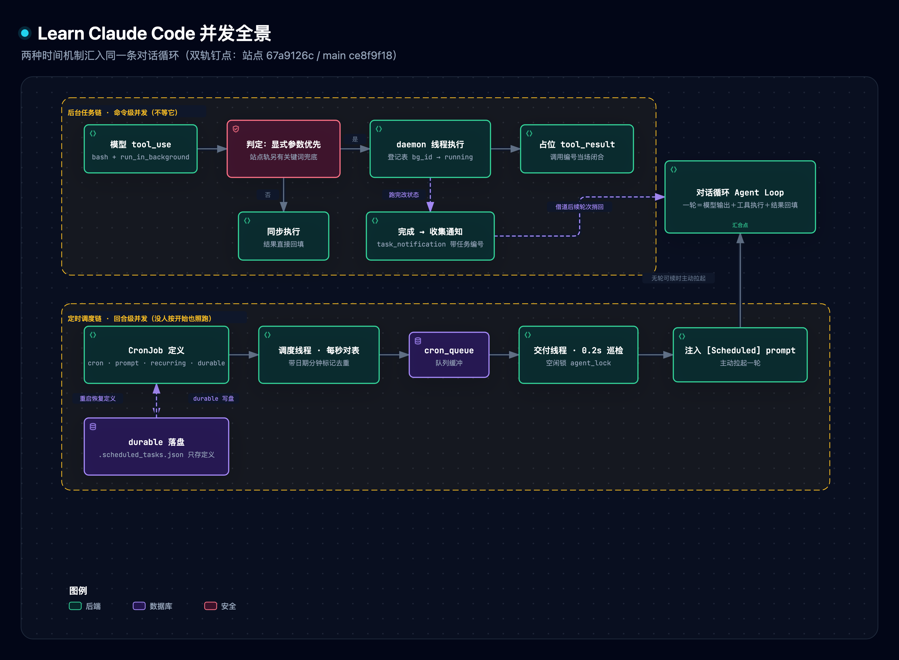

# 精读：Learn Claude Code「并发」——Background Tasks 与 Cron Scheduler

> [1] shareAI-lab, "Learn Claude Code," GitHub 仓库. 站点轨 s13_background_tasks 与 s14_cron_scheduler，所据版本 fix 分支 `67a9126c`（2026-07-29，与 learn.shareai.run 站点实况逐章对账）[2], [3], [4]；main 轨 s11_background_tasks、s12_cron_scheduler、s16_workflow_runtime，所据版本 upstream/main `ce8f9f18`（2026-09-28，写作时点即该轨最新）。真实产品行为以 Anthropic 官方文档对账 [5]–[10]。文中「CC」指 Claude Code 本体。

**一句话定位**：同一门课里两种「把时间从对话里拆出来」的机制。后台任务让慢命令的执行不挡对话的路（不等它）；cron 调度让定时触发不依赖任何人在场（没人按开始也照跑）。

先交代阅读坐标。课程有两个在版谱系：20 章的站点轨（源码版本与站点实况逐章对齐）与 17 章的 main 轨（仓库主干，写作时点最新）。两轨在「并发」这部分讲的机制骨架相同，工程完整度不同，下文统称「站点轨」「main 轨」，引用章节一律带目录名，不裸用章号（两轨 s13/s14 撞号，站点轨 s13 是 background_tasks，main 轨 s13 是 agent_teams，完全是两回事）。

**导读**。先交代共识背景：Agent 的工作方式是对话循环。模型每轮发出文本和工具调用；执行工具、推进对话的是模型外围的一层程序（下文称宿主，课程称 Harness），它执行完、把结果回填成一条消息，模型才能进下一轮。痛点：一条要跑十分钟的安装命令会把整个循环卡在原地；而「每天早上九点跑测试」这种需求，到点时根本没有用户来发消息。本文回答两个问题：怎么让慢命令不挡路、结果还能体面地回来；怎么让时间自己充当触发者。§1 拆问题与设计规格，§2 给全貌地图，§3–§5 逐个拆三种核心机制（每种都带具体输入的走查和原型实测），§6–§7 给官方文档对账的数字与自己动手的实验，§8–§9 收拢规律、争议与适用边界。原型在 `docs/research/agent-harness/assets/lcc_concurrency_lab.py`，纯标准库可直接运行。

> [!TIP]
> **白话主线**：Agent 的对话是一问一答的循环，每次工具调用必须立刻有结果回填，模型才能进下一轮；一条十分钟的命令会把循环卡死，而定时任务到点时又没人来敲门。后台任务的解法是先回一张带编号的占位回执，命令扔进后台线程跑，跑完后结果作为一条独立通知在后续某一轮注入对话。定时调度的解法是一个不看对话的调度线程每秒对一次表，到点把任务塞进队列，另一个线程等 Agent 空闲时把它作为新消息拉起一轮执行。验证靠教学原型实测：后台命令在 Agent 干别的事时完成并注入通知；没有任何人输入时，定时任务照样被自动交付执行。

## 1. 它要解决什么问题

课程开篇用一个生活比喻切入（此为课程材料自己的说法，不是本文引入的类比）：你用过洗衣机吗？衣服扔进去按下启动就去干别的，三十分钟后它提醒你好了，你不会站在机器前干等。下一章的比喻是闹钟：设好七点，到点它自己响，你在睡觉它也照响。两个比喻各指向一种时间困境：「不必在场等一件事完成」与「不必在场促成一件事开始」。

剥掉比喻，两个痛点在工程上都很具体。第一，同步执行的代价。读文件是毫秒级，`git status` 一秒内返回，这类调用同步等一等无所谓；但 `npm install` 是分钟级。一条命令没返回，同一次响应里的下一个工具调用排不了队，下一轮模型请求也发不出去。整条对话在原地踏步，而每一轮等待都在烧按 token 计费的钱 [1], [2]。第二，触发的在场依赖。后台任务解决了「慢」，但所有操作仍然由人触发：你说一句，Agent 动一下。「每天 9 点跑测试」「每 30 分钟检查 CI」这类周期任务，如果只靠对话循环，用户得每次到点自己重新发消息 [1]。

理解后续机制需要三个前置概念，都在这里讲清。

**Agent Loop（对话循环）**：模型与宿主的协作单位是「轮」。一轮里模型输出文本加若干工具调用，宿主执行工具、把结果拼成一条 user 消息回填，再请求模型的下一轮；模型不再调用工具时，这轮对话结束。本文所有时间机制都以「轮」为基本刻度；「卡住」就是卡在某一轮的工具执行上。

**tool_use / tool_result 配对**：模型对话接口（Messages API）的硬规矩。模型发出的每个工具调用（tool_use 块）必须恰好回一个结果块（tool_result），这一轮才能闭合。它是后文「为什么必须先回占位、通知另开新事件」的协议根据。

**daemon 线程**：Python 里用 `threading.Thread(daemon=True)` 启动的后台线程，主进程退出时它被一并回收。教学实现全靠它表达「随进程生灭」的语义，也是后面 durable 边界的载体。

把两个痛点翻成六条设计规格，就是全文的总纲：

| 规格 | 通俗版 | 对应机制 |
| --- | --- | --- |
| 慢命令不得阻塞对话循环 | 命令丢后台，对话继续走 | `run_in_background` 判定 + daemon 线程执行 |
| 协议配对必须立刻满足 | 每次调用当场要有回话 | 占位 `tool_result`（带任务编号） |
| 完成是滞后事件，独立进场 | 结果到了走新通道 | `<task_notification>` 注入后续轮次 |
| 时间触发独立于对话 | 没人盯着也要到点 | 调度线程每秒对表 + 分钟标记去重 |
| 「到点了」与「有空了」解耦 | 到点不等于有空 | `cron_queue` + 交付线程持空闲锁 |
| 任务定义与调度器生命周期分离 | 存下来不等于一直在跑 | durable 落盘 `.scheduled_tasks.json`，节拍器活在进程内 |

## 2. 全貌解剖

整块材料可以按「读者会问的三个问题」分层。

**它由哪些部分组成？** 分层矩阵如下（第一层是必须精读的地基，第二层是评判真伪的证据，第三层是课程地图上的邻居）：

| 层级 | 部分 | 回答的问题 |
| --- | --- | --- |
| 地基与核心机制 | 占位回执 + 通知注入（判定、生命周期、循环集成） | 「不等它」怎么实现：命令跑着，对话怎么继续、结果怎么回来 |
| 地基与核心机制 | cron 四层解耦（CronJob、表达式语义、调度、队列、交付、消费） | 「没人按开始也照跑」怎么实现：到点与空闲两件事怎么衔接 |
| 地基与核心机制 | durable 持久化与交付语义 | 「跨重启」到底保留了什么、没保留什么；丢与重怎么选 |
| 证据链群 | 双轨代码差异（启发式兜底与轮询收集 ↔ 仅显式参数与前置注入、失败回滚、原子写盘） | 教学取舍怎么演化，哪些是骨架、哪些是可换的实现 |
| 证据链群 | 官方文档口径（后台时限、输出上限、退出回收；定时三轨、抖动、过期、上限） | 教学机制在真实产品里长什么样，数字对不对 |
| 领域地图坐标 | main 轨 s16_workflow_runtime（事件循环扇出式并发） | 线程式并发之外，同一门课还有什么并发形态（附录简述） |

**部分之间是什么关系？** 一条因果链把它们串起来：

> 观察：慢命令卡死对话、周期任务没人推 → 归因：执行与对话耦合在一个同步循环里，触发权耦合在人的在场 → 设计规格：§1 的六条 → 机制：后台线程 + 占位 `tool_result` + 通知注入；CronJob + 每秒对表 + 分钟去重 + 队列 + 空闲锁 + 持久化文件 → 证据闭环：原型实测（后台完成时 Agent 在干别的事、无人输入时定时任务自动执行、拆组件各有退化）+ 双轨对照 + 官方文档数字。

其中「后台任务」和「cron 调度」不是并列的两件事，而是同一条注入通道的两个源头：前者往后续轮次里放的是「命令完成了」的结果事件，后者在无轮可搭时专门拉起一轮、放进去的是一条新任务。这句话是全文最重要的一张对照表，记住它，后面所有细节都挂得上。

*图 1 · 两种时间机制汇入同一条对话循环：后台任务借道后续轮次捎回结果，cron 在无轮可续时由交付线程主动拉起一轮。图源：[lcc-concurrency--panorama.mmd](../../assets/mermaid/agent-harness/lcc-concurrency--panorama.mmd)。*


> 交互版（下载到本地打开）：[`lcc-concurrency--panorama.html`](../../assets/architecture/agent-harness/lcc-concurrency--panorama.html) · 双主题渲染 [`dark`](../../assets/architecture/agent-harness/lcc-concurrency--panorama-dark.png) / [`light`](../../assets/architecture/agent-harness/lcc-concurrency--panorama-light.png)

**哪些最值得关注？** 按价值排序：① 占位回执与通知注入，两轨与真实产品共有的协议骨架；② cron 四层解耦与空闲交付；③ durable 边界，课程专门设了警示的最易误解点；④ 判定权从关键词猜测到显式参数的演化（双轨差异揭示的真实设计教训）；⑤ main 轨补上的失败路径（模型失败回滚重入队、原子写盘即先写临时文件再整体替换、至少一次交付）。

## 3. 后台任务：占位回执与通知注入

从最具体的处境说起。模型这一轮发出了两个调用：`npm install`（要十分钟）和读一个配置文件（毫秒级）。同步执行意味着宿主（执行工具、推进对话的那层程序）先干等十分钟装完依赖、再读文件，然后把两个结果一起回填。对话里的其他一切，用户的新消息、别的工具调用，都在等这一条命令。如果后续工作并不依赖这条命令，这个等待纯属浪费 [1], [2]。

### 谁决定进后台

课程两轨在这里给出了同一个骨架的两种判定策略。站点轨 s13_background_tasks 的规则是「显式请求优先，启发式兜底」：模型可以通过 bash 工具参数表（schema）里的 `run_in_background` 参数显式请求后台执行；模型没指定时，教学版退回关键词启发式，命令里出现 install、build、test、deploy、compile、make 这类词就猜它「大概率超过三十秒」，送后台 [1]。main 轨 s11_background_tasks 把兜底删了，判定收敛成一条：`tool_name == "bash"` 且 `run_in_background is True`，其他一切同步执行，原话是「不再根据 install、build 或 test 等关键词猜测」[2]。

为什么删？关键词猜测会两头误判。快命令被误判成慢：`grep install notes.txt` 只是搜一个词，命中关键词却可能被送后台。慢命令被误判成快：一条名字干净的重索引命令，关键词看不出来，显式参数看得出。更深一层，该不该后台不只取决于快慢，还取决于后续工作是否依赖它的结果，这一点只有看得见整段对话的模型能判断，宿主侧的任何静态规则都判不了。这个演化为 §8 的规律二和争议一提供了全部素材。

### 生命周期：登记、跑、收

判定通过后，宿主做三件事 [1], [2]：

1. **登记**：给任务发一个唯一编号（如 `bg_0001`），把「调用编号、命令、状态 running」写进一张带锁的登记表。
2. **执行**：把命令包进一个函数，扔进 daemon 线程跑。主线程不等待，立刻给模型回占位结果：「后台任务 bg_0001 已启动，完成后另行通知」。这一轮就此闭合，模型看到回执，接着安排读配置文件。
3. **收集**：后台线程跑完，把输出记进登记表、状态改成 completed。等对话进入后续某一轮，宿主把已完成的结果从表里取出，格式化成 `<task_notification>`（含任务编号、状态、命令、摘要）注入。

两轨在「收集的时机」上有一处实现差异：站点轨在工具循环收尾时顺带收集，通知和本轮工具结果拼进同一条 user 消息 [1]；main 轨在每次调用模型之前先跑一遍注入函数，有已完成的结果就作为独立消息塞进对话开头 [2]。骨架相同，站位不同。

真实 Claude Code 的对应形态（官方文档口径）：后台命令立即返回任务 ID，输出写进文件，模型用读取工具取输出；`/tasks` 列出并停止后台任务；`Ctrl+B` 可以把一个正在前台跑的命令移到后台；前台命令超时后自动转后台（以 sleep 开头的命令除外）；无人值守会话（`-p` 一次性无界面运行、CI 持续集成机器、云端会话）里后台命令有 30 分钟默认时限、最长 2 小时，本地交互会话不限时 [8], [9]。教学机制与这套官方行为在骨架上一致，细节差异进 §6 对账。

### 通知为什么不能复用原编号

这是全章最容易被轻轻放过、其实最值得停一下的设计。像点单取餐：店员先给你一张小票（占位回执，当场把这笔订单闭合），餐好了叫号广播是一条新事件，不会把小票收回重写。通知与回执各用各的编号，机制上要区分两种编号：回执占的是「调用编号」（tool_use_id，协议配对用，一个调用恰好一个结果，占位已经把它用掉了）；通知携带的是「任务编号」（bg_id，让模型知道是哪条命令完成了）。完成是时间上滞后的新事件，所以进场走新通道；把结果填回原调用编号，等于一个编号配了两个结果，协议配对被破坏。课程两轨在这点上一字不差：完成通知绝不回填原调用的 tool_use_id，一个 tool_use 恰好对应一个 tool_result [1], [2]。

### 走查：两个回合里发生了什么

给一个具体输入，按机制单步走一遍（教学版的时序，与两轨 README 的示例一致 [1], [2]）：

- 输入：模型发出 `bash(npm install, run_in_background=true)` 和 `read_file(package.json)`。
- 第 1 轮分派：install 过判定 → 登记 bg_0001、进后台线程 → 回占位结果；read_file 同步执行 → 回文件内容。两个结果回填成一条 user 消息，第 1 轮闭合。
- 后台：线程里 install 继续跑，与对话无关。
- 第 2 轮：收集函数查登记表（站点轨在本轮工具跑完、组装回填消息时查；main 轨在请求模型之前查）。若 install 已完成，取出输出、格式化成 `<task_notification>`（带 bg_0001）注入；若没完成，什么都不注入，对话照常。模型看到的是「配置文件内容 + 安装完成通知」，据此决定下一步。

原型实测（实际运行日志，`--selftest` 场景 `bg_lifecycle`）：

```text
bg_lifecycle: {'turn1_placeholder': 'bg_0001', 'notification_turn': 'turn2', 'dup_tool_use_id': 0}
```

第 1 轮拿到占位回执，通知在第 2 轮注入，重复编号为零。把通知改成复用原调用编号（破坏性实验 `--break reuse-tool-use-id`），重复编号从 0 变 1，协议层第一个被破坏的就是配对唯一性。

## 4. 定时调度：调度、队列、交付、消费四层解耦

后台任务解决的是「等它」，没解决「谁来按开始」。要每天 9 点跑测试，难点不在执行（后台任务已经会跑了），而在触发：到点的时候，对话可能正忙着，也可能根本没人在用。让对话循环自己看表是行不通的：它要么正在执行一轮，要么在等输入，没有一双永远盯着钟的眼睛 [1]。

### 任务长什么样：CronJob 与五段式表达式

每个定时任务是一个 `CronJob`：表达式（cron）、触发时注入的指令（prompt）、是否周期（recurring）、是否持久（durable）[1], [3]。表达式是 Unix 世界用了五十年的五段式：分钟、小时、日、月、星期，支持 `*`、`*/N`、`N`、`N-M`、`N,M`。写法示例：`0 9 * * *` 每天 9:00，`*/5 * * * *` 每 5 分钟，`0 9 * * 1-5` 工作日 9:00 [1]。

匹配语义里埋着一个反直觉的坑：**日位与星期位同时写了具体值时，命中任意一个就算到点（OR），不是直觉以为的「且」**；其余字段（分钟、小时、月）仍是全部满足。像会员日规则。「每月 15 号或每逢周五」打折，日历的两种写法任一命中就是特殊日。这个比方到此为止：它只覆盖「日 × 星期」这一对，分钟、小时、月仍是「且」，不能外推。走一个具体例子（表达式 `0 9 15 * 5`，即 9:00 且「15 号或周五」）：2026-03-13 是周五但不是 15 号 → 命中，触发；2026-03-15 是周日且恰好 15 号 → 命中，触发；2026-03-16 是周一且是 16 号 → 两者都不中，不触发。这是经典定时实现 vixie-cron 确立的标准语义（五段式表达式在 Unix 世界已用了五十年），教学两轨与官方文档一致 [1], [3], [5]。

注册前还有一道校验：字段数量、取值范围不合法的表达式直接拒绝，从磁盘加载持久化任务时同样跳过非法条目；一个坏任务不该拖垮调度器 [1], [3]。

### 四层解耦：到点了，与有空了

课程的解法是把「定时」拆成四层，各管一件事 [1], [3]：

1. **调度线程**：daemon 线程，独立于对话运行，每秒读一次本地时间。表达式匹配且这一分钟没触发过，就把任务放进队列。它只对表，绝不执行。
2. **队列**：`cron_queue`，把「到点了」这件事先存住。
3. **交付线程**：每 0.2 秒查一次「队列有活吗」和「Agent 空闲吗」。两个条件同时满足，才拉起一轮对话循环；判断「空闲」用的是一把非阻塞的空闲锁（`agent_lock`），保证定时回合不会与用户正在进行的回合同时修改会话。
4. **对话循环**：从队列取出任务，把任务里写好的 prompt 作为一条新的 user 消息注入，交给模型执行。

像快递驿站：商家按自己的节拍发货（调度），包裹先存进驿站（队列），你有空了去取（消费）。「到了」和「你有空了」是两件事。这个比方的边界：驿站靠你自己上门，交付线程是主动拉起一轮执行，还会判断你是否空闲。四层的价值正来自节拍的不可调和：调度线程每秒一拍，对话循环忙闲不定，中间没有队列的话，要么忙时漏点、要么闲时空转。去重也有讲究：调度线程给每次触发记一个**带日期**的分钟标记（`YYYY-MM-DD HH:MM`），同一分钟只放行一次；标记里保留日期维度，不同天的同一分钟才不会互相顶掉 [1]。

### 走查：没人输入，任务照跑

单步走一遍（教学版时序 [1], [3]）：

- 输入：注册一个任务 `cron="*/2 * * * *"`, `prompt="run date"`, `durable=true`；此后用户不再输入任何内容。
- 调度线程：每秒对表。第 2 分钟的某一秒，表达式匹配、分钟标记未记 → 任务入队、标记记下。
- 交付线程：下一轮 0.2 秒巡检发现队列有活，尝试取空闲锁。对话没在跑，取到 → 拉起一轮对话循环。
- 对话循环：从队列取出任务，注入 user 消息 `[Scheduled] run date`，模型收到后执行 date 命令、回复结果。全程没有任何用户输入。

原型实测（实际运行日志，`--selftest` 场景 `queue_delivery`）：

```text
queue_delivery: {'delivered_without_user_input': True, 'prompts': [('scheduled', '[Scheduled] run date')]}
```

真实产品的同构行为（官方口径）：调度器每秒检查到期任务、以低优先级入队，「在你的一轮之间触发，而不是模型正在回复时」；模型正忙则等到本轮结束 [5]。

## 5. durable 与交付语义：定义跨重启，节拍随进程

「durable（持久）」这个词最容易听出超过它本义的承诺。它的实际含义：任务的定义——表达式、prompt、是否周期——写进磁盘上的 `.scheduled_tasks.json`，进程重启后原样恢复；但每秒对表的那个节拍器是活在进程里的一条 daemon 线程，进程一关它就停，没有任何外部力量到点叫醒它。课程两轨都为此写了专门的边界说明（站点轨用加粗警示框、main 轨用「运行边界」一节），大意是：重启之后，先回来的是任务定义，节拍器要等调度线程重新起步才恢复；停机期间错过的时刻不会补跑，最早也要等到重启后的下一个到点。真要让应用关着也能按时跑，表就不能交给应用进程，得交出去：操作系统自带的定时机制，或者进程外的常驻服务 [1], [3]。

像纸质日程本：本子上写好的计划跨年都在（定义持久化了），但那天没人翻开本子，事就不会发生。比方的边界：纸本永远被动等人翻，durable 任务在进程重启后会自动被调度器重新拾起，下次到点照常触发，纸本不会「下次到点自动响」。

重启后还有两个细节值得点破。**不补跑**：停机期间错过的时间点不会补，调度器只管下一次到点（main 轨 s12_cron_scheduler 与官方文档口径一致 [3], [5]）。**已入队的任务不丢**。main 轨比站点轨多出一套「至少一次交付」的完整实现：任务到点时先把「待交付」状态写进磁盘，再放进队列。进程若在已入队、模型还没确认接收之间崩溃，重启加载时会看到待交付标记，于是把任务重新放回队列，再交付一次。代价明说：同一任务可能在重启后被执行两次 [3]。配套的还有模型调用失败时的回滚：注入的 `[Scheduled]` 消息从会话里撤掉、任务重新入队，确认状态回写失败则恢复原状 [3]。

这套取舍在真实产品里同样存在，只是分层了：官方的会话级定时（`/loop` 与 cron 工具）恢复会话时不补过期的一次性任务、错过的多次触发只跑一次（偏「宁丢勿重」）；桌面版 Desktop 定时任务在唤醒后「最多补跑最近错过的一次」（明确的 catch-up 策略）；云端 Routines 干脆把调度挪出本机，电脑关了也照跑 [5], [6], [7]。教学选择与产品分层的对照，正是 §8 争议二的素材。

## 6. 关键实证数字

这一节把双轨（站点轨与 main 轨两套课程版本）材料和官方文档的关键数字汇总成一张表。「源码考古」指课程对 CC 源码的分析引述（站点轨折叠块），「官方」指 Anthropic 文档现行口径，两者冲突处以版本差异并陈、不作现行值断言。

| 数字 | 数值 | 条件·截至 | 一句话读法 |
| --- | --- | --- | --- |
| 调度检查间隔 | 1 秒 | 教学两轨一致；官方「checks every second」[5]，截至 2026-10 | 每秒对表是两套实现共同的选择 |
| 会话级任务上限 | 50 个（8 字符 ID） | 官方 [5]；站点轨源码考古 `MAX_JOBS=50` 同值 [1] | 上限防的是任务表无限膨胀 |
| 周期任务寿命 | 7 天自动过期（过期前最后一次触发后删除） | 官方 [5]；站点轨源码考古同值（可配置、上限 30 天）[1] | 给「被遗忘的循环」兜底 |
| 触发抖动（周期） | 官方：最多晚 30 分钟，或间隔之半（更频繁任务）；按任务 ID 确定性偏移 | 官方现行 [5]，截至 2026-10 | 防大量任务在同一整点齐挤服务；同任务偏移恒定 |
| 触发抖动（源码考古） | 最多晚「间隔的 10%、上限 15 分钟」 | 站点轨对 CC 源码的分析 [1] | 与官方现行口径不一致，版本漂移的实证，两说并陈 |
| 一次性任务抖动 | 整点/半点任务最多早 90 秒 | 官方 [5]；站点轨源码考古同值 [1] | 想准点就避开 :00/:30 |
| 后台命令时限 | 无人值守会话默认 30 分钟、最长 2 小时；本地交互会话不限时 | 官方 [8]，截至 2026-10 | 时限只约束「没人看着跑」的场景 |
| 后台输出上限 | 超 5GB 自动终止 | 官方 [9] | 失控输出的物理闸 |
| headless 退出回收 | 无界面一次性运行（`-p`）结束后约 5 秒回收后台 shell | 官方 [10] | 结果交付的宽限期 |
| 前台工具并发 | 并发安全类工具默认 10（`CLAUDE_CODE_MAX_TOOL_USE_CONCURRENCY`） | 站点轨源码考古 [1]；官方文档未述 | 后台 bash 无硬限（独立子进程） |
| 输出停滞看门狗 | 45 秒无增长即检测交互提示（如 `(y/n)`） | 站点轨源码考古 [1]；官方文档未述 | 防后台任务卡在无人应答的对话框 |
| 云端 Routines 最小间隔 | 1 小时（更频繁被拒绝） | 官方 [6]，research preview | 云轨与本地轨的粒度分界 |

三个核心宣称的独立证据交代：后台命令「立即返回任务 ID、输出写文件、读取工具取结果」有官方文档直接支撑 [8], [9]；「每秒检查、轮到空闲才触发」有官方文档直接支撑 [5]；「教学线程模型对应真实产品的事件循环」这一宣称只有课程单方陈述（按课程对源码的分析，真实产品跑在 Node.js/Bun 的单线程事件循环上，所谓后台执行只是不去等待那个异步任务的落定 [1]），官方文档不涉及进程模型，本文按课程口径陈述并列入未证明事项。

## 7. 动手实验室

原型是 `docs/research/agent-harness/assets/lcc_concurrency_lab.py`（纯标准库、确定性、约 500 行；模型的行为由预先写好的脚本扮演，原型只验证机制自洽，不回答模型能力）。实验沙箱建在系统临时目录下，每次运行前重建。运行方式：

```sh
python3 docs/research/agent-harness/assets/lcc_concurrency_lab.py --selftest   # 10 个场景全断言
python3 docs/research/agent-harness/assets/lcc_concurrency_lab.py --break no-minute-dedupe  # 单点破坏
```

机制到代码行号速查（行号为当前版本实测）：

| 机制 | 位置（grep -n 实测起始行） |
| --- | --- |
| 启发式兜底 | `is_slow_operation` L25 |
| 判定（显式优先/仅启发式/破坏开关） | `should_run_background` L32 |
| 后台生命周期（登记/线程/收集/通知格式） | `BackgroundManager` L58 |
| 占位回执 + 通知注入的循环集成 | `agent_loop` L122 |
| 五段式字段匹配（含 DOM/DOW OR） | `_field_matches` L147、`cron_matches` L161 |
| durable 存取与至少一次交付 | `CronJob` L183、`CronStore` L191 |
| 空闲锁交付 | `drain_queue` L259 |

破坏性实验五则（每则：改了什么 / 实测观察到什么 / 一句话教训；均为实际运行日志）：

| 实验 | 改动 | 实测退化 | 教训 |
| --- | --- | --- | --- |
| 拿掉分钟去重 | `--break no-minute-dedupe`：去掉分钟标记检查 | 6 分钟窗口、每 2 分钟任务：入队 3 次 → **180 次（60 倍）**，同一任务被重复交付 | 轮询式调度在粒度边界必须有去重，否则「每秒检查」变成「每秒触发」 |
| 拿掉空闲锁 | `--break no-agent-lock`：交付线程不持锁硬闯 | 会话顺序从 `U1..U5 S1..S5`（切换 1 次）变成 `U1S1U2S2U3S3U4S4U5S5`（**回合切换 9 次**） | 定时回合与用户回合并发写同一份会话，消息互相穿插覆盖 |
| 轮询放稀 | `--break slow-poll`：检查间隔 1 秒 → 130 秒 | 每分钟任务 5 个应触发分钟只命中 **2 个（漏 3/5）** | 轮询间隔超过粒度窗口的两倍就开始漏点 |
| 通知复用调用编号 | `--break reuse-tool-use-id`：通知作为第二个同编号结果回填 | 重复调用编号 0 → **1**，协议配对被破坏 | 晚到的结果必须以新事件进场，回填旧编号即破坏配对 |
| 只认关键词判定 | `--break heuristic-only`：判定权只剩关键词 | 显式请求后台的长命令（名字无关键词）被否决，同步执行，对话被卡 **600 模拟秒**（正常 0） | 判定权交给不掌握上下文的规则，显式意图也会被否决 |

原型只证明机制逻辑按上述描述运作；它不构成对课程数字或真实产品行为的复现。文件里还有一个破坏开关 `--break dateless-marker`，改动的是分钟标记的记录粒度，结果留给读者亲手跑出来。

## 8. 底层规律与核心争议

五个机制拆完，往上收一层。五条规律各管一个维度：怎么回话（协议）、谁拍板（判定）、怎么排队（解耦）、留什么底（持久化）、丢不丢（交付语义）。合起来，它们覆盖一次异步工作从发出到落地的全部环节。

### 规律 1：晚到的结果必须以新事件进场（协议维）

请求-应答的配对名额当场就用掉了；凡是晚到的结果，都得开自己的新通道进场，不能回去补写旧账。没有这条，宿主要么干等慢命令破坏轮转，要么伪造「已完成」骗过协议。教学代码里占位结果与完成通知是两个独立块，官方文档同构（任务 ID 即回执、输出文件加读取构成新通道）[1], [2], [8]。理论锚点：G. Hohpe and B. Woolf, *Enterprise Integration Patterns*. Boston, MA, USA: Addison-Wesley, 2004（异步消息与相关标识模式）。

### 规律 2：判定权交给掌握上下文的一方（判定维）

「这条命令该不该后台」不由固定规则猜，由看得见整段对话的模型用显式参数标注；系统只提供机制。站点轨保留关键词兜底、main 轨删除、真实产品再加一条事实兜底（前台超时自动转后台，超时是比关键词硬的「慢」证据 [8]），这个演化方向本身是规律的演示。理论锚点：机制与策略分离的操作系统设计传统（S. J. Leffler, M. K. McKusick, M. J. Karels, and J. S. Quarterman, *The Design and Implementation of the 4.3BSD UNIX Operating System*. Reading, MA, USA: Addison-Wesley, 1989）。

### 规律 3：节拍不合的生产与消费之间必须插队列（解耦维）

一边每秒对表、一边不定时忙闲，两个节拍天然对不上；队列把「到点了」先存住，等「有空了」再交付，空闲锁保证同一时刻只有一方在写会话。让对话循环自己看表，忙时漏点、闲时空转。教学四层与官方「fires between your turns」同构 [1], [3], [5]。理论锚点：生产者-消费者有界缓冲问题及其信号量解法（A. Silberschatz, P. B. Galvin, and G. Gagne, *Operating System Concepts*, 10th ed. Hoboken, NJ, USA: Wiley, 2018, ch. 5）。

### 规律 4：定义与节拍分离（持久化维）

durable 持久化保存的是任务定义，不是那个每秒看表的节拍器；节拍器活在进程里，进程死它就停。把「任务别丢」与「进程别死」捆在一起时，进程一关任务全灭；分开后教学用最小代码保住前者，后者交给进程外调度；官方三轨（会话内、桌面本机、云端）正是按「节拍器放在哪」分层的 [5], [6], [7]。理论锚点：系统级调度的外部化传统（Vixie cron 将调度实现为常驻系统服务，区别于进程内定时器）。

### 规律 5：无人值守交付宁可重试不可静默丢失（交付语义维）

到点已入队的任务，崩溃重启后宁可再交付一次，也不悄悄丢掉；代价是任务必须容忍重复执行。main 轨显式选择「至少一次」并持久化待交付状态 [3]；官方会话级实现对过期一次性任务宁弃不留 [5]，同一维度上的两种真实选择，见争议二。理论锚点：消息交付语义（at-least-once 对 at-most-once；M. Kleppmann, *Designing Data-Intensive Applications*. Sebastopol, CA, USA: O'Reilly, 2017, ch. 8 的「恰好一次与幂等性」讨论）。

### 争议 1：该不该用关键词启发式猜「慢」

一派（站点轨教学）认为模型会忘设参数，关键词兜底能拦住多数慢命令；另一派（main 轨教学与真实产品）认为猜测必然误判：命令里出现 test 字样不等于它慢、后续依赖结果的命令不该后台化，所以只认显式参数。分歧源于两派看到的失败模式不同：前者取样「模型忘了标注 → 全程干等」，后者取样「关键词误命中 → 快命令被后台化或依赖乱序」，都是真实损失，只是频率与代价不同。这是工程问题而非本质难题：真实产品的混合解法（显式参数为主、超时事实兜底）已经给出一个可运行的折中 [1], [2], [8]。

### 争议 2：定时任务的交付语义——宁可重复还是宁可丢弃

一派（main 轨教学）选「至少一次」：待交付状态落盘，崩溃重启后照样交付，代价是可能重跑；另一派（官方会话级实现）偏「至多一次」：错过的时间不补、过期一次性任务恢复时直接丢弃，代价是任务可能悄悄没跑。两派对「什么更可怕」取样不同：前者怕丢（定时巡检漏一次可能放走故障），后者怕重（重复执行的可能是发消息、开 PR（提交代码修改请求）这类有外部副作用的动作）。这是本质难题的浅层：「恰好一次」需要两阶段确认与幂等键，对分钟级 prompt 注入过重；实践上靠把任务写成幂等（重复跑无害）来对冲，不可完全消除 [3], [5]。

其余双轨差异（收集站位、抖动参数口径、Windows 进程清理）属于版本与实现差异，已在受影响处两说并陈，不构成争议。

## 9. 适用边界

**成立条件**。定义域：单进程教学 Harness（Python 线程模型）之上的机制讲解，配 Messages API 配对语义与本地时区。最佳适用区间：被后台化的是后续工作不依赖其结果的 Bash 类慢命令；定时粒度为分钟级；任务在 Agent 进程存活期间到期。明确边界（Out-of-Scope）：多 Agent 团队与跨会话消息协议是课程姊妹篇（站点轨 s15_agent_teams 起 / main 轨 s13_agent_teams）；多会话、多实例并发持有任务的一致性（真实 CC 用锁文件协调，课程仅一句带过 [1]，教学与本文实验均未覆盖）；云端 Routines 的网络与 API 细节仅作边界对照；真实 CC 源码不逐行考古，课程所引源码事实只与官方文档对账、不作正文独立断言。教学代码自述的运行边界也不展开：main 轨的进程组清理只是生命周期清理而非沙箱隔离，定时回合中需要交互确认的工具调用会被拒绝，导入模块不会启动后台线程 [2], [3]。

**材料没有证明的事**：

1. 收益无实测：「LLM 按 token 计费，空转就是浪费」是论证不是测量 [1]，材料没有给出后台化省下多少 token 或时间的任何数字。
2. 站点轨源码考古的两组数字，45 秒输出停滞看门狗与并发安全类工具默认 10，官方公开文档未复述 [1]，本文不作现行值断言。
3. 启发式的误判率没有任何实验数据；main 轨删除启发式也没给量化依据，两轨各以设计论证立论 [1], [2]。
4. 调度线程每秒轮询的开销未被讨论；「进程内每秒对表」在高任务量下的成本与实时性材料未测。
5. 教学线程模型与真实产品事件循环的对应关系只有课程单方陈述（真实产品的事件循环上并无教学代码所用的线程结构 [1]），官方文档不涉及进程模型；本文以官方行为口径为准、进程模型仅作背景。

## 10. 用户自测与费曼研讨套件

1. 两条后台命令，A 用两分钟完成、B 用五十秒完成，但 B 先发出。通知到达的先后由什么决定？如果业务上必须先看到 A 的结果才能执行 B 相关的工作，这套机制给了你什么约束、你会怎么安排？（提示：完成先后而非发起先后；依赖前序结果的命令不该后台化，见 §3 与 §8 规律 2。）
2. 「每周五下班前汇总本周告警」：会话内 `/loop`、桌面本地任务、云端 Routines 三档各在什么条件下成立？如果汇总必须读本机日志文件、而那台机器周五经常提前关机，你会怎么组合？（提示：读本地文件需要本机执行，关机需要进程外节拍，见 §5 与官方三轨 [5], [6], [7]。）
3. 费曼研讨：「至少一次交付」意味着同一个 prompt 可能被执行两次。举三个具体任务分别说明能容忍与不能容忍的原因；不能容忍的，怎么改写任务让它幂等？（提示：外部副作用的不可逆性；见 §8 争议 2。）

## 参考（IEEE）

- [1] shareAI-lab, "Learn Claude Code: s13_background_tasks & s14_cron_scheduler," GitHub repository, fix-branch commit 67a9126c, Jul. 29, 2026. [Online]. Available: https://github.com/shareAI-lab/learn-claude-code （站点实况 learn.shareai.run 与该钉点逐章对账，2026-10-07 复核）
- [2] shareAI-lab, "Learn Claude Code: s11_background_tasks," GitHub repository, upstream/main commit ce8f9f18, Sep. 28, 2026. [Online]. Available: https://github.com/shareAI-lab/learn-claude-code
- [3] shareAI-lab, "Learn Claude Code: s12_cron_scheduler," GitHub repository, upstream/main commit ce8f9f18, Sep. 28, 2026. [Online]. Available: https://github.com/shareAI-lab/learn-claude-code
- [4] shareAI-lab, "Learn Claude Code: s16_workflow_runtime," GitHub repository, upstream/main commit ce8f9f18, Sep. 28, 2026. [Online]. Available: https://github.com/shareAI-lab/learn-claude-code
- [5] Anthropic, "Run prompts on a schedule," Claude Code Docs. [Online]. Available: https://code.claude.com/docs/en/scheduled-tasks (accessed Oct. 7, 2026).
- [6] Anthropic, "Automate work with routines," Claude Code Docs. [Online]. Available: https://code.claude.com/docs/en/routines (accessed Oct. 7, 2026).
- [7] Anthropic, "Schedule recurring tasks in Claude Code Desktop," Claude Code Docs. [Online]. Available: https://code.claude.com/docs/en/desktop-scheduled-tasks (accessed Oct. 7, 2026).
- [8] Anthropic, "Tools reference," Claude Code Docs. [Online]. Available: https://code.claude.com/docs/en/tools-reference (accessed Oct. 7, 2026).
- [9] Anthropic, "Interactive mode," Claude Code Docs. [Online]. Available: https://code.claude.com/docs/en/interactive-mode (accessed Oct. 7, 2026).
- [10] Anthropic, "Run Claude Code programmatically," Claude Code Docs. [Online]. Available: https://code.claude.com/docs/en/headless (accessed Oct. 7, 2026).

## 附录：main 轨 s16_workflow_runtime 对照

并发这门课在 main 轨还有第三种形态：s16_workflow_runtime 的「事件循环扇出式并发」。它不改对话循环，而是在工具池里加一个 `Workflow` 工具：模型一次调用，背后由保存好的可信脚本编排多次子 agent 调用。`parallel()` 是等齐屏障，所有任务并行跑完一起收；`pipeline()` 不等齐，每个条目独立走完各阶段，A 在第 3 阶段时 B 可能还在第 1 阶段。中间结果存变量不进对话历史，每步调用写进磁盘 journal，断了就用调用内容的稳定哈希续跑，没改过的调用直接吃缓存 [4]。与本文两种机制的对照：后台任务并发的是**命令**（子进程/线程），cron 并发的是**回合**（错开时间点），workflow 并发的是**子 agent**（事件循环上的扇出）。三种并发各在一层，互不替代。本篇不展开，见 main 轨 s16_workflow_runtime 原文 [4]。
